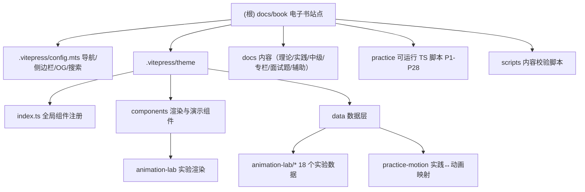

# CLAUDE.md

本文件保留 AI 维护本 VitePress 电子书站点时必须知道的规则与全局架构索引。组件清单、目录快照与逐条历史以代码和 `scripts/check-*.mjs` 为准，不在此处长期维护。

## 项目定位

- 项目是 VitePress 电子书站点：**从零构建 AI Coding Agent — OpenCode 源码剖析与实战**。
- 工作目录是 `docs/book/`。
- 内容源目录是 `docs/`，主题与组件在 `.vitepress/theme/`。
- 包管理器优先使用 `bun`（部署兼容 `pnpm`，不使用 `npm`）。

## 架构总览

- 站点框架：VitePress 1.5 + Vue 3 SFC；图表用 Mermaid（`vitepress-plugin-mermaid` + `withMermaid`）。
- 语言：TypeScript（配置/组件/数据层）、Markdown（内容）、JavaScript ESM（校验脚本）。
- 实践脚本运行时：Bun（`practice/*.ts`，依赖 `openai`、`@modelcontextprotocol/sdk`）。
- 部署：Caddy 静态服务（`railpack.toml` + `Caddyfile`），构建产物在 `.vitepress/dist`。
- 核心模式：**数据驱动渲染**——内容元数据、实践项目、学习路径、动画实验集中在 `.vitepress/theme/data/`，组件只渲染；演示组件的可测试编排逻辑下沉到同名 `*Scenario.ts` 并配 `*.test.ts`；内容一致性由 `scripts/check-*.mjs` 在 `build:strict` 中串联守护。

## 模块结构图



## 模块索引

| 模块路径 | 职责 | 语言 | 文档 |
| --- | --- | --- | --- |
| `.vitepress/config.mts` | 站点配置、导航、侧边栏、OG meta、搜索预处理、内联 frontmatter 解析 | TS | - |
| `.vitepress/theme` | 主题入口、全局组件注册（同步 19 + 异步 67 + 额外 2）、`custom.css` | TS + Vue | - |
| `.vitepress/theme/components` | 约 95 个渲染/演示组件 + 场景逻辑 `*Scenario.ts` + 单测 | TS + Vue | [查看](./.vitepress/theme/components/CLAUDE.md) |
| `.vitepress/theme/data` | 数据层：内容元数据、实践项目、学习路径、动画实验（18 个）、发现中心 | TS | [查看](./.vitepress/theme/data/CLAUDE.md) |
| `docs/` | 理论篇/实践篇/中级篇/专栏/面试题/辅助页等全部内容 | Markdown | - |
| `practice/` | P1-P28 可运行 TypeScript 实践脚本 | TS | [查看](./practice/README.md) |
| `scripts/` | 13 个内容/导航/实践/动画校验脚本（`build:strict` 串联） | JS (ESM) | [查看](./scripts/CLAUDE.md) |

## 常用命令

在 `docs/book/` 下执行：

```bash
bun install
bun run dev
bun run typecheck
bun run build:strict
```

常用定向校验：

```bash
bun run check:content
bun run check:practice
bun run check:learning-metadata
bun run check:navigation-entry
bun run check:animation-lab
bun run check:practice-motion
```

## 关键目录

```text
docs/book/
├── .vitepress/config.mts              # VitePress 配置、导航、侧边栏
├── .vitepress/theme/index.ts          # 全局组件注册
├── .vitepress/theme/components/       # Vue 组件与演示逻辑
├── .vitepress/theme/data/             # 内容元数据、实践项目、学习路径、动画实验数据
├── docs/                              # 站点内容页面
├── practice/                          # 可运行 TypeScript 实践脚本
├── scripts/                           # 内容与构建校验脚本
├── add-frontmatter.ts
└── remove-duplicate-titles.ts
```

## 内容组织

- 理论篇：`docs/NN-slug/index.md`，含 `00-20` 与 `oh-*` 特殊章节。
- 实践篇：`docs/practice/pNN-slug/index.md`，对应 `practice/pNN-slug.ts`。
- 中级篇：`docs/intermediate/NN-slug/index.md`，配 `docs/intermediate/examples/<NN-slug>/README.md` 示例。
- 专栏：四个，编号方案各不相同，新增页面务必同步 `config.mts` 对应侧边栏分组：
  - `docs/claude-code/`（Claude Code 架构思维）：扁平 `chapterNN.md`（01-20，5 大主线分组）+ `index.md` + `reading-guide.md`；`_archive/` 是旧版插件向章节（chapter01-15），被 `check-learning-metadata.mjs` 跳过且未进侧边栏，但 `config.mts` 未设 `srcExclude`，注意勿在正文链接到它。
  - `docs/hermes-agent/`（Hermes Agent 拆解）：描述式中文文件名，主干 `00`-`11`（共 12 章）+ 附录 `附录A`~`附录AE`（26 篇，编号有跳号），侧边栏按「Prompt/工具/记忆会话/运行时/扩展」主题分组。
  - `docs/new-claude/`：按 `part-1`~`part-4` 分目录组织。
  - `docs/enterprise-agent/`：`eNN-*` 主线（e00-e17）+ 设计模板/蓝图/检查清单等辅助页。
- 面试题：`docs/interview/`，含 `bagua/` 八卦分类子目录。
- 辅助页：`docs/discover/`、`docs/learning-paths/`、`docs/reading-map.md`、`docs/glossary.md` 等。

## Frontmatter 与内容约定

- 学习元数据字段以 `scripts/check-learning-metadata.mjs` 为准：校验仅作用于「种子页」或已带 `contentType` 的页面。
- 专栏（claude-code / hermes-agent 等）的**章节正文页通常无 frontmatter**，只以 H1 开头；完整学习元数据集中在专栏 `index.md`。新增专栏章节时按既有章节惯例处理，不必强加 frontmatter。
- 带 frontmatter 的页面正文不要重复保留与 `title` 完全相同的 H1。
- 内容链接相对于 VitePress `srcDir: docs`。
- 每章顶部通常放 `<SourceSnapshotCard>`，章末可放 `<StarCTA>`。
- 中级篇入口使用 `<EntryContextBanner>`。
- 实践篇章节使用 `<PracticeProjectGuide project-id="..." />`。

## 新增或修改内容

### 理论/中级/专栏章节

1. 修改对应 `docs/**` 页面。
2. 如新增页面，同步 `.vitepress/config.mts` 的导航或侧边栏。
3. 如影响学习路径、发现中心或推荐关系，同步 `.vitepress/theme/data/`。
4. 运行相关 `check:*`，必要时再跑 `bun run build:strict`。

### 实践章节

1. 修改 `docs/practice/pNN-slug/index.md`。
2. 如有脚本，维护 `practice/pNN-slug.ts`。
3. 同步 `.vitepress/theme/data/practice-projects.ts` 和 `practice-source-files.ts`。
4. 如关联动画实验，同步 `.vitepress/theme/data/practice-motion/index.ts`。
5. 运行 `bun run check:practice` 和相关校验。

### Vue 演示组件

1. 组件放 `.vitepress/theme/components/`。
2. Props 类型写入 `.vitepress/theme/components/types.ts`，动画实验室子组件类型写入 `components/animation-lab/type.ts`。
3. 在 `.vitepress/theme/index.ts` 注册。
4. 可测试的编排逻辑抽到同名 `*Scenario.ts`，并补对应 `*.test.ts`。
5. 单文件过长时拆子组件，优先复用已有数据层与场景模块。

### 动画实验室

- 实验是数据驱动的，不要为每个实验新建 `*Experiment.vue`。
- 实验数据放 `.vitepress/theme/data/animation-lab/`，导出 `canvas` 和 `experiment`。
- 在 `animation-lab-experiments.ts`、`scripts/check-animation-lab.mjs`、必要的侧边栏入口中同步注册。
- 渲染由 `AnimationLabIndex.vue`、`SystemMotionPlayer.vue`、`FlowExperimentCanvas.vue`、`TracePanel.vue` 负责。

## 编码规范

- TypeScript 禁止 `any`；类型定义单独放 `type.ts` / `types.ts`，不混进业务文件。
- 单文件不超过 500 行，超过则拆子组件或下沉到 `*Scenario.ts` / 数据层。
- 不使用 emoji，使用合适的 icon 组件替代。
- JS 包用 `bun`（部署兼容 `pnpm`），不用 `npm`。

## 调试入口

- 导航/侧边栏：`.vitepress/config.mts`
- 组件注册：`.vitepress/theme/index.ts`
- Props 类型：`.vitepress/theme/components/types.ts`
- 实践项目元数据：`.vitepress/theme/data/practice-projects.ts`
- 学习路径：`.vitepress/theme/data/learning-paths.data.ts`
- 内容元数据规范：`.vitepress/theme/data/content-meta.ts`
- 动画实验：`.vitepress/theme/data/animation-lab-experiments.ts` 与 `animation-lab/*.ts`
- 实践演示与动画实验映射：`.vitepress/theme/data/practice-motion/index.ts`

## 维护原则

- 不在本文件维护完整组件清单、章节清单或逐条历史；需要时直接读代码、脚本和 `.claude/index.json`。
- 做小而明确的修改，避免顺手重构。
- 文档、导航、数据和校验规则要保持一致。
- 修改后运行最小必要校验；发布前跑 `bun run build:strict`。

## 变更记录 (Changelog)

> 详细模块快照与覆盖率见 `.claude/index.json`；此处仅记关键结构变化。

- **2026-06-06** - `.claude/index.json` v4.2.0 断点续扫：深扫 claude-code（20 章 + _archive 旧稿）与 hermes-agent（12 主干 + 26 附录）两专区，补全各内容专区结构编目；增量补充「内容组织」专栏编号方案与「Frontmatter 约定」中专栏章节正文无 frontmatter 的事实。两专区结构与既有 frontmatter 约定、`config.mts` 侧边栏、校验脚本完全一致，未新建冗余模块文档。
- **2026-06-06** - 增量更新：补充架构总览、模块结构图（Mermaid）与模块索引；动画实验室由 11 增至 18 个实验；新增 `practice-motion` 数据模块；生成 `components` / `data` / `scripts` 三个模块级 `CLAUDE.md`。
- **2026-05-16** - `.claude/index.json` v4.0.0 全仓扫描，识别 8 个内容专区与配置/主题/数据/脚本模块。
