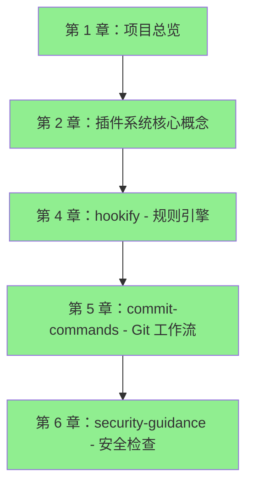
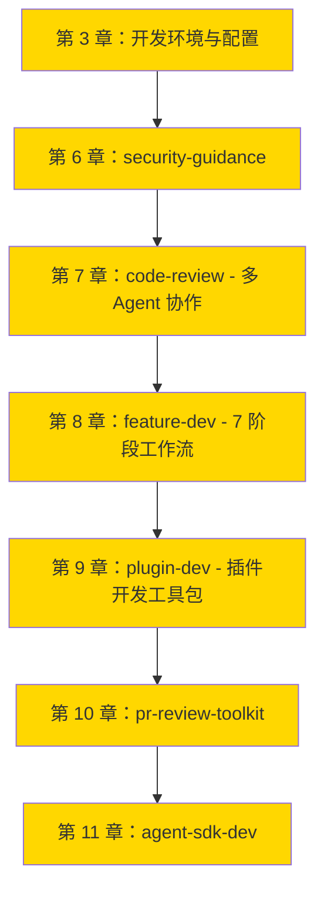
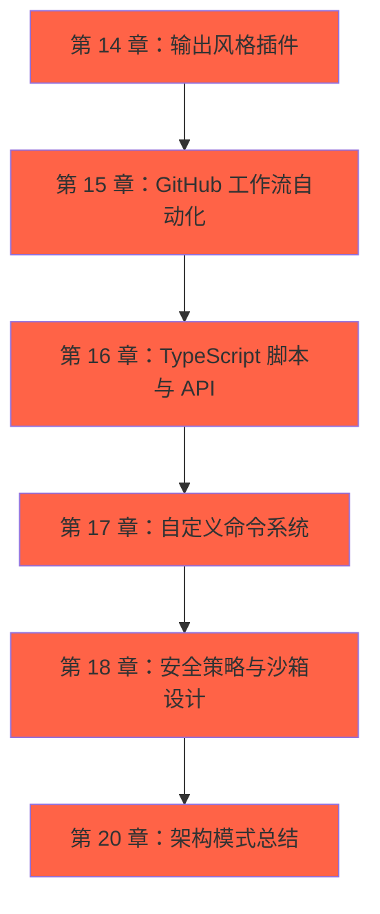
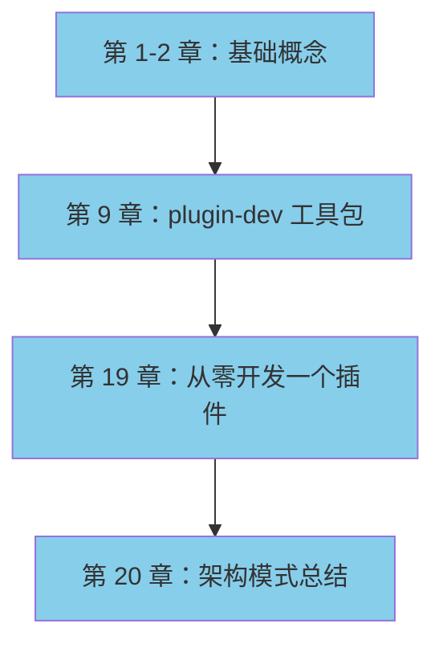

# 学习路径

根据你的背景和目标，我们设计了 4 条学习路径。每条路径都有明确的章节顺序、预计时间和学习成果。

---

## 🟢 新手路径（入门线）

### 适合人群
- 第一次接触 Agent 开发
- 想理解插件系统的基础概念
- 不熟悉 Claude Code 的工作原理

### 学习目标
- 理解插件系统的四大组件（命令/Agent/Hook/技能）
- 知道何时用命令、何时用 Agent、何时用 Hook
- 能看懂简单插件的实现
- 掌握插件的加载与执行流程

### 阅读顺序



### 章节详解

#### 第 1 章：项目总览（1-1.5 小时）
**为什么从这里开始**：
- 理解 Claude Code 的整体架构
- 掌握 202 个文件的组织方式
- 了解 13 个插件的分类和职责

**重点关注**：
- 模块结构图
- 插件 Marketplace 架构
- 统计数据与语言分布

**实践任务**：
```bash
# 克隆仓库
git clone https://github.com/anthropics/claude-code.git
cd claude-code

# 浏览目录结构
tree -L 2 plugins/
```

---

#### 第 2 章：插件系统核心概念（1.5-2 小时）
**为什么读这章**：
- 理解四大组件的区别和使用场景
- 掌握 YAML frontmatter 的设计模式
- 了解插件加载流程

**重点关注**：
- 命令 vs Agent vs 技能的区别
- Hook 的 9 种事件类型
- 插件的标准目录结构

**实践任务**：
```bash
# 查看插件目录结构
ls -la plugins/hookify/
ls -la plugins/commit-commands/

# 阅读命令定义
cat plugins/commit-commands/commands/commit-push-pr.md
```

---

#### 第 4 章：hookify - 规则引擎（1-1.5 小时）
**为什么读这章**：
- 学习最简单的 Hook 实现
- 理解规则引擎的设计模式
- 掌握 PreToolUse Hook 的拦截机制

**重点关注**：
- 规则定义格式（JSON 配置）
- PreToolUse Hook 的 Python 实现
- 4 种规则示例

**实践任务**：
```bash
# 安装 hookify 插件
claude
/plugin install hookify

# 查看规则示例
cat plugins/hookify/rules/console-log-warning.json
cat plugins/hookify/rules/dangerous-rm.json
```

---

#### 第 5 章：commit-commands - Git 工作流（1-1.5 小时）
**为什么读这章**：
- 学习命令的实现方式
- 理解 worktree 的处理逻辑
- 掌握命令的参数传递

**重点关注**：
- 3 个命令的职责分工
- allowed-tools 白名单
- Conventional Commit 生成

**实践任务**：
```bash
# 使用命令
/commit-push-pr

# 查看命令定义
cat plugins/commit-commands/commands/commit.md
cat plugins/commit-commands/commands/push-pr.md
```

---

#### 第 6 章：security-guidance - 安全检查（1-1.5 小时）
**为什么读这章**：
- 学习安全检查的实现
- 理解 Hook 的状态管理
- 掌握安全提醒的用户体验设计

**重点关注**：
- 9 种安全模式
- PreToolUse Hook 的检测逻辑
- 会话状态管理

**实践任务**：
```bash
# 安装插件
/plugin install security-guidance

# 查看 Hook 实现
cat plugins/security-guidance/hooks/pre_tool_use.py
```

---

### 预计时间
**总计**：4-6 小时

### 学习成果
完成新手路径后，你应该能够：
- [ ] 理解插件系统的四大组件
- [ ] 知道何时用命令、何时用 Agent、何时用 Hook
- [ ] 看懂简单插件的实现
- [ ] 理解规则引擎的设计模式
- [ ] 掌握 Hook 的事件拦截机制

### 下一步
- 继续阅读 [🟡 实战路径](#实战路径)
- 或者直接跳到 [🛠️ 插件开发路径](#插件开发路径)

---

## 🟡 实战路径（实战线）

### 适合人群
- 有一定编程经验
- 想学习复杂插件的实现
- 对多 Agent 协作感兴趣

### 学习目标
- 掌握多 Agent 协作的编排模式
- 理解工作流的设计原则
- 学习专业领域 Agent 的实现
- 掌握安全检查的实现模式

### 阅读顺序



### 章节详解

#### 第 3 章：开发环境与配置（1 小时）
**为什么读这章**：
- 理解三种安全策略（lax/strict/sandbox）
- 掌握 DevContainer 的配置
- 了解 Bash 沙箱的实现

**重点关注**：
- 三种安全策略的权衡
- Docker/Podman 双后端支持
- 工具白名单的实现

**实践任务**：
```bash
# 查看安全配置
cat examples/settings/settings-lax.json
cat examples/settings/settings-strict.json
cat examples/settings/settings-bash-sandbox.json

# 启动 DevContainer（VS Code）
# 命令面板：Remote-Containers: Reopen in Container
```

---

#### 第 7 章：code-review - 多 Agent 协作（2-3 小时）
**为什么读这章**：
- 学习多 Agent 协作的编排模式
- 理解验证子 Agent 的机制
- 掌握 GitHub API 集成

**重点关注**：
- 9 步审查流程
- 验证子 Agent 的二次检查
- 如何发布 PR 评论

**实践任务**：
```bash
# 使用命令
/code-review --comment

# 查看命令定义
cat plugins/code-review/commands/code-review.md

# 查看 Agent 定义
cat plugins/code-review/agents/verification-agent.md
```

---

#### 第 8 章：feature-dev - 7 阶段工作流（2-3 小时）
**为什么读这章**：
- 学习工作流的设计原则
- 理解阶段划分的粒度控制
- 掌握检查点的设计

**重点关注**：
- 7 个阶段的职责
- 阶段间的依赖关系
- 检查点的验收标准

**实践任务**：
```bash
# 使用命令
/feature-dev "实现用户认证"

# 查看命令定义
cat plugins/feature-dev/commands/feature-dev.md
```

---

#### 第 9 章：plugin-dev - 插件开发工具包（2-3 小时）
**为什么读这章**：
- 学习"开发工具的开发工具"
- 理解技能的渐进式披露
- 掌握插件开发的最佳实践

**重点关注**：
- 7 个技能的完整流程
- 60+ 参考文档体系
- 三层加载机制

**实践任务**：
```bash
# 使用技能
/plugin-dev:create-plugin "数据库迁移插件"

# 查看技能定义
cat plugins/plugin-dev/skills/create-plugin/SKILL.md

# 查看参考文档
ls -la plugins/plugin-dev/skills/create-plugin/references/
```

---

### 预计时间
**总计**：8-12 小时

### 学习成果
完成实战路径后，你应该能够：
- [ ] 掌握多 Agent 协作的编排模式
- [ ] 理解工作流的设计原则
- [ ] 学习专业领域 Agent 的实现
- [ ] 掌握技能的渐进式披露
- [ ] 理解插件开发的最佳实践

### 下一步
- 继续阅读 [🔴 进阶路径](#进阶路径)
- 或者实践 [🛠️ 插件开发路径](#插件开发路径)

---

## 🔴 进阶路径（进阶线）

### 适合人群
- 想研究自动化架构
- 对 GitHub Actions 感兴趣
- 想学习工程实践

### 学习目标
- 理解事件驱动架构
- 掌握 TypeScript 脚本的 API 封装
- 学习并发控制与幂等性
- 理解安全策略的分级设计

### 阅读顺序



### 章节详解

#### 第 15 章：GitHub 工作流自动化（3-4 小时）
**为什么读这章**：
- 学习事件驱动架构
- 理解 GitHub Actions 的最佳实践
- 掌握并发控制与幂等性

**重点关注**：
- 12 个工作流的职责
- 事件驱动流程
- 并发控制机制

**实践任务**：
```bash
# 查看工作流
cat .github/workflows/claude-dedupe-issues.yml
cat .github/workflows/issue-lifecycle-comment.yml

# 查看工作流文档
cat .github/workflows/CLAUDE.md
```

---

#### 第 16 章：TypeScript 脚本与 API（3-4 小时）
**为什么读这章**：
- 学习 GitHub API 封装
- 理解类型安全的接口定义
- 掌握错误处理与重试机制

**重点关注**：
- 5 个 TypeScript 脚本
- GitHub API 封装模式
- 去重算法的实现

**实践任务**：
```bash
# 查看脚本
cat scripts/dedupe-issue.ts
cat scripts/triage-issue.ts

# 查看脚本文档
cat scripts/CLAUDE.md
```

---

### 预计时间
**总计**：10-15 小时

### 学习成果
完成进阶路径后，你应该能够：
- [ ] 理解事件驱动架构
- [ ] 掌握 GitHub Actions 的最佳实践
- [ ] 学习 TypeScript 脚本的 API 封装
- [ ] 理解并发控制与幂等性
- [ ] 掌握安全策略的分级设计

---

## 🛠️ 插件开发路径

### 适合人群
- 想开发自己的插件
- 需要完整的开发流程
- 想学习最佳实践

### 学习目标
- 能独立开发一个插件
- 掌握测试与调试技巧
- 理解架构模式
- 应用最佳实践

### 阅读顺序



### 章节详解

#### 第 19 章：从零开发一个插件（3-4 小时）
**为什么读这章**：
- 实战：开发一个"数据库迁移"插件
- 学习完整的开发流程
- 掌握测试与调试技巧

**重点关注**：
- 需求分析
- 使用 plugin-dev 工具包
- 实现命令与 Agent
- 测试与发布

**实践任务**：
```bash
# 创建插件
/plugin-dev:create-plugin "数据库迁移插件"

# 添加命令
/plugin-dev:add-command "migrate"

# 测试插件
/plugin-dev:test-plugin

# 发布插件
/plugin-dev:publish-plugin
```

---

#### 第 20 章：架构模式总结（2-3 小时）
**为什么读这章**：
- 总结 Claude Code 的核心架构模式
- 提炼可复用的设计原则
- 展望未来发展

**重点关注**：
- 插件系统的设计模式
- 多 Agent 协作的编排模式
- Hook 的事件驱动模式
- 自动化架构模式

---

### 预计时间
**总计**：6-10 小时

### 学习成果
完成插件开发路径后，你应该能够：
- [ ] 独立开发一个插件（从创建到发布）
- [ ] 掌握测试与调试技巧
- [ ] 理解架构模式
- [ ] 应用最佳实践

---

## 📊 路径对比

| 路径 | 适合人群 | 预计时间 | 学习成果 |
|------|---------|---------|---------|
| 🟢 新手路径 | Agent 开发初学者 | 4-6 小时 | 理解基础概念，能看懂简单插件 |
| 🟡 实战路径 | 有编程经验的开发者 | 8-12 小时 | 掌握复杂插件的实现模式 |
| 🔴 进阶路径 | 想研究自动化架构 | 10-15 小时 | 理解事件驱动架构和工程实践 |
| 🛠️ 插件开发路径 | 想开发自己的插件 | 6-10 小时 | 能独立开发、测试、发布插件 |

---

## 🚀 开始学习

选择你的路径，开始学习：

- [🟢 第 1 章：项目总览](/docs/part1/chapter01)
- [🟡 第 3 章：开发环境与配置](/docs/part1/chapter03)
- [🔴 第 14 章：输出风格插件](/docs/part4/chapter14)
- [🛠️ 第 9 章：plugin-dev 工具包](/docs/part3/chapter09)

---

## 💬 反馈与讨论

有问题或建议？欢迎：
- 提交 Issue
- 发起 Pull Request
- 加入讨论

**祝你学习愉快！** 🎉
