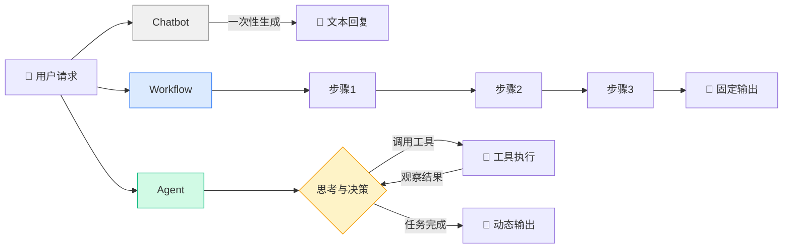
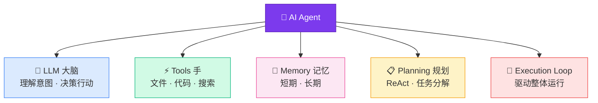

<script setup>
import SourceSnapshotCard from '../../.vitepress/theme/components/SourceSnapshotCard.vue'
</script>

<ChapterLearningGuide />

## 本章导读

### 这一章解决什么问题

AI Agent 这个词被滥用了。这一章帮你建立一个清晰的定义：Agent = LLM + Tools + Memory + Planning + Execution Loop。有了这个定义，你才能带着问题去读后面的源码。

### 必看入口

processor.ts（执行循环实体）、agent.ts（Agent 启动逻辑）

### 先抓一条主链路

`用户输入 → processor.ts 启动循环 → LLM 决策 → 工具调用 → 结果反馈 → LLM 再决策 → 输出`

### 初学者阅读顺序

1. 先读本章，建立概念框架。
2. 再打开 processor.ts，验证"执行循环"确实是一个 while 循环。
3. 然后读 agent.ts，看 Agent 如何启动。
4. 最后读 tool/registry.ts，看工具注册机制。

### 最容易误解的点

Agent 不是 AI——LLM 才是 AI，Agent 是包裹 LLM 的工程框架。LLM 只能输出文字，是 Agent 框架解析输出、调用工具、收集结果再喂给 LLM，形成循环。

---

## 1.1 从 LLM 到 Agent

### LLM 的能力与局限

大语言模型（LLM）如 GPT-4、Claude 等，具备强大的文本理解和生成能力：

```text
用户：什么是递归？
LLM：递归是一种编程技术，函数调用自身来解决问题...
```

但 LLM 本身有明显的局限：

1. **只能对话，不能行动**
   - 只能生成文本，无法执行代码
   - 无法读写文件、搜索网络、调用 API

2. **没有记忆**
   - 每次对话都是独立的
   - 无法记住上次的对话内容

3. **知识有截止日期**
   - 训练数据有时间限制
   - 无法获取最新信息

### Agent 的突破

**AI Agent = LLM + 工具 + 记忆 + 规划**

Agent 不只是"会说话"，更重要的是"会做事"：

```text
用户：帮我分析这个项目的代码质量

Agent 的思考过程：
1. [思考] 需要先看看项目结构
2. [行动] 调用 file_tree 工具
3. [观察] 发现是 TypeScript 项目
4. [思考] 需要检查代码规范
5. [行动] 调用 grep 工具搜索 any 类型
6. [观察] 发现 15 处使用了 any
7. [思考] 需要检查测试覆盖率
8. [行动] 调用 bash 工具运行测试
9. [观察] 测试覆盖率 65%
10. [回复] 给出完整的代码质量报告
```

这就是 Agent 与 LLM 的本质区别：**Agent 可以主动调用工具完成任务。**

---

## 1.2 Agent vs Chatbot vs Workflow

很多人容易混淆这三个概念，我们用一个例子说明：

### 任务：写一篇关于 AI 的技术文章

**Chatbot（聊天机器人）**：
```text
用户：帮我写一篇关于 AI 的文章
Chatbot：好的，这是文章内容...（直接生成）
```
- 一次性输出
- 无法调用工具
- 无法分步执行

**Workflow（工作流）**：
```text
步骤1：搜索 AI 相关资料
步骤2：总结资料
步骤3：生成文章大纲
步骤4：撰写正文
步骤5：润色文章
```
- 固定流程
- 人工定义每一步
- 无法根据情况调整

**Agent（智能体）**：
```text
Agent 自主决策：
1. [思考] 需要先了解最新的 AI 趋势
2. [行动] 搜索最新 AI 新闻
3. [观察] 发现 GPT-5 即将发布
4. [思考] 需要更多技术细节
5. [行动] 搜索 GPT-5 技术文档
6. [观察] 找到官方论文
7. [思考] 可以开始写大纲了
8. [行动] 生成文章大纲
9. [思考] 需要加入一个示例片段帮助读者理解
10. [行动] 生成示例片段
11. [回复] 完整文章
```
- 自主决策每一步
- 根据结果动态调整
- 可以调用多种工具

### 三者关系图示



### 对比表

| 特性 | Chatbot | Workflow | Agent |
|------|---------|----------|-------|
| 工具调用 | ❌ | ✅ | ✅ |
| 自主决策 | ❌ | ❌ | ✅ |
| 动态调整 | ❌ | ❌ | ✅ |
| 记忆能力 | ❌ | ✅ | ✅ |
| 任务规划 | ❌ | ✅（人工） | ✅（自动） |

<WorkflowVsAgent />

---

## 1.3 AI Agent 的核心能力

一个完整的 AI Agent 通常包含 5 个核心模块：



### 1. LLM（大模型）

Agent 的"大脑"，负责：
- 理解用户意图
- 决策下一步行动
- 生成回复内容

```typescript
// 伪代码：LLM 是一个无状态的推理函数，输入消息数组，输出响应
const response = await llm.chat({
  messages: [
    { role: "user", content: "帮我重构这个函数" }  // 用户的原始请求
  ]
})
// LLM 只能生成文本，不能执行操作——操作由 Agent 框架负责
```

### 2. Tools（工具调用）

Agent 的"手"，可以执行实际操作：

```typescript
const tools = [
  {
    name: "read_file",           // LLM 用这个名字来决定调用哪个工具
    description: "读取文件内容",  // 描述极为关键——LLM 根据这句话判断何时使用
    parameters: { path: "string" }  // Zod/JSON Schema 定义参数，LLM 据此填写参数
  },
  {
    name: "write_file",
    description: "写入文件",
    parameters: { path: "string", content: "string" }
  },
  {
    name: "search_web",
    description: "搜索网络",
    parameters: { query: "string" }
  }
]
// 工具列表会作为 JSON Schema 注入 LLM 的请求，让 LLM 知道"手"能做什么
```

### 3. Memory（记忆）

Agent 的"记忆"，分为两种：

**短期记忆（Short-term Memory）**：
- 当前对话的历史
- 最近调用的工具结果

**长期记忆（Long-term Memory）**：
- 用户偏好
- 历史任务记录
- 知识库

```typescript
// 短期记忆：当前会话的消息历史，每次调用 LLM 时完整传入
const chatHistory = [
  { role: "user", content: "读取 config.json" },
  { role: "assistant", content: "已读取，内容是..." },  // 之前的回复也在历史里
  { role: "user", content: "修改 port 为 8080" }  // LLM 能知道"上次读了哪个文件"
]
// 所谓"记忆"不是真的存储，而是每次把历史消息全部重发给 LLM

// 长期记忆：跨会话的持久化数据，需要显式查询才能注入上下文
const userPreferences = {
  codeStyle: "functional",    // 用 Functional 风格，而非面向对象
  testFramework: "vitest",    // 测试框架偏好
  language: "TypeScript"      // 首选语言
}
// 长期记忆不会自动出现在 LLM 的上下文里，需要代码查询后显式注入
```

### 4. Planning（任务规划）

Agent 的"规划能力"，将复杂任务分解：

```text
用户任务：创建一个 TODO 应用

Agent 规划：
1. 创建项目结构
   - 初始化 package.json
   - 创建 src 目录
2. 实现数据模型
   - 定义 Todo 类型
   - 实现 CRUD 操作
3. 实现 UI 界面
   - 创建组件
   - 添加样式
4. 编写测试
   - 单元测试
   - E2E 测试
```

### 5. Execution Loop（执行循环）

Agent 的"工作流程"，典型的循环：

```text
while (任务未完成) {
  1. Think（思考）：分析当前状态，决定下一步
  2. Act（行动）：调用工具执行操作
  3. Observe（观察）：查看执行结果
  4. Reflect（反思）：判断是否需要调整计划
}
```

**Agent 执行循环流程图：**

```mermaid
flowchart TD
    A[用户输入消息] --> B[构建 messages 数组\n包含历史 + 工具定义]
    B --> C[调用 LLM]
    C --> D{finish_reason?}
    D -->|tool-calls| E[解析工具调用\n获取 name + args]
    E --> F{权限检查}
    F -->|拒绝| G[返回权限错误\n加入 messages]
    F -->|允许| H[执行工具\ntool.execute\(args\)]
    H --> I[获取工具结果]
    I --> J[将结果加入 messages\nrole: tool]
    J --> C
    D -->|stop| K[LLM 输出最终文字]
    K --> L[保存到数据库]
    L --> M[返回给用户]
    G --> C

    style A fill:#dbeafe,stroke:#3b82f6
    style C fill:#d1fae5,stroke:#10b981
    style D fill:#fef3c7,stroke:#f59e0b
    style H fill:#f3e8ff,stroke:#7c3aed
    style M fill:#d1fae5,stroke:#10b981
```

---

## 1.4 为什么需要 AI Agent

### 传统开发 vs Agent 辅助开发

**场景：重构一个大型函数**

**传统方式**：
```text
1. 人工阅读代码（30分钟）
2. 理解业务逻辑（1小时）
3. 设计重构方案（30分钟）
4. 编写新代码（2小时）
5. 编写测试（1小时）
6. 调试修复（1小时）

总计：6小时
```

**Agent 辅助**：
```text
用户：帮我重构 src/utils/parser.ts 的 parseConfig 函数

Agent 自动执行：
1. 读取文件（5秒）
2. 分析代码结构（10秒）
3. 识别可优化点（15秒）
4. 生成重构方案（20秒）
5. 编写新代码（30秒）
6. 生成测试用例（20秒）
7. 运行测试验证（10秒）

总计：2分钟
```

### Agent 的优势

1. **自动化重复工作**
   - 代码生成
   - 测试编写
   - 文档生成

2. **知识整合**
   - 搜索最佳实践
   - 查阅官方文档
   - 学习项目代码

3. **持续学习**
   - 记住用户偏好
   - 积累项目知识
   - 优化工作流程

4. **24/7 可用**
   - 不需要休息
   - 即时响应
   - 并行处理

---

## 1.5 AI Agent 的应用场景

### 1. 代码助手（OpenCode 的定位）

```text
功能：
- 代码生成与重构
- Bug 修复
- 代码审查
- 测试编写
- 文档生成

示例：
用户：这个函数有性能问题，帮我优化
Agent：
1. 分析代码复杂度
2. 识别瓶颈（嵌套循环）
3. 提出优化方案（使用 Map）
4. 生成优化后的代码
5. 编写性能测试
```

### 2. 研究助手

```text
功能：
- 文献搜索
- 论文总结
- 数据分析
- 报告生成

示例：
用户：总结最近关于 Transformer 的论文
Agent：
1. 搜索 arXiv 最新论文
2. 下载 PDF
3. 提取关键信息
4. 生成总结报告
```

### 3. 客服机器人

```text
功能：
- 回答常见问题
- 查询订单状态
- 处理退款请求
- 转接人工客服

示例：
用户：我的订单什么时候发货？
Agent：
1. 识别用户身份
2. 查询订单数据库
3. 获取物流信息
4. 生成回复
```

### 4. 数据分析师

```text
功能：
- 数据清洗
- 统计分析
- 可视化
- 报告生成

示例：
用户：分析这个月的销售数据
Agent：
1. 读取 CSV 文件
2. 清洗异常数据
3. 计算统计指标
4. 生成图表
5. 撰写分析报告
```

---

## 1.6 AI Agent 的局限性

虽然 Agent 很强大，但也有明显的局限：

### 1. 成本高

```text
一次复杂任务可能需要：
- 10+ 次 LLM 调用
- 每次调用 $0.01 - $0.10
- 总成本 $0.10 - $1.00

对比：
- 人工：$50/小时
- Agent：$1/任务
```

### 2. 不可靠

```text
可能出现的问题：
- 工具调用失败
- LLM 输出格式错误
- 陷入死循环
- 产生幻觉（生成不存在的信息）
```

### 3. 需要监督

```text
危险操作需要人工确认：
- 删除文件
- 修改配置
- 执行命令
- 发送请求
```

### 4. 上下文限制

```text
LLM 的上下文窗口有限：
- GPT-4：128K tokens
- Claude：200K tokens

大型项目可能超出限制：
- 需要选择性读取文件
- 需要总结历史对话
```

---

## 1.7 常见的 Agent 框架

在开始学习 OpenCode 之前，了解一下其他 Agent 框架：

### LangChain

**特点**：
- 最流行的 Agent 框架
- 支持多种 LLM
- 丰富的工具生态

**示例**：
```python
from langchain.agents import initialize_agent, Tool
from langchain.llms import OpenAI

tools = [
    Tool(
        name="Search",
        func=search_tool,
        description="搜索网络"
    )
]

agent = initialize_agent(
    tools=tools,
    llm=OpenAI(),
    agent="zero-shot-react-description"
)

agent.run("帮我搜索最新的 AI 新闻")
```

### AutoGPT

**特点**：
- 自主 Agent
- 长期目标规划
- 自我反思

**示例**：
```text
目标：创建一个成功的 SaaS 产品

AutoGPT 自主执行：
1. 市场调研
2. 竞品分析
3. 产品设计
4. 代码实现
5. 测试部署
6. 营销推广
```

### OpenAI Assistants API

**特点**：
- 官方 API
- 内置工具（Code Interpreter、Retrieval）
- 托管服务

**示例**：
```python
from openai import OpenAI

client = OpenAI()

assistant = client.beta.assistants.create(
    name="Code Helper",
    instructions="你是一个代码助手",
    tools=[{"type": "code_interpreter"}],
    model="gpt-4"
)
```

### OpenCode 的定位

**OpenCode 的特点**：
- 100% 开源
- 提供商无关（支持多种 LLM）
- 内置 LSP 支持（代码智能）
- 专注于编码场景
- 客户端/服务器架构

**为什么选择 OpenCode**：
- 完全控制数据和隐私
- 可以自定义工具和 Agent
- 深度集成开发工具链
- 支持本地部署

---

## 本章小结

### 核心概念

1. **AI Agent = LLM + 工具 + 记忆 + 规划 + 执行循环**

2. **Agent vs LLM**：
   - LLM 只能对话
   - Agent 可以行动

3. **Agent vs Workflow**：
   - Workflow 是固定流程
   - Agent 可以自主决策

4. **Agent 的 5 个核心模块**：
   - LLM（大脑）
   - Tools（手）
   - Memory（记忆）
   - Planning（规划）
   - Execution Loop（工作流程）

### 关键要点

- Agent 不是万能的，有成本、可靠性、监督等限制
- 不同场景需要不同的 Agent 设计
- OpenCode 专注于编码场景，提供开源、可控的解决方案

### 思考题

1. 为什么 Agent 需要"执行循环"，而不是一次性生成所有答案？
2. 在什么场景下，Workflow 比 Agent 更合适？
3. 如果让你设计一个 Agent，你会选择哪些工具？

---

## 下一章预告

**第2章：AI Agent 的核心组件**

我们将深入学习 Agent 的 5 个核心模块：
- LLM 如何理解和生成文本
- Tool 如何定义和调用
- Memory 如何存储和检索
- Planning 如何分解任务
- Execution Loop 如何运转

这些概念将为后续阅读 OpenCode 源码打下基础。

---

## 常见误区

### 误区1：AI Agent 就是 AI，是有"智能"的程序

**错误理解**：Agent 本身是一个具备智能的实体，它会"思考"、"理解"、"学习"。

**实际情况**：Agent 是一个工程框架，真正具备智能的是其中的 LLM。`processor.ts` 里的 `while` 循环本身没有任何智能——它只是不断地把消息数组发给 LLM，再把结果加回数组。LLM 才是决策者，Agent 框架只是它的执行环境。

### 误区2：Agent 比 Workflow 更好，应该总是选 Agent

**错误理解**：Agent 能自主决策，所以比固定的 Workflow 更强大，任何场景都应该用 Agent。

**实际情况**：Workflow 的"固定"恰恰是优点——可预测、可审计、成本低。银行转账、表单提交这类流程不应该让 LLM 自主决策。选 Agent 的前提是任务本身需要动态决策、工具选择不确定。OpenCode 源码中，对于明确的步骤（如文件读取权限检查）用固定逻辑，只有任务规划阶段才交给 LLM 自主决策。

### 误区3：Agent 的记忆是真正的"记忆"，它会越用越聪明

**错误理解**：Agent 用得越久，积累的知识越多，会像人一样越来越聪明。

**实际情况**：Agent 的"记忆"本质是把历史消息拼接后重新发给 LLM，并非真正的学习。每次调用 LLM 都是无状态推理。OpenCode 的长期记忆（SQLite 持久化）只是让你下次能"继续上次的对话"，LLM 本身的权重没有任何改变。

### 误区4：工具越多越好，给 Agent 提供的工具应该尽可能全面

**错误理解**：工具越丰富，Agent 能完成的任务越多，应该把所有可能用到的工具都注册进去。

**实际情况**：工具过多会稀释 LLM 的注意力，导致选错工具或频繁切换。更重要的是安全风险——OpenCode 的权限系统（`tool/registry.ts` 中的权限过滤）正是为了限制 Agent 的工具访问范围，`bash` 这类危险工具需要显式授权，而不是默认开放。

### 误区5：Agent 能完全自主完成任务，不需要人工干预

**错误理解**：真正好的 Agent 应该全自动运行，不需要任何人工确认。

**实际情况**：OpenCode 在执行删除文件、运行命令等高风险操作时，会暂停并等待用户确认。这不是设计缺陷，而是刻意的安全设计。完全自主的 Agent 在处理不可逆操作时风险极高，"人在回路中"（Human-in-the-loop）是生产级 Agent 系统的标准实践。

---

<SourceSnapshotCard
  title="第1章参考源码"
  description="这一章是概念篇，没有单一核心文件。读这些源码的目的是验证本章描述的 Agent 模型——执行循环、工具注册、Provider 抽象——在真实代码中确实存在。"
  repo="anomalyco/opencode"
  repo-url="https://github.com/anomalyco/opencode/tree/f8475649da1cd7a6d49f8f30ee2fad374c2f4fcc"
  branch="dev"
  commit="f8475649da1cd7a6d49f8f30ee2fad374c2f4fcc"
  verified-at="2026-03-17"
  :entries="[
    {
      label: 'Agent 执行循环（概念代码）',
      path: 'packages/opencode/src/session/processor.ts',
      href: 'https://github.com/anomalyco/opencode/blob/f8475649da1cd7a6d49f8f30ee2fad374c2f4fcc/packages/opencode/src/session/processor.ts'
    },
    {
      label: '工具注册表',
      path: 'packages/opencode/src/tool/registry.ts',
      href: 'https://github.com/anomalyco/opencode/blob/f8475649da1cd7a6d49f8f30ee2fad374c2f4fcc/packages/opencode/src/tool/registry.ts'
    },
    {
      label: '提供商接口',
      path: 'packages/opencode/src/provider/provider.ts',
      href: 'https://github.com/anomalyco/opencode/blob/f8475649da1cd7a6d49f8f30ee2fad374c2f4fcc/packages/opencode/src/provider/provider.ts'
    },
    {
      label: 'Agent 入口',
      path: 'packages/opencode/src/agent/agent.ts',
      href: 'https://github.com/anomalyco/opencode/blob/f8475649da1cd7a6d49f8f30ee2fad374c2f4fcc/packages/opencode/src/agent/agent.ts'
    }
  ]"
/>


<StarCTA />
