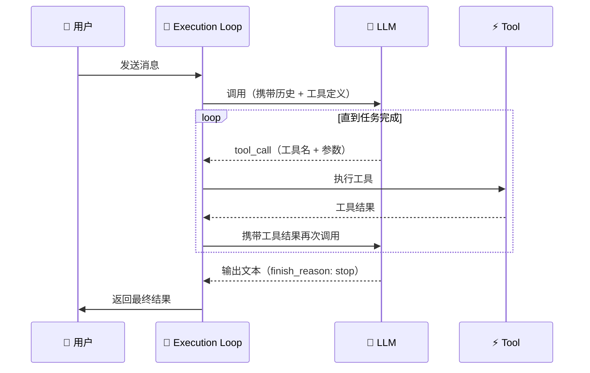
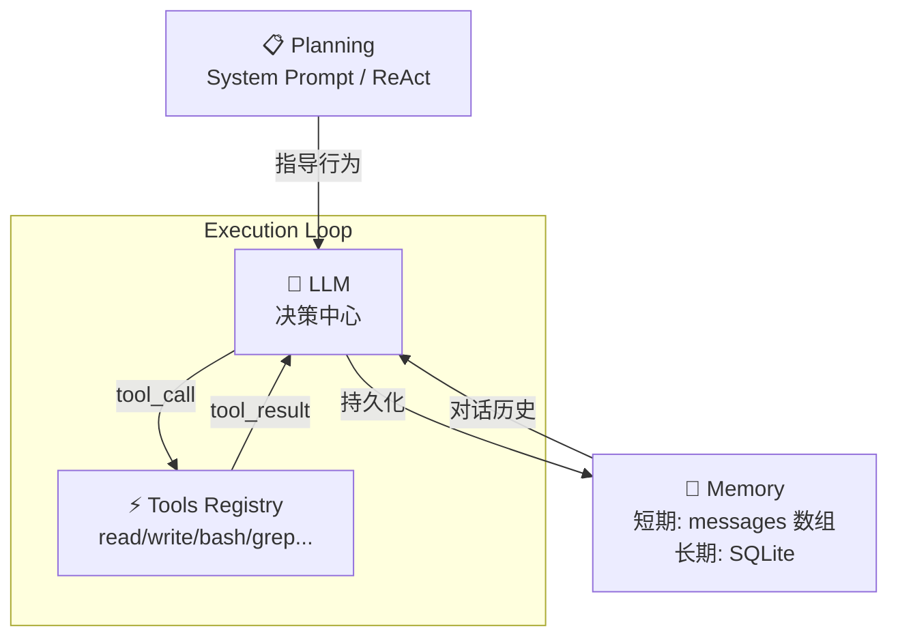

<script setup>
import SourceSnapshotCard from '../../.vitepress/theme/components/SourceSnapshotCard.vue'
</script>

<ChapterLearningGuide />

## 本章导读

### 这一章解决什么问题

第1章告诉你 Agent 是什么，第2章告诉你每个组件怎么工作。Function Calling 是 LLM 调用工具的底层机制、上下文窗口限制决定了记忆系统的设计、执行循环是整个系统的心脏。

### 必看入口

llm.ts（Function Calling 实现）、processor.ts（执行循环）

### 先抓一条主链路

`processor.ts 调用 llm.ts → LLM 返回 tool_call → processor.ts 执行工具 → 结果加入消息历史 → 再次调用 LLM → 直到 LLM 返回 stop`

### 初学者阅读顺序

1. 先读本章 2.4 节（执行循环），建立"循环"的直觉。
2. 打开 processor.ts，找 while 循环主体。
3. 读 llm.ts，看 Function Calling 怎么解析。
4. 读 tool.ts，看工具的 interface 定义。
5. 读 schema.ts，理解消息格式。

### 最容易误解的点

Planning（规划）不是一个独立的模块——OpenCode 里 LLM 本身就是规划器，它通过 System Prompt 里的指令来决定调用哪个工具、什么时候停止。没有单独的 planner.ts 文件。

---

第1章我们知道了 **AI Agent = LLM + 工具 + 记忆 + 规划 + 执行循环**。

这一章拆开来看每一个模块：它在干什么、怎么实现、OpenCode 里长什么样。

## 从 LLM 到 Agent 的演进

<WhatIsAgent />

---

## 2.1 LLM：Agent 的大脑

### LLM 如何理解文本

LLM（Large Language Model，大语言模型）是 Agent 的核心决策单元。它的输入和输出都是文本，但内部机制比"读文字"复杂得多。

**Tokenization（分词）**：

LLM 不直接处理字符，而是把文本切成 token（词元）：

```text
"Hello, world!" → ["Hello", ",", " world", "!"]
"写代码"       → ["写", "代码"]
"TypeScript"  → ["Type", "Script"]
```

这意味着一个"词"可能被切成多个 token，一次对话的实际成本取决于 token 数而不是字符数。

**上下文窗口（Context Window）**：

LLM 每次只能看到有限长度的文本，这是它最重要的物理限制之一：

```text
GPT-4：    最多 128K tokens  ≈ 约 100,000 个汉字
Claude 3： 最多 200K tokens  ≈ 约 150,000 个汉字
```

超出窗口的内容会被截断，Agent 系统必须主动管理哪些内容放进去。

**Temperature（温度）**：

控制 LLM 输出的随机性：

```text
temperature = 0.0  → 确定性最强，每次输出相同，适合代码生成
temperature = 0.7  → 平衡创造性和准确性，适合对话
temperature = 1.0  → 最随机，适合创意写作
```

OpenCode 在代码生成场景默认使用低温度，确保输出可预测。

### Function Calling：LLM 调用工具的机制

LLM 本身只能输出文本，但现代 LLM 支持一种特殊的输出格式——**Function Calling（函数调用）**：

```text
普通输出：
"这个函数有问题，你应该修改第15行..."

Function Calling 输出：
{
  "tool_call": {
    "name": "read_file",
    "arguments": { "path": "src/utils.ts" }
  }
}
```

Agent 框架解析这个结构化输出，执行对应的工具，再把结果喂回 LLM。这是 Agent 能"做事"而不只是"说话"的根本机制。

### OpenCode 如何使用 LLM

OpenCode 使用 [Vercel AI SDK](https://sdk.vercel.ai) 统一多个 LLM 提供商的接口：

```typescript
// packages/opencode/src/session/llm.ts（简化示意）
import { generateText, streamText } from "ai"  // Vercel AI SDK 统一接口

// 调用 LLM，传入工具定义
const result = await streamText({
  model: currentModel,        // 当前选中的模型（可能是 Claude、GPT-4o 等）
  messages: chatHistory,      // 完整对话历史，包含所有工具调用和结果
  tools: availableTools,      // 当前 Session 可用工具列表（经权限过滤后的）
  system: systemPrompt,       // 动态构建的 System Prompt（含项目上下文、Agent 规则）
})

// 处理流式输出——不等待全部完成，实时处理每个数据块
for await (const chunk of result.fullStream) {
  if (chunk.type === "text-delta") {
    // LLM 正在输出文字，一个个 token 到达，实时展示给用户
  }
  if (chunk.type === "tool-call") {
    // LLM 决定调用工具——这是 Agent"行动"的触发点
    await executeTool(chunk.toolName, chunk.args)  // 执行对应工具，等待结果
  }
}
```

**关键设计**：OpenCode 不自己写 HTTP 请求调 Claude/GPT，而是通过 AI SDK 的统一抽象层，让上层逻辑不关心底层是哪个模型。

---

## 2.2 Tools：Agent 的手

### 工具的本质

Tool（工具）是 Agent 与外部世界交互的唯一通道。没有工具，Agent 只能说话；有了工具，Agent 可以读文件、运行代码、搜索网络——做任何能被 API 封装的事情。

一个工具由三部分组成：

```typescript
interface Tool {
  name: string          // 名称，LLM 用这个名字决定调用哪个工具
  description: string   // 描述，LLM 根据这段文字理解工具的用途
  parameters: Schema    // 参数定义，JSON Schema 格式
  execute: Function     // 实际执行逻辑
}
```

**description 极其重要**。LLM 不会看代码，只会看 description 来决定要不要调用这个工具。写得不清楚，工具就会被误用或不被使用。

### 工具的类型

一个实用的 Agent 通常需要这几类工具：

**文件系统工具**：
```typescript
read_file(path)           // 读取文件内容
write_file(path, content) // 写入文件
list_directory(path)      // 列出目录内容
```

**代码执行工具**：
```typescript
bash(command)             // 执行 Shell 命令
run_tests()               // 运行测试套件
```

**搜索工具**：
```typescript
grep(pattern, path)       // 搜索文件内容
find_files(pattern)       // 按名称搜索文件
web_search(query)         // 搜索网络
```

**编辑工具**：
```typescript
edit_file(path, old, new) // 精确替换文件内容
```

### OpenCode 的工具注册机制

OpenCode 在 `packages/opencode/src/tool/` 目录管理所有工具，核心是一个工具注册表：

```typescript
// packages/opencode/src/tool/registry.ts（简化示意）
const registry = new Map<string, Tool>()  // 工具名 → 工具定义的映射表

// 注册所有内置工具——每个工具是独立文件，不用修改注册表就能扩展
registry.set("read", ReadTool)   // 读取文件内容
registry.set("write", WriteTool) // 写入文件
registry.set("bash", BashTool)   // 执行 Shell 命令（高权限，需用户确认）
registry.set("grep", GrepTool)   // 搜索文件内容（用 ripgrep 实现）
registry.set("glob", GlobTool)   // 按名称模式查找文件
registry.set("edit", EditTool)   // 精确字符串替换（Claude 最常用的编辑方式）

// 按权限过滤工具——不同会话可以有不同的工具集
function getToolsForSession(permissions: Permission[]) {
  return [...registry.values()].filter(
    tool => permissions.includes(tool.requiredPermission)
    // 没有 "execute" 权限就看不到 bash 工具，LLM 也就不会尝试调用它
  )
}
```

**权限系统**：OpenCode 的工具有权限级别，`bash` 工具（可以执行任意命令）需要用户显式授权，而 `read_file` 工具默认可用。这是一个重要的安全设计。

### 工具执行的完整流程

```text
1. LLM 输出 tool_call: { name: "read", args: { path: "src/index.ts" } }
2. Agent 框架解析 tool_call
3. 从 registry 找到 "read" 工具
4. 检查权限是否满足
5. 执行 ReadTool.execute({ path: "src/index.ts" })
6. 获取结果：文件内容字符串
7. 构造 tool_result 消息：{ role: "tool", content: "..." }
8. 将 tool_result 加入对话历史
9. 继续调用 LLM（LLM 现在能看到工具执行结果）
```

这个流程在 OpenCode 的 `processor.ts` 里实现，我们在第4章会深入分析。

---

## 2.3 Memory：Agent 的记忆

### 为什么 Agent 需要记忆

纯粹的 LLM 调用是无状态的——每次请求独立，不知道上一次说了什么。对于需要多轮交互完成的任务，Agent 必须自己维护状态。

记忆分两种，解决不同问题：

| 类型 | 作用域 | 存储方式 | 典型用途 |
|------|--------|----------|----------|
| 短期记忆 | 当前会话 | 内存中的数组 | 对话历史、工具结果 |
| 长期记忆 | 跨会话 | 数据库 / 向量库 | 用户偏好、项目知识 |

### 短期记忆：对话历史

短期记忆就是 `messages` 数组——当前会话中所有消息的有序列表：

```typescript
// 消息类型：3 种角色构成对话历史数组
type Message =
  | { role: "user";      content: string }           // 用户发的消息
  | { role: "assistant"; content: string | ToolCall[] }  // LLM 的回复（纯文本或工具调用）
  | { role: "tool";      toolCallId: string; content: string }  // 工具执行结果

// 一次典型的 Agent 对话历史——这整个数组每次都完整发给 LLM
const messages: Message[] = [
  { role: "user",      content: "帮我读取 config.ts 文件" },
  // LLM 的回复：选择调用 read 工具，而不是直接说"我不能读文件"
  { role: "assistant", content: [{ type: "tool_call", name: "read", args: { path: "config.ts" } }] },
  // 工具执行完毕，结果以 tool 角色加入历史
  { role: "tool",      toolCallId: "call_1", content: "export const port = 3000..." },
  // LLM 看到工具结果后，给出人类可读的总结
  { role: "assistant", content: "文件已读取，当前配置的端口是 3000。" },
  { role: "user",      content: "把端口改成 8080" },
  // LLM 在下一轮能"记住"读了 config.ts，因为历史里有这条记录
]
```

**关键点**：LLM 每次调用时，都会把完整的 messages 数组作为输入。这就是"Agent 记得之前说了什么"的实现机制——它不是真的记忆，而是每次都把历史重新发给 LLM。

### 上下文窗口管理

随着对话变长，messages 可能超出 LLM 的上下文窗口。OpenCode 用结构化消息模型解决这个问题：

```typescript
// packages/opencode/src/session/message-v2.ts（概念示意）
// 一条 assistant 消息可以包含多种 Part，而不是一个大字符串
type MessagePart =
  | { type: "text";      text: string }            // 最终给用户看的文字回复
  | { type: "reasoning"; reasoning: string }        // 模型的思考过程（如 Claude 的 thinking）
  | { type: "tool";      toolCall: ToolCall }       // 一次工具调用记录
  | { type: "file";      path: string; content: string }  // 附件文件内容

// 每条消息由多个 part 组成，而不是一个大字符串
// 这让 Agent 框架可以按需选择、截断、压缩哪些内容：
// - 上下文溢出时，可以丢弃 file part 而保留 tool 结果
// - TUI 可以折叠 reasoning part，Web 可以展开
// - 数据库存储时，每个 part 是独立行，支持精细查询
```

这个设计的价值在于：框架可以智能地决定"这条消息里的 file 部分太大，先丢掉；reasoning 部分不关键，也丢掉；只保留 tool 结果和最终文本"——而不是粗暴地截断字符串。

### 长期记忆：跨会话持久化

长期记忆需要持久化存储。OpenCode 用 SQLite 数据库保存会话历史：

```typescript
// 会话和消息都持久化到 SQLite 数据库
// 下次打开 OpenCode，上次的对话历史仍然存在
// 这让 Agent 可以"继续上次的任务"

const sessions = await db.select()
  .from(sessionTable)
  .where(eq(sessionTable.workspaceId, currentWorkspace))  // 按当前工作区过滤
  .orderBy(desc(sessionTable.updatedAt))  // 最近更新的排在前面
// 注意：SQLite 是本地文件，数据完全在用户控制下，不上传到云端
```

更高级的长期记忆是向量数据库（Vector Database）——把知识转成向量存储，用语义相似度检索。OpenCode 目前侧重代码智能（LSP），向量记忆是更复杂的扩展方向。

---

## 2.4 Planning：Agent 的规划

### 为什么需要规划

简单任务不需要规划——"读这个文件"、"写入那个内容"，一步就完成。

复杂任务需要拆解——"帮我重构整个认证模块"涉及十几个文件、几十个步骤，如果 Agent 没有规划能力，很可能做到一半迷失方向。

规划解决两个问题：
1. **任务分解**：把复杂任务切成可执行的小步骤
2. **进度追踪**：知道已经完成了什么、下一步是什么

### ReAct 模式：最常见的规划方法

ReAct（**Re**asoning + **Act**ing）是当前最主流的 Agent 规划模式。它通过 System Prompt 让 LLM 显式输出思考过程：

```text
System Prompt 指令：
"在每次行动前，先写出你的思考：
  Thought: <分析当前情况，决定下一步>
  Action: <要调用的工具>
  Action Input: <工具参数>
然后等待 Observation，再继续。"

实际对话：
Thought: 用户想重构认证模块，我需要先了解当前的代码结构
Action: list_directory
Action Input: src/auth/

Observation: [login.ts, register.ts, middleware.ts, types.ts]

Thought: 需要看每个文件的内容才能制定重构方案
Action: read_file
Action Input: src/auth/login.ts

Observation: [文件内容...]

Thought: 发现登录逻辑和验证逻辑混在一起，应该分离...
```

显式的 Thought 步骤让 LLM 的决策更可靠——它被迫先思考再行动，而不是直接猜一个工具调用。

### OpenCode 的 Agent 定义

OpenCode 把规划能力直接编码进 Agent 的 System Prompt。在 `packages/opencode/src/agent/` 目录，每个 Agent 都有明确定义的行为准则：

```typescript
// packages/opencode/src/agent/agent.ts（概念示意）
// Agent 的"人格"完全由 System Prompt 定义——没有单独的规划模块
const primaryAgent = {
  name: "primary",  // primary 模式：完整权限，用于主任务
  system: `你是 OpenCode，一个 AI 编码助手。

  行为准则：
  1. 修改代码前，先读取文件了解现有内容    // 防止 LLM 基于假设而非事实修改
  2. 执行危险操作（删除文件、运行命令）前，先确认  // 触发权限系统的 "ask" 流程
  3. 完成任务后，总结做了什么、为什么这样做  // 帮用户理解发生了什么
  4. 如果任务太复杂，拆分成步骤逐步执行   // 防止单次上下文过长

  工作流程：
  - 分析：理解用户需求
  - 探索：读取相关文件
  - 规划：制定修改方案
  - 执行：逐步实施
  - 验证：运行测试确认
  // 这个"规划"不是代码实现的，而是 LLM 读了这段 Prompt 后自然遵循的行为模式
  `,
}
```

这就是 OpenCode 的"规划系统"——不是独立的规划模块，而是通过精心设计的 System Prompt 让 LLM 自然地遵循工作流程。

### subagent 模式

复杂任务还可以用 Multi-Agent 方式：一个 primary agent 负责规划，多个 subagent 各自执行具体任务：

```text
primary agent：
  "这个任务需要：
   1. 重构后端 API（交给 subagent-1）
   2. 更新前端组件（交给 subagent-2）
   3. 更新文档（交给 subagent-3）"

subagent-1：专注执行后端重构
subagent-2：专注执行前端更新
subagent-3：专注更新文档
```

OpenCode 支持 `primary` 和 `subagent` 两种模式，我们在第二部分会详细分析。

---

## 2.5 Execution Loop：Agent 的工作循环

<ReActLoop />

**Agent Loop 时序图：**



### Loop 的基本结构

Execution Loop（执行循环）是把前四个组件串联起来的控制逻辑：

```typescript
// 伪代码，展示 Agent Loop 的核心结构（对应 processor.ts 的主循环）
async function agentLoop(userMessage: string) {
  // 把用户消息加入历史——这是这轮任务的起点
  messages.push({ role: "user", content: userMessage })

  while (true) {  // 实际代码里有 MAX_STEPS 限制，防止无限循环
    // 1. 调用 LLM，传入当前对话历史 + 工具定义
    //    LLM 每次都"重新看"完整历史，这是它能"记住"之前操作的原因
    const response = await llm.call({
      messages,           // 包含所有历史消息（用户、助手、工具结果）
      tools: availableTools,  // 当前可用工具的 JSON Schema 列表
    })

    // 2. 把 LLM 响应加入历史——无论是文本还是工具调用，都持久化
    messages.push({ role: "assistant", content: response })

    // 3. 检查是否需要调用工具
    if (response.type === "text") {
      // LLM 直接输出文本 = 任务完成，finish_reason 为 "stop"
      return response.text  // 这是用户最终看到的回复
    }

    if (response.type === "tool_call") {
      // LLM 要调用工具——Agent 的"行动"发生在这里
      const toolResult = await executeTool(
        response.toolName,  // 工具名，如 "read"、"bash"、"edit"
        response.toolArgs   // 工具参数，已由 LLM 按 schema 填写
      )

      // 4. 把工具结果加入历史——关键步骤，LLM 下次能"看到"这个结果
      messages.push({ role: "tool", content: toolResult })

      // 5. 继续循环：LLM 看到工具结果后，再次决策下一步
      continue
    }
  }
}
```

这个循环有一个关键特性：**LLM 每次调用时看到的是完整的对话历史**，包括之前所有的工具调用和结果。这就是为什么 Agent 能"记得"它已经读了哪些文件、执行了哪些命令。

### 循环的终止条件

Loop 什么时候停下来？三种情况：

1. **LLM 输出纯文本**（无工具调用）：任务完成，返回结果
2. **达到最大步骤数**：防止无限循环，`max_steps = 50`
3. **遇到错误**：工具执行失败且无法恢复

```typescript
// OpenCode 的循环终止逻辑（简化自 processor.ts）
const MAX_STEPS = 50  // 防止 Agent 陷入无限循环的硬性上限
let stepCount = 0

while (stepCount < MAX_STEPS) {
  const response = await llm.call(...)

  if (response.finishReason === "stop") {
    // LLM 主动决定停止——说明它认为任务已完成
    break
  }

  if (response.finishReason === "tool-calls") {
    // LLM 请求执行工具——循环继续
    await executeToolCalls(response.toolCalls)  // 执行所有工具调用（可能多个并行）
    stepCount++  // 每执行一批工具调用算一步
    continue
  }
}
// 如果 stepCount 达到 MAX_STEPS，会报"超出最大步骤数"错误
// 这是死循环防护机制（doom loop detection）的一部分
```

### 流式输出

OpenCode 用流式输出（Streaming）改善用户体验——不是等 LLM 完整回复后再显示，而是一边生成一边展示：

```typescript
// 流式处理：实时展示 LLM 的输出（这是 TUI 能"实时"显示的底层机制）
for await (const chunk of result.fullStream) {
  switch (chunk.type) {
    case "text-delta":
      // LLM 每生成一个 token 就触发一次，用户看到文字逐字出现
      ui.appendText(chunk.textDelta)  // textDelta 可能只是一两个字符
      break
    case "reasoning":
      // Claude 3.7+ 等支持 extended thinking 的模型会输出思考过程
      ui.appendReasoning(chunk.textDelta)  // TUI 默认折叠这部分，可展开查看
      break
    case "tool-call":
      // LLM 发起工具调用——此时工具尚未执行，只是声明了意图
      ui.showToolCall(chunk.toolName, chunk.args)  // 显示"正在调用 read 工具..."
      break
    case "tool-result":
      // 工具执行完毕，结果返回——此时才真正知道工具做了什么
      ui.showToolResult(chunk.result)  // 显示工具输出（可能被截断到 1000 行）
      break
  }
}
```

这是 OpenCode TUI 能实时显示"Agent 在做什么"的底层机制。

### OpenCode 的实际 Loop

OpenCode 的 Loop 在 `packages/opencode/src/session/processor.ts` 实现。相比伪代码，它多处理了：

- **step 边界**：把多个工具调用组织成"步骤"，方便用户追踪进度
- **事件发布**：每个 reasoning/tool call/tool result 都作为事件广播，让 CLI/Web/Desktop 同步更新 UI
- **错误恢复**：工具执行失败时，把错误信息作为 tool_result 发回 LLM，让它决定如何处理
- **权限确认**：高风险操作在执行前暂停，等待用户确认

```text
OpenCode 的完整 Loop 流程：

用户发送消息
  ↓
processor.ts 启动循环
  ↓
llm.ts 调用模型（传入 system prompt + messages + tools）
  ↓
流式接收响应
  ├── text-delta → 广播事件，TUI/Web 实时更新
  ├── reasoning  → 广播事件，显示思考过程
  └── tool-call  → 检查权限 → 执行工具 → 广播结果 → 加入 messages
  ↓
LLM 返回 finish_reason = "stop"
  ↓
保存消息到数据库
  ↓
循环结束
```

---

## 2.6 五个组件的协作

单独看每个组件还不够，真正重要的是它们如何协作：

```text
┌─────────────────────────────────────────────────────┐
│                  Execution Loop                      │
│                                                      │
│  ┌──────────┐   调用   ┌──────────────────────────┐ │
│  │   LLM    │ ──────→  │     Tools Registry        │ │
│  │  (决策)  │ ←──────  │  read / write / bash /... │ │
│  └──────────┘   结果   └──────────────────────────┘ │
│       ↑                                              │
│       │ 对话历史                                     │
│  ┌──────────┐                                        │
│  │  Memory  │                                        │
│  │ (短期/长期)│                                      │
│  └──────────┘                                        │
│       ↑                                              │
│       │ 系统提示词                                   │
│  ┌──────────┐                                        │
│  │ Planning │                                        │
│  │(ReAct规划)│                                       │
│  └──────────┘                                        │
└─────────────────────────────────────────────────────┘
```

上图用 Mermaid 更清晰地表示：



**一次典型任务的完整流程**：

```text
用户：帮我找出 src/ 目录下所有使用了 any 类型的地方

第1轮：
  Planning（System Prompt）指导 LLM："先理解任务范围"
  LLM → 调用 glob("src/**/*.ts")
  Memory 记录：工具调用 + 结果（32个文件）

第2轮：
  Memory 提供：对话历史（知道有32个文件）
  LLM → 调用 grep("any", "src/")
  Memory 记录：工具调用 + 结果（发现15处）

第3轮：
  Memory 提供：完整历史（文件列表 + grep结果）
  LLM → 输出文本（汇总报告）
  Loop 检测到 finish_reason = "stop"，退出

最终输出：
  "在 src/ 目录下共发现 15 处 any 类型使用：
   - src/utils/parser.ts:23 - 参数类型未定义
   - src/api/handler.ts:45 - 返回值类型不明确
   ..."
```

每个组件各司其职，缺少任何一个，这个任务都无法完成。

---

## 本章小结

五个组件的核心职责：

| 组件 | 职责 | OpenCode 对应位置 |
|------|------|------------------|
| LLM | 理解意图、决策行动、生成文本 | `session/llm.ts`，通过 Vercel AI SDK |
| Tools | 与外部世界交互 | `tool/registry.ts`，`tool/*.ts` |
| Memory | 维护对话状态、持久化历史 | `session/message-v2.ts`，SQLite |
| Planning | 指导工作流程（ReAct） | `agent/agent.ts`，System Prompt |
| Execution Loop | 串联所有组件，控制循环 | `session/processor.ts` |

### 思考题

1. 为什么 LLM 的上下文窗口限制会影响 Agent 的设计？如果上下文无限大，Memory 组件还需要吗？
2. Tool 的 `description` 对 Agent 行为影响有多大？试想如果把 `read_file` 的描述改成"执行危险操作"，会发生什么？
3. ReAct 模式要求 LLM 显式输出 `Thought:`，这个步骤能省略吗？有什么代价？

---

## 下一章预告

**第3章：OpenCode 项目介绍**

我们将从"理论概念"进入"具体代码"，建立 OpenCode 仓库的整体认知：
- 项目目录结构与模块分工
- 一次任务的完整代码路径
- 客户端/服务器分离架构的设计动机

---

## 常见误区

### 误区1：Planning 是一个独立的模块，有专门的规划代码

**错误理解**：Agent 的"规划"应该有单独的 `planner.ts` 文件，里面实现了任务分解、步骤追踪等逻辑。

**实际情况**：OpenCode 里没有独立的规划模块。规划能力完全依赖 LLM 和 System Prompt——`agent/agent.ts` 里的提示词告诉 LLM "先分析、再探索、再执行"，LLM 自然就会遵循这个流程。这是 Prompt Engineering 而非代码逻辑。

### 误区2：LLM 调用一次就能完成任务，多次调用是浪费

**错误理解**：一个好的 Agent 应该尽量减少 LLM 调用次数，理想情况是调用一次就返回完整答案。

**实际情况**：多轮调用是 Agent 的工作方式，不是缺陷。`processor.ts` 的 `while` 循环每次调用 LLM 时，它都能"看到"上一轮工具执行的结果。如果只调用一次，LLM 就无法根据文件内容来决定下一步操作。10轮调用完成一个正确的任务，优于1轮调用给出一个猜测性答案。

### 误区3：工具的 `description` 只是注释，不影响实际行为

**错误理解**：工具的描述字段就是给人看的注释，LLM 会看函数签名和参数类型来理解工具。

**实际情况**：LLM 完全依赖 `description` 来决定是否以及如何调用工具——它看不懂 TypeScript 类型，只能读自然语言描述。OpenCode 中每个工具的 description 都经过精心撰写。把 `read_file` 的描述改成模糊的一句话，LLM 就会开始误用或不使用这个工具。

### 误区4：Short-term Memory 和 Long-term Memory 是对称的两种记忆系统

**错误理解**：短期记忆和长期记忆是地位相同的两种存储机制，Agent 可以自由选择使用哪种。

**实际情况**：两者的工作方式完全不同。短期记忆是 `messages` 数组——直接传入 LLM 上下文，LLM 能直接读取；长期记忆（SQLite）是持久化存储，需要代码显式查询才能注入上下文，LLM 默认看不到。OpenCode 的 `message-v2.ts` 的 `MessagePart` 设计，核心目的是管理哪些短期记忆内容值得传给 LLM。

### 误区5：流式输出（Streaming）是可选的优化，对功能没影响

**错误理解**：Streaming 只是让用户体验更好（实时看到输出），去掉它 Agent 功能完全一样。

**实际情况**：在 OpenCode 中，Streaming 不仅是 UI 优化。`processor.ts` 通过流式事件（`text-delta`、`tool-call`、`tool-result`）来驱动 TUI、Web、Desktop 等多个客户端的实时同步。如果改成等待完整响应，整个事件广播架构都会失效，客户端无法实时显示 Agent 的工作进度。

---

<SourceSnapshotCard
  title="第2章参考源码"
  description="这一章讲的是 AI Agent 五大组件的工作原理。对应的源码不在一个文件里——LLM 接口在 provider/、工具在 tool/、记忆在 session/、执行循环在 processor.ts。"
  repo="anomalyco/opencode"
  repo-url="https://github.com/anomalyco/opencode/tree/f8475649da1cd7a6d49f8f30ee2fad374c2f4fcc"
  branch="dev"
  commit="f8475649da1cd7a6d49f8f30ee2fad374c2f4fcc"
  verified-at="2026-03-17"
  :entries="[
    {
      label: 'LLM 流式调用',
      path: 'packages/opencode/src/session/llm.ts',
      href: 'https://github.com/anomalyco/opencode/blob/f8475649da1cd7a6d49f8f30ee2fad374c2f4fcc/packages/opencode/src/session/llm.ts'
    },
    {
      label: '工具定义基类',
      path: 'packages/opencode/src/tool/tool.ts',
      href: 'https://github.com/anomalyco/opencode/blob/f8475649da1cd7a6d49f8f30ee2fad374c2f4fcc/packages/opencode/src/tool/tool.ts'
    },
    {
      label: '执行循环',
      path: 'packages/opencode/src/session/processor.ts',
      href: 'https://github.com/anomalyco/opencode/blob/f8475649da1cd7a6d49f8f30ee2fad374c2f4fcc/packages/opencode/src/session/processor.ts'
    },
    {
      label: '会话 Schema',
      path: 'packages/opencode/src/session/schema.ts',
      href: 'https://github.com/anomalyco/opencode/blob/f8475649da1cd7a6d49f8f30ee2fad374c2f4fcc/packages/opencode/src/session/schema.ts'
    }
  ]"
/>


<StarCTA />

<ChapterActionPanel
  :actionItems="[
    { title: '画出自己的组件边界图', description: '把 LLM、Tools、Memory、Planning、Execution Loop 五个模块写成结构草图，再对照源码验证。' },
    { title: '继续进入工具系统', description: '下一步看工具协议、权限控制和执行回路，理解 Agent 为什么能真正行动。', href: '/03-tool-system/' },
    { title: '回到 P1 对照最小实现', description: '用一个最小项目把刚才的模块边界映射到可运行代码。', href: '/practice/p01-minimal-agent/' }
  ]"
/>
