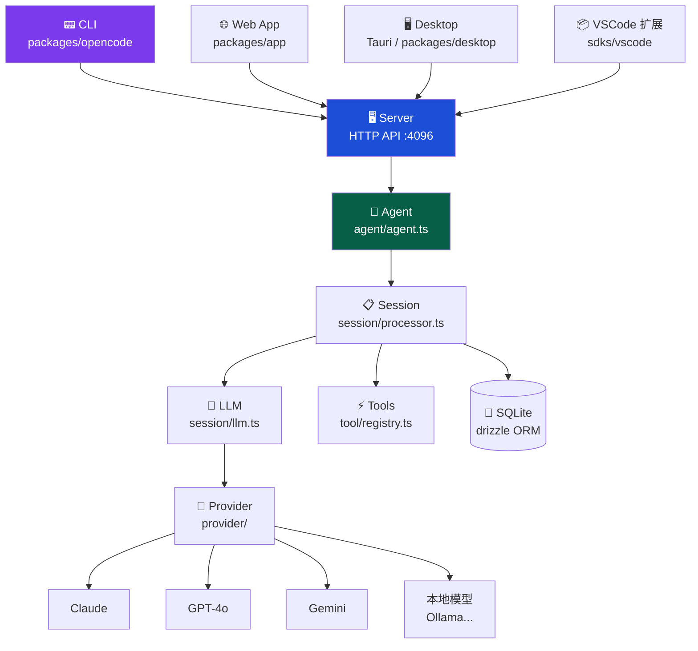
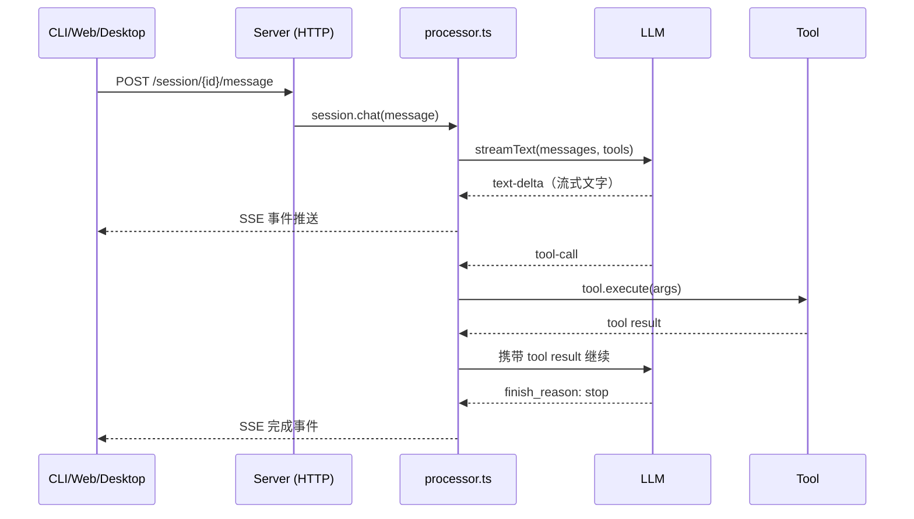

<ChapterLearningGuide />

<script setup>
import SourceSnapshotCard from '../../.vitepress/theme/components/SourceSnapshotCard.vue'
</script>

> **学习目标**：建立 OpenCode 的整体代码地图，把第2章的5个概念组件对应到真实源码位置
> **前置知识**：第2章"AI Agent 的核心组件"
> **阅读时间**：20 分钟

---

## 本章导读

### 这一章解决什么问题

源码焦虑。当你第一次打开一个有数十个目录、数百个文件的大仓库，不知道从哪开始。这一章给你一张地图——告诉你哪些是核心、哪些是外围、各模块怎么连接。

### 必看入口

index.ts（CLI 命令解析入口）、server.ts（HTTP API 服务器）

### 先抓一条主链路

`packages/opencode/src/index.ts → 解析 CLI 命令 → 启动 server 或直接运行 agent → server.ts 注册路由 → agent.ts 处理请求 → processor.ts 执行循环`

### 初学者阅读顺序

1. 先读本章，把模块依赖图打印出来贴在旁边。
2. 打开 index.ts，数一数有多少个子命令。
3. 打开 server.ts，看有哪些路由。
4. 找到 agent.ts，这是所有子命令汇聚的地方。
5. 其余模块按后续各章按需深入。

### 最容易误解的点

packages/app（Web UI）和 packages/opencode（核心逻辑）是两个独立进程——app 通过 HTTP 调用 opencode 的 server，不是直接调用函数。理解这个分离，是理解整个架构的关键。

---

第2章讲了 AI Agent 的五个核心组件：LLM、Tools、Memory、Planning、Execution Loop。

这一章做一件事：**把这五个组件对应到 OpenCode 仓库的实际代码位置**，建立一张"源码地图"。有了这张地图，后面每一章深入某个模块时，你知道自己在哪、周围是什么。

---

## 3.1 OpenCode 是什么

**一句话定位**：OpenCode 是一个开源的 AI 编码 Agent，可以在终端、浏览器或桌面应用里运行，支持多种 LLM 提供商。

它和 GitHub Copilot、Cursor 等工具的核心区别：

| 维度 | GitHub Copilot / Cursor | OpenCode |
|------|------------------------|----------|
| 开源 | 否 | 100% 开源 |
| 提供商 | 固定（OpenAI） | 可选（Claude/GPT/Gemini/本地模型） |
| 数据 | 上传到云端 | 本地优先，可控 |
| 部署 | SaaS 服务 | 本地/自托管/云端均可 |
| 可扩展 | 有限 | 插件系统，支持 MCP |

**核心设计理念**：Agent 逻辑一份，多端共用。CLI、Web、Desktop 三种界面背后是同一套服务端逻辑，不是三套独立实现。

---

## 3.2 仓库整体结构

OpenCode 是一个 Monorepo（多包仓库），用 Bun workspaces 管理：

```text
opencode/
├── packages/
│   ├── opencode/      ← 核心：CLI + Server + Agent 逻辑
│   ├── app/           ← Web 应用（SolidJS）
│   ├── desktop/       ← 桌面应用（Tauri + Rust）
│   ├── ui/            ← 共享 UI 组件库
│   ├── sdk/js/        ← JavaScript SDK（封装 API 调用）
│   ├── console/       ← 控制台（app/core/function/mail/resource）
│   └── ...
├── sdks/
│   └── vscode/        ← VSCode 扩展
├── infra/             ← 基础设施代码（SST + Cloudflare）
└── docs/              ← 文档（本书所在位置）
```

**最重要的包是 `packages/opencode`**。它是整个系统的核心，其他包要么是它的客户端（app、desktop），要么是它的工具链（ui、sdk）。

**模块依赖关系：**



---

## 3.3 packages/opencode：核心包详解

这是本书大部分内容聚焦的地方。它的 `src/` 目录：

```text
packages/opencode/src/
├── index.ts           ← CLI 总入口
├── agent/             ← Agent 定义（配置协议）
├── session/           ← 会话与执行循环（核心）
├── tool/              ← 工具系统
├── provider/          ← LLM 提供商抽象
├── server/            ← HTTP API 服务器
├── cli/               ← CLI 命令（tui/run/serve/web）
├── mcp/               ← MCP 协议集成
├── storage/           ← 数据持久化（SQLite）
├── lsp/               ← LSP 代码智能
├── config/            ← 配置系统
├── permission/        ← 权限控制
├── project/           ← 项目（工作区）管理
├── file/              ← 文件系统抽象
├── share/             ← 会话分享
├── worktree/          ← Git worktree 支持
└── ...
```

### 把第2章的5个组件对应到代码

| 概念组件 | 对应目录/文件 | 核心作用 |
|---------|-------------|---------|
| **LLM** | `provider/`，`session/llm.ts` | 多模型抽象，调用模型 |
| **Tools** | `tool/` | 工具注册表与执行 |
| **Memory** | `session/message-v2.ts`，`storage/` | 对话历史与持久化 |
| **Planning** | `agent/agent.ts`，`session/system.ts` | Agent 配置与 System Prompt |
| **Execution Loop** | `session/processor.ts` | 驱动 LLM + 工具循环 |

这张对应表是理解 OpenCode 的核心索引。后面每一章深入某个模块时，先回来看这张表定位自己的位置。

---

## 3.4 一次任务的完整代码路径

光看目录不够，更重要的是看**代码怎么流动**。我们用一个具体任务追踪完整路径：

**主链路动画：** 用一次真实任务把入口初始化、会话创建、Prompt 装配、主执行循环、工具执行与消息回流串起来。

<TaskExecutionPathDemo />

> **任务**：`opencode "帮我读取 config.ts，把 port 改成 8080"`

### 第一步：入口初始化

```text
packages/opencode/src/index.ts
```

用户在终端输入命令，`index.ts` 是第一个被执行的文件。它做三件事：

1. 解析命令行参数（用 yargs）
2. 初始化运行时（日志、环境变量、数据库 migration）
3. 根据命令分发：`run` → TUI，`serve` → 无头服务器，`web` → Web 服务器

```typescript
// 简化示意：yargs 解析命令行参数，分发到对应命令处理器
let cli = yargs(hideBin(process.argv))
  .scriptName("opencode")
  .command(RunCommand)    // opencode（默认，启动 TUI + 内嵌服务器）
  .command(ServeCommand)  // opencode serve（只启动 HTTP 服务器，无 TUI）
  .command(WebCommand)    // opencode web（启动服务器 + 打开浏览器）

await cli.parse()  // 解析参数后立即分发，不同命令有不同的服务器启动逻辑
```

### 第二步：进入共享服务边界

```text
packages/opencode/src/server/server.ts
packages/opencode/src/server/routes/session.ts
```

无论是 TUI、Web 还是 Desktop，任务都通过 HTTP API 进入系统。`server.ts` 创建 Hono 应用，注册中间件（认证、CORS、日志）和路由。

为什么要经过 HTTP 服务器？因为这样三端共享同一套逻辑，不用各自实现一遍。

```text
TUI 进程  ──┐
Web 浏览器 ──┤ → HTTP → server.ts → session.ts → processor.ts
Desktop   ──┘
```

### 第三步：创建/获取会话

```text
packages/opencode/src/session/prompt.ts
```

会话（Session）是 OpenCode 中持久化的对话容器。每次用户发送消息，先找到或创建对应的 Session，然后调用 `prompt()` 把消息送进去。

`prompt()` 负责：
- 创建本轮用户消息（附加文件、附件等）
- 把消息持久化到数据库
- 启动主处理循环

### 第四步：System Prompt 装配

```text
packages/opencode/src/session/system.ts
packages/opencode/src/agent/agent.ts
```

在调用 LLM 之前，需要组装 System Prompt。这是 Planning 组件的核心实现：

```typescript
// session/system.ts（概念示意）
// System Prompt 是动态构建的，每次会话开始时重新组装
async function buildSystemPrompt(agentName: string, context: Context) {
  const agent = Agent.get(agentName)  // 从 agent.ts 获取 Agent 定义（primary/subagent）

  return [
    agent.system,                      // Agent 的核心行为准则（不变的基础指令）
    await getProjectContext(context),  // 当前项目信息（语言、框架、结构等）
    await getCustomInstructions(),     // 用户自定义指令（CLAUDE.md / opencode.md 文件内容）
    getCurrentWorkingDirectory(),      // 当前工作目录（让 LLM 知道文件路径的根）
  ].join("\n\n")
  // 这几部分拼接后就是 LLM 每次调用时看到的 System Prompt
  // 越精准的 System Prompt，LLM 的决策越准确
}
```

System Prompt 是 Agent 的"人格"——它定义了 Agent 应该如何思考、什么时候调用哪些工具、遇到歧义时如何决策。

### 第五步：主执行循环

```text
packages/opencode/src/session/processor.ts
packages/opencode/src/session/llm.ts
```

这是整个系统最核心的文件。`processor.ts` 实现了第2章讲的 Execution Loop：

```text
processor.ts 循环：

[1] llm.ts：组装 messages + tools + system prompt，调用 LLM
     ↓
[2] 流式接收响应
     ├── text-delta → 广播 bus 事件（TUI/Web 实时更新）
     ├── reasoning  → 广播事件（显示思考过程）
     └── tool-call  → 进入工具执行分支
     ↓
[3] 工具执行（tool-call 分支）
     ├── permission/next.ts：检查权限
     ├── tool/registry.ts：找到对应工具
     ├── 执行工具
     └── 把结果作为 tool_result 加入 messages
     ↓
[4] finish_reason == "stop" → 退出循环
    finish_reason == "tool-calls" → 回到 [1]
```

对于我们的任务"读取 config.ts，把 port 改成 8080"，这个循环会经历：

```text
轮次1：
  LLM 调用 read_file("config.ts")
  工具执行，返回文件内容
  把内容加入对话历史

轮次2：
  LLM 看到文件内容，决定调用 edit_file("config.ts", "port = 3000", "port = 8080")
  工具执行，修改文件

轮次3：
  LLM 输出文字："已将 config.ts 中的 port 从 3000 修改为 8080。"
  finish_reason = "stop"，循环结束
```

### 第六步：工具执行

```text
packages/opencode/src/tool/registry.ts
packages/opencode/src/tool/read.ts
packages/opencode/src/tool/edit.ts
```

`registry.ts` 是工具注册表，维护所有可用工具的 Map。每个工具是独立文件：

```typescript
// tool/read.ts（简化示意）
export const ReadTool = {
  name: "read",                              // LLM 调用时使用这个名称
  description: "读取文件内容，返回文本",       // LLM 根据这段文字决定何时调用
  parameters: z.object({
    filePath: z.string().describe("要读取的文件路径"),  // Zod schema 同时生成参数校验和 JSON Schema
  }),
  async execute({ filePath }) {
    const content = await fs.readFile(filePath, "utf-8")  // 实际的 I/O 操作
    return content  // 返回的内容会传回 LLM 作为 tool_result
  }
}
```

当前 OpenCode 内置了这些工具：

```text
文件操作：  read / write / edit / multiedit / glob / ls
搜索：     grep / webfetch / websearch / codesearch
代码执行：  bash / apply_patch
AI辅助：   task（子任务）/ plan（规划模式）
交互：     question（询问用户）
```

### 第七步：消息持久化与回流

```text
packages/opencode/src/session/message-v2.ts
packages/opencode/src/storage/
```

每一轮循环的结果（用户消息、Assistant 消息、工具调用、工具结果）都持久化到 SQLite 数据库。这实现了：

- **会话恢复**：关掉重开，历史仍在
- **多端同步**：TUI 和 Web 看到同一份数据
- **事件回放**：新连接的客户端可以获取历史事件流



---

## 3.5 客户端/服务器分离：为什么这样设计

很多人第一次看 OpenCode 会困惑：为什么本地 CLI 还要启动一个 HTTP 服务器？

答案是**复用**。看这个对比：

**如果没有服务器层**：
```text
TUI 实现：读文件逻辑 + 调模型逻辑 + 工具执行逻辑
Web 实现：读文件逻辑 + 调模型逻辑 + 工具执行逻辑（重写一遍）
Desktop：读文件逻辑 + 调模型逻辑 + 工具执行逻辑（再重写一遍）
```

**有了服务器层**：
```text
服务器：读文件逻辑 + 调模型逻辑 + 工具执行逻辑（一份）
TUI：   HTTP 客户端 + 终端渲染
Web：   HTTP 客户端 + 浏览器渲染
Desktop：HTTP 客户端 + 原生渲染
```

服务器层让三端共享全部业务逻辑。这是 OpenCode 支持多端的根本架构基础。

**本地模式下**，TUI 在同一进程内启动服务器（或连接已有服务器），没有网络开销；**远程模式下**，Web/Desktop 通过网络连接到服务器，支持团队共享或云端部署。

---

## 3.6 技术栈的选择逻辑

了解 OpenCode 为什么选这些技术，比记住技术名字更有价值：

**Bun（运行时）**：
- 内置 TypeScript 支持，无需 `tsc` 编译步骤
- 启动速度比 Node.js 快 3-4 倍（CLI 工具的关键指标）
- 内置 SQLite 驱动，省去额外依赖

**Vercel AI SDK（LLM 接口层）**：
- 统一接口对接 Anthropic、OpenAI、Google、本地模型
- 内置流式输出支持
- TypeScript 类型完整，函数调用格式标准化

**Hono（HTTP 框架）**：
- 极轻量（5KB），适合嵌入 CLI 进程
- 原生 TypeScript，类型安全的路由
- 支持 SSE（Server-Sent Events），用于流式推送事件

**SolidJS（UI 框架）**：
- 比 React 更小的包体积（TUI 和 Web 共用）
- 真正的响应式，无虚拟 DOM，更接近原生性能
- TUI 的组件树渲染比 React 更高效

**Drizzle ORM（数据库）**：
- 类型安全的 SQL，查询结果有完整 TypeScript 类型
- 轻量，无运行时依赖注入
- 支持 SQLite（本地）和 PostgreSQL/MySQL（云端）

---

## 3.7 配置系统：用户如何定制 Agent

OpenCode 支持多层配置，优先级从高到低：

```text
1. 命令行参数                    （最高优先级）
2. 环境变量（OPENCODE_*）
3. 项目级配置（.opencode/config.json）
4. 全局配置（~/.config/opencode/config.json）
5. 内置默认值                    （最低优先级）
```

除了配置文件，OpenCode 还支持**自定义指令文件**：

```text
CLAUDE.md   ← 项目根目录，Agent 会自动读取并加入 System Prompt
opencode.md ← 同上，OpenCode 专用命名
~/.claude/CLAUDE.md ← 全局用户级指令
```

这意味着你可以直接在 Markdown 文件里告诉 Agent：
- 这个项目用什么技术栈
- 代码风格是什么
- 哪些目录不要修改
- 任何你希望 Agent 记住的事情

这是 OpenCode "配置即代码"的体现——Prompt 工程的结果以文件形式存在仓库里，而不是散落在 UI 配置面板里。

---

## 3.8 MCP：工具系统的扩展机制

MCP（Model Context Protocol）是 Anthropic 推出的开放协议，让 Agent 可以调用外部服务提供的工具，不需要修改 Agent 自身代码。

```text
没有 MCP：
  工具都在 packages/opencode/src/tool/ 里
  想加新工具，要修改 OpenCode 源码

有了 MCP：
  任何人都可以写 MCP Server
  OpenCode 连接 MCP Server，自动获得它的工具
  不需要修改 OpenCode 本身
```

例如，接入一个数据库查询工具：

```json
// .opencode/config.json
{
  "mcp": {
    "servers": {
      "my-database": {
        "command": "npx my-db-mcp-server",
        "args": ["--connection", "postgresql://..."]
      }
    }
  }
}
```

配置好之后，Agent 就能调用 `my-database` 提供的 `query_table`、`run_migration` 等工具，就像内置工具一样。

MCP 是 OpenCode 工具系统的"插槽"——内置工具覆盖通用编码场景，MCP 工具覆盖特定项目的定制需求。

---

## 本章小结

建立了 OpenCode 的源码地图：

**五个概念组件对应的代码位置**：

```text
Planning     → agent/agent.ts + session/system.ts
LLM          → provider/ + session/llm.ts
Execution    → session/processor.ts
Memory       → session/message-v2.ts + storage/
Tools        → tool/registry.ts + tool/*.ts
```

**一次任务的代码路径**：

```text
index.ts → cli/cmd/run.ts
  → server/server.ts → server/routes/session.ts
    → session/prompt.ts
      → session/system.ts（装配 System Prompt）
      → session/processor.ts（执行循环）
        → session/llm.ts（调用 LLM）
        → tool/registry.ts（执行工具）
        → session/message-v2.ts（保存消息）
```

**架构决策要点**：
- 客户端/服务器分离 → 三端共享一套逻辑
- Bun + TypeScript → 无编译，快速启动
- MCP 协议 → 工具系统可扩展

### 思考题

1. 为什么 `tool/registry.ts` 要统一管理工具，而不是让每个模块自己调用工具函数？
2. System Prompt 和工具 `description` 都影响 Agent 行为，它们的职责边界是什么？
3. 如果你要给 OpenCode 加一个"查询 Jira 工单"的能力，用 MCP 方式和直接修改源码各有什么优缺点？

---

## 下一章预告

**第4章：工具系统**

我们将深入 `packages/opencode/src/tool/`，学习：
- 工具是如何定义的（Zod schema + execute 函数）
- `registry.ts` 如何注册和过滤工具
- `bash`、`edit`、`grep` 等核心工具的实现细节
- 权限系统如何控制工具访问

---

## 常见误区

### 误区1：Web UI 和 CLI 是两套独立的代码，逻辑各自实现

**错误理解**：`packages/app`（Web）和 `packages/opencode`（CLI）各有自己的 Agent 逻辑，分别实现了工具调用、会话管理等功能。

**实际情况**：所有业务逻辑只在 `packages/opencode` 里实现一次。`packages/app` 只是一个 HTTP 客户端——它通过 HTTP 请求调用 `opencode` 的服务端，渲染返回的数据。TUI 也是如此。这就是为什么 `packages/app` 里找不到任何工具定义或 Agent 配置的代码。

### 误区2：HTTP Server 是为了"服务器部署"才有的，本地运行不需要

**错误理解**：本地 CLI 运行时不需要 HTTP 服务器，服务器只在云端部署时才有意义。

**实际情况**：即使是本地 TUI 模式，也会在同一进程内启动 HTTP 服务器（监听 4096 端口）。这是架构的核心选择——三端（CLI/Web/Desktop）通过同一套 HTTP 接口与 Agent 通信，本地运行的"服务器"只是监听 localhost，没有网络开销，但获得了架构一致性。

### 误区3：CLAUDE.md 是 Claude 专用的，使用其他模型时没有效果

**错误理解**：`CLAUDE.md` 文件是 Anthropic/Claude 的特定功能，换成 GPT 或 Gemini 后自定义指令就不生效了。

**实际情况**：`CLAUDE.md`（以及 `opencode.md`）由 OpenCode 框架本身读取并注入到 System Prompt，与使用哪个 LLM 无关。`session/system.ts` 在构建提示词时会读取这些文件，然后把内容作为 System Prompt 的一部分传给任何 Provider。

### 误区4：MCP 工具和内置工具在功能上有本质差异

**错误理解**：MCP 工具是"外部插件"，比内置工具功能弱，有特殊限制，LLM 调用它们的方式也不同。

**实际情况**：从 LLM 的角度看，MCP 工具和内置工具完全一样——它们都表现为工具调用（function call），都有 `name`、`description`、`parameters`。`registry.ts` 在组装工具列表时，MCP 工具和内置工具被平等地放入同一个数组。区别只在于内置工具在 OpenCode 进程内执行，MCP 工具通过进程间通信（stdio/HTTP）在外部进程执行。

### 误区5：配置优先级最高的是 `config.json` 文件

**错误理解**：`~/.config/opencode/config.json` 是最高优先级配置，其他配置都受它约束。

**实际情况**：命令行参数优先级最高，其次是环境变量（`OPENCODE_*`），再次是项目级 `.opencode/config.json`，最后才是全局 `~/.config/opencode/config.json`。这意味着你可以用环境变量或命令行参数临时覆盖全局配置，这在 CI/CD 场景下非常重要。

---

<SourceSnapshotCard
  title="第3章源码地图"
  description="这一章是代码导航章。这里列出的不是最重要的文件，而是最有代表性的入口——从这四个文件出发，你能找到整个仓库 80% 的重要逻辑。"
  repo="anomalyco/opencode"
  repo-url="https://github.com/anomalyco/opencode/tree/f8475649da1cd7a6d49f8f30ee2fad374c2f4fcc"
  branch="dev"
  commit="f8475649da1cd7a6d49f8f30ee2fad374c2f4fcc"
  verified-at="2026-03-17"
  :entries="[
    {
      label: 'CLI 主入口',
      path: 'packages/opencode/src/index.ts',
      href: 'https://github.com/anomalyco/opencode/blob/f8475649da1cd7a6d49f8f30ee2fad374c2f4fcc/packages/opencode/src/index.ts'
    },
    {
      label: 'Server 路由入口',
      path: 'packages/opencode/src/server/server.ts',
      href: 'https://github.com/anomalyco/opencode/blob/f8475649da1cd7a6d49f8f30ee2fad374c2f4fcc/packages/opencode/src/server/server.ts'
    },
    {
      label: 'Agent 启动逻辑',
      path: 'packages/opencode/src/agent/agent.ts',
      href: 'https://github.com/anomalyco/opencode/blob/f8475649da1cd7a6d49f8f30ee2fad374c2f4fcc/packages/opencode/src/agent/agent.ts'
    },
    {
      label: '工具注册表',
      path: 'packages/opencode/src/tool/registry.ts',
      href: 'https://github.com/anomalyco/opencode/blob/f8475649da1cd7a6d49f8f30ee2fad374c2f4fcc/packages/opencode/src/tool/registry.ts'
    }
  ]"
/>


<StarCTA />
