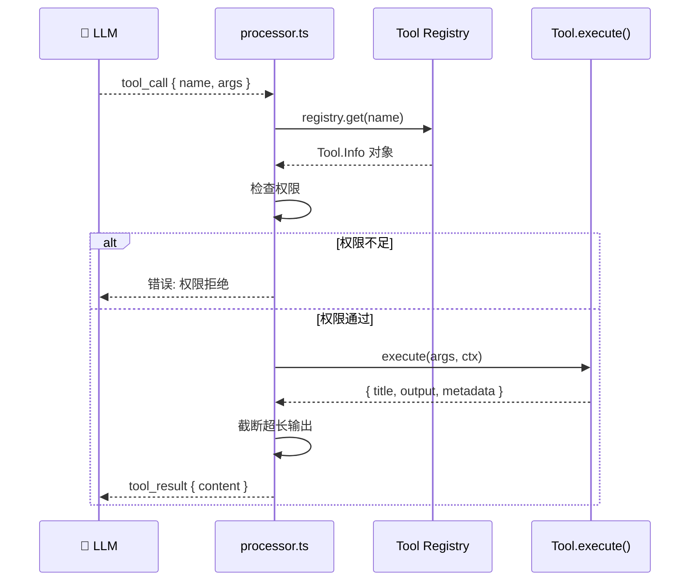

<script setup>
import SourceSnapshotCard from '../../.vitepress/theme/components/SourceSnapshotCard.vue'
</script>

> **学习目标**：理解工具如何定义、注册、过滤和执行，读懂核心工具的实现，掌握权限控制机制
> **前置知识**：第3章"OpenCode 项目介绍"
> **源码路径**：`packages/opencode/src/tool/`
> **阅读时间**：25 分钟

---

## 本章导读

### 这一章解决什么问题

工具是 Agent 能力的全部。理解工具系统，就是理解 Agent 能做什么（工具定义）、被允许做什么（权限控制）、做完后结果怎么传回 LLM（输出截断）。

### 必看入口

tool.ts（Tool.Info 和 Tool.define 定义）、registry.ts（工具注册与过滤）

### 先抓一条主链路

`LLM 返回 tool_call → processor.ts 查 registry.get(name) → 检查权限 → 执行 tool.execute(args) → 截断输出 → 作为 tool_result 返回 LLM`

### 初学者阅读顺序

1. 先读 tool.ts，理解 Tool.Info interface 和 Tool.define 工厂。
2. 读 registry.ts，看工具如何注册和过滤。
3. 读一个具体工具——推荐 bash.ts，它最短也最典型。
4. 读 edit.ts，这是最复杂的工具，包含差异计算逻辑。
5. 最后看 processor.ts 里调用工具的部分，把流程串起来。

### 最容易误解的点

description 字段比 execute 逻辑更重要。LLM 根据工具的 description 决定是否调用、传什么参数，description 写得不好，工具再完善也没用。这是"给 LLM 看"的文档，不是给人看的。

---

工具（Tool）是 Agent 与外部世界的全部接口。理解工具系统，就是理解 Agent 能做什么、被允许做什么、以及做完之后结果怎么传回 LLM。

## 工具调用完整流程

<FunctionCallingCss />

---

## 4.1 工具的数据结构

### Tool.Info：工具的最小协议

每个工具在 OpenCode 里都是一个 `Tool.Info` 对象。看 `tool/tool.ts` 的定义：

```typescript{2,5,6}
// packages/opencode/src/tool/tool.ts
export namespace Tool {
  export interface Info<Parameters extends z.ZodType = z.ZodType> {
    id: string
    init: (ctx?: InitContext) => Promise<{
      description: string
      parameters: Parameters
      execute(
        args: z.infer<Parameters>,
        ctx: Context,
      ): Promise<{
        title: string
        output: string
        metadata: Metadata
        attachments?: FilePart[]
      }>
    }>
  }
}
```

三个核心字段：

- **`id`**：工具名称，LLM 用这个名字发起调用
- **`description`**：工具用途描述，**LLM 根据这段文字决定是否调用**
- **`parameters`**：Zod schema，定义参数类型，同时自动生成 JSON Schema 给 LLM

`init` 是延迟初始化——工具在被注册时不立即初始化，而是在每次会话开始时按需初始化。这让工具可以访问运行时上下文（如当前 Agent 配置）。

**工具执行完整流程：**



### Tool.define：创建工具的工厂函数

实际写工具时使用 `Tool.define` 辅助函数，它在 `init` 外层加了两件事：

1. **参数验证**：每次执行前用 Zod 校验参数，格式错误直接抛出，不让 LLM 用错误参数调用工具
2. **输出截断**：工具输出可能很长（比如读一个大文件），自动截断并告知 LLM 结果被截断了

```typescript
// tool/tool.ts（简化）
// Tool.define 是装饰器模式：在业务逻辑外层自动加上验证和截断
export function define<P extends z.ZodType>(
  id: string,       // 工具唯一标识，LLM 用这个名字发起调用
  init: InitFn<P>,  // 延迟初始化函数，可以访问运行时上下文（如当前 Agent 配置）
): Info<P> {
  return {
    id,
    init: async (initCtx) => {
      // initCtx 包含当前 Agent 信息，让工具知道自己在哪个 Agent 上下文里运行
      const toolInfo = typeof init === "function" ? await init(initCtx) : init

      // 包装 execute，透明地加入验证 + 截断（工具自身代码感知不到）
      const originalExecute = toolInfo.execute
      toolInfo.execute = async (args, ctx) => {
        // 1. 参数验证：用 Zod 校验 LLM 传来的参数，格式错误立刻报错，不执行
        try {
          toolInfo.parameters.parse(args)
        } catch (error) {
          throw new Error(`工具参数无效：${error}`)
          // 错误信息会作为 tool_result 返回给 LLM，让它修正参数后重试
        }

        // 2. 执行原始逻辑：调用工具自己定义的 execute 函数
        const result = await originalExecute(args, ctx)

        // 3. 输出截断（如果工具自己没处理）：超过 1000 行或 100KB 则截断
        if (result.metadata.truncated === undefined) {
          const truncated = await Truncate.output(result.output, {}, initCtx?.agent)
          return { ...result, output: truncated.content, metadata: { ...result.metadata, truncated: truncated.truncated } }
          // 截断时会告知 LLM "完整内容保存在临时文件 xxx，共 N 行"
        }
        return result
      }
      return toolInfo
    },
  }
}
```

---

## 4.2 注册表：工具的统一管理

### ToolRegistry：所有工具的集合

`tool/registry.ts` 是整个工具系统的入口，它做三件事：

1. **列举内置工具**：维护所有内置工具的完整列表
2. **加载自定义工具**：扫描用户配置目录里的工具文件
3. **按模型过滤**：不同 LLM 支持的工具不同，注册表负责过滤

```typescript
// tool/registry.ts（精简）
async function all(): Promise<Tool.Info[]> {
  const custom = await state().then((x) => x.custom)  // 加载用户自定义工具

  // question 工具让 LLM 可以主动向用户提问，需要有 UI 才有意义
  const question = ["app", "cli", "desktop"].includes(Flag.OPENCODE_CLIENT)
    || Flag.OPENCODE_ENABLE_QUESTION_TOOL  // 也可以通过环境变量强制开启

  return [
    InvalidTool,                          // 处理无效工具调用的占位工具
    ...(question ? [QuestionTool] : []),  // 有 UI 时才加入问答工具
    BashTool,       // 执行 Shell 命令（高风险，每次需用户确认）
    ReadTool,       // 读取文件内容
    GlobTool,       // 按名称模式查找文件
    GrepTool,       // 搜索文件内容（基于 ripgrep）
    EditTool,       // 精确字符串替换（Claude 系列主要用这个）
    WriteTool,      // 写入新文件
    TaskTool,       // 启动子 Agent 处理子任务
    WebFetchTool,   // 抓取网页内容
    TodoWriteTool,  // 管理任务清单
    WebSearchTool,  // 网络搜索（需要特定权限）
    CodeSearchTool, // 代码语义搜索（需要特定权限）
    SkillTool,      // 加载可复用的 Skill 提示词
    ApplyPatchTool, // 应用 patch 格式的修改（GPT 系列主要用这个）
    // LSP 工具是实验性的，需要 Flag 开启——默认不暴露给 LLM
    ...(Flag.OPENCODE_EXPERIMENTAL_LSP_TOOL ? [LspTool] : []),
    // 批处理工具需要配置开启
    ...(config.experimental?.batch_tool === true ? [BatchTool] : []),
    // Plan 模式工具只在特定场景下可用
    ...(Flag.OPENCODE_EXPERIMENTAL_PLAN_MODE && Flag.OPENCODE_CLIENT === "cli"
      ? [PlanExitTool] : []),
    ...custom,  // 用户自定义工具（从配置目录 tool/*.ts 加载）
  ]
}
```

### 按模型过滤：tools() 函数

工具不是"加入列表就所有模型都能用"。`tools()` 函数在返回前还要按模型过滤：

```typescript
// tool/registry.ts
export async function tools(model: { providerID, modelID }, agent?: Agent.Info) {
  const allTools = await all()

  return Promise.all(
    allTools
      .filter((t) => {
        // codesearch/websearch 只对 OpenCode 付费用户或开启特定 Flag 的用户可用
        if (t.id === "codesearch" || t.id === "websearch") {
          return model.providerID === ProviderID.opencode || Flag.OPENCODE_ENABLE_EXA
        }

        // GPT 模型使用 apply_patch，其他模型使用 edit/write
        const usePatch = model.modelID.includes("gpt-") && !model.modelID.includes("gpt-4")
        if (t.id === "apply_patch") return usePatch
        if (t.id === "edit" || t.id === "write") return !usePatch

        return true
      })
      .map(async (t) => {
        const tool = await t.init({ agent })
        return { id: t.id, ...tool }
      })
  )
}
```

**关键设计**：GPT 系列模型和 Claude 使用不同的文件编辑工具。GPT 更擅长生成 patch 格式，所以用 `apply_patch`；Claude 更擅长直接 `edit`（指定 oldString/newString）。注册表在这里做了模型感知的工具选择。

### 自定义工具加载

注册表在初始化时还会扫描用户配置目录里的自定义工具：

```typescript
// tool/registry.ts
const matches = await Config.directories().then((dirs) =>
  dirs.flatMap((dir) =>
    Glob.scanSync("{tool,tools}/*.{js,ts}", { cwd: dir, absolute: true })
  )
)

for (const match of matches) {
  const namespace = path.basename(match, path.extname(match))
  const mod = await import(pathToFileURL(match).href)
  for (const [id, def] of Object.entries(mod)) {
    custom.push(fromPlugin(id, def))
  }
}
```

用户只需要在 `~/.config/opencode/tool/` 或项目级 `.opencode/tool/` 目录下放一个导出工具定义的 `.ts` 文件，就能给 Agent 加新工具，不需要修改 OpenCode 源码。

---

## 4.3 核心工具解析

### read：最常用的工具

```typescript
// tool/read.ts（简化）
export const ReadTool = Tool.define("read", {
  description: "读取文件内容，返回文件文本",
  parameters: z.object({
    filePath: z.string().describe("要读取的文件的绝对路径"),
    startLine: z.number().optional().describe("起始行（包含），从 1 开始"),
    endLine: z.number().optional().describe("结束行（包含），从 1 开始"),
  }),
  async execute({ filePath, startLine, endLine }, ctx) {
    const content = await fs.readFile(filePath, "utf-8")
    const lines = content.split("\n")

    const start = (startLine ?? 1) - 1
    const end = endLine ?? lines.length
    const selected = lines.slice(start, end)

    return {
      title: filePath,
      output: selected.map((line, i) => `${start + i + 1}→${line}`).join("\n"),
      metadata: { startLine: start + 1, endLine: end, totalLines: lines.length },
    }
  }
})
```

注意输出格式：每行前面加行号（`23→content`）。这让 LLM 在后续 `edit` 调用时能准确定位要修改的内容，也让输出对用户更可读。

### edit：最精密的工具

`edit` 工具是 OpenCode 里实现最复杂的工具之一。它要做到**精确字符串替换**——找到文件里的 `oldString`，替换成 `newString`：

```typescript
// tool/edit.ts（核心逻辑简化）
export const EditTool = Tool.define("edit", {
  description: DESCRIPTION,  // 从 edit.txt 加载，很长的说明
  parameters: z.object({
    filePath: z.string().describe("要修改的文件的绝对路径"),
    oldString: z.string().describe("要替换的文本"),
    newString: z.string().describe("替换后的文本（必须与 oldString 不同）"),
    replaceAll: z.boolean().optional().describe("是否替换所有匹配（默认 false）"),
  }),
  async execute(params, ctx) {
    // 1. 权限检查（会在 UI 里弹出确认）
    const diff = createTwoFilesPatch(filePath, filePath, contentOld, contentNew)
    await ctx.ask({
      permission: "edit",
      patterns: [path.relative(Instance.worktree, filePath)],
      metadata: { filepath: filePath, diff },
    })

    // 2. 执行替换
    const newContent = replaceAll
      ? content.replaceAll(oldString, newString)
      : content.replace(oldString, newString)

    await fs.writeFile(filePath, newContent)

    // 3. 触发 LSP 诊断（检查修改后是否有类型错误）
    const diagnostics = await LSP.diagnostics(filePath)

    // 4. 返回 diff + 诊断信息
    return {
      title: path.basename(filePath),
      output: diff + (diagnostics.length ? "\n\n诊断：\n" + formatDiagnostics(diagnostics) : ""),
      metadata: { filepath: filePath, diff },
    }
  }
})
```

三个重要设计：

1. **修改前权限确认**：`ctx.ask()` 会暂停执行，等待用户在 UI 里点击"允许"
2. **集成 LSP 诊断**：修改文件后立即运行类型检查，把错误信息返回给 LLM，让它能自动修复
3. **返回 diff**：LLM 看到 diff 而不是新文件全文，减少 token 消耗

### bash：最强大也最危险的工具

```typescript
// tool/bash.ts（简化）
export const BashTool = Tool.define("bash", async () => {
  const shell = Shell.acceptable()  // 检测系统可用的 shell（bash/zsh/sh）

  return {
    description: DESCRIPTION,  // 从 bash.txt 加载
    parameters: z.object({
      command: z.string().describe("要执行的命令"),
      timeout: z.number().optional().describe("超时时间（毫秒）"),
      workdir: z.string().optional().describe("工作目录"),
      description: z.string().describe("5-10字描述这个命令在做什么"),
    }),
    async execute(params, ctx) {
      // 1. 权限检查（bash 工具每次都需要确认，除非在规则里设置了 always allow）
      await ctx.ask({
        permission: "execute",
        patterns: [params.command],
        metadata: { command: params.command },
      })

      // 2. 执行命令
      const result = await runCommand(params.command, {
        cwd: params.workdir || Instance.directory,
        timeout: params.timeout || DEFAULT_TIMEOUT,
        shell,
      })

      return {
        title: params.description,
        output: result.stdout + result.stderr,
        metadata: { exitCode: result.exitCode },
      }
    }
  }
})
```

`bash` 工具的 `description` 参数有一个巧妙设计——它要求 LLM 在调用时必须提供一个简短的人类可读描述（"安装项目依赖"、"运行测试"）。这个描述会显示在 UI 里，让用户知道 Agent 在执行什么命令，而不是只看到一行晦涩的 shell 命令。

### grep 和 glob：搜索工具

```typescript
// tool/grep.ts（简化）
export const GrepTool = Tool.define("grep", {
  description: "在文件内容中搜索正则表达式模式",
  parameters: z.object({
    pattern: z.string().describe("正则表达式"),
    path: z.string().optional().describe("搜索路径"),
    glob: z.string().optional().describe("文件名过滤模式，如 '*.ts'"),
    caseInsensitive: z.boolean().optional(),
    output: z.enum(["content", "files", "count"]).optional(),
  }),
  async execute(params, ctx) {
    // 用 ripgrep（rg）执行，比原生 grep 快 10 倍以上
    const results = await runRipgrep(params)
    return { title: params.pattern, output: formatResults(results), metadata: {} }
  }
})

// tool/glob.ts（简化）
export const GlobTool = Tool.define("glob", {
  description: "按文件名模式查找文件",
  parameters: z.object({
    pattern: z.string().describe("glob 模式，如 '**/*.ts'"),
    path: z.string().optional(),
  }),
  async execute(params) {
    const files = await glob(params.pattern, { cwd: params.path || Instance.directory })
    return { title: params.pattern, output: files.join("\n"), metadata: {} }
  }
})
```

---

## 4.4 权限系统

### 为什么需要权限控制

工具是 Agent 的能力，但能力需要约束。没有权限系统，Agent 会在没有用户意识的情况下删文件、执行危险命令、访问敏感路径。

OpenCode 的权限模型基于**规则（Rule）**，每条规则是一个三元组：

```typescript
// permission/next.ts
export interface Rule {
  permission: string    // 权限类型，如 "edit"、"execute"、"read"
  pattern: string       // 路径或命令的匹配模式，支持 glob
  action: "allow" | "deny" | "ask"  // 对应操作
}
```

### 规则的来源

规则从三个地方合并：

```typescript
// 1. 用户配置文件（config.json）
{
  "permission": {
    "execute": "ask",           // 所有命令执行都询问
    "edit": {
      "src/**": "allow",        // src 目录下的编辑直接允许
      "*.lock": "deny"          // lock 文件禁止修改
    }
  }
}

// 2. Agent 定义里的默认规则（agent/agent.ts）

// 3. 运行时动态添加（用户点击"总是允许"时）
```

**权限决策流程动画：** 点击"允许"/"始终允许"/"拒绝"，观察三条路径对 Agent 的不同影响。

<PermissionFlow />

### ctx.ask()：权限请求机制

工具通过 `ctx.ask()` 发起权限请求：

```typescript
// 工具执行时请求权限
await ctx.ask({
  permission: "edit",
  patterns: ["src/config.ts"],
  always: ["src/**"],           // 如果用户点"总是允许"，自动添加这个规则
  metadata: {
    filepath: "src/config.ts",
    diff: "- port = 3000\n+ port = 8080",
  },
})
```

`PermissionNext` 的核心逻辑：

```typescript
// permission/next.ts（简化）
// 权限检查是工具执行路径上的强制门卫，无法绕过
export async function check(request: Request): Promise<Action> {
  const rules = await getRuleset()  // 从配置文件 + 运行时动态规则合并

  for (const rule of rules) {
    // 先匹配权限类型（"edit"、"execute"、"read"）
    if (!matchesPermission(rule.permission, request.permission)) continue
    // 再匹配路径/命令模式（支持 glob 通配符，如 "src/**"）
    if (!Wildcard.match(rule.pattern, request.patterns)) continue

    // 找到第一条匹配规则后立即返回，不继续检查后续规则
    if (rule.action === "allow") return "allow"  // 直接放行
    if (rule.action === "deny")  return "deny"   // 直接拒绝，工具调用失败
    // rule.action === "ask"：暂停执行，发布权限请求事件，等待 UI 显示确认弹窗
  }

  // 没有任何规则匹配：保守策略，默认询问用户
  return "ask"
}
```

当结果是 `"ask"` 时，工具执行暂停，通过 Bus 发布权限请求事件，UI 显示确认弹窗，等待用户响应。

### 权限配置示例

常见的权限配置：

```json
{
  "permission": {
    "execute": {
      "git *": "allow",
      "npm test": "allow",
      "rm *": "deny",
      "*": "ask"
    },
    "edit": {
      "src/**": "allow",
      "package.json": "ask",
      "*.lock": "deny"
    }
  }
}
```

---

## 4.5 输出截断：Truncate 系统

### 为什么要截断

工具输出可能很大：
- 读一个 10000 行的文件
- `bash` 命令输出了几千行日志
- `grep` 匹配到了几百个结果

把所有内容都塞进 LLM 的上下文会：
1. 超出 token 限制
2. 浪费大量 token（有效内容只占一小部分）
3. 影响 LLM 的注意力（更多无关内容 → 更低准确率）

### Truncate.output：截断策略

```typescript
// tool/truncation.ts（简化）
export namespace Truncate {
  export const MAX_LINES = 1000
  export const MAX_BYTES = 100_000  // 约 100KB

  export async function output(
    content: string,
    opts: {},
    agent?: Agent.Info,
  ): Promise<{ content: string; truncated: boolean; outputPath?: string }> {
    const lines = content.split("\n")

    if (lines.length <= MAX_LINES && Buffer.byteLength(content) <= MAX_BYTES) {
      return { content, truncated: false }
    }

    // 超出限制：截断并保存完整内容到临时文件
    const truncated = lines.slice(0, MAX_LINES).join("\n")
    const outputPath = await saveTempFile(content)

    return {
      content: truncated + `\n\n[内容已截断。完整输出保存在 ${outputPath}，共 ${lines.length} 行]`,
      truncated: true,
      outputPath,
    }
  }
}
```

截断不是丢弃——完整内容保存到临时文件，并在截断处告知 LLM 完整内容的位置。LLM 如果需要更多内容，可以调用 `read` 工具读取完整文件。

---

## 4.6 Task 工具：子任务编排

`task` 工具是工具系统里最特殊的一个——它不操作文件或执行命令，而是**启动一个子 Agent**：

```typescript
// tool/task.ts（简化）
export const TaskTool = Tool.define("task", {
  description: `启动子 Agent 完成独立的子任务。
    适用场景：
    - 探索代码库（不需要修改文件）
    - 并行执行多个独立任务
    - 需要独立上下文的子任务
  `,
  parameters: z.object({
    description: z.string().describe("子任务的详细描述"),
    prompt: z.string().describe("发给子 Agent 的指令"),
  }),
  async execute(params, ctx) {
    // 创建子会话
    const subSession = await Session.create({
      agent: "subagent",     // 使用 subagent 模式（权限受限）
      parentID: ctx.sessionID,
    })

    // 在子会话里执行任务
    await Session.prompt(subSession.id, { content: params.prompt })

    // 等待子任务完成并返回结果
    const result = await waitForCompletion(subSession.id)
    return { title: params.description, output: result, metadata: {} }
  }
})
```

这是 Multi-Agent 模式的具体实现。主 Agent 可以把"探索代码库"、"查找相关文件"这类探索性任务交给 subagent，自己专注于实际修改，提高效率并减少主上下文的 token 占用。

---

## 4.7 描述即接口：工具设计的关键

### description 是 Agent 和工具之间的"API 文档"

工具的 `description` 不是给人看的注释，而是 LLM 决策的依据。它直接影响工具是否被调用、何时被调用、参数如何填写。

看 `bash.ts` 从外部 `.txt` 文件加载 description 的设计：

```typescript
import DESCRIPTION from "./bash.txt"

export const BashTool = Tool.define("bash", async () => ({
  description: DESCRIPTION
    .replaceAll("${directory}", Instance.directory)
    .replaceAll("${maxLines}", String(Truncate.MAX_LINES)),
  // ...
}))
```

把 description 放在独立的 `.txt` 文件里有两个好处：
1. 可以写很长的说明（bash.txt 有几十行）而不影响代码可读性
2. 运行时动态插入变量（当前工作目录、最大输出行数等）

### 好描述 vs 坏描述

```text
坏描述（太模糊）：
  "执行命令"

结果：LLM 什么时候该用这个工具？不知道。

好描述（具体、有边界）：
  "在 shell 里执行命令。用于：运行测试、安装依赖、执行脚本。
   不要用于：读写文件（用 read/write 工具）、搜索内容（用 grep 工具）。
   工作目录：${directory}。
   输出超过 ${maxLines} 行会被截断。"

结果：LLM 清楚知道这个工具的边界，不会滥用。
```

OpenCode 的工具 description 都遵循这个原则：告诉 LLM 什么时候用、什么时候不用、有什么限制。

---

## 本章小结

工具系统的四层结构：

```text
┌─────────────────────────────────────────────────────┐
│             ToolRegistry.tools()                     │
│   按模型过滤 + 加载自定义工具 + 初始化                 │
└─────────────────────────────────────────────────────┘
                        ↓
┌─────────────────────────────────────────────────────┐
│               Tool.define()                          │
│   参数验证（Zod）+ 输出截断（Truncate）               │
└─────────────────────────────────────────────────────┘
                        ↓
┌─────────────────────────────────────────────────────┐
│              工具 execute() 函数                      │
│   ctx.ask()（权限）+ 实际业务逻辑                     │
└─────────────────────────────────────────────────────┘
                        ↓
┌─────────────────────────────────────────────────────┐
│           PermissionNext.check()                     │
│   规则匹配：allow / deny / ask（等待用户）            │
└─────────────────────────────────────────────────────┘
```

**关键设计决策**：

| 决策 | 原因 |
|------|------|
| 工具用独立 `.ts` 文件，不是 switch-case | 新增工具不改注册表，只加文件 |
| description 从 `.txt` 加载 | 可以写详细说明，支持运行时变量 |
| edit 工具集成 LSP 诊断 | 修改后立刻知道有没有类型错误 |
| bash 工具要求填写 description 参数 | 用户能在 UI 里看懂 Agent 在做什么 |
| 输出截断保存到临时文件 | 不丢数据，LLM 可以按需获取完整内容 |
| GPT 和 Claude 用不同的编辑工具 | 不同模型对不同格式的执行效果不同 |

### 思考题

1. 为什么 `edit` 工具要求提供 `oldString` 而不是行号？行号定位在什么情况下会出问题？
2. 输出截断的阈值（1000 行 / 100KB）是如何平衡"给 LLM 足够信息"和"不浪费 token"的？
3. 如果你要给 OpenCode 加一个"发送 Slack 消息"的工具，permission 字段应该设计成什么类型？

---

## 下一章预告

**第5章：会话管理**

深入 `packages/opencode/src/session/`，学习：
- Session 的数据模型（session.sql.ts）
- `prompt.ts`：用户消息如何进入会话
- `processor.ts`：执行循环的完整实现
- `message-v2.ts`：结构化消息模型与多端同步

---

## 常见误区

### 误区1：工具的 description 是给开发者看的注释，随便写

**错误理解**：`description` 字段只是说明工具功能的注释，LLM 会通过参数类型来理解如何调用工具。

**实际情况**：`description` 是工具系统中最关键的字段，LLM 完全依赖它来决定是否调用工具以及传什么参数。OpenCode 把复杂工具的 description 放在独立的 `.txt` 文件里（如 `bash.txt`），并支持运行时变量插值（如当前工作目录、最大输出行数）。description 写得不清晰，直接导致工具被误用或被忽略。

### 误区2：edit 工具应该用行号定位，这样更精确

**错误理解**：编辑文件时，用行号（第23行到第45行）定位比字符串匹配更精确，应该设计成 `startLine/endLine` 参数。

**实际情况**：行号在 LLM 工作流中不可靠——LLM 读取文件后，如果中间插入或删除了几行，原来记住的行号就失效了。`edit` 工具用 `oldString/newString` 做精确字符串替换，只要代码没被其他操作改过，位置就是确定的。这是有意的设计选择，不是偷懒。

### 误区3：bash 工具执行的命令 LLM 可以自由选择，不需要用户知道

**错误理解**：LLM 调用 `bash` 工具时，用户只会看到"Agent 在执行命令"，不需要知道具体命令内容。

**实际情况**：`bash` 工具要求 LLM 必须提供 `description` 参数（一个 5-10 字的人类可读说明），这个说明会显示在 UI 确认弹窗里。加上权限系统默认要求用户确认每条命令，用户对 Agent 执行的每个命令都有完全的可见性和控制权。这是 OpenCode 安全设计的核心。

### 误区4：工具输出被截断意味着信息丢失，应该避免截断

**错误理解**：`Truncate` 系统会丢弃超出限制的输出，导致 LLM 基于不完整信息做决策。

**实际情况**：截断设计是"不丢失，而是延迟获取"。完整内容被保存到临时文件，截断位置会告知 LLM 完整文件的路径和总行数。如果 LLM 需要更多内容，可以调用 `read` 工具读取完整文件。这避免了一次性把 10000 行日志全部放入上下文，又保证信息不丢失。

### 误区5：所有模型使用相同的工具集，工具是通用的

**错误理解**：注册到 OpenCode 的工具对所有 LLM 都一样可用，不需要区分模型。

**实际情况**：`registry.ts` 的 `tools()` 函数会根据模型进行过滤。最典型的例子：GPT 系列模型使用 `apply_patch` 工具（patch 格式），而 Claude 等模型使用 `edit`/`write` 工具（字符串替换）。这是基于实际测试发现不同模型对不同格式的执行效果不同，注册表在此做了模型感知的工具路由。

---

<SourceSnapshotCard
  title="第4章源码快照"
  description="工具系统是 Agent 能力的全部来源。tool.ts 定义接口，registry.ts 管理注册，具体工具在 tool/ 子目录。读懂这四个文件，你就理解了 OpenCode 的工具生态。"
  repo="anomalyco/opencode"
  repo-url="https://github.com/anomalyco/opencode/tree/f8475649da1cd7a6d49f8f30ee2fad374c2f4fcc"
  branch="dev"
  commit="f8475649da1cd7a6d49f8f30ee2fad374c2f4fcc"
  verified-at="2026-03-17"
  :entries="[
    { label: '工具接口定义', path: 'packages/opencode/src/tool/tool.ts', href: 'https://github.com/anomalyco/opencode/blob/f8475649da1cd7a6d49f8f30ee2fad374c2f4fcc/packages/opencode/src/tool/tool.ts' },
    { label: '工具注册表', path: 'packages/opencode/src/tool/registry.ts', href: 'https://github.com/anomalyco/opencode/blob/f8475649da1cd7a6d49f8f30ee2fad374c2f4fcc/packages/opencode/src/tool/registry.ts' },
    { label: 'Bash 工具', path: 'packages/opencode/src/tool/bash.ts', href: 'https://github.com/anomalyco/opencode/blob/f8475649da1cd7a6d49f8f30ee2fad374c2f4fcc/packages/opencode/src/tool/bash.ts' },
    { label: '文件编辑工具', path: 'packages/opencode/src/tool/edit.ts', href: 'https://github.com/anomalyco/opencode/blob/f8475649da1cd7a6d49f8f30ee2fad374c2f4fcc/packages/opencode/src/tool/edit.ts' },
  ]"
/>


<StarCTA />
