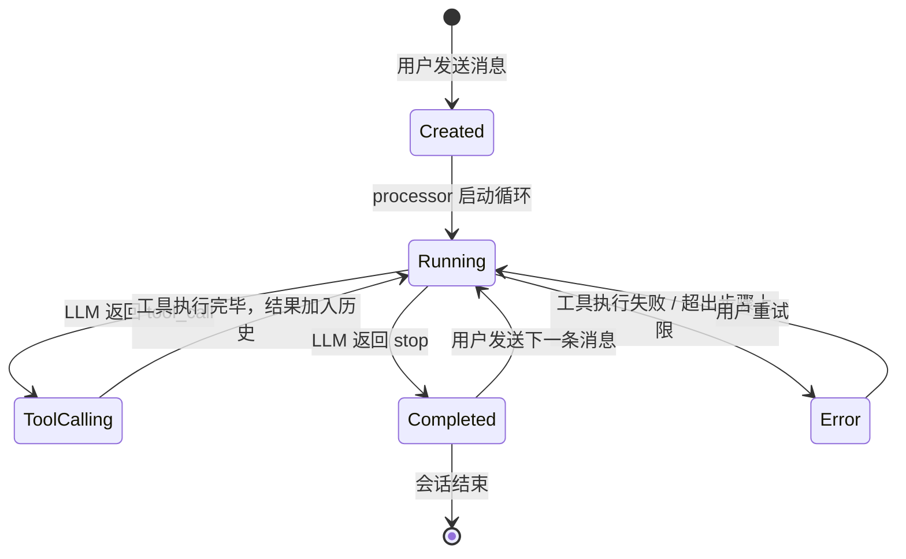
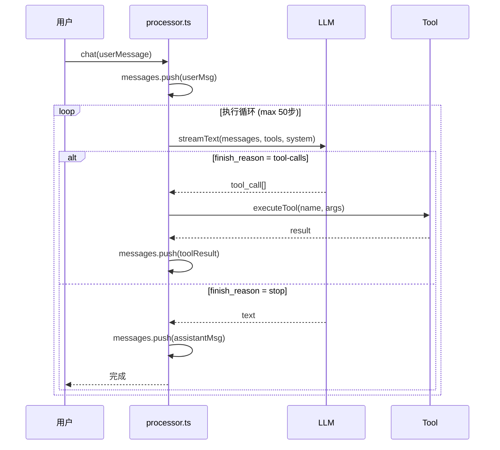

<script setup>
import SourceSnapshotCard from '../../.vitepress/theme/components/SourceSnapshotCard.vue'
</script>

<ChapterLearningGuide />

> **源码路径**：`packages/opencode/src/session/`

## 本章导读

### 这一章解决什么问题

Agent 循环在代码里长什么样？怎么防止 LLM 无限循环调用工具？上下文窗口满了怎么办？这三个问题的答案都在 processor.ts 这一个文件里。

### 必看入口

processor.ts（执行循环主体，这是全书最重要的文件之一）

### 先抓一条主链路

`processor.ts 启动 → 构建 messages 数组 → 调用 LLM → 解析响应 → if tool_call: 执行工具，结果加入 messages，继续循环 → if stop: 退出循环，会话结束`

### 初学者阅读顺序

1. 先读 schema.ts，理解 Session 和 Message 的数据结构。
2. 打开 processor.ts，找到主循环的 while 语句——从这里开始阅读。
3. 读 llm.ts，理解流式响应如何解析成结构化数据。
4. 读 summary.ts，了解上下文压缩策略。
5. 回到 processor.ts 看步骤上限检查，理解死循环防护。

### 最容易误解的点

MessageV2 的 Parts 设计——一条 assistant 消息可以包含多个 Part（思考文字、工具调用、工具结果、最终文字）。这不是冗余设计，而是让 CLI、Web、Desktop 三端都能按需渲染同一条消息的不同部分。

---

工具负责和外部世界交互，但是**谁来驱动工具调用？谁来记录发生了什么？谁来决定什么时候停下来？** 这三个问题的答案都在会话管理（Session）里。

Session 是 OpenCode 的核心数据骨架——所有消息、工具调用、推理过程、文件变更，最终都挂在某个 Session 下持久化。

## 多轮对话与上下文传递

<MultiTurnDialog />

---

## 5.1 Session 的数据模型

### Session 是什么

Session（会话）是一次连续对话的容器。它有：

- 一个唯一 ID
- 所属的工作区（Workspace）
- 创建和更新时间
- 一组按时序排列的消息（Message）

```text
Session
├── id: "01JNXXX..."
├── workspaceID: "my-project"
└── messages: [
      Message(user)    → "帮我读取 config.ts"
      Message(assistant) → [工具调用 read, 工具结果, 文本回复]
      Message(user)    → "把 port 改成 8080"
      Message(assistant) → [工具调用 edit, 工具结果, 文本回复]
    ]
```

**Session 生命周期：**



### Message 的角色划分

每条消息有两种角色：

```typescript
// session/schema.ts
// 注意：只有两种 role，没有 "tool" role——工具结果是 assistant 消息的 Part
type MessageRole = "user" | "assistant"
```

- **user 消息**：用户输入 + 附件（图片、文件、代码引用）
- **assistant 消息**：LLM 的完整响应，包含推理过程、工具调用、文本输出

消息之间用 `parentID` 形成链式结构：每条 assistant 消息知道自己是在回复哪条 user 消息。

---

## 5.2 MessageV2：结构化消息

### 为什么不用纯文本

如果消息只存文本字符串，会有几个问题：

1. CLI、Web、Desktop 无法区分"这段文字是思考过程"还是"这段文字是最终答案"
2. 会话恢复时无法重播工具调用的状态
3. 无法追踪哪个步骤修改了哪些文件

OpenCode 用 **Part（部件）** 系统解决这个问题。每条消息由多个 Part 组成，每种 Part 有明确的类型和结构。

### Part 类型全览

```typescript
// session/message-v2.ts
type Part =
  | TextPart        // 文本输出
  | ReasoningPart   // LLM 的推理过程（如 Claude Extended Thinking）
  | ToolPart        // 工具调用（含输入、输出、状态）
  | FilePart        // 附件（图片、PDF、代码引用）
  | StepStartPart   // 步骤开始标记（含快照哈希）
  | StepFinishPart  // 步骤结束标记（含 token 用量、成本）
  | PatchPart       // 本步骤修改的文件列表
  | CompactionPart  // 上下文压缩标记
  | SubtaskPart     // 子任务（task 工具启动的子 Agent）
  | RetryPart       // 重试记录
  | AgentPart       // Agent 切换标记
```

### TextPart：文本输出

```typescript
export const TextPart = PartBase.extend({
  type: z.literal("text"),
  text: z.string(),                           // LLM 输出的文字内容
  synthetic: z.boolean().optional(),          // true 时表示系统生成，不展示给用户
                                              // （如上下文压缩后插入的"请继续"）
  ignored: z.boolean().optional(),            // 被标记为忽略，不传给下次 LLM 调用
  time: z.object({
    start: z.number(),                        // 第一个 token 到达的时间戳（ms）
    end: z.number().optional(),               // 最后一个 token 到达的时间戳
  }).optional(),
  // start/end 让 UI 能展示"生成耗时 X 秒"
})
```

`synthetic: true` 的文本是系统注入的特殊文本，比如"上下文已压缩，请继续"这类指令，不是 LLM 真实输出，UI 可以选择不展示。

### ToolPart：完整的工具生命周期

ToolPart 记录一次工具调用的全生命周期：

```typescript
type ToolState =
  | { status: "pending"; input: {}; raw: string }
  // LLM 开始生成工具参数，但还没完整

  | { status: "running"; input: Record<string, unknown>; time: { start: number } }
  // 参数接收完整，工具开始执行

  | { status: "completed"; input: {}; output: string; title: string; time: { start: number; end: number; compacted?: number } }
  // 执行成功，output 是工具返回的结果字符串

  | { status: "error"; input: {}; error: string; time: { start: number; end: number } }
  // 执行失败
```

`compacted` 时间戳：当上下文压缩时，老旧工具调用的 `output` 会被清空，但保留 `compacted` 标记，让 UI 知道"这个工具结果被压缩了"而不是"没有结果"。

### StepStartPart 和 StepFinishPart：步骤边界

一条 assistant 消息可能包含多个"步骤"（每次 LLM 调用一批工具算一步）。步骤之间有明确边界：

```typescript
// StepStartPart 在每步开始时插入
{ type: "step-start", snapshot: "git-sha-xxx" }

// StepFinishPart 在每步结束时插入，记录资源消耗
{ type: "step-finish", reason: "tool-calls", tokens: { input: 1200, output: 340 }, cost: 0.0023 }
```

`snapshot` 是当前工作区的 Git 快照哈希——每步开始时记录文件状态，配合 PatchPart 可以还原某一步做了什么改动。

### PatchPart：文件变更追踪

```typescript
{ type: "patch", hash: "abc123", files: ["src/config.ts", "tests/config.test.ts"] }
```

每步结束后，OpenCode 对比 Git 快照，生成本步修改的文件列表。这让 UI 可以显示"第3步修改了 2 个文件"，用户可以点击查看 diff，也可以一键撤销某一步的所有修改。

---

## 5.3 执行循环：processor.ts 深度解析



**messages 数组增长动画：** 每一轮 Loop 结束后，messages 里多了哪些条目、token 计数如何增长，播放一遍就能看清楚。

<MessageAccumulator />

### 整体结构

`processor.ts` 是 OpenCode 最核心的文件。它实现了第2章讲的 Execution Loop，但比伪代码复杂得多。

```typescript
// session/processor.ts
export namespace SessionProcessor {
  const DOOM_LOOP_THRESHOLD = 3  // 死循环检测阈值

  export function create(input: {
    assistantMessage: MessageV2.Assistant
    sessionID: SessionID
    model: Provider.Model
    abort: AbortSignal
  }) {
    // 状态变量
    const toolcalls: Record<string, MessageV2.ToolPart> = {}  // 进行中的工具调用
    let snapshot: string | undefined   // 当前步骤的快照哈希
    let blocked = false                // 是否因权限拒绝而中止
    let needsCompaction = false        // 是否需要压缩上下文

    return {
      async process(streamInput: LLM.StreamInput): Promise<"continue" | "compact" | "stop"> {
        while (true) {  // 重试循环（处理网络错误等可重试异常）
          const stream = await LLM.stream(streamInput)

          for await (const value of stream.fullStream) {
            // 处理每个流式事件
            switch (value.type) { ... }
          }

          if (needsCompaction) return "compact"
          if (blocked) return "stop"
          return "continue"
        }
      }
    }
  }
}
```

返回值有三种：

| 返回值 | 含义 | 调用方行为 |
|--------|------|-----------|
| `"continue"` | 正常完成 | 等待下一条用户消息 |
| `"compact"` | 上下文溢出，需要压缩 | 运行 SessionCompaction，然后继续 |
| `"stop"` | 遇到权限拒绝或错误 | 停止处理，等待用户介入 |

### 流式事件处理

LLM 通过流式 API 逐块返回结果，`processor.ts` 的核心是处理每种事件类型。完整的事件处理流程：

```typescript
for await (const value of stream.fullStream) {
  switch (value.type) {

    case "start":
      // 流开始，把 session 状态设为 busy
      SessionStatus.set(sessionID, { type: "busy" })
      break

    case "reasoning-start":
    case "reasoning-delta":
    case "reasoning-end":
      // 处理 Extended Thinking 的推理过程
      // 实时更新 ReasoningPart 的 text 字段（流式追加）
      await Session.updatePartDelta({ partID, field: "text", delta: value.text })
      break

    case "text-start":
      // 新建 TextPart，准备接收文字
      currentText = { type: "text", text: "", ... }
      await Session.updatePart(currentText)
      break

    case "text-delta":
      // 流式追加文字
      currentText.text += value.text
      await Session.updatePartDelta({ field: "text", delta: value.text })
      break

    case "text-end":
      // 文字完成，trim + 触发插件钩子
      await Plugin.trigger("experimental.text.complete", ...)
      break

    case "tool-input-start":
      // LLM 开始生成工具参数（参数还没完整）
      toolcalls[value.id] = { type: "tool", state: { status: "pending" } }
      break

    case "tool-call":
      // 工具参数接收完整，开始执行
      // 先做死循环检测，然后执行工具
      await checkDoomLoop(value)
      // ... 工具执行在 AI SDK 内部触发
      break

    case "tool-result":
      // 工具执行完成，更新 ToolPart 状态为 completed
      await Session.updatePart({ ...match, state: { status: "completed", output: value.output } })
      break

    case "tool-error":
      // 工具执行失败
      await Session.updatePart({ ...match, state: { status: "error", error: value.error } })
      if (value.error instanceof PermissionNext.RejectedError) {
        blocked = true  // 权限拒绝，循环结束后返回 "stop"
      }
      break

    case "start-step":
      // 步骤开始，打快照
      snapshot = await Snapshot.track()
      await Session.updatePart({ type: "step-start", snapshot })
      break

    case "finish-step":
      // 步骤结束，记录 token 用量，检查是否需要压缩
      const usage = Session.getUsage({ model, usage: value.usage })
      await Session.updatePart({ type: "step-finish", tokens: usage.tokens, cost: usage.cost })
      if (await SessionCompaction.isOverflow({ tokens: usage.tokens, model })) {
        needsCompaction = true
      }
      break
  }
}
```

### 死循环检测（Doom Loop）

Agent 可能陷入死循环——比如 LLM 一直用相同参数调用同一个工具，永远拿不到想要的结果。OpenCode 在 `tool-call` 处理里加了检测：

```typescript
// processor.ts（doom loop 检测）
const DOOM_LOOP_THRESHOLD = 3

case "tool-call": {
  // 获取当前消息最近的 N 个 Part
  const parts = await MessageV2.parts(assistantMessage.id)
  const lastThree = parts.slice(-DOOM_LOOP_THRESHOLD)

  // 如果最近 3 个 Part 都是同一工具 + 同样参数
  if (
    lastThree.length === DOOM_LOOP_THRESHOLD &&
    lastThree.every(p =>
      p.type === "tool" &&
      p.tool === value.toolName &&
      JSON.stringify(p.state.input) === JSON.stringify(value.input)
    )
  ) {
    // 暂停，询问用户是否继续
    await PermissionNext.ask({
      permission: "doom_loop",
      patterns: [value.toolName],
      metadata: { tool: value.toolName, input: value.input },
    })
  }
}
```

相同工具 + 相同参数出现 3 次 → 暂停并询问用户，而不是无限消耗 token。

### 错误重试机制

网络错误、速率限制、API 超时——这些是暂时性错误，应该重试，不应该中断任务。`processor.ts` 的外层 `while (true)` 专门处理重试：

```typescript
// session/retry.ts（配合 processor.ts）
export namespace SessionRetry {
  export function retryable(error: MessageV2.Error): string | undefined {
    // 返回重试原因（字符串），或 undefined（不可重试）
    if (error.name === "APIError" && error.isRetryable) return "API 错误，正在重试..."
    if (error.name === "MessageAbortedError") return undefined  // 用户主动中止，不重试
    return undefined
  }

  export function delay(attempt: number, error?: APIError): number {
    // 指数退避：1s, 2s, 4s, 8s...
    if (error?.statusCode === 429) {
      // 速率限制：从响应头读取 Retry-After
      const retryAfter = error.responseHeaders?.["retry-after"]
      if (retryAfter) return parseInt(retryAfter) * 1000
    }
    return Math.min(1000 * Math.pow(2, attempt - 1), 30_000)
  }
}

// processor.ts 里的重试逻辑
} catch (e) {
  const retry = SessionRetry.retryable(error)
  if (retry !== undefined) {
    attempt++
    const delay = SessionRetry.delay(attempt, error)
    SessionStatus.set(sessionID, {
      type: "retry",
      attempt,
      message: retry,
      next: Date.now() + delay,
    })
    await SessionRetry.sleep(delay, abort)
    continue  // 回到 while(true) 的顶部，重新发起 LLM 调用
  }
  // 不可重试的错误：中止
  assistantMessage.error = error
  return "stop"
}
```

---

## 5.4 上下文压缩（Compaction）

### 问题：上下文窗口是有限的

长对话必然面临上下文溢出。当 token 累计到接近模型上限时，有两种策略：

1. **截断**：丢掉最早的消息（简单，但会丢失重要上下文）
2. **压缩**：用 LLM 把历史对话总结成摘要，用摘要替代原始消息（复杂，但不丢信息）

OpenCode 选择压缩。

### 触发时机

`finish-step` 事件处理时检查是否需要压缩：

```typescript
// session/compaction.ts
export async function isOverflow(input: { tokens, model }): Promise<boolean> {
  const config = await Config.get()
  if (config.compaction?.auto === false) return false

  const context = input.model.limit.context
  const reserved = config.compaction?.reserved
    ?? Math.min(20_000, ProviderTransform.maxOutputTokens(model))

  // usable = 上下文窗口 - 为输出预留的空间
  const usable = model.limit.input
    ? model.limit.input - reserved
    : context - maxOutputTokens

  const count = tokens.total || tokens.input + tokens.output + tokens.cache.read + tokens.cache.write
  return count >= usable
}
```

### 压缩过程

触发压缩时，OpenCode 用一个特殊的 `compaction` Agent 来总结对话：

```typescript
// session/compaction.ts（process 函数简化）
export async function process(input: { sessionID, messages, parentID, auto, abort }) {
  // 1. 创建一个 compaction 模式的 assistant 消息
  const msg = await Session.updateMessage({
    role: "assistant",
    mode: "compaction",
    agent: "compaction",
    summary: true,  // 标记这是摘要消息
    ...
  })

  // 2. 用以下格式的 prompt 让 LLM 生成摘要
  const prompt = `
    Provide a detailed prompt for continuing our conversation above.
    Focus on information helpful for continuing the conversation:
    what we did, what we're doing, which files we're working on, and what we'll do next.

    Template:
    ## Goal
    [What goal(s) is the user trying to accomplish?]

    ## Instructions
    [Important instructions from user]

    ## Discoveries
    [Notable things learned during conversation]

    ## Accomplished
    [Work completed, in progress, and remaining]

    ## Relevant files / directories
    [List of files that have been read, edited, or created]
  `

  // 3. 调用 LLM 生成摘要（不提供工具，只输出文字）
  const result = await processor.process({
    messages: existingMessages,
    tools: {},   // 压缩过程不调用工具
    system: [],
    ...
  })

  // 4. 压缩完成后，插入 synthetic user 消息"请继续"
  // 让新一轮 LLM 调用读取摘要并继续工作
}
```

压缩后的对话历史结构：

```text
之前：
  [消息1] [消息2] ... [消息50]  ← 50 条消息，token 快满了

压缩后：
  [CompactionPart + 摘要文字]   ← 1 条摘要消息
  [继续的用户消息]              ← "请继续你的工作"
  [新的 assistant 响应]         ← 从这里继续
```

### 工具输出剪枝（Prune）

除了整体压缩，OpenCode 还有一个更细粒度的优化——剪枝旧的工具输出：

```typescript
// session/compaction.ts（prune 函数）
export async function prune(input: { sessionID }) {
  // 从最新消息往前遍历
  // 保留最近 40,000 token 的工具调用输出
  // 清空更早的工具输出（只保留工具名和参数，不保留结果）
  // 这样 LLM 还能看到"做了什么"，但不必存储所有中间结果
}
```

逻辑：最近的工具结果可能还会被引用，需要保留；很早之前的工具结果（比如读取的一个已经修改完的文件），继续占用 token 没有价值。

---

## 5.5 Bus：事件广播系统

### 为什么需要事件总线

`processor.ts` 在处理流式响应时，需要实时通知 UI 更新。但 `processor.ts` 不直接和 UI 交互——它通过 **Bus（事件总线）** 广播事件，UI 订阅自己感兴趣的事件。

```typescript
// bus/bus-event.ts（部分事件定义）
export const Session = {
  Updated: BusEvent.define("session.updated", SessionInfo),
  Error:   BusEvent.define("session.error", ErrorInfo),
}

export const MessageV2 = {
  PartUpdated:      BusEvent.define("session.message.part.updated", PartInfo),
  PartDelta:        BusEvent.define("session.message.part.delta", DeltaInfo),
}
```

**更新 Part 时同时广播**：

```typescript
// session/index.ts
export async function updatePartDelta(input: { sessionID, messageID, partID, field, delta }) {
  // 1. 更新数据库
  await db.update(PartTable)
    .set({ [field]: sql`${PartTable[field]} || ${delta}` })
    .where(...)

  // 2. 广播事件（UI 收到后实时追加文字）
  Bus.publish(MessageV2.PartDelta, {
    sessionID: input.sessionID,
    partID: input.partID,
    field: input.field,
    delta: input.delta,
  })
}
```

### 多端同步

TUI、Web、Desktop 都订阅 Bus 事件：

```text
processor.ts 发布 PartDelta 事件
    ↓
Bus 广播给所有订阅者
    ├── TUI 收到 → 在终端里追加文字
    ├── Web 收到 → 通过 SSE 推送到浏览器，更新 DOM
    └── Desktop 收到 → 更新 Tauri WebView
```

这是 OpenCode 实现"多端实时同步"的底层机制——不是轮询，而是事件驱动。

---

## 5.6 prompt.ts：用户消息如何进入会话

`prompt.ts` 是用户消息进入会话系统的门。它比想象中做的事要多：

```typescript
// session/prompt.ts（精简）
export namespace SessionPrompt {
  export async function prompt(input: PromptInput) {
    // 1. 防止并发：同一个 session 不能同时处理两条消息
    assertNotBusy(input.sessionID)

    // 2. 处理"重新生成"：如果 messageID 已存在，先回滚到那个状态
    if (input.messageID) {
      await SessionRevert.revert({ sessionID, messageID })
    }

    // 3. 收集上下文：读取 CLAUDE.md、项目信息等
    const systemPrompt = await SystemPrompt.build(input.sessionID, agent, model)

    // 4. 加载工具（按模型过滤）
    const tools = await ToolRegistry.tools(model, agent)

    // 5. 组装 MCP 工具
    const mcpTools = await MCP.tools()

    // 6. 创建 user 消息，写入 parts（文本、附件等）
    const userMessage = await Session.updateMessage({ role: "user", ... })
    for (const part of input.parts) {
      await Session.updatePart({ ...part, messageID: userMessage.id })
    }

    // 7. 创建 assistant 消息（空的，processor 会填充）
    const assistantMessage = await Session.updateMessage({ role: "assistant", ... })

    // 8. 创建 processor，启动执行循环
    const processor = SessionProcessor.create({ assistantMessage, sessionID, model, abort })

    // 9. 循环处理，直到完成或需要压缩
    while (true) {
      const result = await processor.process({ user: userMessage, tools, system, ... })

      if (result === "continue") break
      if (result === "stop") break
      if (result === "compact") {
        // 执行压缩，然后继续
        await SessionCompaction.process({ sessionID, auto: true, ... })
        // 压缩后重新组装上下文，继续循环
        continue
      }
    }

    SessionStatus.set(sessionID, { type: "idle" })
    return assistantMessage
  }
}
```

**关键点**："重新生成"不是重新发送消息，而是先**回滚**到指定消息之前的状态（包括文件系统），然后重新处理。这让"撤销上一步"功能能正确还原文件修改。

---

## 5.7 Session 状态机

Session 在任意时刻处于以下状态之一：

```text
idle    ← 等待用户输入（初始状态）
  ↓ 用户发送消息
busy    ← 正在处理（processor 循环中）
  ↓ 工具权限被拒绝，或遇到不可恢复错误
stop    ← 已中止（等待用户干预）
  ↓ 上下文溢出
compact ← 正在压缩（compaction 进行中）
  ↓ 压缩完成
busy    ← 继续处理
  ↓ 正常完成
idle    ← 回到等待

  ↓ API 错误（可重试）
retry   ← 等待重试（显示倒计时）
  ↓ 延迟结束
busy    ← 重新处理
```

`SessionStatus` 模块管理这个状态，UI 订阅状态变更来更新进度指示器。

---

## 本章小结

会话管理的分层结构：

```text
prompt.ts          ← 入口：接收用户消息，组装上下文，启动循环
    ↓
processor.ts        ← 核心循环：处理流式事件，驱动工具执行
    ↓
message-v2.ts       ← 数据模型：结构化 Part，追踪每个事件
    ↓
compaction.ts       ← 上下文管理：溢出时压缩，保留关键信息
    ↓
Bus                 ← 事件广播：实时通知所有 UI 客户端
```

**五个关键设计决策**：

| 决策 | 解决的问题 |
|------|-----------|
| Part 而非纯文本 | UI 可以区分推理/工具/文本，支持细粒度操作 |
| StepStart + Snapshot | 每步可回滚，支持"撤销上一步" |
| 死循环检测（3次相同调用） | 防止 Agent 无限消耗 token |
| 指数退避重试 | 网络抖动不中断任务 |
| 压缩而非截断 | 长会话不丢失重要上下文 |

### 思考题

1. `processor.ts` 在 `tool-call` 事件时才执行死循环检测，而不是 `tool-result` 时——为什么？
2. 压缩后插入 `synthetic: true` 的文字消息"请继续"，为什么这条消息不应该显示给用户？
3. 如果用户同时开两个浏览器标签页都连接同一个 Session，会发生什么？Bus 的广播机制如何保证两个标签都能实时更新？

---

## 下一章预告

**第6章：多模型支持**

深入 `packages/opencode/src/provider/`，学习：
- Provider 抽象层如何统一 Anthropic/OpenAI/Google 的 API 差异
- 模型能力描述（context window、支持的功能）如何驱动运行时决策
- 认证机制：API Key 如何安全存储和使用
- Vercel AI SDK 的角色：统一接口背后的实现细节

---

## 记忆系统演进

<MemorySystemCss />

从短期消息历史到长期记忆存储，Agent 需要有效管理上下文窗口，在保留关键信息的同时避免溢出。

---

## 常见误区

### 误区1：processor.ts 是一个简单的 while 循环，核心逻辑很简单

**错误理解**：执行循环就是 `while(true) { callLLM(); executeTool(); }`，没有多少复杂性。

**实际情况**：`processor.ts` 处理了多层复杂性：流式响应的逐块解析、step 边界管理（把多个工具调用组织为有意义的"步骤"）、事件广播（实时推送给所有连接的客户端）、权限暂停与恢复、死循环检测、上下文溢出时的自动压缩。任何一个处理不好都会导致 Agent 行为异常。

### 误区2：MessageV2 的 Parts 结构是过度设计，一条消息一个字符串就够了

**错误理解**：把消息拆成多个 Part（文本、思考、工具调用、工具结果）是不必要的复杂性，一个大字符串更简单。

**实际情况**：Parts 设计是多端渲染的核心。TUI 需要单独展示 reasoning 部分（折叠显示思考过程）；Web 需要展示 tool-call 的 diff 视图；桌面端需要显示附件预览。如果消息是一个大字符串，每个客户端都需要自己解析。Parts 让服务端统一结构化，各端按需取用。

### 误区3："死循环检测"是 OpenCode 的 Bug，正常 Agent 不需要这个

**错误理解**：成熟的 Agent 不会陷入死循环，死循环检测是因为代码质量差才需要的补丁。

**实际情况**：死循环是 LLM 驱动的 Agent 的固有风险——LLM 可能重复调用同一个工具、陷入"尝试-失败-重试"的循环、或者无法判断任务已完成。`processor.ts` 的 doom loop 检测（连续相同工具调用超过阈值时触发）是防御性编程的标准实践，不是缺陷的弥补。

### 误区4：上下文压缩（Summary）会导致 Agent "忘记"重要信息

**错误理解**：当上下文窗口满了，压缩摘要会丢失关键的工具调用结果，导致 Agent 决策错误。

**实际情况**：`summary.ts` 的压缩策略是调用 LLM 自身来生成摘要——让 LLM 判断哪些内容是重要的，而不是机械地截断前面的消息。压缩后插入的合成消息包含对关键发现的总结，通常保留了决策所需的核心上下文。完整历史仍在数据库里，不是真正的删除。

### 误区5：Session 和对话是一一对应的，一次任务就是一个 Session

**错误理解**：每次开始一个新任务就是新的 Session，Session 就是"一次聊天"。

**实际情况**：Session 是持久化的工作上下文，不是一次性对话。同一个 Session 可以在多天内持续工作，关掉重开后继续。一个 Session 还可以有多个子 Session（subagent 创建的），形成会话树。Session 的边界是"一个任务的完整生命周期"，而不是"一次连接"。

---

<SourceSnapshotCard
  title="第5章源码快照"
  description="Session 是 OpenCode 的核心骨架。processor.ts 的 while 循环是整个 Agent 的心脏——所有其他模块都服务于这个循环的启动、执行和停止。"
  repo="anomalyco/opencode"
  repo-url="https://github.com/anomalyco/opencode/tree/f8475649da1cd7a6d49f8f30ee2fad374c2f4fcc"
  branch="dev"
  commit="f8475649da1cd7a6d49f8f30ee2fad374c2f4fcc"
  verified-at="2026-03-17"
  :entries="[
    { label: 'Session 数据 Schema', path: 'packages/opencode/src/session/schema.ts', href: 'https://github.com/anomalyco/opencode/blob/f8475649da1cd7a6d49f8f30ee2fad374c2f4fcc/packages/opencode/src/session/schema.ts' },
    { label: '执行循环核心', path: 'packages/opencode/src/session/processor.ts', href: 'https://github.com/anomalyco/opencode/blob/f8475649da1cd7a6d49f8f30ee2fad374c2f4fcc/packages/opencode/src/session/processor.ts' },
    { label: 'LLM 流式调用', path: 'packages/opencode/src/session/llm.ts', href: 'https://github.com/anomalyco/opencode/blob/f8475649da1cd7a6d49f8f30ee2fad374c2f4fcc/packages/opencode/src/session/llm.ts' },
    { label: '上下文压缩', path: 'packages/opencode/src/session/summary.ts', href: 'https://github.com/anomalyco/opencode/blob/f8475649da1cd7a6d49f8f30ee2fad374c2f4fcc/packages/opencode/src/session/summary.ts' },
  ]"
/>


<StarCTA />

<ChapterActionPanel
  :actionItems="[
    { title: '顺着 processor.ts 走一遍循环', description: '从 while 循环开始，依次标出调用 LLM、执行工具、写回消息和退出条件的位置。' },
    { title: '去做 P10：ReAct Loop', description: '把本章的消息流和循环控制映射到一个可调试的显式推理链项目。', href: '/practice/p10-react-loop/' },
    { title: '继续进入 Planning 机制', description: '当你已经理解循环控制后，再看复杂任务如何在循环之上增加计划与重规划。', href: '/intermediate/27-planning-mechanism/' }
  ]"
/>
