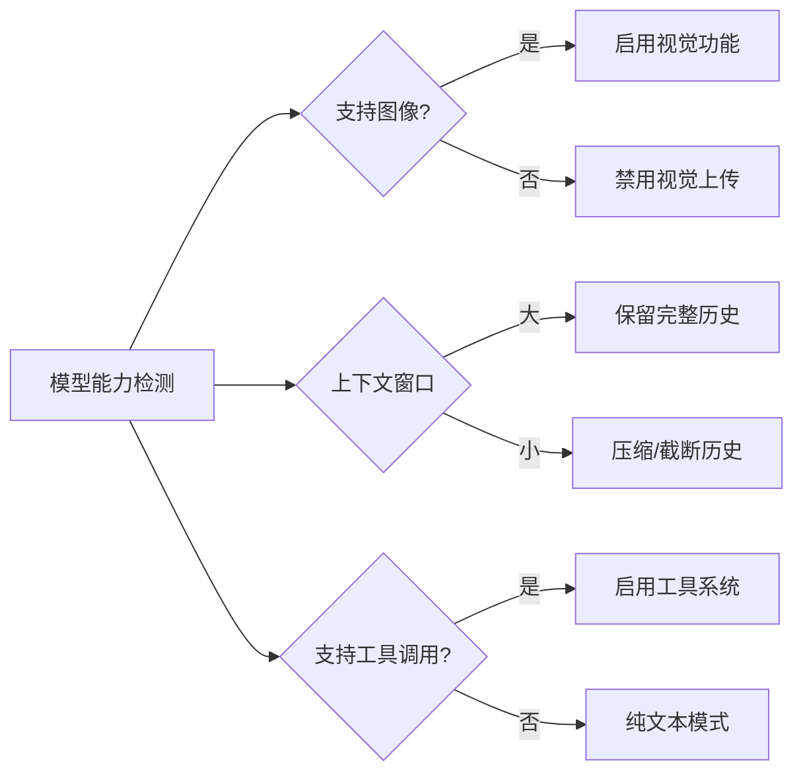

<ChapterLearningGuide />

<script setup>
import SourceSnapshotCard from '../../.vitepress/theme/components/SourceSnapshotCard.vue'
</script>

> **学习目标**：理解 Provider 层的设计动机，掌握模型能力如何驱动运行时决策，了解认证与消息格式转换机制
> **前置知识**：第5章"会话管理"
> **源码路径**：`packages/opencode/src/provider/`
> **阅读时间**：20 分钟

---

## 本章导读

### 这一章解决什么问题

为什么 OpenCode 能同时支持 Claude、GPT-4、Gemini 和本地模型？Provider 抽象层是答案。这一章揭示"多模型支持"背后的工程实现。

### 必看入口

provider.ts（Provider.Model 类型定义和能力字段）、sdk.ts（统一调用入口）

### 先抓一条主链路

`processor.ts 调用 Provider.getModel(providerID, modelID) → 返回 Vercel AI SDK 兼容的 model 对象 → llm.ts 调用 streamText(model, messages) → SDK 负责格式转换和 HTTP 调用`

### 初学者阅读顺序

1. 先读 provider.ts 的 Model 类型，特别是 capabilities 字段（vision、tool_call、reasoning）。
2. 读 anthropic.ts，看一个具体提供商怎么实现。
3. 读 sdk.ts，理解 Vercel AI SDK 如何统一接口。
4. 打开 sync.ts，了解模型列表如何从远程同步。

### 最容易误解的点

capabilities 字段不只是文档——它在运行时驱动决策。例如 vision: true 才允许上传图片附件，tool_call: false 的模型不会被用于需要工具调用的场景。这是"数据驱动"而不是 if/else 硬编码。

---

一个用户可能今天用 Claude 3.5 Sonnet，明天切换到 GPT-4o，后天用本地的 Ollama 模型。每个提供商的 API 格式不同、鉴权方式不同、能力边界也不同。

Provider 层的职责就是把这些差异统一收口，让 `processor.ts` 只面向一个抽象接口，不感知底层是哪个提供商。

---

## 6.1 为什么需要 Provider 抽象

不抽象的话，session 层的代码需要这样写：

```typescript
// 没有抽象：丑陋、难维护
if (provider === "anthropic") {
  const response = await fetch("https://api.anthropic.com/v1/messages", {
    headers: { "x-api-key": process.env.OPENAI_API_KEY, "anthropic-version": "2023-06-01" },
    body: JSON.stringify({ model, messages: formatForAnthropic(messages), tools: toAnthropicTools(tools) })
  })
} else if (provider === "openai") {
  const response = await fetch("https://api.openai.com/v1/responses", {
    headers: { "Authorization": `Bearer ${process.env.OPENAI_API_KEY}` },
    body: JSON.stringify({ model, input: formatForOpenAI(messages), tools: toOpenAITools(tools) })
  })
} else if (provider === "google") {
  // ...又一套
}
```

有了 Provider 抽象：

```typescript
// 有抽象：session 层只看到统一接口
const model = await Provider.getModel(providerID, modelID)  // 返回 Vercel AI SDK 兼容对象
const stream = LLM.stream({ model, messages, tools, system })
// 不管底层是 Claude/GPT/Gemini，接口完全一致
// Vercel AI SDK 在幕后处理了消息格式转换、鉴权、流式解析等差异
```

**Provider 抽象层架构：**

```mermaid
graph TB
    SESSION[session/processor.ts] -->|Provider.getModel()| LAYER[Provider 抽象层]

    LAYER --> AI_SDK[Vercel AI SDK]

    AI_SDK --> CLAUDE[Anthropic Claude\nanthropic-ai/sdk]
    AI_SDK --> OPENAI[OpenAI GPT\nopenai SDK]
    AI_SDK --> GOOGLE[Google Gemini\n@ai-sdk/google]
    AI_SDK --> LOCAL[本地模型\nOllama / LMStudio]
    AI_SDK --> CUSTOM[自定义 OpenAI 兼容\nbaseURL 配置]

    style SESSION fill:#1d4ed8,color:#fff
    style LAYER fill:#7c3aed,color:#fff
    style AI_SDK fill:#065f46,color:#fff
```

---

## 6.2 Provider.Model：模型的完整描述

OpenCode 用一个统一的 `Provider.Model` 类型描述任何一个模型，包含四类信息：

### 标识信息

```typescript
// provider/provider.ts
export const Model = z.object({
  id: ModelID.zod,           // 模型 ID，如 "gpt-4o"
  providerID: ProviderID.zod,// 提供商 ID，如 "anthropic"
  name: z.string(),          // 显示名称，如 "Claude Sonnet 4.6"
  family: z.string().optional(), // 模型系列，如 "claude-sonnet"
  api: z.object({
    id: z.string(),    // API 层面的 model ID（可能和上面 id 不同）
    url: z.string(),   // API 端点
    npm: z.string(),   // 使用哪个 AI SDK 包，如 "@ai-sdk/anthropic"
  }),
  release_date: z.string(),
  status: z.enum(["alpha", "beta", "active", "deprecated"]),
})
```

### 能力标志（Capabilities）

这是 Provider 层最重要的字段——能力标志直接驱动运行时的行为：

```typescript
// capabilities 字段是运行时决策的数据源，不是注释
capabilities: z.object({
  temperature: z.boolean(),  // false 时不传 temperature 参数（如某些推理模型固定温度）
  reasoning: z.boolean(),    // true 时在 prompt 里激活扩展思维（Claude Extended Thinking）
  attachment: z.boolean(),   // false 时禁用图片/文件附件上传按钮
  toolcall: z.boolean(),     // false 时完全不传工具列表，避免 API 报 400 错误
  interleaved: z.union([
    z.boolean(),             // 是否支持思维与工具调用在同一条消息中交替出现
    z.object({ field: z.enum(["reasoning_content", "reasoning_details"]) })
    // 不同模型的 reasoning 字段名不同，这里做了兼容
  ]),
  input: z.object({
    text: z.boolean(),  // 是否支持文本输入（几乎全部是 true）
    audio: z.boolean(), // 是否支持语音输入（如 GPT-4o audio）
    image: z.boolean(), // 是否支持图片输入（视觉能力）
    video: z.boolean(), // 是否支持视频输入
    pdf: z.boolean(),   // 是否支持 PDF 文件输入
  }),
  output: z.object({ text, audio, image, video, pdf }),  // 输出格式同理
})
```

能力标志怎么用？举几个例子：

- `toolcall: false` → 不向这个模型传递 tools 列表，避免 API 报错
- `reasoning: true` → 在 System Prompt 里添加激活扩展思维的指令
- `attachment: false` → 用户上传图片时提示"当前模型不支持图片输入"
- `interleaved: true` → 允许模型在工具调用中间穿插推理过程



### 成本信息

```typescript
cost: z.object({
  input: z.number(),   // 每百万 input token 的美元成本
  output: z.number(),  // 每百万 output token 的美元成本
  cache: z.object({
    read: z.number(),  // 缓存命中的读取成本（通常更便宜）
    write: z.number(), // 写入缓存的成本
  }),
})
```

processor.ts 在每步结束时计算费用：

```typescript
// session/processor.ts（finish-step 处理）
const usage = Session.getUsage({ model, usage: value.usage })
// usage.cost = input_tokens * model.cost.input + output_tokens * model.cost.output + ...
await Session.updatePart({ type: "step-finish", cost: usage.cost })
```

这让用户可以在对话历史里看到每一步花了多少钱。

### 上下文限制

```typescript
limit: z.object({
  context: z.number(),        // 总上下文窗口（input + output）
  input: z.number().optional(),// 最大 input tokens（部分模型单独限制）
  output: z.number(),         // 最大 output tokens
})
```

`SessionCompaction.isOverflow()` 直接读取 `model.limit` 来判断何时需要压缩。

---

## 6.3 模型元数据：从哪里来

OpenCode 的模型列表来自 [models.dev](https://models.dev)——一个维护各提供商最新模型数据的外部服务。

```typescript
// provider/models.ts
export namespace ModelsDev {
  // 从 models.dev 获取的原始数据结构
  export const Model = z.object({
    id: z.string(),
    name: z.string(),
    tool_call: z.boolean(),      // 是否支持 Function Calling
    reasoning: z.boolean(),      // 是否支持推理模式
    attachment: z.boolean(),     // 是否支持附件
    cost: z.object({
      input: z.number(),         // $/M tokens
      output: z.number(),
    }).optional(),
    limit: z.object({
      context: z.number(),
      output: z.number(),
    }),
    modalities: z.object({
      input: z.array(z.enum(["text", "audio", "image", "video", "pdf"])),
    }).optional(),
  })
}
```

启动时，OpenCode 从缓存（`~/.opencode/cache/models.json`）加载模型数据，并定期从 models.dev 更新。这意味着：

- **无需升级 OpenCode** 就能获得新发布的模型
- 模型的成本、上下文窗口等参数可以保持最新
- 提供商停用某个模型，本地缓存更新后 OpenCode 自动跟进

---

## 6.4 支持的提供商清单

OpenCode 在 `BUNDLED_PROVIDERS` 里硬编码了所有内置提供商的 AI SDK 工厂函数：

```typescript
// provider/provider.ts
const BUNDLED_PROVIDERS: Record<string, (options) => SDK> = {
  "@ai-sdk/anthropic":            createAnthropic,
  "@ai-sdk/openai":               createOpenAI,
  "@ai-sdk/google":               createGoogleGenerativeAI,
  "@ai-sdk/google-vertex":        createVertex,
  "@ai-sdk/google-vertex/anthropic": createVertexAnthropic,
  "@ai-sdk/amazon-bedrock":       createAmazonBedrock,
  "@ai-sdk/azure":                createAzure,
  "@openrouter/ai-sdk-provider":  createOpenRouter,
  "@ai-sdk/xai":                  createXai,
  "@ai-sdk/mistral":              createMistral,
  "@ai-sdk/groq":                 createGroq,
  "@ai-sdk/deepinfra":            createDeepInfra,
  "@ai-sdk/cerebras":             createCerebras,
  "@ai-sdk/cohere":               createCohere,
  "@ai-sdk/togetherai":           createTogetherAI,
  "@ai-sdk/perplexity":           createPerplexity,
  "@ai-sdk/vercel":               createVercel,
  "@ai-sdk/gateway":              createGateway,
  "@gitlab/gitlab-ai-provider":   createGitLab,
  "@ai-sdk/github-copilot":       createGitHubCopilotOpenAICompatible,
  // 以及 Amazon Bedrock、Cloudflare、SAP 等
}
```

这张列表说明了 OpenCode "提供商无关"承诺的实际范围——20+ 个提供商，涵盖主流 SaaS（OpenAI、Anthropic、Google）、企业版（Azure、Amazon Bedrock、Google Vertex）、路由服务（OpenRouter、Vercel AI Gateway）和特殊集成（GitHub Copilot、GitLab Duo）。

### CUSTOM_LOADERS：提供商特殊初始化

每个提供商除了通用的 SDK 工厂函数，还可能有特殊的初始化逻辑，放在 `CUSTOM_LOADERS` 里：

```typescript
const CUSTOM_LOADERS = {
  // Anthropic 需要特定的 beta 请求头
  async anthropic() {
    return {
      autoload: false,
      options: {
        headers: {
          "anthropic-beta": "claude-code-20250219,interleaved-thinking-2025-05-14,fine-grained-tool-streaming-2025-05-14",
        },
      },
    }
  },

  // Amazon Bedrock 需要 AWS 认证，使用区域前缀处理模型 ID
  async "amazon-bedrock"() {
    const region = configRegion ?? envRegion ?? "us-east-1"
    return {
      autoload: true,
      async getModel(sdk, modelID) {
        // 根据区域给模型 ID 加前缀：us.claude-... / eu.claude-...
        const regionPrefix = region.split("-")[0]
        if (modelID.includes("claude")) modelID = `${regionPrefix}.${modelID}`
        return sdk.languageModel(modelID)
      },
    }
  },

  // GitHub Copilot 需要 OAuth 认证
  async "github-copilot"() {
    return {
      autoload: false,
      async getModel(sdk, modelID) {
        return shouldUseCopilotResponsesApi(modelID)
          ? sdk.responses(modelID)
          : sdk.chat(modelID)
      },
    }
  },
}
```

`getModel` 自定义函数处理一类特殊情况：不同提供商（甚至同一提供商的不同模型）调用 SDK 创建模型实例的方式不同——有些用 `.languageModel()`，有些用 `.responses()`，有些用 `.chat()`。

---

## 6.5 认证系统

### 三种认证方式

```typescript
// auth/index.ts
export namespace Auth {
  // 1. API Key 认证（最常见）
  export const Api = z.object({
    type: z.literal("api"),
    key: z.string(),
  })

  // 2. OAuth 认证（GitHub Copilot、GitLab Duo）
  export const Oauth = z.object({
    type: z.literal("oauth"),
    refresh: z.string(),   // refresh token
    access: z.string(),    // access token
    expires: z.number(),   // 过期时间戳
    accountId: z.string().optional(),
    enterpriseUrl: z.string().optional(),
  })

  // 3. WellKnown 认证（企业内部服务）
  export const WellKnown = z.object({
    type: z.literal("wellknown"),
    key: z.string(),
    token: z.string(),
  })
}
```

### 认证信息的优先级

OpenCode 按以下优先级查找认证信息：

```text
1. 环境变量（OPENAI_API_KEY、OPENAI_API_KEY...）
   ↓ 没有时
2. 用户认证存储（~/.config/opencode/auth.json，加密存储）
   ↓ 没有时
3. 配置文件 options.apiKey（opencode.json）
   ↓ 没有时
4. 不可用（提供商不会出现在可选列表里）
```

```typescript
// provider/provider.ts（认证检查示例，opencode provider）
async opencode(input) {
  const hasKey = await (async () => {
    const env = Env.all()
    if (input.env.some((item) => env[item])) return true        // 环境变量
    if (await Auth.get(input.id)) return true                    // 本地存储
    if (config.provider?.["opencode"]?.options?.apiKey) return true  // 配置文件
    return false
  })()
  return { autoload: hasKey, ... }
}
```

`autoload: false` 意味着这个提供商不会自动出现在模型选择列表里，用户必须主动配置认证后才能使用。

### 首次设置流程

```bash
# 方式1：环境变量（推荐用于 CI/CD）
export OPENAI_API_KEY="sk-ant-..."
opencode

# 方式2：opencode 命令交互设置
opencode auth add anthropic
# 根据提示输入 API Key，加密存储到本地

# 方式3：配置文件
# ~/.config/opencode/config.json
{
  "provider": {
    "anthropic": {
      "options": { "apiKey": "sk-ant-..." }
    }
  }
}
```

---

## 6.6 Vercel AI SDK：统一接口层

OpenCode 不直接调用各家 API，而是通过 **Vercel AI SDK** 作为统一的中间层。

### AI SDK 做了什么

```typescript
// session/llm.ts（调用 LLM 的核心代码，简化）
import { streamText, type LanguageModelV2 } from "ai"

export async function stream(input: StreamInput) {
  // 这里的 input.model 是 LanguageModelV2 接口
  // 不管它来自 Anthropic、OpenAI 还是 Google，接口完全一致
  return streamText({
    model: input.model,          // 统一的 LanguageModelV2 接口
    messages: input.messages,   // 统一的 ModelMessage[] 格式
    tools: input.tools,         // 统一的工具格式
    system: input.system,       // System prompt
    maxSteps: input.maxSteps,   // 最大步骤数
  })
}
```

AI SDK 屏蔽了各家 API 的差异：

| 差异点 | 实际情况 | AI SDK 做法 |
|--------|----------|------------|
| 请求格式 | Anthropic 用 `messages`，OpenAI 用 `input` | 统一转换 |
| 工具格式 | 各家 JSON Schema 细节不同 | 统一生成 |
| 流式事件 | 各家 SSE 格式不同 | 统一的 `fullStream` 迭代器 |
| 错误类型 | 各家错误码不同 | 统一的错误类 |
| 认证方式 | API Key 位置不同（Header/Query） | 各 SDK 包自己处理 |

### LanguageModelV2：AI SDK 的核心抽象

每个提供商的 AI SDK 包（`@ai-sdk/anthropic`、`@ai-sdk/openai` 等）都实现了 `LanguageModelV2` 接口。OpenCode 获取模型实例的过程：

```typescript
// provider/provider.ts（getModel 简化）
export async function getModel(providerID: ProviderID, modelID: ModelID): Promise<Model> {
  const provider = await get(providerID)

  // 1. 找到对应的 AI SDK 工厂函数
  const sdkFactory = BUNDLED_PROVIDERS[provider.api.npm]

  // 2. 用认证信息初始化 SDK
  const sdk = sdkFactory({ apiKey: provider.key, ...provider.options })

  // 3. 用自定义加载器（如果有）创建模型实例
  const loader = CUSTOM_LOADERS[providerID]
  const loaderResult = await loader?.(provider)
  const model = loaderResult?.getModel
    ? await loaderResult.getModel(sdk, modelID)
    : sdk.languageModel(modelID)

  // 4. 返回包含完整元数据的 Provider.Model
  return { ...modelMetadata, __sdk: model }
}
```

---

## 6.7 消息格式转换：ProviderTransform

各提供商虽然通过 AI SDK 统一了接口，但对消息内容的细节处理仍有差异。`ProviderTransform` 在调用前做最后一层适配：

### OpenAI 的特殊要求

```typescript
// provider/transform.ts
export namespace ProviderTransform {
  function normalizeMessages(msgs, model) {
    // Anthropic 不接受空内容的消息
    if (model.api.npm === "@ai-sdk/anthropic" || model.api.npm === "@ai-sdk/amazon-bedrock") {
      msgs = msgs
        .map((msg) => {
          // 过滤掉空字符串消息
          if (typeof msg.content === "string" && msg.content === "") return undefined
          // 过滤掉内容数组里的空 text 部件
          if (Array.isArray(msg.content)) {
            const filtered = msg.content.filter(
              part => !(part.type === "text" && part.text === "")
            )
            return filtered.length === 0 ? undefined : { ...msg, content: filtered }
          }
          return msg
        })
        .filter(Boolean)
    }
    return msgs
  }
}
```

这类适配代码处理各提供商的"怪癖"，让 session 层不需要感知这些细节。

### SSE 超时包装

OpenCode 还给 SSE 流加了超时机制：

```typescript
// provider/provider.ts
function wrapSSE(res: Response, ms: number, ctl: AbortController) {
  // 如果 ms 毫秒内没收到新的 SSE 数据块，触发超时
  // 默认 DEFAULT_CHUNK_TIMEOUT = 120_000ms（2分钟）
  // 防止网络问题导致 Agent 静默挂住
}
```

120秒内如果没有新数据——不是任务完成，就是连接断了——触发中止，`processor.ts` 的重试机制接管。

**限流重试动画：** 演示 429 限流响应 → retryable() 分类 → retry-after 倒计时 → 重试成功的完整路径，以及哪些错误会被判定为不可重试。

<ProviderFallback />

---

## 6.8 自定义提供商与模型

### 通过配置添加自定义提供商

支持 OpenAI 兼容 API 的服务（Ollama、LocalAI、各种私有部署）都可以通过配置接入：

```json
// ~/.config/opencode/config.json 或项目级 .opencode/config.json
{
  "provider": {
    "my-local-llm": {
      "name": "本地 Ollama",
      "api": {
        "url": "http://localhost:11434/v1",
        "npm": "@ai-sdk/openai-compatible"
      },
      "models": {
        "llama3.2": {
          "name": "Llama 3.2",
          "limit": { "context": 128000, "output": 8192 },
          "tool_call": true,
          "attachment": false,
          "cost": { "input": 0, "output": 0 }
        }
      }
    }
  }
}
```

使用 `@ai-sdk/openai-compatible` 包可以对接任何兼容 OpenAI API 格式的服务，这是接入本地模型最简单的路径。

### 通过插件添加 Provider

更复杂的集成可以通过插件系统动态注入 Provider，无需修改 OpenCode 核心代码。插件可以注册新的提供商、修改现有模型的配置、添加自定义认证逻辑。

---

## 本章小结

Provider 层的三层结构：

```text
┌──────────────────────────────────────────────────┐
│         Provider.Model（统一模型描述）             │
│   capabilities / cost / limit / api              │
└──────────────────────────────────────────────────┘
                      ↓
┌──────────────────────────────────────────────────┐
│         Vercel AI SDK（统一调用接口）              │
│   LanguageModelV2 / streamText / fullStream      │
└──────────────────────────────────────────────────┘
                      ↓
┌──────────────────────────────────────────────────┐
│         @ai-sdk/anthropic / openai / google...   │
│   BUNDLED_PROVIDERS + CUSTOM_LOADERS             │
└──────────────────────────────────────────────────┘
```

**关键设计决策**：

| 决策 | 原因 |
|------|------|
| 模型元数据来自 models.dev | 无需升级 OpenCode 就能获得新模型 |
| 能力标志（capabilities）驱动行为 | 不同模型的工具格式、推理模式自动适配 |
| AI SDK 作为中间层 | 20+ 提供商复用同一套流式处理代码 |
| CUSTOM_LOADERS 处理特殊逻辑 | Amazon Bedrock 区域前缀、GitHub Copilot OAuth 等怪癖隔离 |
| 认证信息加密存储 | API Key 不明文出现在配置文件里 |

### 思考题

1. `capabilities.toolcall: false` 的模型，OpenCode 如何让它"完成任务"？（提示：工具调用是 LLM 完成任务的唯一方式吗？）
2. 为什么 Amazon Bedrock 需要区域前缀（`us.claude-...`）？这个设计解决了什么问题？
3. 如果要支持一个只有 REST API（不兼容 OpenAI 格式）的私有模型，需要在 OpenCode 的哪些地方做修改？

---

## 下一章预告

**第7章：MCP 协议集成**

深入 `packages/opencode/src/mcp/`，学习：
- MCP（Model Context Protocol）协议的设计思想
- OpenCode 如何作为 MCP Client 连接外部 Server
- MCP 工具如何被注册到 ToolRegistry 并被 Agent 调用
- 配置 MCP Server 的完整流程

---

## 常见误区

### 误区1：支持多模型只需要换一个 API URL，没有什么工程复杂性

**错误理解**：不同的 LLM API 格式类似，只需要改个 base URL 和 API key，就能切换模型。

**实际情况**：不同提供商的差异远超 URL 和认证：消息格式不同（Anthropic 有 `system` 字段，OpenAI 把 system 放在 messages 里）；工具调用格式不同；流式响应的事件结构不同；错误码不同；token 计数方式不同。Vercel AI SDK 在底层处理了这些差异，但 OpenCode 还要在 SDK 之上处理能力差异（vision、reasoning、long context）。

### 误区2：capabilities 字段只是文档说明，不影响运行时行为

**错误理解**：`capabilities` 里的 `vision: true`、`tool_call: false` 只是告诉用户这个模型能做什么，代码里不用它。

**实际情况**：`capabilities` 直接驱动运行时决策。`vision: false` 的模型不会收到图片附件（即使用户上传了图片）；`tool_call: false` 的模型会切换到不需要工具调用的工作模式；`context_window` 决定了 summary 压缩的触发阈值。这是"数据驱动配置"的典型用法，消除了大量 `if model === "xxx"` 的硬编码。

### 误区3：本地模型（Ollama）和云端模型的功能完全一样

**错误理解**：只要通过 Ollama 运行本地模型，就能得到和 Claude/GPT-4 一样的 Agent 能力。

**实际情况**：本地模型通常通过 OpenAI 兼容接口接入，但 capabilities 往往受限——大多数本地模型的工具调用能力较弱，推理能力差距明显，context window 也更小。OpenCode 的 Provider 层能接入本地模型，但实际任务完成质量取决于模型本身的能力，框架无法弥补模型能力的差距。

### 误区4：API Key 由 OpenCode 统一管理，切换模型时需要重新配置

**错误理解**：切换从 Claude 到 GPT-4 需要在 OpenCode 配置文件里重新填写 API key，每次切换都很麻烦。

**实际情况**：OpenCode 优先使用标准环境变量（`OPENAI_API_KEY`、`OPENAI_API_KEY` 等），这些是各个 SDK 本身的约定。如果你已经在系统环境里配置了这些变量，切换模型时 OpenCode 会自动使用对应的 key，不需要额外配置。

### 误区5：Vercel AI SDK 只适合 Web 应用，在 CLI 里用它是错误选择

**错误理解**：Vercel AI SDK 是为 Next.js/Vercel 部署设计的，CLI 工具应该直接调用各厂商的原生 SDK。

**实际情况**：Vercel AI SDK 的核心是运行时无关的抽象层——它在 Node.js、Bun、Edge Runtime 里都能运行。OpenCode 使用它的原因是统一接口（不用分别维护 OpenAI SDK、OpenAI SDK 等多套客户端代码），以及内置的流式输出支持。这是务实的工程选择，与部署平台无关。

---

<SourceSnapshotCard
  title="第6章源码快照"
  description="Provider 层的核心价值是让 session 层完全不感知底层是哪个 LLM 提供商。provider.ts 定义 Model 类型，providers/ 里每个文件是一个提供商的适配器，sdk.ts 统一调用 Vercel AI SDK。"
  repo="anomalyco/opencode"
  repo-url="https://github.com/anomalyco/opencode/tree/f8475649da1cd7a6d49f8f30ee2fad374c2f4fcc"
  branch="dev"
  commit="f8475649da1cd7a6d49f8f30ee2fad374c2f4fcc"
  verified-at="2026-03-17"
  :entries="[
    { label: 'Provider 核心类型', path: 'packages/opencode/src/provider/provider.ts', href: 'https://github.com/anomalyco/opencode/blob/f8475649da1cd7a6d49f8f30ee2fad374c2f4fcc/packages/opencode/src/provider/provider.ts' },
    { label: 'Anthropic 适配器', path: 'packages/opencode/src/provider/providers/anthropic.ts', href: 'https://github.com/anomalyco/opencode/blob/f8475649da1cd7a6d49f8f30ee2fad374c2f4fcc/packages/opencode/src/provider/providers/anthropic.ts' },
    { label: 'SDK 统一调用层', path: 'packages/opencode/src/provider/sdk.ts', href: 'https://github.com/anomalyco/opencode/blob/f8475649da1cd7a6d49f8f30ee2fad374c2f4fcc/packages/opencode/src/provider/sdk.ts' },
    { label: '模型同步', path: 'packages/opencode/src/provider/sync.ts', href: 'https://github.com/anomalyco/opencode/blob/f8475649da1cd7a6d49f8f30ee2fad374c2f4fcc/packages/opencode/src/provider/sync.ts' },
  ]"
/>


<StarCTA />
