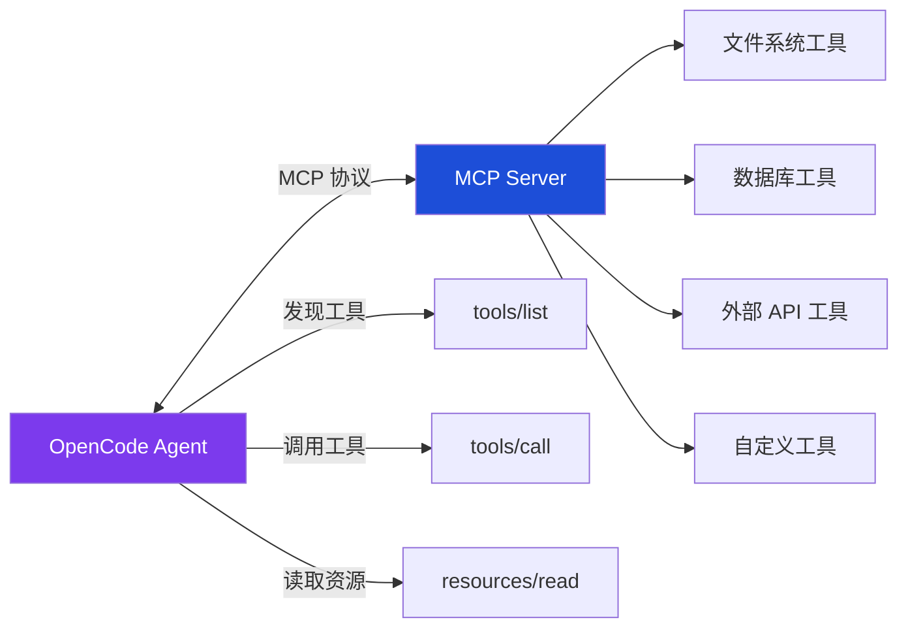
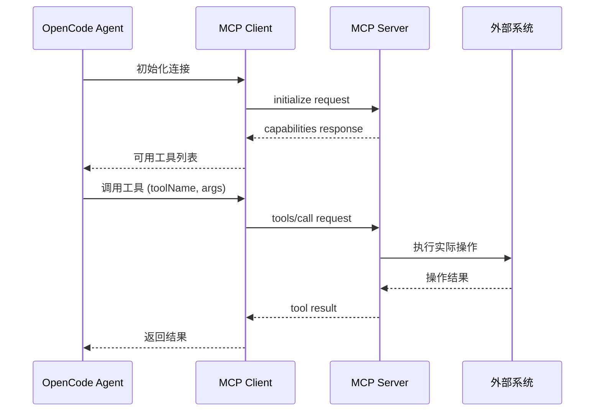

<ChapterLearningGuide />

<script setup>
import SourceSnapshotCard from '../../.vitepress/theme/components/SourceSnapshotCard.vue'
</script>

> **学习目标**：理解 MCP 协议的设计思想，掌握 OpenCode 作为 MCP Client 的完整实现，学会配置和调试 MCP Server
> **前置知识**：第6章"多模型支持"
> **源码路径**：`packages/opencode/src/mcp/`
> **阅读时间**：20 分钟

---

## 本章导读

### 这一章解决什么问题

内置工具有限，用户需求无限。MCP 是解决方案——定义了一个标准协议，让第三方工具服务器接入 OpenCode，不需要修改 OpenCode 核心代码。

### 必看入口

mcp/index.ts（MCP 客户端，连接管理和工具发现）

### 先抓一条主链路

`读取配置中的 mcpServers → 按 type 选 StdioClientTransport 或 SSEClientTransport → 连接 MCP Server → 调用 tools/list 发现工具 → 转换成 Tool.Info 格式 → 注入工具注册表 → Agent 可调用`

### 初学者阅读顺序

1. 先读本章 7.1 节，理解 MCP 的角色分工。
2. 打开 mcp/index.ts，找 connect() 函数——这是一切的起点。
3. 找到工具转换逻辑，看 MCP Tool 如何转成 OpenCode 的 Tool.Info。
4. 如果对 OAuth 感兴趣，再读 oauth.ts。
5. 最后看 config.ts 中 mcpServers 的配置格式。

### 最容易误解的点

OpenCode 是 MCP Client，不是 MCP Server。它不对外暴露工具，而是连接别人的 MCP Server 来获取工具。很多初学者以为 OpenCode 实现了一个 MCP Server——正好相反。

---

第4章讲过，工具系统有两个扩展点：用户配置目录里的自定义工具文件，以及 MCP Server。这一章深入第二种——**MCP（Model Context Protocol）**，OpenCode 工具系统向外部世界开放的标准化插槽。



---

## 7.1 MCP 是什么

MCP（Model Context Protocol）是 Anthropic 于 2024 年发布的开放协议，定义了 AI 应用和外部工具/数据源之间的标准通信格式。

**它解决的核心问题**：AI Coding Agent 的工具需求是无限的，但 Agent 框架的维护者只能维护有限数量的内置工具。如果没有标准协议，每个新工具都需要修改 Agent 核心代码。

```text
没有 MCP（之前的方式）：
  Agent 需要查询 Jira → 有人向 OpenCode 提 PR，加 JiraTool
  Agent 需要查询 GitHub → 又一个 PR，加 GitHubTool
  Agent 需要查 Confluence → 再一个 PR...
  → OpenCode 变成什么都管的巨无霸

有了 MCP：
  任何人写一个 MCP Server 暴露工具
  OpenCode 启动时连接，自动发现工具
  → OpenCode 核心保持简洁，生态自由扩展
```

**MCP 的角色分工**：

| 角色 | 职责 | 例子 |
|------|------|------|
| **MCP Host** | 包含 LLM 的应用 | OpenCode、Claude Desktop |
| **MCP Client** | Host 内部的协议客户端 | OpenCode 的 `mcp/index.ts` |
| **MCP Server** | 暴露工具/资源的独立进程 | `@modelcontextprotocol/server-filesystem` |

OpenCode 实现的是 **MCP Client** 角色——它不提供工具，而是连接提供工具的 Server。

---

## 7.2 两种连接方式

### Local Server：本地子进程（stdio）

最常见的方式，MCP Server 作为子进程启动，通过标准输入输出（stdio）通信：

```typescript
// mcp/index.ts（local 类型连接）
if (mcp.type === "local") {
  const [cmd, ...args] = mcp.command  // 命令配置如 ["npx", "-y", "@mcp/server-github"]
  const transport = new StdioClientTransport({
    command: cmd,               // 可执行文件（npx、node、python 等）
    args,                       // 命令行参数
    cwd: Instance.directory,    // 工作目录：当前项目根目录
    env: {
      ...process.env,           // 继承 OpenCode 进程的所有环境变量
      ...mcp.environment,       // 配置里的额外环境变量（如 API Token）
    },
    stderr: "pipe",             // 捕获 stderr，让错误日志能在 OpenCode 里显示
  })

  const client = new Client({
    name: "opencode",           // Client 自我标识
    version: Installation.VERSION,  // OpenCode 当前版本
  })
  await withTimeout(client.connect(transport), connectTimeout)
  // connectTimeout 默认约 10 秒，防止 MCP Server 启动超时卡住整个初始化
}
```

配置示例：

```json
// .opencode/config.json 或 ~/.config/opencode/config.json
{
  "mcp": {
    "filesystem": {
      "type": "local",
      "command": ["npx", "-y", "@modelcontextprotocol/server-filesystem", "/tmp"]
    },
    "github": {
      "type": "local",
      "command": ["npx", "-y", "@modelcontextprotocol/server-github"],
      "environment": {
        "GITHUB_PERSONAL_ACCESS_TOKEN": "ghp_xxx"
      }
    },
    "my-db-tools": {
      "type": "local",
      "command": ["node", "/path/to/my-db-server.js"],
      "timeout": 10000,
      "enabled": true
    }
  }
}
```

**子进程生命周期**：MCP Server 随 OpenCode 启动而启动，随 OpenCode 退出而终止。OpenCode 还实现了子进程的**孙进程清理**——某些 MCP Server（比如 `chrome-devtools-mcp`）会启动 Chrome 浏览器，直接 kill 主进程不够，需要递归 kill 所有后代进程：

```typescript
// mcp/index.ts（关闭时清理所有后代进程）
async function descendants(pid: number): Promise<number[]> {
  // 用 pgrep -P 递归找到所有子进程、孙进程...
  const queue = [pid]
  while (queue.length > 0) {
    const current = queue.shift()!
    const children = await getChildPids(current)
    pids.push(...children)
    queue.push(...children)
  }
  return pids
}

// 关闭时先 kill 后代
for (const dpid of await descendants(pid)) {
  process.kill(dpid, "SIGTERM")
}
```

### Remote Server：HTTP/SSE 连接

远程 MCP Server 通过 HTTP 协议通信，支持两种传输层：

```typescript
// mcp/index.ts（remote 类型连接，依次尝试两种传输层）
const transports = [
  {
    name: "StreamableHTTP",
    transport: new StreamableHTTPClientTransport(new URL(mcp.url), {
      authProvider,
      requestInit: mcp.headers ? { headers: mcp.headers } : undefined,
    }),
  },
  {
    name: "SSE",
    transport: new SSEClientTransport(new URL(mcp.url), {
      authProvider,
    }),
  },
]

// 先尝试 StreamableHTTP，失败则回退到 SSE
for (const { name, transport } of transports) {
  try {
    await client.connect(transport)
    break  // 成功则停止尝试
  } catch (error) {
    // 继续尝试下一种
  }
}
```

**StreamableHTTP** 是 MCP 的新传输层标准，支持双向流式通信；**SSE**（Server-Sent Events）是兼容旧版 Server 的备用方案。

Remote Server 配置示例：

```json
{
  "mcp": {
    "my-cloud-tools": {
      "type": "remote",
      "url": "https://my-company.com/mcp",
      "headers": {
        "Authorization": "Bearer my-token"
      }
    },
    "linear": {
      "type": "remote",
      "url": "https://mcp.linear.app/sse",
      "oauth": {
        "scope": "read:issues write:issues"
      }
    }
  }
}
```

---

## 7.3 工具发现与转换

**MCP 协议生命周期动画：** 从 spawn 子进程、initialize 握手、tools/list 发现工具，到最终 tools/call 执行，完整演示一次 MCP 通信过程。

<McpHandshake />



### 连接建立后：列举工具

MCP Client 连接成功后，通过标准 RPC 调用获取工具列表：

```typescript
// mcp/index.ts（tools() 函数）
export async function tools() {
  const result: Record<string, Tool> = {}
  const connectedClients = Object.entries(clients)
    .filter(([name]) => status[name]?.status === "connected")

  for (const [clientName, client] of connectedClients) {
    const toolsResult = await client.listTools()

    for (const mcpTool of toolsResult.tools) {
      // 工具名：clientName_toolName（替换特殊字符）
      const sanitizedClient = clientName.replace(/[^a-zA-Z0-9_-]/g, "_")
      const sanitizedTool = mcpTool.name.replace(/[^a-zA-Z0-9_-]/g, "_")
      const key = `${sanitizedClient}_${sanitizedTool}`

      result[key] = await convertMcpTool(mcpTool, client, timeout)
    }
  }
  return result
}
```

**命名规则**：MCP 工具的 key 是 `serverName_toolName`，替换所有非字母数字字符为下划线。这避免了不同 Server 的同名工具冲突，也让 Agent 能从工具名推断工具来源。

### MCP 工具转换为 AI SDK Tool

```typescript
// mcp/index.ts
async function convertMcpTool(mcpTool: MCPToolDef, client: MCPClient, timeout?: number): Promise<Tool> {
  // 把 MCP 的 JSON Schema 转换成 AI SDK 期望的格式
  const schema: JSONSchema7 = {
    ...(mcpTool.inputSchema as JSONSchema7),
    type: "object",
    properties: mcpTool.inputSchema.properties ?? {},
    additionalProperties: false,  // 禁止额外字段，避免 LLM 传入无效参数
  }

  return dynamicTool({
    description: mcpTool.description ?? "",
    inputSchema: jsonSchema(schema),
    execute: async (args) => {
      // 通过 MCP RPC 调用工具
      return client.callTool(
        { name: mcpTool.name, arguments: args ?? {} },
        CallToolResultSchema,
        { resetTimeoutOnProgress: true, timeout },
      )
    },
  })
}
```

`dynamicTool` 是 Vercel AI SDK 提供的工厂函数，用于创建运行时动态定义的工具（相对于编译时定义的工具）。转换后的 MCP 工具和内置工具在 LLM 眼中完全一样。

### 工具动态更新

MCP 协议支持 Server 在运行时通知 Client 工具列表发生变化（比如用户在 MCP Server 管理界面添加了新工具）：

```typescript
// mcp/index.ts
function registerNotificationHandlers(client: MCPClient, serverName: string) {
  client.setNotificationHandler(ToolListChangedNotificationSchema, async () => {
    log.info("tools list changed", { server: serverName })
    // 广播事件，让上层重新加载工具列表
    Bus.publish(ToolsChanged, { server: serverName })
  })
}
```

这让 Agent 不需要重启就能使用新添加的 MCP 工具。

---

## 7.4 MCP 的三种能力

MCP 协议不只有工具，还定义了**资源（Resources）**和**提示词（Prompts）**。

### Resources：上下文数据

Resource 是 MCP Server 暴露的只读内容，适合作为上下文注入给 LLM：

```typescript
// mcp/index.ts
export async function resources() {
  for (const [clientName, client] of connectedClients) {
    const res = await client.listResources()
    for (const resource of res.resources) {
      result[`${clientName}:${resource.name}`] = { ...resource, client: clientName }
    }
  }
  return result
}

export async function readResource(clientName: string, resourceUri: string) {
  const client = clients[clientName]
  return client.readResource({ uri: resourceUri })
}
```

Resource 的使用场景：
- 读取 Confluence 页面作为背景知识注入
- 获取最新的 API 文档
- 读取数据库 schema

### Prompts：可复用的提示词模板

Prompt 是 MCP Server 定义的提示词模板，可以带参数：

```typescript
// mcp/index.ts
export async function getPrompt(clientName: string, name: string, args?: Record<string, string>) {
  const client = clients[clientName]
  const result = await client.getPrompt({ name, arguments: args })
  // 返回填充好参数的 messages 列表，可直接注入对话历史
  return result.messages
}
```

使用场景：
- 团队共享标准化的代码审查提示词（带变量：`{language}`、`{style}`）
- 公司特定的文档生成模板
- 统一的 Bug 报告格式

---

## 7.5 OAuth 认证流程

远程 MCP Server 可能需要 OAuth 认证。OpenCode 实现了完整的 OAuth 2.0 流程：

### 连接时触发认证

```typescript
// mcp/index.ts（remote 连接，OAuth 错误处理）
} catch (error) {
  if (error instanceof UnauthorizedError || error.message.includes("OAuth")) {
    if (error.message.includes("registration")) {
      // Server 不支持动态注册，需要用户手动提供 clientId
      status = { status: "needs_client_registration", error: "..." }
    } else {
      // 需要用户完成 OAuth 授权
      pendingOAuthTransports.set(key, transport)
      status = { status: "needs_auth" }
      Bus.publish(TuiEvent.ToastShow, {
        title: "MCP Authentication Required",
        message: `Server "${key}" requires authentication. Run: opencode mcp auth ${key}`,
        variant: "warning",
      })
    }
  }
}
```

### 完整 OAuth 流程

```text
1. 用户运行: opencode mcp auth linear
   ↓
2. OpenCode 调用 startAuth(mcpName)
   - 获取授权 URL（McpOAuthProvider 处理 PKCE）
   ↓
3. 打开浏览器到授权 URL
   ↓
4. 用户在浏览器里授权
   ↓
5. OAuth Server 重定向到回调 URL（含 code）
   ↓
6. OpenCode 调用 finishAuth(mcpName, code)
   - 用 code 换取 access_token
   - 把 token 存储到本地（McpAuth）
   ↓
7. 重新连接 MCP Server（携带 access_token）
   ↓
8. 连接成功，status 变为 "connected"
```

```typescript
// mcp/index.ts
export async function startAuth(mcpName: string): Promise<{ authorizationUrl: string }> {
  const transport = pendingOAuthTransports.get(mcpName)
  if (!transport) throw new Error(`No pending auth for ${mcpName}`)

  // 触发 OAuth 流程，获取授权 URL
  const url = await transport.startAuthorization()
  return { authorizationUrl: url.toString() }
}

export async function finishAuth(mcpName: string, authorizationCode: string): Promise<Status> {
  const transport = pendingOAuthTransports.get(mcpName)
  // 用 code 完成 OAuth，存储 token
  await transport.finishAuthorization({ code: authorizationCode })
  // 重新连接
  return connect(mcpName)
}
```

Token 持久化在 `McpAuth` 模块里，重启后不需要重新授权。

---

## 7.6 连接状态管理

每个 MCP Server 的连接状态用 discriminated union 表示：

```typescript
export type Status =
  | { status: "connected" }
  | { status: "disabled" }
  | { status: "failed"; error: string }
  | { status: "needs_auth" }
  | { status: "needs_client_registration"; error: string }
```

OpenCode 启动时并行初始化所有配置的 MCP Server：

```typescript
// mcp/index.ts（初始化）
const state = Instance.state(async () => {
  const config = cfg.mcp ?? {}
  const clients: Record<string, MCPClient> = {}
  const status: Record<string, Status> = {}

  // 并行连接所有 MCP Server
  await Promise.all(
    Object.entries(config).map(async ([key, mcp]) => {
      if (mcp.enabled === false) {
        status[key] = { status: "disabled" }
        return
      }
      const result = await create(key, mcp).catch(() => undefined)
      status[key] = result?.status ?? { status: "failed", error: "unknown" }
      if (result?.mcpClient) clients[key] = result.mcpClient
    })
  )
  return { status, clients }
})
```

某个 Server 连接失败不影响其他 Server，也不影响 OpenCode 启动——失败的 Server 被标记为 `"failed"`，对应工具不可用，其他工具正常工作。

---

## 7.7 MCP 工具在 prompt.ts 中的装配

MCP 工具在每次会话开始时装配，和内置工具合并后一起传给 LLM：

```typescript
// session/prompt.ts（简化）
export async function prompt(input: PromptInput) {
  // 内置工具
  const builtinTools = await ToolRegistry.tools(model, agent)

  // MCP 工具（每个 Server 用 clientName_toolName 命名）
  const mcpTools = await MCP.tools()

  // 合并，传给 LLM
  const allTools = {
    ...Object.fromEntries(builtinTools.map(t => [t.id, t])),
    ...mcpTools,
  }

  await processor.process({ tools: allTools, ... })
}
```

LLM 看到的工具列表是内置工具 + 所有连接的 MCP Server 工具的合集，无法区分哪个是内置的，哪个来自 MCP。这是设计意图——对 LLM 来说，工具就是工具。

---

## 7.8 实用 MCP Server 推荐

OpenCode 社区维护了一批常用 MCP Server，可以直接配置使用：

```json
{
  "mcp": {
    // 文件系统（访问配置目录之外的路径）
    "filesystem": {
      "type": "local",
      "command": ["npx", "-y", "@modelcontextprotocol/server-filesystem", "/Users/me/projects"]
    },

    // GitHub（读写 Issues、PR、代码）
    "github": {
      "type": "local",
      "command": ["npx", "-y", "@modelcontextprotocol/server-github"],
      "environment": { "GITHUB_PERSONAL_ACCESS_TOKEN": "ghp_xxx" }
    },

    // Postgres（查询数据库）
    "postgres": {
      "type": "local",
      "command": ["npx", "-y", "@modelcontextprotocol/server-postgres", "postgresql://localhost/mydb"]
    },

    // 浏览器自动化（Chrome DevTools）
    "browser": {
      "type": "local",
      "command": ["npx", "-y", "@modelcontextprotocol/server-puppeteer"]
    },

    // Slack（读写消息）
    "slack": {
      "type": "local",
      "command": ["npx", "-y", "@modelcontextprotocol/server-slack"],
      "environment": { "SLACK_BOT_TOKEN": "xoxb-xxx" }
    }
  }
}
```

---

## 本章小结

MCP 集成的三层结构：

```text
┌─────────────────────────────────────────────────────┐
│         session/prompt.ts                           │
│   MCP.tools() 和内置工具合并，传给 LLM              │
└─────────────────────────────────────────────────────┘
                      ↓
┌─────────────────────────────────────────────────────┐
│         mcp/index.ts                                │
│   连接管理、工具发现、资源读取、OAuth 认证           │
└─────────────────────────────────────────────────────┘
                      ↓
┌─────────────────────────────────────────────────────┐
│         @modelcontextprotocol/sdk                   │
│   StdioTransport（local）/ StreamableHTTP（remote） │
└─────────────────────────────────────────────────────┘
```

**关键设计决策**：

| 决策 | 原因 |
|------|------|
| local/remote 两种类型 | 本地工具用 stdio，无网络开销；远程工具用 HTTP，可共享 |
| 先尝试 StreamableHTTP，再回退 SSE | 兼容新旧两种服务端传输标准 |
| 工具名 `serverName_toolName` | 避免多 Server 同名工具冲突 |
| 单 Server 失败不影响整体 | 生产可靠性：部分功能降级，而非全部失败 |
| 孙进程清理 | 防止 Chrome 等重量级进程在 Server 退出后残留 |
| OAuth 持久化 | 每次重启不需要重新授权 |

### 思考题

1. 为什么 MCP 工具的命名需要把 `serverName` 作为前缀？如果去掉前缀，LLM 的工具调用会出现什么问题？
2. Resource 和 Tool 都能获取数据，什么时候该用 Resource，什么时候该用 Tool？
3. 如果一个 MCP Server 提供了 100 个工具，全部注入 LLM 的 System Prompt 会有什么问题？如何优化？

---

## 下一章预告

**第8章：TUI 终端界面**

深入 `packages/opencode/src/cli/cmd/tui/`，学习：
- SolidJS 如何在终端里渲染响应式 UI
- TUI 如何订阅 Bus 事件实时更新界面
- 键盘导航与交互设计
- OpenTUI 组件库的使用方式

---

## 常见误区

### 误区1：OpenCode 是 MCP Server，可以被其他 Agent 调用

**错误理解**：OpenCode 实现了 MCP 协议，所以它既是 MCP Client 也是 MCP Server，其他工具可以把 OpenCode 作为 MCP Server 连接。

**实际情况**：OpenCode 只实现了 MCP **Client** 端。它连接外部 MCP Server 并使用对方提供的工具，而不是向外部暴露自己的工具。MCP 的架构是单向的：OpenCode（Client）→ MCP Server（外部服务）。如果你想把 OpenCode 的工具暴露给其他 Agent，需要单独实现一个 MCP Server 封装。

### 误区2：MCP 工具和内置工具对 LLM 来说有本质区别，LLM 会区别对待它们

**错误理解**：LLM 能"感知"某个工具是 MCP 工具还是内置工具，会对它们采用不同的调用策略。

**实际情况**：LLM 完全看不出区别。`registry.ts` 把 MCP 工具转换后与内置工具放入同一个数组，它们都以相同的 JSON Schema 格式呈现给 LLM。唯一的区别是 MCP 工具的名字带有服务器前缀（如 `filesystem_read_file`），这个前缀的作用是避免命名冲突，不是向 LLM 传递类型信息。

### 误区3：MCP 服务器需要一直保持运行，断开后工具就失效了

**错误理解**：MCP Server 必须是一个长期运行的后台进程，如果它崩溃了，Agent 就无法使用对应的工具。

**实际情况**：OpenCode 的 MCP 客户端有连接重试和错误处理机制。更重要的是，`stdio` 类型的 MCP Server（最常用的类型）是按需启动的子进程——每次 OpenCode 启动时通过 `command` 字段拉起进程，工具调用通过 stdin/stdout 通信。不需要提前手动启动 MCP Server。

### 误区4：Resource 和 Tool 是等价的，都是 Agent 获取数据的方式

**错误理解**：MCP 的 Resource 和 Tool 功能相同，都是给 Agent 提供数据，选哪个都行。

**实际情况**：两者设计目的不同。Tool 是**动作**——Agent 通过工具调用触发操作（可能有副作用）；Resource 是**数据**——静态或半静态的内容（文件、数据库记录），主要用于上下文注入。OpenCode 优先把 Resource 内容注入到 System Prompt（而不是让 Agent 主动调用），对 Tool 则是让 LLM 在需要时主动调用。

### 误区5：配置 MCP 后，工具列表是固定的，不会动态变化

**错误理解**：在 `config.json` 里配置好 MCP Server 后，可用工具就确定了，不会在运行时改变。

**实际情况**：MCP Server 可以动态报告它的工具列表，OpenCode 在每次会话初始化时都会重新查询工具列表。如果 MCP Server 更新了工具（比如数据库里多了新的表或者 API），下次开会话时 Agent 就能自动使用新工具，不需要重启 OpenCode 或修改配置。

---

<SourceSnapshotCard
  title="第7章源码快照"
  description="MCP 让 OpenCode 的工具系统向外部开放。mcp/index.ts 是客户端核心，负责连接管理、工具发现和转换。OpenCode 是 MCP Client，不是 MCP Server。"
  repo="anomalyco/opencode"
  repo-url="https://github.com/anomalyco/opencode/tree/f8475649da1cd7a6d49f8f30ee2fad374c2f4fcc"
  branch="dev"
  commit="f8475649da1cd7a6d49f8f30ee2fad374c2f4fcc"
  verified-at="2026-03-17"
  :entries="[
    { label: 'MCP 客户端核心', path: 'packages/opencode/src/mcp/index.ts', href: 'https://github.com/anomalyco/opencode/blob/f8475649da1cd7a6d49f8f30ee2fad374c2f4fcc/packages/opencode/src/mcp/index.ts' },
    { label: 'OAuth 认证', path: 'packages/opencode/src/mcp/oauth.ts', href: 'https://github.com/anomalyco/opencode/blob/f8475649da1cd7a6d49f8f30ee2fad374c2f4fcc/packages/opencode/src/mcp/oauth.ts' },
    { label: 'MCP 配置 Schema', path: 'packages/opencode/src/config/config.ts', href: 'https://github.com/anomalyco/opencode/blob/f8475649da1cd7a6d49f8f30ee2fad374c2f4fcc/packages/opencode/src/config/config.ts' },
    { label: '工具注册表（MCP 工具注入点）', path: 'packages/opencode/src/tool/registry.ts', href: 'https://github.com/anomalyco/opencode/blob/f8475649da1cd7a6d49f8f30ee2fad374c2f4fcc/packages/opencode/src/tool/registry.ts' },
  ]"
/>


<StarCTA />
