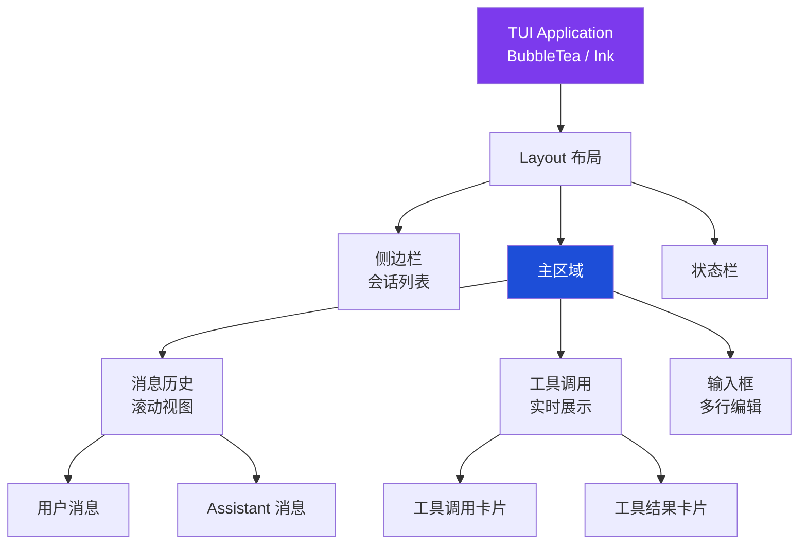

<ChapterLearningGuide />

<script setup>
import SourceSnapshotCard from '../../.vitepress/theme/components/SourceSnapshotCard.vue'
</script>

> **对应路径**：`packages/opencode/src/cli/cmd/tui/`、`packages/app/src/`
> **前置阅读**：第6章 多模型支持、第5章 会话管理
> **学习目标**：理解 OpenCode 如何在终端里渲染一个响应式 UI，以及 SolidJS Provider 树如何驱动 TUI 的状态管理

---

> **学习目标**：理解 TUI 为什么选 SolidJS、如何通过 SSE 实时更新、Provider 树如何组织全局状态
> **前置知识**：第7章"MCP 协议集成"
> **源码路径**：`packages/opencode/src/cli/cmd/tui/`
> **阅读时间**：20 分钟

---

传统 CLI 工具的交互模式是"输入命令 → 打印文字 → 结束"。OpenCode 的 TUI 不是这样的——它是一个**持续运行的终端应用**，实时更新界面、支持多会话切换、显示工具执行进度，更像一个轻量 IDE 而不是命令行脚本。



---

## 本章导读

### 这一章解决什么问题

这一章要回答的是：

- OpenCode 为什么选择 TUI 而不是纯 CLI
- SolidJS 如何在终端（非浏览器）环境中渲染 UI
- SDKProvider 和 SyncProvider 各自负责什么
- 工具调用、权限弹窗、键盘绑定是如何协作的

### 必看入口

- [packages/opencode/src/cli/cmd/tui/index.tsx](https://github.com/anomalyco/opencode/blob/dev/packages/opencode/src/cli/cmd/tui/index.tsx)：TUI 启动与 Provider 树组装
- [packages/opencode/src/cli/cmd/tui/provider/sdk.tsx](https://github.com/anomalyco/opencode/blob/dev/packages/opencode/src/cli/cmd/tui/provider/sdk.tsx)：SSE 事件驱动的数据层
- [packages/opencode/src/cli/cmd/tui/provider/sync.tsx](https://github.com/anomalyco/opencode/blob/dev/packages/opencode/src/cli/cmd/tui/provider/sync.tsx)：全局状态与乐观更新

### 先抓一条主链路

```text
opencode 启动
  -> TUI 入口组装 SDKProvider + SyncProvider
  -> SDKProvider 连接 SSE 事件流（/event）
  -> 收到事件 -> SyncProvider 更新状态
  -> SolidJS 信号触发 UI 重渲染
  -> 键盘输入 -> 发送 prompt -> 等待响应
```

### 初学者阅读顺序

1. 先读 `tui/index.tsx`，理解 TUI 的 Provider 树如何组装。
2. 再读 `provider/sdk.tsx`，看 SSE 连接和事件分发机制。
3. 最后看 `provider/sync.tsx` 和路由组件，理解状态如何驱动界面。

### 最容易误解的点

- SolidJS 不是 React，`createSignal` 和 `createStore` 的更新粒度更细。
- SDKProvider 负责"接收事件"，SyncProvider 负责"组织状态"，两者职责严格分开。
- TUI 和 Web App 共用同一套 HTTP API，不是两套独立实现。

## 8.1 为什么是 TUI，不是简单 CLI

### 问题：一问一答体验的断裂感

如果 OpenCode 是普通 CLI（`opencode "重构这个函数"` → 等待 → 打印结果），会有几个问题：

1. **无法观察过程**：用户不知道 Agent 在做什么，有没有卡住
2. **无法中途干预**：看到错误的工具调用，只能等它做完再纠正
3. **上下文割裂**：每次调用都是独立的，无法在同一个"工作区"里持续工作
4. **权限确认不友好**：`bash rm -rf build/` 这类操作需要用户确认，CLI 里没有好的交互方式

**TUI 解决这些问题**：持续运行的进程、实时事件流、可交互的权限弹窗、可切换的多会话侧边栏。

### 技术选择：SolidJS + OpenTUI

OpenCode 用 **SolidJS** 写 TUI 组件。这看起来反直觉——SolidJS 不是 Web 框架吗？

关键在于 **@opentui/core** 和 **@opentui/solid**——它们把 SolidJS 的响应式系统接入了终端渲染引擎：

```typescript
// @opentui/solid 提供的 render 函数
import { render } from "@opentui/solid"

render(
  () => <App />,
  {
    targetFps: 60,     // 60fps 终端渲染
    exitOnCtrlC: false,
    useKittyKeyboard: {},  // Kitty 键盘协议（更丰富的按键事件）
  }
)
```

SolidJS 的优势在这里体现：
- **细粒度响应式**：收到一个 `PartDelta` 事件时，只更新对应的文字组件，不重渲染整个界面
- **无虚拟 DOM**：直接操作渲染树，终端刷新更高效
- **组件模型**：复用 Web 开发的组件化思路，组织 TUI 界面

---

## 8.2 启动流程

**状态流动画：** 从 `run.ts` 启动本地 server，到 `SDKProvider` 接收 SSE，再到 `SyncProvider` 更新全局 Store，观察 TUI 为什么既实时又不容易卡顿。

<TuiProviderFlowDemo />

### run.ts：TUI 的入口

用户运行 `opencode` 时，`cli/cmd/run.ts` 是执行路径的起点：

```typescript
// cli/cmd/run.ts（简化）
export const RunCommand = {
  command: "$0 [directory]",
  handler: async (argv) => {
    // 1. 启动本地 HTTP 服务器（或连接已有服务器）
    const server = await Server.create()
    const url = `http://localhost:${server.port}`

    // 2. 读取 TUI 配置
    const config = await TuiConfig.get()

    // 3. 启动 TUI，传入服务器 URL
    await tui({ url, config, args: argv, directory: argv.directory })
  }
}
```

TUI 和 Server 可以在同一进程（`run` 命令，内嵌服务器），也可以分离（`serve` + 独立 Web 客户端）。对 TUI 来说，它只知道一个 `url`，不关心 Server 在哪里运行。

### tui()：Provider 树初始化

`tui()` 函数调用 `render()` 启动 SolidJS 渲染引擎，并构建一棵深层的 Provider 树：

```tsx
// cli/cmd/tui/app.tsx（provider 树结构）
render(() => (
  <ErrorBoundary>
    <ArgsProvider>          {/* 命令行参数 */}
      <ExitProvider>        {/* 退出控制 */}
        <KVProvider>        {/* 本地 key-value 持久化 */}
          <ToastProvider>   {/* Toast 通知 */}
            <RouteProvider> {/* 路由（Home / Session） */}
              <SDKProvider url={url}>    {/* HTTP 客户端 + SSE 事件流 */}
                <SyncProvider>          {/* 全局状态中心（单一数据源） */}
                  <ThemeProvider>       {/* 主题（dark/light） */}
                    <LocalProvider>     {/* 本地状态（焦点等） */}
                      <KeybindProvider> {/* 键盘快捷键注册 */}
                        <DialogProvider>   {/* 弹窗系统 */}
                          <CommandProvider> {/* 命令面板 */}
                            <App />
                          </CommandProvider>
                        </DialogProvider>
                      </KeybindProvider>
                    </LocalProvider>
                  </ThemeProvider>
                </SyncProvider>
              </SDKProvider>
            </RouteProvider>
          </ToastProvider>
        </KVProvider>
      </ExitProvider>
    </ArgsProvider>
  </ErrorBoundary>
), { targetFps: 60 })
```

这种嵌套 Provider 结构是 SolidJS 应用的标准模式，每层 Provider 向下层组件提供特定的 Context。

---

## 8.3 SDKProvider：事件驱动的数据层

### 连接方式

TUI 通过 `@opencode-ai/sdk` 包与后端通信。初始化时建立两个通道：

```typescript
// context/sdk.tsx（精简）
init: (props: { url: string }) => {
  // 1. REST 调用（创建会话、发送消息等命令型操作）
  let sdk = createOpencodeClient({ baseUrl: props.url })

  // 2. SSE 事件流（实时接收后端推送）
  function startSSE() {
    const events = await sdk.event.subscribe()
    for await (const event of events) {
      handleEvent(event)
    }
  }
}
```

### 事件批处理：避免频繁重渲染

SSE 事件流的事件频率很高（流式输出时每几毫秒一个 `PartDelta`）。直接每个事件触发一次渲染会导致界面卡顿。SDK Context 做了事件批处理：

```typescript
// context/sdk.tsx
let queue: Event[] = []
let timer: Timer | undefined
let last = 0

const flush = () => {
  const events = queue
  queue = []
  // batch() 让 SolidJS 把所有 store 更新合并为一次渲染
  batch(() => {
    for (const event of events) {
      emitter.emit(event.type, event)
    }
  })
}

const handleEvent = (event: Event) => {
  queue.push(event)
  const elapsed = Date.now() - last

  // 16ms 内（一帧）收到的事件合并处理
  if (elapsed < 16) {
    timer = setTimeout(flush, 16)
    return
  }
  flush()  // 超过 16ms 没有新事件，立即刷新
}
```

这是一个简单的防抖策略：一帧内的所有事件合并成一次 `batch()` 更新，既保证实时性（超过 16ms 立即刷新），又避免同一帧内多次重渲染。

---

## 8.4 SyncProvider：全局状态中心

### 单一数据源

`SyncProvider` 是 TUI 的核心状态管理层。它维护了一个巨大的 Store，存放所有从服务器同步来的数据：

```typescript
// context/sync.tsx
const [store, setStore] = createStore<{
  status: "loading" | "partial" | "complete"
  session: Session[]                          // 会话列表
  session_status: Record<string, SessionStatus>  // 每个会话的状态（busy/idle/retry）
  message: Record<string, Message[]>          // 每个会话的消息列表
  part: Record<string, Part[]>               // 每条消息的 Part 列表
  provider: Provider[]                        // 可用提供商列表
  agent: Agent[]                             // 可用 Agent 列表
  mcp: Record<string, McpStatus>             // MCP Server 状态
  permission: Record<string, PermissionRequest[]>  // 待确认的权限请求
  question: Record<string, QuestionRequest[]>      // 待回答的问题
  todo: Record<string, Todo[]>               // 每个会话的 Todo 列表
  vcs: VcsInfo | undefined                   // Git 状态
  // ... 更多字段
}>()
```

### 事件处理：Store 的实时更新

`SyncProvider` 订阅 SDK 发出的所有事件类型，把服务器推送的变更写入 Store：

```typescript
// context/sync.tsx（事件处理，简化）
onMount(() => {
  // 初始化：获取完整状态快照
  const init = await sdk.state.get()
  setStore(reconcile(init))  // reconcile = 高效 diff 更新

  // 订阅增量事件
  sdk.on("session.message.part.delta", (event) => {
    setStore(produce((state) => {
      const parts = state.part[event.messageID]
      const part = parts?.find(p => p.id === event.partID)
      if (part?.type === "text") {
        part.text += event.delta  // 追加文字
      }
    }))
  })

  sdk.on("session.status.updated", (event) => {
    setStore("session_status", event.sessionID, event.status)
  })

  sdk.on("session.permission.updated", (event) => {
    setStore("permission", event.sessionID, event.requests)
  })
})
```

`produce`（来自 `solid-js/store`）提供 Immer 风格的可变更新，让修改嵌套数据结构不需要手动解构。

---

## 8.5 路由：Home 和 Session

### 两个主要界面

TUI 只有两个路由，由 `RouteProvider` 管理：

```tsx
// app.tsx（App 组件路由）
function App() {
  const route = useRoute()
  return (
    <Switch>
      <Match when={route.name === "home"}>
        <Home />     {/* 会话列表 + 新建会话 */}
      </Match>
      <Match when={route.name === "session"}>
        <Session />  {/* 活跃会话的对话界面 */}
      </Match>
    </Switch>
  )
}
```

### Home 路由

Home 是 OpenCode 启动时的初始界面：

```tsx
// routes/home.tsx（简化）
export function Home() {
  const sync = useSync()
  // 首次使用（没有任何会话历史）时显示欢迎提示
  const isFirstTimeUser = createMemo(() => sync.data.session.length === 0)

  return (
    <box flexDirection="column">
      <Logo />                    {/* ASCII art Logo */}
      <Show when={!isFirstTimeUser()}>
        <RecentSessions />        {/* 最近会话列表 */}
      </Show>
      <Prompt onSubmit={createSession} />  {/* 输入框 */}
      <StatusBar />               {/* 底部状态栏：MCP 连接数等 */}
    </box>
  )
}
```

### Session 路由

Session 是工作中的主界面，包含：

```text
┌─────────────────────────────────────────────────────┐
│  Header（会话名、模型、token 用量）                  │
├──────────────────────────────┬──────────────────────┤
│                              │                      │
│     消息流（滚动区）          │    Sidebar           │
│  ┌─────────────────────┐    │  （会话列表、        │
│  │ User 消息           │    │   文件树、           │
│  │ Assistant 消息      │    │   Todo 列表）        │
│  │  ├── ReasoningPart  │    │                      │
│  │  ├── ToolPart       │    │                      │
│  │  └── TextPart       │    │                      │
│  └─────────────────────┘    │                      │
│                              │                      │
├──────────────────────────────┴──────────────────────┤
│  Prompt 输入框                                       │
├─────────────────────────────────────────────────────┤
│  Footer（快捷键提示）                                │
└─────────────────────────────────────────────────────┘
```

---

## 8.6 工具调用可视化

### run.ts 中的工具渲染（非 TUI 模式）

当 OpenCode 以非 TUI 模式运行（`opencode run "task"` 或 CI 环境），工具调用直接输出到终端，每种工具有定制的渲染方式：

```typescript
// cli/cmd/run.ts（工具渲染逻辑）
function renderTool(part: ToolPart) {
  switch (part.tool) {
    case "glob":
      inline({
        icon: "◆",
        title: `Glob "${input.pattern}"`,
        description: root ? `in ${normalizePath(root)}` : undefined,
      })
      break

    case "bash":
      block({
        icon: "❯",
        title: `${input.description}`,  // 显示用户友好的描述，不是原始命令
      }, state.output)
      break

    case "edit":
      inline({
        icon: "✎",
        title: normalizePath(input.filePath),
        description: `${lineCount} lines`,
      })
      break

    case "read":
      inline({
        icon: "↓",
        title: normalizePath(input.filePath),
      })
      break
  }
}
```

**设计原则**：工具渲染优先显示**语义信息**而不是原始数据——`bash` 工具显示 `description`（"运行测试"），而不是原始命令（`bun test --coverage`）。

### Session 路由中的工具渲染（TUI 模式）

在 TUI 的 Session 界面，`ToolPart` 有更丰富的可视化：

- **pending 状态**：显示工具名 + 旋转加载动画
- **running 状态**：显示参数预览 + 实时输出
- **completed 状态**：显示折叠的结果摘要，可展开查看完整输出
- **error 状态**：红色错误信息

工具的状态机（`pending → running → completed/error`）直接映射到不同的 UI 展示。

---

## 8.7 权限弹窗

当 `permission.ts` 里有待确认的权限请求时，Session 界面会在 Prompt 输入框上方显示权限确认弹窗：

```tsx
// routes/session/permission.tsx（简化）
export function PermissionPrompt() {
  const sync = useSync()
  const sdk = useSDK()
  const sessionID = useRouteData("session").id

  const pending = createMemo(() =>
    sync.data.permission[sessionID] ?? []
  )

  return (
    <Show when={pending().length > 0}>
      {/* 暂停整个对话，等待用户决定 */}
      <PermissionDialog
        request={pending()[0]}
        onAllow={() => sdk.session.permission.respond(sessionID, { action: "allow" })}
        onAlwaysAllow={() => sdk.session.permission.respond(sessionID, { action: "always" })}
        onDeny={() => sdk.session.permission.respond(sessionID, { action: "deny" })}
      />
    </Show>
  )
}
```

权限弹窗显示时，Agent 的执行循环已经暂停在服务端（`ctx.ask()` 在等待 `PermissionNext` 响应）。用户点击 Allow/Deny 后，响应通过 SDK 发送到服务端，执行循环恢复。

这是"服务端暂停 + 客户端交互"模式的典型实现。

---

## 8.8 键盘系统

### KeybindProvider：统一快捷键注册

所有快捷键在 `KeybindProvider` 里统一管理，避免不同组件抢占同一按键：

```typescript
// context/keybind.tsx（概念）
export function KeybindProvider(props) {
  const bindings = new Map<string, Handler>()

  function register(key: string, handler: Handler) {
    bindings.set(key, handler)
    return () => bindings.delete(key)  // 返回注销函数
  }

  // 处理所有键盘事件
  useKeyboard((evt) => {
    const key = formatKey(evt)  // "ctrl+k"、"escape"...
    bindings.get(key)?.()
  })
}
```

### 组件级快捷键注册

每个路由/组件在 `onMount` 时注册快捷键，在 `onCleanup` 时注销：

```typescript
// routes/session/index.tsx（简化）
export function Session() {
  const keybind = useKeybind()

  onMount(() => {
    // 注册快捷键
    keybind.register("ctrl+k", () => command.open())      // 命令面板
    keybind.register("escape", () => route.navigate("home")) // 返回首页
    keybind.register("ctrl+z", () => sdk.session.revert(sessionID)) // 撤销
  })
}
```

### 检测终端能力

TUI 启动时还会检测终端背景色，用于自动切换 dark/light 主题：

```typescript
// app.tsx
async function getTerminalBackgroundColor(): Promise<"dark" | "light"> {
  // 发送 ANSI 转义序列查询终端背景色
  process.stdout.write("\x1b]11;?\x07")

  // 解析响应：rgb:RRRR/GGGG/BBBB 格式
  // 计算亮度（luminance），>0.5 为 light
  const luminance = (0.299 * r + 0.587 * g + 0.114 * b) / 255
  return luminance > 0.5 ? "light" : "dark"
}
```

---

## 8.9 对话框系统

TUI 内有大量弹窗（Dialog），统一由 `DialogProvider` 管理：

```text
已实现的弹窗：
├── dialog-model       → 切换 LLM 模型
├── dialog-agent       → 切换 Agent
├── dialog-provider    → 提供商配置
├── dialog-mcp         → MCP Server 管理
├── dialog-session-list → 会话列表
├── dialog-command     → 命令面板（ctrl+k）
├── dialog-theme-list  → 主题选择
├── dialog-workspace-list → 工作区切换
├── dialog-stash       → 草稿箱（暂存输入）
├── dialog-status      → 状态面板
└── dialog-tag         → 会话标签
```

弹窗的打开/关闭通过 `useDialog()` hook 控制，所有弹窗叠加在主界面之上渲染，按 `Escape` 关闭。

---

## 8.10 非交互模式

除了 TUI，`run.ts` 还支持**非交互模式**（用于管道、CI、脚本调用）：

```bash
# 非交互模式：输入通过 stdin 传入，输出到 stdout
echo "重构 src/utils.ts" | opencode run --no-interactive

# 或者直接传入参数
opencode run "帮我写测试" --output-format json
```

非交互模式下不启动 TUI，而是直接连接后端服务器，把 SSE 事件流转换为文本输出。这让 OpenCode 可以在 CI 流程或 Shell 脚本里使用。

---

## 本章小结

TUI 的技术栈与分层：

```text
@opentui/solid + @opentui/core   ← 终端渲染引擎
        ↓
SolidJS 组件树                   ← UI 框架
        ↓
Provider 树（SDK/Sync/Theme...）  ← 全局状态管理
        ↓
SSE 事件流（sdk.event.subscribe）  ← 实时数据来源
        ↓
OpenCode HTTP Server              ← 业务逻辑
```

**关键设计决策**：

| 决策 | 原因 |
|------|------|
| SolidJS 而非 React | 细粒度响应式，终端渲染不需要虚拟 DOM |
| 事件批处理（16ms 窗口） | 流式输出时防止每个 token 触发重渲染 |
| SyncProvider 作为单一数据源 | 所有 UI 组件从同一 store 读取，避免状态不一致 |
| 服务端暂停 + 客户端交互 | 权限确认不需要特殊协议，利用现有 REST API |
| 自动检测终端背景色 | dark/light 主题跟随终端，而不是强制一种 |

### 关键代码位置

| 模块 | 位置 | 建议关注点 |
| --- | --- | --- |
| TUI 入口 | `packages/opencode/src/cli/cmd/tui/index.tsx` | Provider 树组装、启动流程 |
| SDKProvider | `packages/opencode/src/cli/cmd/tui/provider/sdk.tsx` | SSE 连接、心跳重连、事件分发 |
| SyncProvider | `packages/opencode/src/cli/cmd/tui/provider/sync.tsx` | 全局状态、乐观更新 |
| Home 路由 | `packages/opencode/src/cli/cmd/tui/home.tsx` | 会话列表渲染 |
| Session 路由 | `packages/opencode/src/cli/cmd/tui/session.tsx` | 对话主界面 |
| 键盘系统 | `packages/opencode/src/cli/cmd/tui/hotkey.tsx` | 快捷键注册与冒泡 |
| 权限弹窗 | `packages/opencode/src/cli/cmd/tui/permission.tsx` | 工具授权交互 |

### 源码阅读路径

1. 先读 `tui/index.tsx` 建立 Provider 树全貌。
2. 再读 `provider/sdk.tsx`，追踪一个 SSE 事件从接收到分发的完整路径。
3. 然后读 `provider/sync.tsx`，理解状态更新如何触发 UI 刷新。
4. 最后分别看 `home.tsx` 和 `session.tsx`，理解两个主要路由的渲染逻辑。

### 思考题

1. `SyncProvider` 为什么选择 `produce`（Immer 风格）而不是直接 `setStore` 替换整个数组？在实时追加文字这个场景下有什么性能差异？
2. 权限弹窗显示期间，服务端的执行循环是在"等待"还是"暂停"？两者有什么区别？
3. 如果用户同时开了 TUI 和 Web 界面连接同一个 Session，两个客户端都会收到 SSE 事件吗？

---

## 下一章预告

**第9章：HTTP API 服务器**

深入 `packages/opencode/src/server/`，学习：
- Hono 框架的路由组织与中间件设计
- SSE 事件推送的实现机制
- API 与 SDK 的生成关系
- 认证中间件与 CORS 配置

---

## 常见误区

### 误区1：TUI 是用 ncurses 或类似的终端库直接绘制的

**错误理解**：终端 UI 必然用 ncurses 或 blessed 之类的传统终端库，直接操作光标位置绘制界面。

**实际情况**：OpenCode 的 TUI 用 SolidJS 声明式组件树 + `@opentui/core` 渲染层实现。开发者写的是 SolidJS 组件（`<Box>`、`<Text>`），不是光标控制序列。这让 TUI 代码和 Web 代码共享组件逻辑，两者都用 SolidJS 的响应式系统。

### 误区2：TUI 通过直接函数调用和 Agent 通信，没有网络请求

**错误理解**：TUI 和 Agent 在同一个进程里，直接调用函数通信，比 Web 更高效。

**实际情况**：TUI 通过 HTTP 和 SSE（Server-Sent Events）与 Agent 通信，和 Web 客户端完全一样的方式——只是连接的是 `localhost:4096`。`SDKProvider` 和 `SyncProvider` 这两个 SolidJS 上下文负责维护 SDK 连接和状态同步。这是架构一致性的体现，虽然看起来"多此一举"，但让所有客户端使用同一套通信机制，大幅降低了维护成本。

### 误区3：权限弹窗期间 Agent 会继续在后台工作

**错误理解**：当 TUI 显示"是否允许执行这个命令？"的弹窗时，Agent 会在后台继续处理其他事情。

**实际情况**：权限请求会让 `processor.ts` 的执行循环完全暂停——它在 `permission/next.ts` 的 `check()` 调用处挂起，等待一个 Promise resolve。只有当用户在 TUI 里点击"允许"或"拒绝"，服务端的执行才继续或中止。这是设计上的有意安排，确保危险操作不会在用户不知情的情况下执行。

### 误区4：SolidJS 在终端环境下是一个"hack"，不是官方支持的用法

**错误理解**：SolidJS 是为浏览器设计的，在终端里用它是打补丁的非官方用法，可能有各种限制。

**实际情况**：SolidJS 的响应式核心是运行时无关的——它不直接操作 DOM，而是通过信号（Signal）和计算（Computed）管理状态，`@opentui/core` 提供了终端渲染器作为 DOM 的替代品。这和 React Native 用 React 渲染原生组件是同样的设计模式，是 SolidJS 架构的有意设计，不是 hack。

### 误区5：TUI 的状态是独立的，和 Web/Desktop 客户端互不干扰

**错误理解**：如果 TUI 和 Web 同时连接到同一个 Session，它们的状态是隔离的，互相看不到对方的操作。

**实际情况**：所有客户端共享同一套服务端状态，通过 SSE 事件流实时同步。当 TUI 发送了一条消息，Web 客户端会收到同样的消息事件并更新界面；反之亦然。Bus 的广播机制保证了所有连接的客户端都能实时接收到任何状态变化。

---

<SourceSnapshotCard
  title="第8章源码快照"
  description="这一章的核心是理解 TUI 如何把 HTTP API 的事件流转化成终端界面的实时更新，以及 SolidJS 在非浏览器环境中如何工作。"
  repo="anomalyco/opencode"
  repo-url="https://github.com/anomalyco/opencode/tree/f8475649da1cd7a6d49f8f30ee2fad374c2f4fcc"
  branch="dev"
  commit="f8475649da1cd7a6d49f8f30ee2fad374c2f4fcc"
  verified-at="2026-03-15"
  :entries="[
    {
      label: 'TUI 入口',
      path: 'packages/opencode/src/cli/cmd/tui/index.tsx',
      href: 'https://github.com/anomalyco/opencode/blob/f8475649da1cd7a6d49f8f30ee2fad374c2f4fcc/packages/opencode/src/cli/cmd/tui/index.tsx'
    },
    {
      label: 'SDKProvider（事件驱动数据层）',
      path: 'packages/opencode/src/cli/cmd/tui/provider/sdk.tsx',
      href: 'https://github.com/anomalyco/opencode/blob/f8475649da1cd7a6d49f8f30ee2fad374c2f4fcc/packages/opencode/src/cli/cmd/tui/provider/sdk.tsx'
    },
    {
      label: 'SyncProvider（全局状态中心）',
      path: 'packages/opencode/src/cli/cmd/tui/provider/sync.tsx',
      href: 'https://github.com/anomalyco/opencode/blob/f8475649da1cd7a6d49f8f30ee2fad374c2f4fcc/packages/opencode/src/cli/cmd/tui/provider/sync.tsx'
    },
    {
      label: '键盘系统',
      path: 'packages/opencode/src/cli/cmd/tui/hotkey.tsx',
      href: 'https://github.com/anomalyco/opencode/blob/f8475649da1cd7a6d49f8f30ee2fad374c2f4fcc/packages/opencode/src/cli/cmd/tui/hotkey.tsx'
    }
  ]"
/>


<StarCTA />
