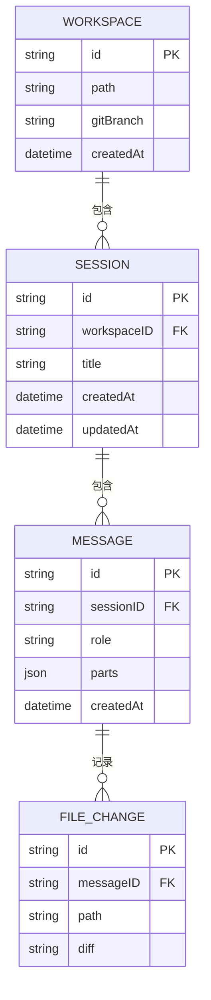

<ChapterLearningGuide />

<script setup>
import SourceSnapshotCard from '../../.vitepress/theme/components/SourceSnapshotCard.vue'
</script>

> **对应路径**：`packages/opencode/src/storage/`、`packages/opencode/src/session/session.sql.ts`
> **前置阅读**：第5章 会话管理、第3章 项目介绍
> **学习目标**：理解 SQLite + Drizzle ORM 的 Schema 设计、JSON blob 策略、事务与副效应队列，以及 JSON 文件到 SQLite 的演进迁移

---

## 本章导读

### 这一章解决什么问题

这一章要回答的是：

- OpenCode 为什么选 SQLite 而不是 PostgreSQL 或 MongoDB
- `Database.use()` / `transaction()` / `effect()` 三个函数如何协作防止"通知先于数据"的竞态
- PartTable 为什么用 JSON blob 而不是多列展开
- 旧的 JSON 文件存储和新的 SQLite 数据库如何共存并完成迁移

### 必看入口

- [packages/opencode/src/storage/db.ts](https://github.com/anomalyco/opencode/blob/dev/packages/opencode/src/storage/db.ts)：数据库初始化与事务管理
- [packages/opencode/src/session/session.sql.ts](https://github.com/anomalyco/opencode/blob/dev/packages/opencode/src/session/session.sql.ts)：核心三级嵌套 Schema
- [packages/opencode/src/storage/json-migration.ts](https://github.com/anomalyco/opencode/blob/dev/packages/opencode/src/storage/json-migration.ts)：大规模数据迁移实现

### 先抓一条主链路

```text
Session 创建
  -> Database.transaction(tx => {
       tx.insert(SessionTable).values(...).run()
       Database.effect(() => Bus.publish(Session.Events.Created, ...))
     })
  -> 事务提交 -> effect 执行 -> Bus 广播 -> UI 更新
```

### 初学者阅读顺序

1. 先读 `db.ts`，理解 PRAGMA 配置和 `use/transaction/effect` 三函数。
2. 再读 `session.sql.ts`，理解三级嵌套 Schema（Project→Session→Message→Part）。
3. 最后读 `json-migration.ts`，看"孤立记录"处理和批处理策略。

### 最容易误解的点

- `Database.effect()` 不是"立即执行副效应"，而是"事务提交后才执行"——这是防止竞态的关键。
- PartTable 的 `session_id` 是冗余字段，存在是为了避免 JOIN，不是设计缺陷。
- JSON 文件存储（`storage.ts`）现在还在使用，不是被完全替代了，两套系统并存。

## 10.1 为什么选择 SQLite？

OpenCode 是一个在用户本地运行的工具，它的数据库选型必须满足几个苛刻条件：

- **零配置**：不能要求用户安装 PostgreSQL 或 MySQL
- **单文件**：整个数据库就是一个文件，方便备份、移动和调试
- **嵌入式**：进程内运行，没有网络开销
- **足够快**：会话消息可能有数千条 Part，查询要毫秒级返回

SQLite 满足全部条件，而 Bun 的运行时更是内置了 `bun:sqlite`，零依赖。Drizzle ORM 则提供了类型安全的查询构建器，让 TypeScript 类型从 Schema 定义一路传递到查询结果。



## 10.2 数据库的两个生命阶段

OpenCode 的持久化层有一段有趣的演进历史：**它曾经用 JSON 文件存储所有数据，后来迁移到了 SQLite**。

这不是抽象的架构讨论，而是代码里实实在在留存的痕迹：

```
packages/opencode/src/storage/
├── db.ts           # SQLite + Drizzle ORM（当前方案）
├── schema.ts       # 汇总所有 SQL 表定义
├── schema.sql.ts   # 共享的 Timestamps 字段
├── storage.ts      # JSON 文件存储（历史方案，仍在使用中）
└── json-migration.ts  # 一次性数据迁移：JSON → SQLite
```

理解这两套系统，才能理解 OpenCode 数据层的全貌。

## 10.3 SQLite 初始化：PRAGMA 配置的工程选择

数据库初始化在 `db.ts` 的 `Database.Client` 懒加载函数中完成：

```typescript
// lazy() 确保只在第一次访问时初始化，避免启动时不必要的数据库连接
export const Client = lazy(() => {
  const sqlite = new BunDatabase(Path, { create: true })  // 文件不存在时自动创建

  sqlite.run("PRAGMA journal_mode = WAL")        // WAL 模式：读写并发，崩溃安全恢复
  sqlite.run("PRAGMA synchronous = NORMAL")      // 比 FULL 快（WAL 下足够安全）
  sqlite.run("PRAGMA busy_timeout = 5000")       // 锁竞争时等待最多 5 秒，而不是立即报错
  sqlite.run("PRAGMA cache_size = -64000")       // 负值表示 KB：64MB 热数据缓存
  sqlite.run("PRAGMA foreign_keys = ON")         // SQLite 默认不检查外键，这里强制开启
  sqlite.run("PRAGMA wal_checkpoint(PASSIVE)")   // 被动 WAL 合并：不阻塞当前操作

  const db = drizzle({ client: sqlite })  // 包装成 Drizzle ORM 实例
  migrate(db, entries)                    // 启动时自动运行所有未执行的迁移
  return db
  // 返回的 db 对象有完整的 TypeScript 类型推导，查询结果类型安全
})
```

每个 PRAGMA 都有明确的工程理由：

| PRAGMA | 值 | 原因 |
|--------|-----|------|
| `journal_mode` | WAL | Write-Ahead Logging 允许读写并发，崩溃后自动恢复 |
| `synchronous` | NORMAL | 比 FULL 快，比 OFF 安全（WAL 模式下足够） |
| `busy_timeout` | 5000 | 同一进程的多个操作可能竞争锁，5 秒避免立即失败 |
| `cache_size` | -64000 | 负值表示 KB，64MB 页缓存，热数据常驻内存 |
| `foreign_keys` | ON | SQLite 默认关闭外键，这里显式开启以保证数据完整性 |

**WAL 模式的重要性**：OpenCode 服务器可能同时处理多个请求（TUI 操作 + Web API），WAL 模式确保读者不阻塞写者，写者不阻塞读者。

## 10.4 数据库文件路径：频道感知

```typescript
export const Path = iife(() => {
  const channel = Installation.CHANNEL
  if (["latest", "beta"].includes(channel) || Flag.OPENCODE_DISABLE_CHANNEL_DB)
    return path.join(Global.Path.data, "opencode.db")
  const safe = channel.replace(/[^a-zA-Z0-9._-]/g, "-")
  return path.join(Global.Path.data, `opencode-${safe}.db`)
})
```

正式发布版（latest/beta）使用 `opencode.db`，其他频道（如开发构建 `dev`）使用独立的 `opencode-dev.db`。这防止了"用开发版把正式版数据库改坏"的情况。对于持续集成和测试环境，可以通过 `Flag.OPENCODE_DISABLE_CHANNEL_DB` 强制使用统一文件名。

## 10.5 核心 Schema：三级嵌套结构

所有表定义通过 `storage/schema.ts` 统一导出，但实际定义分散在各个领域模块中：

```typescript
// storage/schema.ts
export { ProjectTable } from "../project/project.sql"
export { SessionTable, MessageTable, PartTable, TodoTable, PermissionTable } from "../session/session.sql"
export { SessionShareTable } from "../share/share.sql"
```

这种就近原则（schema 和对应的业务代码放在一起）比把所有 schema 集中到 `storage/` 目录更容易维护。

### Timestamps 共享模式

```typescript
// storage/schema.sql.ts
export const Timestamps = {
  time_created: integer()
    .notNull()
    .$default(() => Date.now()),   // 插入时自动设置
  time_updated: integer()
    .notNull()
    .$onUpdate(() => Date.now()),  // 更新时自动刷新
}
```

`Timestamps` 是一个可复用的字段组合，通过展开运算符 `...Timestamps` 注入到每张表。所有时间戳都存储为 **Unix 毫秒整数**，避免时区问题，排序和比较也比 ISO 字符串高效。

### ProjectTable：万物的根

```typescript
export const ProjectTable = sqliteTable("project", {
  id: text().$type<ProjectID>().primaryKey(),
  worktree: text().notNull(),           // Git 仓库根路径
  vcs: text(),                          // 版本控制类型（"git"）
  name: text(),                         // 项目名称（可选）
  icon_url: text(),                     // 项目图标 URL
  icon_color: text(),                   // 项目图标颜色
  ...Timestamps,
  time_initialized: integer(),          // 首次初始化时间
  sandboxes: text({ mode: "json" })     // 沙箱配置（JSON 数组）
    .notNull().$type<string[]>(),
  commands: text({ mode: "json" })      // 项目命令（JSON 对象）
    .$type<{ start?: string }>(),
})
```

`ProjectID` 是通过 Git 仓库的初始 commit hash 生成的，这保证了"同一个仓库在不同机器上的 ProjectID 相同"，为跨设备同步提供了稳定标识。

### SessionTable：会话的完整状态

```typescript
export const SessionTable = sqliteTable(
  "session",
  {
    id: text().$type<SessionID>().primaryKey(),
    project_id: text().$type<ProjectID>().notNull()
      .references(() => ProjectTable.id, { onDelete: "cascade" }),
    workspace_id: text().$type<WorkspaceID>(),    // 远程工作区（可选）
    parent_id: text().$type<SessionID>(),         // fork 来源（可选）
    slug: text().notNull(),                       // URL 友好标识
    directory: text().notNull(),                  // 工作目录
    title: text().notNull(),                      // 会话标题
    version: text().notNull(),                    // OpenCode 版本
    share_url: text(),                            // 分享链接（可选）
    summary_additions: integer(),                 // 代码增加行数
    summary_deletions: integer(),                 // 代码删除行数
    summary_files: integer(),                     // 修改文件数
    summary_diffs: text({ mode: "json" })         // 详细 diff（JSON）
      .$type<Snapshot.FileDiff[]>(),
    revert: text({ mode: "json" })                // 撤销状态（JSON）
      .$type<{ messageID: MessageID; partID?: PartID; ... }>(),
    permission: text({ mode: "json" })            // 权限规则集（JSON）
      .$type<PermissionNext.Ruleset>(),
    ...Timestamps,
    time_compacting: integer(),                   // 最近一次压缩时间
    time_archived: integer(),                     // 归档时间
  },
  (table) => [
    index("session_project_idx").on(table.project_id),
    index("session_workspace_idx").on(table.workspace_id),
    index("session_parent_idx").on(table.parent_id),
  ],
)
```

注意 `{ onDelete: "cascade" }`：当 Project 被删除时，所有关联的 Session 自动级联删除。Session 表里有三个外键创建了索引，分别支持"按项目查询会话"、"按工作区查询会话"、"查询 fork 链"三种查询模式。

### MessageTable 和 PartTable：JSON Blob 策略

```typescript
export const MessageTable = sqliteTable(
  "message",
  {
    id: text().$type<MessageID>().primaryKey(),
    session_id: text().$type<SessionID>().notNull()
      .references(() => SessionTable.id, { onDelete: "cascade" }),
    ...Timestamps,
    data: text({ mode: "json" }).notNull()  // 存储 MessageV2.Info 的大部分字段
      .$type<Omit<MessageV2.Info, "id" | "sessionID">>(),
  },
  (table) => [index("message_session_idx").on(table.session_id)],
)

export const PartTable = sqliteTable(
  "part",
  {
    id: text().$type<PartID>().primaryKey(),
    message_id: text().$type<MessageID>().notNull()
      .references(() => MessageTable.id, { onDelete: "cascade" }),
    session_id: text().$type<SessionID>().notNull(),  // 冗余但避免 JOIN
    ...Timestamps,
    data: text({ mode: "json" }).notNull()  // 存储 Part 的 type-specific 数据
      .$type<Omit<MessageV2.Part, "id" | "sessionID" | "messageID">>(),
  },
  (table) => [
    index("part_message_idx").on(table.message_id),
    index("part_session_idx").on(table.session_id),
  ],
)
```

这里有一个关键的架构决策：**大量字段以 JSON blob 形式存储在 `data` 列，而不是拆分为多列**。

为什么这样做？

1. **Part 类型多样**：TextPart、ToolPart、ReasoningPart 等有完全不同的字段结构。如果每种类型都拆开存储，要么需要大量 NULL 列，要么需要多张表做 JOIN。JSON blob 让一张表容纳所有 Part 类型。

2. **类型可以演化**：增减 Part 内部的字段，不需要数据库 Schema 迁移，只需要应用层兼容处理。

3. **查询模式简单**：大多数查询是"给我这个会话的所有消息和 Parts"，很少需要按 Part 的内部字段过滤。不需要索引内部字段，JSON blob 就够了。

`PartTable.session_id` 是冗余字段（可以通过 `message_id → MessageTable.session_id` 推导），但保留它是为了避免 JOIN，直接 `WHERE session_id = ?` 就能查出该会话的所有 Parts。

### TodoTable：复合主键设计

```typescript
export const TodoTable = sqliteTable(
  "todo",
  {
    session_id: text().$type<SessionID>().notNull()
      .references(() => SessionTable.id, { onDelete: "cascade" }),
    content: text().notNull(),
    status: text().notNull(),    // "pending" | "done" | "in_progress"
    priority: text().notNull(),  // "high" | "medium" | "low"
    position: integer().notNull(),  // 排序位置
    ...Timestamps,
  },
  (table) => [
    primaryKey({ columns: [table.session_id, table.position] }),
    index("todo_session_idx").on(table.session_id),
  ],
)
```

Todo 使用 `(session_id, position)` 复合主键，而不是独立的 UUID。这种设计意味着"同一会话内 position 唯一"，天然保证了待办事项的有序性，不需要额外的 ORDER BY 字段。

## 10.6 Database 命名空间：事务与副效应分离

`db.ts` 暴露了三个核心函数，它们共同构成了一个轻量级的事务管理系统：

### `Database.use()`：读取或非事务写入

```typescript
export function use<T>(callback: (trx: TxOrDb) => T): T {
  try {
    return callback(ctx.use().tx)  // 如果在事务中，复用现有事务
  } catch (err) {
    if (err instanceof Context.NotFound) {
      const effects: (() => void | Promise<void>)[] = []
      const result = ctx.provide({ effects, tx: Client() }, () => callback(Client()))
      for (const effect of effects) effect()  // 执行副效应
      return result
    }
    throw err
  }
}
```

`use()` 是最简单的数据库访问方式。如果当前已在事务中（通过 `transaction()` 发起的），它会自动复用该事务，避免嵌套事务的问题。如果没有，则直接使用数据库连接。

### `Database.transaction()`：原子性操作

```typescript
export function transaction<T>(callback: (tx: TxOrDb) => T): T {
  try {
    return callback(ctx.use().tx)  // 已在事务中则复用
  } catch (err) {
    if (err instanceof Context.NotFound) {
      const effects: (() => void | Promise<void>)[] = []
      const result = (Client().transaction as any)((tx: TxOrDb) => {
        return ctx.provide({ tx, effects }, () => callback(tx))
      })
      for (const effect of effects) effect()  // 事务成功后执行副效应
      return result
    }
    throw err
  }
}
```

`transaction()` 包裹 SQLite 原生事务，回调失败则自动回滚。关键在于**副效应队列**：在事务执行期间注册的副效应（通过 `Database.effect()`）会在事务提交成功后才执行，而不是在事务中间执行。

### `Database.effect()`：延迟副效应

```typescript
export function effect(fn: () => any | Promise<any>) {
  try {
    ctx.use().effects.push(fn)  // 在事务中：加入队列等待提交后执行
  } catch {
    fn()  // 不在事务中：立即执行
  }
}
```

这解决了一个经典问题：**数据库事务成功后触发 Bus 事件通知客户端**。如果直接在事务内部发 Bus 事件，可能发生"事务还没提交，客户端已收到通知去查数据库，却查不到新数据"的竞态。通过副效应队列，Bus 事件总在事务提交后才发出。

使用示例：

```typescript
Database.transaction((tx) => {
  // 写入数据库
  tx.insert(SessionTable).values({ id, ... }).run()

  // 注册副效应：事务提交后通知 TUI 刷新
  Database.effect(() => {
    Bus.publish(Session.Events.Created, { sessionID: id })
  })
})
// 事务提交成功 → Bus.publish 执行 → 客户端收到通知
```

## 10.7 JSON 文件存储：历史与现状

在 SQLite 引入之前，OpenCode 使用 `Storage` 命名空间管理基于文件系统的 JSON 存储：

```
~/.opencode/data/storage/
├── project/
│   └── <projectID>.json
├── session/
│   └── <projectID>/
│       └── <sessionID>.json
├── message/
│   └── <sessionID>/
│       └── <messageID>.json
├── part/
│   └── <messageID>/
│       └── <partID>.json
├── todo/
│   └── <sessionID>.json
└── permission/
    └── <projectID>.json
```

`Storage` 命名空间提供了简单的 CRUD API：

```typescript
// 读取（持有读锁）
const session = await Storage.read<Session.Info>(["session", projectID, sessionID])

// 写入（持有写锁）
await Storage.write(["session", projectID, sessionID], sessionData)

// 更新（持有写锁，read-modify-write 原子操作）
await Storage.update<Session.Info>(["session", projectID, sessionID], (draft) => {
  draft.title = newTitle
})

// 列出（glob 扫描）
const sessions = await Storage.list(["session", projectID])
```

文件锁通过 `Lock.read()` / `Lock.write()` 实现，使用 ES2023 的 `using` 语法自动释放：

```typescript
using _ = await Lock.write(target)  // 离开作用域时自动释放
await Filesystem.writeJson(target, content)
```

JSON 文件存储的优点是"无需数据库，直接用文件编辑器就能查看和修改数据"，但随着数据量增大，性能逐渐成为瓶颈。

## 10.8 从 JSON 到 SQLite：大规模数据迁移

`json-migration.ts` 实现了一次性的数据迁移，将旧的 JSON 文件数据完整迁移到 SQLite。

迁移的工程细节非常值得学习：

### 1. 迁移顺序遵循外键依赖

```
Projects（无外键依赖）
  ↓
Sessions（依赖 projects）
  ↓
Messages（依赖 sessions）
  ↓
Parts（依赖 messages + sessions）
  ↓
Todos（依赖 sessions）
Permissions（依赖 projects）
SessionShares（依赖 sessions）
```

任何违反这个顺序的插入都会因为 `PRAGMA foreign_keys = ON` 失败。

### 2. 迁移期间的 SQLite 优化

```typescript
// 批量导入时临时关闭部分安全措施，换取速度
sqlite.exec("PRAGMA journal_mode = WAL")
sqlite.exec("PRAGMA synchronous = OFF")    // 迁移期间不需要持久性保证
sqlite.exec("PRAGMA cache_size = 10000")
sqlite.exec("PRAGMA temp_store = MEMORY")
```

`synchronous = OFF` 在正常运行时是危险的（崩溃会丢数据），但在迁移这种"可以重试"的场景中换来了大幅性能提升。

### 3. 批处理防止内存溢出

```typescript
const batchSize = 1000  // 每批 1000 条记录

for (let i = 0; i < allMessageFiles.length; i += batchSize) {
  const end = Math.min(i + batchSize, allMessageFiles.length)
  const batch = await read(allMessageFiles, i, end)
  // ... 处理并插入
  stats.messages += insert(values, MessageTable, "message")
  step("messages", end - i)
}
```

### 4. 孤立记录处理

```typescript
if (!projectIds.has(projectID)) {
  orphans.sessions++
  continue  // 跳过，而不是失败
}
```

迁移不会因为数据不一致而中止，而是记录孤立记录数量并继续。这是生产迁移的正确姿态。

### 5. 事务包裹整个迁移

```typescript
sqlite.exec("BEGIN TRANSACTION")
// ... 所有迁移操作
sqlite.exec("COMMIT")
```

整个迁移在一个事务中完成，要么全部成功，要么全部回滚，不留中间状态。

## 10.9 数据关系全貌

```
Project ─┬─ Session ─┬─ Message ─── Part
         │            ├─ Todo
         │            └─ Permission（会话级权限）
         └─ Permission（项目级权限）

ProjectTable
  id (PK, git root commit hash)
  worktree, vcs, name, sandboxes, commands

SessionTable
  id (PK)
  project_id (FK → Project, CASCADE DELETE)
  parent_id (self-ref, fork 来源)
  summary_diffs, revert, permission (JSON blobs)

MessageTable
  id (PK)
  session_id (FK → Session, CASCADE DELETE)
  data (JSON blob: role, agent, model, cost...)

PartTable
  id (PK)
  message_id (FK → Message, CASCADE DELETE)
  session_id (冗余索引，避免 JOIN)
  data (JSON blob: type-specific 字段)

TodoTable
  (session_id, position) (PK)
  content, status, priority

PermissionTable
  project_id (PK, FK → Project, CASCADE DELETE)
  data (JSON blob: allow/deny/ask 规则集)
```

## 10.10 迁移系统：SQL 迁移文件管理

OpenCode 使用 Drizzle 的标准迁移系统，迁移文件位于 `packages/opencode/migration/` 目录：

```
migration/
├── 20240101000000_init/
│   └── migration.sql
├── 20240215000000_add_workspace/
│   └── migration.sql
└── ...
```

每个目录名以 `YYYYMMDDHHmmss` 格式的时间戳开头。`db.ts` 会解析这个时间戳来确定迁移顺序：

```typescript
function time(tag: string) {
  const match = /^(\d{4})(\d{2})(\d{2})(\d{2})(\d{2})(\d{2})/.exec(tag)
  if (!match) return 0
  return Date.UTC(
    Number(match[1]),
    Number(match[2]) - 1,  // 月份从 0 开始
    Number(match[3]),
    Number(match[4]),
    Number(match[5]),
    Number(match[6]),
  )
}
```

在生产构建中，迁移文件会通过 `OPENCODE_MIGRATIONS` 全局变量打包进二进制，不依赖文件系统路径。开发模式则直接读取 `migration/` 目录。

## 10.11 设计总结

OpenCode 数据持久化层的核心设计决策：

| 决策 | 选择 | 理由 |
|------|------|------|
| 数据库 | SQLite + WAL | 零配置、单文件、支持并发读 |
| ORM | Drizzle | 类型安全、轻量、与 Bun 契合 |
| 时间戳 | Unix 毫秒整数 | 无时区问题，排序高效 |
| 复杂字段 | JSON blob | Part 类型多样，避免宽表或多表 JOIN |
| 外键 | CASCADE DELETE | 删除父记录时自动清理子记录 |
| 冗余字段 | `part.session_id` | 空间换时间，避免 JOIN |
| 副效应 | 事务后执行 | 防止"通知先于数据"竞态 |

## 本章小结

### 关键代码位置

| 模块 | 位置 | 建议关注点 |
| --- | --- | --- |
| 数据库初始化 | `packages/opencode/src/storage/db.ts` | PRAGMA 配置、`use/transaction/effect` 三函数 |
| 核心 Schema | `packages/opencode/src/session/session.sql.ts` | 三级嵌套结构、JSON blob 策略 |
| 项目 Schema | `packages/opencode/src/project/project.sql.ts` | ProjectID 生成策略（git 根 commit hash） |
| 时间戳共享 | `packages/opencode/src/storage/schema.sql.ts` | `Timestamps` 复用模式 |
| JSON 存储 | `packages/opencode/src/storage/storage.ts` | 文件锁、read-modify-write |
| 数据迁移 | `packages/opencode/src/storage/json-migration.ts` | 外键顺序、批处理、孤立记录处理 |

### 源码阅读路径

1. 先读 `db.ts`，重点理解 `transaction()` 和 `effect()` 的协作关系。
2. 再读 `session.sql.ts`，画出 Project → Session → Message → Part 的层级关系图。
3. 对照第5章的 `Session.create()`，找到 `Database.transaction()` 的实际调用点，验证副效应时序。

**思考题**：

1. `PartTable` 中 `data` 列存储 JSON blob，而 `id`、`message_id`、`session_id`、`timestamps` 作为独立列。这个"部分列化"的边界是如何确定的？如果未来需要按某个 Part 内部字段查询，应该怎么改？

2. `Database.effect()` 实现了"事务提交后执行副效应"。如果副效应本身失败（比如 Bus 事件发布时客户端已断线），会发生什么？这个设计如何权衡？

3. 从 JSON 文件迁移到 SQLite 时，迁移脚本对"孤立记录"的处理是"跳过而不失败"。在真实的生产迁移中，这是正确的做法吗？什么情况下应该选择"严格模式（遇到错误就停止）"？

## 下一章预告

第11章：**多端 UI 开发** — 深入 `packages/app/` 和 `packages/desktop/`，学习：SolidJS Web 应用的组件架构、Tauri 桌面端的 Rust + TypeScript 桥接、多端共享代码的策略，以及如何用同一套 HTTP API 支撑 TUI、Web 和桌面三种客户端。

---

## 常见误区

### 误区1：SQLite 不适合生产级应用，OpenCode 用它只是因为简单

**错误理解**：SQLite 是轻量级数据库，适合原型开发，真正的生产应用应该用 PostgreSQL 或 MySQL。

**实际情况**：对于 OpenCode 这类本地优先（local-first）的 AI 工具，SQLite 是正确选择。单文件、零配置、写入性能足够、WAL 模式支持并发读。`db.ts` 里的 PRAGMA 配置（`journal_mode=WAL`、`foreign_keys=ON` 等）是针对高并发写入场景的优化，不是"将就"而是精心调优。对于云端部署场景，Drizzle ORM 同样支持 PostgreSQL。

### 误区2：事务（Transaction）和副效应（Effect）分开执行是因为性能问题

**错误理解**：`Database.effect()` 把事件发布放到事务外执行，是为了减少事务持有时间、提升性能。

**实际情况**：性能不是主要原因——**正确性**才是。如果在事务内部发布 Bus 事件，订阅者可能立即查询数据库，但此时事务还未提交，查询到的是旧数据（"通知先于数据"竞态）。`effect()` 确保事务完全提交后才执行副效应，消除了这个竞态条件。这是经典的"事务性消息传递"（transactional outbox）模式的简化实现。

### 误区3：Part 的 `data` 字段存 JSON 是因为 TypeScript 不支持多态 SQL 列

**错误理解**：把所有 Part 类型的数据压缩成一个 JSON blob 是技术限制导致的，如果能用多表继承会更好。

**实际情况**：JSON blob 是有意的权衡。Part 类型有十几种（text、tool-call、tool-result、reasoning、file 等），如果每种一张表需要维护复杂的 JOIN 逻辑。JSON 策略牺牲了单字段查询能力，换来了 schema 灵活性——新增 Part 类型不需要数据库迁移，只需修改 TypeScript 类型。`id`、`session_id` 等高频查询字段仍然是独立列，保证了主要查询路径的性能。

### 误区4：KV 存储（storage.ts）和 SQLite 数据库是互相替代的两个系统

**错误理解**：`storage.ts` 的 JSON 文件 KV 存储和 SQLite 数据库都是持久化手段，选一个用就行。

**实际情况**：两者存储不同性质的数据。SQLite 存储**结构化、可查询**的数据（会话、消息、Parts），需要按条件筛选、排序、关联查询。JSON KV 存储配置类**非结构化、全量读写**的数据（API key、用户偏好、模型设置），每次操作都读完整文件，不需要 SQL 查询能力。文件锁（`lockfile`）防止并发写入冲突。

### 误区5：数据库迁移只在版本升级时需要，日常开发不用关心

**错误理解**：数据库迁移是发布新版本时才运行一次的操作，开发过程中可以忽略。

**实际情况**：OpenCode 在**每次启动时**自动运行迁移（`db.ts` 里的 `migrate()` 调用）。这意味着开发时修改 schema 后，下次启动就会自动迁移，不需要手动执行脚本。同时，从旧版 JSON 文件格式迁移到 SQLite 的逻辑（`json-migration.ts`）也在启动时自动检测和执行，保证升级后历史数据不丢失。

---

<SourceSnapshotCard
  title="第10章源码快照"
  description="这一章的核心是 db.ts 的副效应队列设计：为什么事务提交后才能发 Bus 事件，以及 JSON blob 策略如何让多种 Part 类型共存于同一张表。"
  repo="anomalyco/opencode"
  repo-url="https://github.com/anomalyco/opencode/tree/f8475649da1cd7a6d49f8f30ee2fad374c2f4fcc"
  branch="dev"
  commit="f8475649da1cd7a6d49f8f30ee2fad374c2f4fcc"
  verified-at="2026-03-15"
  :entries="[
    {
      label: '数据库初始化',
      path: 'packages/opencode/src/storage/db.ts',
      href: 'https://github.com/anomalyco/opencode/blob/f8475649da1cd7a6d49f8f30ee2fad374c2f4fcc/packages/opencode/src/storage/db.ts'
    },
    {
      label: '核心 Schema',
      path: 'packages/opencode/src/session/session.sql.ts',
      href: 'https://github.com/anomalyco/opencode/blob/f8475649da1cd7a6d49f8f30ee2fad374c2f4fcc/packages/opencode/src/session/session.sql.ts'
    },
    {
      label: 'JSON 文件存储（历史方案）',
      path: 'packages/opencode/src/storage/storage.ts',
      href: 'https://github.com/anomalyco/opencode/blob/f8475649da1cd7a6d49f8f30ee2fad374c2f4fcc/packages/opencode/src/storage/storage.ts'
    },
    {
      label: 'JSON→SQLite 迁移',
      path: 'packages/opencode/src/storage/json-migration.ts',
      href: 'https://github.com/anomalyco/opencode/blob/f8475649da1cd7a6d49f8f30ee2fad374c2f4fcc/packages/opencode/src/storage/json-migration.ts'
    }
  ]"
/>


<StarCTA />
