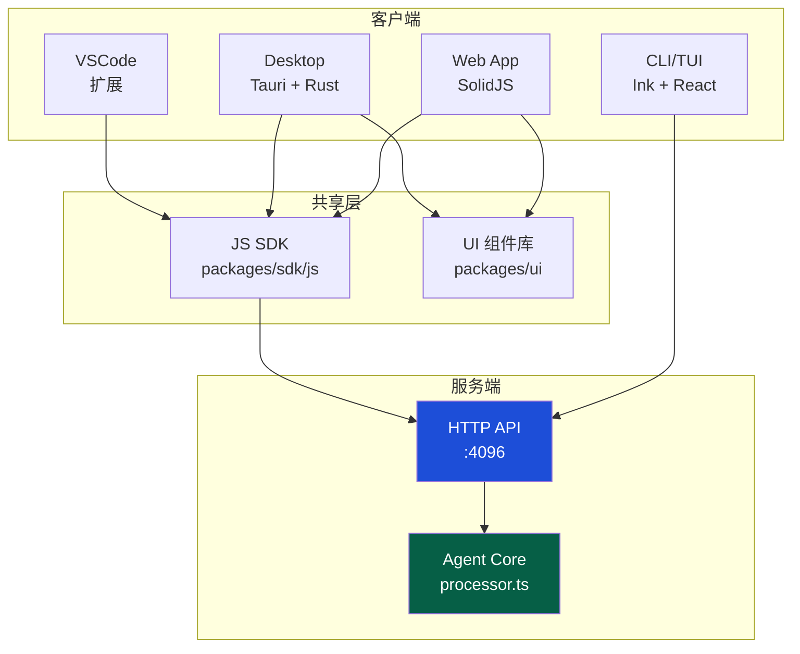

<ChapterLearningGuide />

<script setup>
import SourceSnapshotCard from '../../.vitepress/theme/components/SourceSnapshotCard.vue'
</script>

> **对应路径**：`packages/app/src/`、`packages/desktop/src/`
> **前置阅读**：第9章 HTTP API 服务器、第8章 TUI 终端界面
> **学习目标**：理解 Web 应用和桌面端如何共用同一套 SolidJS UI，以及 Platform 抽象如何隔离平台差异

---

## 本章导读

### 这一章解决什么问题

这一章要回答的是：

- 为什么 Web App 和桌面端能共用 99% 的 UI 代码
- GlobalSDKProvider 的 16ms 批处理窗口如何解决 token 风暴问题
- Platform 接口如何让 UI 代码不需要写 `if (isTauri())` 判断
- Tauri Sidecar 模式和传统桌面应用有什么区别

### 必看入口

- [packages/app/src/app.tsx](https://github.com/anomalyco/opencode/blob/dev/packages/app/src/app.tsx)：Provider 树三层结构（应用级/目录级/会话级）
- [packages/app/src/context/global-sdk.tsx](https://github.com/anomalyco/opencode/blob/dev/packages/app/src/context/global-sdk.tsx)：SSE 连接循环、心跳超时、事件批处理
- [packages/app/src/platform.tsx](https://github.com/anomalyco/opencode/blob/dev/packages/app/src/platform.tsx)：Platform 接口定义

### 先抓一条主链路

```text
服务器发出 SSE 事件
  -> GlobalSDKProvider 接收 -> 加入队列
  -> 16ms 批处理定时器触发
  -> 事件合并（相同 key 保留最新）
  -> SolidJS batch() 合并信号更新
  -> 组件重渲（最多 60fps）
```

### 初学者阅读顺序

1. 先读 `app.tsx`，理解三层 Provider 的职责边界。
2. 再读 `global-sdk.tsx`，追踪一个 SSE 事件从接收到 UI 更新的完整路径。
3. 最后读 `platform.tsx` 和 `packages/desktop/src/bindings.ts`，理解平台差异如何被封装。

### 最容易误解的点

- `GlobalSDKProvider` 不只是"连接 SSE"，它还负责批处理、事件合并和心跳超时检测。
- Platform 抽象不是运行时 polyfill，而是在构建/注入时决定使用哪个实现。
- Tauri 桌面端的 AI 逻辑仍然在 `opencode serve` 进程里，Tauri 只是壳层。

## 11.1 三个客户端，一个服务器

第8章介绍了 OpenCode 的 HTTP API 服务器。现在我们来看另一侧：有哪些客户端消费这个 API？

```
TUI（packages/opencode/src/cli/cmd/tui/）
  ↕  HTTP + SSE（本地 Unix socket 或 TCP）

Web App（packages/app/）
  ↕  HTTP + SSE（浏览器 fetch）

Desktop（packages/desktop/ = Tauri + packages/app/）
  ↕  HTTP + SSE（WebView + 可选 platform.fetch）
```

三个客户端，架构上有一个共同点：**它们都不包含任何 AI 逻辑**。所有 LLM 调用、工具执行、会话管理全部在 HTTP 服务器里。客户端只负责渲染界面、接收 SSE 事件更新状态、以及发出用户操作请求。

这个决策带来了显著的好处：新增一个客户端（比如 iOS 应用、VS Code 插件）不需要重新实现任何 AI 逻辑，只需要消费同一套 API。



## 11.2 packages/app：共享 Web UI

`packages/app` 是同时被 Web 发布版和 Tauri 桌面端使用的 SolidJS 应用。它的架构值得深入分析。

### 入口：entry.tsx 和平台注入

应用的最终入口因平台而异，但核心组件 `AppInterface` 是共享的：

```typescript
// app.tsx
export function AppInterface(props: {
  children?: JSX.Element
  defaultServer: ServerConnection.Key  // 要连接的服务器
  servers?: Array<ServerConnection.Any>
  router?: Component<BaseRouterProps>  // 允许替换路由器实现
  disableHealthCheck?: boolean
}) {
  return (
    <ServerProvider defaultServer={props.defaultServer} servers={props.servers}>
      <ConnectionGate disableHealthCheck={props.disableHealthCheck}>
        <GlobalSDKProvider>
          <GlobalSyncProvider>
            <Dynamic
              component={props.router ?? Router}
              root={(routerProps) => (
                <RouterRoot appChildren={props.children}>
                  {routerProps.children}
                </RouterRoot>
              )}
            >
              <Route path="/" component={HomeRoute} />
              <Route path="/:dir" component={DirectoryLayout}>
                <Route path="/" component={SessionIndexRoute} />
                <Route path="/session/:id?" component={SessionRoute} />
              </Route>
            </Dynamic>
          </GlobalSyncProvider>
        </GlobalSDKProvider>
      </ConnectionGate>
    </ServerProvider>
  )
}
```

`defaultServer` 在 Web 版是 `window.location.origin`，在桌面版是 Tauri sidecar 启动后返回的本地 URL（下文详述）。

### Provider 树：层次与职责

`app.tsx` 把 Provider 分成了三个逻辑层，每层都有明确的生命周期：

**第一层：AppBaseProviders（应用级，最长寿命）**

```
MetaProvider          # <head> 管理
Font                  # 字体加载
ThemeProvider         # 主题（dark/light/system）+ 通知桌面 API
LanguageProvider      # 国际化（i18n）
UiI18nBridge          # 把 LanguageProvider 桥接到 UI 组件库
ErrorBoundary         # 全局错误边界 → ErrorPage
DialogProvider        # 全局对话框系统
MarkedProvider        # Markdown 渲染器（桌面端使用原生 Rust 解析器）
FileComponentProvider # 文件渲染组件注册
```

**第二层：AppShellProviders（目录级，随工作目录切换）**

```
SettingsProvider      # 用户设置
PermissionProvider    # 权限规则缓存
LayoutProvider        # 布局状态（侧边栏宽度等）
NotificationProvider  # 通知队列
ModelsProvider        # 可用模型列表
CommandProvider       # 命令面板
HighlightsProvider    # 代码高亮状态
Layout                # 外层 Shell（侧边栏 + 内容区）
```

**第三层：SessionProviders（会话级，随会话切换）**

```
TerminalProvider      # 伪终端状态
FileProvider          # 文件树状态
PromptProvider        # 输入框状态
CommentsProvider      # 代码注释状态
```

SolidJS 的 Provider 就是创建了一个 Context 并通过 `createSimpleContext` 暴露 `use` Hook。最内层消费最近的 Provider 实例，切换会话时 SessionProviders 重建，但 AppShellProviders 维持不变。

### ConnectionGate：健康检查与连接守卫

在渲染任何业务 UI 之前，`ConnectionGate` 会先确认服务器可达：

```typescript
function ConnectionGate(props: ParentProps<{ disableHealthCheck?: boolean }>) {
  const [checkMode, setCheckMode] = createSignal<"blocking" | "background">("blocking")

  const [startupHealthCheck, healthCheckActions] = createResource(() =>
    Effect.gen(function* () {
      while (true) {
        const res = yield* Effect.promise(() => checkServerHealth(http))
        if (res.healthy) return true
        if (checkMode() === "background" || type === "http") return false
        // 非 HTTP 连接（如 Tauri IPC）：持续重试，直到成功或超时
      }
    }).pipe(
      effectMinDuration(checkMode() === "blocking" ? "1.2 seconds" : 0),
      Effect.timeoutOrElse({ duration: "10 seconds", onTimeout: () => Effect.succeed(false) }),
      Effect.ensuring(Effect.sync(() => setCheckMode("background"))),
      Effect.runPromise,
    ),
  )
  // 连接成功 → 渲染子组件
  // 连接失败 → 渲染 ConnectionError（1 秒自动重试）
}
```

`blocking` 模式下还强制等待 1.2 秒，确保启动动画有足够时间显示。`ConnectionError` 组件每秒自动重试，并展示其他可用服务器列表供用户手动切换。

<ConnectionGate />

## 11.3 GlobalSDKProvider：SSE 连接的工程实现

`global-sdk.tsx` 是整个 Web UI 最核心的部分，管理与服务器的实时连接。

### 连接循环

```typescript
void (async () => {
  while (!abort.signal.aborted) {
    attempt = new AbortController()
    try {
      const events = await eventSdk.global.event({ signal: attempt.signal, ... })
      for await (const event of events.stream) {
        resetHeartbeat()
        // 处理事件...
        queue.push({ directory, payload })
        schedule()
      }
    } catch (error) {
      // 记录错误（但只记录一次）
    }
    await wait(RECONNECT_DELAY_MS)  // 250ms 后重连
  }
})()
```

这是一个永不停止的 `while` 循环（直到组件卸载），每次连接断开后等 250ms 重连。

### 心跳超时检测

服务器每 10 秒发送一次心跳（第9章），客户端这边设置了 15 秒的超时窗口：

```typescript
const HEARTBEAT_TIMEOUT_MS = 15_000
const resetHeartbeat = () => {
  lastEventAt = Date.now()
  if (heartbeat) clearTimeout(heartbeat)
  heartbeat = setTimeout(() => {
    attempt?.abort()  // 超过 15 秒无事件 → 中止当前连接 → 触发重连
  }, HEARTBEAT_TIMEOUT_MS)
}
```

还有一个特殊情况处理：Tab 切换回来时，如果超过 15 秒没收到事件，也触发重连：

```typescript
const onVisibility = () => {
  if (document.visibilityState !== "visible") return
  if (Date.now() - lastEventAt < HEARTBEAT_TIMEOUT_MS) return
  attempt?.abort()  // 可能连接已经断开了，重连
}
document.addEventListener("visibilitychange", onVisibility)
```

### 事件批处理与合并

这是防止 AI 生成 token 时界面过度渲染的关键机制：

```typescript
const FLUSH_FRAME_MS = 16  // 16ms ≈ 1 帧
const STREAM_YIELD_MS = 8  // 每 8ms 让出控制权一次

const flush = () => {
  const events = queue
  queue = buffer
  buffer = events
  queue.length = 0

  batch(() => {           // SolidJS batch：合并所有信号更新
    for (const event of events) {
      emitter.emit(event.directory, event.payload)
    }
  })
  buffer.length = 0
}

const schedule = () => {
  if (timer) return        // 已有定时器：不重复
  const elapsed = Date.now() - last
  timer = setTimeout(flush, Math.max(0, FLUSH_FRAME_MS - elapsed))
}
```

16ms 的批处理窗口（约 1 帧）确保即使每个 token 都触发一个 SSE 事件，React 重渲也最多 60fps。

**事件合并（Coalescing）**：某些类型的事件，只需要最新的那一条。比如 `session.status` 事件，如果 16ms 内来了 10 条，只有最后一条有意义：

```typescript
const key = (directory: string, payload: Event) => {
  if (payload.type === "session.status")
    return `session.status:${directory}:${payload.properties.sessionID}`
  if (payload.type === "lsp.updated")
    return `lsp.updated:${directory}`
  if (payload.type === "message.part.updated") {
    const part = payload.properties.part
    return `message.part.updated:${directory}:${part.messageID}:${part.id}`
  }
}

// 如果同一个 key 已在队列中：替换（不是新增）
const i = coalesced.get(k)
if (i !== undefined) {
  queue[i] = { directory, payload }
  // ...
  continue
}
coalesced.set(k, queue.length)
queue.push({ directory, payload })
```

当 `message.part.updated` 到达（完整 Part 替换增量 delta），还会把队列里所有对应 `message.part.delta` 标记为过期：

```typescript
if (payload.type === "message.part.updated") {
  const part = payload.properties.part
  staleDeltas.add(deltaKey(directory, part.messageID, part.id))
}
// flush 时跳过所有过期的 delta 事件
```

## 11.4 Platform 抽象：Web 与桌面的能力差异

`platform.tsx` 定义了一个关键接口，它让 UI 代码不需要直接调用 `window.open` 或 Tauri API：

```typescript
export type Platform = {
  platform: "web" | "desktop"
  os?: "macos" | "windows" | "linux"
  version?: string

  // 通用能力
  openLink(url: string): void
  back(): void
  forward(): void
  notify(title: string, description?: string, href?: string): Promise<void>
  restart(): Promise<void>

  // Web 支持，桌面更好
  openDirectoryPickerDialog?(opts?): Promise<PickerPaths>
  storage?(name?: string): SyncStorage | AsyncStorage

  // 桌面独有
  openPath?(path: string, app?: string): Promise<void>
  openFilePickerDialog?(opts?): Promise<PickerPaths>
  saveFilePickerDialog?(opts?): Promise<string | null>
  checkUpdate?(): Promise<UpdateInfo>
  update?(): Promise<void>
  parseMarkdown?(markdown: string): Promise<string>  // 使用 Rust 解析器
  webviewZoom?: Accessor<number>
  checkAppExists?(appName: string): Promise<boolean>
  readClipboardImage?(): Promise<File | null>
  getWslEnabled?(): Promise<boolean>
  setWslEnabled?(config: boolean): Promise<void>

  // HTTP fetch 覆盖（桌面可选）
  fetch?: typeof fetch
  getDefaultServer?(): Promise<ServerConnection.Key | null>
  setDefaultServer?(url: ServerConnection.Key | null): Promise<void>
}
```

UI 组件通过 `usePlatform()` 获取 Platform 实例，调用能力时总是先检查是否存在：

```typescript
// Web 和桌面都能用
platform.openLink("https://example.com")

// 只在桌面上才有
await platform.openPath?.(filePath, "code")

// Markdown 解析：桌面用 Rust，Web 用 marked.js
if (platform.parseMarkdown) {
  html = await platform.parseMarkdown(markdown)
} else {
  html = await marked(markdown)
}
```

`MarkedProviderWithNativeParser` 正是利用了这个机制：

```typescript
function MarkedProviderWithNativeParser(props: ParentProps) {
  const platform = usePlatform()
  return <MarkedProvider nativeParser={platform.parseMarkdown}>{props.children}</MarkedProvider>
}
```

## 11.5 packages/desktop：Tauri 桌面端架构

`packages/desktop` 是 Tauri 应用的 TypeScript 前端层，它加载 `packages/app` 的构建产物作为 WebView 内容。

### Sidecar 模式：桌面端的核心架构

Tauri 桌面应用不是直接内嵌 AI 逻辑，而是将 `opencode` 二进制作为一个 **Sidecar**（伴随进程）运行：

```
Tauri 进程（Rust）
  ├── WebView（packages/app 的构建产物）
  └── 启动 Sidecar：opencode serve --port 0
         ↓
      随机端口（如 4096）上的 HTTP 服务器
         ↑
  WebView 通过 HTTP 连接到 Sidecar
```

启动序列：
1. Tauri 启动，显示加载窗口
2. Rust 后端启动 `opencode serve` sidecar 子进程
3. 等待 sidecar 准备好（可能包括 SQLite 迁移）
4. 获取 sidecar 的 URL 和凭据
5. 加载窗口关闭，主窗口显示，WebView 连接到 sidecar

`bindings.ts` 是 Tauri Specta 自动生成的 TypeScript 类型文件，定义了 WebView 与 Rust 后端之间的通信契约：

```typescript
// 由 Tauri Specta 自动生成，不要手动修改
export const commands = {
  // 启动 sidecar 并等待就绪，通过 Channel 上报进度
  awaitInitialization: (events: Channel) =>
    __TAURI_INVOKE<ServerReadyData>("await_initialization", { events }),

  // 获取 sidecar 服务器 URL（WebView 用它连接 API）
  getDefaultServerUrl: () =>
    __TAURI_INVOKE<string | null>("get_default_server_url"),

  // 用 Rust 解析 Markdown（更快，无需加载 JS 库）
  parseMarkdownCommand: (markdown: string) =>
    __TAURI_INVOKE<string>("parse_markdown_command", { markdown }),

  // 在指定编辑器中打开文件
  openPath: (path: string, appName: string | null) =>
    __TAURI_INVOKE<null>("open_path", { path, appName }),

  // 安装 opencode CLI 到系统 PATH
  installCli: () =>
    __TAURI_INVOKE<string>("install_cli"),
}

// sidecar 就绪后的服务器信息
export type ServerReadyData = {
  url: string
  username: string | null  // Basic Auth 用户名（可选）
  password: string | null  // Basic Auth 密码（可选）
}

// SQLite 迁移进度（加载窗口显示）
export type SqliteMigrationProgress =
  | { type: "InProgress"; value: number }
  | { type: "Done" }
```

`Channel` 是 Tauri 的进度通道，允许 Rust 向 WebView 推送事件。`awaitInitialization` 利用它在 sidecar 启动时报告 SQLite 迁移进度，加载窗口才能显示"正在迁移数据 XX%"的进度条。

### CLI 安装：桌面应用的特殊能力

桌面应用包含了一个"安装 CLI 到系统 PATH"的功能，这是纯 Web 版本做不到的：

```typescript
// desktop/src/cli.ts
export async function installCli(): Promise<void> {
  await initI18n()
  try {
    const path = await commands.installCli()  // 调用 Rust 命令
    await message(t("desktop.cli.installed.message", { path }), {
      title: t("desktop.cli.installed.title"),
    })
  } catch (e) {
    await message(t("desktop.cli.failed.message", { error: installError(e) }), {
      title: t("desktop.cli.failed.title"),
    })
  }
}
```

底层 Rust 代码会把 `opencode` 可执行文件写入 `/usr/local/bin` 或等效位置，让用户可以在终端直接使用 `opencode` 命令。

### Markdown 解析：Rust 的性能优势

`parseMarkdownCommand` 是桌面端的一个性能优化。在 Web 版中，Markdown 渲染使用 `marked.js`（JavaScript 库）；在桌面版中，Tauri 调用 Rust 的 `pulldown-cmark` 库，速度更快，且无需下载额外的 JS 包。

这正是 Platform 抽象的价值：UI 代码完全不需要关心底层用的是哪个解析器。

## 11.6 SyncProvider：per-session 状态管理

`sync.tsx` 负责为每个工作目录管理消息和 Part 的本地状态：

```typescript
type OptimisticStore = {
  message: Record<string, Message[] | undefined>   // sessionID → Message[]
  part: Record<string, Part[] | undefined>          // messageID → Part[]
}
```

### 乐观更新

当用户发送消息时，客户端不等服务器确认就立刻在 UI 上显示用户消息（乐观更新）：

```typescript
export function applyOptimisticAdd(draft: OptimisticStore, input: OptimisticAddInput) {
  const messages = draft.message[input.sessionID]
  if (messages) {
    // 用二分查找找到正确的插入位置（消息按 ID 排序）
    const result = Binary.search(messages, input.message.id, (m) => m.id)
    messages.splice(result.index, 0, input.message)
  } else {
    draft.message[input.sessionID] = [input.message]
  }
  draft.part[input.message.id] = sortParts(input.parts)
}
```

消息 ID 是时序有序的（第5章中提到的 KSUID 或时间戳前缀 ID），所以可以用二分查找而不是线性扫描来维持有序性。

### Session 缓存淘汰

为了防止长时间运行的会话列表消耗太多内存，`sync.tsx` 实现了 LRU 风格的缓存淘汰：

```typescript
const SESSION_CACHE_LIMIT = ...  // 同时缓存的最大会话数

// 当超出限制时，选择需要淘汰的会话
pickSessionCacheEvictions(...)

// 淘汰选中的会话缓存
dropSessionCaches(...)
```

被淘汰的会话再次访问时，会重新从服务器 API 加载数据。

## 11.7 三端架构对比

| 维度 | TUI | Web App | 桌面端 |
|------|-----|---------|--------|
| 渲染技术 | SolidJS + @opentui/solid | SolidJS + 浏览器 DOM | SolidJS + Tauri WebView |
| 服务器连接 | 本地进程内直连 | `window.location.origin` | Sidecar 动态端口 |
| 平台 API | 无需 | `window` API | Tauri `invoke` |
| 文件选择 | 内置 TUI 组件 | 服务器 API | 原生系统对话框 |
| Markdown | marked.js | marked.js | Rust pulldown-cmark |
| 更新 | 包管理器 | 服务端部署 | Tauri Updater |
| 鉴权存储 | 不需要 | localStorage | Tauri SecureStorage |

## 11.8 关键设计总结

OpenCode 多端 UI 的核心架构决策：

1. **一套 UI 代码（packages/app），多个平台入口**：Web 和 Desktop 共享 99% 的 UI 代码，差异通过 `Platform` 接口注入。

2. **Platform 抽象优于条件判断**：不写 `if (isTauri()) { ... } else { ... }`，而是在 `Platform` 里声明能力，UI 代码通过 `platform.openPath?.()` 的可选调用表达"有就用，没有就跳过"。

3. **GlobalSDKProvider 的事件批处理**：16ms 的批处理窗口 + 事件合并，让 AI 实时输出不会导致每 token 一次 DOM 更新。这是在"响应度"和"性能"之间取得平衡的工程实践。

4. **桌面端 = WebView + Sidecar**：Tauri 不需要把 AI 逻辑用 Rust 重写，sidecar 模式让 TypeScript 代码在桌面应用中完整复用。`bindings.ts` 由 Tauri Specta 自动生成，保证 Rust-TypeScript 接口类型安全。

## 本章小结

### 关键代码位置

| 模块 | 位置 | 建议关注点 |
| --- | --- | --- |
| 应用入口 | `packages/app/src/app.tsx` | 三层 Provider 树、`AppInterface` 组件 |
| SSE 管理 | `packages/app/src/context/global-sdk.tsx` | 批处理、事件合并、心跳超时 |
| Platform 接口 | `packages/app/src/platform.tsx` | 能力声明、可选字段模式 |
| SyncProvider | `packages/app/src/context/sync.tsx` | 乐观更新、LRU 缓存淘汰 |
| Tauri 绑定 | `packages/desktop/src/bindings.ts` | `awaitInitialization`、`parseMarkdownCommand` |
| 连接守卫 | `packages/app/src/context/connection-gate.tsx` | 健康检查、1.2 秒最短启动动画 |

### 源码阅读路径

1. 先读 `app.tsx`，对照三层 Provider 理解每层的生命周期。
2. 再读 `global-sdk.tsx`，找到 `flush()` 和 `schedule()` 函数，理解批处理机制。
3. 对照第9章的 `GET /event` SSE 端点，把服务端推送和客户端接收串联起来。

**思考题**：

1. `Platform` 接口的 `fetch?` 字段允许桌面端替换全局 `fetch`。这在什么场景下有用？为什么 Web 版不需要这个替换？

2. GlobalSDKProvider 的事件合并（Coalescing）对 `message.part.delta` 和 `message.part.updated` 做了特殊处理。如果合并时两个事件顺序颠倒（`updated` 先到，`delta` 后到），会发生什么？现有代码如何防止这种情况？

3. Sidecar 模式让桌面端运行一个本地 HTTP 服务器。这带来了什么安全问题？`OPENCODE_SERVER_PASSWORD` 的设计如何缓解这个问题？

## 下一章预告

第12章：**代码智能** — 深入 `packages/opencode/src/lsp/`，学习：LSP（Language Server Protocol）的客户端实现、诊断信息如何注入到 AI 提示词、代码高亮与符号导航的工程细节，以及 LSP 与工具系统的协作方式。

---

## 常见误区

### 误区1：桌面应用（Tauri）和 Web 应用是两套代码，维护成本翻倍

**错误理解**：`packages/desktop` 是独立的桌面应用，需要单独维护和 Web 不同的 UI 和逻辑。

**实际情况**：桌面应用的 UI 和 Web 应用共享同一套 `packages/app` 代码——通过 Tauri 的 WebView 渲染相同的 SolidJS 组件。两者的区别通过 `Platform` 接口抽象：桌面端提供 `Platform.open`（打开原生文件选择器）等原生能力，Web 端提供 Web API 实现。业务代码完全不感知运行环境。

### 误区2：16ms 批处理窗口会让用户感觉到延迟，影响实时体验

**错误理解**：把 SSE 事件合并成 16ms 批次处理，用户会看到 16ms 的延迟，实时性变差。

**实际情况**：16ms 对应一帧（60fps），在感知上是即时的。批处理的价值在于将"每个 token 触发一次 setState"合并成"每帧最多更新一次"，避免 token 风暴导致的 UI 重渲染（LLM 高速输出时每秒可能产生几百个 text-delta 事件）。批处理后实际效果是流畅的流式显示，而不是卡顿。

### 误区3：`ConnectionGate` 只是显示加载界面的 UI 组件，没有业务逻辑

**错误理解**：连接守卫只是在服务器还没准备好时显示一个 loading 界面，没有复杂逻辑。

**实际情况**：`connection-gate.tsx` 实现了健康检查轮询、连接失败重试、1.2 秒最短动画时长（防止启动太快导致界面闪烁）等逻辑。对于 Tauri 桌面端，它还要等待 sidecar 进程完全启动并绑定到端口，时序控制不对会导致客户端连接到一个还没就绪的服务器。

### 误区4：Tauri Sidecar 是桌面端独有的特性，只有打包后才能用

**错误理解**：Sidecar（把 `opencode` 服务端打包进 Tauri 应用）只在 `tauri build` 后的产物里才有，开发时不用管它。

**实际情况**：开发模式下（`tauri dev`），Sidecar 仍然会被启动——`packages/desktop/src-tauri/tauri.conf.json` 里配置了 sidecar 路径，Tauri 在开发模式下也会通过这个配置拉起 `opencode` 进程。这意味着桌面开发时你需要先构建 `packages/opencode`，否则 sidecar 找不到可执行文件。

### 误区5：SolidJS 的 Store 是全局状态，所有组件共享同一份数据

**错误理解**：`SyncProvider` 里的 SolidJS Store 是全局单例，整个应用共享一份 messages 状态。

**实际情况**：Store 通过 Context 传递，每个 `SyncProvider` 实例维护自己的状态。不同的会话（Session）对应不同的 Provider 实例，各自维护独立的消息列表。组件通过 `useContext` 获取最近的 Provider，而不是访问全局变量。这使得多个会话可以并行存在而不互相干扰。

---

<SourceSnapshotCard
  title="第11章源码快照"
  description="这一章的核心是 GlobalSDKProvider 的事件批处理和 Platform 抽象：16ms 批处理窗口如何防止 token 风暴，以及 Tauri Sidecar 如何让桌面端复用 TypeScript 业务代码。"
  repo="anomalyco/opencode"
  repo-url="https://github.com/anomalyco/opencode/tree/f8475649da1cd7a6d49f8f30ee2fad374c2f4fcc"
  branch="dev"
  commit="f8475649da1cd7a6d49f8f30ee2fad374c2f4fcc"
  verified-at="2026-03-15"
  :entries="[
    {
      label: '应用入口',
      path: 'packages/app/src/app.tsx',
      href: 'https://github.com/anomalyco/opencode/blob/f8475649da1cd7a6d49f8f30ee2fad374c2f4fcc/packages/app/src/app.tsx'
    },
    {
      label: 'GlobalSDKProvider（SSE 连接）',
      path: 'packages/app/src/context/global-sdk.tsx',
      href: 'https://github.com/anomalyco/opencode/blob/f8475649da1cd7a6d49f8f30ee2fad374c2f4fcc/packages/app/src/context/global-sdk.tsx'
    },
    {
      label: 'Platform 抽象',
      path: 'packages/app/src/platform.tsx',
      href: 'https://github.com/anomalyco/opencode/blob/f8475649da1cd7a6d49f8f30ee2fad374c2f4fcc/packages/app/src/platform.tsx'
    },
    {
      label: 'Tauri Bindings（自动生成）',
      path: 'packages/desktop/src/bindings.ts',
      href: 'https://github.com/anomalyco/opencode/blob/f8475649da1cd7a6d49f8f30ee2fad374c2f4fcc/packages/desktop/src/bindings.ts'
    }
  ]"
/>


<StarCTA />
