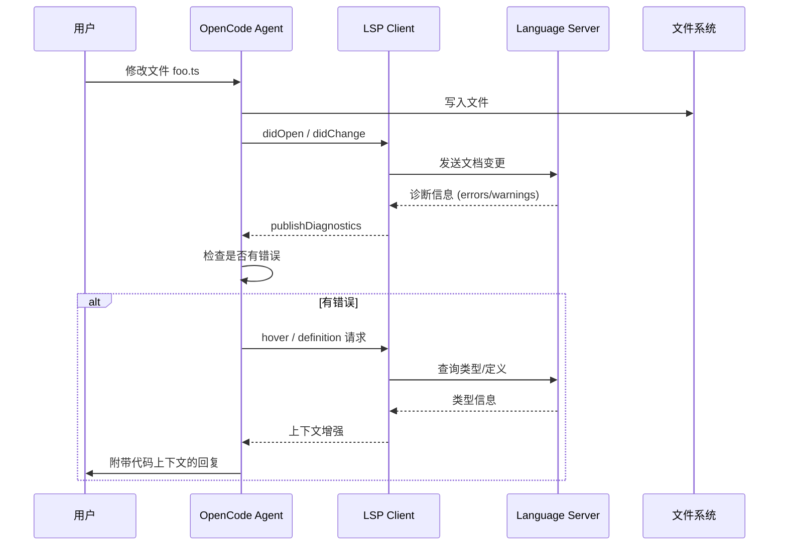

<ChapterLearningGuide />

<script setup>
import SourceSnapshotCard from '../../.vitepress/theme/components/SourceSnapshotCard.vue'
</script>

> **对应路径**：`packages/opencode/src/lsp/`、`packages/opencode/src/tool/edit.ts`
> **前置阅读**：第4章 工具系统、第3章 项目介绍
> **学习目标**：理解 LSP 客户端的懒加载状态机、诊断信息如何注入工具返回值，以及 AI 如何借助 LSP 实现"编译-修复"内循环

---

## 本章导读

### 这一章解决什么问题

这一章要回答的是：

- LSP 给 AI 带来了什么额外能力（诊断 + 代码导航）
- `getClients()` 的 6 步状态机如何防止 LSP 服务器被重复启动
- 诊断信息如何"悄悄地"附加到工具返回值，让 AI 看到类型错误
- `LspTool` 的 9 种操作各自适合什么场景

### 必看入口

- [packages/opencode/src/lsp/index.ts](https://github.com/anomalyco/opencode/blob/dev/packages/opencode/src/lsp/index.ts)：LSP 状态管理与 `getClients()` 状态机
- [packages/opencode/src/lsp/client.ts](https://github.com/anomalyco/opencode/blob/dev/packages/opencode/src/lsp/client.ts)：JSON-RPC 连接、`waitForDiagnostics` 防抖
- [packages/opencode/src/tool/edit.ts](https://github.com/anomalyco/opencode/blob/dev/packages/opencode/src/tool/edit.ts)：诊断注入到工具返回值的实现

### 先抓一条主链路

```text
AI 调用 edit 工具修改 foo.ts
  -> 文件写入磁盘
  -> LSP.touchFile("foo.ts", waitForDiagnostics=true)
  -> getClients("foo.ts") -> 找到/启动 tsserver
  -> textDocument/didChange -> tsserver 分析
  -> publishDiagnostics -> 150ms 防抖后 resolve
  -> edit 工具把 ERROR 列表附加到返回值
  -> AI 读到错误 -> 再次调用 edit 修复
```

### 初学者阅读顺序

1. 先读 `lsp/index.ts` 的 `getClients()` 函数，理解 6 步状态机。
2. 再读 `lsp/client.ts`，追踪 `notify.open()` → `publishDiagnostics` → `waitForDiagnostics` 的流程。
3. 最后读 `tool/edit.ts` 找到 `LSP.touchFile()` 调用，理解诊断如何进入工具返回值。

### 最容易误解的点

- LSP 服务器是**按需懒加载**的，不是 OpenCode 启动时就全部启动。
- `waitForDiagnostics` 的 150ms 防抖是为了等待 TypeScript 的两轮诊断（语法+语义）合并。
- `LspTool` 和"诊断隐式注入"是两套不同机制：前者是 AI 主动调用，后者是工具自动附加。

## 12.1 AI 为什么需要 LSP？

语言服务器协议（Language Server Protocol，LSP）是微软在 VS Code 中提出的标准，让编辑器和语言服务器解耦：编辑器负责 UI，语言服务器负责理解代码。

对 AI Coding Agent 来说，LSP 带来了两个关键能力：

**1. 即时诊断反馈**：AI 修改文件后，LSP 服务器会异步发送诊断结果（类型错误、语法错误、lint 警告）。如果错误会被直接注入到工具的返回值里，AI 可以在同一轮对话中立刻修复，而不是等用户手动运行编译器发现问题。

**2. 精确的代码导航**：AI 需要理解"这个函数在哪里定义"、"哪些地方调用了这个方法"、"这个接口有哪些实现"。LSP 提供的 `goToDefinition`、`findReferences`、`goToImplementation` 等操作，比文本搜索更精确，不会被字符串巧合误导。



<LspHover />

## 12.2 LSP 子系统的整体架构

```
packages/opencode/src/lsp/
├── index.ts      # 主命名空间：管理服务器和客户端的生命周期
├── server.ts     # 内置 LSP 服务器定义（如何启动 tsserver、gopls 等）
├── client.ts     # LSP 客户端：JSON-RPC 连接封装
└── language.ts   # 文件扩展名 → 语言 ID 映射表（80+ 种语言）
```

这四个文件共同构成了一个懒加载、按需启动的 LSP 客户端管理层。关键设计是：**LSP 服务器只在需要时才启动**，不是在 OpenCode 启动时一次性启动所有服务器。

## 12.3 LSP 状态：每个项目实例独立

`lsp/index.ts` 的状态绑定到项目实例（Instance），这意味着不同工作目录有独立的 LSP 客户端池：

```typescript
const state = Instance.state(
  async () => {
    const servers: Record<string, LSPServer.Info> = {}
    const cfg = await Config.get()

    // 全局禁用
    if (cfg.lsp === false) {
      return { broken: new Set(), servers: {}, clients: [], spawning: new Map() }
    }

    // 加载内置服务器定义
    for (const server of Object.values(LSPServer)) {
      servers[server.id] = server
    }

    // 实验性标志：Python 可选 ty（Rust 实现）而非 pyright
    filterExperimentalServers(servers)

    // 合并用户自定义服务器配置
    for (const [name, item] of Object.entries(cfg.lsp ?? {})) {
      if (item.disabled) { delete servers[name]; continue }
      servers[name] = {
        id: name,
        extensions: item.extensions ?? [],
        spawn: async (root) => ({
          process: spawn(item.command[0], item.command.slice(1), {
            cwd: root, env: { ...process.env, ...item.env },
          }),
          initialization: item.initialization,
        }),
      }
    }

    return {
      broken: new Set<string>(),   // 启动失败的服务器，不再重试
      servers,                      // 可用服务器定义表
      clients: [],                  // 已连接的客户端列表
      spawning: new Map(),          // 正在启动中的任务（防止重复启动）
    }
  },
  async (state) => {
    // 项目实例销毁时关闭所有 LSP 连接
    await Promise.all(state.clients.map((c) => c.shutdown()))
  },
)
```

四个状态字段各有职责：

| 字段 | 类型 | 作用 |
|------|------|------|
| `servers` | `Record<string, LSPServer.Info>` | 服务器配置表（不代表已启动） |
| `clients` | `LSPClient.Info[]` | 已成功连接的客户端 |
| `broken` | `Set<string>` | 启动失败的 `root+serverID` 键，避免无限重试 |
| `spawning` | `Map<string, Promise<...>>` | 正在启动的任务，防止并发请求导致重复启动 |

## 12.4 懒加载客户端：getClients 的状态机

先记住这条主链：AI 改完文件后，不是直接”自动修复”，而是先通过 `touchFile` 和 `getClients` 把对应语言服务器拉起来，再由 `didChange` 触发诊断。

每当工具需要对某个文件执行 LSP 操作，都会调用 `getClients(file)`：

```typescript
async function getClients(file: string) {
  const s = await state()
  const extension = path.parse(file).ext || file  // 如 ".ts"
  const result: LSPClient.Info[] = []

  for (const server of Object.values(s.servers)) {
    // 1. 扩展名过滤：服务器不处理该文件类型则跳过
    if (server.extensions.length && !server.extensions.includes(extension)) continue

    // 2. 找根目录（如 tsconfig.json 所在的最近目录）
    const root = await server.root(file)
    if (!root) continue  // 找不到根目录（该文件可能不在受管理的项目中）

    // 3. 跳过已知失败的服务器
    const key = root + server.id
    if (s.broken.has(key)) continue

    // 4. 复用已有客户端
    const match = s.clients.find((x) => x.root === root && x.serverID === server.id)
    if (match) { result.push(match); continue }

    // 5. 等待正在启动的任务（避免重复启动）
    const inflight = s.spawning.get(key)
    if (inflight) {
      const client = await inflight
      if (client) result.push(client)
      continue
    }

    // 6. 启动新客户端
    const task = schedule(server, root, key)
    s.spawning.set(key, task)
    task.finally(() => {
      if (s.spawning.get(key) === task) s.spawning.delete(key)
    })
    const client = await task
    if (client) result.push(client)
  }

  return result
}
```

这是一个 6 步状态机：过滤 → 找根 → 检查失败 → 复用 → 等待中 → 新建。`spawning` Map 的作用是防止"两个并发请求都判断客户端不存在，然后各自启动一个"的竞态。

## 12.5 LSP 客户端：JSON-RPC over stdio

LSP 服务器通过子进程运行，客户端通过标准输入输出通信。这是所有 LSP 工具的统一架构：

```
OpenCode 进程
  ├── spawn("typescript-language-server", ["--stdio"])
  │     stdin  ← JSON-RPC 请求/通知
  │     stdout → JSON-RPC 响应/推送
  └── LSPClient（vscode-jsonrpc 封装）
```

客户端初始化过程（`client.ts`）：

```typescript
const connection = createMessageConnection(
  new StreamMessageReader(server.process.stdout),
  new StreamMessageWriter(server.process.stdin),
)

// 注册服务器推送的处理器
connection.onNotification("textDocument/publishDiagnostics", (params) => {
  // 接收并缓存诊断信息
  diagnostics.set(filePath, params.diagnostics)
  Bus.publish(Event.Diagnostics, { path: filePath, serverID })
})
connection.onRequest("workspace/configuration", async () => [initialization ?? {}])
connection.onRequest("workspace/workspaceFolders", async () => [{ name: "workspace", uri: rootUri }])

connection.listen()

// LSP 握手：initialize → initialized → didChangeConfiguration
await connection.sendRequest("initialize", {
  rootUri: pathToFileURL(root).href,
  capabilities: {
    textDocument: {
      synchronization: { didOpen: true, didChange: true },
      publishDiagnostics: { versionSupport: true },
    },
  },
})
await connection.sendNotification("initialized", {})
```

`initialize` 请求要声明客户端支持哪些能力，服务器据此决定发哪些通知。`versionSupport: true` 表示客户端理解文档版本号，这对增量同步至关重要。

## 12.6 文件版本追踪：didOpen vs didChange

LSP 规范要求客户端追踪每个文件的版本，客户端的 `notify.open()` 方法统一处理"首次打开"和"后续更新"两种场景：

```typescript
const files: { [path: string]: number } = {}  // 文件版本记录

notify: {
  async open(input: { path: string }) {
    const text = await Filesystem.readText(input.path)
    const languageId = LANGUAGE_EXTENSIONS[extension] ?? "plaintext"
    const version = files[input.path]

    if (version !== undefined) {
      // 文件已打开过：发送 didChange（内容完整替换）
      const next = version + 1
      files[input.path] = next
      await connection.sendNotification("textDocument/didChange", {
        textDocument: { uri, version: next },
        contentChanges: [{ text }],  // 完整文件内容
      })
      return
    }

    // 第一次打开：清空旧诊断，发送 didOpen
    diagnostics.delete(input.path)
    await connection.sendNotification("textDocument/didOpen", {
      textDocument: { uri, languageId, version: 0, text },
    })
    files[input.path] = 0
  },
}
```

每次文件被修改后，OpenCode 都会调用 `LSP.touchFile(file)` → `client.notify.open(file)`，把最新内容完整推送给 LSP 服务器，触发重新分析。

## 12.7 等待诊断：防抖与超时

诊断分析是异步的，工具需要等待 LSP 服务器完成分析再读取结果。`waitForDiagnostics` 实现了带防抖的等待：

```typescript
const DIAGNOSTICS_DEBOUNCE_MS = 150

async waitForDiagnostics(input: { path: string }) {
  let debounceTimer: ReturnType<typeof setTimeout> | undefined

  return await withTimeout(
    new Promise<void>((resolve) => {
      const unsub = Bus.subscribe(Event.Diagnostics, (event) => {
        if (event.properties.path !== normalizedPath) return
        if (event.properties.serverID !== result.serverID) return

        // 防抖：等待 150ms 内不再有新诊断
        if (debounceTimer) clearTimeout(debounceTimer)
        debounceTimer = setTimeout(() => {
          unsub()
          resolve()
        }, DIAGNOSTICS_DEBOUNCE_MS)
      })
    }),
    3000,  // 最多等 3 秒
  ).catch(() => {})  // 超时不抛异常，只是没有诊断
}
```

防抖的原因：LSP 服务器通常分两轮发送诊断——第一轮是语法错误（快，几十毫秒），第二轮是语义错误（慢，需要类型推断）。如果只等第一轮，就会漏掉类型错误。150ms 的防抖窗口让两轮之间的间隔被合并。

还有一个 TypeScript 特殊处理：

```typescript
connection.onNotification("textDocument/publishDiagnostics", (params) => {
  const exists = diagnostics.has(filePath)
  diagnostics.set(filePath, params.diagnostics)
  if (!exists && input.serverID === "typescript") return  // 忽略 TypeScript 第一次推送
  Bus.publish(Event.Diagnostics, { path: filePath, serverID: input.serverID })
})
```

`tsserver` 的第一次 `publishDiagnostics` 通常是空的（还没完成分析），忽略它可以避免 `waitForDiagnostics` 在看到空结果后就提前返回。

## 12.8 诊断注入：工具与 LSP 的协作流水线

这是 LSP 与 AI 工具系统集成的核心机制。以 `edit` 工具为例：

```typescript
// tool/edit.ts
let output = "Edit applied successfully."
await LSP.touchFile(filePath, true)  // 通知 LSP 文件已变更，等待诊断
const diagnostics = await LSP.diagnostics()
const issues = diagnostics[normalizedFilePath] ?? []
const errors = issues.filter((item) => item.severity === 1)  // severity=1 是 ERROR

if (errors.length > 0) {
  const limited = errors.slice(0, MAX_DIAGNOSTICS_PER_FILE)
  output += `\n\nLSP errors detected in this file, please fix:\n` +
    `<diagnostics file="${filePath}">\n` +
    `${limited.map(LSP.Diagnostic.pretty).join("\n")}\n` +
    `</diagnostics>`
}
```

`LSP.Diagnostic.pretty()` 把诊断格式化为人类可读的字符串：

```typescript
export function pretty(diagnostic: LSPClient.Diagnostic) {
  const severityMap = { 1: "ERROR", 2: "WARN", 3: "INFO", 4: "HINT" }
  const severity = severityMap[diagnostic.severity || 1]
  const line = diagnostic.range.start.line + 1      // 0-based → 1-based
  const col = diagnostic.range.start.character + 1
  return `${severity} [${line}:${col}] ${diagnostic.message}`
}
// 输出示例：ERROR [42:5] Type 'string' is not assignable to type 'number'.
```

**完整流水线**：

```
用户要求：修改 foo.ts 的某个函数

[工具: edit]
  1. 定位修改位置，应用文本替换
  2. LSP.touchFile("foo.ts", waitForDiagnostics=true)
     → textDocument/didChange 发送给 tsserver
     → 等待 publishDiagnostics（防抖 150ms，最多 3s）
  3. LSP.diagnostics() → 读取所有客户端的诊断缓存
  4. 过滤 severity=1（ERROR）
  5. 格式化并附加到工具输出：
     "Edit applied successfully.

      LSP errors detected in this file, please fix:
      <diagnostics file="foo.ts">
      ERROR [15:3] Property 'bar' does not exist on type 'Foo'.
      </diagnostics>"

[AI 看到工具返回值]
  → 发现有 LSP 错误
  → 自动再次调用 edit 工具修复
  → 循环直到没有错误
```

这个机制让 AI 具备了"编译-修复"的内循环能力，大量减少了"修改后才发现有错误"的往返次数。

`read.ts` 也调用 `LSP.touchFile`，但不等待诊断：

```typescript
// tool/read.ts（读取文件时）
LSP.touchFile(filepath, false)  // 预热：通知 LSP 文件被打开，但不阻塞工具返回
```

这是一个优化：提前让 LSP 开始分析，等到后续 edit 操作真正需要诊断时，结果已经准备好了。

## 12.9 LspTool：给 AI 的直接 LSP 接口

除了隐式注入，OpenCode 还提供了一个显式的 `lsp` 工具，让 AI 可以主动查询代码信息：

```typescript
export const LspTool = Tool.define("lsp", {
  description: DESCRIPTION,  // 从 lsp.txt 加载（详细描述每个操作）
  parameters: z.object({
    operation: z.enum([
      "goToDefinition",       // 跳转到定义
      "findReferences",       // 查找所有引用
      "hover",                // 悬停信息（类型、文档）
      "documentSymbol",       // 文件内的符号列表
      "workspaceSymbol",      // 工作区全局符号搜索
      "goToImplementation",   // 跳转到接口实现
      "prepareCallHierarchy", // 准备调用层次分析
      "incomingCalls",        // 谁调用了这个函数
      "outgoingCalls",        // 这个函数调用了谁
    ]),
    filePath: z.string(),
    line: z.number().int().min(1),      // 1-based（用户视角）
    character: z.number().int().min(1), // 1-based（用户视角）
  }),
  execute: async (args, ctx) => {
    // 权限检查
    await ctx.ask({ permission: "lsp", patterns: ["*"], always: ["*"], metadata: {} })

    // 先确保 LSP 客户端可用
    const available = await LSP.hasClients(file)
    if (!available) throw new Error("No LSP server available for this file type.")

    // 预热并等待诊断
    await LSP.touchFile(file, true)

    // 执行操作（line/character 转换为 0-based）
    const position = { file, line: args.line - 1, character: args.character - 1 }
    const result = await (() => {
      switch (args.operation) {
        case "goToDefinition":    return LSP.definition(position)
        case "findReferences":    return LSP.references(position)
        case "hover":             return LSP.hover(position)
        case "documentSymbol":    return LSP.documentSymbol(uri)
        case "workspaceSymbol":   return LSP.workspaceSymbol("")
        case "goToImplementation":return LSP.implementation(position)
        case "incomingCalls":     return LSP.incomingCalls(position)
        case "outgoingCalls":     return LSP.outgoingCalls(position)
      }
    })()

    return { title, metadata: { result }, output: JSON.stringify(result, null, 2) }
  },
})
```

值得注意的坐标转换：LSP 协议使用 0-based 行列号，但工具参数接受 1-based（与编辑器显示一致），内部使用 `args.line - 1` 转换。

## 12.10 内置 LSP 服务器配置

`server.ts` 定义了 OpenCode 内置支持的语言服务器。每个服务器有三个关键属性：

```typescript
interface LSPServer.Info {
  id: string
  extensions: string[]                  // 处理的文件扩展名
  root: (file: string) => Promise<string | undefined>  // 如何确定根目录
  spawn: (root: string) => Promise<Handle | undefined> // 如何启动进程
}
```

根目录策略（`NearestRoot`）：从文件所在目录向上查找特定配置文件：

- TypeScript：查找 `tsconfig.json`、`package.json`
- Python（pyright）：查找 `pyrightconfig.json`、`pyproject.toml`、`setup.py`
- Go：查找 `go.mod`
- Rust：查找 `Cargo.toml`

找不到根配置文件时，LSP 客户端不会启动（该文件可能不在受管理的项目中）。

## 12.11 语言映射表：language.ts

`language.ts` 维护了 80+ 种文件扩展名到 LSP 语言 ID 的映射，直接照搬 VS Code 的命名规范：

```typescript
export const LANGUAGE_EXTENSIONS = {
  ".ts": "typescript",
  ".tsx": "typescriptreact",
  ".py": "python",
  ".go": "go",
  ".rs": "rust",
  ".java": "java",
  // ...80+ 更多
}
```

这个映射在 `notify.open` 中用于设置 `textDocument/didOpen` 的 `languageId` 字段，告诉 LSP 服务器如何解析该文件。

## 12.12 从诊断到修复：完整循环

把所有模块串起来，一次 AI 代码修改的完整 LSP 流程：

```
AI 决定修改文件 → edit 工具执行
  ↓
Filesystem.writeFile(content)
  ↓
LSP.touchFile(file, waitForDiagnostics=true)
  ↓
getClients(file)
  ↓ （如果客户端未启动）
server.spawn(root) → 子进程 "typescript-language-server --stdio"
  ↓
LSPClient.create() → initialize握手
  ↓
client.notify.open(file) → textDocument/didOpen/didChange
  ↓
tsserver 分析文件
  ↓
textDocument/publishDiagnostics → client 缓存诊断
  ↓ （150ms 防抖后）
waitForDiagnostics resolve
  ↓
LSP.diagnostics() → 读取缓存
  ↓
过滤 severity=1 错误
  ↓
格式化为 <diagnostics> XML 块
  ↓
附加到 edit 工具返回值
  ↓
AI 收到工具结果，看到类型错误 → 再次调用 edit 修复
```

## 本章小结

### 关键代码位置

| 模块 | 位置 | 建议关注点 |
| --- | --- | --- |
| LSP 状态机 | `packages/opencode/src/lsp/index.ts` | `getClients()`、`state` 懒加载、`broken` 集合 |
| LSP 客户端 | `packages/opencode/src/lsp/client.ts` | JSON-RPC 初始化、`waitForDiagnostics` 防抖 |
| 服务器配置 | `packages/opencode/src/lsp/server.ts` | 内置服务器列表、`NearestRoot` 策略 |
| 语言映射 | `packages/opencode/src/lsp/language.ts` | 80+ 文件扩展名到 languageId 的映射 |
| 诊断注入 | `packages/opencode/src/tool/edit.ts` | `LSP.touchFile()`、诊断格式化 |
| LSP 工具 | `packages/opencode/src/tool/lsp.ts` | `LspTool` 的 9 种操作 |

### 源码阅读路径

1. 先读 `lsp/index.ts` 的 `getClients()`，对照 `spawning` Map 理解并发防重复逻辑。
2. 再读 `lsp/client.ts` 的 `notify.open()` 和 `waitForDiagnostics`，理解两轮诊断的防抖。
3. 最后在 `tool/edit.ts` 里找到诊断注入代码，把整条"修改→诊断→修复"链路串联起来。

**思考题**：

1. `waitForDiagnostics` 使用 150ms 防抖而不是"等待第二次 publishDiagnostics"。这两种方式各有什么优缺点？如果 LSP 服务器分三轮发送诊断，150ms 防抖还能正确工作吗？

2. TypeScript 服务器的第一次 `publishDiagnostics` 被跳过（不触发 Bus 事件）。如果第一次推送不是空的而是真正的错误，这会导致什么问题？

3. `LspTool` 的 `workspaceSymbol` 操作总是传入空字符串 `""` 作为查询词。LSP 规范中空字符串通常返回所有符号，这会返回太多结果吗？OpenCode 如何在工具描述中引导 AI 正确使用这个操作？

## 下一章预告

第13章：**插件与扩展** — 深入 `packages/opencode/src/skill/`、`packages/opencode/src/agent/`，学习：Skill 系统如何让 AI 拥有可复用的专项能力、Agent 模式如何切换任务风格、CLAUDE.md 如何作为项目级上下文注入提示词，以及如何通过配置扩展 OpenCode 的行为。

---

## 常见误区

### 误区1：LSP 集成让 OpenCode 能直接"理解"代码的语义，比 LLM 更准确

**错误理解**：因为集成了 LSP，OpenCode 能像 IDE 一样真正理解代码语义（类型、作用域、调用图），这比 LLM 的"猜"更可靠。

**实际情况**：OpenCode 的 LSP 集成主要用途是两个：一是把诊断信息（类型错误、未定义变量）注入到 LLM 上下文，让 LLM 知道修改后有没有错误；二是作为可选工具（`LspTool`）让 LLM 主动查询符号定义和引用。LSP 不是代替 LLM 做语义理解，而是给 LLM 提供更精确的反馈信息。

### 误区2：LSP 客户端会为每个文件启动一个语言服务器进程

**错误理解**：打开多少个 TypeScript 文件，就会启动多少个 `tsserver` 进程，开销很大。

**实际情况**：OpenCode 按**工作区根目录**（`NearestRoot` 策略）共享 LSP 客户端——同一个项目目录下所有文件共享一个语言服务器实例。`spawning` Map 记录正在启动的实例，防止并发初始化时创建多个相同客户端。实际上一个 TypeScript 项目只有一个 `tsserver` 进程。

### 误区3：诊断信息实时推送，AI 修改文件后立即能看到错误

**错误理解**：`edit` 工具写入文件后，LSP 会立即推送诊断，AI 在同一次工具调用里就能看到错误。

**实际情况**：诊断有延迟。`touchFile()` 触发文件打开/更改通知后，`waitForDiagnostics()` 用 150ms 防抖等待 LSP 服务器发送诊断。TypeScript 服务器通常分两轮推送（第一轮空的/快速语法检查，第二轮完整语义检查）。`edit.ts` 的实现跳过了第一轮，等待第二轮完整诊断，这意味着有约 300ms-500ms 的延迟，但诊断结果更准确。

### 误区4：LSP 工具（`LspTool`）是稳定功能，应该默认开启

**错误理解**：既然 OpenCode 已经集成了 LSP，`LspTool` 应该默认对所有用户可用，不需要 Feature Flag。

**实际情况**：`LspTool` 目前是**实验性功能**，需要设置 `OPENCODE_EXPERIMENTAL_LSP_TOOL=true` 才能启用。原因是 LSP 查询结果（符号定义、引用列表）可能很大，不恰当地注入到上下文会消耗大量 token；同时并非所有语言都有质量稳定的 LSP 服务器。实验性标记是审慎的工程决策，等待更多真实场景验证后才会默认开启。

### 误区5：LSP 诊断注入会让 AI 陷入"修了又错，错了又修"的死循环

**错误理解**：如果 AI 修复了一个错误但引入了新错误，LSP 又把新错误反馈给 AI，AI 又修复，如此循环……

**实际情况**：这种情况理论上存在，但实践中有两个制衡机制：首先是 `processor.ts` 的死循环检测（连续相同工具调用超过阈值触发保护）；其次是 LLM 通常能判断修改是否在合理范围内，不会无限制地追逐诊断错误。如果 LLM 发现修复某个错误会引入更严重的问题，它会停止尝试并告知用户。

---

<SourceSnapshotCard
  title="第12章源码快照"
  description="这一章的核心是诊断注入机制：AI 修改文件后，LSP 诊断如何在同一轮对话中自动附加到工具返回值，让 AI 立刻看到并修复类型错误。"
  repo="anomalyco/opencode"
  repo-url="https://github.com/anomalyco/opencode/tree/f8475649da1cd7a6d49f8f30ee2fad374c2f4fcc"
  branch="dev"
  commit="f8475649da1cd7a6d49f8f30ee2fad374c2f4fcc"
  verified-at="2026-03-15"
  :entries="[
    {
      label: 'LSP 主命名空间',
      path: 'packages/opencode/src/lsp/index.ts',
      href: 'https://github.com/anomalyco/opencode/blob/f8475649da1cd7a6d49f8f30ee2fad374c2f4fcc/packages/opencode/src/lsp/index.ts'
    },
    {
      label: 'LSP 客户端（JSON-RPC）',
      path: 'packages/opencode/src/lsp/client.ts',
      href: 'https://github.com/anomalyco/opencode/blob/f8475649da1cd7a6d49f8f30ee2fad374c2f4fcc/packages/opencode/src/lsp/client.ts'
    },
    {
      label: '内置服务器配置',
      path: 'packages/opencode/src/lsp/server.ts',
      href: 'https://github.com/anomalyco/opencode/blob/f8475649da1cd7a6d49f8f30ee2fad374c2f4fcc/packages/opencode/src/lsp/server.ts'
    },
    {
      label: '诊断注入（edit 工具）',
      path: 'packages/opencode/src/tool/edit.ts',
      href: 'https://github.com/anomalyco/opencode/blob/f8475649da1cd7a6d49f8f30ee2fad374c2f4fcc/packages/opencode/src/tool/edit.ts'
    }
  ]"
/>


<StarCTA />
