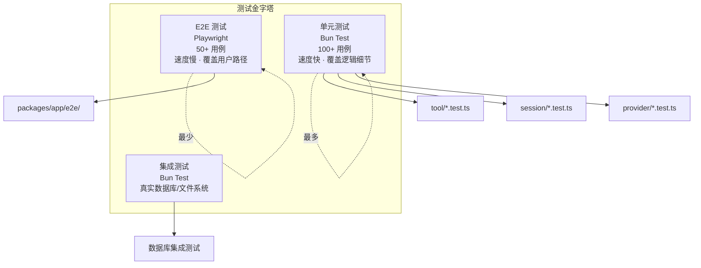

<ChapterLearningGuide />

<script setup>
import SourceSnapshotCard from '../../.vitepress/theme/components/SourceSnapshotCard.vue'
</script>

> **对应路径**：`packages/opencode/test/`、`packages/app/src/`、`packages/app/e2e/`
> **前置阅读**：第三篇 工具系统、第八篇 HTTP API 服务器、第十篇 多端 UI 开发
> **学习目标**：理解 OpenCode 的质量保障不是“写几条单元测试”，而是把核心运行时、前端状态层和真实用户流程拆成不同测试面，再用类型检查和脚本约束收口

---



## 核心概念速览

当前仓库的测试体系可以先分成三层来看：

1. `packages/opencode/test/`：核心运行时、工具、会话、权限、MCP、控制平面等后端测试
2. `packages/app/src/**/*.test.ts(x)`：共享前端应用层的单元测试
3. `packages/app/e2e/`：基于真实浏览器和真实 backend 的端到端测试

除此之外，还有两个稳定性门槛：

- 包级 `typecheck`
- 包级测试脚本和预加载环境

这说明 OpenCode 的质量保障思路不是“把所有测试都塞进一个目录”，而是：

**按系统边界拆测试面，让每一层都只解决自己最擅长验证的问题。**

最值得先看的入口有五个：

- [packages/opencode/package.json](https://github.com/anomalyco/opencode/blob/dev/packages/opencode/package.json)
- [packages/opencode/test/fixture/fixture.ts](https://github.com/anomalyco/opencode/blob/dev/packages/opencode/test/fixture/fixture.ts)
- [packages/app/package.json](https://github.com/anomalyco/opencode/blob/dev/packages/app/package.json)
- [packages/app/happydom.ts](https://github.com/anomalyco/opencode/blob/dev/packages/app/happydom.ts)
- [packages/app/e2e/fixtures.ts](https://github.com/anomalyco/opencode/blob/dev/packages/app/e2e/fixtures.ts)

---

## 本章导读

### 这一章解决什么问题

这一章要回答的是：

- OpenCode 当前把测试面分成了哪些层次
- 为什么核心运行时测试、前端单测、E2E 不能混成一锅
- 类型检查、脚本约束和测试夹具在质量保障里各自做什么
- 一个真实 Agent 项目怎样在不依赖大量 mock 的情况下做验证

### 必看入口

- [packages/opencode/package.json](https://github.com/anomalyco/opencode/blob/dev/packages/opencode/package.json)：核心运行时测试脚本
- [packages/opencode/test/fixture/fixture.ts](https://github.com/anomalyco/opencode/blob/dev/packages/opencode/test/fixture/fixture.ts)：测试夹具入口
- [packages/app/package.json](https://github.com/anomalyco/opencode/blob/dev/packages/app/package.json)：前端测试与构建脚本
- [packages/app/happydom.ts](https://github.com/anomalyco/opencode/blob/dev/packages/app/happydom.ts)：前端单测环境
- [packages/app/e2e/fixtures.ts](https://github.com/anomalyco/opencode/blob/dev/packages/app/e2e/fixtures.ts)：端到端测试夹具

### 先抓一条主链路

建议先看这条线：

```text
packages/opencode/test 验证核心运行时
  -> fixture.ts 提供真实测试环境
  -> packages/app/src/*.test.ts(x) 验证共享前端状态层
  -> packages/app/e2e 验证真实用户流程
  -> typecheck / 脚本约束作为最后收口
```

先理解“测试面是怎么按系统边界拆开的”，再去看每一层具体测什么。

### 初学者阅读顺序

1. 先读 `packages/opencode/package.json` 和 `packages/opencode/test/fixture/fixture.ts`，看核心运行时测试怎么起环境。
2. 再读 `packages/app/package.json`、`happydom.ts`，理解前端单测的边界。
3. 最后读 `packages/app/e2e/fixtures.ts` 和若干真实 spec，理解 E2E 为什么强调端到端流程而不是重复单测。

### 最容易误解的点

- E2E 不是“最高级所以替代全部测试”，它只是验证真实用户路径的一层。
- 质量保障不只靠测试文件，还依赖类型检查、脚本约束和统一夹具。
- 真实 Agent 项目最难测的往往是时序、资源隔离和恢复路径，不只是函数返回值。

## 15.1 核心运行时测试：`packages/opencode/test/`

### 先看范围，它远不只是几个工具测试

当前 [packages/opencode/test](https://github.com/anomalyco/opencode/blob/dev/packages/opencode/test) 下的测试面非常广，至少可以看到这些方向：

- `agent/`
- `auth/`
- `cli/`
- `control-plane/`
- `file/`
- `installation/`
- `mcp/`
- `memory/`
- `permission/`
- `plugin/`
- `project/`
- `provider/`
- `pty/`
- `question/`
- `server/`
- `session/`
- `share/`
- `skill/`
- `storage/`
- `tool/`
- `util/`

这说明 OpenCode 当前并不是只测几个 happy path，而是把大量基础设施边界都纳入了回归测试。

### 这里测的重点是行为和边界，而不是 UI 呈现

从现有文件名就能看出来，这层测试主要关注的是：

- 工具行为是否符合预期
- 权限匹配是否正确
- provider 请求转换是否正确
- session 事件、压缩、重试、revert 是否工作
- 路径遍历、外部目录、锁、超时等边界有没有破
- 控制平面的 SSE 和转发逻辑是否正常

这类测试天然适合放在 `packages/opencode`，因为它们验证的是 Agent 运行时协议，而不是界面呈现。

### 统一的临时目录 fixture 很关键

[packages/opencode/test/fixture/fixture.ts](https://github.com/anomalyco/opencode/blob/dev/packages/opencode/test/fixture/fixture.ts) 提供了 `tmpdir()` 这类共享测试能力。

它会负责：

- 创建临时目录
- 可选初始化 Git 仓库
- 可选写测试配置
- 自动清理目录
- 关闭可能残留的 `git fsmonitor`

这类 fixture 的价值很直接，因为 OpenCode 很多能力都依赖真实文件系统和真实工作目录。  
如果没有统一夹具，测试要么会非常脆弱，要么会被迫大量 mock。

### `bun test` 是这里的主运行器

[packages/opencode/package.json](https://github.com/anomalyco/opencode/blob/dev/packages/opencode/package.json) 当前直接提供：

- `bun test --timeout 30000`

这说明核心运行时测试基本都建立在 Bun 原生测试框架之上。  
对这类偏基础设施的代码来说，这个选择很自然：

- 启动快
- 文件系统和进程能力近
- 不需要额外测试运行时

---

## 15.2 前端单元测试：`packages/app/src/**/*.test.ts(x)`

### 这一层经常被忽略，但现在已经很厚

很多人看到 OpenCode 有 Playwright，就会以为前端质量主要靠 E2E。  
但当前 [packages/app/src](https://github.com/anomalyco/opencode/blob/dev/packages/app/src) 下已经有大量单元测试，例如：

- `context/global-sync.test.ts`
- `context/permission-auto-respond.test.ts`
- `context/command-keybind.test.ts`
- `components/file-tree.test.ts`
- `components/prompt-input/*.test.ts`
- `utils/server-health.test.ts`
- `pages/session/terminal-panel.test.ts`

这说明共享前端应用层已经在主动把复杂逻辑下沉到可测试单元，而不是全部留给浏览器集成测试。

### Happy DOM 是当前前端单测运行环境

[packages/app/package.json](https://github.com/anomalyco/opencode/blob/dev/packages/app/package.json) 里的脚本是：

- `bun test --preload ./happydom.ts ./src`

而 [packages/app/happydom.ts](https://github.com/anomalyco/opencode/blob/dev/packages/app/happydom.ts) 会：

- 注册 Happy DOM
- 补齐 Canvas 相关 mock

这套组合说明前端单测当前走的是：

- Bun 做测试运行器
- Happy DOM 提供 DOM 环境
- 少量浏览器能力由预加载脚本兜底

这比“为了测几个函数上完整浏览器”要更轻，也更适合高频跑回归。

### 这一层重点测的是前端状态和交互逻辑

从测试文件分布看，前端单测当前更关注：

- 状态同步
- 输入构建
- 终端面板行为
- 文件树逻辑
- 权限自动响应
- 设置与 keybind 行为
- server health 判断

也就是说，它测的不是“页面像不像设计稿”，而是：

**共享应用层的决策逻辑是否稳定。**

这正是第十篇里 `packages/app` 作为共享应用核心的自然延伸。

---

## 15.3 E2E 测试：验证真实用户流程，而不是替代全部测试

### Playwright 这里测的是“一个完整会话产品到底能不能用”

[packages/app/e2e](https://github.com/anomalyco/opencode/blob/dev/packages/app/e2e) 当前覆盖的场景已经相当丰富：

- `app/`
- `commands/`
- `files/`
- `models/`
- `projects/`
- `prompt/`
- `session/`
- `sidebar/`
- `status/`
- `terminal/`
- `settings/`

这说明 E2E 当前不是只做一个 smoke test，而是在追真实工作流回归。

### `fixtures.ts` 把测试环境准备做成了可复用协议

[packages/app/e2e/fixtures.ts](https://github.com/anomalyco/opencode/blob/dev/packages/app/e2e/fixtures.ts) 当前会统一提供：

- `sdk`
- `gotoSession`
- `withProject`

并在内部处理：

- seed 项目数据
- 预写本地存储
- 创建测试项目
- 跟踪 session
- 清理 session 与目录

这类设计非常值得学，因为它让 E2E 从“脚本式点击录制”变成了“带测试协议的场景搭建”。

### Playwright 配置也很贴近真实工程

[packages/app/playwright.config.ts](https://github.com/anomalyco/opencode/blob/dev/packages/app/playwright.config.ts) 当前明确做了这些事：

- 自动起 Vite dev server
- 通过环境变量指定 opencode backend 地址
- CI 环境自动重试
- 失败保留 trace / screenshot / video
- 生成 HTML report

这说明当前 E2E 目标不是只在本机跑一下，而是能进入持续回归流程。

### 这层测试特别适合覆盖跨模块交互

比如现有 E2E 场景里就有很多单元测试不容易替代的内容：

- 子会话跳转
- 撤销/重做
- 侧边栏 session 导航
- 文件打开流程
- 设置项持久化
- 模型选择
- 状态弹层
- 终端初始化与标签切换

这类场景往往要同时经过：

- UI 交互
- 前端状态层
- HTTP API
- 本地 backend

所以必须留给 E2E。

---

## 15.4 当前仓库更强调回归、时序和资源安全，而不是单独的 benchmark 套件

### 不要把它讲成“有专门性能实验室”

旧式文档很容易写成“这里有一套完整性能基准测试”，但从当前仓库看，更准确的描述是：

**很多测试在验证时序上限、资源泄漏和退避逻辑，而不是独立 benchmark 框架。**

比如现有测试里就能看到：

- `session/retry.test.ts`
- `memory/abort-leak.test.ts`
- `pty/pty-output-isolation.test.ts`
- `control-plane/workspace-sync.test.ts`

这些测试更像“稳定性与资源安全回归”，不是单纯的吞吐量压测。

### 时序类逻辑被明确当成回归对象

像 `retry.test.ts` 这类测试，会直接验证：

- 退避延迟上限
- 超大 timeout 时的保护行为

这很符合 Agent 系统的实际风险点。  
因为这类系统经常要和外部模型、外部网络、长生命周期进程打交道，真正容易出问题的往往是：

- 重试爆炸
- 等待时间异常
- 资源没有被及时释放

### 控制平面和 SSE 也有专门测试

当前 `control-plane/` 下已经有：

- `sse.test.ts`
- `workspace-server-sse.test.ts`
- `session-proxy-middleware.test.ts`
- `workspace-sync.test.ts`

这说明 OpenCode 已经在把“远端 workspace”和“事件同步”当成需要稳定回归的系统边界，而不是实验代码随便跑。

---

## 15.5 质量门槛不只靠测试，还靠脚本和类型系统收口

### `typecheck` 是每个包自己的门槛

当前仓库里至少能看到这些包级脚本：

- [packages/opencode/package.json](https://github.com/anomalyco/opencode/blob/dev/packages/opencode/package.json) 的 `typecheck`
- [packages/app/package.json](https://github.com/anomalyco/opencode/blob/dev/packages/app/package.json) 的 `typecheck`
- [packages/desktop/package.json](https://github.com/anomalyco/opencode/blob/dev/packages/desktop/package.json) 的 `typecheck`
- [packages/ui/package.json](https://github.com/anomalyco/opencode/blob/dev/packages/ui/package.json) 的 `typecheck`

这说明当前质量门槛是“按包收口”，而不是寄希望于仓库根目录一次命令解决一切。

### 测试运行方式也和包职责一致

当前比较核心的脚本可以概括成：

- `packages/opencode`: `bun test`
- `packages/app`: `bun run test:unit`
- `packages/app`: `bun run test:e2e`
- `packages/app`: `bun run test:e2e:local`

这类脚本布局和目录分工是一致的：

- 运行时逻辑在 `opencode`
- 共享前端逻辑在 `app/src`
- 真实交互流在 `app/e2e`

### Desktop 当前更像平台适配层，因此质量主要借共享层回归

`packages/desktop` 当前有 `typecheck`、build 和 Tauri 相关脚本，但没有和 `packages/app/e2e` 对称的一整套桌面自动化测试目录。  
这不是缺陷，而是当前仓库的现实取舍：

- 能在共享应用层测掉的，尽量不要重复测
- 平台差异部分主要靠适配层代码和手工验证补充

如果以后这块继续演进，再补桌面端专项自动化也更自然。

---

## 本章小结

理解 OpenCode 的测试体系，重点不是背多少测试文件，而是看清楚它怎么分层：

1. `packages/opencode/test` 测核心运行时和系统边界
2. `packages/app/src/**/*.test.ts(x)` 测共享前端状态与交互逻辑
3. `packages/app/e2e` 测真实用户流程和跨模块联动

这套结构很适合 Agent 项目，因为 Agent 系统本来就是多层协作：

- 有本地运行时
- 有前端同步层
- 有长链路交互流程

如果你自己做类似项目，也很建议按这种边界拆测试，而不是把所有验证都压给单一测试类型。

### 关键代码位置

| 模块 | 位置 | 建议关注点 |
| --- | --- | --- |
| 运行时测试脚本 | `packages/opencode/package.json` | 包级测试与 typecheck 入口 |
| 核心测试目录 | `packages/opencode/test` | 后端系统边界覆盖范围 |
| 后端夹具 | `packages/opencode/test/fixture/fixture.ts` | 临时工作区、环境搭建 |
| 前端测试脚本 | `packages/app/package.json` | 单测与 E2E 的脚本拆分 |
| 前端测试环境 | `packages/app/happydom.ts` | Happy DOM 与运行环境补丁 |
| 前端单测目录 | `packages/app/src` | 共享状态层与交互逻辑测试 |
| E2E 夹具 | `packages/app/e2e/fixtures.ts` | seed 数据、SDK、清理逻辑 |
| Playwright 配置 | `packages/app/playwright.config.ts` | 服务启动、trace、报告输出 |

### 源码阅读路径

1. 先看 `packages/opencode/test/fixture/fixture.ts`，理解后端测试是怎样搭真实临时工作区的。
2. 再看 `packages/app/happydom.ts` 和几个 `src/**/*.test.ts`，理解前端单测运行环境。
3. 最后读 `packages/app/e2e/fixtures.ts` 与 `playwright.config.ts`，看真实用户流程测试怎样起前端、连 backend、seed 数据。

### 任务

判断 OpenCode 的质量保障为什么必须按“核心运行时 / 前端共享层 / 真实用户流程”分层，而不是把验证压力全部扔给 E2E。

### 操作

1. 打开 `packages/opencode/test/fixture/fixture.ts`，整理后端测试夹具怎样创建真实临时工作区与运行环境。
2. 再读 `packages/app/happydom.ts` 和 `packages/app/e2e/fixtures.ts`，对比前端单测环境与 E2E 场景搭建分别负责什么边界。
3. 最后任选一个功能缺陷，判断它更应该写进 `packages/opencode/test`、`packages/app/src` 还是 `packages/app/e2e`，并给出原因。

### 验收

完成后你应该能说明：

- 为什么 Agent 项目的测试更适合按系统边界分层，而不是全压给浏览器回归。
- 为什么时序、恢复和资源隔离这类问题必须进入回归范围。
- 为什么统一夹具和脚本约束，对长链路系统和单条测试用例同样重要。

### 思考题

1. 为什么 Agent 项目的测试更适合按”运行时 / 前端共享层 / 真实用户流程”分层，而不是全压给 E2E？
2. 哪类问题更适合写进 `packages/opencode/test`，哪类问题更适合写进 `packages/app/e2e`？
3. 对这种长链路系统来说，为什么时序、恢复和资源隔离往往比单个函数正确性更值得回归？

## 下一章预告

下一篇会回到更抽象但也更关键的一层，也就是高级主题和最佳实践。
到那时你会更容易把前面这些架构、工具、UI、存储和测试经验收束成一套可迁移的方法论。

---

## 常见误区

### 误区1：AI Agent 的测试应该主要靠 E2E 测试，因为"真实行为"才有意义

**错误理解**：测试 Agent 最有意义的方式是端到端测试——给一个真实任务，看 Agent 能否完成，中间过程不重要。

**实际情况**：E2E 测试在 Agent 系统里成本极高（需要真实 LLM 调用、真实文件系统操作、时间不稳定），不能作为主要测试手段。OpenCode 的测试分层是：核心运行时（`packages/opencode/test/`）用单元和集成测试覆盖确定性逻辑（工具执行、权限检查、数据库操作）；E2E（`packages/app/e2e/`）只覆盖关键用户流程。大量行为验证在单元层完成。

### 误区2：测试 Agent 时必须用真实的 LLM 调用，否则测试没有意义

**错误理解**：如果 Mock 掉 LLM，测试的就不是真正的 Agent 行为，只是测试了工具函数本身。

**实际情况**：OpenCode 的工具系统、权限系统、数据库操作、消息处理逻辑都是**确定性**的——给定输入，输出固定，完全可以在不调用 LLM 的情况下测试。`packages/opencode/test/fixture/fixture.ts` 创建真实的临时工作区和运行环境，但不需要 LLM。测试 LLM 的行为是模型评估问题（benchmark），不是工程测试问题。

### 误区3：Playwright E2E 测试很脆，Agent 系统的时序不稳定，不值得投入

**错误理解**：因为 Agent 的执行时间不固定（取决于 LLM 响应速度），E2E 测试会频繁因为超时或时序问题失败，维护成本太高。

**实际情况**：OpenCode 的 E2E 测试（`packages/app/e2e/`）有 50+ 个测试用例，通过正确的等待策略（等待特定 UI 状态而不是固定延时）保持稳定。`packages/app/e2e/fixtures.ts` 封装了会话创建、消息发送等操作的等待逻辑，隔离了时序不确定性。关键在于测试设计，而不是放弃 E2E 测试。

### 误区4：单元测试覆盖率越高越好，目标应该是 100%

**错误理解**：Agent 项目也应该追求高测试覆盖率（90%+），每个函数都要有对应的单元测试。

**实际情况**：Agent 项目里有大量"胶水代码"——把 LLM 的输出传给工具、把工具结果加到消息数组里。这类代码覆盖了不代表行为正确，因为行为正确性取决于 LLM 的决策，不是代码逻辑。真正值得测试的是**边界条件**（上下文溢出时是否正确压缩、权限拒绝时是否正确处理）和**副作用**（文件确实被修改、数据库确实被写入），而不是追求行数覆盖率。

### 误区5：测试夹具（Fixture）只是为了减少重复代码，没有架构意义

**错误理解**：`fixture.ts` 只是把重复的 setup 代码提取出来，是代码复用的工具，没有更深的含义。

**实际情况**：`packages/opencode/test/fixture/fixture.ts` 创建**真实的隔离工作区**——每个测试用例有独立的临时目录和数据库实例，互不干扰。这不只是代码复用，而是测试隔离的架构保证。没有正确的资源隔离，并行运行的测试会互相污染状态，导致随机失败。夹具设计反映了"测试也需要遵守单一职责"的工程原则。

---

<SourceSnapshotCard
  title="第15章源码快照"
  description="这一章先抓测试面是怎么按系统边界拆开的：核心运行时、前端状态层和真实用户流程分别由哪套夹具和入口来兜底。"
  repo="anomalyco/opencode"
  repo-url="https://github.com/anomalyco/opencode/tree/f8475649da1cd7a6d49f8f30ee2fad374c2f4fcc"
  branch="dev"
  commit="f8475649da1cd7a6d49f8f30ee2fad374c2f4fcc"
  verified-at="2026-03-15"
  :entries="[
    {
      label: '核心测试夹具',
      path: 'packages/opencode/test/fixture/fixture.ts',
      href: 'https://github.com/anomalyco/opencode/blob/f8475649da1cd7a6d49f8f30ee2fad374c2f4fcc/packages/opencode/test/fixture/fixture.ts'
    },
    {
      label: '核心测试入口',
      path: 'packages/opencode/test/bun.test.ts',
      href: 'https://github.com/anomalyco/opencode/blob/f8475649da1cd7a6d49f8f30ee2fad374c2f4fcc/packages/opencode/test/bun.test.ts'
    },
    {
      label: '前端单测环境',
      path: 'packages/app/happydom.ts',
      href: 'https://github.com/anomalyco/opencode/blob/f8475649da1cd7a6d49f8f30ee2fad374c2f4fcc/packages/app/happydom.ts'
    },
    {
      label: 'E2E 夹具',
      path: 'packages/app/e2e/fixtures.ts',
      href: 'https://github.com/anomalyco/opencode/blob/f8475649da1cd7a6d49f8f30ee2fad374c2f4fcc/packages/app/e2e/fixtures.ts'
    }
  ]"
/>


<StarCTA />
