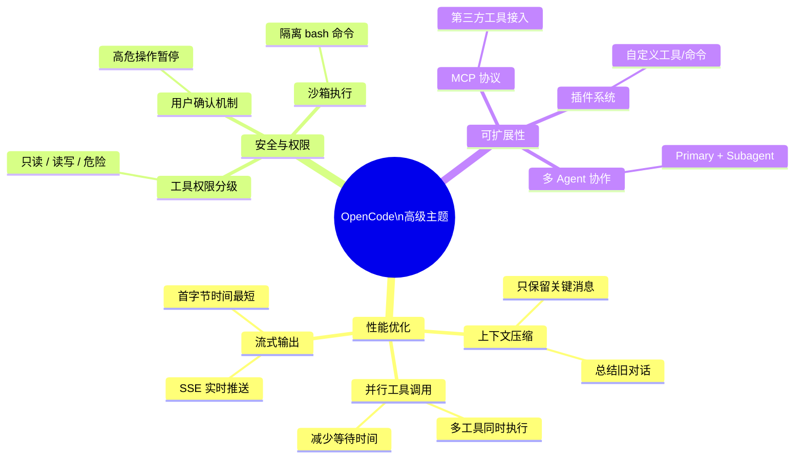
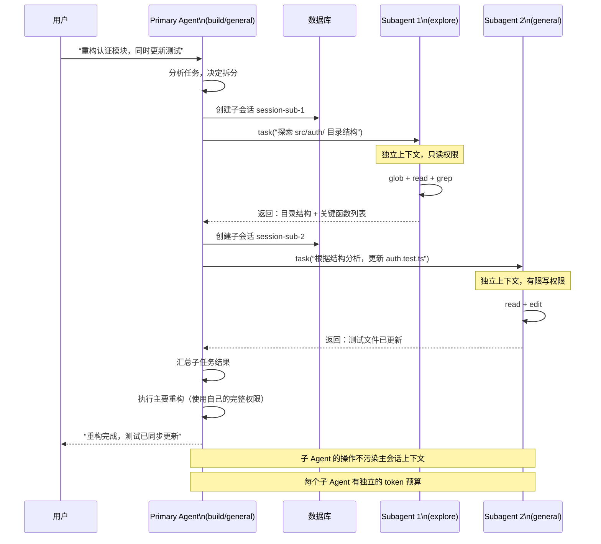

<ChapterLearningGuide />

<script setup>
import SourceSnapshotCard from '../../.vitepress/theme/components/SourceSnapshotCard.vue'
</script>

> **对应路径**：`packages/opencode/src/agent/`、`packages/opencode/src/permission/`、`packages/opencode/src/session/`、`packages/opencode/src/tool/`、`CONTRIBUTING.md`
> **前置阅读**：第二篇 Agent 核心系统、第三篇 工具系统、第四篇 会话管理、第15章 测试与质量保证
> **学习目标**：把前面各篇拆开的实现重新收束起来，理解 OpenCode 当前最值得迁移的五条经验：权限边界、上下文成本控制、多 Agent 协作、可恢复性设计，以及开源协作约束

---



## 核心概念速览

如果前15章是在回答”OpenCode 是怎么做出来的”，最后这一章更想回答：

**从这个仓库里，初学者到底应该带走哪些可以复用到自己项目里的原则。**

当前最值得总结的，不是抽象的 Agent 理论，而是已经被这个仓库反复体现的五条工程实践：

1. 先定义边界，再给能力
2. 上下文和输出都必须预算化
3. 多 Agent 协作要靠权限和角色分工，不靠口头约定
4. 长链路系统必须内建可恢复性
5. 开源项目的演进速度，取决于协作约束是否清晰

这一章会把这些原则重新落回真实代码。

最值得先看的入口有六个：

- [packages/opencode/src/agent/agent.ts](https://github.com/anomalyco/opencode/blob/dev/packages/opencode/src/agent/agent.ts)
- [packages/opencode/src/permission/next.ts](https://github.com/anomalyco/opencode/blob/dev/packages/opencode/src/permission/next.ts)
- [packages/opencode/src/session/compaction.ts](https://github.com/anomalyco/opencode/blob/dev/packages/opencode/src/session/compaction.ts)
- [packages/opencode/src/session/retry.ts](https://github.com/anomalyco/opencode/blob/dev/packages/opencode/src/session/retry.ts)
- [packages/opencode/src/tool/task.ts](https://github.com/anomalyco/opencode/blob/dev/packages/opencode/src/tool/task.ts)
- [CONTRIBUTING.md](https://github.com/anomalyco/opencode/blob/dev/CONTRIBUTING.md)

---

## 本章导读

### 这一章解决什么问题

这一章要回答的是：

- 前面 15 章拆开的实现，最后应提炼出哪些可迁移原则
- 为什么权限、上下文预算、多 Agent 协作、恢复机制和协作约束是同一类工程问题
- OpenCode 里哪些设计最值得初学者带走，而不是只停留在“看懂源码”
- 一个真实 Agent 项目在规模变大后，靠什么维持可控演进

### 必看入口

- [packages/opencode/src/agent/agent.ts](https://github.com/anomalyco/opencode/blob/dev/packages/opencode/src/agent/agent.ts)：角色边界与权限基线
- [packages/opencode/src/permission/next.ts](https://github.com/anomalyco/opencode/blob/dev/packages/opencode/src/permission/next.ts)：权限决策系统
- [packages/opencode/src/session/compaction.ts](https://github.com/anomalyco/opencode/blob/dev/packages/opencode/src/session/compaction.ts)：上下文预算控制
- [packages/opencode/src/session/retry.ts](https://github.com/anomalyco/opencode/blob/dev/packages/opencode/src/session/retry.ts)：失败恢复
- [packages/opencode/src/tool/task.ts](https://github.com/anomalyco/opencode/blob/dev/packages/opencode/src/tool/task.ts)：多 Agent 协作边界
- [CONTRIBUTING.md](https://github.com/anomalyco/opencode/blob/dev/CONTRIBUTING.md)：开源协作约束

### 先抓一条主链路

建议先把这条线看懂：

```text
agent / permission 定义能力边界
  -> session/compaction.ts 控制上下文预算
  -> tool/task.ts 约束多 Agent 协作方式
  -> session/retry.ts / revert.ts 处理失败恢复
  -> CONTRIBUTING.md 把工程约束延伸到协作层
```

这条线先解决“系统如何保持可控”，再去看每条原则的具体实现。

### 初学者阅读顺序

1. 先读 `agent.ts` 和 `permission/next.ts`，理解边界先于能力。
2. 再读 `compaction.ts`、`retry.ts`、`revert.ts`，理解预算控制和恢复路径。
3. 最后读 `tool/task.ts` 和 `CONTRIBUTING.md`，看系统边界如何延伸到多 Agent 协作和团队协作。

### 最容易误解的点

- “最佳实践”不是抽象金句，而是可以回指到具体文件和具体故障模式的工程判断。
- 多 Agent 协作的关键不是更聪明的调度词，而是清楚的角色和权限协议。
- 开源协作约束和运行时边界控制，本质上都在解决“系统如何不失控”。

## 16.1 先定义边界，再给能力

### OpenCode 的安全思路不是“加一个权限弹窗”这么简单

很多初学者做 Agent 时，会先把工具全接上，再试着补安全。OpenCode 当前更接近相反路线：

- 先给 Agent 定默认权限
- 再用规则集覆盖
- 再把高风险场景落到实时询问
- 最后再用额外边界兜底

这一点在 [packages/opencode/src/agent/agent.ts](https://github.com/anomalyco/opencode/blob/dev/packages/opencode/src/agent/agent.ts) 和 [packages/opencode/src/permission/next.ts](https://github.com/anomalyco/opencode/blob/dev/packages/opencode/src/permission/next.ts) 里都很明显。

### 默认权限本身就是产品策略

`agent.ts` 里定义内置 Agent 时，不是只写名字和描述，还直接给出了权限基线。

例如 `build`、`plan`、`general`、`explore` 的权限就明显不同：

- `build` 是默认全功能开发 Agent
- `plan` 会限制编辑能力
- `general` 作为 `Subagent` 禁掉 todo 写入
- `explore` 甚至是偏只读、偏搜索的探索代理

这说明 Agent 的“人格”在 OpenCode 里不是一段 prompt 文案，而是：

- prompt
- mode
- permission
- 可用模型
- 步数限制

一起定义出来的。

### `PermissionNext` 的关键不是规则格式，而是运行时行为

[packages/opencode/src/permission/next.ts](https://github.com/anomalyco/opencode/blob/dev/packages/opencode/src/permission/next.ts) 当前做了几件很重要的事：

- 支持 `allow / deny / ask`
- 支持 wildcard 匹配
- 支持 `~` 和 `$HOME` 展开
- 多 ruleset 合并后按“最后匹配优先”
- 对 `ask` 类型请求建立 pending 队列
- `always` 允许把一次批准升级成规则

这说明权限系统不是静态配置解释器，而是一套运行时决策系统。

### 外部目录保护说明“路径边界”也是权限的一部分

OpenCode 当前还有一条很值得学的经验：

**并不是所有安全都应该靠工具自己判断。**

比如 `external_directory` 这类权限，本质上是在表达：

- 当前实例的工作目录和 worktree 之外，要更谨慎
- 即使用户想读写，也最好经过额外判断

这类边界设计比“仅靠文件名黑名单”更贴近真实开发场景。

### 对初学者最重要的迁移经验

如果你自己做 Agent，最值得迁移的不是 prompt 文案，而是这套顺序：

1. 定义角色
2. 给每个角色最小权限基线
3. 把危险行为归类成明确 permission
4. 把 ask 设计成运行时协议，而不是 UI 补丁

---

## 16.2 上下文和输出都必须预算化

### 成本控制不只发生在模型调用前，也发生在工具调用后

很多人会把 Token 优化理解成“压缩上下文”。OpenCode 当前做得更完整，它至少同时控制两类膨胀：

1. **会话上下文膨胀**
2. **工具输出膨胀**

这两者如果不管，都会把 Agent 拖垮。

### `SessionCompaction` 的重点是“给未来留空间”

[packages/opencode/src/session/compaction.ts](https://github.com/anomalyco/opencode/blob/dev/packages/opencode/src/session/compaction.ts) 里的 `isOverflow()` 并不是简单比较“已用 token > 上限”。

它会考虑：

- 配置项是否关闭自动压缩
- 模型的 context limit
- `reserved` 预留空间
- 最大输出 token

也就是说，OpenCode 当前的思路不是“撞线后再想办法”，而是：

**提前为下一轮回复预留空间。**

这是一条非常重要的实践，因为 Agent 真正失败时，往往不是“刚好满了”，而是没有给下一步生成留出余量。

### `prune()` 说明旧工具输出也需要被系统性丢弃

同一个文件里的 `prune()` 也很值得单独讲。

它会回头遍历旧消息，把过早、过旧、且不在保护名单里的工具输出做压缩处理。  
这说明 OpenCode 当前已经明确把下面几件事当成系统问题来处理：

- 对话历史不是越完整越好
- 工具输出尤其容易污染上下文
- 某些工具结果应该保留，某些则可以被折叠

这比“把历史全塞给模型，再希望模型自己忽略”要成熟得多。

**上下文压缩动画：** 观察 token 计数如何逼近上限、isOverflow() 如何触发、旧工具输出如何折叠，以及摘要生成后窗口空间如何释放。

<ContextCompaction />

### 工具输出裁剪是另一条同样重要的成本线

[packages/opencode/src/tool/truncation.ts](https://github.com/anomalyco/opencode/blob/dev/packages/opencode/src/tool/truncation.ts) 体现了另一条非常强的产品意识：

- 工具输出超过行数或字节阈值就裁剪
- 全量结果写到磁盘
- 再给模型一个“如何继续处理”的提示

而且它会区分：

- 如果当前 Agent 允许 `task`，就建议委派 `Subagent` 去读
- 否则才建议自己用 `grep/read` 分段查看

这说明 OpenCode 不只是“避免塞太多文本”，而是在把上下文节约策略直接写进工具体验。

### 成本不只是 Token，还是用户对系统可持续性的感知

从 `session` 相关代码和 TUI 界面还能看到：

- token 使用量被展示
- cost 被累计
- 免费和非免费模型会在界面里体现

这说明当前仓库已经把“成本”视为一等信息，而不是后台统计数字。

对初学者来说，这条经验非常关键：

**Agent 产品一旦进入真实使用，成本透明度就是产品设计的一部分。**

---

## 16.3 多 Agent 协作靠角色和协议，不靠幻想中的”智能分工”

### 多 Agent 协作流程演示

<MultiAgentCollab />

### `general` 和 `explore` 这类 `Subagent` 已经体现出真实协作分层

[packages/opencode/src/agent/agent.ts](https://github.com/anomalyco/opencode/blob/dev/packages/opencode/src/agent/agent.ts) 里的 `general`、`explore` 并不是“给用户多几个可选名字”，而是在体现协作思路：

- `general` 适合并行的通用任务
- `explore` 适合偏只读、偏搜索的代码探索
- `build` 负责真正的执行和修改

这和很多抽象“多 Agent 协作框架”不同。OpenCode 当前的协作不是在空中谈 orchestration，而是直接落在权限和职责上。

### `TaskTool` 把子任务协作做成了正式协议

[packages/opencode/src/tool/task.ts](https://github.com/anomalyco/opencode/blob/dev/packages/opencode/src/tool/task.ts) 非常适合拿来给初学者讲”多 Agent 协作到底怎么落地”。

它当前做的几件事，基本已经把”子任务协作协议”写明了：

1. 根据调用者权限筛可用 `Subagent`
2. 必要时先走 `ctx.ask()` 进行 task 权限确认
3. 为子任务创建或恢复独立 session
4. 给子任务自动收紧一部分工具权限
5. 让结果以 `task_id + task_result` 的协议返回

这说明多 Agent 协作在 OpenCode 里是一个明确的系统接口，而不是一句”模型自己会拆任务”。

**多 Agent 协作时序图：**



### 子任务会话独立，是非常关键的工程决策

`task.ts` 里给 `Subagent` 新建 session 这一点尤其重要。
它带来的好处是：

- 每个子任务有独立上下文
- 可以恢复续跑
- 不会把所有探索细节污染到主会话
- 前端可以把 `Subagent` 作为真实对象展示

这也解释了为什么前面的会话系统、UI、权限系统都要支持 parent/child session。

### 真正可用的多 Agent，需要“默认收紧”而不是“默认放开”

`TaskTool` 给子任务默认禁掉一部分能力，也是很值得强调的实践。

因为多 Agent 真正危险的地方，不是“不会分工”，而是：

- 分工后上下文失控
- 子代理拿到过大权限
- 子代理递归再起更多子代理

OpenCode 当前对这件事的态度很明确：

**先把子代理当成受限执行体，再按需放开。**

---

## 16.4 长链路系统必须内建可恢复性

### `SessionRetry` 代表的是“错误不是例外，而是常态”

[packages/opencode/src/session/retry.ts](https://github.com/anomalyco/opencode/blob/dev/packages/opencode/src/session/retry.ts) 体现了一个很现实的判断：

- Provider 会过载
- 网络会抖
- API 会限流
- timeout 会很长
- 用户可能会中断

所以这里不是简单 `setTimeout(retry)`，而是明确处理：

- `retry-after-ms`
- `retry-after`
- HTTP 日期格式
- 无响应头时的指数退避上限
- `AbortSignal`
- `setTimeout` 32 位上限保护

这套实现说明，一个成熟 Agent 系统必须把“失败路径”当主路径设计。

### `retryable()` 不是什么错都重试

同一个文件里的 `retryable()` 也很关键。  
它明确区分：

- 上下文溢出这种不该重试的错误
- Provider 明确标记不可重试的错误
- 限流、过载、免费额度耗尽这类可以分类处理的错误

这背后的经验是：

**重试不是越积极越好，错误分类能力本身就是稳定性能力。**

### 可恢复性还体现在 `revert`、`abort` 和 `summary`

如果你回看前面的会话系统，会发现 OpenCode 当前的可恢复性不只在重试：

- `abort` 允许打断进行中的生成或命令
- `revert` 允许回退某条消息之后的状态
- `summary/compaction` 允许在长会话下继续推进

这些能力合起来才构成了一个真实可用的 Agent 工作流。  
否则用户一旦走错一步，就只能整个重来。

### 测试也在强化这条原则

前一篇里看到的很多测试，其实都在围绕这条原则工作：

- `retry.test.ts`
- `abort-leak.test.ts`
- `revert-compact.test.ts`
- `workspace-sync.test.ts`

这说明“可恢复性”在 OpenCode 里不是文档口号，而是被测试守住的行为契约。

---

## 16.5 开源项目的最佳实践，首先是清楚的协作约束

### `CONTRIBUTING.md` 很适合作为“产品化开源协作”教材

[CONTRIBUTING.md](https://github.com/anomalyco/opencode/blob/dev/CONTRIBUTING.md) 里当前最值得初学者学习的，不是安装命令，而是协作规则本身。

它至少明确了这些现实约束：

- UI 或核心产品功能要先做 design review
- 所有 PR 都必须关联 issue
- 鼓励从 `help wanted`、`good first issue`、`bug`、`perf` 里找入口
- 新 provider 优先去 `models.dev` 提 PR，而不是直接改主仓库
- 不接受冗长的 AI 生成 issue / PR 文本

这几条看似是社区规则，实际上也是架构治理的一部分。

### “Issue First Policy” 本质上是在保护架构一致性

`Issue First Policy` 的意义不是流程主义，而是：

- 先把问题说清楚
- 避免重复工作
- 让维护者先判断方向
- 把核心团队的架构边界提前暴露出来

对于像 OpenCode 这种跨 CLI、Server、Desktop、Console、多 Provider 的项目，这种约束非常必要。  
否则贡献速度一快，代码风格和产品方向就会快速漂移。

### “No AI-Generated Walls of Text” 也是工程原则

这一条尤其有意思。  
它并不只是反感长文，而是在强调：

- 维护者时间有限
- PR 描述应该聚焦事实和验证方式
- 噪声会直接降低协作效率

对写 Agent 电子书也一样。  
如果一章内容看起来很全，但缺少真实约束、真实入口、真实链路，那本质上也是另一种“AI 风格空话”。

### 开源协作规则和代码结构是互相支撑的

OpenCode 之所以能把这些规则写得比较明确，一个原因就是仓库边界本身也相对清楚：

- `packages/opencode` 是核心运行时
- `packages/app` 是共享应用层
- `packages/desktop` 是平台适配层
- `packages/plugin` 是扩展接口层

结构清楚，协作规则才有落点。  
反过来，规则清楚，又能保护结构不被快速冲垮。

---

## 本章小结

如果你只想从 OpenCode 带走五条最实用的经验，我会建议记住这五句：

1. 先定义边界，再给能力
2. 上下文和输出都要预算化
3. 多 Agent 协作必须做成正式协议
4. 长链路系统必须默认会失败
5. 开源协作要靠明确约束保护架构

这五条并不是抽象方法论，而是你在这个仓库里已经能看到的真实实现结果。

### 关键代码位置

| 模块 | 位置 | 建议关注点 |
| --- | --- | --- |
| Agent 定义 | `packages/opencode/src/agent/agent.ts` | 角色边界、模式、默认能力 |
| 权限决策 | `packages/opencode/src/permission/next.ts` | 实时询问与规则收口 |
| 上下文压缩 | `packages/opencode/src/session/compaction.ts` | 预算控制与重建策略 |
| 失败恢复 | `packages/opencode/src/session/retry.ts` | 长链路重试与恢复路径 |
| 多 Agent 协作 | `packages/opencode/src/tool/task.ts` | 子任务协议与边界约束 |
| 输出裁剪 | `packages/opencode/src/tool/truncation.ts` | 输出预算与结果收口 |
| 恢复测试 | `packages/opencode/test/session/retry.test.ts` | 失败路径契约验证 |
| 回滚压缩测试 | `packages/opencode/test/session/revert-compact.test.ts` | 长会话恢复回归 |
| 协作规范 | `CONTRIBUTING.md` | 开源协作与架构治理 |

### 源码阅读路径

1. 先按“权限 -> 成本 -> 协作 -> 恢复”这个顺序重读 `agent.ts`、`next.ts`、`compaction.ts`、`task.ts`、`retry.ts`。
2. 再看 `tool/truncation.ts` 和相关测试文件，确认这些原则在工具层和测试层怎么落地。
3. 最后读 `CONTRIBUTING.md`，把代码里的边界设计和项目协作规则联系起来看。

### 任务

判断这一章收束出的五条工程原则，为什么本质上都在回答同一件事：一个 Agent 系统怎样在规模变大后仍然保持可控。

### 操作

1. 按“权限 -> 成本 -> 协作 -> 恢复”这个顺序重读 `agent.ts`、`next.ts`、`compaction.ts`、`task.ts`、`retry.ts`。
2. 再看 `tool/truncation.ts`、相关测试文件和 `CONTRIBUTING.md`，记录这些原则分别怎样落到工具层、测试层和协作层。
3. 最后从全书挑三个你最想迁移到自己项目里的实践，分别写出它们落在哪个文件、解决什么问题，以及为什么不是空泛口号。

### 验收

完成后你应该能说明：

- 为什么“先定义边界，再给能力”会同时出现在权限系统和开源协作规则里。
- 为什么上下文预算、输出裁剪和失败恢复都属于系统可持续性问题。
- 如果你自己做一个 Agent 项目，最小工程原则清单应该先从哪些约束开始，而不是先追求功能堆叠。

### 思考题

1. 为什么“先定义边界，再给能力”在 Agent 项目里比单纯追求更强模型更重要？
2. 多 Agent 协作如果没有正式协议和权限边界，最容易在哪些地方失控？
3. 开源协作规则和运行时系统边界，看起来属于两个层面，为什么它们本质上在解决同一类问题？

### 读完全书后建议怎么继续

如果你准备开始自己做一个 Agent 项目，最好的起点不是一次性抄完整个 OpenCode，而是按下面顺序落地：

1. 先做最小会话系统和工具系统
2. 再补权限边界和输出裁剪
3. 然后再接多 Agent 和前端工作台
4. 最后才考虑云端控制平面和产品化协作

这样更接近 OpenCode 这类系统真正能长出来的路径。

---

## 常见误区

### 误区1：更强的模型能解决所有 Agent 问题，等待下一代 LLM 就行

**错误理解**：Agent 性能不够好是因为模型不够强，等 GPT-5 或 Claude 4 出来，所有问题会自动消失，不需要工程层面的设计。

**实际情况**：模型能力提升解决不了工程边界问题。权限边界（Agent 应该被允许做什么）、上下文预算（如何在有限窗口里选择最关键信息）、工具设计（description 写得好不好）、死循环防护——这些是架构问题，不是模型能力问题。OpenCode 的实际经验是：工程设计的好坏对任务成功率的影响，不亚于模型本身的选择。

### 误区2：Multi-Agent 系统让 Agent 能并行工作，速度翻倍

**错误理解**：把任务拆给多个 subagent 并行执行，总耗时会按 Agent 数量线性缩短。

**实际情况**：只有**真正独立**的任务才能并行获益。如果 subagent-1 的输出是 subagent-2 的输入，它们不能并行。更常见的问题是并发写同一个文件导致冲突——OpenCode 的 Multi-Agent 设计里，subagent 默认只有读权限，写操作需要返回给 primary agent 合并，就是为了避免这类冲突。盲目并行反而增加了协调开销。

### 误区3：上下文窗口足够大后（200K token），上下文管理就不重要了

**错误理解**：Claude 有 200K token 的上下文窗口，足以容纳整个项目代码，不需要担心上下文溢出了。

**实际情况**：大上下文窗口改变了溢出频率，但没有消除注意力问题。研究表明 LLM 在长上下文中间的信息更容易被忽略（"lost in the middle"现象）。更重要的是，把整个项目代码塞进上下文会消耗大量 token（成本 + 延迟），而大部分内容和当前任务无关。选择性地注入相关上下文，比无差别地塞入所有内容，实际效果更好。

### 误区4：最佳实践是通用的，OpenCode 的经验可以直接复制到其他 Agent 项目

**错误理解**：本书总结的 OpenCode 最佳实践是 Agent 开发的通用准则，适用于所有类型的 AI Agent。

**实际情况**：OpenCode 是专注于**本地代码编辑**的 Agent，其设计决策（文件系统工具为核心、LSP 集成、git worktree 支持）都是针对这个特定场景的。研究助手、客服 Agent、数据分析 Agent 的最优设计可能完全不同。有价值的不是具体的技术选型，而是**为什么这样选**的思考方式——从实际约束出发，而不是套用通用模板。

### 误区5：开源协作规则（Issue First Policy、PR 规范）和系统架构是两件不相关的事

**错误理解**：贡献指南里的流程规范是项目管理问题，和代码架构设计是完全独立的两个领域。

**实际情况**：两者解决同类问题——**边界定义**。权限系统（先检查规则，再允许操作）和 Issue First Policy（先讨论方向，再开始实现）都是"先定义边界，再给能力"原则的不同体现。OpenCode 的模块分层（各包职责清晰、不互相调用内部接口）和开源协作规范（不接受无 Issue 的大型 PR）在结构上是同构的——都是用边界约束来保持系统可演化。

---

<SourceSnapshotCard
  title="第16章源码快照"
  description="这一章先别谈空泛最佳实践，而要先抓住这个仓库反复出现的四条硬约束：角色边界、权限决策、上下文预算和协作边界。"
  repo="anomalyco/opencode"
  repo-url="https://github.com/anomalyco/opencode/tree/f8475649da1cd7a6d49f8f30ee2fad374c2f4fcc"
  branch="dev"
  commit="f8475649da1cd7a6d49f8f30ee2fad374c2f4fcc"
  verified-at="2026-03-15"
  :entries="[
    {
      label: 'Agent 角色定义',
      path: 'packages/opencode/src/agent/agent.ts',
      href: 'https://github.com/anomalyco/opencode/blob/f8475649da1cd7a6d49f8f30ee2fad374c2f4fcc/packages/opencode/src/agent/agent.ts'
    },
    {
      label: '权限决策',
      path: 'packages/opencode/src/permission/next.ts',
      href: 'https://github.com/anomalyco/opencode/blob/f8475649da1cd7a6d49f8f30ee2fad374c2f4fcc/packages/opencode/src/permission/next.ts'
    },
    {
      label: '上下文预算',
      path: 'packages/opencode/src/session/compaction.ts',
      href: 'https://github.com/anomalyco/opencode/blob/f8475649da1cd7a6d49f8f30ee2fad374c2f4fcc/packages/opencode/src/session/compaction.ts'
    },
    {
      label: '多 Agent 协作边界',
      path: 'packages/opencode/src/tool/task.ts',
      href: 'https://github.com/anomalyco/opencode/blob/f8475649da1cd7a6d49f8f30ee2fad374c2f4fcc/packages/opencode/src/tool/task.ts'
    }
  ]"
/>


<StarCTA />
