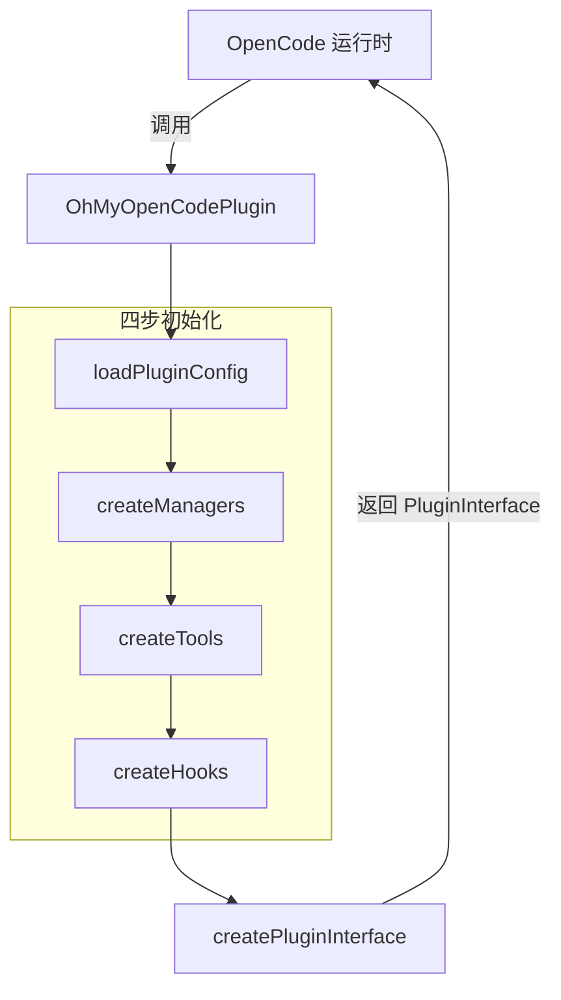
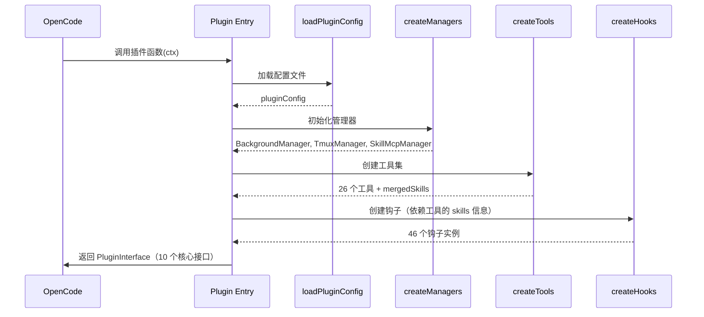

<ChapterLearningGuide />

<script setup>
import SourceSnapshotCard from '../../.vitepress/theme/components/SourceSnapshotCard.vue'
</script>

> **对应路径**：`src/index.ts`、`src/plugin-interface.ts`、`src/plugin-config.ts`、`src/plugin-handlers/`
> **前置阅读**：第17章（为什么需要多个 Agent？）。不需要读第13章——本章会在第1节给出你需要知道的全部背景。
> **学习目标**：理解 oh-my-openagent 作为 OpenCode 插件的完整生命周期，掌握插件接口与内部 Hook 的分工

---



## 本章导读

### 这一章解决什么问题

如果你学完了前面的 OpenCode 章节，你已经知道"插件可以扩展 OpenCode 的能力"——但 oh-my-openagent 是迄今为止最复杂的 OpenCode 插件之一，它的插件入口仅 120 行代码，却协调了整个多模型编排系统。

这一章要回答的是：

- oh-my-openagent 插件的入口在哪里，如何被 OpenCode 加载
- 核心插件接口各自负责什么
- 配置如何从 JSON 文件流转到运行时
- 为什么 `index.ts` 只能导出 `type`，不能导出函数

### 必看入口

- [`src/index.ts`](https://github.com/code-yeongyu/oh-my-openagent/blob/dev/src/index.ts)：插件主入口
- [`src/plugin-interface.ts`](https://github.com/code-yeongyu/oh-my-openagent/blob/dev/src/plugin-interface.ts)：核心插件接口组装
- [`src/plugin-config.ts`](https://github.com/code-yeongyu/oh-my-openagent/blob/dev/src/plugin-config.ts)：配置加载
- [`src/plugin-handlers/`](https://github.com/code-yeongyu/oh-my-openagent/blob/dev/src/plugin-handlers/)：6 阶段配置加载管道

---

## 1. 插件是什么——用一句话说清楚

**OpenCode 插件是什么**：OpenCode 在启动时会扫描配置好的插件文件，把它的默认导出函数当作一个”插件工厂”来调用。这个工厂函数接收 `PluginContext`（当前目录、OpenCode 客户端等运行时信息），返回一组”插件接口对象”。OpenCode 在之后的每次操作中，会通过这些接口调用插件的能力。

你不需要读第13章来理解这章——以上就是你需要知道的全部背景。

oh-my-openagent 就是这样一个插件，它的工厂函数在 `src/index.ts` 里，只有 120 行。

这里先提醒一个新手最容易混淆的点：

- **插件接口**：OpenCode 调用插件时暴露出来的入口，比如 `chat.message`
- **内部 Hook**：插件内部自己再分发的一层能力模块，比如 `runtime-fallback`

前者是“OpenCode 怎么进入插件”，后者是“插件内部怎么拆功能”。两者不是一回事。

```typescript
// src/index.ts（简化）
const OhMyOpenCodePlugin: Plugin = async (ctx) => {
  // ... 初始化 ...
  return {
    tool: tools,               // 注册自定义工具
    "chat.params": ...,        // 拦截聊天参数（模型、温度等）
    "chat.headers": ...,       // 注入 HTTP 请求头
    "chat.message": ...,       // 处理消息（注入上下文、切换 Agent）
    "experimental.chat.messages.transform": ...,  // 转换消息历史
    "experimental.chat.system.transform": ...,    // 转换系统提示
    config: ...,               // 配置处理器
    event: ...,                // 处理 OpenCode 事件
    "tool.execute.before": ..., // 工具执行前拦截
    "tool.execute.after": ...,  // 工具执行后处理
  }
}

export default OhMyOpenCodePlugin
```

上面的代码块是**教学简化版**。真实实现里，`createPluginInterface()` 会先返回 10 个核心接口，然后 `src/index.ts` 还会额外挂一个 `experimental.session.compacting` 接口处理压缩场景。

**关键约束**：`src/index.ts` 末尾有一条重要注释：

```typescript
// NOTE: Do NOT export functions from main index.ts!
// OpenCode treats ALL exports as plugin instances and calls them.
```

OpenCode 会把 `index.ts` 的**所有导出**都当作插件实例来调用。如果你不小心导出了一个普通函数，OpenCode 会尝试把它当 Plugin 函数执行，导致错误。这就是为什么除了 `type` 之外什么都不能导出。

---

## 2. 四步初始化流程

**生命周期动画：** 从插件入口被调用，到配置加载、管理器初始化、工具与 Hook 组装，再到热重载清理，观察 oh-my-openagent 的完整生命周期。

<PluginLifecycleDemo />

插件的 `async (ctx) => {...}` 函数体执行了四个步骤，顺序不能错：



**步骤 1：loadPluginConfig**

从两个位置加载配置：
- 项目级：`.opencode/oh-my-opencode.jsonc`
- 用户级：`~/.config/opencode/oh-my-opencode.jsonc`

项目配置覆盖用户配置，但 `agents`/`categories` 字段会**深度合并**，`disabled_*` 数组会**合并去重**。

**步骤 2：createManagers**

初始化三个状态化的管理器：
- `BackgroundManager`：管理后台 Agent 任务的生命周期（并发控制、轮询）
- `TmuxSessionManager`：管理 Tmux 窗格（子 Agent 的可视化终端）
- `SkillMcpManager`：管理每个会话的 MCP 客户端（技能所需的 MCP 服务器）

这三个管理器是有状态的，它们贯穿整个插件生命周期，不会在每次请求时重新创建。

**步骤 3：createTools**

注册 26 个工具，同时完成技能（Skill）的加载和合并。工具创建的结果 `toolsResult` 包含：
- `filteredTools`：过滤掉禁用工具后的工具集
- `mergedSkills`：合并了内置技能和用户自定义技能
- `availableSkills`：格式化后供 Agent 使用的技能列表

**步骤 4：createHooks**

创建 46 个钩子。注意：Hook 创建依赖于步骤 3 的 `mergedSkills` 和 `availableSkills`——因为有些钩子需要知道当前可用的技能列表，才能在消息中注入正确的上下文。

---

## 3. 10 个核心接口 + 1 个额外接口

OpenCode 通过调用这些接口来与插件交互。为了方便理解，可以先记住 10 个**核心接口**，最后再补一个只在压缩流程里出现的额外接口：

| 接口 | 调用时机 | oh-my-openagent 的作用 |
|------|---------|----------------------|
| `tool` | 加载阶段 | 注入 26 个自定义工具 |
| `chat.params` | 每次 LLM 请求前 | 调整 `thinking` 模式、`effort` 级别 |
| `chat.headers` | 每次 LLM 请求前 | 注入 Auth 请求头（如 OAuth token） |
| `chat.message` | 收到用户消息时 | 注入上下文、触发 Agent 切换、处理 `/start-work` |
| `experimental.chat.messages.transform` | 消息历史组装时 | 压缩/过滤历史消息 |
| `experimental.chat.system.transform` | 系统提示组装时 | 追加 Agent 指令 |
| `config` | 配置请求时 | 注入可用模型列表、Agent 配置 |
| `event` | 系统事件触发时 | 处理会话创建/完成/错误事件 |
| `tool.execute.before` | 工具调用前 | ToolGuard 权限检查 |
| `tool.execute.after` | 工具调用后 | 错误重试、结果后处理 |

额外还有一个：

| 接口 | 调用时机 | 作用 |
|------|---------|------|
| `experimental.session.compacting` | OpenCode 做上下文压缩时 | 先保存待保留信息，再把补充上下文注回压缩结果 |

---

## 4. 配置系统：Zod v4 + 6 阶段管道

oh-my-openagent 使用 [Zod v4](https://zod.dev/) 对配置进行严格校验，配置类型定义在 `src/config/schema/` 中。

`plugin-handlers/` 目录实现了一个 6 阶段的配置加载管道：

```
阶段 1: 文件发现（找到 .jsonc 文件位置）
阶段 2: 文件解析（JSONC → JSON，支持注释）
阶段 3: Schema 校验（Zod 校验，失败时返回默认值）
阶段 4: 深度合并（项目配置 ∪ 用户配置）
阶段 5: 模型解析（连接可用模型列表）
阶段 6: 特性门控（根据配置开启/关闭功能）
```

当配置不合法时，插件不会崩溃——它会使用默认配置并记录警告日志（位于 `/tmp/oh-my-opencode.log`）。

---

## 5. 热重载：activePluginDispose

`src/index.ts` 顶部有一个模块级变量：

```typescript
let activePluginDispose: PluginDispose | null = null
```

当 OpenCode 重新加载插件时（比如配置文件变更），会再次调用 `OhMyOpenCodePlugin`。此时：

1. `await activePluginDispose?.()` 先清理上一次的状态（停止 Background Agent、关闭 MCP 连接）
2. 然后重新走一遍四步初始化流程
3. 更新 `activePluginDispose` 为新的清理函数

这个模式保证了插件可以安全地热重载，不会泄漏状态。

---

## 常见误区

**误区 1：插件函数会在每次对话时调用**

不是的。`OhMyOpenCodePlugin` 只在 OpenCode **启动或重载**时调用一次。之后的每次对话都是调用返回的核心插件接口，插件函数本身不会再执行。

**误区 2：可以在 index.ts 导出工具函数供其他文件使用**

绝对不行。看看源码末尾的注释就清楚了。如果你需要在项目内部共享工具函数，放到 `src/shared/` 里，然后用相对路径导入。

**误区 3：`experimental` 前缀意味着不稳定**

`experimental.chat.messages.transform` 和 `experimental.chat.system.transform` 目前在 oh-my-openagent 中已经是稳定的核心功能。`experimental` 前缀来自 OpenCode 的 API 版本策略，表示该接口还没有进入正式稳定期，但不代表功能不可靠。

---

---

**上一章** ← [第17章：为什么需要多个 Agent？](/oh-prelude/)

**下一章** → [第19章：配置系统实战](/oh-config/)

插件装好了，第一件事是打开配置文件。下一章教你怎么写，以及写错了去哪看报错。

---

<SourceSnapshotCard
  title="第18章源码快照"
  description="插件主入口 120 行协调整个系统：配置加载 → 管理器初始化 → 工具注册 → 钩子创建 → Plugin Interface 返回。"
  repo="code-yeongyu/oh-my-openagent"
  repo-url="https://github.com/code-yeongyu/oh-my-openagent/tree/d80833896cc61fcb59f8955ddc3533982a6bb830"
  branch="dev"
  commit="d80833896cc61fcb59f8955ddc3533982a6bb830"
  verified-at="2026-03-17"
  :entries="[
    { label: '插件主入口', path: 'src/index.ts', href: 'https://github.com/code-yeongyu/oh-my-openagent/blob/d80833896cc61fcb59f8955ddc3533982a6bb830/src/index.ts' },
    { label: '核心插件接口组装', path: 'src/plugin-interface.ts', href: 'https://github.com/code-yeongyu/oh-my-openagent/blob/d80833896cc61fcb59f8955ddc3533982a6bb830/src/plugin-interface.ts' },
    { label: '配置加载入口', path: 'src/plugin-config.ts', href: 'https://github.com/code-yeongyu/oh-my-openagent/blob/d80833896cc61fcb59f8955ddc3533982a6bb830/src/plugin-config.ts' },
    { label: '三个状态化管理器', path: 'src/create-managers.ts', href: 'https://github.com/code-yeongyu/oh-my-openagent/blob/d80833896cc61fcb59f8955ddc3533982a6bb830/src/create-managers.ts' },
    { label: '46 个钩子三层组合', path: 'src/create-hooks.ts', href: 'https://github.com/code-yeongyu/oh-my-openagent/blob/d80833896cc61fcb59f8955ddc3533982a6bb830/src/create-hooks.ts' },
    { label: '26 个工具注册逻辑', path: 'src/create-tools.ts', href: 'https://github.com/code-yeongyu/oh-my-openagent/blob/d80833896cc61fcb59f8955ddc3533982a6bb830/src/create-tools.ts' },
  ]"
/>
