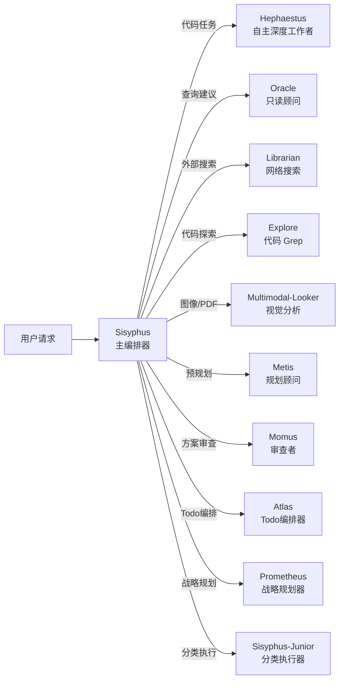
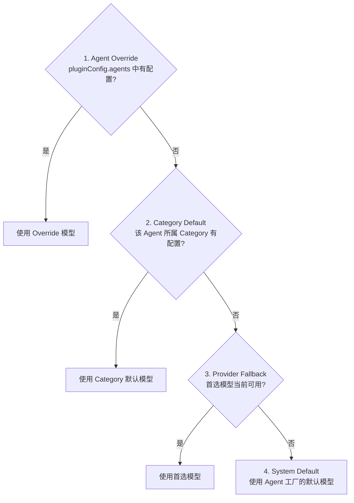
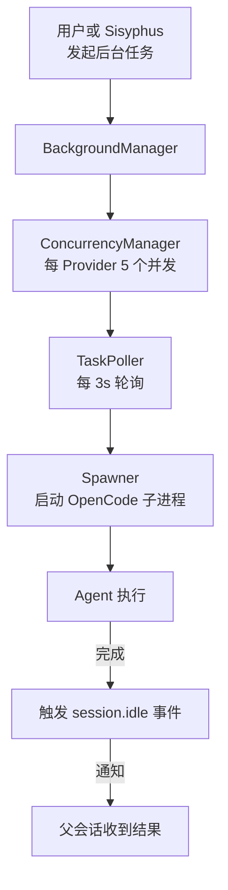

<ChapterLearningGuide />

<script setup>
import SourceSnapshotCard from '../../.vitepress/theme/components/SourceSnapshotCard.vue'
import AgentDispatchDemo from '../../.vitepress/theme/components/AgentDispatchDemo.vue'
import BackgroundTaskDemo from '../../.vitepress/theme/components/BackgroundTaskDemo.vue'
</script>

> **对应路径**：`src/agents/`、`src/features/background-agent/`
> **前置阅读**：第18章 插件系统概述、第6章 多模型支持
> **学习目标**：理解 11 个 Agent 的职责划分，掌握 AgentFactory 模式，理解任务委托和并行执行的实现

---



## 本章导读

### 这一章解决什么问题

多模型编排是 oh-my-openagent 的核心价值所在。它不依赖单一模型，而是根据任务类型把工作分发给最适合的模型——写代码用 GPT-5 Codex，战略规划用 Claude Opus，快速搜索用 Gemini Flash。

这一章要回答的是：

- 11 个 Agent 各自负责什么，为什么要这样划分
- `AgentFactory` 模式是什么，如何用它添加新 Agent
- 模型路由的 4 步解析链如何工作
- Background Agent 如何实现真正的并行执行

---

## 1. 11 个 Agent 的职责地图

### 新手先别背 11 个名字，先按 4 类记

第一次读这里，很容易被一串神话人物名字劝退。更好的记法是先分组：

| 角色组 | 先记住谁 | 这一组解决什么问题 |
|-------|---------|------------------|
| 编排者 | Sisyphus、Atlas | 决定任务怎么拆、结果怎么汇总 |
| 执行者 | Hephaestus、Sisyphus-Junior | 真正去读代码、写代码、落地实现 |
| 顾问者 | Oracle、Metis、Momus | 给建议、做预规划、挑问题 |
| 支援者 | Librarian、Explore、Multimodal-Looker、Prometheus | 查资料、搜代码、看图片、做规划 |

先记住”谁负责决策，谁负责执行，谁负责给意见”，再去背具体名字，会轻松很多。

<AgentDispatchDemo />

### Agent 模式：primary / subagent / all

每个 Agent 有一个 `mode` 属性，决定它在什么上下文中可用：

- **primary**：用户直接对话的主 Agent（如 Atlas）
- **subagent**：只能被其他 Agent 委托调用（如 Oracle、Librarian）
- **all**：两种场景都可用（如 Sisyphus、Hephaestus、Sisyphus-Junior）

### 11 个 Agent 一览

> **关于"默认模型"列**：下表中的模型名是代码中的默认值，实际可用的模型取决于你配置的 Provider 和 API Key。你可以在配置文件里用任何已接入的模型覆盖这些默认值（见[第19章](/oh-config/)）。

| Agent | 模式 | 默认模型 | 核心职责 |
|-------|------|---------|---------|
| **Sisyphus** | all | Claude Opus 4.6 max | 主编排器，决策委托哪个 Agent |
| **Hephaestus** | all | GPT-5.3 Codex medium | 自主深度编码，不委托直接干 |
| **Oracle** | subagent | GPT-5.4 high | 只读顾问，不写文件 |
| **Librarian** | subagent | Gemini-3 Flash | 外部网络搜索 |
| **Explore** | subagent | Grok-Code-Fast-1 | 代码库 grep/探索 |
| **Multimodal-Looker** | subagent | GPT-5.3 Codex medium | 图像/PDF 理解 |
| **Metis** | subagent | Claude Opus 4.6 max | 实现前预规划 |
| **Momus** | subagent | GPT-5.4 xhigh | 方案批评与审查 |
| **Atlas** | primary | Claude Sonnet 4.6 | 主对话 Agent，Todo 编排 |
| **Prometheus** | — | Claude Opus 4.6 max | 战略规划（非委托）|
| **Sisyphus-Junior** | all | Claude Sonnet 4.6 | 分类执行器 |

**为什么 Oracle/Librarian/Explore 不能写文件？**

看它们的工具配置：

```typescript
// src/agents/oracle.ts（示意）
const restrictions = createAgentToolRestrictions([
  "write",
  "edit",
  "apply_patch",
  "task",
])
```

这是工程上的强制约束。Oracle 作为“只读顾问”，即使 prompt 里不强调，代码层面也确保它拿不到写入能力。这就是工程化系统和“只靠提示词约束”的核心差别。

---

## 2. AgentFactory 模式

所有 Agent 都遵循同一个工厂模式：

```typescript
// src/agents/types.ts
type AgentFactory = {
  (model: string): AgentConfig
  mode: AgentMode  // "primary" | "subagent" | "all"
}
```

工厂函数接受一个 `model` 字符串，返回完整的 `AgentConfig`。以 Oracle 为例：

```typescript
// src/agents/oracle.ts（简化）
export const createOracleAgent: AgentFactory = (model: string): AgentConfig => ({
  prompt: `You are Oracle, a read-only advisor...`,
  model,
  temperature: 0.1,
  ...createAgentToolRestrictions(["write", "edit", "apply_patch", "task"]),
})
createOracleAgent.mode = "subagent"
```

**为什么要有 model 参数？**

因为同一个 Agent 在不同部署环境中可能需要用不同的模型。工厂函数接受 model 参数，而不是硬编码，让模型解析逻辑可以在外部统一处理（见第 3 节）。

### 复杂 Agent 的指令分离

Sisyphus、Hephaestus、Atlas、Prometheus 这四个 Agent 的指令（instructions）非常长，且针对不同模型有不同版本。它们的指令文件按模型类型分离：

```
src/agents/sisyphus/
├── default.ts    # Claude 版本
├── gpt.ts        # GPT 版本
└── gemini.ts     # Gemini 版本
```

这不是为了优雅，而是实际需要——Claude 和 GPT 对 XML 标签、角色扮演、工具描述的理解差异足够大，必须分别优化。

---

## 3. 模型路由：4 步解析链

当 `createBuiltinAgents()` 为某个 Agent 解析模型时，走以下 4 步：



**Fallback 链示例（Sisyphus）**：

```
claude-opus-4-6 max
  → k2p5 (Kimi K2.5)
  → gpt-5.4 medium
  → glm-5
  → big-pickle
```

当主模型 API 不可用时，Sisyphus 会自动降级到 Kimi，再到 GPT，保证系统在任何 Provider 故障时都能继续工作。

---

## 4. Background Agent：真正的并行执行

oh-my-openagent 最强大的特性之一是 Background Agent——在主对话继续进行的同时，在后台并行执行多个 Agent 任务。

### 架构概览



**关键组件**：

- `BackgroundManager`：任务生命周期管理，统一入口
- `ConcurrencyManager`：每个模型/Provider 默认最多 5 个并发（可配置）
- `TaskPoller`：每 3 秒检查一次任务状态，10 秒无变化则判断稳定
- `Spawner`：通过 OpenCode HTTP API 创建子会话来执行 Agent

**任务状态机**：

```
pending → running → completed
                  → error
                  → cancelled
                  → interrupt
```

<BackgroundTaskDemo />

### 为什么不用线程/Promise？

因为 oh-my-openagent 是 OpenCode 的**插件**，它不能直接启动新的 LLM 会话。真正的"并行执行"是通过调用 OpenCode 的 HTTP API 创建独立的子会话来实现的——每个后台任务实际上是一个完整的 OpenCode 会话，有自己的上下文、工具和模型配置。

这个设计有一个重要的好处：子 Agent 的执行结果可以直接通过 OpenCode 的会话历史查询，主 Agent 不需要维护复杂的进程间通信。

---

## 5. Sisyphus 的委托决策

Sisyphus 是整个系统的大脑。它的提示词（700+ 行）包含一张详细的"委托表"，告诉它什么任务应该委托给哪个 Agent：

```
代码搜索/探索 → Explore（快，不写文件）
网络搜索/文档查询 → Librarian（会上网）
复杂编码任务 → Hephaestus（专注，不分心）
架构分析/建议 → Oracle（只读，更客观）
图像理解 → Multimodal-Looker
方案审查 → Momus（批评者视角）
```

这个委托表不是静态的——`dynamic-agent-prompt-builder.ts` 会根据当前可用的 Agent 动态生成这个表格。如果你禁用了 Librarian，Sisyphus 的提示词里就不会出现 Librarian 的委托入口。

---

## 常见误区

**误区 1：Agent 切换会丢失上下文**

不会。当 Sisyphus 委托任务给 Hephaestus 时，它会把必要的上下文通过任务描述传递过去。Hephaestus 拿到的是精炼的任务描述，而不是原始对话历史——这实际上比传递完整历史更高效，因为历史里有很多对子 Agent 无关的内容。

**误区 2：Background Agent 会阻塞主对话**

不会。Background Agent 是真正的异步执行。主对话可以继续，后台任务在独立的 OpenCode 会话中运行。当后台任务完成时，通过 `session.idle` 事件通知父会话。

**误区 3：禁用 Agent 后系统会报错**

不会。`createBuiltinAgents()` 在构建 Agent 列表时会跳过 `disabled_agents` 中的 Agent，同时 `dynamic-agent-prompt-builder.ts` 会重新生成 Sisyphus 的委托表，确保提示词与实际可用的 Agent 一致。

---

---

**上一章** ← [第19章：配置系统实战](/oh-config/)

**下一章** → [第21章：Hooks 三层架构](/18-hooks-architecture/)

Agent 工厂看完了，下一章看 46 个 Hook 是怎么分层、注册、执行的。

---

<SourceSnapshotCard
  title="第20章源码快照"
  description="11 个 Agent 的注册中心、AgentFactory 工厂模式、动态提示构建，以及 Background Agent 并行执行的核心实现。"
  repo="code-yeongyu/oh-my-openagent"
  repo-url="https://github.com/code-yeongyu/oh-my-openagent/tree/d80833896cc61fcb59f8955ddc3533982a6bb830"
  branch="dev"
  commit="d80833896cc61fcb59f8955ddc3533982a6bb830"
  verified-at="2026-03-17"
  :entries="[
    { label: 'Agent 注册中心', path: 'src/agents/builtin-agents.ts', href: 'https://github.com/code-yeongyu/oh-my-openagent/blob/d80833896cc61fcb59f8955ddc3533982a6bb830/src/agents/builtin-agents.ts' },
    { label: 'AgentFactory 类型定义', path: 'src/agents/types.ts', href: 'https://github.com/code-yeongyu/oh-my-openagent/blob/d80833896cc61fcb59f8955ddc3533982a6bb830/src/agents/types.ts' },
    { label: '动态生成 Sisyphus 委托表', path: 'src/agents/dynamic-agent-prompt-builder.ts', href: 'https://github.com/code-yeongyu/oh-my-openagent/blob/d80833896cc61fcb59f8955ddc3533982a6bb830/src/agents/dynamic-agent-prompt-builder.ts' },
    { label: 'BackgroundManager 主管理器', path: 'src/features/background-agent/manager.ts', href: 'https://github.com/code-yeongyu/oh-my-openagent/blob/d80833896cc61fcb59f8955ddc3533982a6bb830/src/features/background-agent/manager.ts' },
    { label: '每 Provider 并发控制', path: 'src/features/background-agent/concurrency.ts', href: 'https://github.com/code-yeongyu/oh-my-openagent/blob/d80833896cc61fcb59f8955ddc3533982a6bb830/src/features/background-agent/concurrency.ts' },
    { label: '3s 轮询任务状态', path: 'src/features/background-agent/task-poller.ts', href: 'https://github.com/code-yeongyu/oh-my-openagent/blob/d80833896cc61fcb59f8955ddc3533982a6bb830/src/features/background-agent/task-poller.ts' },
  ]"
/>
