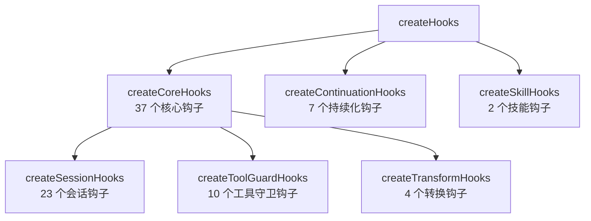
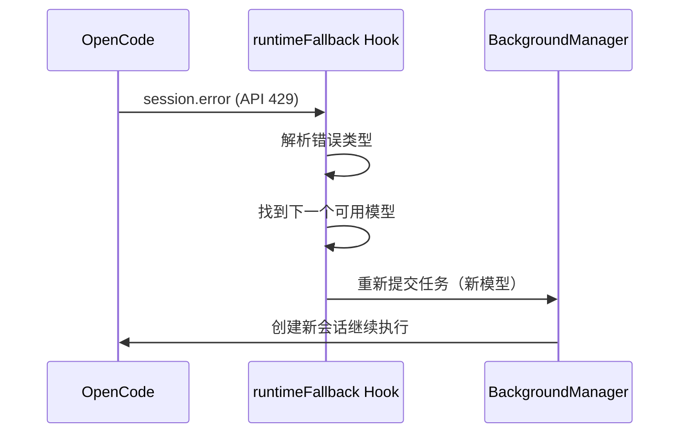
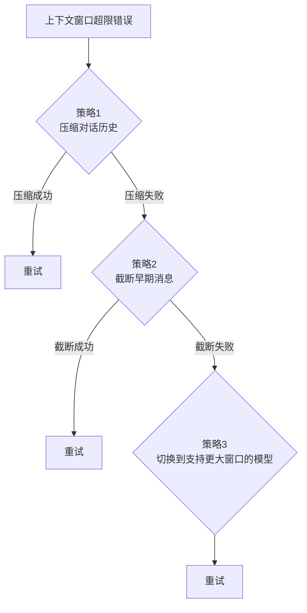

<ChapterLearningGuide />

<script setup>
import SourceSnapshotCard from '../../.vitepress/theme/components/SourceSnapshotCard.vue'
import RuntimeFallbackDemo from '../../.vitepress/theme/components/RuntimeFallbackDemo.vue'
</script>

> **对应路径**：`src/hooks/`、`src/plugin/hooks/`、`src/create-hooks.ts`
> **前置阅读**：第18章 插件系统概述
> **学习目标**：理解 46 个 Hook 的三层分组逻辑，掌握 Hook 注册流程，能读懂核心 Hook 的实现

---



## 本章导读

### 这一章解决什么问题

46 个 Hook 是 oh-my-openagent 功能实现的主战场。几乎所有的"智能行为"——自动切换模型、注入上下文、重试失败操作、防止 Agent 越权——都是通过 Hook 实现的。

这里也先做一个术语拆分，避免和上一章混淆：

- **插件接口**：OpenCode 调用插件时看到的入口，比如 `chat.message`
- **Hook 名**：插件内部某个具体能力模块的名字，比如 `runtime-fallback`

这一章讲的是第二种，也就是插件内部的 Hook 名和 Hook 分层。

这一章要回答的是：

- 为什么要分三层，每层负责什么
- `isHookEnabled` 和 `safeHookEnabled` 是什么，解决什么问题
- 几个最核心的 Hook（runtimeFallback、editErrorRecovery、anthropicContextWindowLimitRecovery）是如何工作的
- 如何在不破坏现有 Hook 的情况下添加新 Hook

---

## 1. 三层架构的分组逻辑

### 为什么要分三层？

不是因为有三种"类型"的 Hook，而是因为**依赖关系不同**：

- **Core Hooks（37个）**：只依赖 `ctx`（OpenCode 上下文）和 `pluginConfig`（配置），最基础
- **Continuation Hooks（7个）**：依赖 Background Agent 系统，需要 `backgroundManager`
- **Skill Hooks（2个）**：依赖已加载的技能数据 `mergedSkills`/`availableSkills`

这三层的初始化有先后顺序：Core 最先，Skill 最后（因为 Skill 数据在 `createTools()` 中产生，比 Hook 创建晚）。

### Core Hooks 的三个子分组

Core Hooks 内部又分三组：

**会话钩子（23个）**：响应 OpenCode 的生命周期事件
```
session.created → 检查更新、发送欢迎消息
session.idle    → 上下文窗口监控、OS 通知
session.error   → 自动重试、模型 fallback
chat.message    → 上下文注入、Agent 提醒
chat.params     → 调整 thinking 模式、effort 级别
```

**工具守卫钩子（10个）**：在工具执行前/后拦截
```
tool.execute.before → 权限检查、参数验证
tool.execute.after  → 错误重试、结果后处理
```

**转换钩子（4个）**：转换消息和系统提示
```
messages.transform → 消息历史压缩
system.transform   → 系统提示追加
```

---

## 2. isHookEnabled：可关闭的 Hook

每个 Hook 都有一个名字（`HookName`），用户可以在配置文件中禁用特定 Hook：

```jsonc
// .opencode/oh-my-opencode.jsonc
{
  "disabled_hooks": ["background-notification", "session-notification"]
}
```

在代码层面，`createHooks()` 接收一个 `isHookEnabled` 函数：

```typescript
// src/create-hooks.ts（简化）
const isHookEnabled = (hookName: HookName): boolean =>
  !disabledHooks.has(hookName)

const core = createCoreHooks({
  isHookEnabled,
  // ...
})
```

每个 Hook 在创建时检查自己是否被启用：

```typescript
// 某个 Hook 的创建逻辑（示意）
if (!isHookEnabled("session-notification")) return null

// 只有启用时才创建 Hook 实例
return createSessionNotificationHook(...)
```

返回 `null` 的 Hook 不会被注册，也不会消耗任何资源。这比运行时检查更高效。

---

## 3. safeHookEnabled：安全钩子创建

`safeHookEnabled`（对应配置 `experimental.safe_hook_creation`，默认 `true`）是一个防御性机制：

当 `safeHookEnabled = true` 时，Hook 创建失败**不会导致插件崩溃**——错误会被捕获并记录到日志，该 Hook 被跳过，其他 Hook 正常工作。

```typescript
// 安全创建逻辑（简化）
function safeCreateHook<T>(name: string, factory: () => T): T | null {
  if (!safeHookEnabled) return factory()
  try {
    return factory()
  } catch (error) {
    log(`[Hook] Failed to create ${name}:`, error)
    return null
  }
}
```

这个设计的背后逻辑：对于生产环境，一个 Hook 失败不能让整个插件崩溃。但在开发调试时，你可能希望关掉这个保护，让错误直接暴露出来，所以提供了配置开关。

---

## 4. 三个最重要的 Hook 解析

### Hook 1：runtimeFallback（运行时模型自动切换）

**问题**：当前模型的 API 返回 429（限速）或 503（服务不可用）时，任务中断了。

**解决方案**：`runtimeFallback` 监听 `session.error` 事件，识别出 API 错误类型，然后自动切换到 fallback 链中的下一个模型重试。



这个 Hook 是 Disposable 的——它有一个 `dispose()` 方法，在插件卸载时清理内部状态（防止内存泄漏）。

<RuntimeFallbackDemo />

### Hook 2：editErrorRecovery（编辑失败自动重试）

**问题**：AI 尝试编辑文件时，常见的失败原因是"old string 匹配不到"（文件已被其他操作修改）。

**解决方案**：`editErrorRecovery` 监听 `tool.execute.after`，当检测到编辑工具失败时：
1. 重新读取文件的当前内容
2. 把最新内容注入到下一条消息
3. 触发重试

这个 Hook 把一个"需要用户介入的错误"变成了"系统自动处理的重试"，大幅提升了长时间无人值守任务的成功率。

### Hook 3：anthropicContextWindowLimitRecovery（上下文窗口恢复）

这是整个系统最复杂的 Hook 之一，用于应对模型的上下文窗口限制（如 200K token）。

**多策略恢复**：



每个策略失败后才尝试下一个，尽可能保留最多的上下文信息。

---

## 5. 典型 Hook 结构

如果你要添加一个新 Hook，参考这个结构：

```typescript
// src/hooks/my-hook/index.ts
import type { HookName } from "../../config"
import type { PluginContext } from "../../plugin/types"

type MyHookDeps = {
  ctx: PluginContext
  isHookEnabled: (name: HookName) => boolean
}

export function createMyHook(deps: MyHookDeps) {
  const { ctx, isHookEnabled } = deps

  // 检查是否启用
  if (!isHookEnabled("my-hook")) return null

  // Hook 逻辑
  return {
    // 响应某个事件
    onChatMessage: async (message: string) => {
      // ...
    },
    // 如果 Hook 有状态，提供 dispose
    dispose: () => {
      // 清理状态
    }
  }
}
```

然后在对应的 tier 文件中注册：

```typescript
// src/plugin/hooks/create-core-hooks.ts（添加）
const myHook = safeCreateHook("my-hook", () =>
  createMyHook({ ctx, isHookEnabled })
)
```

---

## 6. Hook 的 disposeHooks 机制

插件卸载时（热重载或关闭），需要清理所有有状态的 Hook：

```typescript
// src/create-hooks.ts（简化）
export function disposeCreatedHooks(hooks: DisposableCreatedHooks): void {
  hooks.runtimeFallback?.dispose?.()
  hooks.todoContinuationEnforcer?.dispose?.()
  hooks.autoSlashCommand?.dispose?.()
}
```

`DisposableCreatedHooks` 只包含**有状态的** Hook（需要显式清理的那些）。无状态 Hook（函数调用后不保留任何状态）不需要 dispose。

判断一个 Hook 是否有状态的简单方法：Hook 内部有没有用 `let`/`Map`/`Set` 等存储跨请求状态？有的话就需要 dispose。

---

## 常见误区

**误区 1：Hook 的执行顺序是固定的**

同一个 Hook 点（如 `tool.execute.before`）上注册的多个 Hook，执行顺序由注册顺序决定。但不同 Hook 点的 Hook 按事件触发顺序执行，不存在跨 Hook 点的依赖关系。

**误区 2：Hook 可以阻止工具执行**

`tool.execute.before` 可以抛出异常来阻止工具执行，但这会导致整个工具调用失败，不是"优雅拒绝"。如果需要条件性阻止，应该在 Hook 中返回一个"禁止"的结果，而不是抛出异常。

**误区 3：禁用 Hook 就等于功能关闭**

部分 Hook 是相互依赖的。例如，`background-notification` 依赖 `BackgroundManager` 的通知机制。禁用 Hook 只是关闭了对该事件的响应，但底层的 Manager 仍然运行。

---

---

**上一章** ← [第20章：多模型编排系统](/17-multi-model-orchestration/)

**下一章** → [第22章：工具扩展系统](/19-tool-extension/)

Hook 架构看完了，下一章看 26 个工具的分类和核心工具的实现原理。

---

<SourceSnapshotCard
  title="第21章源码快照"
  description="46 个 Hook 三层架构的组合入口，Core/Continuation/Skill 分层，以及 runtimeFallback、editErrorRecovery 等核心 Hook 的实现。"
  repo="code-yeongyu/oh-my-openagent"
  repo-url="https://github.com/code-yeongyu/oh-my-openagent/tree/d80833896cc61fcb59f8955ddc3533982a6bb830"
  branch="dev"
  commit="d80833896cc61fcb59f8955ddc3533982a6bb830"
  verified-at="2026-03-17"
  :entries="[
    { label: '三层 Hook 组合入口', path: 'src/create-hooks.ts', href: 'https://github.com/code-yeongyu/oh-my-openagent/blob/d80833896cc61fcb59f8955ddc3533982a6bb830/src/create-hooks.ts' },
    { label: '37 个核心 Hook 创建', path: 'src/plugin/hooks/create-core-hooks.ts', href: 'https://github.com/code-yeongyu/oh-my-openagent/blob/d80833896cc61fcb59f8955ddc3533982a6bb830/src/plugin/hooks/create-core-hooks.ts' },
    { label: '7 个持续化 Hook', path: 'src/plugin/hooks/create-continuation-hooks.ts', href: 'https://github.com/code-yeongyu/oh-my-openagent/blob/d80833896cc61fcb59f8955ddc3533982a6bb830/src/plugin/hooks/create-continuation-hooks.ts' },
    { label: '2 个技能 Hook', path: 'src/plugin/hooks/create-skill-hooks.ts', href: 'https://github.com/code-yeongyu/oh-my-openagent/blob/d80833896cc61fcb59f8955ddc3533982a6bb830/src/plugin/hooks/create-skill-hooks.ts' },
    { label: 'runtimeFallback 实现', path: 'src/hooks/runtime-fallback/', href: 'https://github.com/code-yeongyu/oh-my-openagent/tree/d80833896cc61fcb59f8955ddc3533982a6bb830/src/hooks/runtime-fallback' },
    { label: 'editErrorRecovery 实现', path: 'src/hooks/edit-error-recovery/', href: 'https://github.com/code-yeongyu/oh-my-openagent/tree/d80833896cc61fcb59f8955ddc3533982a6bb830/src/hooks/edit-error-recovery' },
  ]"
/>
