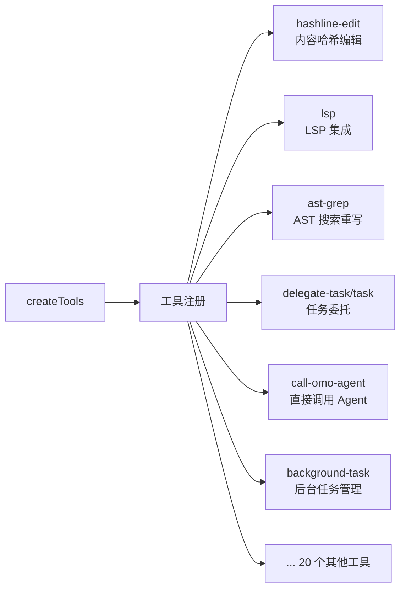
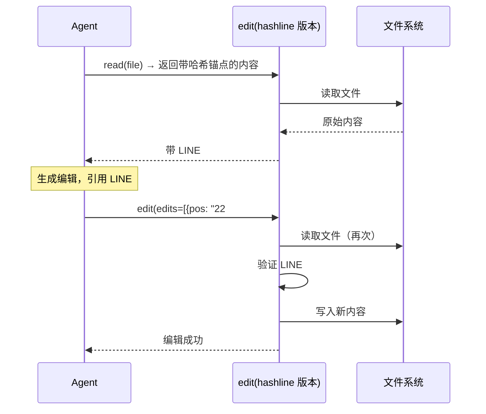

<ChapterLearningGuide />

<script setup>
import SourceSnapshotCard from '../../.vitepress/theme/components/SourceSnapshotCard.vue'
import HashlineEditDemo from '../../.vitepress/theme/components/HashlineEditDemo.vue'
import TaskDelegationDemo from '../../.vitepress/theme/components/TaskDelegationDemo.vue'
</script>

> **对应路径**：`src/tools/`、`src/plugin/tool-registry.ts`
> **前置阅读**：第4章 工具系统、第18章 插件系统概述
> **学习目标**：理解 26 个工具的分类逻辑，掌握 hashline-edit 等核心工具的工作原理，能添加自定义工具

---



## 本章导读

### 这一章解决什么问题

工具是 Agent 与外部世界交互的唯一方式。oh-my-openagent 在 OpenCode 原有工具基础上新增了 26 个工具，其中几个是工程上的创新：

- `hashline-edit`：解决了 AI 编辑文件时的"幻觉对齐"问题
- `task`（源码目录是 `delegate-task`）：实现了 Agent 间的任务委托
- `lsp`：把编辑器级别的代码智能引入到 Agent 工具链

这一章要回答的是：

- 26 个工具的分类逻辑，什么工具负责什么
- `hashline-edit` 的创新在哪里，为什么比传统行号编辑更可靠
- `task` 如何实现同步/异步两种委托模式
- ToolGuard 权限控制的实现原理

---

## 1. 先分清：源码目录名，不等于真正的工具名

这一章对新手最容易绕晕的地方，不是工具本身，而是**名字有两层**：

- **源码目录名**：你在仓库里看到的目录，比如 `delegate-task/`
- **真正注册名**：Agent 真正调用的工具名，比如 `task`

如果你只记目录名，等你去日志里看实际工具调用时会对不上；如果你只记注册名，回到仓库里找源码目录又会迷路。最省力的办法是把这两个名字一起记。

下面这张表只列最重要、最容易混淆的那批：

| 源码目录/模块 | 实际注册名 | 你该怎么理解 |
|----------------|-----------|----------------|
| `delegate-task/` | `task` | 任务委托主入口，支持同步/异步 |
| `call-omo-agent/` | `call_omo_agent` | 直接调用少数指定子 Agent |
| `skill-mcp/` | `skill_mcp` | 调用技能挂载的 MCP |
| `look-at/` | `look_at` | 看图片、PDF 等多模态内容 |
| `interactive-bash/` | `interactive_bash` | 可交互 shell |
| `session-manager/` | `session_list` / `session_read` / `session_search` / `session_info` | 读会话历史 |
| `background-task/` | `background_output` / `background_cancel` | 查询或取消后台任务 |
| `hashline-edit/` | `edit` | 开启 `hashline_edit` 后，用更稳的哈希锚点版 `edit` 覆盖默认编辑能力 |

所以后文里如果我说“`delegate-task` 工具”，你要自动在脑子里翻译成：

- 看源码时去 `src/tools/delegate-task/`
- 看运行时时留意真正的工具名 `task`

---

## 2. hashline-edit：解决 AI 编辑的根本问题

`hashline-edit` 是 oh-my-openagent 在工具设计上最有创意的部分，值得深入理解。

但先注意一个名字细节：**源码目录叫 `hashline-edit/`，运行时真正暴露给 Agent 的工具名通常还是 `edit`**。也就是说，Agent 不一定会看到一个单独叫 `hashline-edit` 的工具，它看到的往往只是一个“更可靠版本的 edit”。

### 问题：AI 编辑为什么会失败？

传统的 AI 文件编辑方式（包括 OpenCode 原生的 Edit 工具）基于"旧内容 → 新内容"的替换：

```
old_string: "function hello() {"
new_string: "function hello(name: string) {"
```

失败场景：当 AI 读取文件后，其他操作（另一个工具调用、并发修改）改变了文件内容。AI 基于已读的内容生成了编辑，但文件已经不是那个样子了，`old_string` 匹配失败。

更糟糕的是：AI 可能会"幻觉对齐"——它生成的 `old_string` 是它**认为**文件里有的内容，而不是文件**实际**的内容。这种错误难以调试。

### 解决方案：内容哈希锁定

`hashline-edit` 在读取文件时，给每一行加上一个基于内容的短哈希标识（LINE#ID）：

```
11#VK| function hello() {
22#XJ|   return "world"
33#MB| }
```

AI 在编辑时引用这个 LINE#ID：

```json
{
  "filePath": "/abs/path/hello.ts",
  "edits": [
    {
      "op": "replace",
      "pos": "22#XJ",
      "lines": "  return `Hello, ${name}!`"
    }
  ]
}
```

工具在执行编辑时会验证锚点是否仍然能命中正确位置。你可以把它理解成：
1. 先用 `LINE#ID` 找到目标位置
2. 再确认当前位置没有漂移到完全不同的内容

如果验证失败，说明文件已被修改，工具会报错并触发 `editErrorRecovery` Hook（见第21章）重新读取文件后再试。



**关键设计**：哈希不是基于行号，而是基于**内容**。即使文件前面插入了新行，只要目标行的内容没变，LINE#ID 就还能匹配到正确的行。

<HashlineEditDemo />

---

## 3. `task`：任务委托的两种模式（源码目录是 `delegate-task/`）

`src/tools/delegate-task/` 这套实现，真正注册到运行时里的主工具名是 `task`。它支持两种模式：

### 同步委托（等待结果）

```json
{
  "category": "backend",
  "description": "实现登录 API",
  "prompt": "Implement an Express login API. Accept email and password, validate the user, and return a JWT token.",
  "load_skills": [],
  "run_in_background": false
}
```

Sisyphus 发出委托后，**等待**被委托的 Agent 完成任务，然后拿到结果继续。适合“需要结果才能继续下一步”的场景。

这里有个容易忽略的约束：当前实现要求 `prompt` 用英文写，`load_skills` 即使为空也要传 `[]`。

### 异步委托（后台执行）

```json
{
  "category": "frontend",
  "description": "实现登录页面",
  "prompt": "Build the login page UI and wire it to the existing auth endpoint.",
  "load_skills": [],
  "run_in_background": true
}
```

Sisyphus 发出委托后**立即继续**，被委托的任务在后台的 Background Agent 中执行。适合“可以并行进行的任务”。

### 委托到分类 vs 委托到具体 Agent

`task` 可以委托给**分类**（`category`）或**具体子 Agent 类型**（`subagent_type`）：

- 委托给分类：系统根据 `Sisyphus-Junior` 的分类配置选择合适的模型
- 委托给具体子 Agent：直接指定如 `explore`、`oracle` 这样的专门能力

分类系统来自 `pluginConfig.categories`，允许用户自定义哪些分类用哪个模型，无需修改代码。

<TaskDelegationDemo />

---

## 4. ToolGuard：工具权限控制

`ToolGuard` 是一个在 `tool.execute.before` Hook 中运行的权限检查机制。

### Agent 级别的工具限制

每个 Agent 的配置里会通过工具权限限制来约束自己能做什么：

```typescript
const restrictions = createAgentToolRestrictions([
  "write",
  "edit",
  "apply_patch",
  "task",
])
```

`ToolGuard` 在每次工具调用前检查：当前执行的 Agent 是否被允许调用这个工具。如果不允许，调用被拒绝，AI 收到一个明确的错误消息（而不是静默失败）。

### 为什么不靠 prompt 约束？

prompt 说"你不能写文件"，模型可能还是会尝试写文件（尤其是长对话后 prompt 被压缩的情况下）。`ToolGuard` 是代码层面的强制约束，不受 prompt 影响。

---

## 5. 添加自定义工具

如果你想添加一个新工具，更贴近当前仓库的做法是参考 `src/tools/skill-mcp/`、`src/tools/call-omo-agent/` 这类实现。结构大致是：

```typescript
// src/tools/my-tool/index.ts
import { tool, type ToolDefinition } from "@opencode-ai/plugin"

export function createMyTool(): ToolDefinition {
  return tool({
    description: "做某件事情",
    args: {
      input: tool.schema.string().describe("输入内容"),
    },
    async execute({ input }) {
      return `处理结果: ${input}`
    },
  })
}
```

然后在 `src/plugin/tool-registry.ts` 中注册：

```typescript
import { createMyTool } from "../tools/my-tool"

const allTools = {
  // ...现有工具...
  my_tool: createMyTool(),
}
```

**注意事项**：
1. 工具名用 `snake_case`（如 `my_tool`），因为 OpenCode 工具名规范
2. `description` 要对 AI 友好，清晰说明工具做什么、什么时候用
3. 如果工具有副作用（写文件、网络请求），在 description 中明确说明

---

## 常见误区

**误区 1：hashline-edit 会作为一个单独工具名出现**

不一定。当前实现里，开启 `hashline_edit` 后，通常是用更稳的哈希锚点版 `edit` 覆盖默认编辑行为。你在源码里会看到 `hashline-edit/` 目录，但在运行时看到的工具名可能还是 `edit`。

**误区 2：LSP 工具需要预先启动 LSP 服务器**

`lsp` 工具会按需启动对应语言的 LSP 服务器，第一次调用时会有初始化延迟，之后会复用已启动的服务器实例。不需要用户手动配置或启动任何 LSP 服务器。

**误区 3：`task` 的异步委托结果永久丢失**

不是的。异步委托的任务在 Background Agent 中执行，结果会保存到 OpenCode 的会话历史。Sisyphus 可以通过 `session_read` / `session_search` 这类会话工具查询，或者等待 `session.idle` 事件触发时读取结果。

---

---

**上一章** ← [第21章：Hooks 三层架构](/18-hooks-architecture/)

**下一章** → [第23章：一条消息的完整旅程](/oh-flow/)

工具看完了，下一章把所有机制串起来——跟着一条真实请求从头走到尾。

---

<SourceSnapshotCard
  title="第22章源码快照"
  description="26 个工具的注册入口，hashline-edit 内容哈希编辑，task 委托，以及 LSP/AST 代码智能工具。"
  repo="code-yeongyu/oh-my-openagent"
  repo-url="https://github.com/code-yeongyu/oh-my-openagent/tree/d80833896cc61fcb59f8955ddc3533982a6bb830"
  branch="dev"
  commit="d80833896cc61fcb59f8955ddc3533982a6bb830"
  verified-at="2026-03-17"
  :entries="[
    { label: '工具注册入口', path: 'src/create-tools.ts', href: 'https://github.com/code-yeongyu/oh-my-openagent/blob/d80833896cc61fcb59f8955ddc3533982a6bb830/src/create-tools.ts' },
    { label: 'hashline-edit 内容哈希编辑', path: 'src/tools/hashline-edit/', href: 'https://github.com/code-yeongyu/oh-my-openagent/tree/d80833896cc61fcb59f8955ddc3533982a6bb830/src/tools/hashline-edit' },
    { label: 'delegate-task 任务委托', path: 'src/tools/delegate-task/', href: 'https://github.com/code-yeongyu/oh-my-openagent/tree/d80833896cc61fcb59f8955ddc3533982a6bb830/src/tools/delegate-task' },
    { label: 'LSP 代码智能集成', path: 'src/tools/lsp/', href: 'https://github.com/code-yeongyu/oh-my-openagent/tree/d80833896cc61fcb59f8955ddc3533982a6bb830/src/tools/lsp' },
    { label: 'AST 级别代码搜索重写', path: 'src/tools/ast-grep/', href: 'https://github.com/code-yeongyu/oh-my-openagent/tree/d80833896cc61fcb59f8955ddc3533982a6bb830/src/tools/ast-grep' },
    { label: '直接调用指定 Agent', path: 'src/tools/call-omo-agent/', href: 'https://github.com/code-yeongyu/oh-my-openagent/tree/d80833896cc61fcb59f8955ddc3533982a6bb830/src/tools/call-omo-agent' },
  ]"
/>
