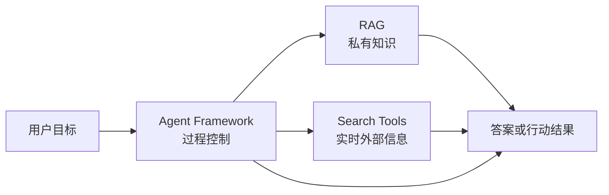

<ChapterLearningGuide />

## 这个专区解决什么问题

很多团队说“我要做一个 Agent”，其实这句话没有工程含义。真正的问题通常是下面三类之一：

```text
Agent Framework
  -> 任务怎么推进，状态怎么保存，工具怎么调用，失败怎么恢复

RAG
  -> 可靠知识怎么进入上下文，权限怎么过滤，引用怎么追溯

Search Tools
  -> 实时外部信息怎么获取，来源怎么筛选，冲突怎么处理
```

这三类能力可以组合，但不能混成一个黑盒。混起来的结果通常是：慢、贵、难调试，出错后不知道是检索错、搜索错、模型错，还是状态机写错。

## 先给结论

| 你的问题 | 优先看什么 | 不要先做什么 |
| --- | --- | --- |
| 只是让模型回答固定问题 | 轻量模型调用 | 不要上复杂 Agent 框架 |
| 要回答内部文档、代码库、制度问题 | RAG | 不要用开放搜索替代权限知识库 |
| 要回答最新网页、版本、新闻、官方文档 | 搜索工具 | 不要把实时网页离线塞进旧索引 |
| 要连续执行多步任务 | Agent Framework | 不要只靠 Prompt 硬撑流程 |
| 要内部知识和外部实时信息交叉验证 | RAG + Search | 不要把两类来源混在一个检索器里 |
| 要生产可审计、可恢复、可观测 | Agent Framework + Trace | 不要上线不可回放的黑盒链路 |

## 三层模型



核心收束句：

```text
RAG 决定知识怎么进来；
Search 决定实时信息怎么进来；
Agent Framework 决定任务怎么推进。
```

## 推荐阅读顺序

1. [Agent 框架怎么选](/agent-selection/01-agent-frameworks)：先判断是否真的需要框架。
2. [LangGraph 适合什么场景](/agent-selection/02-langgraph)：单独理解状态图、恢复执行和人机确认。
3. [RAG 知识与检索选型](/agent-selection/03-rag-knowledge-selection)：判断知识库、向量库、混合检索和重排怎么选。
4. [搜索工具选型](/agent-selection/04-search-tools)：判断实时外部信息、网页抓取和搜索 API 怎么选。
5. [组合方案](/agent-selection/05-composition-patterns)：把框架、RAG、搜索、工具和审计拼成系统。
6. [选型检查表](/agent-selection/06-selection-checklist)：在方案评审前逐项过一遍。

## 读完之后应该能做什么

你应该能回答四个问题：

- 这个项目是不是必须用 Agent Framework？
- 知识来源应该走 RAG、Search，还是两者组合？
- LangGraph 是必要的状态编排，还是过度设计？
- 方案上线后如何回放、评估、降级和控制成本？
