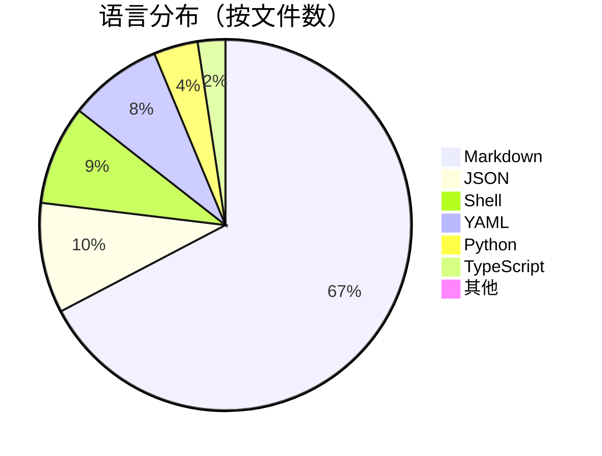

# 第 1 章：项目总览

## 本章导读

**仓库路径**：`/`（根目录）+ `CLAUDE.md`

**系统职责**：
- 理解 Claude Code 的整体架构（13 插件 + 自动化 + 配置）
- 掌握 202 个文件的组织方式
- 了解 Marketplace 注册机制

**能学到什么**：
- 如何组织一个多插件系统的目录结构
- 插件发现机制（约定优于配置）
- 文档驱动开发（Markdown 即代码）

---

## 1.1 仓库结构速览

### 顶层目录

当你克隆 Claude Code 仓库后，会看到这样的目录结构：

```bash
claude-code/
├── plugins/              # 13 个官方插件
├── scripts/              # 5 个 TypeScript 自动化脚本
├── .github/workflows/    # 12 个 GitHub Actions 工作流
├── .claude/commands/     # 3 个自定义命令
├── .devcontainer/        # Docker/Podman 开发容器配置
├── examples/             # 配置示例（3 种安全策略）
├── .vitepress/           # VitePress 文档站配置
├── docs/                 # 文档目录
├── CLAUDE.md             # 项目架构文档（核心）
├── CHANGELOG.md          # 版本发布记录（当前 v2.1.74）
├── LICENSE.md            # Anthropic PBC 商业条款
├── README.md             # 安装指南
├── SECURITY.md           # HackerOne 漏洞披露计划
└── package.json          # Node.js 项目配置
```

### 核心发现

**第一眼看到这个结构，你应该注意到**：

1. **插件是一等公民**：`plugins/` 目录占据顶层，包含 13 个子目录
2. **自动化很重要**：`scripts/` 和 `.github/workflows/` 说明这是一个高度自动化的项目
3. **文档驱动**：`CLAUDE.md` 是核心文档，每个模块都有自己的 `CLAUDE.md`
4. **安全优先**：`examples/settings/` 提供 3 种安全配置，`SECURITY.md` 说明漏洞披露流程

---

## 1.2 17 个模块的职责分工

Claude Code 由 17 个模块组成，每个模块都有明确的职责：

### 插件模块（13 个）

| 插件 | 分类 | 职责 | 状态 |
|------|------|------|------|
| **hookify** | development | 规则引擎：拦截工具调用并执行自定义规则 | 生产 |
| **agent-sdk-dev** | development | Agent SDK 开发工具包（TS/Python 双语言） | 生产 |
| **feature-dev** | development | 7 阶段特性开发工作流 | 生产 |
| **plugin-dev** | development | 插件开发工具包（7 技能 + 60+ 文件） | 生产 |
| **code-review** | productivity | 多 Agent PR 审查（9 步流程） | 生产 |
| **pr-review-toolkit** | productivity | 6 个专业审查 Agent（置信度评分） | 生产 |
| **commit-commands** | productivity | Git 工作流自动化（3 个命令） | 生产 |
| **ralph-wiggum** | development | 自引用 AI 循环（实验性） | 实验 |
| **security-guidance** | security | 安全检查 Hook（9 种模式） | 生产 |
| **frontend-design** | development | 生产级前端设计技能 | 生产 |
| **claude-opus-4-5-migration** | development | Opus 4.5 迁移技能 | 生产 |
| **explanatory-output-style** | learning | 教育性输出风格 | 生产 |
| **learning-output-style** | learning | 学习式输出风格 | 生产 |

### 自动化模块（3 个）

| 模块 | 职责 | 技术栈 |
|------|------|--------|
| **scripts** | GitHub Issue 自动化（去重/分类/关闭/锁定/检查） | TypeScript + Bun |
| **workflows** | GitHub Actions CI/CD（12 个工作流） | YAML |
| **commands** | 自定义命令（commit-push-pr/dedupe/triage-issue） | Markdown |

### 开发环境模块（1 个）

| 模块 | 职责 | 技术栈 |
|------|------|--------|
| **devcontainer** | 开发容器配置（Docker/Podman + 沙箱） | Docker |

---

## 1.3 插件 Marketplace 架构

### Marketplace 注册

Claude Code 使用 `.claude-plugin/marketplace.json` 注册插件：

```json
{
  "plugins": [
    {
      "name": "hookify",
      "version": "1.0.0",
      "category": "development",
      "description": "规则引擎：拦截工具调用并执行自定义规则"
    },
    {
      "name": "code-review",
      "version": "1.0.0",
      "category": "productivity",
      "description": "多 Agent PR 审查"
    }
    // ... 其他 10 个插件
  ]
}
```

### 4 种分类

| 分类 | 插件数 | 插件列表 |
|------|--------|---------|
| **development** | 7 | agent-sdk-dev, claude-opus-4-5-migration, feature-dev, frontend-design, hookify, plugin-dev, ralph-wiggum |
| **productivity** | 3 | code-review, commit-commands, pr-review-toolkit |
| **learning** | 2 | explanatory-output-style, learning-output-style |
| **security** | 1 | security-guidance |

### 插件发现机制

Claude Code 使用**约定优于配置**的方式发现插件：

1. **扫描 `plugins/` 目录**：自动发现所有子目录
2. **检查标准结构**：每个插件必须包含以下目录之一
   - `commands/` - 命令定义（Markdown）
   - `agents/` - Agent 定义（Markdown）
   - `skills/` - 技能定义（Markdown + 参考文档）
   - `hooks/` - Hook 实现（Python/Shell）
3. **加载元数据**：从 `marketplace.json` 读取版本、分类、描述
4. **注册到系统**：用户可以通过 `/plugin install <name>` 安装

**这种设计的优势**：
- **零配置**：只要遵循目录结构，插件自动被发现
- **可扩展**：添加新插件只需创建新目录
- **类型安全**：Markdown frontmatter 提供结构化元数据

---

## 1.4 统计数据与语言分布

### 文件统计

| 类别 | 数量 | 说明 |
|------|------|------|
| **总文件数** | 202 | 排除 .git/.DS_Store/demo.gif |
| **已扫描文件** | 194 | 覆盖率 96% |
| **插件数** | 13 | Marketplace 注册 12 个 |
| **命令数** | 22 | 插件命令 19 + 自定义命令 3 |
| **Agent 数** | 17 | 多 Agent 协作、并行搜索、验证子 Agent |
| **技能数** | 9 | 渐进式披露（SKILL.md + references/ + examples/） |
| **Hook 数** | 6 | 9 种生命周期事件拦截 |
| **工作流数** | 12 | GitHub Actions 自动化 |
| **脚本数** | 5 | TypeScript + Bun 运行时 |

### 语言分布



**关键洞察**：
- **Markdown 占 69%**：说明这是一个文档驱动的项目
- **JSON 配置占 10%**：规则定义、Marketplace 注册、MCP 示例
- **Shell 脚本占 9%**：Hook 实现、工具脚本、验证脚本
- **YAML 占 8%**：GitHub Actions 工作流、Issue 模板
- **Python 占 4%**：Hook 实现（hookify、security-guidance）
- **TypeScript 占 2%**：自动化脚本（GitHub API 封装）

---

## 1.5 版本演进

### 当前版本

从 `CHANGELOG.md` 可以看到，当前版本是 **v2.1.74**（2026-03-12）。

### 主要功能迭代

| 版本 | 日期 | 主要功能 |
|------|------|---------|
| v2.1.74 | 2026-03-12 | Bugfix + Feature 更新 |
| v2.1.x | 2026-03 | 插件系统稳定版 |
| v2.0.x | 2026-02 | 重构插件架构 |
| v1.x | 2025-12 | 初始版本 |

### 演进趋势

1. **插件化**：从单体应用到插件系统
2. **自动化**：从手动操作到 GitHub Actions
3. **安全化**：从无限制到三档安全策略
4. **文档化**：从代码注释到完整的 CLAUDE.md 体系

---

## 1.6 核心设计哲学

### 1. 插件即文档

**传统方式**：
```typescript
// 需要编译
class MyCommand {
  name = 'my-command';
  description = 'My command description';
  execute() { /* ... */ }
}
```

**Claude Code 方式**：
```markdown
---
description: My command description
allowed-tools: [Read, Write, Bash]
---

# My Command

This command does something useful.
```

**优势**：
- 零编译：Markdown 直接被解析
- 可读性：人类和机器都能理解
- 可维护性：文档和代码在一起

---

### 2. 约定优于配置

**不需要这样**：
```json
{
  "plugins": [
    {
      "name": "my-plugin",
      "commands": ["./commands/my-command.md"],
      "agents": ["./agents/my-agent.md"],
      "hooks": ["./hooks/pre_tool_use.py"]
    }
  ]
}
```

**只需要这样**：
```bash
plugins/my-plugin/
├── commands/
│   └── my-command.md
├── agents/
│   └── my-agent.md
└── hooks/
    └── pre_tool_use.py
```

**优势**：
- 零配置：遵循目录结构即可
- 可预测：所有插件结构一致
- 易扩展：添加新插件只需创建目录

---

### 3. 事件驱动

**9 种 Hook 事件**：
- `PreToolUse` - 工具执行前拦截
- `PostToolUse` - 工具执行后处理
- `Stop` - 会话退出前拦截
- `SubagentStop` - 子 Agent 退出前拦截
- `SessionStart` - 会话开始时注入
- `SessionEnd` - 会话结束时清理
- `UserPromptSubmit` - 用户提交提示时预处理
- `PreCompact` - 上下文压缩前保留
- `Notification` - 外部通知处理

**优势**：
- 解耦：插件不需要修改核心代码
- 灵活：可以在任何生命周期节点介入
- 可组合：多个 Hook 可以同时工作

---

### 4. 渐进式披露

**技能的三层加载**：

```bash
skills/my-skill/
├── SKILL.md              # 第一层：元数据（名称、描述、触发条件）
├── references/           # 第二层：参考文档（详细说明）
│   ├── overview.md
│   ├── api-reference.md
│   └── best-practices.md
└── examples/             # 第三层：示例代码
    ├── basic-example.md
    └── advanced-example.md
```

**加载流程**：
1. 用户调用技能 → 加载 `SKILL.md`（快速）
2. 需要详细说明 → 加载 `references/`（按需）
3. 需要示例代码 → 加载 `examples/`（按需）

**优势**：
- 性能：只加载需要的内容
- 可读性：信息分层，不会一次性淹没用户
- 可维护性：每个文件职责单一

---

### 5. 安全优先

**三档安全策略**：

| 策略 | 限制 | 适用场景 |
|------|------|---------|
| **lax** | 禁用 bypass + 屏蔽市场 | 开发环境 |
| **strict** | + 仅受管 Hook + 仅受管权限 + 禁止 Web 工具 | 生产环境 |
| **sandbox** | 强制 Bash 沙箱 | 高安全环境 |

**工具白名单**：
```yaml
allowed-tools:
  - Read
  - Write
  - Bash
```

**优势**：
- 最小权限：插件只能使用声明的工具
- 可审计：所有工具调用都可以追踪
- 可配置：用户可以选择安全级别

---

## 1.7 架构洞察

### 洞察 1：文档驱动开发

**传统开发流程**：
```
写代码 → 写文档 → 文档过时 → 代码和文档不一致
```

**Claude Code 流程**：
```
写 Markdown → Markdown 即代码 → 文档永远是最新的
```

**为什么这样设计**：
- Markdown 是人类可读的
- Markdown 可以被机器解析
- Markdown 可以直接渲染成文档站

---

### 洞察 2：插件发现机制

**为什么不用配置文件**：
```json
// 不需要这样
{
  "plugins": [
    { "name": "hookify", "path": "./plugins/hookify" },
    { "name": "code-review", "path": "./plugins/code-review" }
  ]
}
```

**为什么用约定**：
```bash
# 只需要这样
plugins/
├── hookify/
└── code-review/
```

**Linus 式思考**：
> "配置文件是特殊情况。好的设计没有特殊情况。"

- 配置文件需要维护（容易出错）
- 约定是自解释的（看目录就知道）
- 约定是可预测的（所有插件一致）

---

### 洞察 3：Marketplace 注册

**为什么需要 `marketplace.json`**：

虽然插件通过目录结构自动发现，但 Marketplace 需要额外的元数据：
- **版本号**：用于更新检查
- **分类**：用于插件市场展示
- **描述**：用于搜索和推荐

**这是一个权衡**：
- 自动发现：零配置，易扩展
- Marketplace 注册：提供额外元数据

**Linus 式思考**：
> "这不是特殊情况，这是两个不同的问题。插件加载是运行时问题，Marketplace 是展示问题。"

---

## 1.8 实践：浏览仓库

### 任务 1：克隆仓库

```bash
git clone https://github.com/anthropics/claude-code.git
cd claude-code
```

### 任务 2：浏览目录结构

```bash
# 查看顶层目录
ls -la

# 查看插件目录
tree -L 2 plugins/

# 查看自动化目录
ls -la scripts/
ls -la .github/workflows/
```

### 任务 3：阅读核心文档

```bash
# 项目架构文档
cat CLAUDE.md

# 插件总览
cat plugins/README.md

# 版本发布记录
cat CHANGELOG.md
```

### 任务 4：查看 Marketplace 注册

```bash
# Marketplace 注册
cat .claude-plugin/marketplace.json

# 统计插件数量
ls -1 plugins/ | wc -l
```

---

## 1.9 小结

### 核心要点

1. **17 个模块**：13 插件 + 3 自动化 + 1 开发环境
2. **202 个文件**：96% 覆盖率，69% 是 Markdown
3. **4 种分类**：development(7) + productivity(3) + learning(2) + security(1)
4. **5 大设计哲学**：插件即文档、约定优于配置、事件驱动、渐进式披露、安全优先

### 与其他章节的关联

- **第 2 章**：深入理解插件系统的四大组件
- **第 4-6 章**：分析基础插件的实现
- **第 15-17 章**：研究自动化架构

### 延伸阅读

- [CLAUDE.md](/CLAUDE) - 完整的项目架构文档
- [plugins/README.md](/plugins/) - 插件总览
- [CHANGELOG.md](https://github.com/anthropics/claude-code/blob/main/CHANGELOG.md) - 版本发布记录

---

## 下一章

[第 2 章：插件系统核心概念](/docs/part1/chapter02) - 理解命令、Agent、Hook、技能的区别和使用场景。
