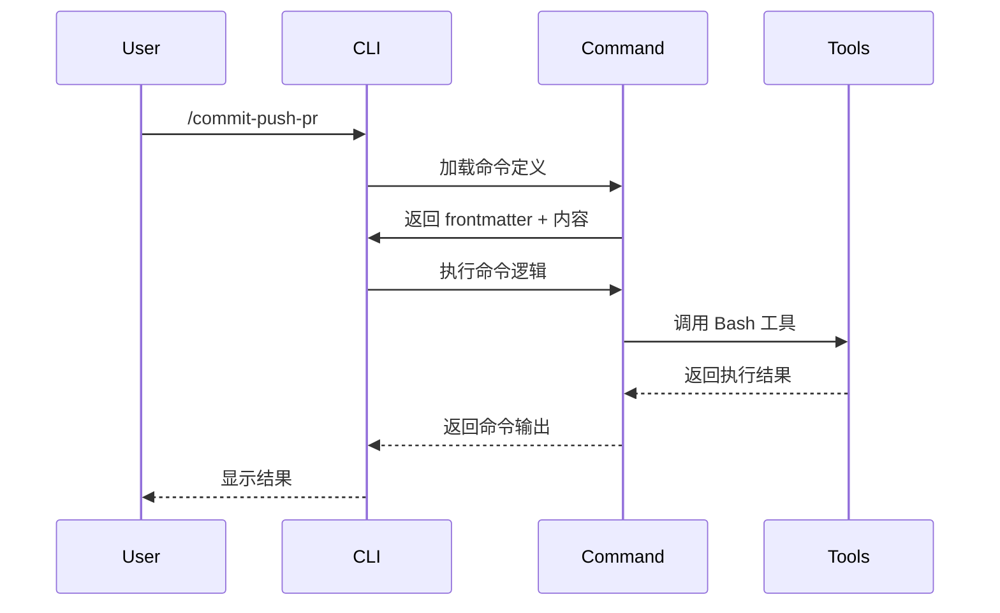
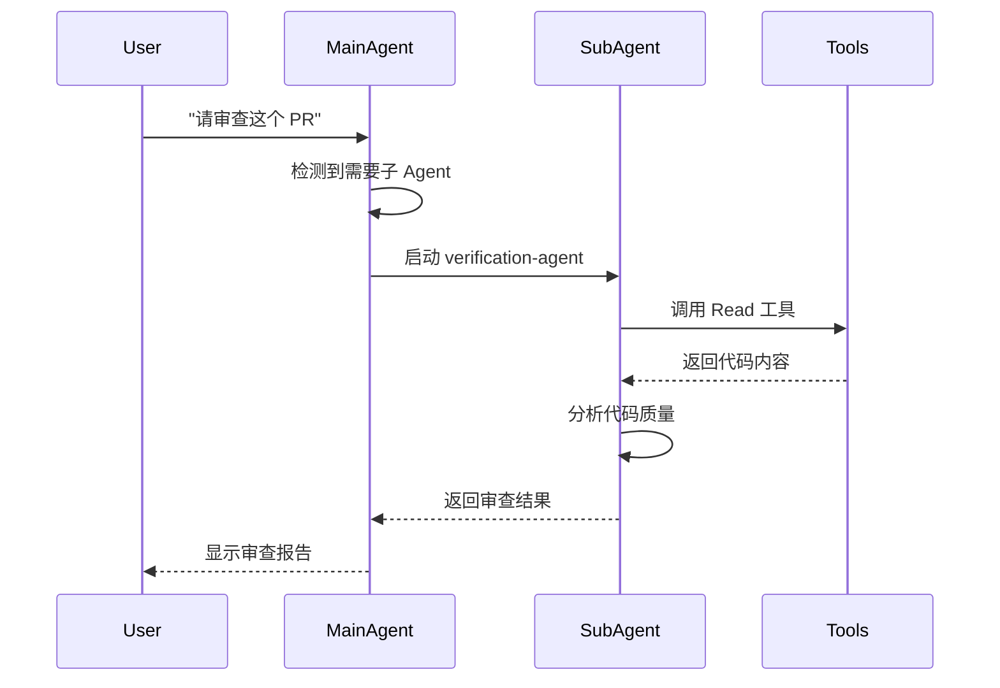
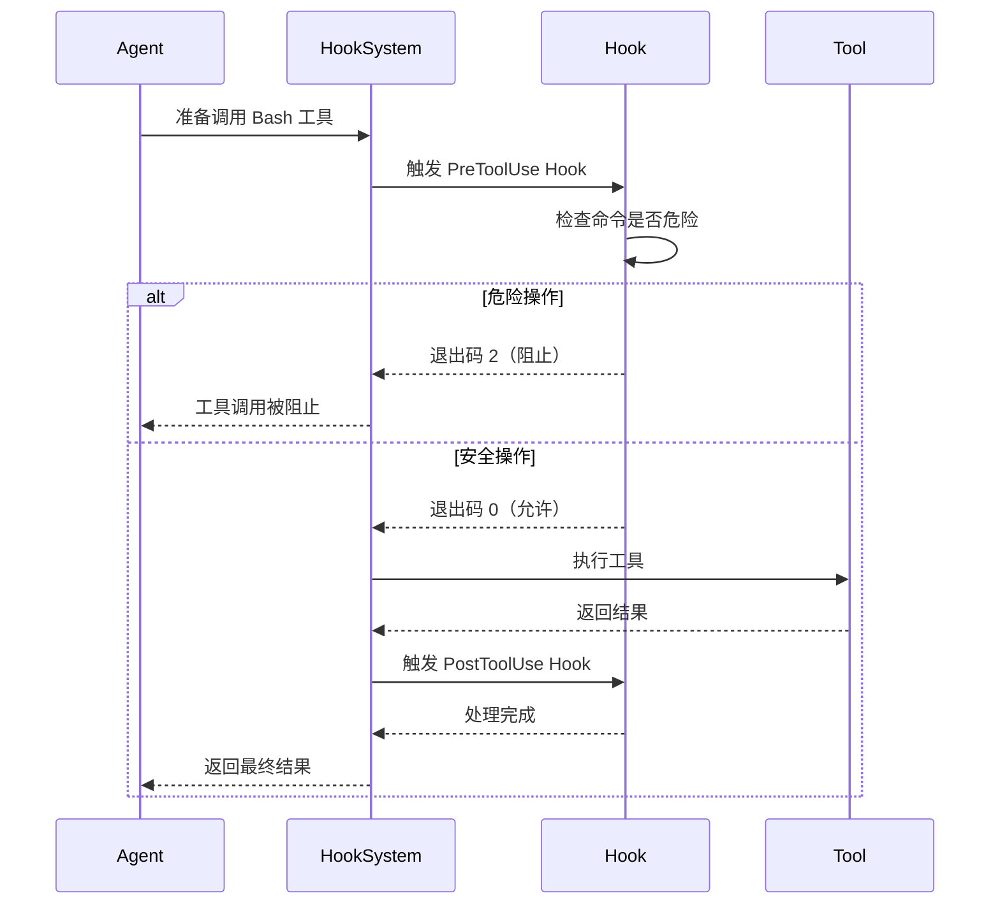
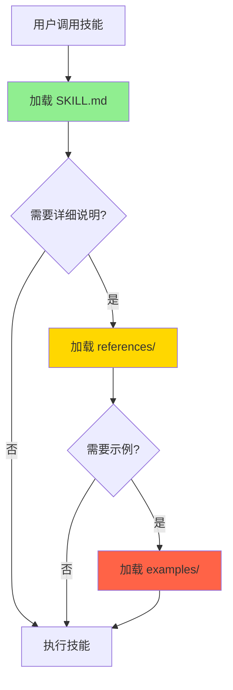
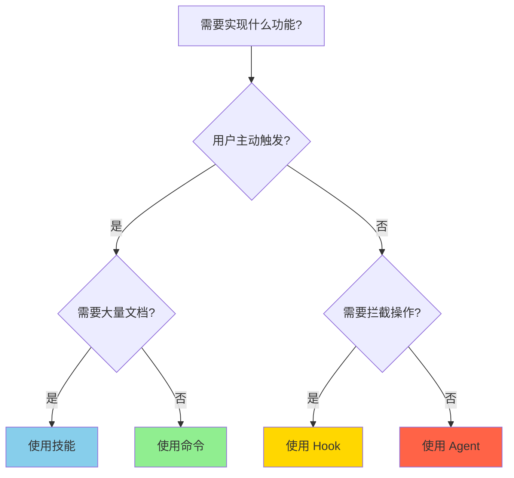
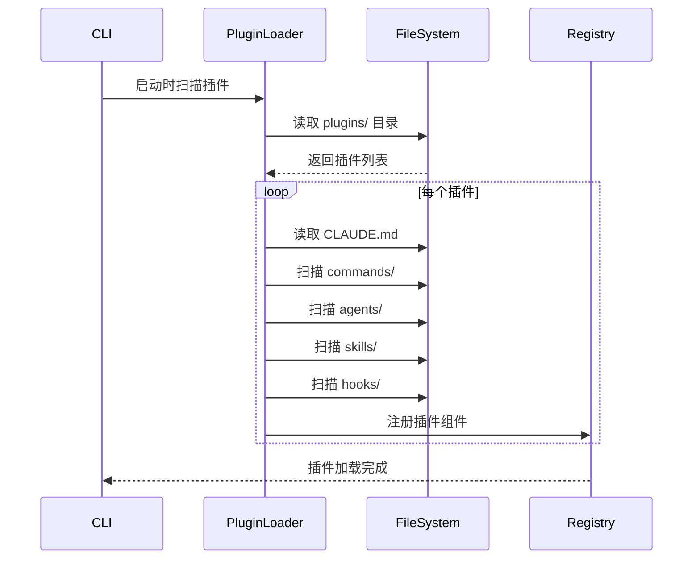
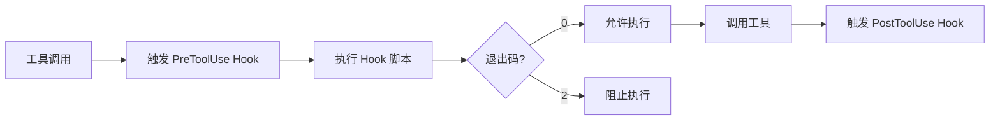

# 第 2 章：插件系统核心概念

## 本章导读

**仓库路径**：`plugins/README.md` + 各插件的 `CLAUDE.md`

**系统职责**：
- 定义插件的四大组件：命令（Command）、Agent、Hook、技能（Skill）
- 说明插件的标准目录结构
- 解释插件加载与执行流程

**能学到什么**：
- 命令 vs Agent vs 技能的区别（何时用哪个）
- Hook 的 9 种事件类型（PreToolUse/PostToolUse/Stop 等）
- YAML frontmatter 的设计模式

---

## 2.1 命令（Command）- 用户可调用的操作

### 什么是命令？

命令是用户可以直接调用的操作，通过 `/command-name` 的方式触发。

**示例**：
```bash
/commit-push-pr
/code-review --comment
/feature-dev "实现用户认证"
```

### 命令的定义

命令使用 Markdown 文件定义，包含 YAML frontmatter：

```markdown
---
description: Commit changes, push to remote, and create a pull request
allowed-tools:
  - Read
  - Write
  - Bash
argument-hint: "[commit message]"
---

# Commit, Push, and Create PR

This command automates the Git workflow:
1. Stage changes
2. Create commit
3. Push to remote
4. Open pull request
```

### Frontmatter 字段说明

| 字段 | 必需 | 说明 | 示例 |
|------|------|------|------|
| `description` | ✅ | 命令的简短描述 | "Commit changes and create PR" |
| `allowed-tools` | ❌ | 允许使用的工具白名单 | `[Read, Write, Bash]` |
| `argument-hint` | ❌ | 参数提示 | "[commit message]" |
| `model` | ❌ | 指定使用的模型 | "claude-opus-4-6" |

### 命令的执行流程



### 何时使用命令？

**使用命令的场景**：
- ✅ 用户需要主动触发的操作
- ✅ 有明确的输入和输出
- ✅ 执行流程相对固定
- ✅ 需要工具白名单控制

**示例**：
- Git 操作：`/commit`, `/push-pr`, `/commit-push-pr`
- 代码审查：`/code-review`
- 特性开发：`/feature-dev`

**不使用命令的场景**：
- ❌ 需要自动触发（用 Hook）
- ❌ 需要复杂的多步骤推理（用 Agent）
- ❌ 需要渐进式披露文档（用技能）

---

## 2.2 Agent - 自主子进程

### 什么是 Agent？

Agent 是自主运行的子进程，可以根据触发条件自动启动，执行复杂的多步骤任务。

**示例**：
```bash
# 用户不需要显式调用，Agent 自动触发
"请帮我审查这个 PR"  # 触发 code-review Agent
"去重这个 Issue"     # 触发 dedupe Agent
```

### Agent 的定义

Agent 使用 Markdown 文件定义，包含触发条件和系统提示词：

```markdown
---
name: verification-agent
description: Verify code review quality
model: claude-sonnet-4-5-20250929
color: blue
---

# Verification Agent

You are a verification agent responsible for ensuring code review quality.

## Your Task
1. Read the code review comments
2. Check if all issues are addressed
3. Verify the review follows best practices
4. Report any missing items

## Guidelines
- Be thorough but concise
- Focus on critical issues
- Provide actionable feedback
```

### Frontmatter 字段说明

| 字段 | 必需 | 说明 | 示例 |
|------|------|------|------|
| `name` | ✅ | Agent 的唯一标识 | "verification-agent" |
| `description` | ✅ | Agent 的简短描述 | "Verify code review quality" |
| `model` | ❌ | 指定使用的模型 | "claude-opus-4-6" |
| `color` | ❌ | UI 显示颜色 | "blue" |
| `isolation` | ❌ | 隔离模式 | "worktree" |

### Agent 的执行流程



### 何时使用 Agent？

**使用 Agent 的场景**：
- ✅ 需要复杂的多步骤推理
- ✅ 需要自动触发（根据用户意图）
- ✅ 需要并行执行（多个 Agent 协作）
- ✅ 需要隔离环境（worktree）

**示例**：
- 代码审查：`verification-agent`（验证审查质量）
- Issue 去重：5 个并行搜索 Agent
- PR 审查：6 个专业领域 Agent（安全/性能/可读性等）

**不使用 Agent 的场景**：
- ❌ 简单的单步操作（用命令）
- ❌ 需要拦截工具调用（用 Hook）
- ❌ 需要大量参考文档（用技能）

---

## 2.3 Hook - 生命周期事件拦截

### 什么是 Hook？

Hook 是在特定生命周期事件触发的脚本，可以拦截、修改或阻止操作。

**示例**：
```python
# PreToolUse Hook - 在工具执行前拦截
if tool_name == "Bash" and "rm -rf" in arguments:
    print("⚠️  危险操作：rm -rf")
    sys.exit(2)  # 退出码 2 阻止工具执行
```

### 9 种 Hook 事件

| Hook 类型 | 触发时机 | 可以做什么 | 退出码 |
|-----------|---------|-----------|--------|
| **PreToolUse** | 工具执行前 | 拦截、修改参数、阻止执行 | 2=阻止 |
| **PostToolUse** | 工具执行后 | 处理结果、记录日志 | - |
| **Stop** | 会话退出前 | 清理资源、保存状态、阻止退出 | 2=阻止 |
| **SubagentStop** | 子 Agent 退出前 | 验证结果、阻止退出 | 2=阻止 |
| **SessionStart** | 会话开始时 | 注入系统提示词、初始化状态 | - |
| **SessionEnd** | 会话结束时 | 清理资源、保存日志 | - |
| **UserPromptSubmit** | 用户提交提示时 | 预处理输入、添加上下文 | - |
| **PreCompact** | 上下文压缩前 | 保留关键信息 | - |
| **Notification** | 外部通知时 | 处理外部事件 | - |

### Hook 的实现

Hook 使用 Python 或 Shell 脚本实现：

**Python 示例**（`hooks/pre_tool_use.py`）：
```python
#!/usr/bin/env python3
import sys
import json

# 读取 Hook 输入
hook_input = json.loads(sys.stdin.read())
tool_name = hook_input.get("tool_name")
arguments = hook_input.get("arguments", {})

# 检查危险操作
if tool_name == "Bash":
    command = arguments.get("command", "")
    if "rm -rf /" in command:
        print("⚠️  危险操作：rm -rf /")
        print("此操作已被阻止")
        sys.exit(2)  # 退出码 2 阻止工具执行

# 允许执行
sys.exit(0)
```

**Shell 示例**（`hooks/session_start.sh`）：
```bash
#!/bin/bash

# 注入系统提示词
cat <<EOF
You are in explanatory output style mode.

Please:
- Explain your reasoning step by step
- Use clear, educational language
- Provide examples when helpful
EOF

exit 0
```

### Hook 的执行流程



### 何时使用 Hook？

**使用 Hook 的场景**：
- ✅ 需要拦截工具调用（安全检查）
- ✅ 需要修改工具参数（预处理）
- ✅ 需要处理工具结果（后处理）
- ✅ 需要注入系统提示词（改变行为）
- ✅ 需要在特定生命周期节点执行逻辑

**示例**：
- 安全检查：`security-guidance`（检测 SQL 注入/XSS）
- 规则引擎：`hookify`（自定义规则匹配）
- 输出风格：`explanatory-output-style`（注入提示词）
- 自引用循环：`ralph-wiggum`（阻止退出）

**不使用 Hook 的场景**：
- ❌ 用户主动触发的操作（用命令）
- ❌ 复杂的多步骤推理（用 Agent）
- ❌ 需要大量文档（用技能）

---

## 2.4 技能（Skill）- 渐进式披露的知识库

### 什么是技能？

技能是一种特殊的命令，使用渐进式披露的方式提供大量参考文档和示例。

**示例**：
```bash
/plugin-dev:create-plugin "数据库迁移插件"
/new-sdk-app my-agent
```

### 技能的目录结构

```bash
skills/create-plugin/
├── SKILL.md              # 第一层：元数据
├── references/           # 第二层：参考文档
│   ├── overview.md
│   ├── frontmatter-fields.md
│   ├── hook-migration.md
│   ├── mcp-auth.md
│   └── manifest-fields.md
├── examples/             # 第三层：示例代码
│   ├── basic-plugin.md
│   ├── hook-example.md
│   └── agent-example.md
└── scripts/              # 第四层：工具脚本
    ├── validate.sh
    └── test.sh
```

### 三层加载机制



### SKILL.md 的定义

```markdown
---
name: create-plugin
description: Create a new Claude Code plugin with guided workflow
category: plugin-development
difficulty: intermediate
estimated-time: 30-60 minutes
---

# Create Plugin Skill

This skill guides you through creating a new Claude Code plugin.

## What You'll Learn
- Plugin directory structure
- Command and Agent definitions
- Hook implementation
- Testing and validation

## Prerequisites
- Basic understanding of Markdown
- Familiarity with YAML frontmatter
- Python or Shell scripting (for Hooks)

## Steps
1. Define plugin structure
2. Create commands
3. Add Agents (optional)
4. Implement Hooks (optional)
5. Write tests
6. Validate plugin
7. Publish to Marketplace
```

### 何时使用技能？

**使用技能的场景**：
- ✅ 需要大量参考文档（20+ 页）
- ✅ 需要示例代码（10+ 个示例）
- ✅ 需要分步指导（工作流）
- ✅ 需要渐进式披露（避免信息过载）

**示例**：
- 插件开发：`plugin-dev`（7 个技能 + 60+ 文件）
- SDK 开发：`agent-sdk-dev`（TypeScript/Python 双语言）
- 前端设计：`frontend-design`（生产级设计指南）
- Opus 迁移：`claude-opus-4-5-migration`（6 步迁移指南）

**不使用技能的场景**：
- ❌ 简单的单步操作（用命令）
- ❌ 需要自动触发（用 Agent）
- ❌ 需要拦截工具调用（用 Hook）

---

## 2.5 四大组件对比

### 对比表

| 特性 | 命令 | Agent | Hook | 技能 |
|------|------|-------|------|------|
| **触发方式** | 用户主动调用 | 自动触发 | 事件驱动 | 用户主动调用 |
| **执行环境** | 主进程 | 子进程 | 主进程 | 主进程 |
| **复杂度** | 简单 | 复杂 | 中等 | 复杂 |
| **文档量** | 少（1 个文件） | 少（1 个文件） | 少（1 个文件） | 多（10+ 文件） |
| **工具白名单** | ✅ 支持 | ✅ 支持 | ❌ 不适用 | ✅ 支持 |
| **可阻止操作** | ❌ 否 | ❌ 否 | ✅ 是 | ❌ 否 |
| **并行执行** | ❌ 否 | ✅ 是 | ❌ 否 | ❌ 否 |
| **隔离环境** | ❌ 否 | ✅ 是（worktree） | ❌ 否 | ❌ 否 |

### 决策树



### 实际案例

| 功能 | 选择 | 原因 |
|------|------|------|
| Git 提交并创建 PR | 命令 | 用户主动触发，流程固定 |
| 代码审查验证 | Agent | 需要复杂推理，自动触发 |
| 危险命令检测 | Hook | 需要拦截工具调用 |
| 插件开发指南 | 技能 | 需要大量文档和示例 |
| Issue 去重 | Agent | 需要并行搜索，复杂推理 |
| 安全检查 | Hook | 需要在工具执行前拦截 |
| 7 阶段开发工作流 | 命令 | 用户主动触发，有明确步骤 |
| 输出风格改变 | Hook | 需要注入系统提示词 |

---

## 2.6 插件的标准目录结构

### 完整结构

```bash
plugins/my-plugin/
├── CLAUDE.md                 # 插件文档（必需）
├── commands/                 # 命令目录（可选）
│   ├── my-command.md
│   └── another-command.md
├── agents/                   # Agent 目录（可选）
│   ├── my-agent.md
│   └── verification-agent.md
├── skills/                   # 技能目录（可选）
│   └── my-skill/
│       ├── SKILL.md
│       ├── references/
│       ├── examples/
│       └── scripts/
├── hooks/                    # Hook 目录（可选）
│   ├── pre_tool_use.py
│   ├── post_tool_use.py
│   └── session_start.sh
├── rules/                    # 规则目录（可选，hookify 专用）
│   └── my-rule.json
└── tests/                    # 测试目录（可选）
    └── test_plugin.sh
```

### 最小插件

一个最小的插件只需要：

```bash
plugins/my-plugin/
├── CLAUDE.md                 # 插件文档
└── commands/                 # 至少一个命令
    └── my-command.md
```

### 约定规则

1. **目录名即插件名**：`plugins/my-plugin/` → 插件名是 `my-plugin`
2. **CLAUDE.md 必需**：每个插件必须有文档
3. **至少一个组件**：必须包含 commands/agents/skills/hooks 之一
4. **文件名即标识**：`commands/my-command.md` → 命令名是 `my-command`
5. **Markdown 优先**：命令/Agent/技能使用 Markdown 定义
6. **脚本语言灵活**：Hook 可以用 Python 或 Shell

---

## 2.7 插件加载流程

### 加载流程图



### 加载步骤

1. **扫描 `plugins/` 目录**
   ```python
   plugin_dirs = os.listdir("plugins/")
   # ['hookify', 'code-review', 'commit-commands', ...]
   ```

2. **读取 `CLAUDE.md`**
   ```python
   with open("plugins/hookify/CLAUDE.md") as f:
       plugin_doc = f.read()
   ```

3. **扫描组件目录**
   ```python
   commands = glob("plugins/hookify/commands/*.md")
   agents = glob("plugins/hookify/agents/*.md")
   skills = glob("plugins/hookify/skills/*/SKILL.md")
   hooks = glob("plugins/hookify/hooks/*.py")
   ```

4. **解析 frontmatter**
   ```python
   import yaml

   with open("plugins/hookify/commands/hookify.md") as f:
       content = f.read()
       frontmatter, body = parse_frontmatter(content)
       # frontmatter = {
       #     'description': '...',
       #     'allowed-tools': ['Read', 'Write']
       # }
   ```

5. **注册到系统**
   ```python
   registry.register_command(
       name="hookify",
       plugin="hookify",
       description=frontmatter['description'],
       allowed_tools=frontmatter.get('allowed-tools', []),
       content=body
   )
   ```

### 执行流程

**命令执行**：


**Hook 执行**：


---

## 2.8 YAML Frontmatter 设计模式

### 为什么用 YAML Frontmatter？

**传统方式**（需要编译）：
```typescript
class MyCommand {
  name = 'my-command';
  description = 'My command description';
  allowedTools = ['Read', 'Write'];
}
```

**Claude Code 方式**（零编译）：
```markdown
---
description: My command description
allowed-tools:
  - Read
  - Write
---

# My Command
```

**优势**：
1. **人类可读**：Markdown 格式，易于编辑
2. **机器可解析**：YAML 结构化，易于解析
3. **零编译**：直接加载，无需构建步骤
4. **文档即代码**：文档和元数据在一起

### 常用字段

| 字段 | 类型 | 适用组件 | 说明 |
|------|------|---------|------|
| `description` | string | 命令/Agent/技能 | 简短描述 |
| `allowed-tools` | array | 命令/技能 | 工具白名单 |
| `argument-hint` | string | 命令 | 参数提示 |
| `model` | string | 命令/Agent | 指定模型 |
| `name` | string | Agent/技能 | 唯一标识 |
| `color` | string | Agent | UI 颜色 |
| `isolation` | string | Agent | 隔离模式 |
| `category` | string | 技能 | 分类 |
| `difficulty` | string | 技能 | 难度 |
| `estimated-time` | string | 技能 | 预计时间 |

### 最佳实践

1. **保持简洁**：只包含必需字段
2. **使用数组**：多个值用 YAML 数组
3. **引号可选**：简单字符串不需要引号
4. **缩进一致**：使用 2 空格缩进
5. **注释清晰**：用 `#` 添加注释

**好的示例**：
```yaml
---
description: Commit changes and create PR
allowed-tools:
  - Read
  - Write
  - Bash
argument-hint: "[commit message]"
model: claude-opus-4-6
---
```

**不好的示例**：
```yaml
---
description: "Commit changes and create PR"  # 不需要引号
allowed-tools: ["Read", "Write", "Bash"]     # 不推荐单行数组
argument-hint: [commit message]              # 缺少引号
model: "claude-opus-4-6"                     # 不需要引号
extra-field: "unused"                        # 不需要的字段
---
```

---

## 2.9 实践：创建一个简单插件

### 任务：创建 "hello-world" 插件

**目标**：创建一个最简单的插件，包含一个命令。

**步骤 1：创建目录结构**
```bash
mkdir -p plugins/hello-world/commands
```

**步骤 2：创建 CLAUDE.md**
```bash
cat > plugins/hello-world/CLAUDE.md <<'EOF'
# Hello World Plugin

A simple example plugin for learning purposes.

## Components
- 1 command: `hello`

## Usage
```bash
/hello
```
EOF
```

**步骤 3：创建命令**
```bash
cat > plugins/hello-world/commands/hello.md <<'EOF'
---
description: Say hello to the world
allowed-tools:
  - Read
---

# Hello Command

Please say "Hello, World!" and explain what this plugin does.
EOF
```

**步骤 4：测试插件**
```bash
# 启动 Claude Code
claude

# 使用命令
/hello
```

**预期输出**：
```
Hello, World!

This is a simple example plugin that demonstrates the basic structure
of a Claude Code plugin. It contains a single command that uses the
Read tool to access files.
```

---

## 2.10 小结

### 核心要点

1. **四大组件**：
   - 命令：用户主动触发，流程固定
   - Agent：自动触发，复杂推理
   - Hook：事件驱动，拦截操作
   - 技能：渐进式披露，大量文档

2. **标准目录结构**：
   - `commands/` - 命令定义
   - `agents/` - Agent 定义
   - `skills/` - 技能定义
   - `hooks/` - Hook 实现
   - `CLAUDE.md` - 插件文档

3. **YAML Frontmatter**：
   - 人类可读，机器可解析
   - 零编译，直接加载
   - 文档即代码

4. **插件加载**：
   - 约定优于配置
   - 自动扫描目录
   - 解析 frontmatter
   - 注册到系统

### 与其他章节的关联

- **第 1 章**：理解了整体架构，现在深入组件细节
- **第 4-6 章**：分析基础插件的实现（hookify/commit-commands/security-guidance）
- **第 9 章**：使用 plugin-dev 工具包开发插件
- **第 19 章**：从零开发一个完整插件

### 延伸阅读

- [plugins/README.md](/plugins/) - 插件总览
- [第 4 章：hookify](/docs/part2/chapter04) - 规则引擎实现
- [第 9 章：plugin-dev](/docs/part3/chapter09) - 插件开发工具包

---

## 下一章

[第 3 章：开发环境与配置](/docs/part1/chapter03) - 理解三种安全策略、DevContainer 配置、Bash 沙箱实现。
