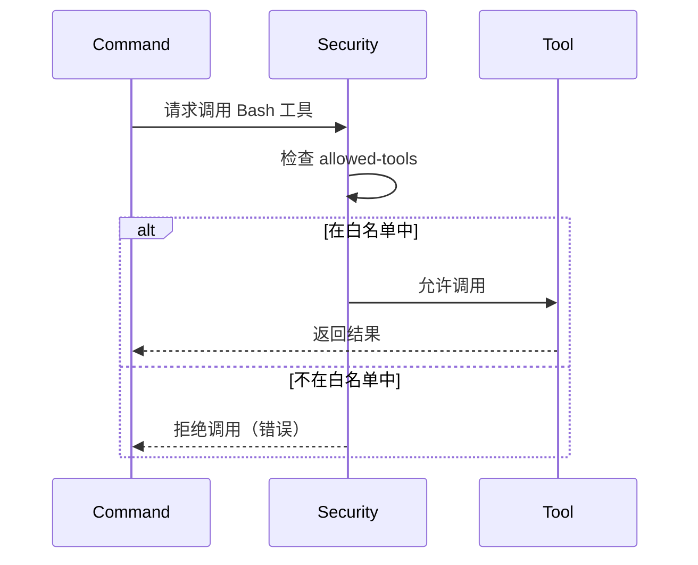
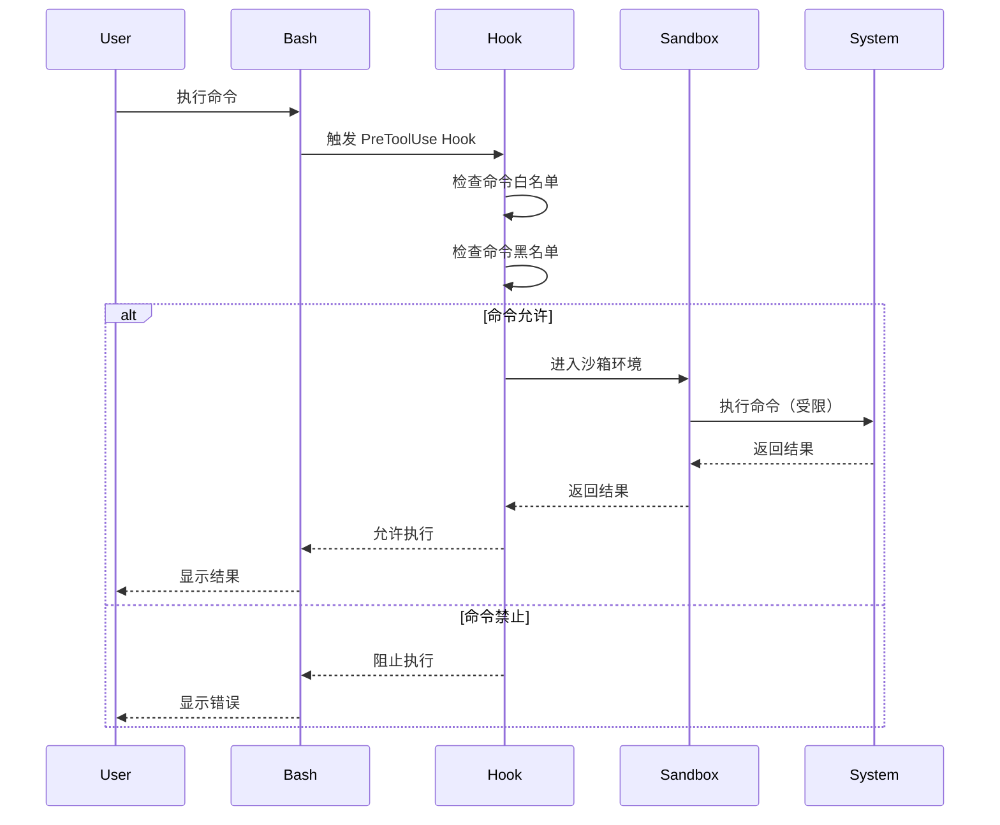
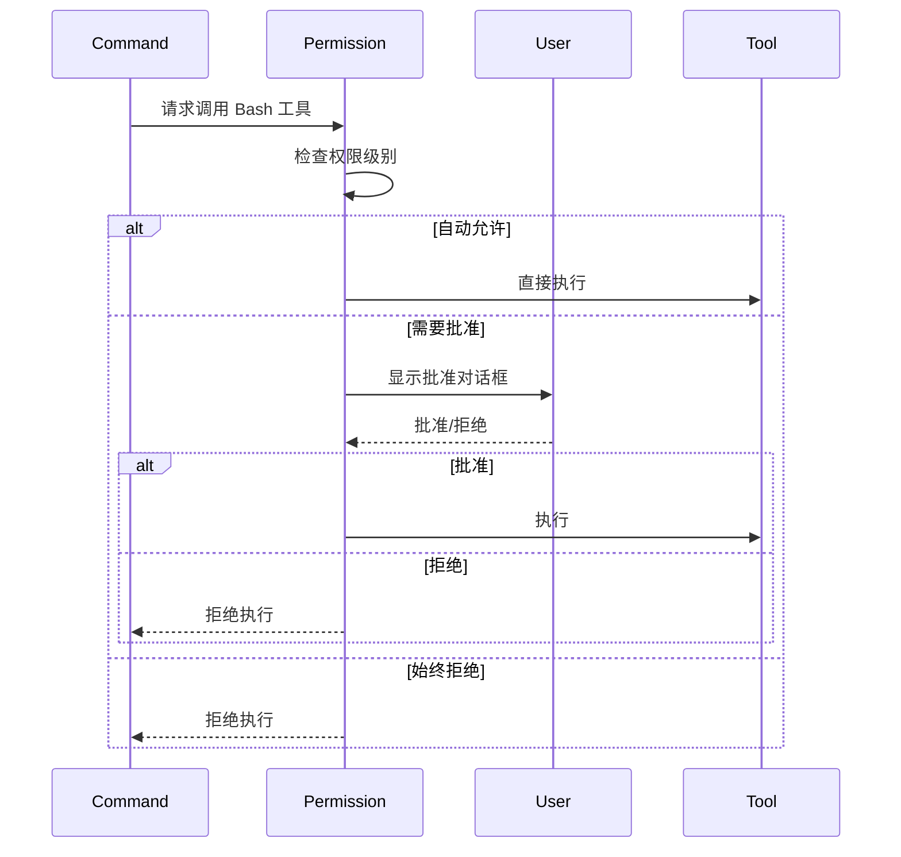

# 第 3 章：开发环境与配置

## 本章导读

**仓库路径**：`.devcontainer/` + `examples/settings/`

**系统职责**：
- 提供 Docker/Podman 开发容器
- 定义三种安全策略（lax/strict/sandbox）
- 配置防火墙沙箱

**能学到什么**：
- 如何用 DevContainer 隔离开发环境
- 安全配置的三档设计（工具白名单、权限控制）
- Bash 沙箱的实现原理

---

## 3.1 DevContainer 配置

### 什么是 DevContainer？

DevContainer（Development Container）是一种使用容器技术隔离开发环境的方式。Claude Code 提供了完整的 DevContainer 配置，支持 Docker 和 Podman 双后端。

### 目录结构

```bash
.devcontainer/
├── CLAUDE.md              # DevContainer 文档
├── devcontainer.json      # VS Code DevContainer 配置
├── Dockerfile             # 容器镜像定义
└── setup.sh               # 容器初始化脚本
```

### devcontainer.json 配置

```json
{
  "name": "Claude Code Development",
  "build": {
    "dockerfile": "Dockerfile",
    "context": ".."
  },
  "customizations": {
    "vscode": {
      "extensions": [
        "ms-python.python",
        "ms-vscode.makefile-tools",
        "timonwong.shellcheck"
      ],
      "settings": {
        "terminal.integrated.defaultProfile.linux": "bash"
      }
    }
  },
  "postCreateCommand": "bash .devcontainer/setup.sh",
  "remoteUser": "vscode"
}
```

### Dockerfile 分析

```dockerfile
FROM mcr.microsoft.com/vscode/devcontainers/base:ubuntu

# 安装依赖
RUN apt-get update && apt-get install -y \
    python3 \
    python3-pip \
    nodejs \
    npm \
    git \
    curl \
    && rm -rf /var/lib/apt/lists/*

# 安装 Claude Code
RUN curl -fsSL https://claude.ai/install.sh | bash

# 配置防火墙沙箱（可选）
RUN apt-get update && apt-get install -y \
    iptables \
    && rm -rf /var/lib/apt/lists/*

# 创建工作目录
WORKDIR /workspace

# 设置用户
USER vscode
```

### 为什么使用 DevContainer？

**优势**：
1. **环境隔离**：容器内的操作不影响宿主机
2. **一致性**：所有开发者使用相同的环境
3. **安全性**：可以配置防火墙规则限制网络访问
4. **可复现**：环境配置代码化，易于复现

**适用场景**：
- ✅ 开发 Claude Code 插件
- ✅ 测试危险操作（rm -rf 等）
- ✅ 需要特定版本的依赖
- ✅ 多人协作开发

---

## 3.2 三种安全策略

Claude Code 提供三种预置的安全配置，分别适用于不同的场景。

### 配置文件位置

```bash
examples/settings/
├── settings-lax.json           # 宽松模式
├── settings-strict.json        # 严格模式
└── settings-bash-sandbox.json  # 沙箱模式
```

### 3.2.1 Lax 模式（宽松）

**适用场景**：开发环境，需要灵活性

**配置内容**：
```json
{
  "security": {
    "allowBypass": false,
    "allowMarketplace": false
  },
  "tools": {
    "allowedTools": "*"
  },
  "hooks": {
    "enabled": true,
    "allowUnmanaged": true
  }
}
```

**特点**：
- ❌ 禁用 bypass（不能跳过安全检查）
- ❌ 禁用 Marketplace（不能安装未审核的插件）
- ✅ 允许所有工具
- ✅ 允许未受管的 Hook

**权衡**：
- **灵活性**：⭐⭐⭐⭐⭐
- **安全性**：⭐⭐⭐

---

### 3.2.2 Strict 模式（严格）

**适用场景**：生产环境，需要高安全性

**配置内容**：
```json
{
  "security": {
    "allowBypass": false,
    "allowMarketplace": false,
    "allowWebTools": false
  },
  "tools": {
    "allowedTools": [
      "Read",
      "Write",
      "Edit",
      "Bash",
      "Glob",
      "Grep"
    ]
  },
  "hooks": {
    "enabled": true,
    "allowUnmanaged": false,
    "managedHooks": [
      "hookify",
      "security-guidance"
    ]
  },
  "permissions": {
    "requireApproval": [
      "Bash",
      "Write",
      "Edit"
    ]
  }
}
```

**特点**：
- ❌ 禁用 bypass
- ❌ 禁用 Marketplace
- ❌ 禁用 Web 工具（WebFetch/WebSearch）
- ✅ 仅允许白名单工具
- ✅ 仅允许受管 Hook
- ✅ 危险操作需要用户批准

**权衡**：
- **灵活性**：⭐⭐
- **安全性**：⭐⭐⭐⭐⭐

---

### 3.2.3 Sandbox 模式（沙箱）

**适用场景**：高安全环境，需要网络隔离

**配置内容**：
```json
{
  "security": {
    "allowBypass": false,
    "allowMarketplace": false,
    "allowWebTools": false
  },
  "tools": {
    "allowedTools": [
      "Read",
      "Write",
      "Edit",
      "Bash",
      "Glob",
      "Grep"
    ]
  },
  "bash": {
    "sandbox": true,
    "allowedCommands": [
      "ls",
      "cat",
      "grep",
      "git",
      "npm",
      "python3"
    ],
    "blockedCommands": [
      "rm -rf /",
      "dd",
      "mkfs",
      "fdisk"
    ],
    "networkIsolation": true
  },
  "hooks": {
    "enabled": true,
    "allowUnmanaged": false,
    "managedHooks": [
      "security-guidance"
    ]
  }
}
```

**特点**：
- ❌ 禁用 bypass
- ❌ 禁用 Marketplace
- ❌ 禁用 Web 工具
- ✅ 强制 Bash 沙箱
- ✅ 命令白名单
- ✅ 网络隔离

**权衡**：
- **灵活性**：⭐
- **安全性**：⭐⭐⭐⭐⭐

---

### 三种模式对比

| 特性 | Lax | Strict | Sandbox |
|------|-----|--------|---------|
| **允许所有工具** | ✅ | ❌ | ❌ |
| **工具白名单** | - | ✅ | ✅ |
| **允许 Web 工具** | ✅ | ❌ | ❌ |
| **允许未受管 Hook** | ✅ | ❌ | ❌ |
| **危险操作需批准** | ❌ | ✅ | ✅ |
| **Bash 沙箱** | ❌ | ❌ | ✅ |
| **命令白名单** | ❌ | ❌ | ✅ |
| **网络隔离** | ❌ | ❌ | ✅ |
| **适用场景** | 开发 | 生产 | 高安全 |

---

## 3.3 工具白名单机制

### 什么是工具白名单？

工具白名单是一种安全机制，限制插件只能使用声明的工具。

### 工作原理

**命令定义**：
```markdown
---
description: Commit changes and create PR
allowed-tools:
  - Read
  - Write
  - Bash
---

# Commit Push PR Command
```

**执行流程**：


### 内置工具列表

| 工具 | 功能 | 风险等级 |
|------|------|---------|
| **Read** | 读取文件 | 低 |
| **Write** | 写入文件 | 中 |
| **Edit** | 编辑文件 | 中 |
| **Bash** | 执行 Shell 命令 | 高 |
| **Glob** | 文件模式匹配 | 低 |
| **Grep** | 内容搜索 | 低 |
| **WebFetch** | 获取网页内容 | 中 |
| **WebSearch** | 搜索网页 | 中 |
| **Agent** | 启动子 Agent | 中 |
| **AskUserQuestion** | 询问用户 | 低 |

### 最佳实践

**最小权限原则**：
```markdown
# ❌ 不好：允许所有工具
---
allowed-tools: "*"
---

# ✅ 好：只允许需要的工具
---
allowed-tools:
  - Read
  - Grep
---
```

**分级授权**：
```markdown
# 只读命令
---
allowed-tools:
  - Read
  - Glob
  - Grep
---

# 读写命令
---
allowed-tools:
  - Read
  - Write
  - Edit
---

# 危险命令（需要用户批准）
---
allowed-tools:
  - Read
  - Write
  - Bash
---
```

---

## 3.4 Bash 沙箱实现

### 什么是 Bash 沙箱？

Bash 沙箱是一种限制 Shell 命令执行的机制，通过命令白名单和网络隔离来提高安全性。

### 实现原理

**1. 命令拦截**

在 Bash 工具执行前，Hook 拦截命令：

```python
# hooks/bash_sandbox.py
import sys
import json
import re

# 读取 Hook 输入
hook_input = json.loads(sys.stdin.read())
command = hook_input.get("arguments", {}).get("command", "")

# 命令白名单
ALLOWED_COMMANDS = [
    "ls", "cat", "grep", "git", "npm", "python3"
]

# 命令黑名单
BLOCKED_COMMANDS = [
    r"rm\s+-rf\s+/",
    r"dd\s+",
    r"mkfs",
    r"fdisk"
]

# 检查黑名单
for pattern in BLOCKED_COMMANDS:
    if re.search(pattern, command):
        print(f"⚠️  危险操作被阻止：{command}")
        sys.exit(2)

# 检查白名单
command_name = command.split()[0]
if command_name not in ALLOWED_COMMANDS:
    print(f"⚠️  命令不在白名单中：{command_name}")
    sys.exit(2)

# 允许执行
sys.exit(0)
```

**2. 网络隔离**

使用 iptables 限制网络访问：

```bash
# setup-network-isolation.sh
#!/bin/bash

# 禁止所有出站连接
iptables -P OUTPUT DROP

# 允许本地回环
iptables -A OUTPUT -o lo -j ACCEPT

# 允许已建立的连接
iptables -A OUTPUT -m state --state ESTABLISHED,RELATED -j ACCEPT

# 允许 DNS（可选）
iptables -A OUTPUT -p udp --dport 53 -j ACCEPT

# 允许特定域名（可选）
# iptables -A OUTPUT -d github.com -j ACCEPT
```

**3. 文件系统隔离**

使用 chroot 限制文件系统访问：

```bash
# setup-chroot.sh
#!/bin/bash

# 创建 chroot 环境
mkdir -p /tmp/sandbox/{bin,lib,lib64,usr,proc,dev}

# 复制必要的二进制文件
cp /bin/bash /tmp/sandbox/bin/
cp /bin/ls /tmp/sandbox/bin/
cp /bin/cat /tmp/sandbox/bin/

# 复制必要的库文件
ldd /bin/bash | grep -o '/lib[^ ]*' | xargs -I {} cp {} /tmp/sandbox/lib/

# 挂载 proc 和 dev
mount -t proc proc /tmp/sandbox/proc
mount --bind /dev /tmp/sandbox/dev

# 进入 chroot 环境
chroot /tmp/sandbox /bin/bash
```

### 沙箱执行流程



---

## 3.5 权限控制机制

### 权限级别

Claude Code 定义了三种权限级别：

| 级别 | 说明 | 示例工具 |
|------|------|---------|
| **自动允许** | 无风险，自动执行 | Read, Glob, Grep |
| **需要批准** | 有风险，需要用户确认 | Write, Edit, Bash |
| **始终拒绝** | 高风险，始终拒绝 | - |

### 配置权限

**在 settings.json 中配置**：
```json
{
  "permissions": {
    "autoAllow": [
      "Read",
      "Glob",
      "Grep"
    ],
    "requireApproval": [
      "Write",
      "Edit",
      "Bash"
    ],
    "alwaysDeny": []
  }
}
```

### 用户批准流程



---

## 3.6 PowerShell 启动脚本（Windows）

### 脚本位置

```bash
Script/run_devcontainer_claude_code.ps1
```

### 脚本功能

1. **检测容器后端**（Docker/Podman）
2. **构建容器镜像**
3. **启动容器**
4. **挂载工作目录**
5. **配置网络隔离**（可选）

### 脚本内容

```powershell
# run_devcontainer_claude_code.ps1
param(
    [Parameter(Mandatory=$false)]
    [ValidateSet("docker", "podman")]
    [string]$Backend = "docker"
)

Write-Host "Starting Claude Code DevContainer with $Backend..." -ForegroundColor Green

# 检查后端是否安装
$backendPath = Get-Command $Backend -ErrorAction SilentlyContinue
if (-not $backendPath) {
    Write-Host "Error: $Backend is not installed" -ForegroundColor Red
    exit 1
}

# 构建镜像
Write-Host "Building container image..." -ForegroundColor Yellow
& $Backend build -t claude-code-dev -f .devcontainer/Dockerfile .

# 启动容器
Write-Host "Starting container..." -ForegroundColor Yellow
& $Backend run -it --rm `
    -v "${PWD}:/workspace" `
    -w /workspace `
    --name claude-code-dev `
    claude-code-dev

Write-Host "Container stopped" -ForegroundColor Green
```

### 使用方法

```powershell
# 使用 Docker
.\Script\run_devcontainer_claude_code.ps1 -Backend docker

# 使用 Podman
.\Script\run_devcontainer_claude_code.ps1 -Backend podman
```

---

## 3.7 VS Code 集成

### extensions.json 配置

```json
{
  "recommendations": [
    "ms-python.python",
    "ms-vscode.makefile-tools",
    "timonwong.shellcheck",
    "yzhang.markdown-all-in-one",
    "redhat.vscode-yaml"
  ]
}
```

### 推荐插件说明

| 插件 | 功能 | 为什么需要 |
|------|------|-----------|
| **Python** | Python 语言支持 | Hook 使用 Python 实现 |
| **Makefile Tools** | Makefile 支持 | 构建脚本 |
| **ShellCheck** | Shell 脚本检查 | Hook 使用 Shell 实现 |
| **Markdown All in One** | Markdown 增强 | 命令/Agent 使用 Markdown |
| **YAML** | YAML 语言支持 | frontmatter 使用 YAML |

### 使用 DevContainer

**步骤 1：打开项目**
```bash
code .
```

**步骤 2：重新打开在容器中**
- 命令面板（Cmd/Ctrl + Shift + P）
- 输入 "Remote-Containers: Reopen in Container"
- 等待容器构建和启动

**步骤 3：开始开发**
- 容器内的终端自动配置
- 所有依赖已安装
- 防火墙沙箱已配置

---

## 3.8 实践：配置安全策略

### 任务 1：使用 Lax 模式

```bash
# 复制配置文件
cp examples/settings/settings-lax.json ~/.claude/settings.json

# 启动 Claude Code
claude

# 测试：所有工具都可用
/commit-push-pr
```

### 任务 2：使用 Strict 模式

```bash
# 复制配置文件
cp examples/settings/settings-strict.json ~/.claude/settings.json

# 启动 Claude Code
claude

# 测试：危险操作需要批准
/commit-push-pr  # 会提示批准 Bash 工具
```

### 任务 3：使用 Sandbox 模式

```bash
# 复制配置文件
cp examples/settings/settings-bash-sandbox.json ~/.claude/settings.json

# 启动 Claude Code
claude

# 测试：危险命令被阻止
# 尝试执行 "rm -rf /" 会被拦截
```

### 任务 4：自定义配置

创建自己的配置文件：

```json
{
  "security": {
    "allowBypass": false,
    "allowMarketplace": true
  },
  "tools": {
    "allowedTools": [
      "Read",
      "Write",
      "Bash",
      "Glob",
      "Grep"
    ]
  },
  "hooks": {
    "enabled": true,
    "allowUnmanaged": false,
    "managedHooks": [
      "hookify",
      "security-guidance"
    ]
  },
  "permissions": {
    "autoAllow": [
      "Read",
      "Glob",
      "Grep"
    ],
    "requireApproval": [
      "Write",
      "Bash"
    ]
  }
}
```

---

## 3.9 架构洞察

### 洞察 1：分级安全策略

**为什么需要三档配置？**

**Linus 式思考**：
> "安全不是二元的（安全/不安全），而是一个权衡。开发环境需要灵活性，生产环境需要安全性。"

**权衡**：
- **Lax**：灵活性 > 安全性（开发）
- **Strict**：安全性 > 灵活性（生产）
- **Sandbox**：安全性 >> 灵活性（高安全）

**这不是特殊情况**，这是三个不同的使用场景。

---

### 洞察 2：工具白名单 vs 命令白名单

**为什么有两层白名单？**

1. **工具白名单**（插件级别）
   - 限制插件可以使用的工具
   - 在插件定义时声明
   - 静态检查

2. **命令白名单**（沙箱级别）
   - 限制 Bash 工具可以执行的命令
   - 在运行时检查
   - 动态拦截

**Linus 式思考**：
> "这是两个不同的问题。工具白名单是插件权限问题，命令白名单是沙箱隔离问题。"

---

### 洞察 3：DevContainer 的价值

**为什么不直接在宿主机开发？**

**传统方式的问题**：
```bash
# 开发者 A
$ python --version
Python 3.8.10

# 开发者 B
$ python --version
Python 3.11.5

# 结果：环境不一致，难以复现问题
```

**DevContainer 的解决方案**：
```dockerfile
FROM ubuntu:22.04
RUN apt-get install -y python3.10
# 所有开发者使用相同的 Python 3.10
```

**Linus 式思考**：
> "环境不一致是特殊情况。好的设计消除特殊情况。DevContainer 让所有环境一致。"

---

## 3.10 小结

### 核心要点

1. **DevContainer**：
   - Docker/Podman 双后端支持
   - 环境隔离、一致性、安全性
   - VS Code 集成

2. **三种安全策略**：
   - Lax：开发环境，灵活性优先
   - Strict：生产环境，安全性优先
   - Sandbox：高安全环境，网络隔离

3. **工具白名单**：
   - 最小权限原则
   - 分级授权
   - 静态检查

4. **Bash 沙箱**：
   - 命令白名单/黑名单
   - 网络隔离
   - 文件系统隔离

### 与其他章节的关联

- **第 2 章**：理解了四大组件，现在学习安全配置
- **第 4 章**：hookify 使用 Hook 实现规则引擎
- **第 6 章**：security-guidance 使用 Hook 实现安全检查
- **第 18 章**：深入研究安全策略与沙箱设计

### 延伸阅读

- [.devcontainer/CLAUDE.md](/.devcontainer/CLAUDE) - DevContainer 文档
- [examples/settings/](https://github.com/anthropics/claude-code/tree/main/examples/settings) - 安全配置示例
- [第 18 章：安全策略与沙箱设计](/docs/part6/chapter18) - 深入分析

---

## 下一章

[第 4 章：hookify - 规则引擎的实现](/docs/part2/chapter04) - 学习最简单的 Hook 实现，理解规则引擎的设计模式。
