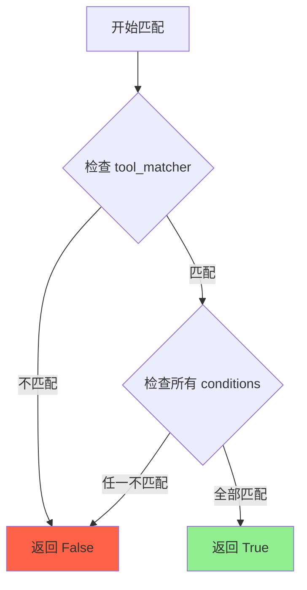
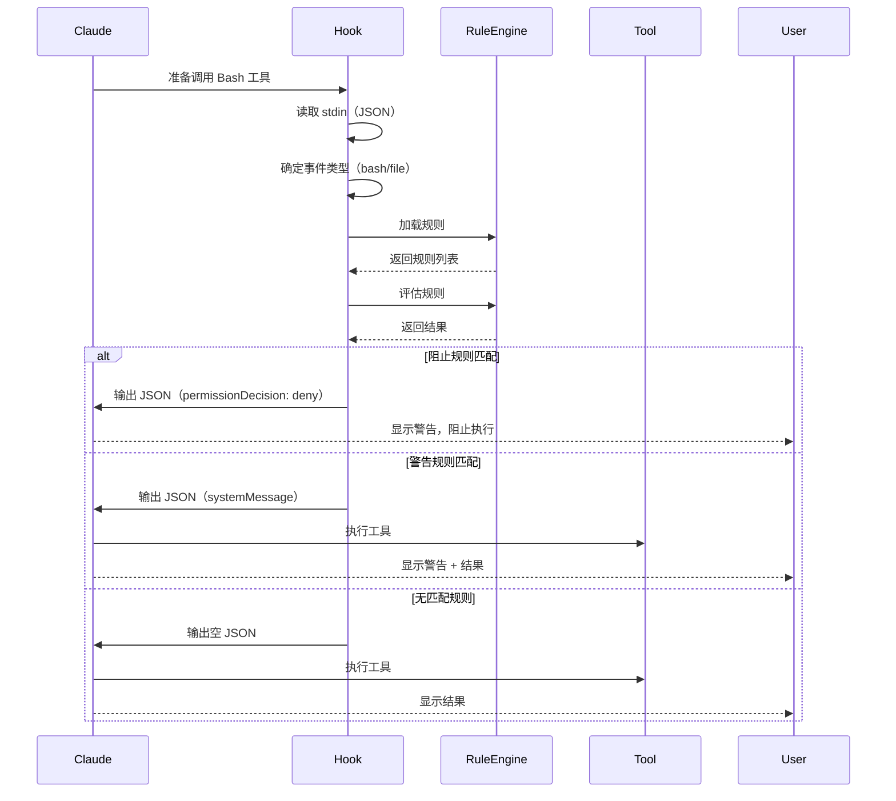

# 第 4 章：hookify - 规则引擎的实现

## 本章导读

**仓库路径**：`plugins/hookify/`

**系统职责**：
- 提供声明式规则匹配（regex/contains/equals）
- 拦截工具调用并执行自定义规则
- 支持 4 种规则示例（console-log/dangerous-rm/require-tests/sensitive-files）

**能学到什么**：
- 如何设计一个规则引擎（条件匹配 + 动作执行）
- PreToolUse Hook 的阻止机制（退出码 2）
- 规则优先级与组合逻辑

---

## 4.1 规则引擎概述

### 什么是规则引擎？

规则引擎是一种将业务逻辑从代码中分离出来的设计模式。用户通过声明式规则定义行为，引擎负责匹配和执行。

**传统方式**（硬编码）：
```python
# 需要修改代码
if "rm -rf" in command:
    print("危险操作！")
    sys.exit(2)
```

**hookify 方式**（声明式）：
```markdown
---
name: block-dangerous-rm
enabled: true
event: bash
pattern: rm\s+-rf
action: block
---

⚠️ **Dangerous rm command detected!**
```

**优势**：
- 无需编程：用 Markdown 定义规则
- 热更新：修改规则文件立即生效
- 可组合：多个规则可以同时工作
- 可维护：规则和代码分离

---

## 4.2 规则定义格式

### 规则文件位置

规则文件必须放在 `.claude/` 目录，命名格式为 `hookify.*.local.md`：

```bash
.claude/
├── hookify.dangerous-rm.local.md
├── hookify.console-log.local.md
└── hookify.sensitive-files.local.md
```

### 规则文件结构

```markdown
---
name: 规则名称（唯一标识）
enabled: true/false（是否启用）
event: bash|file|stop|all（事件类型）
action: warn|block（动作类型）
conditions:
  - field: command|new_text|file_path（字段名）
    operator: regex_match|contains|equals（操作符）
    pattern: 匹配模式（字符串或正则）
---

规则触发时显示的消息内容（支持 Markdown）
```

### Frontmatter 字段说明

| 字段 | 必需 | 类型 | 说明 |
|------|------|------|------|
| `name` | ✅ | string | 规则的唯一标识 |
| `enabled` | ✅ | boolean | 是否启用规则 |
| `event` | ✅ | string | 事件类型（bash/file/stop/all） |
| `action` | ✅ | string | 动作类型（warn/block） |
| `conditions` | ✅ | array | 条件列表 |
| `tool_matcher` | ❌ | string | 工具匹配器（Bash/Edit/Write/*） |
| `pattern` | ❌ | string | 简单模式（遗留，不推荐） |

### Condition 字段说明

| 字段 | 必需 | 类型 | 说明 |
|------|------|------|------|
| `field` | ✅ | string | 要检查的字段名 |
| `operator` | ✅ | string | 操作符 |
| `pattern` | ✅ | string | 匹配模式 |

**支持的 field**：
- `command` - Bash 命令（Bash 工具）
- `new_text` / `new_string` - 新文本（Edit 工具）
- `old_text` / `old_string` - 旧文本（Edit 工具）
- `content` - 文件内容（Write 工具）
- `file_path` - 文件路径（Edit/Write 工具）
- `reason` - 退出原因（Stop Hook）
- `transcript` - 会话记录（Stop Hook）

**支持的 operator**：
- `regex_match` - 正则表达式匹配
- `contains` - 包含字符串
- `equals` - 完全相等
- `not_contains` - 不包含字符串
- `starts_with` - 以...开头
- `ends_with` - 以...结尾

---

## 4.3 四种规则示例

### 4.3.1 dangerous-rm - 阻止危险命令

**文件**：`examples/dangerous-rm.local.md`

```markdown
---
name: block-dangerous-rm
enabled: true
event: bash
pattern: rm\s+-rf
action: block
---

⚠️ **Dangerous rm command detected!**

This command could delete important files. Please:
- Verify the path is correct
- Consider using a safer approach
- Make sure you have backups
```

**工作原理**：
1. 监听 `bash` 事件（Bash 工具调用）
2. 检查命令是否匹配 `rm\s+-rf` 正则
3. 如果匹配，**阻止执行**并显示警告

**测试**：
```bash
# 这个命令会被阻止
rm -rf /tmp/test

# 输出：
# ⚠️ **Dangerous rm command detected!**
# This command could delete important files...
```

---

### 4.3.2 console-log-warning - 警告调试代码

**文件**：`examples/console-log-warning.local.md`

```markdown
---
name: warn-console-log
enabled: true
event: file
pattern: console\.log\(
action: warn
---

🔍 **Console.log detected**

You're adding a console.log statement. Please consider:
- Is this for debugging or should it be proper logging?
- Will this ship to production?
- Should this use a logging library instead?
```

**工作原理**：
1. 监听 `file` 事件（Edit/Write 工具调用）
2. 检查文件内容是否包含 `console.log(`
3. 如果匹配，**显示警告但允许执行**

**测试**：
```javascript
// 编辑文件添加这行代码
console.log('debug info');

// 输出：
// 🔍 **Console.log detected**
// You're adding a console.log statement...
// （但文件仍然会被保存）
```

---

### 4.3.3 require-tests-stop - 要求测试通过

**文件**：`examples/require-tests-stop.local.md`

```markdown
---
name: require-tests-before-exit
enabled: true
event: stop
action: block
conditions:
  - field: transcript
    operator: not_contains
    pattern: "All tests passed"
---

⚠️ **Tests not run or failing!**

Before exiting, please ensure:
- All tests have been run
- All tests are passing
- No test failures in the transcript

Run tests with: `npm test` or `pytest`
```

**工作原理**：
1. 监听 `stop` 事件（会话退出前）
2. 检查会话记录是否包含 "All tests passed"
3. 如果不包含，**阻止退出**并提醒运行测试

**测试**：
```bash
# 尝试退出会话
exit

# 如果没有运行测试，输出：
# ⚠️ **Tests not run or failing!**
# Before exiting, please ensure...
# （会话不会退出）

# 运行测试后
npm test
# ✓ All tests passed

# 再次退出
exit
# （成功退出）
```

---

### 4.3.4 sensitive-files-warning - 敏感文件警告

**文件**：`examples/sensitive-files-warning.local.md`

```markdown
---
name: warn-sensitive-files
enabled: true
event: file
action: warn
conditions:
  - field: file_path
    operator: regex_match
    pattern: \.(env|key|pem|p12|pfx)$
---

🔒 **Sensitive file detected!**

You're modifying a file that may contain sensitive data:
- `.env` files often contain API keys
- `.key`, `.pem` files contain private keys
- `.p12`, `.pfx` files contain certificates

Please ensure:
- This file is in `.gitignore`
- Sensitive data is not committed
- Consider using a secrets manager
```

**工作原理**：
1. 监听 `file` 事件（Edit/Write 工具调用）
2. 检查文件路径是否匹配敏感文件扩展名
3. 如果匹配，**显示警告但允许执行**

**测试**：
```bash
# 编辑 .env 文件
vim .env

# 输出：
# 🔒 **Sensitive file detected!**
# You're modifying a file that may contain sensitive data...
# （但文件仍然可以编辑）
```

---

## 4.4 规则引擎实现

### 4.4.1 核心类设计

**数据模型**（`core/config_loader.py`）：

```python
from dataclasses import dataclass
from typing import List, Optional

@dataclass
class Condition:
    """规则条件"""
    field: str       # 字段名
    operator: str    # 操作符
    pattern: str     # 匹配模式

@dataclass
class Rule:
    """规则定义"""
    name: str                      # 规则名称
    enabled: bool                  # 是否启用
    event: str                     # 事件类型
    action: str                    # 动作类型
    conditions: List[Condition]    # 条件列表
    message: str                   # 消息内容
    tool_matcher: Optional[str]    # 工具匹配器
    pattern: Optional[str]         # 简单模式（遗留）
```

**规则引擎**（`core/rule_engine.py`）：

```python
class RuleEngine:
    """规则评估引擎"""

    def evaluate_rules(self, rules: List[Rule], input_data: Dict) -> Dict:
        """评估所有规则并返回组合结果"""
        blocking_rules = []
        warning_rules = []

        # 1. 匹配所有规则
        for rule in rules:
            if self._rule_matches(rule, input_data):
                if rule.action == 'block':
                    blocking_rules.append(rule)
                else:
                    warning_rules.append(rule)

        # 2. 阻止规则优先于警告规则
        if blocking_rules:
            return self._build_block_response(blocking_rules, input_data)

        # 3. 只有警告规则
        if warning_rules:
            return self._build_warn_response(warning_rules)

        # 4. 无匹配规则
        return {}
```

---

### 4.4.2 规则匹配逻辑

**匹配流程**：



**代码实现**：

```python
def _rule_matches(self, rule: Rule, input_data: Dict) -> bool:
    """检查规则是否匹配"""
    tool_name = input_data.get('tool_name', '')
    tool_input = input_data.get('tool_input', {})

    # 1. 检查工具匹配器
    if rule.tool_matcher:
        if not self._matches_tool(rule.tool_matcher, tool_name):
            return False

    # 2. 检查条件列表
    if not rule.conditions:
        return False

    # 3. 所有条件必须匹配
    for condition in rule.conditions:
        if not self._check_condition(condition, tool_name, tool_input):
            return False

    return True
```

---

### 4.4.3 条件检查实现

**支持的操作符**：

```python
def _check_condition(self, condition: Condition, tool_name: str,
                    tool_input: Dict) -> bool:
    """检查单个条件"""
    # 1. 提取字段值
    field_value = self._extract_field(condition.field, tool_name, tool_input)
    if field_value is None:
        return False

    # 2. 应用操作符
    operator = condition.operator
    pattern = condition.pattern

    if operator == 'regex_match':
        return self._regex_match(pattern, field_value)
    elif operator == 'contains':
        return pattern in field_value
    elif operator == 'equals':
        return pattern == field_value
    elif operator == 'not_contains':
        return pattern not in field_value
    elif operator == 'starts_with':
        return field_value.startswith(pattern)
    elif operator == 'ends_with':
        return field_value.endswith(pattern)
    else:
        return False
```

---

### 4.4.4 正则缓存优化

**为什么需要缓存？**

正则表达式编译是昂贵的操作。如果每次匹配都重新编译，性能会很差。

**传统方式**（每次编译）：
```python
def _regex_match(self, pattern: str, text: str) -> bool:
    regex = re.compile(pattern)  # 每次都编译
    return bool(regex.search(text))
```

**hookify 方式**（LRU 缓存）：
```python
from functools import lru_cache

@lru_cache(maxsize=128)
def compile_regex(pattern: str) -> re.Pattern:
    """编译正则表达式并缓存"""
    return re.compile(pattern, re.IGNORECASE)

def _regex_match(self, pattern: str, text: str) -> bool:
    regex = compile_regex(pattern)  # 使用缓存
    return bool(regex.search(text))
```

**性能提升**：
- 第一次：编译 + 匹配（慢）
- 后续：直接使用缓存（快）
- 最多缓存 128 个模式

---

## 4.5 Hook 执行流程

### 4.5.1 PreToolUse Hook

**文件**：`hooks/pretooluse.py`

**执行流程**：



**代码实现**：

```python
def main():
    """PreToolUse Hook 入口"""
    try:
        # 1. 读取输入
        input_data = json.load(sys.stdin)

        # 2. 确定事件类型
        tool_name = input_data.get('tool_name', '')
        event = None
        if tool_name == 'Bash':
            event = 'bash'
        elif tool_name in ['Edit', 'Write', 'MultiEdit']:
            event = 'file'

        # 3. 加载规则
        rules = load_rules(event=event)

        # 4. 评估规则
        engine = RuleEngine()
        result = engine.evaluate_rules(rules, input_data)

        # 5. 输出结果
        print(json.dumps(result), file=sys.stdout)

    except Exception as e:
        # 6. 错误处理：允许操作
        error_output = {"systemMessage": f"Hookify error: {str(e)}"}
        print(json.dumps(error_output), file=sys.stdout)

    finally:
        # 7. 始终退出 0（不阻止操作）
        sys.exit(0)
```

---

### 4.5.2 阻止机制

**如何阻止工具执行？**

通过返回特定的 JSON 格式：

```json
{
  "hookSpecificOutput": {
    "hookEventName": "PreToolUse",
    "permissionDecision": "deny"
  },
  "systemMessage": "⚠️ **Dangerous rm command detected!**"
}
```

**关键字段**：
- `permissionDecision: "deny"` - 阻止执行
- `systemMessage` - 显示给用户的消息

**警告机制**：

只返回 `systemMessage`，不设置 `permissionDecision`：

```json
{
  "systemMessage": "🔍 **Console.log detected**"
}
```

---

### 4.5.3 优雅降级

**设计原则**：Hook 错误不应阻止用户操作。

**实现方式**：

1. **捕获所有异常**
```python
try:
    # 规则评估逻辑
    result = engine.evaluate_rules(rules, input_data)
except Exception as e:
    # 允许操作，只显示错误
    result = {"systemMessage": f"Hookify error: {str(e)}"}
```

2. **始终退出 0**
```python
finally:
    sys.exit(0)  # 不使用退出码 2
```

3. **导入失败时允许操作**
```python
try:
    from hookify.core.config_loader import load_rules
except ImportError as e:
    print(json.dumps({"systemMessage": f"Import error: {e}"}))
    sys.exit(0)  # 允许操作
```

**为什么这样设计？**

**Linus 式思考**：
> "工具应该帮助用户，而不是阻碍用户。如果 Hook 有 bug，用户应该能继续工作，而不是被卡住。"

---

## 4.6 规则优先级

### 优先级规则

1. **阻止规则 > 警告规则**
   - 如果有阻止规则匹配，忽略警告规则
   - 显示所有匹配的阻止规则消息

2. **多个阻止规则**
   - 组合所有消息
   - 用 `\n\n` 分隔

3. **多个警告规则**
   - 组合所有消息
   - 用 `\n\n` 分隔

### 示例

**规则 1**（阻止）：
```markdown
---
name: block-rm-root
action: block
pattern: rm\s+-rf\s+/
---
⚠️ Deleting root directory!
```

**规则 2**（警告）：
```markdown
---
name: warn-rm
action: warn
pattern: rm\s+-rf
---
🔍 Using rm -rf
```

**测试**：
```bash
# 命令：rm -rf /tmp
# 匹配：规则 1（阻止）+ 规则 2（警告）
# 结果：只显示规则 1，阻止执行

# 命令：rm -rf /
# 匹配：规则 1（阻止）
# 结果：显示规则 1，阻止执行
```

---

## 4.7 实践：创建自定义规则

### 任务 1：阻止 git push --force

**需求**：阻止强制推送到 main 分支

**规则文件**：`.claude/hookify.no-force-push.local.md`

```markdown
---
name: block-force-push-main
enabled: true
event: bash
action: block
conditions:
  - field: command
    operator: regex_match
    pattern: git\s+push\s+.*--force
  - field: command
    operator: contains
    pattern: main
---

⚠️ **Force push to main branch detected!**

Force pushing to main can cause problems:
- Overwrites history
- Breaks other developers' work
- May lose commits

Please:
- Use a feature branch instead
- Or get team approval first
```

**测试**：
```bash
# 这个命令会被阻止
git push origin main --force

# 这个命令允许
git push origin feature-branch --force
```

---

### 任务 2：警告大文件提交

**需求**：警告提交超过 1MB 的文件

**规则文件**：`.claude/hookify.large-file-warning.local.md`

```markdown
---
name: warn-large-files
enabled: true
event: bash
action: warn
conditions:
  - field: command
    operator: regex_match
    pattern: git\s+add
---

🔍 **Large file warning**

You're adding files to git. Please check:
- Are there any files larger than 1MB?
- Should large files use Git LFS?
- Are binary files in .gitignore?

Check file sizes: `ls -lh`
```

**测试**：
```bash
# 这个命令会显示警告
git add large-file.zip

# 输出：
# 🔍 **Large file warning**
# You're adding files to git...
# （但命令仍然执行）
```

---

### 任务 3：要求代码格式化

**需求**：退出前要求运行代码格式化

**规则文件**：`.claude/hookify.require-format.local.md`

```markdown
---
name: require-format-before-exit
enabled: true
event: stop
action: block
conditions:
  - field: transcript
    operator: not_contains
    pattern: "prettier --write"
  - field: transcript
    operator: not_contains
    pattern: "black ."
---

⚠️ **Code not formatted!**

Before exiting, please format your code:

For JavaScript/TypeScript:
```bash
npx prettier --write .
```

For Python:
```bash
black .
```

Then try exiting again.
```

**测试**：
```bash
# 尝试退出
exit
# 输出：⚠️ **Code not formatted!**

# 运行格式化
npx prettier --write .

# 再次退出
exit
# （成功退出）
```

---

## 4.8 架构洞察

### 洞察 1：声明式 vs 命令式

**命令式**（传统 Hook）：
```python
# 需要编程
if "rm -rf" in command:
    print("危险操作！")
    sys.exit(2)
```

**声明式**（hookify）：
```markdown
---
pattern: rm\s+-rf
action: block
---
危险操作！
```

**Linus 式思考**：
> "声明式消除了特殊情况。你不需要为每个规则写代码，只需要声明'什么情况下做什么'。"

**优势**：
- 无需编程技能
- 规则即文档
- 易于维护

---

### 洞察 2：正则缓存的价值

**为什么用 LRU 缓存？**

**性能测试**（假设）：
```python
# 无缓存：每次编译
# 1000 次匹配 = 1000 次编译 = 100ms

# 有缓存：编译一次
# 1000 次匹配 = 1 次编译 + 999 次查找 = 10ms
```

**Linus 式思考**：
> "正则编译是昂贵的。缓存是简单的。为什么不缓存？"

**权衡**：
- 内存：最多 128 个模式（可接受）
- 性能：10 倍提升（值得）

---

### 洞察 3：优雅降级的重要性

**为什么 Hook 错误不阻止操作？**

**场景**：
```python
# Hook 有 bug
try:
    result = engine.evaluate_rules(rules, input_data)
except Exception:
    # 选项 1：阻止操作（用户被卡住）
    sys.exit(2)

    # 选项 2：允许操作（用户可以继续工作）
    sys.exit(0)
```

**Linus 式思考**：
> "工具的 bug 不应该阻止用户工作。如果 Hook 坏了，用户应该能继续，而不是被卡住。"

**设计原则**：
- 用户体验 > 规则执行
- 降级 > 失败
- 警告 > 阻止

---

## 4.9 小结

### 核心要点

1. **规则引擎**：
   - 声明式规则定义（Markdown + YAML）
   - 条件匹配（regex/contains/equals）
   - 动作执行（warn/block）

2. **PreToolUse Hook**：
   - 工具执行前拦截
   - 返回 `permissionDecision: deny` 阻止执行
   - 返回 `systemMessage` 显示警告

3. **正则缓存**：
   - 使用 `@lru_cache` 缓存编译的正则
   - 最多缓存 128 个模式
   - 10 倍性能提升

4. **优雅降级**：
   - Hook 错误不阻止用户操作
   - 始终退出 0
   - 捕获所有异常

### 与其他章节的关联

- **第 2 章**：理解了 Hook 的概念，现在看到具体实现
- **第 3 章**：理解了安全策略，hookify 是规则引擎的实现
- **第 6 章**：security-guidance 也是 Hook，但检测安全问题
- **第 18 章**：深入研究安全策略与沙箱设计

### 延伸阅读

- [plugins/hookify/CLAUDE.md](/plugins/hookify/CLAUDE) - hookify 文档
- [第 6 章：security-guidance](/docs/part2/chapter06) - 安全检查 Hook
- [第 18 章：安全策略与沙箱设计](/docs/part6/chapter18) - 深入分析

---

## 下一章

[第 5 章：commit-commands - Git 工作流自动化](/docs/part2/chapter05) - 学习命令的实现方式，理解 worktree 的处理逻辑。
