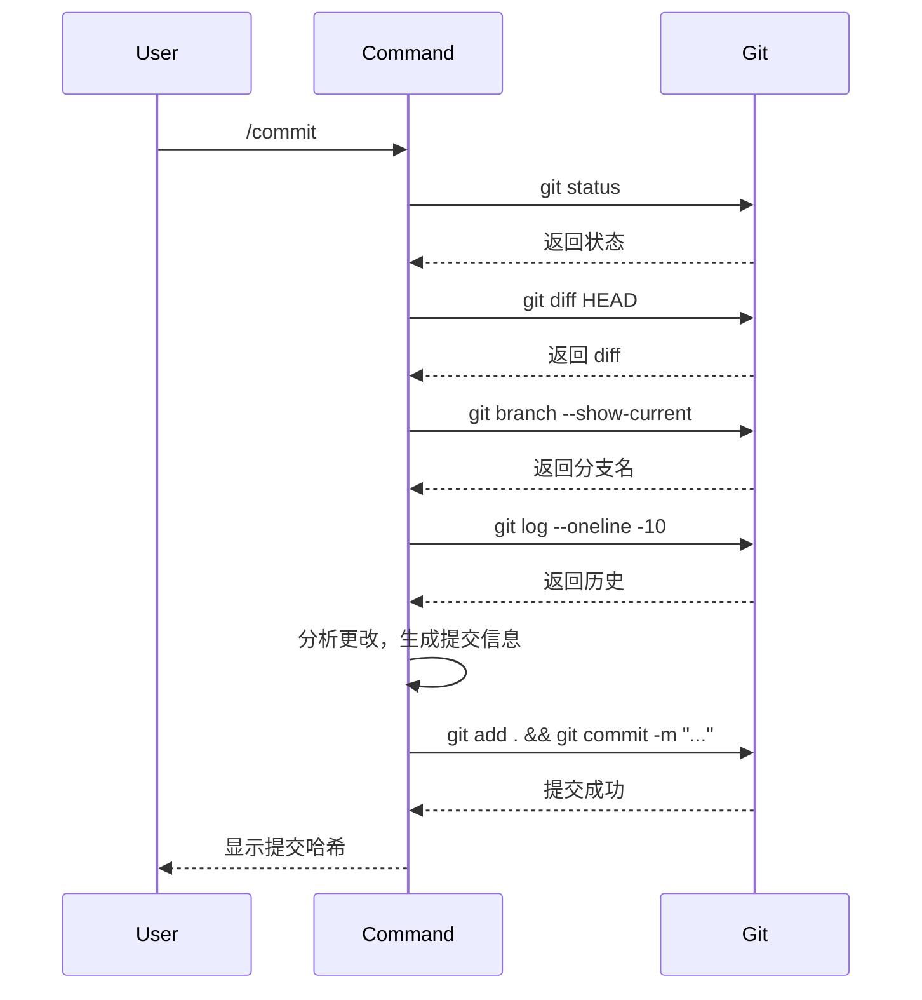
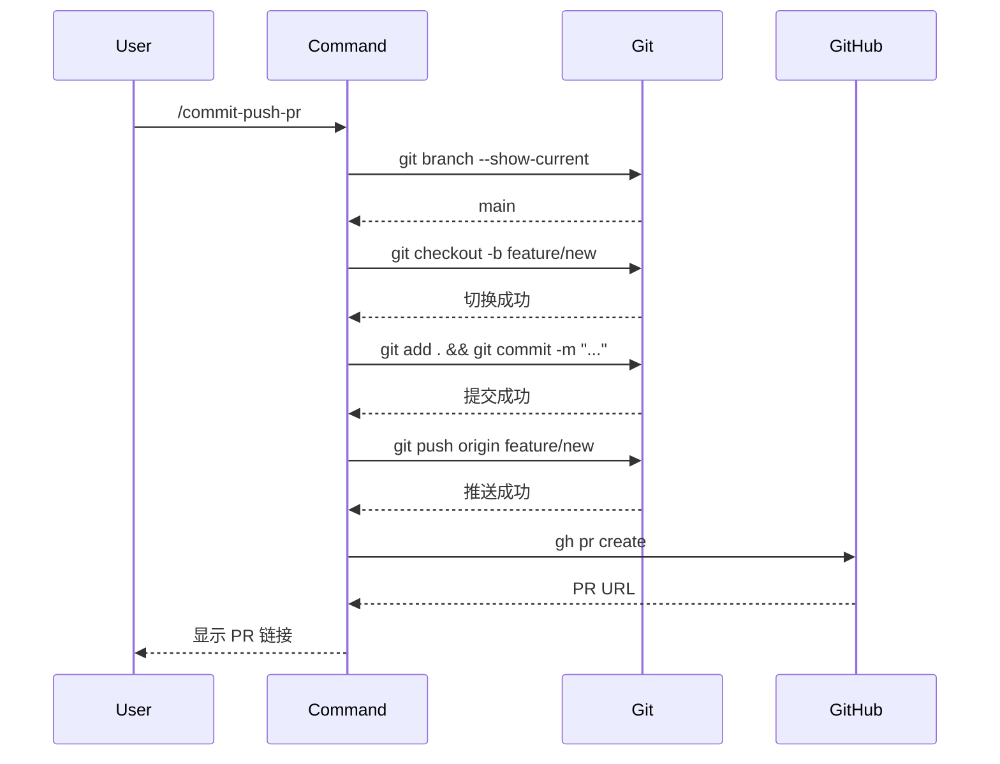

# 第 5 章：commit-commands - Git 工作流自动化

## 本章导读

**仓库路径**：`plugins/commit-commands/`

**系统职责**：
- 提供 3 个 Git 命令（commit/commit-push-pr/clean_gone）
- 处理 worktree 场景
- 自动生成 Conventional Commit 消息

**能学到什么**：
- 如何封装复杂的 Git 操作为简单命令
- worktree 的检测与处理
- 命令的参数传递（argument-hint）

---

## 5.1 Git 工作流痛点

### 传统 Git 工作流的问题

**场景 1：创建提交**
```bash
# 需要 5 个步骤
git status                    # 查看状态
git diff                      # 查看更改
git add .                     # 暂存文件
git commit -m "fix: bug"      # 创建提交
git log --oneline -5          # 查看历史
```

**场景 2：创建 PR**
```bash
# 需要 8 个步骤
git status
git checkout -b feature-branch  # 创建分支
git add .
git commit -m "feat: new feature"
git push origin feature-branch
gh pr create --title "..." --body "..."
# 还要手动填写 PR 标题和描述
```

**场景 3：清理分支**
```bash
# 需要手动识别和删除
git branch -v                 # 查看分支
git branch -D old-branch      # 删除分支
# 如果有 worktree，还要先删除 worktree
git worktree remove /path/to/worktree
```

### commit-commands 的解决方案

**一个命令完成所有操作**：
```bash
# 创建提交
/commit

# 提交 + 推送 + 创建 PR
/commit-push-pr

# 清理已删除的远程分支
/clean_gone
```

---

## 5.2 三个命令的职责分工

### 命令对比

| 命令 | 功能 | 步骤数 | 适用场景 |
|------|------|--------|---------|
| `/commit` | 创建本地提交 | 1 | 本地开发，不需要推送 |
| `/commit-push-pr` | 提交 + 推送 + PR | 1 | 完成功能，需要代码审查 |
| `/clean_gone` | 清理过期分支 | 1 | 定期清理本地分支 |

### 工作流程图

```mermaid
graph TD
    A[开始开发] --> B{需要推送?}
    B -->|否| C[/commit]
    B -->|是| D[/commit-push-pr]
    C --> E[继续开发]
    D --> F[等待审查]
    F --> G[合并 PR]
    G --> H[/clean_gone]
    H --> A

    style C fill:#90EE90
    style D fill:#FFD700
    style H fill:#87CEEB
```

---

## 5.3 /commit - 创建 Git 提交

### 命令定义

**文件**：`commands/commit.md`

```markdown
---
allowed-tools:
  - Bash(git add:*)
  - Bash(git status:*)
  - Bash(git commit:*)
description: Create a git commit
---

## Context

- Current git status: !`git status`
- Current git diff: !`git diff HEAD`
- Current branch: !`git branch --show-current`
- Recent commits: !`git log --oneline -10`

## Your task

Based on the above changes, create a single git commit.

Stage and create the commit using a single message.
Do not send any other text or messages besides these tool calls.
```

### 关键设计

**1. 工具白名单**
```yaml
allowed-tools:
  - Bash(git add:*)      # 暂存文件
  - Bash(git status:*)   # 查看状态
  - Bash(git commit:*)   # 创建提交
```

**为什么限制工具？**
- 安全性：只允许 Git 操作
- 可预测性：不会执行其他命令
- 可审计性：所有操作都在白名单中

---

**2. 上下文注入**

使用 `!` 语法自动执行命令并注入结果：

```markdown
- Current git status: !`git status`
```

等价于：
```markdown
- Current git status:
  On branch main
  Changes not staged for commit:
    modified: src/index.js
```

**优势**：
- 自动收集上下文
- 无需手动执行命令
- 结果直接可用

---

**3. 原子化操作**

```markdown
Stage and create the commit using a single message.
```

**为什么要求单次响应？**
- 减少交互次数
- 避免中间状态
- 提高效率

---

### 执行流程



### 提交信息生成

**Conventional Commit 格式**：
```
<type>(<scope>): <subject>

<body>

<footer>
```

**示例**：
```bash
# 修复 bug
fix(auth): resolve login timeout issue

- Increase timeout from 5s to 10s
- Add retry logic for network errors

Closes #123

# 新功能
feat(api): add user profile endpoint

- GET /api/users/:id
- Returns user profile data
- Includes avatar URL

# 重构
refactor(database): optimize query performance

- Use indexed queries
- Reduce N+1 queries
- Add connection pooling
```

---

## 5.4 /commit-push-pr - 提交并创建 PR

### 命令定义

**文件**：`commands/commit-push-pr.md`

```markdown
---
allowed-tools:
  - Bash(git checkout --branch:*)
  - Bash(git add:*)
  - Bash(git status:*)
  - Bash(git push:*)
  - Bash(git commit:*)
  - Bash(gh pr create:*)
description: Commit, push, and open a PR
---

## Context

- Current git status: !`git status`
- Current git diff: !`git diff HEAD`
- Current branch: !`git branch --show-current`

## Your task

1. Create a new branch if on main
2. Create a single commit
3. Push the branch to origin
4. Create a pull request using `gh pr create`
5. Do all of the above in a single message
```

### 关键设计

**1. 自动分支管理**

```bash
# 如果在 main 分支
if [ "$(git branch --show-current)" = "main" ]; then
  git checkout -b feature/new-feature
fi
```

**为什么需要？**
- 避免直接提交到 main
- 保持 main 分支干净
- 符合 Git Flow 最佳实践

---

**2. GitHub CLI 集成**

```bash
gh pr create \
  --title "feat: add new feature" \
  --body "Description of changes" \
  --base main
```

**为什么用 `gh` CLI？**
- 无需打开浏览器
- 自动填充 PR 信息
- 支持模板和标签

---

**3. 原子化操作**

```markdown
Do all of the above in a single message
```

**执行顺序**：
1. 检查当前分支
2. 如果在 main，创建新分支
3. 暂存并提交
4. 推送到 origin
5. 创建 PR

**为什么要原子化？**
- 减少失败点
- 避免部分完成状态
- 提高成功率

---

### 执行流程



### PR 信息生成

**标题**：
```
feat(api): add user profile endpoint
```

**描述**：
```markdown
## Changes
- Add GET /api/users/:id endpoint
- Return user profile data
- Include avatar URL

## Testing
- Unit tests added
- Integration tests passed

## Related Issues
Closes #123
```

---

## 5.5 /clean_gone - 清理过期分支

### 命令定义

**文件**：`commands/clean_gone.md`

```markdown
---
description: Cleans up all git branches marked as [gone]
---

## Your Task

Execute the following bash commands to clean up stale local branches.

## Commands to Execute

1. List branches to identify [gone] status
   ```bash
   git branch -v
   ```

2. Identify worktrees that need to be removed
   ```bash
   git worktree list
   ```

3. Remove worktrees and delete [gone] branches
   ```bash
   git branch -v | grep '\[gone\]' | sed 's/^[+* ]//' | awk '{print $1}' | while read branch; do
     echo "Processing branch: $branch"
     worktree=$(git worktree list | grep "\\[$branch\\]" | awk '{print $1}')
     if [ ! -z "$worktree" ]; then
       echo "  Removing worktree: $worktree"
       git worktree remove --force "$worktree"
     fi
     echo "  Deleting branch: $branch"
     git branch -D "$branch"
   done
   ```
```

### 什么是 [gone] 分支？

**场景**：
```bash
# 在 GitHub 上合并并删除分支
# 本地执行 git fetch
git fetch --prune

# 查看分支状态
git branch -v
# * main                abc1234 Latest commit
#   feature/old-feature def5678 [gone] Old feature
#   feature/new-feature ghi9012 New feature
```

**[gone] 标记**：
- 远程分支已删除
- 本地分支仍存在
- 需要手动清理

---

### worktree 处理

**什么是 worktree？**

Git worktree 允许同时检出多个分支到不同目录：

```bash
# 主仓库在 /project
cd /project

# 创建 worktree
git worktree add ../project-feature feature/new

# 现在有两个工作目录
# /project (main 分支)
# /project-feature (feature/new 分支)
```

**为什么需要特殊处理？**

```bash
# 直接删除分支会失败
git branch -D feature/new
# error: Cannot delete branch 'feature/new' checked out at '/project-feature'

# 必须先删除 worktree
git worktree remove /project-feature
git branch -D feature/new
```

---

### 清理流程

```mermaid
graph TD
    A[开始清理] --> B[列出所有分支]
    B --> C{有 [gone] 分支?}
    C -->|否| D[无需清理]
    C -->|是| E[列出 worktree]
    E --> F[遍历 [gone] 分支]
    F --> G{有 worktree?}
    G -->|是| H[删除 worktree]
    G -->|否| I[删除分支]
    H --> I
    I --> J{还有分支?}
    J -->|是| F
    J -->|否| K[清理完成]

    style D fill:#90EE90
    style K fill:#90EE90
```

### 代码分析

**1. 识别 [gone] 分支**

```bash
git branch -v | grep '\[gone\]'
#   feature/old-feature def5678 [gone] Old feature
```

**2. 提取分支名**

```bash
sed 's/^[+* ]//'  # 移除前缀（+, *, 空格）
awk '{print $1}'  # 提取第一列（分支名）
```

**前缀含义**：
- `*` - 当前分支
- `+` - 有 worktree 的分支
- ` ` - 普通分支

**3. 查找 worktree**

```bash
worktree=$(git worktree list | grep "\\[$branch\\]" | awk '{print $1}')
```

**4. 删除 worktree**

```bash
if [ ! -z "$worktree" ]; then
  git worktree remove --force "$worktree"
fi
```

**5. 删除分支**

```bash
git branch -D "$branch"
```

---

## 5.6 工具白名单设计

### 为什么需要白名单？

**安全性**：
```yaml
# ❌ 不好：允许所有 Bash 命令
allowed-tools:
  - Bash

# ✅ 好：只允许特定 Git 命令
allowed-tools:
  - Bash(git add:*)
  - Bash(git commit:*)
```

**可预测性**：
- 用户知道命令会做什么
- 不会执行意外操作
- 易于审计

---

### 白名单语法

**格式**：`Bash(command:pattern)`

**示例**：
```yaml
# 允许所有 git add 命令
Bash(git add:*)

# 允许特定参数
Bash(git commit:-m)

# 允许多个命令
Bash(git status:*)
Bash(git diff:*)
```

---

### 三个命令的白名单对比

| 命令 | 白名单 | 原因 |
|------|--------|------|
| `/commit` | `git add`, `git status`, `git commit` | 只需要本地操作 |
| `/commit-push-pr` | + `git checkout`, `git push`, `gh pr create` | 需要远程操作 |
| `/clean_gone` | `git branch`, `git worktree` | 需要分支管理 |

---

## 5.7 实践：使用 commit-commands

### 任务 1：创建本地提交

**场景**：修复了一个 bug，想创建提交但不推送

```bash
# 修改代码
vim src/auth.js

# 创建提交
/commit
```

**预期输出**：
```
✓ Created commit: fix(auth): resolve login timeout issue (abc1234)

Changes:
- src/auth.js

Commit message:
fix(auth): resolve login timeout issue

- Increase timeout from 5s to 10s
- Add retry logic for network errors
```

---

### 任务 2：创建 PR

**场景**：完成新功能，需要代码审查

```bash
# 修改代码
vim src/api/users.js

# 提交并创建 PR
/commit-push-pr
```

**预期输出**：
```
✓ Created branch: feature/user-profile-endpoint
✓ Created commit: feat(api): add user profile endpoint (def5678)
✓ Pushed to origin: feature/user-profile-endpoint
✓ Created PR: https://github.com/user/repo/pull/123

PR Title: feat(api): add user profile endpoint

PR Description:
## Changes
- Add GET /api/users/:id endpoint
- Return user profile data
- Include avatar URL
```

---

### 任务 3：清理过期分支

**场景**：合并了多个 PR，需要清理本地分支

```bash
# 更新远程分支状态
git fetch --prune

# 清理过期分支
/clean_gone
```

**预期输出**：
```
Found 3 branches marked as [gone]:
- feature/old-feature-1
- feature/old-feature-2
- feature/old-feature-3

Processing branch: feature/old-feature-1
  No worktree found
  Deleting branch: feature/old-feature-1
  ✓ Deleted

Processing branch: feature/old-feature-2
  Removing worktree: /path/to/worktree
  ✓ Worktree removed
  Deleting branch: feature/old-feature-2
  ✓ Deleted

Processing branch: feature/old-feature-3
  No worktree found
  Deleting branch: feature/old-feature-3
  ✓ Deleted

Summary: Cleaned up 3 branches (1 with worktree)
```

---

## 5.8 架构洞察

### 洞察 1：原子化操作的价值

**为什么要求单次响应？**

**传统方式**（多次交互）：
```
User: /commit
AI: 我看到你修改了 src/auth.js，要创建提交吗？
User: 是的
AI: 提交信息是什么？
User: fix(auth): resolve timeout
AI: 好的，正在创建提交...
```

**commit-commands 方式**（单次响应）：
```
User: /commit
AI: [直接执行所有操作]
✓ Created commit: fix(auth): resolve timeout (abc1234)
```

**Linus 式思考**：
> "交互是特殊情况。好的工具消除特殊情况。用户说'提交'，就应该直接提交，不要问东问西。"

**优势**：
- 减少交互次数（5 次 → 1 次）
- 避免中间状态（部分完成）
- 提高效率（秒级完成）

---

### 洞察 2：上下文注入的设计

**为什么用 `!` 语法？**

**传统方式**（手动执行）：
```markdown
## Context

Please run these commands first:
1. git status
2. git diff HEAD
3. git branch --show-current

Then create a commit based on the output.
```

**commit-commands 方式**（自动注入）：
```markdown
## Context

- Current git status: !`git status`
- Current git diff: !`git diff HEAD`
- Current branch: !`git branch --show-current`
```

**Linus 式思考**：
> "为什么要让用户手动执行命令？系统应该自动收集上下文。"

**优势**：
- 自动化：无需手动执行
- 一致性：每次都收集相同的上下文
- 可靠性：不会遗漏信息

---

### 洞察 3：worktree 的复杂性

**为什么需要特殊处理？**

**Git 的设计**：
- 一个分支只能被一个工作目录检出
- worktree 允许多个工作目录
- 删除分支前必须先删除 worktree

**Linus 式思考**：
> "这不是特殊情况，这是 Git 的设计。worktree 是一等公民，必须正确处理。"

**实现**：
1. 检测分支是否有 worktree（`+` 前缀）
2. 查找 worktree 路径
3. 先删除 worktree
4. 再删除分支

**为什么不简化？**
- Git 不允许简化（会报错）
- 必须遵循 Git 的规则
- 正确处理比简化更重要

---

## 5.9 小结

### 核心要点

1. **三个命令**：
   - `/commit` - 创建本地提交
   - `/commit-push-pr` - 提交 + 推送 + PR
   - `/clean_gone` - 清理过期分支

2. **工具白名单**：
   - 限制允许的 Git 命令
   - 提高安全性和可预测性
   - 易于审计

3. **原子化操作**：
   - 单次响应完成所有步骤
   - 减少交互次数
   - 避免中间状态

4. **worktree 处理**：
   - 检测 `+` 前缀
   - 先删除 worktree
   - 再删除分支

### 与其他章节的关联

- **第 2 章**：理解了命令的概念，现在看到具体实现
- **第 3 章**：理解了工具白名单，commit-commands 使用白名单限制操作
- **第 4 章**：hookify 使用 Hook 拦截，commit-commands 使用命令封装
- **第 7 章**：code-review 也使用命令，但更复杂（多 Agent 协作）

### 延伸阅读

- [plugins/commit-commands/CLAUDE.md](/plugins/commit-commands/CLAUDE) - commit-commands 文档
- [Git Worktree 文档](https://git-scm.com/docs/git-worktree) - 官方文档
- [Conventional Commits](https://www.conventionalcommits.org/) - 提交信息规范

---

## 下一章

[第 6 章：security-guidance - 安全检查 Hook](/docs/part2/chapter06) - 学习安全检查的实现，理解 9 种安全模式的检测逻辑。
