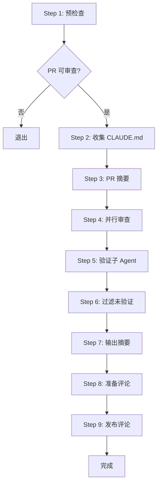
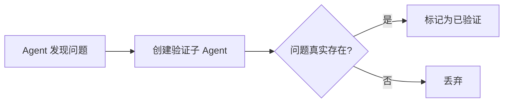

# 第7章：code-review - 多 Agent 协作审查

## 本章导读

**仓库路径**：`plugins/code-review/`

**系统职责**：
- 自动化 PR 代码审查流程
- 多 Agent 并行协作检测问题
- 验证子 Agent 过滤假阳性
- 通过 MCP 发布内联评论

**能学到什么**：
- 多 Agent 并行协作模式
- 验证子 Agent 的高信号过滤机制
- 假阳性预防的工程实践
- GitHub CLI 与 MCP 工具集成
- 9 步结构化审查工作流

---

## 7.1 PR 审查的挑战

### 传统人工审查的痛点

```text
问题1：审查不一致
- 不同审查者关注点不同
- 疲劳导致遗漏问题
- 主观判断影响质量

问题2：效率低下
- 大型 PR 审查耗时数小时
- 重复性检查浪费时间
- 反馈延迟影响开发节奏

问题3：假阳性泛滥
- AI 审查容易过度敏感
- 误报降低开发者信任
- 噪音掩盖真正问题
```

### code-review 的解决方案

**核心设计**：
1. **9 步结构化流程** - 从预检查到发布评论的完整闭环
2. **多 Agent 并行** - 4 个 Agent 同时审查不同维度
3. **验证子 Agent** - 每个问题都经过二次验证
4. **高信号标准** - 只标记编译错误、明确逻辑错误、清晰违规

---

## 7.2 9 步工作流详解

### 工作流概览



### Step 1: 预检查

**目标**：避免浪费资源在不可审查的 PR 上

```bash
# 检查项
1. PR 是否已关闭？
2. PR 是否为草稿？
3. PR 是否已被审查过？（检查评论历史）
```

**实现**：
```markdown
# 使用 gh CLI 获取 PR 状态
gh pr view <PR_NUMBER> --json state,isDraft,comments
```

### Step 2: 收集 CLAUDE.md 文件

**目标**：获取项目特定的编码规范和约束

```bash
# 收集范围
1. 根目录 CLAUDE.md
2. 各模块目录 CLAUDE.md
3. 插件目录 CLAUDE.md
```

**作用**：
- 提供审查上下文
- 检查 CLAUDE.md 合规性
- 识别项目特定模式

### Step 3: PR 摘要（Sonnet Agent）

**目标**：生成 PR 的结构化摘要

**Agent 配置**：
```yaml
model: claude-sonnet-4-5
任务: 分析 PR diff，提取关键变更
输出:
  - 变更文件列表
  - 主要功能点
  - 潜在风险区域
```

### Step 4: 并行审查（4 个 Agent）

**Agent 分工**：

| Agent | 模型 | 职责 | 关注点 |
|-------|------|------|--------|
| Agent 1 | Sonnet | CLAUDE.md 合规性 | 命名规范、结构约定 |
| Agent 2 | Sonnet | CLAUDE.md 合规性 | 文档要求、测试覆盖 |
| Agent 3 | Opus | Bug 检测 | 逻辑错误、边界条件 |
| Agent 4 | Opus | Bug 检测 | 安全漏洞、性能问题 |

**并行执行**：
```text
时间轴：
T0: 4 个 Agent 同时启动
T1-T5: 各自独立审查
T6: 汇总结果
```

### Step 5: 验证子 Agent

**关键创新**：每个问题都经过二次验证

**验证流程**：


**验证标准**：
```python
def is_high_signal(issue):
    """高信号问题判断"""
    return (
        is_compilation_error(issue) or
        is_clear_logic_error(issue) or
        is_unambiguous_violation(issue)
    )
```

### Step 6: 过滤未验证问题

**目标**：只保留高置信度问题

```text
过滤规则：
1. 丢弃所有未通过验证的问题
2. 丢弃主观性建议（如"可以改进"）
3. 丢弃风格偏好（如"建议使用 const"）
```

### Step 7: 输出摘要

**格式**：
```markdown
## PR 审查摘要

**变更概述**：[PR 主要功能]

**发现问题**：
- 🔴 严重：X 个（编译错误、逻辑错误）
- 🟡 中等：Y 个（CLAUDE.md 违规）

**审查统计**：
- 审查文件：N 个
- 验证通过：M 个问题
- 假阳性过滤：K 个
```

### Step 8: 准备评论列表

**评论格式**：
```markdown
# GitHub 内联评论格式
文件: src/example.ts
行号: 42
评论:
  **问题**: [简短描述]
  **原因**: [为什么这是问题]
  **建议**: [如何修复]
```

**Committable Suggestion**（仅用于小修复）：
````markdown
```suggestion
// 修复后的代码
const result = validateInput(data);
```
````

### Step 9: 发布评论（MCP）

**工具**：`mcp__github_inline_comment__create_inline_comment`

**参数**：
```json
{
  "owner": "anthropics",
  "repo": "claude-code",
  "pull_number": 123,
  "body": "评论内容",
  "commit_id": "abc123",
  "path": "src/file.ts",
  "line": 42
}
```

---

## 7.3 多 Agent 并行协作

### 为什么需要 4 个 Agent？

**单 Agent 的局限**：
```text
问题1：注意力分散
- 同时关注多个维度导致遗漏

问题2：模型偏好
- Sonnet 擅长结构分析
- Opus 擅长深度推理

问题3：效率瓶颈
- 串行审查耗时过长
```

### 并行协作模式

**Agent 独立性**：
```text
✅ 各 Agent 独立审查，互不干扰
✅ 使用相同的 PR diff 和 CLAUDE.md
✅ 输出格式统一，便于汇总
```

**结果汇总**：
```python
# 伪代码
all_issues = []
for agent in [agent1, agent2, agent3, agent4]:
    issues = agent.review(pr_diff, claude_md)
    all_issues.extend(issues)

# 去重
unique_issues = deduplicate(all_issues)
```

### 模型选择策略

| 任务类型 | 推荐模型 | 原因 |
|---------|---------|------|
| 结构分析 | Sonnet | 速度快，擅长模式匹配 |
| 深度推理 | Opus | 推理能力强，发现隐藏问题 |
| 合规检查 | Sonnet | 规则匹配效率高 |
| 安全审计 | Opus | 需要深度上下文理解 |

---

## 7.4 验证子 Agent 机制

### 假阳性问题

**常见假阳性**：
```javascript
// 假阳性示例1：误判未使用变量
const config = loadConfig(); // Agent 认为未使用
return processData(config);  // 实际在这里使用

// 假阳性示例2：误判类型错误
const result: string | null = getValue();
if (result) {
  console.log(result.toUpperCase()); // Agent 认为可能为 null
}
```

### 验证子 Agent 设计

**创建时机**：
```text
主 Agent 发现问题 → 立即创建验证子 Agent
```

**验证任务**：
```markdown
你是一个验证 Agent，任务是确认以下问题是否真实存在：

**问题描述**：[主 Agent 的发现]
**代码上下文**：[相关代码片段]
**项目规范**：[CLAUDE.md 相关部分]

请回答：
1. 这个问题真实存在吗？（是/否）
2. 如果存在，严重程度如何？（严重/中等/轻微）
3. 是否有误判的可能？（高/中/低）
```

### 高信号标准

**只标记以下问题**：

1. **编译错误**
   ```typescript
   // ✅ 应标记
   const x: number = "string"; // 类型错误
   ```

2. **明确逻辑错误**
   ```javascript
   // ✅ 应标记
   if (user.age > 18) {
     return "未成年"; // 逻辑反了
   }
   ```

3. **清晰 CLAUDE.md 违规**
   ```python
   # CLAUDE.md 规定：禁止使用 eval
   eval(user_input)  # ✅ 应标记
   ```

**不应标记**：
```text
❌ 风格偏好（"建议使用 const 而不是 let"）
❌ 主观建议（"这里可以优化"）
❌ 假设性问题（"如果未来需要扩展..."）
```

---

## 7.5 假阳性预防

### 预防清单

**在标记问题前，验证 Agent 必须检查**：

```markdown
□ 问题是否在代码的其他部分已处理？
□ 是否有测试覆盖这个场景？
□ CLAUDE.md 是否明确禁止这种写法？
□ 问题是否会导致实际运行时错误？
□ 是否有合理的业务理由这样写？
```

### 案例分析

**案例1：误判空指针**

```typescript
// 主 Agent 标记
function process(data?: string) {
  console.log(data.length); // ⚠️ data 可能为 undefined
}

// 验证 Agent 检查
// 1. 查看调用方
const result = process(validateInput()); // validateInput 保证非空
// 2. 结论：假阳性，不标记
```

**案例2：真实问题**

```typescript
// 主 Agent 标记
function divide(a: number, b: number) {
  return a / b; // ⚠️ b 可能为 0
}

// 验证 Agent 检查
// 1. 没有边界检查
// 2. 没有测试覆盖 b=0 的情况
// 3. 结论：真实问题，标记
```

---

## 7.6 MCP 内联评论

### GitHub 内联评论格式

**Permalink 结构**：
```text
https://github.com/{owner}/{repo}/blob/{commit_sha}/{file_path}#L{line}
```

**示例**：
```text
https://github.com/anthropics/claude-code/blob/abc123/src/plugin.ts#L42
```

### MCP 工具调用

**工具名称**：`mcp__github_inline_comment__create_inline_comment`

**参数说明**：
```typescript
interface InlineCommentParams {
  owner: string;        // 仓库所有者
  repo: string;         // 仓库名称
  pull_number: number;  // PR 编号
  body: string;         // 评论内容（支持 Markdown）
  commit_id: string;    // 提交 SHA
  path: string;         // 文件路径
  line: number;         // 行号
}
```

### Committable Suggestion

**使用场景**：仅用于小修复（1-3 行）

**格式**：
````markdown
**建议修复**：

```suggestion
const result = validateInput(data);
```
````

**不适用场景**：
```text
❌ 大规模重构
❌ 跨文件修改
❌ 需要上下文理解的修复
```

---

## 7.7 实践：使用 code-review

### 基本用法

```bash
# 在 PR 页面使用
/code-review

# 审查后自动发布评论
/code-review --comment
```

### 工具白名单

**允许的工具**：
```yaml
allowed-tools:
  - Bash(gh issue view:*)
  - Bash(gh search:*)
  - Bash(gh issue list:*)
  - Bash(gh pr comment:*)
  - Bash(gh pr diff:*)
  - Bash(gh pr view:*)
  - Bash(gh pr list:*)
  - mcp__github_inline_comment__create_inline_comment
```

### 审查示例

**场景**：审查一个添加用户认证的 PR

```bash
# Step 1: 启动审查
/code-review --comment

# Step 2: 系统输出
正在审查 PR #123...
✓ 预检查通过
✓ 收集到 3 个 CLAUDE.md 文件
✓ 生成 PR 摘要
✓ 4 个 Agent 并行审查中...
✓ 验证 12 个问题...
✓ 过滤 5 个假阳性
✓ 发布 7 条评论

# Step 3: 查看结果
## 审查摘要
- 🔴 严重：2 个（SQL 注入风险、密码明文存储）
- 🟡 中等：5 个（缺少输入验证、错误处理不完整）
```

---

## 7.8 架构洞察

### Linus 式思考：多 Agent 协作的本质

**问题1：为什么不用一个超强 Agent？**

```text
Linus 的回答：
"这是在解决不存在的问题。真正的问题是注意力分散。"

- 单 Agent 需要同时关注 N 个维度
- 人类审查者也会分工（安全专家、性能专家）
- 并行 > 串行，这是基本常识
```

**问题2：验证子 Agent 是否过度设计？**

```text
Linus 的回答：
"假阳性会破坏用户空间（开发者信任）。Never break userspace!"

- 一个误报 > 十个真实问题的价值损失
- 验证成本 < 开发者处理误报的成本
- 这不是过度设计，这是必需品
```

**问题3：为什么只标记高信号问题？**

```text
Linus 的回答：
"好品味意味着知道什么不该做。"

- 风格建议 = 噪音
- 主观意见 = 浪费时间
- 只修复真正的 bug，其他都是扯淡
```

### 数据结构分析

**核心数据流**：


**关键数据结构**：
```typescript
interface Issue {
  file: string;
  line: number;
  severity: 'critical' | 'moderate';
  description: string;
  verified: boolean;
  agent_id: string;
}

interface ReviewResult {
  pr_number: number;
  issues: Issue[];
  summary: string;
  stats: {
    files_reviewed: number;
    issues_found: number;
    false_positives_filtered: number;
  };
}
```

### 复杂度消除

**传统审查流程**：
```text
if PR.is_closed:
    return
if PR.is_draft:
    return
if already_reviewed:
    return
# ... 10+ 个 if 判断
```

**code-review 设计**：
```text
# Step 1: 预检查（一次性处理所有边界条件）
if not is_reviewable(PR):
    return

# Step 2-9: 正常流程（零特殊情况）
```

**Linus 评价**：
```text
"这就是好品味。把所有特殊情况集中到一个地方处理，
剩下的代码就是纯粹的业务逻辑。"
```

### 向后兼容性

**设计原则**：
```text
1. 评论格式向后兼容（GitHub Markdown）
2. MCP 工具可选（降级到 gh CLI）
3. 验证机制可配置（允许关闭）
```

**降级策略**：
```python
# 伪代码
if mcp_available:
    post_inline_comment(issue)
else:
    fallback_to_gh_cli(issue)
```

---

## 7.9 小结

### 核心要点

1. **9 步工作流** - 从预检查到发布评论的完整闭环
2. **4 个并行 Agent** - 2 个 Sonnet（合规）+ 2 个 Opus（bug）
3. **验证子 Agent** - 每个问题二次验证，过滤假阳性
4. **高信号标准** - 只标记编译错误、明确逻辑错误、清晰违规
5. **MCP 集成** - 自动发布 GitHub 内联评论

### 设计哲学

```text
Linus 的三个准则在 code-review 中的体现：

1. 好品味
   - 预检查集中处理边界条件
   - 验证机制消除假阳性

2. Never break userspace
   - 假阳性会破坏开发者信任
   - 向后兼容的评论格式

3. 实用主义
   - 只解决真实问题（高信号）
   - 拒绝主观建议和风格偏好
```

### 可学习的模式

1. **多 Agent 并行协作** - 分工明确，独立执行，结果汇总
2. **验证子 Agent** - 二次验证机制，提高准确率
3. **高信号过滤** - 只标记真正重要的问题
4. **工具集成** - GitHub CLI + MCP 的组合使用

### 下一章预告

第 8 章将介绍 **feature-dev** 插件，学习如何通过 7 阶段工作流管理完整的功能开发生命周期。

---

**本章完**
