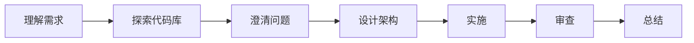
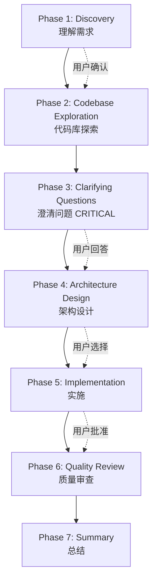

# 第8章：feature-dev - 7阶段开发工作流

## 本章导读

**仓库路径**：`plugins/feature-dev/`

**系统职责**：
- 提供结构化的7阶段特性开发工作流
- 通过并行Agent深度理解代码库
- 强制澄清需求，避免假设
- 多方案架构设计与权衡分析

**能学到什么**：
- 系统化的特性开发流程设计
- 并行Agent探索模式
- 强制提问机制的实现
- 多方案比较的架构决策方法
- TodoWrite进度跟踪模式

---

## 8.1 传统开发流程的问题

### 常见反模式

**反模式1：直接开始写代码**
```text
开发者：看到需求 → 立即写代码 → 发现理解错误 → 返工
成本：浪费数小时甚至数天
```

**反模式2：假设用户意图**
```text
需求："添加用户认证"
假设：使用JWT，存储在localStorage
实际：用户想要OAuth，存储在httpOnly cookie
结果：完全重写
```

**反模式3：忽略现有模式**
```text
开发者：用自己熟悉的方式实现
结果：代码风格不一致，难以维护
```

**反模式4：单一方案思维**
```text
开发者：只考虑一种实现方式
结果：错过更优方案，或过度设计
```

### feature-dev的解决方案

**核心理念**：**先理解，再提问，后设计，最后实现**



---

## 8.2 7阶段工作流概览

### 完整流程图



### 阶段概览表

| 阶段 | 目标 | 关键活动 | 用户交互 | Agent使用 |
|------|------|---------|---------|----------|
| 1. Discovery | 理解需求 | 确认特性描述 | ✅ 确认理解 | 无 |
| 2. Exploration | 探索代码库 | 并行Agent探索 | 无 | 2-3个code-explorer |
| 3. Questions | 澄清问题 | 识别所有歧义 | ✅ 回答问题 | 无 |
| 4. Design | 架构设计 | 多方案比较 | ✅ 选择方案 | 2-3个code-architect |
| 5. Implementation | 实施 | 编写代码 | ✅ 批准开始 | 无 |
| 6. Review | 质量审查 | 代码审查 | ✅ 决定修复 | 3个code-reviewer |
| 7. Summary | 总结 | 文档记录 | 无 | 无 |

---

## 8.3 阶段1-3详解（需求/探索/澄清）

### Phase 1: Discovery - 理解需求

**目标**：确保对需求有清晰、一致的理解

**执行步骤**：
```markdown
1. 创建TodoWrite任务列表（包含所有7个阶段）
2. 如果特性描述不清晰，询问用户：
   - 要解决什么问题？
   - 特性应该做什么？
   - 有什么约束或要求？
3. 总结理解并确认
```

**示例对话**：
```text
用户：/feature-dev "添加用户认证"

Agent：
我理解您想添加用户认证功能。为了确保理解正确，请确认：

**需求理解**：
- 实现用户登录/注册功能
- 保护需要认证的路由
- 管理用户会话

**问题**：
1. 这是新功能还是替换现有认证？
2. 需要支持哪些认证方式？（用户名密码/OAuth/SSO）
3. 用户数据存储在哪里？

请确认我的理解是否正确？
```

### Phase 2: Codebase Exploration - 代码库探索

**目标**：深度理解现有代码模式和架构

**并行Agent策略**：
```markdown
启动2-3个code-explorer Agent，每个关注不同方面：

Agent 1: "找到类似认证的功能并全面追踪实现"
- 目标：发现现有认证模式
- 输出：认证流程、会话管理、权限检查

Agent 2: "映射用户管理区域的架构和抽象"
- 目标：理解用户数据模型
- 输出：数据库schema、API端点、中间件

Agent 3: "分析当前路由保护的实现"
- 目标：理解现有安全机制
- 输出：路由守卫、权限验证、错误处理
```

**Agent输出要求**：
```typescript
interface ExplorerOutput {
  entry_points: string[];        // 入口文件路径
  execution_flow: string;        // 执行流程描述
  key_components: Component[];   // 关键组件
  architecture_insights: string; // 架构洞察
  essential_files: string[];     // 必读文件列表（5-10个）
}
```

**关键原则**：
```text
⚠️ Agent返回后，必须读取所有essential_files
⚠️ 不要依赖Agent的总结，要建立自己的深度理解
```

### Phase 3: Clarifying Questions - 澄清问题（CRITICAL）

**为什么标记为CRITICAL？**
```text
这是最容易被跳过但最重要的阶段。
提前解决所有歧义可以避免后期返工。
```

**问题分类框架**：
```typescript
enum QuestionCategory {
  EDGE_CASES = "边界情况",        // 空输入、极端值、并发
  ERROR_HANDLING = "错误处理",    // 失败场景、重试、回滚
  INTEGRATION = "集成点",         // 外部API、数据库、缓存
  SCOPE = "范围边界",             // 包含什么、不包含什么
  DESIGN = "设计偏好",            // UI/UX、命名、结构
  COMPATIBILITY = "兼容性",       // 向后兼容、迁移、版本
  PERFORMANCE = "性能需求"        // 响应时间、并发量、缓存
}
```

**问题示例**：
```markdown
## 边界情况
1. 用户输入空密码时如何处理？
2. 同一用户同时登录多个设备是否允许？
3. 会话过期后如何处理正在进行的请求？

## 错误处理
4. 登录失败后是否有重试限制？
5. 数据库连接失败时如何降级？
6. 密码重置邮件发送失败如何处理？

## 集成点
7. 是否需要集成现有的用户数据库？
8. 是否需要与第三方OAuth提供商集成？
9. 日志记录使用什么系统？

## 范围边界
10. 是否包含密码重置功能？
11. 是否需要"记住我"功能？
12. 是否需要多因素认证（MFA）？
```

**处理"随便你觉得最好"**：
```text
用户：随便你觉得最好

Agent：
我的推荐是：
- 使用JWT存储在httpOnly cookie（安全性）
- 会话有效期7天，可刷新
- 支持密码重置，不支持MFA（简化MVP）

请明确确认这个方案，或告诉我需要调整的地方。
```

---

## 8.4 阶段4-7详解（设计/实施/审查/总结）

### Phase 4: Architecture Design - 架构设计

**目标**：设计多种实现方案并比较权衡

**并行Architect Agent策略**：
```markdown
启动2-3个code-architect Agent，每个关注不同权衡：

Agent 1: 最小变更方案（Minimal Changes）
- 目标：最小改动，最大复用
- 适用：小修复、紧急需求

Agent 2: 清洁架构方案（Clean Architecture）
- 目标：可维护性，优雅抽象
- 适用：长期维护、复杂功能

Agent 3: 实用平衡方案（Pragmatic Balance）
- 目标：速度 + 质量
- 适用：大多数场景
```

**方案输出格式**：
```typescript
interface ArchitectureOption {
  name: string;
  description: string;
  tradeoffs: {
    pros: string[];
    cons: string[];
  };
  implementation_diff: {
    files_to_create: string[];
    files_to_modify: string[];
    key_changes: string[];
  };
  estimated_complexity: "low" | "medium" | "high";
}
```

**方案比较示例**：
```markdown
## 方案1：最小变更
**描述**：在现有auth.js中添加JWT验证

**优点**：
- 改动最小（1个文件）
- 风险低
- 快速实现（2小时）

**缺点**：
- 代码耦合度高
- 难以扩展（如添加OAuth）
- 测试困难

**实现差异**：
- 修改：src/auth.js（添加50行）
- 创建：无

---

## 方案2：清洁架构
**描述**：分离认证层，使用策略模式

**优点**：
- 高度解耦
- 易于扩展（支持多种认证方式）
- 测试友好

**缺点**：
- 改动大（5个文件）
- 学习曲线
- 实现时间长（1天）

**实现差异**：
- 创建：src/auth/strategies/, src/auth/middleware/
- 修改：src/routes/, src/config/

---

## 方案3：实用平衡（推荐）
**描述**：独立auth模块，保持简单

**优点**：
- 适度解耦
- 可扩展性好
- 实现时间合理（4小时）

**缺点**：
- 比方案1复杂
- 比方案2灵活性略低

**实现差异**：
- 创建：src/auth/jwt.js, src/middleware/auth.js
- 修改：src/routes/index.js, src/config/app.js

---

## 我的推荐：方案3
**理由**：
- 这是新功能（不是修复），值得适度投资
- 未来可能需要添加OAuth（方案1难以扩展）
- 团队规模小，方案2过度设计

请选择您偏好的方案？
```

### Phase 5: Implementation - 实施

**前置条件**：
```text
⚠️ 必须等待用户明确批准才能开始
```

**实施原则**：
```markdown
1. 读取所有相关文件（Phase 2和4识别的文件）
2. 严格遵循选定的架构方案
3. 遵守代码库现有约定
4. 编写清晰、有文档的代码
5. 持续更新TodoWrite进度
```

**代码质量标准**：
```typescript
// ✅ 好的实现
export function validateToken(token: string): User | null {
  try {
    const payload = jwt.verify(token, SECRET);
    return payload.user;
  } catch (error) {
    logger.error('Token validation failed', { error });
    return null;
  }
}

// ❌ 差的实现
export function validateToken(token) {
  return jwt.verify(token, SECRET).user; // 没有错误处理
}
```

### Phase 6: Quality Review - 质量审查

**目标**：确保代码简洁、DRY、优雅、易读、功能正确

**并行Reviewer Agent策略**：
```markdown
启动3个code-reviewer Agent，每个关注不同维度：

Agent 1: 简洁性/DRY/优雅
- 检查：重复代码、过度复杂、命名
- 输出：重构建议

Agent 2: Bug/功能正确性
- 检查：逻辑错误、边界条件、错误处理
- 输出：潜在bug列表

Agent 3: 项目约定/抽象
- 检查：是否遵循CLAUDE.md、现有模式
- 输出：约定违规
```

**审查输出格式**：
```markdown
## 审查结果

### 🔴 严重问题（必须修复）
1. **文件**：src/auth/jwt.js:42
   **问题**：没有验证token过期时间
   **影响**：安全漏洞
   **建议**：添加exp字段检查

### 🟡 中等问题（建议修复）
2. **文件**：src/middleware/auth.js:15
   **问题**：重复的错误处理逻辑
   **影响**：代码重复
   **建议**：提取为共享函数

### 🟢 轻微问题（可选）
3. **文件**：src/routes/auth.js:8
   **问题**：变量命名不够描述性
   **影响**：可读性
   **建议**：userData → authenticatedUser
```

**用户决策点**：
```text
Agent：发现7个问题（2个严重，3个中等，2个轻微）

我推荐立即修复严重和中等问题。

您想要：
A. 立即修复所有推荐问题
B. 稍后修复（创建TODO）
C. 按现状继续
```

### Phase 7: Summary - 总结

**目标**：文档化完成的工作

**总结内容**：
```markdown
## 特性开发总结

### 完成内容
- ✅ 实现JWT认证系统
- ✅ 添加登录/注册端点
- ✅ 保护需要认证的路由
- ✅ 实现会话管理

### 关键决策
1. **架构方案**：选择实用平衡方案（独立auth模块）
2. **Token存储**：httpOnly cookie（安全性考虑）
3. **会话有效期**：7天，支持刷新

### 修改文件
- 创建：src/auth/jwt.js, src/middleware/auth.js
- 修改：src/routes/index.js, src/config/app.js
- 测试：tests/auth.test.js

### 建议后续步骤
1. 添加密码重置功能
2. 实现"记住我"选项
3. 添加登录尝试限制（防暴力破解）
4. 考虑添加OAuth支持
```

---

## 8.5 实践：完整开发流程

### 场景：添加用户认证功能

**Phase 1: Discovery**
```bash
用户：/feature-dev "添加用户认证"

Agent：
我理解您想添加用户认证功能。

**需求理解**：
- 用户可以注册和登录
- 保护需要认证的API端点
- 管理用户会话

请确认这个理解是否正确？如有遗漏请补充。

用户：正确，还需要支持密码重置。

Agent：✅ 已更新需求，进入Phase 2。
```

**Phase 2: Codebase Exploration**
```bash
Agent：启动3个code-explorer Agent...

[5分钟后]

Agent：探索完成，发现：
- 现有用户模型：src/models/User.js
- 路由结构：src/routes/（使用Express）
- 中间件模式：src/middleware/（已有validation.js）
- 数据库：MongoDB + Mongoose

必读文件：
1. src/models/User.js - 用户模型定义
2. src/routes/api.js - 路由注册模式
3. src/middleware/validation.js - 中间件示例
4. src/config/database.js - 数据库配置
5. tests/routes.test.js - 测试模式

正在读取这些文件...
```

**Phase 3: Clarifying Questions**
```bash
Agent：
基于代码库探索，我有以下问题：

## 边界情况
1. 密码最小长度要求？
2. 用户名是否允许特殊字符？
3. 同一邮箱是否可以注册多次？

## 错误处理
4. 登录失败3次后是否锁定账户？
5. 密码重置链接有效期多久？

## 集成点
6. 密码重置邮件使用什么服务？（现有SendGrid配置）
7. 是否需要日志记录登录活动？

## 范围边界
8. 是否需要邮箱验证？
9. 是否支持社交登录（Google/GitHub）？

请逐一回答这些问题。

用户：
1. 8个字符
2. 只允许字母数字和下划线
3. 不允许
4. 是的，锁定30分钟
5. 1小时
6. 使用现有SendGrid
7. 是的，记录到MongoDB
8. 暂不需要
9. 暂不需要

Agent：✅ 所有问题已澄清，进入Phase 4。
```

**Phase 4: Architecture Design**
```bash
Agent：启动3个code-architect Agent...

[10分钟后]

Agent：设计完成，3个方案：

[方案详情见8.4节示例]

我推荐方案3（实用平衡），理由：
- 适度解耦，未来可扩展
- 实现时间合理（4小时）
- 符合现有代码库风格

您选择哪个方案？

用户：方案3

Agent：✅ 已确认方案3，准备实施。
```

**Phase 5: Implementation**
```bash
Agent：
开始实施前，请明确批准：
- 将创建2个新文件
- 将修改4个现有文件
- 预计耗时4小时

是否开始？

用户：开始

Agent：✅ 开始实施...

[实施过程]
✓ 创建 src/auth/jwt.js
✓ 创建 src/middleware/auth.js
✓ 修改 src/routes/api.js
✓ 修改 src/models/User.js（添加password hash）
✓ 创建 tests/auth.test.js
✓ 更新 README.md

实施完成。
```

**Phase 6: Quality Review**
```bash
Agent：启动3个code-reviewer Agent...

[5分钟后]

Agent：审查发现：
- 🔴 严重：1个（密码未加盐）
- 🟡 中等：2个（重复代码、错误处理）
- 🟢 轻微：3个（命名、注释）

我推荐立即修复严重和中等问题。

您的决定？

用户：立即修复

Agent：✅ 修复完成。
```

**Phase 7: Summary**
```bash
Agent：
## 特性开发总结

[总结内容见8.4节示例]

所有阶段已完成！
```

---

## 8.6 架构洞察

### Linus式思考：强制提问的必要性

**问题1：为什么Phase 3标记为CRITICAL？**

```text
Linus的回答：
"这不是过度谨慎，这是避免破坏用户空间（开发者时间）。"

- 假设 = 技术债务的种子
- 返工成本 >> 提问成本
- 一个未澄清的问题 = 数小时的浪费

数据结构类比：
假设就像空指针 - 你以为它存在，直到程序崩溃。
提前检查 > 运行时崩溃。
```

**问题2：为什么需要3个Architect Agent？**

```text
Linus的回答：
"好品味意味着看到权衡。单一方案 = 没有权衡 = 盲目。"

- 最小变更：快速但技术债
- 清洁架构：优雅但过度设计
- 实用平衡：大多数情况的正确选择

这不是浪费时间，这是避免错误决策。
```

**问题3：为什么要读取Agent识别的文件？**

```text
Linus的回答：
"永远不要相信总结。读源代码。"

- Agent总结 = 二手信息
- 源代码 = 唯一真相
- 深度理解 > 表面知识

这是基本原则，不是可选项。
```

### 数据结构分析

**工作流状态机**：
```typescript
type Phase = 1 | 2 | 3 | 4 | 5 | 6 | 7;

interface WorkflowState {
  current_phase: Phase;
  can_proceed: boolean;
  blocking_reason?: string;
}

// 状态转换规则
const transitions: Record<Phase, () => boolean> = {
  1: () => user_confirmed_understanding,
  2: () => all_files_read,
  3: () => all_questions_answered,
  4: () => architecture_selected,
  5: () => user_approved_implementation,
  6: () => user_decided_on_fixes,
  7: () => true,
};
```

**关键洞察**：
```text
每个阶段都有明确的"完成条件"（can_proceed）
这消除了"何时进入下一阶段"的歧义
```

### 复杂度消除

**传统流程的复杂度**：
```python
# 传统方式：到处都是if判断
def develop_feature(request):
    if not understand_request(request):
        ask_questions()

    if should_explore_codebase():
        explore()

    if need_clarification():
        ask_more_questions()

    if ready_to_implement():
        implement()
    # ... 无穷无尽的条件判断
```

**feature-dev的设计**：
```python
# feature-dev：线性流程，零分支
def develop_feature(request):
    phase1_discovery(request)
    phase2_exploration()
    phase3_questions()
    phase4_design()
    phase5_implementation()
    phase6_review()
    phase7_summary()
```

**Linus评价**：
```text
"这就是好品味。把复杂的决策树变成简单的线性流程。
每个阶段只做一件事，做好它，然后进入下一阶段。"
```

### 向后兼容性

**设计原则**：
```text
1. 工作流可中断（TodoWrite持久化状态）
2. 阶段可跳过（如果用户坚持）
3. Agent可降级（如果Agent不可用，手动执行）
```

**降级策略**：
```typescript
// 伪代码
async function phase2_exploration() {
  if (agent_available) {
    return await launch_explorer_agents();
  } else {
    // 降级：手动探索
    return manual_exploration_prompt();
  }
}
```

---

## 8.7 小结

### 核心要点

1. **7阶段工作流** - Discovery → Exploration → Questions → Design → Implementation → Review → Summary
2. **强制提问机制** - Phase 3标记为CRITICAL，避免假设
3. **并行Agent探索** - Phase 2使用2-3个code-explorer，Phase 4使用2-3个code-architect
4. **多方案比较** - 最小变更/清洁架构/实用平衡
5. **用户确认点** - 4个关键决策点（理解/问题/方案/实施）

### 设计哲学

```text
Linus的三个准则在feature-dev中的体现：

1. 好品味
   - 线性流程消除复杂度
   - 每个阶段单一职责
   - 明确的完成条件

2. Never break userspace
   - 强制提问避免假设
   - 多方案比较避免错误决策
   - 质量审查避免引入bug

3. 实用主义
   - 不是所有项目都需要清洁架构
   - 实用平衡方案适用大多数场景
   - 可中断、可降级的设计
```

### 可学习的模式

1. **强制检查点模式** - 关键阶段标记为CRITICAL，不可跳过
2. **并行探索模式** - 多个Agent从不同角度分析同一问题
3. **多方案决策模式** - 呈现权衡，让用户做出明智选择
4. **状态持久化模式** - TodoWrite跟踪进度，支持中断恢复

### 下一章预告

第9章将介绍**plugin-dev**插件，学习如何使用7个技能和60+参考文档开发Claude Code插件。

---

**本章完**
