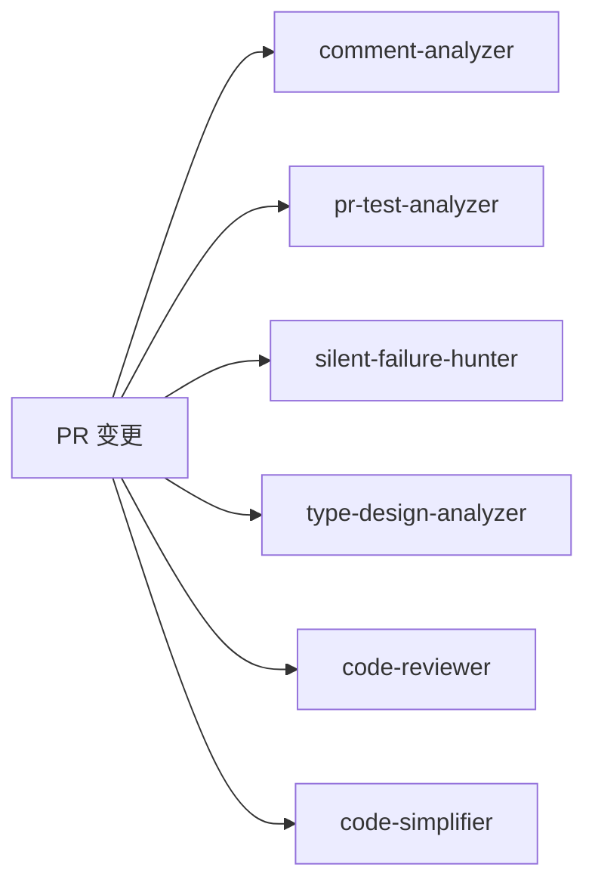

# 第9章：pr-review-toolkit - 多维度专业审查工具包

## 本章导读

**仓库路径**：`plugins/pr-review-toolkit/`

**系统职责**：
- 提供 6 个专业化 Agent，覆盖代码审查的不同维度
- 注释质量、测试覆盖、错误处理、类型设计、代码规范、代码简化
- 置信度评分机制过滤低质量问题

**能学到什么**：
- 多维度专家组 Agent 设计模式
- 置信度评分（0-100）的高信号过滤机制
- 主动触发 vs 被动触发的 Agent 设计
- 结构化输出格式的统一规范

---

## 9.1 为什么需要多维度审查

### 单一 Agent 的局限

传统的代码审查 Agent 试图覆盖所有维度，结果是：

```text
问题1：注意力分散
- 同时关注注释、测试、错误处理、类型设计...
- 每个维度都浅尝辄止，无法深入

问题2：误报率高
- 宽泛的规则产生大量假阳性
- 开发者逐渐忽略审查结果

问题3：缺乏专业深度
- 类型设计需要不变量分析
- 错误处理需要静默失败检测
- 这些需要专门的分析框架
```

### pr-review-toolkit 的解决方案

**核心设计**：每个 Agent 专注一个审查维度，形成专家组。

```
6 个专业 Agent：
├── comment-analyzer      → 注释质量与技术债务
├── pr-test-analyzer      → 测试覆盖率与质量
├── silent-failure-hunter → 错误处理与静默失败
├── type-design-analyzer  → 类型设计与不变量
├── code-reviewer         → 代码规范（置信度 ≥ 80）
└── code-simplifier       → 代码简化与可维护性
```

---

## 9.2 6 个专业 Agent 详解

### Agent 1：comment-analyzer（注释分析）

**核心使命**：注释应解释"为什么"而非"是什么"。

**分析维度**：
1. **事实准确性** - 注释与代码实现是否一致
2. **完整性评估** - 是否遗漏关键假设、副作用、错误条件
3. **长期价值** - 注释是否会随代码演进而过时
4. **误导性识别** - 歧义语言、过时引用、错误示例

**输出格式**：
```
Summary: 注释分析范围与发现概述

Critical Issues: 事实错误或高度误导的注释
- Location: [file:line]
- Issue: [具体问题]
- Suggestion: [修复建议]

Improvement Opportunities: 可增强的注释
Recommended Removals: 无价值或混淆的注释
Positive Findings: 优秀注释示例
```

**触发场景**：
- 生成大量文档注释后
- PR 包含注释修改时
- 审查现有注释的技术债务

---

### Agent 2：pr-test-analyzer（测试分析）

**核心使命**：关注行为覆盖，而非行覆盖率。

**优先级评分系统（1-10）**：

| 分数 | 含义 | 示例 |
|------|------|------|
| 9-10 | 关键功能 | 数据丢失、安全问题、系统故障 |
| 7-8 | 重要业务逻辑 | 用户可见错误 |
| 5-6 | 边界情况 | 可能导致混淆或小问题 |
| 3-4 | 完整性补充 | 可选 |
| 1-2 | 小改进 | 可选 |

**关键缺口识别**：
- 未测试的错误处理路径（可能导致静默失败）
- 缺失的边界条件测试
- 未覆盖的关键业务逻辑分支
- 缺少的负面测试用例
- 并发/异步行为测试缺失

**输出格式**：
```
Summary: 测试覆盖质量概述
Critical Gaps (8-10): 必须添加的测试
Important Improvements (5-7): 应考虑的测试
Test Quality Issues: 脆弱或过度拟合实现的测试
Positive Observations: 良好测试实践
```

---

### Agent 3：silent-failure-hunter（静默失败检测）

**核心原则**：静默失败不可接受。

**5 大检测维度**：

**1. 识别所有错误处理代码**：
```python
# 需要检查的模式
try/except 块
错误回调和错误事件处理器
处理错误状态的条件分支
失败时的回退逻辑和默认值
记录错误但继续执行的地方
可能隐藏错误的可选链或空合并
```

**2. 日志质量审查**：
- 是否使用适当的严重级别记录错误？
- 日志是否包含足够的上下文？
- 6 个月后这个日志能帮助调试吗？

**3. 用户反馈检查**：
- 用户是否收到清晰、可操作的反馈？
- 错误消息是否解释用户可以做什么来修复？

**4. Catch 块特异性**：
- catch 块是否只捕获预期的错误类型？
- 是否可能意外抑制无关错误？

**5. 隐藏失败模式**：
```python
# 绝对禁止的模式
try:
    do_something()
except:
    pass  # 空 catch 块

# 危险的静默失败
result = obj?.method()  # 可能静默跳过
```

**输出格式**：
```
Location: 文件路径和行号
Severity: CRITICAL / HIGH / MEDIUM
Issue Description: 问题所在及其原因
Hidden Errors: 可能被捕获和隐藏的意外错误类型
User Impact: 对用户体验和调试的影响
Recommendation: 具体的代码修复建议
Example: 修正后的代码示例
```

---

### Agent 4：type-design-analyzer（类型设计分析）

**核心使命**：类型应使非法状态无法表示。

**4 维评分系统（1-10）**：

```
封装评分（Encapsulation）：
- 内部实现细节是否正确隐藏？
- 类型的不变量是否可以从外部违反？

不变量表达（Invariant Expression）：
- 不变量通过类型结构传达得有多清楚？
- 是否在编译时强制执行？

不变量有用性（Invariant Usefulness）：
- 不变量是否防止真实的 bug？
- 是否与业务需求一致？

不变量强制执行（Invariant Enforcement）：
- 不变量是否在构造时检查？
- 是否不可能创建无效实例？
```

**常见反模式**：
- 没有行为的贫血领域模型
- 暴露可变内部的类型
- 仅通过文档强制执行的不变量
- 构造边界缺少验证

---

### Agent 5：code-reviewer（代码规范审查）

**核心机制：置信度评分（0-100）**

```
0-25：可能是误报或预先存在的问题
26-50：小挑剔，未在 CLAUDE.md 中明确说明
51-75：有效但影响较小的问题
76-90：需要注意的重要问题
91-100：严重 bug 或明确的 CLAUDE.md 违规

仅报告置信度 ≥ 80 的问题
```

**审查维度**：
1. **项目指南合规性**：验证是否遵守 CLAUDE.md 中的明确规则
2. **Bug 检测**：逻辑错误、null 处理、竞态条件、内存泄漏
3. **代码质量**：代码重复、缺少关键错误处理、可访问性问题

**输出格式**：
```
Critical (90-100): 严重 bug 或明确违规
- 描述 + 置信度分数
- 文件路径和行号
- 具体的 CLAUDE.md 规则或 bug 解释
- 具体的修复建议

Important (80-89): 重要问题
```

---

### Agent 6：code-simplifier（代码简化）

**核心使命**：在保留所有功能的同时提高清晰度。

**5 大精炼原则**：

1. **保留功能**：永不改变代码的功能，只改变实现方式
2. **应用项目标准**：遵循 CLAUDE.md 中建立的编码标准
3. **增强清晰度**：减少不必要的复杂性和嵌套
4. **保持平衡**：避免过度简化导致可读性降低
5. **聚焦范围**：仅精炼当前会话中最近修改的代码

**重要规则**：
```
避免嵌套三元运算符：
❌ const x = a ? b ? c : d : e;
✅ if (a) { x = b ? c : d; } else { x = e; }

选择清晰而非简洁：
❌ const r = arr.reduce((a,b) => ({...a,[b.id]:b}), {});
✅ const result = {};
   for (const item of arr) {
     result[item.id] = item;
   }
```

**操作模式**：主动触发，在代码编写后自动精炼，无需用户明确请求。

---

## 9.3 模型配置策略

```
comment-analyzer:      inherit（继承父会话模型）
pr-test-analyzer:      inherit
silent-failure-hunter: inherit
type-design-analyzer:  inherit
code-reviewer:         opus（使用 Opus 模型，推理能力优先）
code-simplifier:       opus
```

**设计逻辑**：
- 前 4 个 Agent 使用继承模型，速度优先
- code-reviewer 和 code-simplifier 使用 Opus，因为需要深度推理

---

## 9.4 架构亮点

### 1. 专业化分工

每个 Agent 专注一个审查维度，避免单一 Agent 过于复杂：



### 2. 高信号过滤

```
code-reviewer 的置信度机制：
- 只报告 ≥ 80 分的问题
- 宁可漏报，不可误报
- 减少开发者的"审查疲劳"
```

### 3. 主动 vs 被动触发

| Agent | 触发方式 | 时机 |
|-------|---------|------|
| comment-analyzer | 被动（用户请求） | PR 审查时 |
| pr-test-analyzer | 被动 | PR 创建后 |
| silent-failure-hunter | 被动 | 错误处理代码审查 |
| type-design-analyzer | 被动 | 引入新类型时 |
| code-reviewer | 被动 | 提交前 |
| code-simplifier | **主动** | 代码编写后自动触发 |

### 4. 结构化输出

所有 Agent 使用一致的输出格式：
```
Summary → Critical Issues → Important Issues → Improvements → Positive Findings
```

---

## 9.5 使用模式

### 单独调用

```bash
# 注释问题
"Review the comments in this PR for accuracy"  → comment-analyzer

# 测试覆盖
"Check test coverage for this PR"              → pr-test-analyzer

# 错误处理
"Find silent failures in error handling"       → silent-failure-hunter

# 类型设计
"Analyze the type design of UserAccount"       → type-design-analyzer

# 代码规范
"Review code for style violations"             → code-reviewer

# 代码简化
"Simplify this implementation"                 → code-simplifier
```

### 综合审查

```bash
/review-pr [可选 PR 编号]
```

启动所有 6 个 Agent 的综合审查流程。

---

## 相关文件清单

```
plugins/pr-review-toolkit/
├── .claude-plugin/
│   └── plugin.json                    # 插件元数据
├── agents/
│   ├── comment-analyzer.md            # 注释分析 Agent（71 行）
│   ├── pr-test-analyzer.md            # 测试分析 Agent（70 行）
│   ├── silent-failure-hunter.md       # 静默失败检测 Agent（131 行）
│   ├── type-design-analyzer.md        # 类型设计分析 Agent（111 行）
│   ├── code-reviewer.md               # 代码审查 Agent（48 行）
│   └── code-simplifier.md             # 代码简化 Agent（84 行）
├── commands/
│   └── review-pr.md                   # PR 审查命令
└── CLAUDE.md                          # 本文档
```
