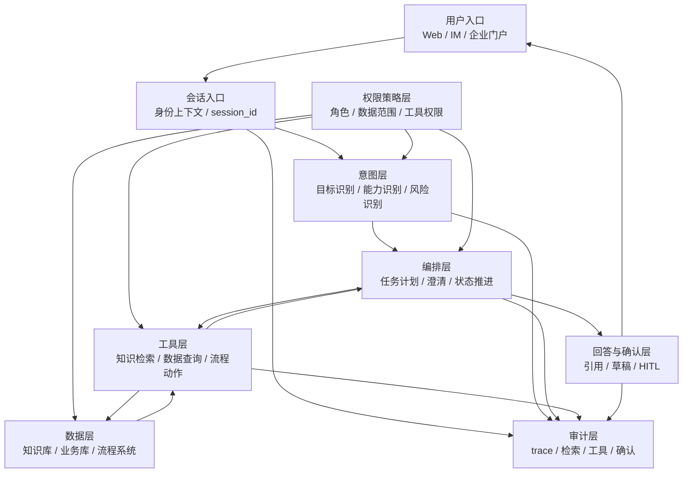

# 企业 Agent 参考架构蓝图

这张蓝图描述的是项目级企业 Agent，不是企业级 AI 平台。

它的目标是回答：一个能上线的企业 Agent 至少要有哪些层，每一层负责什么，哪些边界不能省。

## 总体架构

这张图里的每条线都代表一个控制点：理解、查询、执行和回答都要受权限约束，并留下审计记录。

## 1. 用户入口与会话入口

用户入口可以是 Web、企业 IM、OA 门户或内部系统入口。会话入口负责把请求转成可信上下文：

| 上下文 | 用途 |
| --- | --- |
| user_id | 标识当前用户 |
| roles | 判断工具和数据权限 |
| org_scope | 限制组织范围 |
| session_id | 串起多轮对话 |
| trace_id | 串起一次执行链路 |

不要让模型从自然语言里猜用户身份。身份上下文必须来自登录态或可信网关。

## 2. 意图层

意图层负责把一句话拆成可执行判断，至少要输出：

| 字段 | 用途 |
| --- | --- |
| goal | 用户最终要完成什么 |
| capabilities | 需要知识、数据、引导还是自动化 |
| missing_fields | 哪些字段需要澄清 |
| risk_level | 是否涉及敏感数据或写操作 |
| next_action | 回答、查询、澄清、确认或执行 |

意图层不能只输出一个标签。企业问题经常同时包含查询、判断、引导和流程动作。

## 3. 编排层

编排层负责把意图转成步骤，并维护任务状态：

| 职责 | 说明 |
| --- | --- |
| 任务计划 | 拆出查询、检索、判断、确认、执行 |
| 澄清恢复 | 用户补充字段后继续原任务 |
| 状态推进 | 记录草稿、确认、提交、失败等状态 |
| 失败处理 | 判断重试、补偿、停止或人工接管 |

不要让工具调用散落在各个 Prompt 里。否则流程失败后，很难知道任务停在哪一步。

## 4. 权限策略层

权限策略层必须独立存在，不能只写在系统 Prompt 里。它至少控制三类权限：

| 权限 | 控制对象 |
| --- | --- |
| 数据权限 | 用户能看到哪些文档、记录、字段 |
| 工具权限 | 用户能调用哪些工具、用什么参数 |
| 输出权限 | 用户能看到多细的回答和引用 |

权限策略要同时约束意图层、编排层、工具层和数据层。

如果只在最终回答前过滤，LLM 可能已经看到不该看的上下文。

## 5. 工具层与数据层

工具层是 Agent 接触真实系统的边界。

| 工具类型 | 典型系统 | 控制重点 |
| --- | --- | --- |
| 知识检索 | 制度库、FAQ、流程文档 | 权限过滤、版本、生效时间、引用 |
| 数据查询 | HR、考勤、报销、绩效 | user_id 注入、字段脱敏、结果控量 |
| 流程动作 | OA、审批、工单、消息通知 | HITL、幂等、状态记录、补偿 |

数据层要有二次保护。即使编排层出错，数据库或业务服务也应该拒绝越权访问。

## 6. 回答与确认层

回答层不是简单把模型输出发给用户，而是根据风险决定输出形态：

| 场景 | 输出形态 |
| --- | --- |
| 知识问答 | 答案 + 引用 |
| 个人数据 | 结果 + 时间范围 + 数据来源 |
| 操作引导 | 当前状态 + 下一步 |
| 高风险动作 | 草稿 + 参数 + 确认按钮 |

确认层必须冻结参数。用户确认的是具体动作，不是一句泛泛的“继续”。

## 7. 审计层

审计层记录的是执行链路，不只是最终答案：

| 事件 | 内容 |
| --- | --- |
| user_message | 用户输入和会话上下文 |
| intent_event | 意图、能力、风险和缺失字段 |
| retrieval_event | 检索 query、候选文档、引用版本 |
| data_query_event | 查询工具、参数摘要、结果状态 |
| human_action_event | 确认、取消、修改 |
| tool_call_event | 工具名、风险等级、调用结果 |
| answer_event | 最终回答和引用 |

## 最小上线架构

如果只能做最小版本，也至少保留这六层：

1. 可信身份上下文；
2. 结构化意图识别；
3. 权限策略层；
4. 受控工具层；
5. HITL 确认点；
6. 审计链路。

可以先不做平台化，但不能省权限、状态和审计。

这就是企业 Agent 和普通 Chatbot 的分界线。
