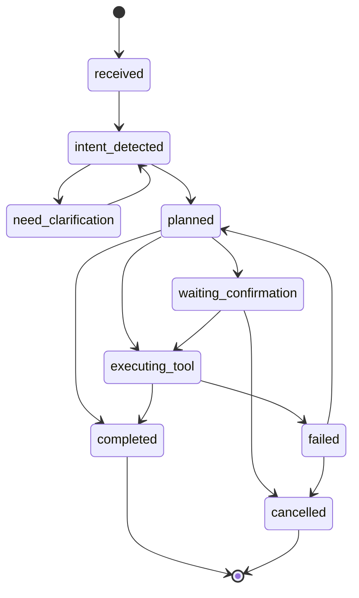

# 企业 Agent 运行时状态机

企业 Agent 不能只靠“当前对话文本”判断任务走到哪一步。

一旦涉及澄清、确认、工具调用和流程提交，就必须有显式状态机。

## 最小状态集合

| 状态 | 含义 |
| --- | --- |
| received | 已接收用户输入 |
| intent_detected | 已完成意图识别和风险判断 |
| need_clarification | 缺少关键字段，等待用户补充 |
| planned | 已生成可执行计划 |
| waiting_confirmation | 高风险动作等待用户确认 |
| executing_tool | 正在调用工具或业务系统 |
| completed | 已完成回答或业务动作 |
| failed | 执行失败，需要停止、重试或人工接管 |
| cancelled | 用户取消或确认票据过期 |

状态名不重要，重要的是每个状态都能回答：下一步能做什么，不能做什么。

## 状态流转

澄清不是失败，确认不是闲聊。它们都是运行时状态。

## 状态数据

每个任务实例至少保存这些字段：

| 字段 | 用途 |
| --- | --- |
| task_id | 任务实例标识 |
| session_id | 关联多轮对话 |
| trace_id | 关联一次执行链路 |
| current_state | 当前状态 |
| intent_result | 最近一次意图识别结果 |
| plan_steps | 当前计划步骤 |
| pending_inputs | 等待用户补充的字段 |
| confirmation_ticket_id | 等待确认的票据 |
| last_error | 最近失败原因 |

状态数据要能持久化。服务重启后，至少能知道任务停在哪一步。

## 可恢复与不可恢复

| 状态 | 是否可恢复 | 处理方式 |
| --- | --- | --- |
| need_clarification | 是 | 用户补充字段后重新进入意图判断 |
| waiting_confirmation | 是 | 确认票据未过期时继续执行 |
| executing_tool | 视工具而定 | 用幂等键查询或重试 |
| failed | 视原因而定 | 可重试错误回到 planned，不可恢复错误停止 |
| cancelled | 否 | 不再继续原任务 |
| completed | 否 | 只允许查询结果或发起新任务 |

不要把所有失败都重试。写操作失败时，先查业务系统真实状态，再决定是否补偿或人工接管。

## 失败分类

| 失败类型 | 示例 | 默认处理 |
| --- | --- | --- |
| missing_input | 缺日期、金额、对象 | 进入澄清 |
| permission_denied | 用户无权查或执行 | 停止并记录审计 |
| risk_blocked | 风险策略拦截 | 停止或进入确认 |
| tool_timeout | OA 或数据库超时 | 查询状态后有限重试 |
| tool_failed | 业务系统返回错误 | 记录错误，必要时人工接管 |
| citation_failed | 引用不存在或不在候选集 | 不输出带来源结论 |

错误要明确，不要把所有异常都包装成“系统繁忙”。

## 状态机边界

状态机负责执行生命周期，不负责业务权限本身。

| 能力 | 应放位置 |
| --- | --- |
| 判断用户能不能查 | policy |
| 判断是否需要确认 | risk policy / planner |
| 保存当前任务状态 | planning state |
| 执行工具调用 | tools / infrastructure |
| 写入审计事件 | audit service |

状态机应该调用这些能力，而不是把所有逻辑都塞进去。

## 上线底线

1. 每个任务都有 `task_id`、`session_id`、`trace_id`；
2. 等待澄清和等待确认必须可恢复；
3. 高风险工具必须从 `waiting_confirmation` 进入执行；
4. 写操作必须有幂等键；
5. 失败状态必须记录原因和下一步建议；
6. 已取消和已完成任务不能继续执行旧计划。

没有状态机，企业 Agent 很快会在多轮对话、重试和流程提交里失控。
