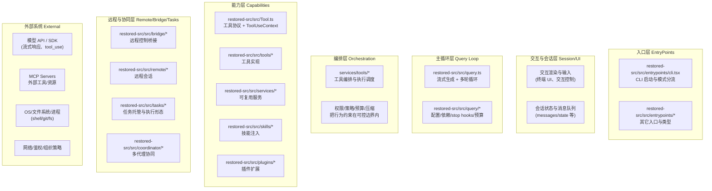
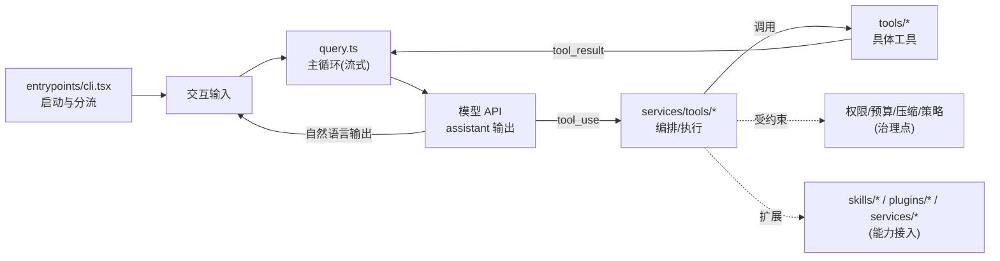

# 01 系统全景与学习路线

## 先给结论：你要建立的全局心智图

Claude Code 可以被理解为一个“可调度的软件工程执行系统”，它把自然语言请求编译成一系列可控的工程动作，并在一个可循环的主链路里完成：

- 本书的分析基点是基于 `@anthropic-ai/claude-code` `2.1.88` 还原出的 `restored-src/src` 源码（研究用途的还原仓库语境）。
- 组织上下文：把用户输入、工程状态、系统约束拼成可供模型决策的请求。
- 规划与执行：允许模型在一次请求中多次发起工具调用（tool use），并把工具结果（tool result）回填到同一条轨迹里继续推理。
- 治理与扩展：通过权限、预算、压缩、回退模型、远程协同与插件化能力，把“会做事”约束在可控边界内。

这也是后续各卷的阅读主线：先抓住“循环主链路”，再看扩展如何接入，最后理解远程与多代理如何调度。

## 系统整体分层图（从输入到执行闭环）

下面先给一张“只讲分层”的图：它只回答“有哪些层、每层大概装什么”，不试图在同一张图里塞进调用流向与模式分支。

注：上面的“远程与协同层”是理解用归类，不代表严格的调用层级或唯一的数据流向。

## 最小执行闭环（主链路）

有了分层坐标系后，再用一张“只讲最小闭环”的图回答：一次请求是如何在 `query.ts` 的循环里，借助工具回环把任务推进到完成的。

## 为什么它不是普通终端聊天工具

如果把“终端聊天工具”理解为：读入一段文本，发给模型，打印模型回复，那么 Claude Code 明显超出了这个范畴。你可以从三个事实去验证它的系统属性：

1. **入口就不是单一模式。** 在 `restored-src/src/entrypoints/cli.tsx` 里，CLI 在真正加载完整交互前，会做大量“模式分流”的 fast-path：例如版本输出、后台会话管理、远程控制（bridge/remote-control）、daemon worker 等。入口层的复杂度意味着它不是“一个 REPL”，而是“多个运行形态共享同一个产品入口”。  
2. **核心不是“单次问答”，而是“可循环的查询引擎”。** `restored-src/src/query.ts` 暴露的是一个异步生成器形式的 `query()` 主循环：它会在一轮内多次推进状态，处理中断、工具调用回填、预算恢复、压缩与回退等问题。换句话说，它围绕的是“任务完成”，而不是“说一句话”。  
3. **系统的抽象中心是“工具协议 + 上下文治理”。** `restored-src/src/Tool.ts` 定义的 `ToolUseContext` 不只是“工具列表”，而是一个包含权限模式、MCP 客户端与资源、会话状态读写、UI 回调、预算/配置等多维约束的上下文容器。只有当你需要调度多个工具、跨多轮推进、并在不同运行模式下复用基础设施时，才会需要这样厚的上下文抽象。

把这三点合在一起，你会得到更准确的定位：Claude Code 是一个在终端呈现的 agentic 系统，它的“聊天”只是交互外壳；真正的核心是一个能把自然语言驱动成工程动作序列，并对这些动作进行治理与扩展的执行平台。

## 目录职责总览（读源码时的“地图图例”）

下面这张表用于回答两个问题：这个目录大概做什么？你读到它时应该带着什么业务问题？

| 目录/模块 | 职责一句话 | 你应该关注的关键词 |
| --- | --- | --- |
| `entrypoints/` | 入口与运行模式分流：决定以哪种形态启动系统 | fast-path、daemon、remote-control、bg sessions、init |
| `query.ts` 与 `query/` | 主循环与状态机：把“一次请求”推进成“可完成的轨迹” | stream、turn、continue/stop、compact、budget、fallback |
| `tools/` | 具体工具实现：Bash、文件编辑、搜索、MCP、子代理等 | tool_use/tool_result、I/O 约束、错误恢复、进度汇报 |
| `services/` | 可复用服务层：API、MCP 管理、分析、存储、压缩等 | orchestration、policy、analytics、mcp、storage |
| `bridge/` | 远程控制桥接：把本机能力作为可被远程调度的环境 | bridgeMain、login/policy、capabilities |
| `remote/` | 远程会话：连接管理、会话生命周期与状态同步 | session、connectivity、sync、registry |
| `tasks/` | 任务托管与执行形态：把“任务”作为可调度对象在不同运行形态中推进 | task、runner、progress、lifecycle |
| `skills/` | 技能系统：把方法论与固定流程注入主链路 | skill discovery、prefetch、bundled skills |
| `plugins/` | 插件机制：第三方扩展的加载、生命周期与操作 | operations、sandbox、compat、hooks |

> 阅读建议：先用这张表“判定边界”，再进入具体文件。遇到不确定的名词，先问它属于哪一层、它在主链路里何时被调用，然后再追踪引用。

## 三个关键源码入口：从它们开始读最省力

这三个文件仍然是整套书最值得先抓住的“最小闭环三件套”。即使现在 01 到 14 章已经补齐，它们依然是你回看主链路时最稳的起点。

### 入口分流：`restored-src/src/entrypoints/cli.tsx`

它解决的是“**我该以哪种模式启动系统**”。这个文件的价值不在于每个分支细节，而在于它揭示了 Claude Code 的产品边界：

- 它有大量 fast-path：说明系统追求启动性能，并把“重模块加载”推迟到必要时才发生。
- 它包含远程控制与后台会话等入口：说明系统支持被调度、被托管，而不只是一次性的交互会话。
- 它在不同路径中选择性地加载配置、初始化 sinks/策略等：说明初始化成本被按模式拆分，系统在“可用性”和“成本”之间做了精细权衡。

### 主循环：`restored-src/src/query.ts`

它解决的是“**一次请求如何变成可完成的执行闭环**”。你读它时可以抓三条主线：

- 以 `query(params)` 为入口，理解它为何是 `AsyncGenerator`：流式输出与中间事件需要统一在同一条时间线上被消费。
- 关注“工具回环”：当模型返回 `tool_use` 时，系统如何暂停自然语言生成，转而运行工具并回填 `tool_result`，再继续推进。
- 关注“治理机制”：预算（token budget）、压缩（compact）、回退（fallback）、以及 stop hooks 等，都是把 agent 行为约束到可控边界的关键部件。

### 工具协议与上下文：`restored-src/src/Tool.ts`

它解决的是“**工具系统如何被定义、被限制、被复用**”。其中最重要的读法是：

- 先理解 `ToolUseContext` 的“厚度”：它携带的不只是工具集合，还包含权限模式、MCP 连接与资源、状态读写与 UI 回调等跨层能力。
- 把它当作主链路的“通用地基”：query loop、工具编排、技能/插件、远程协同等能力，都需要共享一个一致的上下文容器，才能在不同模式下复用基础设施。

## 学习路线（从全景图进入全书）

建议把本章当作“全书导航页”，而不是只服务 Phase 1。一个更实用的路线是：

1. 先读本章的分层图与目录职责表，明确每层的业务问题与边界。
2. 打开并通读三件套：`entrypoints/cli.tsx`、`query.ts`、`Tool.ts`，把名词和分层对上号；需要“按目录/文件回查”时，配合 `book/part-4-附录/90-源码地图-按目录反查系统能力.md` 与 `book/part-4-附录/91-核心文件索引.md` 一起使用。
3. 顺读 Part 1 的 `01` 到 `06`，把“入口 -> 初始化 -> 上下文 -> query -> tool -> 收尾”读成一条可复述主链路。
4. 再顺读 Part 2 的 `07` 到 `10`，把扩展能力放回主链路理解，不要孤立看 MCP、Skills、Plugins。
5. 最后读 Part 3 的 `11` 到 `14`，把远程、后台和多代理理解成“在同一套任务与上下文模型上的扩展形态”。
6. 读完正文后，再进入 Part 4 的 `90`、`91`、`92`、`99`，完成目录反查、文件回查、抽象收束和实践练习。
