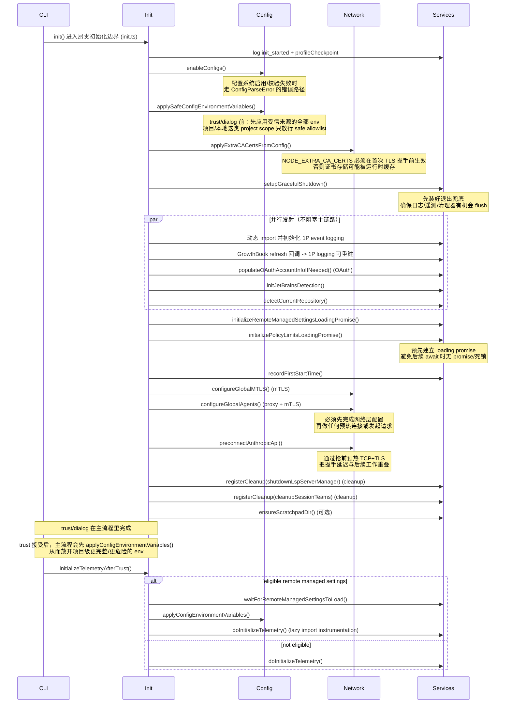

# 02 初始化、配置、环境、遥测

上一章我们把 `restored-src/src/entrypoints/init.ts` 叫做“昂贵初始化边界”：只有当 CLI 真要进入主会话/执行命令时，才值得付出这笔成本。

这一章专门回答一个问题：**这条边界里到底初始化了什么？为什么很多动作必须抢在主会话开始前完成，甚至必须早于 trust/dialog、早于第一次网络连接、早于命令真正执行？**

## 1. 本章要解决什么问题

如果你把初始化理解成“加载配置、建几个单例”，你会低估 `init.ts` 的复杂度，也会在复刻时踩一串坑：TLS 证书来不及生效、代理没有覆盖预热连接、遥测在错误时间点初始化、远程策略加载导致死锁、退出时遗留 LSP/临时资源等。

因此本章聚焦四件事：

1. `init()` 这条边界把哪些“全局基础设施”一次性打齐。
2. 哪些动作必须抢在 trust/dialog 之前做，哪些必须等待 trust 之后做（尤其是环境变量与遥测）。
3. 初始化的先后顺序长什么样，以及顺序背后的工程原因。
4. 站在复刻视角，最小版本应该保留哪些能力，哪些可以先不做。

## 2. 先看初始化时序图

这张图刻意把初始化拆成两段：

- **主会话前（pre-trust / 首次外发请求之前）**：保证配置可用、TLS/代理正确、退出可清理，并把能并行的耗时工作提前“发射”。
- **信任建立后（post-trust）**：主流程会放开项目级更完整/更危险的 env，并在此基础上初始化 3P 遥测；若远程设置会影响 env，则在遥测前做一次“面向遥测的重应用”以纳入远程设置。



读图时你只需要抓住一句话：**先把“会影响网络正确性、退出清理、全局环境一致性”的事情做完，再进入可交互的主会话；trust 接受后再放开项目级 env，并在 env 最终态明确后初始化遥测。**

## 3. 源码入口

本章主要锚定 `init.ts`，但为了把“为什么要抢前”讲清楚，需要一起看它调用的几个关键入口：

- `restored-src/src/entrypoints/init.ts`：初始化编排本体（pre-trust + post-trust 遥测补段）。
- `restored-src/src/utils/config.ts`：`enableConfigs()`、`recordFirstStartTime()` 等配置系统入口。
- `restored-src/src/utils/managedEnv.ts`：`applySafeConfigEnvironmentVariables()` 与 `applyConfigEnvironmentVariables()` 的分层注入策略。
- `restored-src/src/utils/caCertsConfig.ts`：从配置提取额外 CA 并尽早写入 `process.env`（影响 TLS）。
- `restored-src/src/utils/mtls.ts` 与 `restored-src/src/utils/proxy.ts`：全局 mTLS 与 HTTP agents（代理）配置。
- `restored-src/src/utils/telemetry/instrumentation.ts`：遥测初始化（在 `init.ts` 中通过动态 import 延迟加载）。
- `restored-src/src/utils/cleanupRegistry.ts` 与 `restored-src/src/services/lsp/manager.ts`：清理器注册与 LSP 退出清理。
- `restored-src/src/services/remoteManagedSettings/index.ts` 与 `restored-src/src/services/policyLimits/index.ts`：远程设置/策略限制的“抢前建立 loading promise”。

## 4. 主调用链拆解

这一节按“业务推进顺序”拆解 `init.ts`，而不是按 import 顺序。

### 4.1 入口定位：`init()` 是一次性的昂贵边界

`init()` 被 `memoize()` 包装，意味着一次进程生命周期里它设计上只应执行一次。它做了两件很像“工程地基”的事：

- 打点与诊断日志：`logForDiagnosticsNoPII('info', 'init_started')` + `profileCheckpoint(...)`，为启动耗时与失败定位提供可观测性。
- 统一错误边界：配置解析失败时走 `ConfigParseError` 的专用路径，在非交互会话里避免渲染对 JSON 消费者不友好的交互 UI。

这一段的设计意图是：**初始化不是业务逻辑，而是“把业务运行环境变得可预测”的系统工程。**

### 4.2 配置加载：先让配置系统可用，并尽早失败

初始化一开始就调用 `enableConfigs()`。这一步本质是：

- 启用配置系统、加载并校验配置（例如 settings）。
- 如果配置不可解析，尽早报错并退出，避免系统进入“半初始化”状态。

同时你会看到一个很典型的工程优化：无效配置对话框在错误路径里动态 import（注释里明确说是为了避免 init 阶段加载 React）。

### 4.3 安全环境变量注入：trust/dialog 前只注入“安全子集”

紧接着是 `applySafeConfigEnvironmentVariables()`，并且注释明确强调：

- trust/dialog 之前：先应用受信来源的全部 env；
- 对 project/local 这类项目作用域来源，只放行 safe allowlist；
- trust 接受后：主流程会调用 `applyConfigEnvironmentVariables()`，才放开项目级更完整/更危险的 env（`initializeTelemetryAfterTrust()` 不是“完整 env 注入”的主要责任方）。

这一步解决的不是“写几个 env”这么简单，而是把初始化拆成两道门：

- **门 1（pre-trust）**：让后续模块按正确的基本环境运行，但不引入敏感/需要信任前置的设置。
- **门 2（post-trust）**：信任成立后，才放开项目级更完整/更危险的 env；在 env 最终态明确后，再初始化遥测等“会外发/会持久化”的系统。

### 4.4 抢在首次网络连接前：额外 CA 证书必须早应用

`applyExtraCACertsFromConfig()` 的注释把时序要求说得非常直白：`NODE_EXTRA_CA_CERTS` 必须在任何 TLS 连接之前生效。

这类动作之所以必须抢前，原因通常不是“写 env 慢”，而是运行时/底层库会在启动或首次握手时缓存证书/连接池状态。你如果等到主会话里才改，往往已经来不及影响第一批网络请求了。

### 4.5 退出与资源回收：先装好“会话结束时的地板”

`setupGracefulShutdown()` 很早就被调用，目的是让后续注册的清理器、日志/遥测 flush 都有统一出口。

随后 `registerCleanup(...)` 注册了至少两类关键清理：

- `shutdownLspServerManager`：LSP server manager 的退出清理（初始化本体在更晚的 `main.tsx`，但清理点要提前装好）。
- `cleanupSessionTeams`：清理本会话产生的 swarm team 资源（通过动态 import 延迟加载，避免大多数会话支付不必要成本）。

这一段的关键不是“有 cleanup”，而是 **“cleanup 必须比资源的首次创建更早注册”**：否则异常退出时就可能遗留子进程/临时目录/缓存文件。

### 4.6 遥测与事件：把重模块延迟到需要时，再按 trust 分段初始化

`init.ts` 里有两种“观测相关”的初始化策略：

1. **1P event logging（第一方事件）**：通过动态 import 异步初始化，并注册 GrowthBook 刷新回调以便配置变化时重建。这条链路被定义为“无安全顾虑”，但仍然选择延迟加载以减轻启动成本（你会在注释中看到对模块体积的敏感度）。
2. **3P telemetry（客户 OTLP：metrics/logs/traces）**：严格放在 trust 之后初始化。交互主流程在 trust 接受后会先 `applyConfigEnvironmentVariables()`；而 `initializeTelemetryAfterTrust()` 更偏向“trust 后的遥测初始化”，并且为了“远程设置可影响 env”的场景，采用：
   - eligible 用户：等待 `waitForRemoteManagedSettingsToLoad()`（非阻塞），然后为遥测再执行一次 `applyConfigEnvironmentVariables()`（把远程设置纳入 env），再真正初始化 telemetry；
   - 非 eligible 用户：直接初始化 telemetry。

同时它还处理了一个“模式差异”的例外：非交互会话且开启 beta tracing 时，会尝试更早（eager）初始化，以确保 tracer 在第一条 query 前可用，但仍有防止重复初始化的 guard（`telemetryInitialized`）。

这里的核心设计点是两句话：

- **遥测初始化是重依赖（OpenTelemetry + exporters）**，所以要 lazy-load；
- **遥测是外发/可持久化行为**，所以必须在 trust 成立、环境变量最终态明确后再初始化。

### 4.7 OAuth 账户信息补齐：为跨入口登录路径兜底

`populateOAuthAccountInfoIfNeeded()` 是一个典型的“跨入口一致性修复”：注释明确指出某些登录路径（例如通过 VSCode extension）可能不会把 OAuth account info 写入缓存配置，因此需要在初始化阶段补齐。

这类动作通常放在 init 的原因是：它不是某个子命令的私货，而是会影响后续多个能力（鉴权、组织策略、远程设置获取等）的全局前置条件。

### 4.8 远程设置 / 策略限制：抢前建立 loading promise，避免后续系统死锁

初始化阶段会根据 eligibility 提前调用：

- `initializeRemoteManagedSettingsLoadingPromise()`
- `initializePolicyLimitsLoadingPromise()`

注释强调了一个容易被忽略的问题：如果其它系统（例如 plugin hooks）未来要 `await` 远程设置加载，那么必须保证“可等待的 promise 已经存在”，并且还要有 timeout 防止某些模式下永远不调用加载函数导致死锁。

这就是典型的“必须抢前”的原因：**不是为了更快拿到结果，而是为了让后续任何 await 都有确定的对象可依赖。**

### 4.9 网络代理与 mTLS：先统一全局网络行为，再做预热连接

`configureGlobalMTLS()` 与 `configureGlobalAgents()` 定义了本进程的“网络现实”：

- 是否要用 mTLS；
- 是否要走代理（以及代理与 mTLS 如何组合）；
- 全局 HTTP agents 如何配置，以便 SDK/请求层复用正确的连接池。

紧接着才会调用 `preconnectAnthropicApi()` 做预热连接。这里的顺序非常关键：**如果你先 preconnect 再配置代理/mTLS，你预热出来的连接很可能走错通道，反而带来隐蔽故障。**

此外，`CLAUDE_CODE_REMOTE` 场景下还有 upstream proxy 的初始化逻辑：启动本地 CONNECT relay，并把 subprocess 的代理注入函数注册到 `subprocessEnv`，同样属于“越早越好”的基础设施（但它被 gated，并且 fail-open 以避免阻塞主流程）。

### 4.10 其它“抢前但不阻塞”的准备：环境适配与目录

初始化的尾部还处理了两类“实践中很要命但不想阻塞主链路”的事情：

- Windows shell 适配：`setShellIfWindows()`，避免后续 shell 调用走错环境。
- Scratchpad 目录：若启用则 `ensureScratchpadDir()`，把运行时需要的落盘位置提前准备好。

## 5. 关键设计意图

这一章的所有细节最终都指向同一个架构意图：**把主会话的可预测性，建立在“抢前完成的全局基础设施”之上。**

具体来说，`init.ts` 体现了几条可复用的工程原则：

- **把初始化分成 pre-trust 与 post-trust 两段。** trust/dialog 前：应用受信来源 env，同时对项目作用域 env 做 allowlist 放行；trust 接受后：才放开项目级更完整/更危险的 env，并在 env 最终态明确后初始化 3P 遥测。这让系统既能尽早准备运行环境，又能避免在信任未建立时放大项目级环境的攻击面或触发外发行为。
- **任何会影响网络正确性的设置都必须早于第一次 TLS 握手。** 额外 CA、mTLS、代理 agents 如果晚了，要么不生效，要么只对后续请求生效，导致“偶发失败、难以复现”的工程噩梦。
- **先装退出地板，再跑业务。** `setupGracefulShutdown()` 与 `registerCleanup(...)` 的顺序体现了：清理器要比资源创建更早注册，才能覆盖异常退出与中断场景。
- **用“先建 promise”替代“到处判断是否已加载”。** 远程设置/策略限制通过抢前建立 loading promise，让其它系统可以可靠 await，并通过 timeout 避免死锁。
- **延迟加载重依赖，但不延迟关键语义。** 遥测与部分分析模块通过动态 import 降低启动成本，但初始化触发点被精确约束在 trust 后；启动阶段用诊断日志与 checkpoint 保证可观测性。
- **能并行就并行，能 fail-open 就 fail-open。** OAuth 补齐、IDE 检测、仓库探测、1P logging 都是 fire-and-forget：它们提升体验与能力一致性，但不应把主链路锁死在 IO 上。

## 6. 从复刻视角看

如果你在做一个自己的 agent CLI，初始化层最容易走两个极端：

- 过度精简：导致网络/证书/代理/清理在关键时刻失效，Bug 以“偶发、环境相关”形式出现。
- 过度堆砌：把所有基础设施都塞进启动，导致 `--help`、`--version` 之类路径也变慢，失去“入口分流”的意义。

一个更务实的最小可复刻初始化，可以只保留下面这些能力（按优先级从高到低）：

- 配置系统启用与尽早失败：`enableConfigs()`，保证后续读取配置不会处在未初始化状态。
- 两段式环境变量注入：trust 前 `applySafe...`，trust 后 `applyConfig...`（尤其当你有远程设置会改写配置时）。
- TLS/网络正确性抢前：额外 CA（如 `NODE_EXTRA_CA_CERTS`）、mTLS、代理 agents 必须在任何网络请求前完成。
- 统一的 graceful shutdown + cleanup registry：至少能清理子进程（LSP）、临时目录、会话资源，避免“跑一次就脏一次”。
- 延迟加载的遥测（可选）：如果你需要观测，就把初始化放在 trust 后，并 lazy-load 重依赖。

你可以把简化版 `init` 归纳成这样一段伪代码（只保留关键顺序）：

```text
init():
  enableConfigs()
  applySafeConfigEnvironmentVariables()
  applyExtraCACertsFromConfig()
  setupGracefulShutdown()
  initializeRemoteSettingsLoadingPromiseIfEligible()
  configureGlobalMTLS()
  configureGlobalAgents()
  registerCleanupHandlers()
  preconnectApiIfSafe()

initializeAfterTrust():
  waitRemoteSettingsIfNeeded()
  applyConfigEnvironmentVariables()
  initializeTelemetryLazy()
```

### 6.1 源码追踪提示

如果你准备结合源码把本章真正走一遍，推荐按下面顺序追：

1. 先看 `restored-src/src/entrypoints/init.ts`，只抓初始化顺序，不急着抠细节实现。
2. 再用 `rg -n "enableConfigs|applySafe|applyConfig|cleanup|telemetry|mtls|proxy"` 在 `restored-src/src/entrypoints` 和 `restored-src/src/utils` 里追每一步落点。
3. 最后回到 `restored-src/src/entrypoints/cli.tsx` 与 `restored-src/src/main.tsx`，确认哪些路径会真正触发 `init()`，哪些 fast-path 会刻意绕开它。

## 7. 本章小练习

1. 给你的 CLI 写一个最小 `init()`，并强制把“网络相关设置”放在任何请求之前：先应用额外 CA，再配置代理/mTLS，最后才允许发起 API 请求。
2. 设计一个两段式 env 注入：trust 前只注入无敏感信息的 env；trust 后再注入完整 env，并在这一步之后才初始化遥测/日志上报。
3. 实现一个 cleanup registry：注册一个“模拟 LSP 子进程”的清理器（例如定时器或子进程），验证在 SIGINT/SIGTERM 下会被可靠触发。

## 8. 本章小结

`restored-src/src/entrypoints/init.ts` 的价值不在于“初始化了很多东西”，而在于它把初始化做成了一条可治理的边界：

- pre-trust 阶段先打齐配置、受信来源 env（并对项目作用域 env 做 allowlist 放行）、TLS/代理与退出清理，确保主会话一开始就运行在正确的全局环境里；
- post-trust 阶段在主流程放开项目级更完整/更危险的 env 后，再完成遥测初始化；若远程设置会影响 env，则在遥测前重应用 env，避免外发行为发生在错误时机；
- 同时通过动态 import、并行发射与 fail-open，让“正确性与可观测性”尽量不吞噬启动性能。

下一章我们会继续沿着主链路下沉：当初始化完成后，主会话如何建立会话上下文与消息模型，并为后续的 query loop 与 tool 回环提供统一的数据结构。
