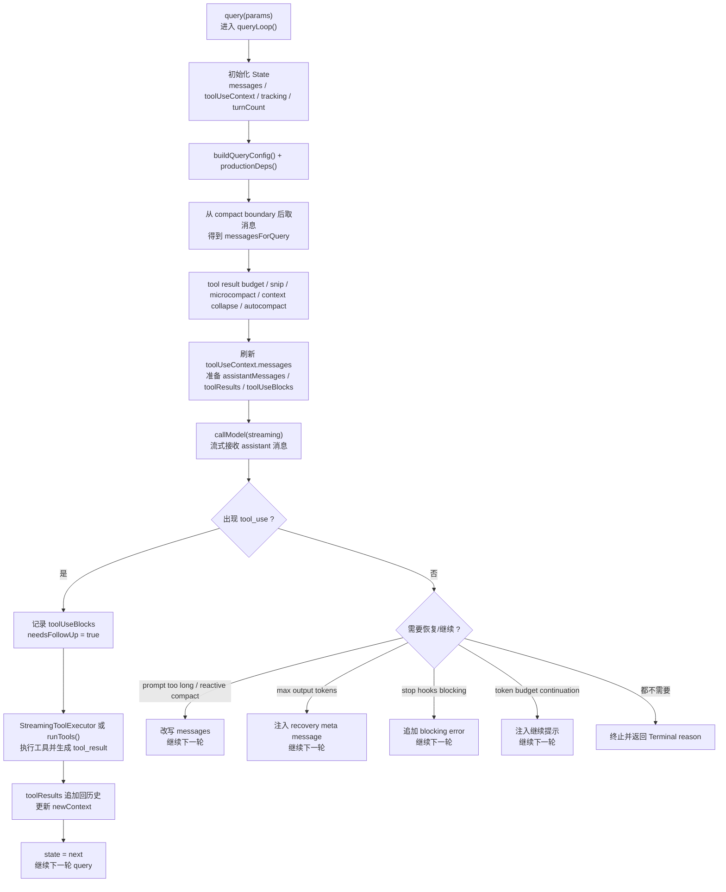

# 04 query：主循环如何驱动整个系统

前一章我们已经建立了两个关键抽象：

- `ToolUseContext`：会话级运行时容器
- `Message[]`：能承载 `tool_use / tool_result` 回环的消息事件流

这一章终于要进入 Claude Code 的真正心脏：`restored-src/src/query.ts`。

如果说前面几章回答的是“系统如何启动、初始化、拿到上下文”，那这一章要回答的就是：

**当一次用户输入真正开始跑起来时，Claude Code 到底靠什么把它推进成一个可能多轮、可恢复、可压缩、可继续、可收尾的主循环？**

最重要的一句结论先写在前面：

> **一个用户回合，在 Claude Code 里通常不等于一次 API 请求。**

它更像是一轮不断推进的 `query loop`：先准备消息窗口，再流式调用模型；如果 assistant 发出 `tool_use`，就执行工具、回填结果，再继续下一轮；如果遇到上下文过长、输出被截断、stop hook 阻塞、token budget 继续等情况，还会进入专门的恢复或继续分支。

## 1. 本章要解决什么问题

很多人读到 `query.ts` 时，第一反应是“这不就是把消息发给模型然后读回结果吗”。但真实工程会马上把这个想法击穿，因为主循环至少同时承担了五件事：

1. **维护本轮真正要发给模型的消息窗口。**
   - 不是所有历史消息都原封不动进入本轮，compact、snip、microcompact、collapse 都可能改写 `messagesForQuery`。
2. **维护跨轮状态。**
   - assistant 输出、tool result、pending summary、turnCount、autoCompactTracking 都要在 loop 中持续推进。
3. **在模型调用、工具调用、恢复逻辑之间做编排。**
   - 同一轮里既可能调模型，也可能执行工具，还可能触发 fallback、reactive compact、token budget continuation。
4. **处理“这轮要不要继续”的决策。**
   - `needsFollowUp`、stop hooks、max output tokens recovery、token budget 都可能让本轮继续。
5. **控制终止条件与收尾。**
   - 正常完成、prompt too long、中断、hook 阻塞、image error、blocking limit 都会导向不同终点。

所以本章聚焦的核心不是“怎么调 API”，而是：

**`query.ts` 如何把一轮用户请求组织成一个可持续推进的状态机。**

## 2. 先看业务流程图

下面这张图有意只保留主业务主线，不展开所有异常细节。读图时抓住三个判断点：

1. `messagesForQuery` 在真正调用模型前会被重新整理；
2. assistant 只要产出 `tool_use`，本轮通常不会结束，而会进入 tool follow-up；
3. 即使没有 `tool_use`，本轮也可能因为 compact、max output tokens、stop hooks、token budget 而继续。



一句话概括这张图：

**`query.ts` 不是“单次采样函数”，而是“围绕一次用户回合不断重入自身的推进器”。**

## 3. 源码入口

这一章建议聚焦下面这些真实文件：

- `restored-src/src/query.ts`：主循环本体，负责状态推进、模型流式调用、tool follow-up、恢复与终止分支。
- `restored-src/src/query/config.ts`：把本轮 query 所需的运行时 gate 快照成 `QueryConfig`。
- `restored-src/src/query/deps.ts`：把模型调用、compact、uuid 等 I/O 依赖收敛成可替换的 `QueryDeps`。
- `restored-src/src/query/tokenBudget.ts`：token budget continuation / completion 的判断逻辑。
- `restored-src/src/services/tools/toolOrchestration.ts`：非 streaming 路径下的工具批次编排。
- `restored-src/src/services/tools/toolExecution.ts`：单个工具调用如何变成 `tool_result` 与上下文更新。
- `restored-src/src/utils/messages.ts`：`normalizeMessagesForAPI()`、compact boundary、tool summary 等与消息窗口相关的边界函数。

如果你只想抓主线，最推荐的阅读顺序是：

1. 先看 `query.ts` 里的 `QueryParams / State / queryLoop()`。
2. 再看 `query/config.ts` 和 `query/deps.ts`，理解为什么主循环要把“配置快照”和“依赖注入”分开。
3. 再接 `toolOrchestration.ts` 与 `toolExecution.ts`，理解 tool follow-up 如何并回主循环。
4. 最后看 `query/tokenBudget.ts`，理解“本轮完成了没”为什么有时不是模型自己决定。

## 4. 主调用链拆解

### 4.1 `query()` 本身只是外壳，真正的心脏在 `queryLoop()`

`restored-src/src/query.ts` 里导出的 `query(...)` 很短，它主要做两件事：

- 把实际工作交给 `queryLoop(...)`
- 在 `queryLoop` 正常结束后，补做 command lifecycle 的 `completed` 通知

这说明 Claude Code 对 query 的定位很明确：

- `query()` 是对外 API；
- `queryLoop()` 才是真正的状态推进器。

也就是说，如果你想理解系统如何“跑起来”，不用在 `query()` 这层停太久，直接下沉到 `queryLoop()` 就对了。

### 4.2 `State + QueryConfig + QueryDeps`：主循环一开始就把三类东西拆开

这一段是 `query.ts` 很有工程味的地方。

它把主循环真正依赖的东西拆成三类：

1. **State**
   - 可变跨轮状态：`messages`、`toolUseContext`、`autoCompactTracking`、`turnCount`、`pendingToolUseSummary`、`transition` 等。
2. **QueryConfig**
   - 本轮入口时就拍平的配置快照，来自 `restored-src/src/query/config.ts`。
   - 例如：`streamingToolExecution`、`emitToolUseSummaries`、`fastModeEnabled`。
3. **QueryDeps**
   - 来自 `restored-src/src/query/deps.ts` 的 I/O 依赖。
   - 包括：`callModel`、`microcompact`、`autocompact`、`uuid`。

这种拆法的价值很大：

- `State` 负责“本轮推进到哪里了”；
- `Config` 负责“这一轮有哪些 gate 生效”；
- `Deps` 负责“这一轮要调用哪些外部能力”。

这比把一切塞在一个巨大函数里更适合做测试、恢复和后续重构。

### 4.3 `messagesForQuery`：真正送去采样的消息窗口，是动态整理出来的

主循环每一轮开始，不是直接拿 `state.messages` 去调模型，而是先整理出：

```ts
let messagesForQuery = [...getMessagesAfterCompactBoundary(messages)]
```

然后再依次应用：

- `applyToolResultBudget(...)`
- `snipCompactIfNeeded(...)`
- `deps.microcompact(...)`
- `contextCollapse.applyCollapsesIfNeeded(...)`
- `deps.autocompact(...)`

这里非常值得停一下：

**Claude Code 真正送给模型的不是“会话全历史”，而是“经过多层压缩、投影、裁剪后的当前有效窗口”。**

这一步背后的工程意图是两层：

1. 尽量保住更多“有用历史”，而不是一上来就粗暴 summary。
2. 尽量把窗口控制在还能继续工作的范围内，而不是等 API 报错后再处理。

所以 `query.ts` 的上半段，某种意义上就是一个“上下文治理流水线”。

### 4.4 `toolUseContext.messages = messagesForQuery`：主循环每轮都会刷新“本轮上下文视图”

在完成消息窗口整理后，`query.ts` 会明确写回：

```ts
toolUseContext = {
  ...toolUseContext,
  messages: messagesForQuery,
}
```

这一行看起来不起眼，但其实非常关键。

它说明 `ToolUseContext.messages` 不是一份静态会话历史，而是**当前轮次真正可见的上下文视图**。这样做的直接收益是：

- 工具权限判断看的是当前轮消息窗口；
- 工具执行、hook、tool schema hint 也看的是当前轮消息窗口；
- 一旦 compact 或 collapse 发生，工具侧看到的上下文也会同步变化。

所以别把这一步当作“顺手赋值”，它是主循环和工具系统同步认知边界的关键动作。

### 4.5 流式模型调用：assistant 消息、tool use、streaming tool executor 同步推进

接下来是 `queryLoop()` 真正“活起来”的阶段：

- 初始化 `assistantMessages`
- 初始化 `toolResults`
- 初始化 `toolUseBlocks`
- 把 `needsFollowUp` 先置为 `false`

然后调用：

```ts
deps.callModel({...})
```

并通过 `for await` 流式接收消息。

在这一段里，主循环会同步做几件事：

1. 把 assistant 消息推入 `assistantMessages`
2. 从 message content 中提取 `tool_use`
3. 一旦出现 `tool_use`，就把 `needsFollowUp = true`
4. 如果开启 `streamingToolExecution`，则把 tool block 立刻送进 `StreamingToolExecutor`

这意味着 Claude Code 的主循环并不是：

> “先收完整个 assistant 响应，再统一处理工具”

而是已经具备了边流式接收、边识别 tool use、边准备执行的能力。

这就是为什么 `query.ts` 不像一个请求函数，而更像一个实时协调器。

### 4.6 `needsFollowUp`：这轮是否继续，不看 stop_reason，而看真实 tool_use

源码里有一条非常值得注意的注释：

> `stop_reason === 'tool_use'` is unreliable

所以 Claude Code 不把“是否继续”建立在 API 给出的 stop reason 上，而是建立在一个更可靠的事实判断上：

- 本轮 assistant message 里是否真实出现了 `tool_use`

一旦 `msgToolUseBlocks.length > 0`：

- `toolUseBlocks.push(...)`
- `needsFollowUp = true`

这就是本轮是否进入 tool follow-up 的唯一硬依据。

从工程角度看，这是一个非常正确的策略：**把关键分支判断建立在本地可验证结构上，而不是建立在外部协议字段的理想行为上。**

### 4.7 如果没有 `tool_use`，主循环也未必结束

这是理解 `query.ts` 的关键转折点。

当本轮没有 `needsFollowUp` 时，系统并不会立刻 `return`，而是还要再过一整层“恢复/继续/收尾”判断，包括：

- `prompt too long` 的恢复
  - collapse drain retry
  - reactive compact retry
- `max_output_tokens` 的恢复
  - 升级更高 `maxOutputTokensOverride`
  - 注入 recovery meta message 继续一轮
- stop hooks
  - 若返回 blocking error，则把错误追加进消息继续下一轮
- token budget continuation
  - 若预算没到完成阈值，就注入 meta nudge 再继续一轮

换句话说，即使 assistant 这一轮没有要用工具，主循环也可能因为“系统级推进策略”继续。

所以这里最重要的心智模型是：

> 主循环的“继续条件”不只来自模型，也来自系统自己的恢复与调度机制。

### 4.8 真正的 tool follow-up：`StreamingToolExecutor` 或 `runTools(...)`

如果 `needsFollowUp === true`，主循环会进入工具执行阶段。

这里有两条路径：

- 如果 streaming tool execution 开启：走 `StreamingToolExecutor.getRemainingResults()`
- 否则：走 `runTools(toolUseBlocks, assistantMessages, canUseTool, toolUseContext)`

这一步的关键不是“调用哪个实现”，而是两条路径都会向主循环产出统一形态的更新：

- `update.message`
- `update.newContext`

主循环收到这些更新后会：

- `yield update.message`
- 把消息经 `normalizeMessagesForAPI(...)` 收敛成 user 侧结果，压入 `toolResults`
- 若有 `newContext`，就更新 `updatedToolUseContext`

也就是说，tool 执行阶段并不是一个脱离主循环的黑盒，它依旧通过“消息 + 新上下文”这种统一接口并回主循环。

### 4.9 工具执行完成后，真正进入下一轮的是“扩展后的历史”

tool 阶段完成后，`query.ts` 会把：

- `messagesForQuery`
- `assistantMessages`
- `toolResults`
- attachment / queued commands / 其他收尾消息

重新组织成下一轮的 `state.messages`，再 `continue` 回到 loop 顶部。

这说明主循环推进的核心动作并不是“递归调自己”，而是：

> 用本轮的 assistant 输出和 tool 结果，构造出下一轮历史，再重新进入同一套整理、采样、判定流程。

这也是为什么前三章要先讲消息模型和工具上下文，否则你在这里会看不懂“下一轮到底凭什么知道上一轮发生了什么”。

### 4.10 `tokenBudget`：有时候不是模型说结束，而是系统决定“该继续还是该停”

`restored-src/src/query/tokenBudget.ts` 是这章最容易被忽略、但非常有产品味的一块。

它通过：

- 当前 turn token 使用量
- continuation 次数
- 边际收益（`DIMINISHING_THRESHOLD`）

来决定：

- `action: continue`
- 还是 `action: stop`

如果继续，主循环会注入一条 meta message，提示模型直接接着做，不要 recap；如果停止，则记录 completion event。

这意味着 Claude Code 的主循环并不完全把“完成感”交给模型自己，而是引入了一层**系统级节奏控制**。

对于一个长期运行的 agent 来说，这非常重要，因为“模型停了”不一定等于“任务真完成了”，反过来也成立。

## 5. 关键设计意图

把 `query.ts` 抽象成架构语言，可以浓缩成五条判断：

1. **主循环是状态机，不是一次性函数。**
   `State`、`transition`、`turnCount`、`pendingToolUseSummary` 都在说明它是一个持续推进器。
2. **主循环先治理上下文，再调用模型。**
   `messagesForQuery` 在每轮采样前都会经过预算、裁剪、compact、collapse 处理。
3. **继续条件不只来自 `tool_use`，也来自系统恢复与调度。**
   prompt too long、max output tokens、stop hooks、token budget 都能让 loop 继续。
4. **工具系统通过统一更新接口并回主循环。**
   无论 streaming 还是非 streaming，本质都产出 `message + newContext`。
5. **真正送给模型的始终是“当前有效窗口”，不是会话原始全量。**
   这让系统能在长会话里持续工作，而不是很快被上下文压垮。

## 6. 从复刻视角看

如果你要复刻一个最小可用的 agent query loop，我建议至少保留下面四层：

1. **Loop state**
   - `messages`
   - `toolContext`
   - `turnCount`
   - `transition`
2. **窗口整理层**
   - 至少预留一个“在发给模型前重写/压缩消息窗口”的入口。
3. **follow-up 判断层**
   - 先看 assistant 是否真的请求了工具，再决定是否继续。
4. **系统级继续层**
   - 不要把“是否继续”完全交给模型；至少预留 token budget、error recovery、hook blocking 这类系统决策口。

一个方向正确的最小伪代码是：

```text
state = { messages, toolContext, turnCount: 1 }

loop:
  messagesForQuery = prepareWindow(state.messages)
  assistant = callModel(messagesForQuery)
  if assistant has tool_use:
    toolResults, newContext = runTools(...)
    state.messages = messagesForQuery + assistant + toolResults
    state.toolContext = newContext
    continue

  if shouldRecoverOrContinue(assistant, state):
    state.messages = messagesForQuery + assistant + recoveryMessage
    continue

  return completed
```

最容易踩的坑有三个：

- 把 loop 写成“单次 API 调用包装器”，导致工具回环和恢复逻辑越写越散。
- 不维护 `messagesForQuery` 和 `state.messages` 的区别，最终搞不清“原始历史”和“当前窗口”。
- 把“继续条件”只绑定到 `tool_use`，忽略系统级继续机制。

### 6.1 源码追踪提示

如果你要把这章对应到真实代码，建议按“主入口 -> 分支条件 -> 收尾决策”来追：

1. 先通读 `restored-src/src/query.ts`，把一次 loop 中的阶段分成“准备窗口 / 调模型 / 跑工具 / 决定继续或结束”四段。
2. 再分别打开 `restored-src/src/query/stopHooks.ts` 和 `restored-src/src/query/tokenBudget.ts`，看系统级继续条件是如何补进主循环的。
3. 最后用 `rg -n "needsFollowUp|toolResults|updatedToolUseContext|compact|fallback"` 在 `restored-src/src/query*` 范围里做一次关键词回查。

## 7. 本章小练习

1. 给自己的 agent 写一个最小 `State` 结构，至少包含：`messages`、`toolContext`、`turnCount`。
2. 实现一个 `prepareWindow()`，哪怕只是简单裁掉最旧消息，也要让“真正发给模型的窗口”和“原始历史”分开。
3. 写一个 `needsFollowUp` 判定：只根据 assistant 输出里是否有 `tool_use` 决定是否进入工具执行。
4. 再加一个“系统继续条件”：例如输出过长时注入一条 recovery meta message，让主循环自动再跑一轮。

## 8. 本章小结

`restored-src/src/query.ts` 真正厉害的地方，不是它把多少逻辑堆在一个文件里，而是它把“主业务推进”这件事做成了一套清晰的循环结构：

- 每轮先整理上下文窗口；
- 再流式调用模型；
- 需要时执行工具并回填结果；
- 不需要工具时也仍然经过恢复、继续与收尾判断；
- 最后要么进入下一轮，要么以明确的终止原因返回。

理解这一章后，Claude Code 的主业务流就真正“活”起来了。下一章我们会沿着这里留下的接口继续下沉，专门拆解：

**tool 是怎样被编排、执行、校验权限、再把结果回填到主循环里的。**
