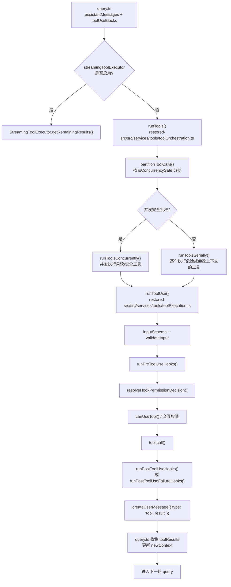
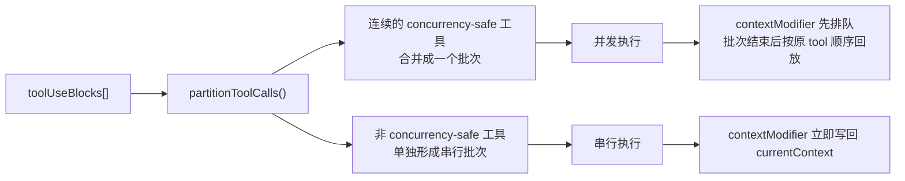

# 05 tool：编排、执行、权限、结果回填

上一章我们停在了一个关键节点：

- `query.ts` 已经通过流式采样拿到了 assistant 输出；
- 一旦 assistant 内容里出现 `tool_use`，`needsFollowUp = true`；
- 主循环不会就此结束，而是进入工具执行阶段。

这一章要回答的就是：

**Claude Code 在“模型决定调用工具”之后，究竟如何把多个 `tool_use` 变成一批可控执行的工具调用，并最终再包装成 `tool_result` 回填给下一轮模型？**

如果说第 4 章解决的是“主循环怎么跑”，那么这一章解决的就是：

**主循环为什么敢把工具系统嵌进自己内部，而且还能维持权限、安全、上下文一致性。**

## 1. 本章要解决什么问题

很多人第一次读工具层源码时，会把它想成一句非常简单的话：

> assistant 发出 `tool_use`，客户端执行一下工具，再把结果发回去。

但真实工程里，这中间至少还隔着五层问题：

1. **多个工具是一起跑，还是排队跑？**
   - 这不是由“工具数量”决定，而是由 `isConcurrencySafe(...)` 决定。
2. **工具输入谁来兜底校验？**
   - 既有 `inputSchema.safeParse(...)` 的结构校验，也有 `validateInput(...)` 的业务校验。
3. **hook 和权限系统谁说了算？**
   - `PreToolUse` hook 可以给建议，但 deny/ask rule、交互要求、`canUseTool(...)` 仍可能覆盖它。
4. **工具返回的不是纯文本怎么办？**
   - Claude Code 会先把工具输出转成 `tool_result`，再根据需要补 attachment、feedback、image 等内容。
5. **为什么最终一定要变成 `UserMessage(tool_result)`？**
   - 因为从模型视角看，工具结果本质上是“用户把函数执行结果交还给 assistant”，而不是 assistant 自己继续说话。

所以本章真正要建立的认知是：

**工具系统不是主循环外面的一个外挂，而是 `query -> tool orchestration -> tool_result -> next query` 这一闭环里的中间推进器。**

## 2. 先看业务流程图

先看主链路，再看细节。下面这张图对应的是 `query.ts` 进入工具阶段后的真实主线：



如果你想先抓一句总纲，可以记成：

> **`query.ts` 负责“什么时候进入工具阶段”，`toolOrchestration.ts` 负责“怎么排队”，`toolExecution.ts` 负责“一个工具调用内部要经过哪些关卡”。**

再看一张更偏工程实现的批次图，理解为什么 Claude Code 不会简单地 `Promise.all(toolUses)`：



这张图背后有一句非常关键的设计原则：

**并发安全不等于“完全没有副作用”，而是“即使先并发跑，最后也能用受控方式把上下文修改按顺序回放”。**

## 3. 源码入口

这一章建议聚焦下面六个文件：

- `restored-src/src/query.ts`
  - 决定何时进入工具阶段，并在执行后把 `tool_result` 拼回下一轮消息。
- `restored-src/src/services/tools/toolOrchestration.ts`
  - 负责 `partitionToolCalls(...)`、串行/并发两种执行模式、`currentContext` 更新。
- `restored-src/src/services/tools/toolExecution.ts`
  - 负责单个工具调用的完整生命周期：找工具、校验、hook、权限、执行、回填。
- `restored-src/src/services/tools/toolHooks.ts`
  - 把 `PreToolUse / PostToolUse / PostToolUseFailure` 这些 hook 统一收敛成工具执行前后的协议。
- `restored-src/src/Tool.ts`
  - 定义 `Tool`、`ToolResult`、`contextModifier`、`mcpMeta` 等关键抽象。
- `restored-src/src/hooks/useCanUseTool.tsx`
  - 负责真正的权限决策分发，连接配置规则、自动模式、交互弹窗、bridge/channel 回调。

如果你只想顺着主线读，可以按这个顺序：

1. `query.ts` 看 `toolUpdates = ... runTools(...)`
2. `toolOrchestration.ts` 看 `partitionToolCalls(...)`
3. `toolExecution.ts` 看 `runToolUse(...) -> checkPermissionsAndCallTool(...)`
4. `toolHooks.ts` 看 `resolveHookPermissionDecision(...)`
5. `Tool.ts` 看 `ToolResult`
6. `useCanUseTool.tsx` 看权限最终如何落地

## 4. 主调用链拆解

### 4.1 `query.ts` 只负责把工具阶段接进主循环

第 4 章已经讲过，`query.ts` 在流式消费 assistant 输出时，会做三件事：

- 把 assistant 消息存入 `assistantMessages`
- 从内容中抽出 `toolUseBlocks`
- 只要发现 `tool_use`，就把 `needsFollowUp = true`

真正进入工具阶段时，`query.ts` 做的反而很克制：

```ts
const toolUpdates = streamingToolExecutor
  ? streamingToolExecutor.getRemainingResults()
  : runTools(toolUseBlocks, assistantMessages, canUseTool, toolUseContext)
```

然后统一消费 `toolUpdates`：

- 有 `update.message` 就 `yield` 给 UI / SDK
- 同时把它 `normalizeMessagesForAPI(...)` 后筛成 `user` 类型，塞进 `toolResults`
- 有 `update.newContext` 就更新 `updatedToolUseContext`

这里要特别注意一点：

**`query.ts` 并不关心某个工具是怎么执行成功的，它只关心两个结果：**

1. 这次工具阶段产出了哪些可回灌给模型的消息；
2. 工具阶段有没有把 `ToolUseContext` 改写成下一轮该看到的上下文。

也就是说，主循环和工具层的接口非常清晰：

- `message`
- `newContext`

只要这两个接口稳定，底下是串行、并发、MCP、hook、权限弹窗，主循环都不需要知道太多细节。

### 4.2 `runTools()` 的重点不是“执行工具”，而是“先分批”

`restored-src/src/services/tools/toolOrchestration.ts` 的入口函数是 `runTools(...)`。它第一步不是直接跑工具，而是先做：

```ts
partitionToolCalls(toolUseMessages, currentContext)
```

分批规则很简单，但非常有工程价值：

1. 先通过 `findToolByName(...)` 找到工具；
2. 再用 `tool.inputSchema.safeParse(toolUse.input)` 先做输入解析；
3. 只有解析成功，才会调用 `tool.isConcurrencySafe(parsedInput.data)`；
4. 如果是连续多个并发安全工具，它们会被合并进同一批；
5. 否则每个不安全工具都会单独形成一个串行批次。

这意味着：

- **输入解析失败时，默认按不安全处理**
- **`isConcurrencySafe(...)` 一旦抛错，也默认按不安全处理**

源码里这是一种很典型的“保守优先”策略：

> 不能证明安全，就按不安全执行。

这背后不是性能优先，而是上下文一致性优先。因为工具不只是返回字符串，它还可能通过 `contextModifier` 改写上下文。

### 4.3 并发批次与串行批次，真正的区别在 `contextModifier`

`Tool.ts` 里对 `ToolResult` 有一句非常关键的注释：

```ts
// contextModifier is only honored for tools that aren't concurrency safe.
```

但你继续往 `toolOrchestration.ts` 看，会发现实际策略更细：

- 串行路径 `runToolsSerially(...)`
  - 每个 `runToolUse(...)` 更新如果携带 `contextModifier`，就立刻写回 `currentContext`
- 并发路径 `runToolsConcurrently(...)`
  - 执行期间先把 `contextModifier` 按 `toolUseID` 排队
  - 等整批工具都跑完，再按原始 `blocks` 顺序依次回放

可以把它理解成下面这个伪时序：

```text
并发执行阶段：
  Tool A ----\
  Tool B ----- > 先并发拿结果
  Tool C ----/

批次收尾阶段：
  依次回放 A.contextModifier
  依次回放 B.contextModifier
  依次回放 C.contextModifier
```

所以更准确的说法不是“并发安全工具没有上下文修改”，而是：

**并发安全工具即使返回了 `contextModifier`，它的修改也不会在执行过程中打乱其他并发工具，而是等批次结束后再按稳定顺序统一回放。**

这正是 Claude Code 工具层最值得借鉴的一点：

**把“执行并发化”和“状态提交顺序化”拆开。**

### 4.4 `runToolUse(...)` 先把“能不能执行”这件事做扎实

单个工具调用的总入口在 `restored-src/src/services/tools/toolExecution.ts` 的 `runToolUse(...)`。

这段代码看起来很长，但主线其实很清楚：

1. **先找工具**
   - 先在当前可见工具集 `toolUseContext.options.tools` 里找
   - 找不到再去 `getAllBaseTools()` 里做 alias fallback
2. **如果工具不存在，立即回填错误 `tool_result`**
3. **如果存在，就进入 `checkPermissionsAndCallTool(...)`**

接下来真正的顺序是这章最核心的一段：

```text
findToolByName / alias fallback
-> inputSchema.safeParse
-> tool.validateInput
-> Bash speculative classifier 提前启动
-> runPreToolUseHooks
-> resolveHookPermissionDecision
-> canUseTool
-> tool.call
-> runPostToolUseHooks
-> createUserMessage(tool_result)
```

这里有两个容易被忽略但很重要的细节。

第一，`validateInput(...)` 和 `inputSchema` 不是重复的：

- `inputSchema` 解决的是“结构对不对”
- `validateInput` 解决的是“业务上允不允许这样调”

第二，Bash 的 speculative classifier 会被提前启动，但不会立刻改变 UI：

- 它的目标是把分类器等待时间和 pre-hook/权限判断并行化；
- 真正要不要显示“classifier checking”，由权限交互层控制，而不是这里控制。

这说明 Claude Code 在工具执行前，已经开始做**等待时间隐藏**和**交互延迟前移**。

### 4.5 hook 不等于最终许可，`resolveHookPermissionDecision(...)` 才是关键裁判

很多人读到 `PreToolUse` hook 时，会自然以为：

> hook 返回 allow，那工具就一定能执行。

源码明确否定了这个想法。

`restored-src/src/services/tools/toolHooks.ts` 里的 `resolveHookPermissionDecision(...)` 写得非常直白：

- hook `allow` 并不会绕过 settings 里的 deny/ask 规则；
- 如果工具本身 `requiresUserInteraction()`，而 hook 又没有提供 `updatedInput`，那仍然要走 `canUseTool(...)`；
- 如果 `toolUseContext.requireCanUseTool` 为真，也必须继续走权限系统；
- hook `ask` 只是在正常权限流程里附带一个 `forceDecision`；
- hook `deny` 才会直接形成拒绝。

这段逻辑的工程价值非常高，因为它避免了两个常见坑：

1. **插件 / hook 把系统安全边界绕穿**
2. **交互型工具被“假放行”，但其实没拿到用户输入**

尤其这一句很关键：

> 对需要用户交互的工具，只有 hook 提供了 `updatedInput`，才算真正“完成了交互”。

换句话说，Claude Code 不是在问“hook 有没有说 allow”，而是在问：

**hook 是否真的满足了工具执行所需的前置条件。**

### 4.6 `canUseTool(...)` 不是一个判断函数，而是一个权限分发器

真正的权限决策最终会落到 `restored-src/src/hooks/useCanUseTool.tsx`。

这个名字很容易让人误会成同步布尔判断，但实际上它做的是一整套分发：

- 先看 `hasPermissionsToUseTool(...)` 给出的初始结果：`allow / deny / ask`
- `deny` 路径直接返回拒绝，并记录 auto mode denial / notification
- `ask` 路径会根据当前上下文分发给不同处理器：
  - `handleCoordinatorPermission(...)`
  - `handleSwarmWorkerPermission(...)`
  - `handleInteractivePermission(...)`
- 对 Bash 还会和 speculative classifier 结果做竞速，争取在弹窗前自动批准高置信命令

所以 `canUseTool(...)` 的真实角色更像是：

**“权限入口网关”而不是“最终判官”。**

它一头连规则系统，一头连 UI / bridge / channel / worker 协调机制，确保工具权限在不同运行形态下都能保持语义一致。

### 4.7 权限拒绝本身，也会被包装成 `tool_result`

这一点对理解整个闭环特别重要。

在 `toolExecution.ts` 里，如果权限结论不是 `allow`，并不会只弹个提示就结束，而是会构造：

- 一个 `createUserMessage(...)`
- 其中 `content[0]` 是 `type: 'tool_result'`
- 并且 `is_error: true`

然后再按需要追加：

- 权限拒绝时附带的图片或文本内容块
- classifier denial 后的 PermissionDenied hooks 反馈

这意味着：

**从主循环视角看，“权限拒绝”依然是一种工具执行结果。**

这非常关键，因为 assistant 在下一轮需要知道：

- 我刚才请求过这个工具；
- 这个工具没有成功执行；
- 失败原因是什么；
- 我接下来应该改写参数、换方案，还是放弃。

如果不把拒绝也包装成 `tool_result`，模型就会失去这段反馈闭环。

### 4.8 `tool.call(...)` 返回的不是纯结果，而是“结果包”

`Tool.ts` 里定义的 `ToolResult<T>` 至少有四个值得注意的字段：

- `data`
- `newMessages`
- `contextModifier`
- `mcpMeta`

这说明 Claude Code 对工具返回值的理解不是“一个字符串”，而是一个更完整的结果包：

1. `data`
   - 真正要转成 `tool_result` 的主输出
2. `newMessages`
   - 工具还可以额外产出 attachment、system message、assistant/user message
3. `contextModifier`
   - 工具执行成功后对 `ToolUseContext` 的补丁
4. `mcpMeta`
   - 给 SDK/MCP 侧透传的结构化元数据

这套设计非常适合做复杂工具系统，因为它把“给模型看的结果”和“给本地运行时看的副作用”拆开了。

### 4.9 Post hooks 不是日志尾巴，而是结果装配流程的一部分

`runPostToolUseHooks(...)` 和 `runPostToolUseFailureHooks(...)` 很容易被误判成“执行后打点”。

但从源码看，它们其实会真实地产出消息：

- `hook_cancelled`
- `hook_blocking_error`
- `hook_additional_context`
- `hook_stopped_continuation`
- `hook_error_during_execution`

这些消息最终都会进入 `resultingMessages`，再被 `query.ts` 正常收集进 `toolResults`。

也就是说：

**hook 不是旁路观察者，而是工具执行协议的一部分。**

这也是为什么第 6 章讲输出收尾时，还会继续遇到 stop hook、summary attachment、notification 这些内容。

### 4.10 内建工具和 MCP 工具，在 `addToolResult(...)` 时机上故意不一样

这一点如果不专门看源码，很容易漏掉。

在 `toolExecution.ts` 里，成功执行后会先定义一个内部函数：

```ts
async function addToolResult(toolUseResult, preMappedBlock?)
```

然后出现了一个重要分叉：

- **非 MCP 工具**
  - 先 `addToolResult(...)`
  - 再跑部分 post hooks
- **MCP 工具**
  - 先跑 `runPostToolUseHooks(...)`
  - 如果 hook 更新了 `updatedMCPToolOutput`
  - 再 `addToolResult(...)`

原因也写在代码结构里了：

**MCP tool 的 output 可能会被 post hook 改写，所以不能太早把 `tool_result` 固化。**

这意味着 Claude Code 并没有为了统一而强行把所有工具走一条完全相同的管线，而是接受了一个更现实的工程判断：

> 协议型工具（尤其 MCP）和内建工具在结果塑形时机上，就是存在差异。

### 4.11 为什么最后一定要回填成 `UserMessage(tool_result)`

这是整章最应该刻进脑子里的结论。

`toolExecution.ts` 里无论是：

- 工具不存在
- 输入校验失败
- 业务校验失败
- 权限拒绝
- 工具执行成功
- 工具执行失败

最终都会尽量走向：

```ts
createUserMessage({
  content: [
    {
      type: 'tool_result',
      ...
    }
  ]
})
```

然后 `query.ts` 会把这些消息放进：

```ts
messages: [...messagesForQuery, ...assistantMessages, ...toolResults]
```

再进入下一轮。

这套设计背后的真实语义是：

- assistant 负责提出 `tool_use`
- 客户端负责执行现实世界动作
- 用户侧消息流负责把执行结果交回 assistant

所以你可以把 `tool_result` 理解成：

**模型与现实世界之间的“收据消息”。**

没有这张收据，主循环就无法继续保持因果闭环。

## 5. 关键设计意图

把这一章压缩成设计意图，可以总结为五条：

1. **先分批，再执行。**
   - 工具层首先解决的是调度秩序，而不是执行速度。
2. **先校验，再授权，再调用。**
   - 不让无效输入和未授权动作进入真实工具执行。
3. **并发执行，顺序提交。**
   - 性能和状态一致性两手都要。
4. **hook 可以参与，但不能越权。**
   - hook 是扩展点，不是安全边界的替代物。
5. **所有结果都要被主循环看懂。**
   - 因此最终统一收束为 `UserMessage(tool_result)` 或相关附件消息。

如果你打算自己复刻一个 Claude Code 式工具系统，这五条几乎就是第一版架构的骨架。

## 6. 从复刻视角看

如果你想把这一套抽象复刻到自己的 agent / IDE / workflow 系统里，我建议你直接拆成四层：

### 6.1 编排层

最小职责：

- 接收 `tool_use[]`
- 根据工具元信息做批次划分
- 维护串行/并发两种执行器
- 统一输出 `message + newContext`

这层不要碰权限细节，否则调度器会变成巨型上帝对象。

### 6.2 执行层

最小职责：

- 找工具
- 校验输入
- 调 permission gateway
- 执行 `tool.call`
- 组装标准结果消息

这层最重要的是：**永远输出稳定协议，不把内部异常格式直接泄漏给上层。**

### 6.3 权限层

最小职责：

- 规则判断
- 自动分类器
- 用户交互
- bridge / worker / remote 形态兼容

不要把权限写死在单个工具内部，否则很快就会失去统一治理能力。

### 6.4 回填层

最小职责：

- 把工具结果统一映射为模型下一轮能理解的消息格式
- 保证 `tool_use / tool_result` 成对
- 允许 attachment / hook message / summary 等附加消息进入下一轮

这层决定了你的系统能不能稳定递归，而不仅仅是“调通一次工具”。

### 6.5 源码追踪提示

这一章最稳的源码追踪路线是：

1. 从 `restored-src/src/query.ts` 找 `runTools(...)` 的调用点，确认工具阶段是怎样被主循环接进来的。
2. 再读 `restored-src/src/services/tools/toolOrchestration.ts`，只抓批次划分、串行/并发和 `newContext` 更新。
3. 最后深入 `restored-src/src/services/tools/toolExecution.ts` 与 `restored-src/src/hooks/useCanUseTool.tsx`，看单工具的校验、hook、权限和 `tool_result` 回填闭环。

## 7. 本章小练习

建议你按下面三个练习做一次“带目标的读源码”：

1. 找到 `partitionToolCalls(...)`，自己画一张表。
   - 列出“输入解析失败 / `isConcurrencySafe` 抛错 / 多个只读工具连续出现”三种情况下批次如何形成。
2. 沿着 `runToolUse(...)` 手抄一遍时序图。
   - 尤其标出 `runPreToolUseHooks -> resolveHookPermissionDecision -> canUseTool -> tool.call -> runPostToolUseHooks` 这一段。
3. 回答一个复刻问题：
   - 如果你自己的 agent 支持并发读文件与串行写文件，你会把 `contextModifier` 放在哪一层提交，为什么？

如果你能把这三个问题答清楚，第 5 章就不只是“看懂了”，而是已经开始变成你自己的工程方法。

## 8. 本章小结

这一章最重要的结论有三句：

1. **Claude Code 的工具阶段，本质上是主循环中的一次受控递归推进。**
2. **工具执行不是“call tool”这么简单，而是一条包含校验、hook、权限、结果装配的完整流水线。**
3. **真正让系统闭环的，不是工具本身，而是最终被回填进下一轮消息的 `tool_result`。**

到这里，Part 1 的主链路已经从：

- CLI 入口
- 初始化
- 会话上下文
- query 主循环
- tool 编排与执行

一路串到了“工具结果如何回到模型”。

下一章就该继续收尾：

**当工具结果和附件都回来了，Claude Code 又是如何做 stop hook、摘要、通知、收尾与终止判定的？**
