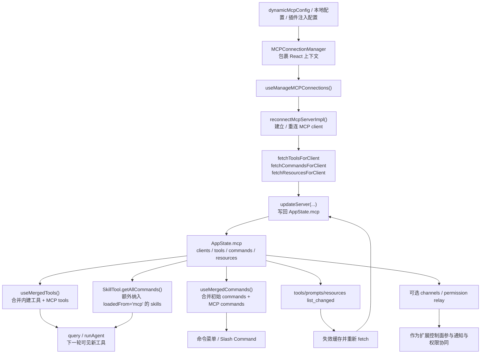

# 07 MCP：如何把外部能力接进来

当你第一次看到 Claude Code 支持 MCP（Model Context Protocol）时，很容易把它理解成一句话：

> “连上一个外部 server，把远端工具列表塞给模型就行了。”

但真实源码做得远比这复杂。Claude Code 并不是把 MCP 当成“额外工具数组”，而是把它当成一条**可连接、可断开、可热更新、可治理的外部能力接入总线**。这一章就围绕这个问题展开：

**Claude Code 到底怎样把外部 MCP server 接进来，同时又不把主流程写死在远端连接上？**

## 1. 本章要解决什么问题

如果只是做一个 demo，MCP 看起来并不难：

- 读取一份 server 配置；
- 建立连接；
- 拉到 tools；
- 下一次请求时把这些 tools 发给模型。

但产品级系统会立刻遇到四个现实问题：

1. **能力不止 tools。** 一个 MCP server 还可能提供 commands、resources，甚至在某些 feature gate 下衍生出 MCP skills。
2. **连接状态不是静态的。** server 可能连接成功、失败、失效、被禁用、重新启用，UI 和主循环都要感知这些变化。
3. **能力集合会热变化。** server 可能在连接后通过 `list_changed` 通知更新工具、prompt、resource 列表。
4. **扩展能力也要受治理。** 尤其是 channels / permission relay 这类“远端控制面”能力，不能因为接进来就绕过本地治理。

所以本章聚焦的是：**MCP 如何从“配置项”变成“主流程可消费的动态能力池”。**

## 2. 先看业务流程图

下面这张图只画 Claude Code 内部最关键的主线：配置如何进入连接管理，连接建立后如何把 tools / commands / resources 写回 `AppState.mcp`，以及这些能力最后怎样并入主流程。



读图时抓住三个点：

1. `AppState.mcp` 不是日志仓库，而是**主流程真正消费的运行时状态**。
2. MCP 接入的是一整组能力：`clients + tools + commands + resources`。
3. “接进来”不是一次性动作，而是一个**可热更新的持续同步过程**。

## 3. 源码入口

本章只锚定最关键的五类源码入口：

- `restored-src/src/services/mcp/MCPConnectionManager.tsx`：把 `reconnectMcpServer`、`toggleMcpServer` 暴露给上层组件。
- `restored-src/src/services/mcp/useManageMCPConnections.ts`：MCP 接入主编排器，负责连接、重连、状态更新、通知处理。
- `restored-src/src/hooks/useMergedTools.ts`：把 MCP tools 合并进 REPL / agent 的工具池。
- `restored-src/src/hooks/useMergedCommands.ts`：把 MCP commands 合并到命令集合。
- `restored-src/src/tools/SkillTool/SkillTool.ts`：在调用 skill 时，把 `loadedFrom === 'mcp'` 的 MCP skills 也纳入候选集。

如果你只想抓主线，建议按这个顺序读：

1. 先看 `useManageMCPConnections.ts`，理解连接和状态写回。
2. 再看 `useMergedTools.ts` / `useMergedCommands.ts`，理解这些状态如何进入主流程。
3. 最后看 `SkillTool.ts`，确认 MCP skills 为什么不走普通 `getCommands()`。

## 4. 主调用链拆解

### 4.1 `MCPConnectionManager` 不是连接器，而是“把连接能力挂进应用树”

`restored-src/src/services/mcp/MCPConnectionManager.tsx` 做的事情其实非常克制：

- 它自己不处理复杂连接逻辑；
- 它只调用 `useManageMCPConnections(...)`；
- 然后把 `reconnectMcpServer` 与 `toggleMcpServer` 通过 React Context 暴露出去。

这说明一个设计取向：**MCP 连接管理是一个会话级服务，不应散落在某个命令或某个页面里。**

换句话说，`MCPConnectionManager` 的角色更像“管理面注入器”，而不是“协议处理器”。

### 4.2 真正的接入主线在 `useManageMCPConnections()`

`restored-src/src/services/mcp/useManageMCPConnections.ts` 才是本章主角。这个 hook 把几个原本很容易写散的职责集中到一起：

- 读取 `dynamicMcpConfig` 和严格模式标记；
- 建立/重连 MCP client；
- 抓取 tools / commands / resources；
- 批量写回 `AppState.mcp`；
- 监听 server 的 `list_changed` 通知；
- 处理特定的 channel / permission relay 逻辑。

源码中最值得抓的不是单个函数，而是它维护的那份状态形状：

```text
AppState.mcp
  - clients
  - tools
  - commands
  - resources
```

这意味着 Claude Code 把 MCP 当成“动态能力池”，而不是“调用时临时查询一下”的远端依赖。

### 4.3 建立连接后，拉取的不是单一工具，而是一整套能力

在 `useManageMCPConnections.ts` 里，连接建立后会调用：

- `fetchToolsForClient(...)`
- `fetchCommandsForClient(...)`
- `fetchResourcesForClient(...)`

如果 feature gate 开启，还会走 `fetchMcpSkillsForClient(...)` 这条分支。也就是说，一个 MCP server 并不只给主循环加几个工具，它可能同时扩展：

- 模型可直接调用的 tools；
- UI / slash command 能看到的 commands；
- 资源类上下文入口；
- 甚至 skill 体系。

这也是为什么 `updateServer(...)` 写回状态时，不是只写 `tools`，而是一起更新：

```text
clients + tools + commands + resources
```

这是产品级系统和 demo 的第一个分野：**你得先承认“外部能力”本身是多维度的。**

### 4.4 热更新不是补丁逻辑，而是 MCP 主流程的一部分

很多人第一次做 MCP 会忽略一个点：远端 server 的能力列表不是静态的。

Claude Code 在 `useManageMCPConnections.ts` 里专门给下面三种通知注册 handler：

- `ToolListChangedNotificationSchema`
- `PromptListChangedNotificationSchema`
- `ResourceListChangedNotificationSchema`

它们的处理方式很有代表性：

1. 先让对应 cache 失效；
2. 再重新 fetch 新列表；
3. 最后把新结果重新写回 `AppState.mcp`。

如果 resources 变化且 `MCP_SKILLS` 打开，还会顺带刷新 MCP skills，并清掉本地 skill-search index。

这背后的设计意图是：

> MCP 接入不是“连接时同步一次”，而是“建立连接后持续维护一个可信的能力镜像”。

这正是 `list_changed` 在产品化中的价值。

### 4.5 MCP 如何并入主流程：不是直接 append，而是通过统一合并层

能力拉到本地后，并不会直接硬塞进 `query()`。Claude Code 还做了一层合并：

- `restored-src/src/hooks/useMergedTools.ts`
  - 先调用 `assembleToolPool(...)`
  - 再结合权限上下文做过滤、去重、MCP CLI exclusion 等处理
- `restored-src/src/hooks/useMergedCommands.ts`
  - 用 `uniqBy([...initialCommands, ...mcpCommands], 'name')` 合并初始命令与 MCP commands

这一步很关键，因为主流程真正消费的是“统一工具池”和“统一命令池”，而不是“内建一套、MCP 一套”。

也就是说，MCP 的设计目标并不是让主流程知道“你来自哪里”，而是让主流程看到一份**已经治理过、去重过、可直接消费的能力集合**。

### 4.6 MCP skills 为什么不直接走 `getCommands()`

这是一个很值得注意的细节。

在 `restored-src/src/tools/SkillTool/SkillTool.ts` 里，`getAllCommands(context)` 会额外从：

```ts
context.getAppState().mcp.commands
```

里筛出：

- `cmd.type === 'prompt'`
- `cmd.loadedFrom === 'mcp'`

的命令，并把它们和本地 `getCommands(...)` 结果合并。

这说明 Claude Code 对 MCP skills 的定位很精确：

- 它们在运行时挂在 `AppState.mcp.commands` 上；
- 它们不是本地命令目录扫描的一部分；
- SkillTool 在实际调用时，才把这部分动态能力纳入统一候选集。

换句话说：**MCP skill 是“运行时注入的 skill”，不是“启动时就固定写死的 skill”。**

### 4.7 channels / permission relay：扩展的不只是工具，还有控制面

`useManageMCPConnections.ts` 里还有一条容易被忽略的线：channels。

源码里围绕 `channelNotification`、`channelPermissions`、`CHANNEL_PERMISSION_METHOD` 做了一整套处理，包括：

- 接收 `notifications/claude/channel`
- 接收 `claude/channel/permission`
- 把远端返回的 permission response 匹配到本地 pending entry
- 在被策略/认证/allowlist 阻断时给出 once-per-kind 的 warning

这代表 MCP 在 Claude Code 里的第二层意义：

> 它不仅是“外部工具接入协议”，还是“外部控制面接入协议”。

这也是为什么我更建议把 channels 看成“扩展控制面”，而不是“聊天消息通道”。

## 5. 关键设计意图

把这一章提炼成架构语言，可以得到四条很稳定的结论：

1. **MCP 是动态能力池，不是静态插件表。**
   `AppState.mcp` 明确保存 `clients/tools/commands/resources`，表示系统要持续维护“当前外部能力的真实快照”。
2. **外部能力必须先被本地状态化，才能安全并入主流程。**
   通过 `updateServer(...)`、`useMergedTools(...)`、`useMergedCommands(...)`，主流程看到的是治理后的统一池，而不是一堆协议对象。
3. **热更新是协议的一部分，不是故障恢复。**
   `list_changed` 的整套刷新逻辑说明：Claude Code 默认假设远端能力会变化，所以从一开始就把刷新纳入设计。
4. **扩展协议不只接工具，还接控制面。**
   channels / permission relay 的存在证明 MCP 不只是“工具桥”，还是“外部协作与治理能力的承载层”。

## 6. 从复刻视角看

如果你想在自己的 agent 系统里复刻一个最小可用 MCP 接入层，我建议先保留下面四层：

1. **连接状态层**
   - 每个 server 至少要有 `pending / connected / failed / disabled` 这样的状态。
2. **能力镜像层**
   - 本地保存 `tools / commands / resources` 的快照，不要每次调用都直连远端取。
3. **统一合并层**
   - 主循环只消费“统一工具池”，而不是分别处理 builtin / MCP。
4. **热更新层**
   - 至少支持“失效缓存 -> 重新拉取 -> 覆盖本地状态”的链路。

一个足够小、但方向正确的伪代码是：

```text
for server in mcpConfig:
  client = connect(server)
  tools = fetchTools(client)
  commands = fetchCommands(client)
  resources = fetchResources(client)
  appState.mcp[server] = { client, tools, commands, resources }

mergedTools = mergeBuiltinTools(appState.mcp.tools)
mergedCommands = mergeBuiltinCommands(appState.mcp.commands)
```

真正要注意的坑有两个：

- 不要让 `query()` 直接依赖远端连接对象，而要依赖合并后的工具池。
- 不要把 list 变化当异常，而要把它当常态。

### 6.1 源码追踪提示

这一章建议按“连接管理 -> 本地状态 -> 主流程合并”三层来追：

1. 先通读 `restored-src/src/services/mcp/useManageMCPConnections.ts`，只抓连接、重连、fetch、写回 `AppState.mcp` 的主链路。
2. 再看 `restored-src/src/services/mcp/MCPConnectionManager.tsx` 与 `restored-src/src/services/mcp/types.ts`，确认连接管理器和配置/连接态抽象的边界。
3. 最后补 `restored-src/src/hooks/useMergedTools.ts`、`restored-src/src/hooks/useMergedCommands.ts` 和 `restored-src/src/tools/SkillTool/SkillTool.ts`，看 MCP 能力是怎样真正并入主流程的。

## 7. 本章小练习

1. 给你的 agent CLI 设计一个最小 `mcpState`，至少包含：`clients / tools / commands / resources`。
2. 实现一个 `mergeTools()`，把内建工具与远端工具合并，并在合并处完成去重。
3. 模拟一次 `list_changed`：先给某个 server 两个工具，再刷新成三个工具，验证下一轮主循环能看到新工具。
4. 如果你还想更进一步，再补一个“远端控制面”实验：为某个工具权限请求增加一个远端 approve/reject 回调入口。

## 8. 本章小结

Claude Code 对 MCP 的处理方式说明了一件事：**外部能力接入不是“挂一个远端 client”这么简单，而是“在本地维护一份可治理、可热更新、可合并的能力镜像”。**

一旦你理解了这一层，MCP 在系统里的位置就很清楚了：

- 它向外连接；
- 向内沉淀为 `AppState.mcp`；
- 最后通过统一工具池 / 命令池并入主流程。

下一章我们继续沿着“扩展能力流”往里走，但视角会从“协议接入层”切到“方法论接入层”：看 Skills 怎样把一段段方法论、流程约束和子代理执行方式，真正接进 Claude Code 的主流程。
