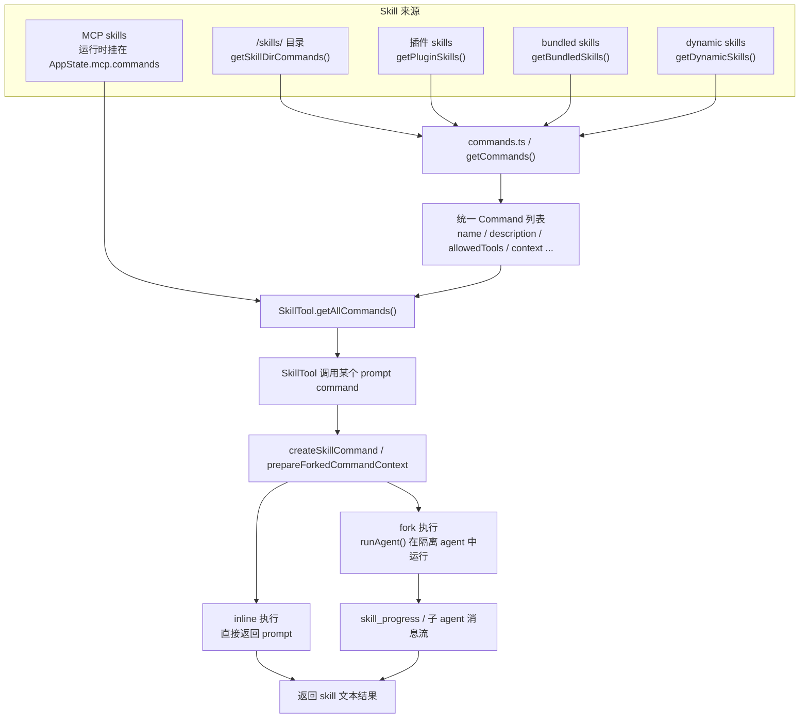

# 08 Skills：如何把方法论接进主流程

如果说 MCP 解决的是“把外部能力接进来”，那 Skills 解决的就是另一个问题：

> Claude Code 怎样把一套方法论、流程模板、操作约束，以“可发现、可调用、可隔离执行”的方式注入主流程？

这也是为什么我不建议把 skill 简单理解成“提示词片段”。在源码里，skill 更像是一种**面向模型与子代理的流程化能力封装**。这一章要回答的核心问题就是：

**Skills 到底如何从一份 Markdown，演化成主流程里真正可执行的能力？**

## 1. 本章要解决什么问题

很多系统做“技能”时，最后都会退化成两个极端：

- 极端一：只是把几段 prompt 文本拼起来，系统对它没有真正的结构理解。
- 极端二：把 skill 做成一种新的硬编码能力类型，导致每加一个 skill 都要改主程序。

Claude Code 走的是第三条路：

1. skill 仍以 Markdown 为主要载体；
2. 但会解析 frontmatter，把它变成一个结构化 `Command`；
3. 再通过 SkillTool 以统一工具方式执行；
4. 如果需要隔离执行，还能 fork 一个子 agent 来跑它。

所以本章聚焦三件事：

- skill 的来源有哪些；
- Markdown skill 如何被装载成系统能力；
- SkillTool 怎样把“方法论文本”变成“可执行流程”。

## 2. 先看 Skill 注入流程图



这张图想表达的重点不是“来源很多”，而是：

- **skill 最终会收敛成统一的 `Command` 抽象**；
- **MCP skills 是运行时注入，和本地 skill 不在同一条启动加载链上**；
- **执行 skill 时，Claude Code 可以选择 inline，也可以 fork 一个隔离 agent。**

## 3. 源码入口

本章最重要的源码入口有四组：

- `restored-src/src/skills/loadSkillsDir.ts`
  - 本地 skill 目录扫描、frontmatter 解析、`createSkillCommand(...)` 的核心逻辑。
- `restored-src/src/skills/bundledSkills.ts`
  - bundled skill 的注册与文件落盘逻辑。
- `restored-src/src/commands.ts`
  - 把 skillDir / plugin / bundled / dynamic skills 汇入统一命令表。
- `restored-src/src/tools/SkillTool/SkillTool.ts`
  - skill 的真正执行器，负责在需要时 fork 子 agent，并把 MCP skills 也纳入可调用集合。

如果只读一条线，我建议按这个顺序：

1. 先看 `loadSkillsDir.ts` 的 `parseSkillFrontmatterFields(...)` 和 `createSkillCommand(...)`。
2. 再看 `commands.ts` 的 `getSkills()` / `getCommands()`。
3. 最后看 `SkillTool.ts` 的 `getAllCommands()` 与 `executeForkedSkill(...)`。

## 4. 主调用链拆解

### 4.1 Skill 的第一层抽象：它先被看成一种 `Command`

在 `restored-src/src/skills/loadSkillsDir.ts` 里，skill 没有被建成单独的运行时对象，而是被归一到 `Command` 体系里。

`createSkillCommand(...)` 最终返回的就是：

```text
type: 'prompt'
name
description
allowedTools
whenToUse
context
agent
hooks
skillRoot
getPromptForCommand(...)
```

这说明 Claude Code 的一个重要设计偏好：

> skill 首先是“命令系统中的一种可调用 prompt command”，而不是“外挂在命令系统外的特殊能力”。

这么做的直接好处是：

- 统一发现方式；
- 统一权限与可见性模型；
- 统一工具调用入口（SkillTool）。

### 4.2 `createSkillCommand(...)` 真正做的，是把 Markdown“结构化”

`loadSkillsDir.ts` 中的 `parseSkillFrontmatterFields(...)` 和 `createSkillCommand(...)`，是本章最值得反复看的两段代码。

它们做的事情不是“读文件内容”这么简单，而是把 skill 从自然语言文档提升为结构化能力：

- 读取 `description`、`whenToUse`、`allowed-tools`、`model`、`effort`、`hooks`、`context`、`agent` 等 frontmatter；
- 把 skill 目录前缀写入 `Base directory for this skill: ...`；
- 处理 `${CLAUDE_SKILL_DIR}`、`${CLAUDE_SESSION_ID}` 等变量；
- 把参数占位符替换进最终 prompt；
- 根据 `context === 'fork'` 决定执行方式。

这一步的本质是：

> Markdown 提供的是“人类可编辑性”，frontmatter 提供的是“系统可执行性”。

没有这层结构化，skill 很容易退化成一坨只能复制粘贴的大 prompt。

### 4.3 本地 skills、插件 skills、bundled skills，为什么可以共用一套调用抽象

在 `restored-src/src/commands.ts` 里，`getSkills(cwd)` 会统一取回四类来源：

- `getSkillDirCommands(cwd)`：本地 `/skills/`
- `getPluginSkills()`：插件附带的 skills
- `getBundledSkills()`：内置打包 skills
- `getBuiltinPluginSkillCommands()`：内建插件暴露的 skill

再加上 `getDynamicSkills()`，最终在 `getCommands(cwd)` 里被收敛成统一命令表。

这意味着 Claude Code 并没有为“不同来源 skill”发明不同执行器，而是坚持做一件事：

**先把来源差异消解成统一 `Command`，再在执行阶段做差异化处理。**

这就是为什么整个系统能既支持本地 skill，又支持 bundled skill，还能让插件和运行时动态发现的 skill 共存。

### 4.4 bundled skill 为什么还要“提取文件到磁盘”

`restored-src/src/skills/bundledSkills.ts` 里有一个很容易被跳过的细节：某些 bundled skill 会在第一次调用时，把引用文件提取到一个真实目录里。

这条链路包含：

- `getBundledSkillExtractDir(skillName)`
- `extractBundledSkillFiles(...)`
- `safeWriteFile(...)`

并且写文件时用了比较保守的安全策略：

- `0o700 / 0o600`
- `O_NOFOLLOW`
- `O_EXCL`

这不是“为了写得优雅”，而是为了满足一个真实需求：

> skill 不只是纯文本提示，有时还需要配套脚本、模板、参考文件，而模型/工具需要能通过真实路径读取这些文件。

所以 bundled skill 的目标不是“把东西塞进二进制就完了”，而是“既内置分发，又保留文件级可访问性”。

### 4.5 MCP skills 为什么是个例外

在 `SkillTool.ts` 里，`getAllCommands(context)` 会额外把：

```ts
context.getAppState().mcp.commands
  .filter(cmd => cmd.type === 'prompt' && cmd.loadedFrom === 'mcp')
```

并进来。

这说明 MCP skills 不属于 `getCommands(cwd)` 这条“启动期命令扫描链”，而属于“运行时注入链”。

更关键的是，`createSkillCommand(...)` 里专门有一段安全分支：

- **如果 `loadedFrom !== 'mcp'`**，可以执行 Markdown 里的 inline shell command。
- **如果 `loadedFrom === 'mcp'`**，就禁止执行这些 inline shell。

源码注释说得很直接：MCP skills 是远端、不受信任的。

这就是 Claude Code 在 skill 体系里做出的一个重要安全边界：

> 同样是 skill，来源不同，信任边界也不同。

### 4.6 SkillTool：真正把“方法论文本”变成“可执行流程”

`restored-src/src/tools/SkillTool/SkillTool.ts` 的关键价值，在于它没有把 skill 当成“读取一段提示词然后贴给模型”。

它做了至少三层工作：

1. **选 skill**
   - 把本地 commands 与 MCP skills 汇总，得到可调用集合。
2. **准备上下文**
   - 通过 `prepareForkedCommandContext(...)` 准备 prompt messages、agent definition、上下文改写。
3. **执行 skill**
   - 如果是 fork skill，就走 `executeForkedSkill(...)`，用 `runAgent(...)` 在隔离 agent 中运行；
   - 并把子 agent 的工具调用进度通过 `skill_progress` 形式反馈回主会话。

这一步体现了一个非常关键的定位：

**skill 在 Claude Code 里不是“提示词复用”，而是“方法论执行单元”。**

尤其当 `context: fork`、`agent`、`effort` 这些 frontmatter 生效时，skill 实际上已经具备了“调用一个专门工作流代理”的能力。

## 5. 关键设计意图

这一章最值得提炼的，不是 skill 的语法，而是 skill 的系统角色：

1. **skill 是方法论封装层。**
   它把经验、流程、约束、推荐工具、推荐模型封装成可发现、可调用的能力。
2. **skill 先统一成 Command，再按来源施加边界。**
   本地、插件、bundled、动态、MCP skill 都尽量复用统一抽象；安全差异在执行边界体现。
3. **skill 不是纯文本，而是“带元数据的执行单元”。**
   `allowedTools`、`hooks`、`context`、`agent`、`effort` 这些 frontmatter 都在告诉系统“怎么执行”，而不是只告诉人“怎么理解”。
4. **fork skill 才是它真正的产品化上限。**
   一旦 skill 能在独立 agent 中跑，它就不再只是模板，而是工作流节点。

## 6. 从复刻视角看

如果你也想在自己的 agent 系统里引入类似 skill 的能力，最小方案不要一上来就做复杂 marketplace，而应该先保留这三层：

1. **Markdown + frontmatter**
   - 用自然语言维护技能内容，用 frontmatter 提供结构元数据。
2. **统一命令抽象**
   - skill 最终要变成主系统能统一发现和执行的对象。
3. **隔离执行模式**
   - 至少预留一个“在独立子 agent / worker 里执行”的模式。

一个方向正确的最小伪代码大概长这样：

```text
skill = parseMarkdownSkill(file)
command = {
  name,
  description,
  allowedTools,
  getPrompt(args) -> renderedPrompt
}

if command.context == "fork":
  runSubAgent(command)
else:
  return command.getPrompt(args)
```

最容易低估的坑有两个：

- 如果没有统一命令抽象，skill 来源一多，系统很快就会裂成多套发现与执行逻辑。
- 如果没有来源级信任边界，远端 skill 很容易变成“把外部 shell 指令偷偷注入主系统”的通道。

### 6.1 源码追踪提示

这章最适合按“技能来源 -> 加载流程 -> 调用入口”三步追：

1. 先看 `restored-src/src/skills/loadSkillsDir.ts` 与 `restored-src/src/skills/bundledSkills.ts`，区分本地技能发现和内置技能注册。
2. 再看 `restored-src/src/hooks/useSkillsChange.ts`、`restored-src/src/hooks/useMergedCommands.ts` 这类接线层，确认 skills 如何进入命令与运行时状态。
3. 最后回到 `restored-src/src/tools/SkillTool/SkillTool.ts`，看主会话在真正调用 skill 时是怎样统一汇总本地 skill 与 MCP skill 的。

## 7. 本章小练习

1. 设计一个自己的 `SKILL.md` frontmatter，至少包含：`description`、`allowed-tools`、`context`。
2. 写一个 `createSkillCommand()`，把 Markdown skill 转成统一命令对象。
3. 给其中一个 skill 加上 `context: fork`，让它不在主会话里直接执行，而是在独立 worker 中运行。
4. 再做一道安全题：为“本地 skill”和“远端 skill”设计不同的 shell 执行策略。

## 8. 本章小结

Claude Code 的 skill 体系之所以有学习价值，不在于它支持多少个 skill，而在于它把 skill 放在了正确的位置：

- 上接人类可编辑的 Markdown；
- 下接统一的命令系统与 SkillTool；
- 在需要时还能 fork 成独立 agent 工作流。

理解了这一层，你就会发现：**Skills 其实是 Claude Code 把“方法论”产品化、可执行化的一条关键基础设施。**

下一章我们继续沿着扩展能力流往下走，不过关注点会从“方法论扩展”切到“扩展包扩展”：看 Plugins 与 Hooks 怎样把命令、agent、hook、甚至 MCP server 成组打包接进系统。
