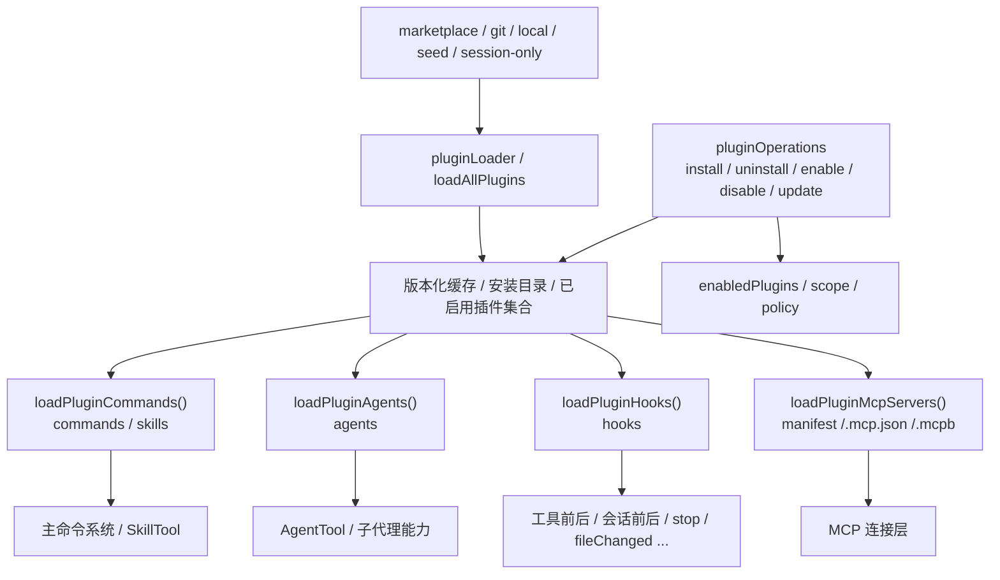

# 09 Plugins / Hooks：如何做能力扩展

前两章讲的是两种不同方向的扩展：

- MCP：把外部能力接进来；
- Skills：把方法论接进来。

这一章切到第三种扩展视角：**把一整组能力作为“扩展包”接进系统。**

Claude Code 的插件体系最有价值的地方在于，它不是只支持“一个插件点”。一个 plugin 一旦被安装并启用，理论上可以同时向系统贡献：

- commands / skills
- agents
- hooks
- MCP servers
- 配置项与安装生命周期

所以本章要回答的问题是：

**Claude Code 是怎样把 plugin 当成一个“能力包”，而不是单点扩展物，接进主流程的？**

## 1. 本章要解决什么问题

很多系统的“插件”最后都很鸡肋，原因通常是它们只开放了一个极窄的扩展点，比如：

- 只能加一个菜单项；
- 只能改一点 UI；
- 只能注册一个回调。

Claude Code 不是这么做的。它的插件体系明显更像一个“扩展包容器”：

1. 可以从 marketplace / git / 本地目录等来源获取；
2. 可以把插件内容缓存、版本化、启停和升级；
3. 插件本体又能继续向系统注入 commands、skills、agents、hooks、mcpServers。

因此本章聚焦四个问题：

- plugin 如何被发现、安装、缓存和启用；
- plugin 如何把多种能力物化出来；
- hooks 如何被注册、热更新、移除；
- plugin 的权限边界到底画在哪里。

## 2. 先看插件能力展开图



这张图最重要的结论是：

**plugin 不是一个功能点，而是一种能力分发容器。**

你可以把它理解成“一个带 manifest、生命周期和多种注入面的扩展包”。

## 3. 源码入口

本章建议重点锚定下面六组入口：

- `restored-src/src/utils/plugins/pluginLoader.ts`
  - 插件发现、缓存、目录结构、manifest 读取、来源优先级。
- `restored-src/src/services/plugins/pluginOperations.ts`
  - install / uninstall / enable / disable / update 等生命周期操作。
- `restored-src/src/utils/plugins/loadPluginCommands.ts`
  - 从插件目录装载 commands / skills。
- `restored-src/src/utils/plugins/loadPluginAgents.ts`
  - 从插件目录装载 agents。
- `restored-src/src/utils/plugins/loadPluginHooks.ts`
  - 聚合并注册 hooks，处理热更新。
- `restored-src/src/utils/plugins/mcpPluginIntegration.ts`
  - 从 plugin manifest、`.mcp.json`、`.mcpb` 等来源装载 MCP servers。

## 4. 主调用链拆解

### 4.1 pluginLoader：先解决“包从哪来、放哪去、怎么缓存”

`restored-src/src/utils/plugins/pluginLoader.ts` 一上来就把插件定义得非常清楚：

- 来源可能是 marketplace、git、本地目录、session-only；
- 插件目录结构可能包含 `plugin.json`、`commands/`、`agents/`、`hooks/` 等子目录；
- 系统要负责发现、加载、校验、去重、缓存和错误收集。

而且它不是简单地把插件放进一个目录就完了，还做了比较重的缓存策略：

- `getVersionedCachePath(...)`
- `getVersionedZipCachePath(...)`
- legacy cache fallback
- seed cache probe

这说明 Claude Code 把 plugin 当成真正的发行单元来对待，而不是“顺手读个目录”。

### 4.2 pluginOperations：插件不是只读资源，而是有完整生命周期

如果你只看 `pluginLoader.ts`，会觉得 plugin 更像“配置驱动加载器”。但 `restored-src/src/services/plugins/pluginOperations.ts` 明确告诉你：

plugin 还有一整套完整生命周期：

- install
- uninstall
- enable / disable
- update
- scope 判定（`user / project / local / managed`）

源码里尤其值得关注两个点：

1. **作用域不是装饰字段，而是行为边界。**
   - `getProjectPathForScope(...)`
   - `isPluginEnabledAtProjectScope(...)`
   这些逻辑说明“安装位置”和“启用范围”不是同一回事。
2. **插件操作层不直接写控制台、不 `process.exit()`。**
   - 它返回结构化结果对象，让 CLI 命令和 UI 都能复用。

这说明 Claude Code 把 plugin 当成平台能力，而不是某个单独命令的私有实现。

### 4.3 commands / skills：插件最直接的注入面

`restored-src/src/utils/plugins/loadPluginCommands.ts` 体现的是插件最常见的一层能力：把 Markdown 文件变成命令或 skill。

它的几个关键点非常值得复用：

- 递归收集 markdown 文件；
- 如果某目录下存在 `SKILL.md`，优先把这一整目录视为一个 skill；
- 根据目录层级自动构造 namespace；
- frontmatter 支持 `allowed-tools`、`model`、`effort`、shell/frontmatter 等；
- 还能替换 `${CLAUDE_PLUGIN_ROOT}` 和插件用户配置变量。

这说明 plugin 并不只是“注册一个回调”，而是可以把整套命令/skill 体系一起打包交付。

### 4.4 agents：插件也能分发子代理，但边界比你想的更严

`restored-src/src/utils/plugins/loadPluginAgents.ts` 更能体现 Claude Code 的产品意识。

它允许插件提供 agent Markdown，并把它们转换成 `AgentDefinition`。也支持：

- `tools`
- `skills`
- `color`
- `model`
- `background`
- `memory`
- `isolation`
- `effort`
- `maxTurns`

但同时，源码也非常明确地忽略了三类 frontmatter：

- `permissionMode`
- `hooks`
- `mcpServers`

注释解释得很清楚：

> 插件是第三方 marketplace 代码；这些字段会让单个 agent 文件绕过插件安装时的信任边界，静默提升能力。

这是一条非常值得学习的边界划法：

- **插件级 manifest 可以声明 hooks / MCP servers，因为这是安装时就能看见的边界；**
- **插件内部某个 agent 文件不能再偷偷声明更高权限能力。**

换句话说，Claude Code 明确区分了“扩展包级信任边界”和“包内单文件自由度”。

### 4.5 hooks：插件真正能改写系统行为的切口

`restored-src/src/utils/plugins/loadPluginHooks.ts` 显示出 plugin hooks 的产品威力。

它会：

1. 读取所有已启用插件；
2. 把 `hooksConfig` 转成带 `pluginRoot / pluginName / pluginId` 的 matcher；
3. 聚合成全局 `HookEvent -> PluginHookMatcher[]`；
4. 调用 `clearRegisteredPluginHooks()` + `registerHookCallbacks(...)` 做原子替换。

这里最有价值的是两点：

1. **hook 不是“追加回调”，而是按事件族统一注册。**
   支持的事件非常多：`PreToolUse`、`PostToolUse`、`Stop`、`PermissionDenied`、`TaskCreated`、`FileChanged` 等。
2. **热更新与裁剪被认真处理了。**
   - `clearPluginHookCache()` 只清 memoize，不直接把状态里的 hooks 擦掉；
   - `pruneRemovedPluginHooks()` 会在插件移除后裁掉失效 hooks；
   - hot reload 还会基于 settings snapshot 判断是否需要重载。

这意味着 hooks 在 Claude Code 里不是“脚本插件”，而是真正参与主流程生命周期的事件扩展层。

### 4.6 plugin 还能继续向系统注入 MCP server

`restored-src/src/utils/plugins/mcpPluginIntegration.ts` 说明 plugin 甚至还能继续扩展系统的外部能力接入面。

它支持从多种来源装载 MCP server：

- 插件目录下默认 `.mcp.json`
- manifest 的 `mcpServers`
- 指向 JSON 文件的路径
- `.mcpb` 包
- 内联配置数组

而且 `.mcpb` 还考虑了：

- 下载/解压错误
- user config 还未配置完成
- manifest 名称作为 serverName

这非常关键，因为它说明 plugin 并不是只能扩展本地逻辑，它还可以变成：

> “分发一组额外 MCP server 能力的包装容器”。

所以 plugin 和 MCP 并不是两套无关体系，而是能层层组合的。

## 5. 关键设计意图

本章可以提炼出五条特别有价值的设计结论：

1. **plugin 是能力分发容器，不是单点回调。**
   一个 plugin 可以同时贡献 commands、skills、agents、hooks、MCP servers。
2. **plugin 必须有完整生命周期。**
   install / enable / update / disable / uninstall / scope 缺一不可，否则扩展体系很快失控。
3. **插件扩展必须通过“物化层”进入系统。**
   `loadPluginCommands`、`loadPluginAgents`、`loadPluginHooks`、`loadPluginMcpServers` 就是各自的能力物化器。
4. **信任边界要画在“包级别”，而不是放任包内任意文件升级权限。**
   这正是 plugin agent 忽略 `permissionMode/hooks/mcpServers` 的原因。
5. **hook 才是插件影响主流程节奏的真正切口。**
   commands/agents 是显式调用，hooks 则是把插件接进系统生命周期。

## 6. 从复刻视角看

如果你想复刻一个最小可用的插件系统，我建议先只保留三层：

1. **发行与缓存层**
   - 解决插件从哪来、存在哪、怎么升级。
2. **能力物化层**
   - 把插件目录里的 `commands/`、`agents/`、`hooks/` 等转换成系统内部对象。
3. **生命周期与信任边界**
   - 安装、启停、作用域、权限限制要先有，不要等插件多了再补。

一个很小但方向正确的骨架可以是：

```text
plugin = loadManifest(pluginDir)
if enabled(plugin):
  commands += loadCommands(plugin)
  agents += loadAgents(plugin)
  hooks += loadHooks(plugin)
  mcpServers += loadMcpServers(plugin)
```

但你必须马上补两个治理点：

- 插件来源与缓存版本化；
- 包内文件不能任意声明超过安装边界的权限。

否则插件系统很快就会从“扩展平台”变成“任意代码注入入口”。

### 6.1 源码追踪提示

这一章建议不要直接从 UI 入口读起，而要按“插件生命周期 -> 能力物化 -> 主流程接入”来追：

1. 先读 `restored-src/src/services/plugins/pluginOperations.ts` 与 `restored-src/src/services/plugins/PluginInstallationManager.ts`，抓安装、启停、缓存和来源管理。
2. 再看 `restored-src/src/plugins/builtinPlugins.ts` 和相关 plugin manifest/loader 逻辑，理解插件能力是如何被物化成系统对象的。
3. 最后回到 `restored-src/src/hooks/useManagePlugins.ts`、`restored-src/src/commands/plugin/*` 和 hooks 相关工具链，确认插件怎样真正接进会话主流程和管理面。

## 7. 本章小练习

1. 为你的 agent 系统设计一个最小 `plugin.json`，并约定三类目录：`commands/`、`agents/`、`hooks/`。
2. 写一个 `loadPluginCommands()`，把插件目录下的 Markdown 命令加载到统一命令表。
3. 再做一个 `loadPluginHooks()`，支持 `PreToolUse / PostToolUse` 两种事件。
4. 最后补一道治理题：禁止插件内单个 agent 文件覆盖系统级权限模式，只允许插件 manifest 在安装时声明更高层能力。

## 8. 本章小结

Claude Code 的插件体系真正值得学习的，不是“支持插件”这件事本身，而是它把插件做成了一个完整的扩展包平台：

- 上游有 marketplace / cache / version；
- 中间有 commands / agents / hooks / MCP servers 的物化层；
- 下游还有 install / enable / update / remove 的生命周期管理。

这让 plugin 不再是“加一个脚本”的小能力，而是“给系统分发一组能力”的正式机制。

下一章我们把扩展能力流收口到最重要的一层：权限、策略与安全边界。因为无论是 MCP、Skills 还是 Plugins，最终都必须回答同一个问题：

**它们在系统里到底被允许做到什么程度？**
