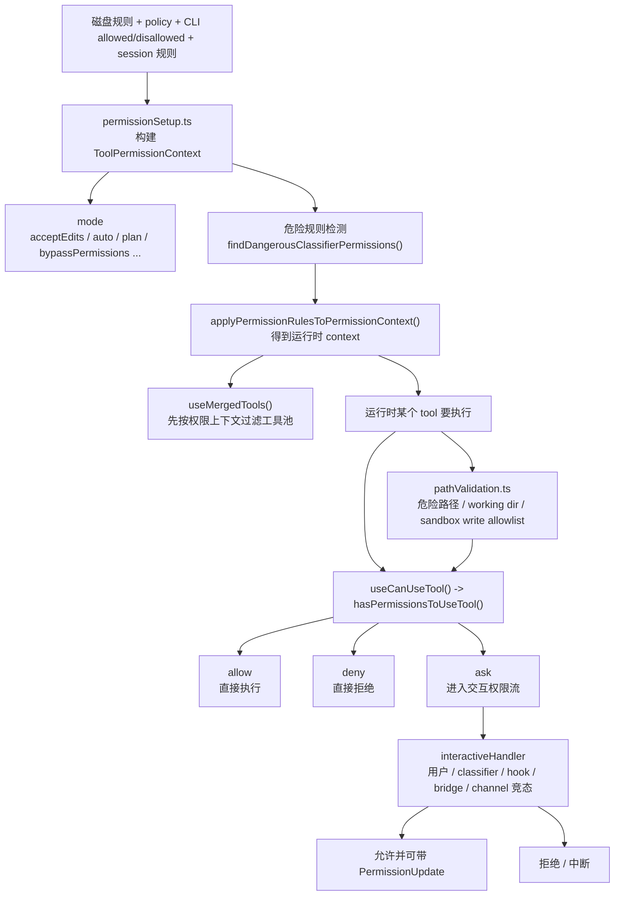

# 10 权限、策略、安全边界

前面三章实际上都在向系统增加能力：

- MCP 增加外部能力；
- Skills 增加方法论能力；
- Plugins / Hooks 增加扩展包能力。

但一个真正能长期运行的 agent 系统，不能只回答“能做什么”，还必须回答：

> “在什么条件下能做？谁来批准？哪些边界绝不能跨？”

Claude Code 的权限系统真正厉害的地方在于，它不是一个“是否允许”的简单开关，而是一整套**启动期规则装配 + 运行时决策 + 模式切换 + 安全兜底**的状态机。

## 1. 本章要解决什么问题

如果你把权限系统理解成：

- 读一下 settings；
- 遇到危险操作弹个确认框；

那会完全低估 Claude Code 在这部分的工程复杂度。它至少同时解决了四类问题：

1. **规则从哪里来。**
   - user / project / local / policy / CLI 参数 / session 临时授权。
2. **规则怎样进入会话。**
   - 启动时构造成 `ToolPermissionContext`。
3. **运行时如何判定。**
   - `allow / deny / ask`，并且可能被 classifier、hook、bridge、channel、用户交互共同影响。
4. **安全模式如何防止被规则绕过。**
   - auto mode 会剥离危险规则；
   - path validation 会优先执行安全检查；
   - sandbox allowlist 只是附加放行，不会覆盖危险路径检查。

所以这一章要看的不是“权限弹窗怎么画”，而是**能力治理在系统里是如何分层落地的。**

## 2. 先看权限决策流程图



这张图里最关键的不是分支数量，而是顺序：

1. **先在启动期把规则装进 context；**
2. **运行时每次工具执行都走决策；**
3. **路径安全和 sandbox 不会绕过更上层的危险规则与模式限制。**

## 3. 源码入口

本章最值得反复看的源码入口有五组：

- `restored-src/src/utils/permissions/permissionSetup.ts`
  - 启动期规则加载、模式处理、危险规则剥离。
- `restored-src/src/utils/permissions/permissions.ts`
  - 规则如何应用到 `ToolPermissionContext`，以及运行时判定的基础逻辑。
- `restored-src/src/utils/permissions/pathValidation.ts`
  - 路径安全、working dir、sandbox write allowlist 的判定顺序。
- `restored-src/src/hooks/useCanUseTool.tsx`
  - 工具真正执行前的总入口，决定 allow / deny / ask。
- `restored-src/src/hooks/toolPermission/handlers/interactiveHandler.ts`
  - ask 分支的交互式权限流程。

如果你只读一条链，我建议从 `permissionSetup.ts` 开始，到 `useCanUseTool.tsx` 收束，再补 `interactiveHandler.ts`。

## 4. 主调用链拆解

### 4.1 启动期先做的，不是弹窗，而是“构造权限上下文”

`restored-src/src/utils/permissions/permissionSetup.ts` 做的第一件大事，是把规则源收敛成会话级 `ToolPermissionContext`。

源码里能看到它会：

- `loadAllPermissionRulesFromDisk()`
- 解析 CLI `--allowed-tools / --disallowed-tools`
- 结合 `additionalWorkingDirectories`
- 再调用 `applyPermissionRulesToPermissionContext(...)`

最终把这些东西装进一个统一 context 中。

这意味着 Claude Code 的权限系统不是“每次执行时临时去读文件”，而是：

> 启动时先把规则正规化、分来源装配，再把运行时判定建立在这份上下文上。

这一步非常重要，因为没有统一上下文，后面的 mode 切换、session 更新、规则同步都会变得一团乱。

### 4.2 auto mode 为什么要主动剥离危险规则

`permissionSetup.ts` 里最值得学习的一部分，是对危险规则的主动检测。

例如源码明确把下面这些视为危险情况：

- `Bash(*)`
- `Bash(python:*)`
- `PowerShell(*)`
- 某些解释器或代码执行前缀
- `Agent` allow rule

原因非常直接：在 auto mode 下，这类规则会让操作在 classifier 判定之前就被自动放行，相当于直接绕过安全模式。

所以 Claude Code 做的不是“提示用户小心”，而是更激进的做法：

- 先 `findDangerousClassifierPermissions(...)`
- 再在 auto mode 下把这部分规则从 context 里剥离
- plan mode 配合 auto mode 时，也会在状态切换中重新 strip / restore

这说明一个非常成熟的安全思路：

> 安全模式的核心不是“加一个模式名”，而是“重新定义哪些规则在该模式下仍然有效”。

### 4.3 权限模式不是布尔开关，而是状态机

从 `permissionSetup.ts` 能看到多个模式相关逻辑：

- `acceptEdits`
- `auto`
- `plan`
- `bypassPermissions`

并且模式切换还会联动：

- `handlePlanModeTransition(...)`
- `handleAutoModeTransition(...)`
- `transitionPlanAutoMode(...)`

这说明 Claude Code 里的权限模式不是简单的 `isSafeMode: true/false`。

它更像：

```text
当前模式
  -> 决定哪些规则生效
  -> 决定是否允许自动放行
  -> 决定是否保留/剥离危险规则
  -> 决定 UI 和附件提示如何变化
```

这也是为什么我更愿意把这套系统叫“权限状态机”，而不是“权限配置”。

### 4.4 路径安全检查的顺序，比规则本身更重要

`restored-src/src/utils/permissions/pathValidation.ts` 展示了另一个很容易被忽略的重点：

**权限判定不只是规则匹配，还包括固定顺序的安全检查。**

例如 `isPathAllowed(...)` 的顺序大致是：

1. 先看 deny rule；
2. 再检查内部可编辑路径；
3. 再做危险路径安全检查；
4. 再看是否在 working directory；
5. 再看内部可读路径；
6. 对工作目录外写操作，再看 sandbox write allowlist；
7. 最后才看 allow rule。

这里最值得学习的是两条规则：

- 危险路径检查必须早于 working directory auto-allow；
- sandbox allowlist 只是“额外允许哪些目录可写”，不会绕过更早的危险路径或 deny 检查。

也就是说，Claude Code 在这里坚持的是：

> “先做固定安全底线判断，再讨论用户配置出来的 allow。”

这能挡住很多“看似在允许目录内，实则通过符号链接/危险文件名绕边界”的问题。

### 4.5 运行时真正的总入口在 `useCanUseTool()`

`restored-src/src/hooks/useCanUseTool.tsx` 是运行时权限决策最值得看的入口。

它会先调用：

```ts
hasPermissionsToUseTool(tool, input, toolUseContext, assistantMessage, toolUseID)
```

然后根据返回结果分成三类：

- `allow`
- `deny`
- `ask`

这一步体现出权限系统的两个层次：

1. **静态/半静态判断层**
   - 规则、模式、path safety、classifier 预判等，先在 `hasPermissionsToUseTool` 里完成。
2. **交互协调层**
   - 如果结果是 `ask`，再进入更复杂的交互与竞态处理。

这比“所有权限都弹窗”要高级得多，因为它先尽可能把确定性的 allow/deny 提前消化掉。

### 4.6 `ask` 分支真正复杂的，是“多方竞态”

`restored-src/src/hooks/toolPermission/handlers/interactiveHandler.ts` 展示了 ask 分支为什么不是一个普通确认框。

它同时要处理：

- 本地用户的允许/拒绝/中断；
- classifier 异步结果；
- hook / coordinator / swarm worker 可能给出的判定；
- bridge 侧远端响应；
- channel permission relay 响应。

源码里甚至明确写了“谁先响应谁赢”的 resolve-once 逻辑：

- `claim()`
- `resolveOnce(...)`
- `userInteracted`

这说明 Claude Code 的 ask 流程本质是一个**多参与方竞态协调器**，而不是一个静态弹窗。

也因此，权限系统在这里的真实任务不是“展示 UI”，而是：

> 在本地用户、远端控制面、自动化检查、hook 回调之间，安全地收敛出唯一决策。

### 4.7 权限不只决定“能不能做”，还决定“工具池长什么样”

还有一个容易忽视的点：权限系统不仅在工具执行时生效，还会反过来影响工具池本身。

`restored-src/src/hooks/useMergedTools.ts` 会在组装工具池时结合 `toolPermissionContext` 做过滤和去重。这意味着：

- 某些工具可能在运行时根本不该被呈现给模型；
- 权限上下文不只是“执行时拦截器”，也是“能力可见性过滤器”。

这比单纯“执行时弹窗”更强，因为系统可以在更前面一层就减少不必要暴露面。

## 5. 关键设计意图

把这一章压缩成几条最重要的架构判断，可以得到：

1. **权限系统是状态机，不是 if-else。**
   它先装配上下文，再随模式切换、规则同步、session 更新持续演化。
2. **安全模式必须重写规则语义。**
   auto mode 不是“再加一层判断”，而是要主动剥离能绕过 classifier 的危险规则。
3. **路径安全要先于 allow 规则。**
   否则 working directory、sandbox allowlist、符号链接都会成为绕边界通道。
4. **ask 分支本质是多方竞态协调。**
   用户、classifier、hook、bridge、channel 都可能参与，系统必须只收敛出一个最终决策。
5. **权限影响的不只是执行，还影响能力可见性。**
   工具池在暴露给模型之前就会先经过权限上下文过滤。

## 6. 从复刻视角看

如果你想复刻一个最小但靠谱的 agent 权限系统，我建议至少保留下面四层：

1. **规则装配层**
   - 把磁盘配置、CLI 参数、会话临时授权统一装进一个运行时 context。
2. **模式层**
   - 至少区分普通模式与安全模式，并允许安全模式重写规则语义。
3. **路径安全层**
   - 危险路径检查必须先于“在工作目录里就默认允许”。
4. **运行时协调层**
   - `allow / deny / ask` 要分层处理，ask 至少支持一个统一的 resolve-once 流程。

一个方向正确的伪代码大概是：

```text
context = buildPermissionContext(rules, cliArgs, mode)
if mode == auto:
  context = stripDangerousRules(context)

decision = canUseTool(tool, input, context)
if decision == allow: run()
if decision == deny: reject()
if decision == ask: waitForSingleWinner(user / automation / remote)
```

最容易出大问题的地方有两个：

- 只做“弹窗确认”，却没有启动期规则上下文；
- 只做 allow/deny 规则，却没有路径级安全底线。

### 6.1 源码追踪提示

这一章最稳的源码追踪顺序是“启动期装配 -> 运行时判定 -> 交互审批”：

1. 先看 `restored-src/src/utils/permissions/permissionSetup.ts`，只抓规则来源、mode 切换和危险规则剥离。
2. 再看 `restored-src/src/utils/permissions/permissions.ts` 与 `restored-src/src/utils/permissions/pathValidation.ts`，确认规则匹配和路径安全底线的先后顺序。
3. 最后深入 `restored-src/src/hooks/useCanUseTool.tsx` 与 `restored-src/src/hooks/toolPermission/handlers/interactiveHandler.ts`，看 allow / deny / ask 是怎样在运行时真正落地的。

## 7. 本章小练习

1. 为你的 agent CLI 设计一个最小 `PermissionContext`，至少包含：`mode`、`allowRules`、`denyRules`、`workingDirectories`。
2. 实现一个 `stripDangerousRulesForAutoMode()`，把 `shell(*)` 或解释器通配规则从 auto mode 中剥离。
3. 写一个 `isPathAllowed()`，固定顺序执行：`deny -> safety -> workingDir -> allow`。
4. 再做一个 `ask` 流程实验：同时接受“用户确认”和“自动分类器结果”，实现“谁先到谁生效”的单次决策器。

## 8. 本章小结

Claude Code 的权限系统最值得学的地方，不是它有多少个弹窗组件，而是它把“能力治理”真正做成了一套系统：

- 启动期先装配规则和模式；
- 运行时再分层做 allow / deny / ask；
- ask 分支能协调用户、自动化和远端控制面；
- 路径安全和危险规则剥离又提供了更底层的安全底线。

也正因为有这一层，前面三章讲到的 MCP、Skills、Plugins 才能大胆扩展能力，而不至于把整个主流程变成一台无边界的执行器。
