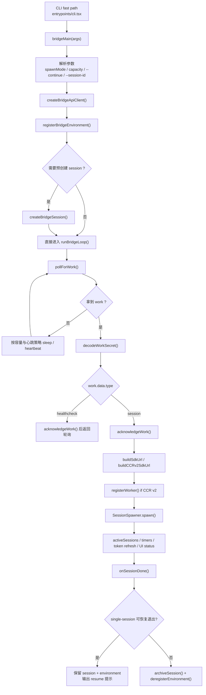
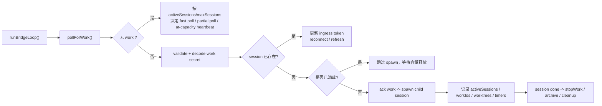

# 11 Bridge：远程控制主链路

Part 1 讲清了“本地一次请求怎么跑完”，Part 2 讲清了“能力怎么扩进来”。

但 Claude Code 还有一个非常不一样的面向：

**它并不只是一段跑在你终端里的本地 CLI，它还能把当前机器注册成一个可被远程调度的工作环境。**

这个能力就是 `Bridge`。

如果你从产品角度看，它对应的是：

- `claude remote-control`
- Web 端 / 移动端继续接管这台机器上的代码会话
- 会话断开后还能 resume
- 多 session 模式下还能在同一台机器上同时跑多个远程会话

如果你从源码角度看，它回答的是一个更工程化的问题：

**Claude Code 如何把“远端来活了”这件事，转成“本地生成或接管一个 CLI session 去跑”，并在中间维持 poll、ack、spawn、heartbeat、archive、deregister 这整套环境生命周期？**

## 1. 本章要解决什么问题

很多人第一次看到 `bridge/` 目录，会误以为它只是：

> 给远程控制做了一个 WebSocket 包装层。

但读完源码你会发现，Bridge 远远不止是通信层。它至少同时承担了五个职责：

1. **把当前机器注册成一个可调度环境。**
   - 不是直接开 socket，而是先向服务端注册 environment。
2. **持续轮询并领取 work item。**
   - 服务端下发的是 work，不是直接下发一条聊天消息。
3. **把 work item 映射成本地 session 生命周期。**
   - 包括 spawn、status、timeout、kill、cleanup。
4. **在多 session / worktree / same-dir 模式之间切换。**
   - 这不是 UI 小功能，而是并发协同策略。
5. **决定关机时是彻底销毁，还是保留以供 resume。**
   - archive session、deregister environment、保留 crash pointer，这些都属于收尾业务。

所以这一章的核心认知是：

**Bridge 不是“远程输入输出适配器”，而是“把本地 CLI 包装成远程工作节点”的环境管理器。**

## 2. 先看业务流程图

先看 `claude remote-control` 这条独立 Bridge 主线：



这张图有两个重点：

1. **Bridge 先管理 environment，再管理 session。**
2. **服务端派发的是 work item，本地收到后才决定怎么生成或接管 session。**

再看一张更偏“poll loop 内部”的图：



这张图背后是一条非常重要的工程原则：

> **Bridge 的主循环不是“收消息就转发”，而是“先判断这份 work 在当前容量和会话状态下能不能被安全承接”。**

## 3. 源码入口

这一章建议先抓这几个文件：

- `restored-src/src/entrypoints/cli.tsx`
  - `claude remote-control` 的 fast path，在完整 CLI 启动前先分流到 Bridge 模式。
- `restored-src/src/bridge/bridgeMain.ts`
  - 独立 Bridge 的主入口与 `runBridgeLoop()` 本体。
- `restored-src/src/bridge/bridgeApi.ts`
  - 注册 environment、poll、ack、heartbeat、archive、deregister 的 HTTP 客户端封装。
- `restored-src/src/bridge/sessionRunner.ts`
  - 真正负责 spawn 本地 Claude 子进程，并把 stdout/stderr 活动抽成 session activity。
- `restored-src/src/bridge/workSecret.ts`
  - 解码服务端下发的 work secret，并决定 SDK URL / CCR v2 worker 注册逻辑。
- `restored-src/src/bridge/createSession.ts`
  - 预创建、查询、归档远程会话。
- `restored-src/src/bridge/types.ts`
  - `BridgeConfig`、`WorkResponse`、`SessionHandle`、`SpawnMode` 等核心协议类型。

如果你只想先抓主线，推荐顺序是：

1. 先看 `cli.tsx` 里的 remote-control fast path。
2. 再看 `bridgeMain.ts` 的初始化部分。
3. 再看 `runBridgeLoop()` 的 poll / spawn / shutdown。
4. 最后看 `bridgeApi.ts`、`sessionRunner.ts`、`workSecret.ts` 补接口和细节。

## 4. 主调用链拆解

### 4.1 `cli.tsx` 把 `remote-control` 做成了真正的 fast path

在 `restored-src/src/entrypoints/cli.tsx` 里，`claude remote-control` 不是走普通命令分发，而是被单独提到前面：

- `remote-control`
- `rc`
- `remote`
- `sync`
- `bridge`

这些别名都会直接进入 Bridge fast path。

这一段先做了几件基础校验：

1. `enableConfigs()`
2. Bridge 能否启用
3. 是否已登录
4. 版本门槛
5. 组织策略是否允许 remote control

校验通过后才会：

```ts
await bridgeMain(args.slice(1))
```

这说明 Bridge 在产品定位上不是“普通命令的一个子功能”，而是和 daemon、bg sessions 一样，被视为**一级运行模式**。

### 4.2 `bridgeMain(args)` 的第一职责，是把“运行策略”拍平

真正进入 `restored-src/src/bridge/bridgeMain.ts` 后，首先处理的不是网络连接，而是运行策略：

- 当前目录 `dir`
- `spawnMode`
- `maxSessions`
- `--continue`
- `--session-id`
- 是否 worktree 可用
- 是否要预创建 session

结合 `types.ts` 看，Bridge 的三种核心 spawn 模式是：

- `single-session`
- `worktree`
- `same-dir`

这里有两个特别值得注意的点。

第一，`spawnMode` 不是 UI 偏好，而是**并发隔离策略**：

- `single-session`：一个环境只跑一个 session，session 结束后 Bridge 也会跟着收口
- `same-dir`：多个 session 共用同一个工作目录，速度快但相互干扰风险高
- `worktree`：每个新 session 用单独 git worktree，隔离性最好

第二，resume 逻辑不是事后补丁，而是初始化主线的一部分：

- `--continue`
- `--session-id`
- crash pointer
- `reuseEnvironmentId`

这些都在进入 poll loop 前就已经决定好了。

### 4.3 Bridge 先注册 environment，再考虑 session

初始化完配置后，`bridgeMain.ts` 会创建：

```ts
const api = createBridgeApiClient(...)
```

然后组装 `BridgeConfig`，再调用：

```ts
api.registerBridgeEnvironment(config)
```

`restored-src/src/bridge/bridgeApi.ts` 里这个请求命中的是真正的环境注册接口：

- `POST /v1/environments/bridge`

请求体里不只是目录信息，还会带上：

- `machine_name`
- `directory`
- `branch`
- `git_repo_url`
- `max_sessions`
- `metadata.worker_type`
- 可选的 `environment_id`（用于 resume reconnect）

这一步很重要，因为它明确了 Bridge 的服务端心智模型：

**远程控制首先连接的是“环境”，不是“会话”。**

session 只是这个环境内部随后会被分派和承接的工作单元。

### 4.4 可选的“预创建 session”，是为了让远端一连上就有地方落

注册 environment 成功后，`bridgeMain.ts` 还可能调用：

```ts
createBridgeSession(...)
```

`restored-src/src/bridge/createSession.ts` 里把它写得很清楚：

- `claude remote-control` 场景会创建一个空 session
- `/remote-control` 场景则可能带着现有事件历史预创建 session

这个 pre-create 的意义不是“立刻执行工作”，而是：

**让用户在 Web 端或移动端一连接进来，就已经有一个可以输入和恢复上下文的 session 容器。**

这也是为什么 `bridgeMain.ts` 会把 `initialSessionId` 传进 `runBridgeLoop()` 并且马上在 UI 上 `setAttached(initialSessionId)`。

### 4.5 `runBridgeLoop()` 才是 Bridge 的真正心脏

和 `queryLoop()` 类似，Bridge 真正的心脏也不是入口函数，而是 `runBridgeLoop(...)`。

这个循环维护了一大批运行时表：

- `activeSessions`
- `sessionStartTimes`
- `sessionWorkIds`
- `sessionCompatIds`
- `sessionIngressTokens`
- `sessionTimers`
- `completedWorkIds`
- `sessionWorktrees`

从这些字段你就能反推出 Bridge 的真实职责：

1. 既要记住本地有哪些 child session 在跑；
2. 又要记住它们各自对应哪个 work item；
3. 还要记住 token、timer、worktree、compat id 这些跨请求生命周期信息。

所以 `runBridgeLoop()` 更像一个：

**本地远程工作调度器**

而不只是一个“长轮询 while 循环”。

### 4.6 `pollForWork()` 拿到的是 work，不是直接的用户消息

`bridgeApi.ts` 中 Bridge 轮询的接口是：

- `GET /v1/environments/{environmentId}/work/poll`

返回的是 `WorkResponse | null`。

`types.ts` 里把 `WorkData` 定义成：

- `session`
- `healthcheck`

也就是说，服务端给本地 Bridge 派发的不是“帮我执行一句 prompt”，而是一份待承接工作。

这份 work 再结合 `work.secret` 才能决定：

- 该 work 属于哪个 session
- 如何 ack
- 用哪种 transport 接入 session ingress
- 是否走 CCR v2

这正是 Bridge 相比普通聊天客户端最大的架构差异：

**它处理的是环境级工作调度协议，而不是单轮聊天协议。**

### 4.7 `decodeWorkSecret()` 负责把 work 变成可启动 session 的真实材料

`restored-src/src/bridge/workSecret.ts` 把 work secret 解码后，会拿到至少这些关键数据：

- `session_ingress_token`
- `api_base_url`
- `use_code_sessions`

然后据此派生两条接入路径：

1. **旧路径 / v1 风格**
   - `buildSdkUrl(...)`
   - 基于 session ingress WebSocket
2. **CCR v2 路径**
   - `buildCCRv2SdkUrl(...)`
   - 先 `registerWorker(...)`
   - 再让 child 走 SSE + CCRClient

这一步非常关键，因为它说明：

**Bridge 本身不是 transport，它只是根据服务端下发的 secret，替子进程选择并准备 transport。**

### 4.8 `acknowledgeWork()` 的时机被设计得非常保守

`bridgeMain.ts` 里有一句很重要的注释：

> 只有在确定要处理这份 work 时才 ack，不能过早 ack。

对应代码逻辑也很克制：

- 无法 decode secret 时，不乱 ack
- at capacity 时，不提前 ack
- 真正决定处理一份 session work 后，才 `acknowledgeWork(...)`

原因很直接：

**过早 ack 会让服务端以为这份 work 已被本地承接，但本地实际上可能因为容量不足或初始化失败而根本没接住。**

所以 Bridge 在 ack 这件事上贯彻的是：

> 先承诺能接，再回服务端说“我接了”。

### 4.9 对“已存在 session”的处理，不是重新 spawn，而是刷新 token 与 work 绑定

收到 `session` 类型 work 后，`runBridgeLoop()` 先做的不是 spawn，而是先查：

```ts
const existingHandle = activeSessions.get(sessionId)
```

如果这个 session 已经存在，它会：

- 更新 access token
- 更新 `sessionIngressTokens`
- 更新 `sessionWorkIds`
- 重新 schedule token refresh
- `ack` 后直接结束本轮处理

这说明 Bridge 的心智模型不是“每来一份 work 都开新进程”，而是：

**如果这份 work 指向的是一个已经活着的 session，那就把它视为一次重新派送 / 续租 / 重新接管。**

这也是远程 session 能跨网络抖动继续活下去的基础。

### 4.10 真正 spawn 本地 session 的，是 `SessionSpawner`

当 work 确认可承接，而且当前不在满载状态时，Bridge 才会进入 spawn 阶段。

这里核心是 `restored-src/src/bridge/sessionRunner.ts` 暴露的：

```ts
createSessionSpawner(...)
```

它做的事情可以概括成三层：

1. **spawn 子进程**
   - 用当前 CLI 重新起一个 Claude 子进程
2. **抽取 session activity**
   - 从 stdout 里的 assistant/tool/result 事件中提取活动摘要
3. **暴露 `SessionHandle`**
   - `done`
   - `kill() / forceKill()`
   - `writeStdin()`
   - `updateAccessToken()`
   - `activities / currentActivity / lastStderr`

这层设计很值得借鉴，因为它把“子进程控制”抽成了一个稳定对象，而不是让 `bridgeMain.ts` 直接面对裸 `ChildProcess`。

### 4.11 `worktree` 模式不是装饰项，而是并发隔离策略

在 spawn 前，`bridgeMain.ts` 会根据 `spawnMode` 决定 session 实际运行目录：

- `single-session` / `same-dir`
  - 直接用 `config.dir`
- `worktree`
  - 为新 session 创建独立 git worktree

这一步的真正业务含义是：

**Remote Control 一旦支持多 session，就必须解决“多个远程会话同时改同一份代码”的隔离问题。**

Claude Code 给出的答案非常务实：

- 不强行在内存层做复杂冲突控制
- 而是在文件系统 / git 工作副本层直接隔离

这和 Part 1 里工具层“并发执行、顺序提交”的思路是相通的：都优先选择工程上可控的边界。

### 4.12 `onSessionDone()` 决定的是 Bridge 的生命周期策略

session 跑完之后，Bridge 不是简单删掉 handle 就结束。

`runBridgeLoop()` 里定义的 `onSessionDone(...)` 会做很多收尾：

- 从 `activeSessions` 等映射表中移除 session
- 清理 timeout / token refresh
- 唤醒 capacity wake
- 记录完成状态与耗时
- `stopWorkWithRetry(...)`
- 清理 worktree
- 在多 session 模式下 archive session
- 在 single-session 模式下决定是否直接 abort 整个 poll loop

这说明：

**在 Bridge 里，session 的完成不仅影响 session 自身，还会反过来影响环境是否继续对外提供服务。**

换句话说，Bridge 的生命周期是：

- environment 生命周期
- 包裹多个 session 生命周期
- 而某些 session 完成事件会反过来结束 environment 生命周期

### 4.13 “满载时怎么办”是 Bridge 设计里最有味道的一段

`runBridgeLoop()` 对 at-capacity 的处理非常认真，不是简单 sleep。

源码里至少考虑了三种状态：

1. **无 work 且未满载**
   - 快 poll / partial poll
2. **无 work 且已满载**
   - 根据配置进入 heartbeat-only 或 at-capacity poll
3. **有 work 但已满载**
   - 不 spawn 新 session，只等待容量释放

同时它还维护：

- `capacityWake`
- `heartbeatActiveWorkItems()`
- `poll_due`
- auth_failed / fatal 的退避策略

这背后体现的设计意图非常明确：

**Bridge 不是只追求“尽快领活”，还要保证在满载、断网、token 过期、系统休眠等情况下，不把 poll loop 打成失控的 tight loop。**

这是一段非常典型的生产级守护进程设计。

### 4.14 Shutdown 的语义比启动还细：archive、deregister、resume 要分开

Bridge 收尾阶段是这一章最值得抄的部分之一。

`bridgeMain.ts` 在退出时会先：

- 停止 status update
- 收集需要 archive 的 session 集合
- 尝试优雅 kill active sessions
- 超时后 force kill
- 停止 work item
- 等 pending cleanup 完成

然后才决定是走哪条终局路径：

1. **可恢复 single-session 退出**
   - 不 archive session
   - 不 deregister environment
   - 输出 `claude remote-control --continue` 提示
2. **普通关闭**
   - archive 所有已知 session
   - deregister environment
   - 清理 crash-recovery pointer

这说明 Bridge 的退出不是单一“关闭连接”，而是在做一个高层业务判断：

**这次退出是“彻底下线”，还是“留下一个以后还能接着跑的远程会话”。**

### 4.15 `runBridgeHeadless()` 说明 Bridge 不是只能跑在 TTY 里

`bridgeMain.ts` 后半段还定义了：

```ts
runBridgeHeadless(...)
```

这说明 Bridge 的核心不是 TUI，也不是 stdin 键位交互，而是那条：

- register environment
- create session if needed
- runBridgeLoop

TTY 版本只是额外加了：

- banner
- status line
- `w` 切换 spawn mode
- 空格切换 QR code

而 headless 版本照样可以：

- 被 daemon worker 驱动
- 非交互运行
- 作为长期驻留的 remote control worker

这也正好为后面的 daemon 章节做了铺垫。

## 5. 关键设计意图

这一章可以压缩成六条设计意图：

1. **先注册环境，再处理会话。**
   - 远程控制的基础对象是 environment，不是 session。
2. **服务端派发 work，本地再决定如何承接。**
   - 桥接层掌握容量、隔离与生命周期判断权。
3. **ack 必须保守。**
   - 只有确定能接住 work 才确认领取。
4. **session 是本地 child process，但要被抽象成可管理句柄。**
   - 否则 poll loop 会被进程细节污染。
5. **多 session 一定要有隔离策略。**
   - `worktree` 模式不是锦上添花，而是并发协同的核心保障。
6. **退出时要区分“下线”和“可恢复挂起”。**
   - resume 语义必须在 shutdown 层被明确建模。

## 6. 从复刻视角看

如果你想复刻一个“本地代理可被远程接管”的系统，这章最值得保留的是下面四层：

### 6.1 环境层

负责：

- 环境注册
- 机器元信息
- session capacity
- 生命周期标识

这层不要和具体会话耦死，否则 resume 和多 session 都会很痛苦。

### 6.2 work 调度层

负责：

- poll / ack
- heartbeat
- backoff
- 容量判断

这层的关键不是业务功能，而是健壮性。任何 tight loop、早 ack、失败重试失控，都会直接把远程控制打坏。

### 6.3 本地 session 层

负责：

- spawn 本地代理进程
- 暴露 handle
- 提供 kill / done / token refresh / activity 视图

这一层最好做成独立抽象，不要直接把桥接主循环绑到 `ChildProcess` 原语上。

### 6.4 关闭与恢复层

负责：

- archive
- deregister
- resume pointer
- worktree cleanup

很多人做远程代理只管“连上”，不管“断开后还能不能恢复”。Claude Code 的 Bridge 恰好证明：

**真正可用的远程控制系统，收尾设计和启动设计一样重要。**

### 6.5 源码追踪提示

建议你把 Bridge 当成“环境管理器”来追，而不是先钻进通信细节：

1. 先看 `restored-src/src/bridge/bridgeMain.ts`，把环境注册、poll loop、session 收尾三段划开。
2. 再看 `restored-src/src/bridge/bridgeApi.ts` 与 `restored-src/src/bridge/types.ts`，确认 environment、work、heartbeat、archive 这些协议对象。
3. 最后补 `restored-src/src/bridge/sessionRunner.ts` 与 `restored-src/src/bridge/workSecret.ts`，看 work 是如何真正映射成本地 session spawn 的。

## 7. 本章小练习

建议你做三个源码练习：

1. 顺着 `bridgeMain(args)` 画一张初始化图。
   - 至少画出 `registerBridgeEnvironment -> createBridgeSession -> runBridgeLoop`。
2. 顺着 `runBridgeLoop()` 画一张 work 状态图。
   - 标出 `poll / ack / existing session / at capacity / spawn / onSessionDone` 六个节点。
3. 回答一个复刻问题：
   - 如果你自己的远程 agent 支持多会话并发，你会选 `same-dir`、`worktree`，还是容器隔离？你的成本和收益分别是什么？

## 8. 本章小结

这一章最重要的三句结论是：

1. **Bridge 的本质，是把本地 Claude CLI 包装成一个可远程调度的环境节点。**
2. **它的主循环处理的不是聊天消息，而是 environment 级的 work 调度与本地 session 生命周期。**
3. **真正让远程控制可用的，不只是连通性，而是 poll、ack、spawn、隔离、resume、shutdown 这一整套环境管理语义。**

下一章就该继续往下走：

**Bridge 把远程 work 接进来了以后，Remote session 本身又是如何被连接、管理、恢复与透传消息的？**
