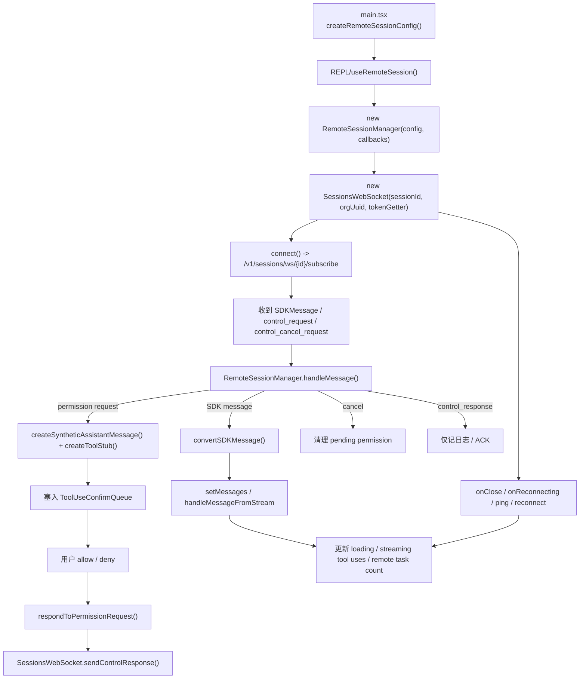
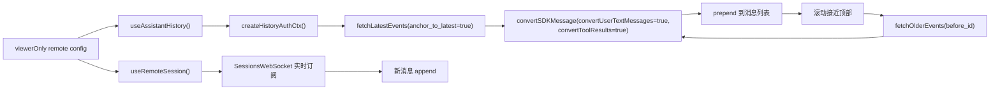

# 12 Remote Session：会话接管与连接管理

第 11 章讲的是：

> Claude Code 如何把“这台机器”注册成一个可远程调度的工作环境。

但只把机器注册出去还不够，用户真正感知到的体验是另一件事：

**远端 session 建好了以后，本地 REPL 怎样连上它、显示它、控制它、在断线时尽量恢复它？**

这就是 `remote/` 这一层要解决的问题。

如果从产品角度看，这条链路对应的是：

- `claude assistant` 只读接入远程会话
- Web / 移动端触发的远程 session 被本地终端继续接管
- 远程 agent 还在跑，但本地 UI 需要显示消息、工具进度、权限确认、后台任务数
- WebSocket 掉线后，尽量自动重连而不是直接判死

如果从源码角度看，这章回答的是：

**Claude Code 如何把远端 CCR session 发来的 SDK 消息流，转成本地 REPL 可消费的消息、权限请求、连接状态与历史分页能力？**

## 1. 本章要解决什么问题

很多人第一次看到 `remote/RemoteSessionManager.ts`，会下意识把它理解成：

> “就是一个 WebSocket client 包装类。”

这只说对了一小部分。

结合 `main.tsx`、`useRemoteSession.ts`、`sdkMessageAdapter.ts`、`useAssistantHistory.ts` 一起看，你会发现远程会话接管至少包含六层职责：

1. **决定当前 REPL 是否进入 remote mode。**
   - 不是所有 REPL 都是本地会话，有些是 attach 远程 session。
2. **建立远程订阅连接并维持可恢复状态。**
   - 包括鉴权、ping、断线重连、特殊 close code 策略。
3. **把 SDK 消息适配成本地 Message / StreamEvent。**
   - 否则 Ink REPL 根本无法直接渲染远端消息。
4. **把远端权限请求桥接到本地权限 UI。**
   - 用户仍然在本地点 allow / deny，但真实执行发生在远端容器。
5. **处理远程模式特有的显示一致性问题。**
   - 例如 echo 去重、tool_result 补显示、后台任务计数、标题更新。
6. **在 viewer 模式下补齐历史分页。**
   - 只读接管场景里，用户一进来就得看到已有上下文，而不只是新消息。

所以本章的核心认知是：

**Remote Session 不是“把 WebSocket 接到 UI 上”，而是“把远端会话重新投影成一个本地可交互 REPL”的接管层。**

## 2. 先看业务流程图

先看“远程 session 是怎样接进 REPL”的主图：



这张图里最关键的不是 `connect()`，而是两次“翻译”：

1. **消息翻译**：`SDKMessage -> REPL Message / StreamEvent`
2. **权限翻译**：`remote control_request -> 本地 ToolUseConfirm UI -> control_response`

再看 viewer 模式下的“历史 + 实时流”拼接图：



这张图要表达的是：

> **viewerOnly 模式下，远程会话不是“只听实时消息”，而是“历史分页 + 实时流合并”的双通道接管。**

## 3. 源码入口

这一章建议先抓这几组源码：

- `restored-src/src/main.tsx`
  - 远程 session config 的真正创建点，决定是否 `viewerOnly`。
- `restored-src/src/hooks/useRemoteSession.ts`
  - REPL 接远程会话的主 hook，负责连接、渲染、权限桥接、状态同步。
- `restored-src/src/remote/RemoteSessionManager.ts`
  - 远程会话管理器，协调 WebSocket 收消息与 HTTP 发消息。
- `restored-src/src/remote/SessionsWebSocket.ts`
  - 远程订阅连接、ping、重连、close code 策略。
- `restored-src/src/remote/sdkMessageAdapter.ts`
  - 把 SDK 消息转换为本地 REPL 的消息类型。
- `restored-src/src/remote/remotePermissionBridge.ts`
  - 把远端 permission request 伪装成本地 `ToolUseConfirm` 可处理的对象。
- `restored-src/src/hooks/useAssistantHistory.ts`
  - viewer 模式下的历史分页接入。
- `restored-src/src/assistant/sessionHistory.ts`
  - 拉取远程 session 历史事件的 API 封装。

如果你只想抓主线，推荐顺序是：

1. 先看 `main.tsx` 里 remote config 从哪里创建。
2. 再看 `useRemoteSession.ts` 怎样把 manager 接进 REPL。
3. 接着看 `RemoteSessionManager.ts` 与 `SessionsWebSocket.ts`。
4. 最后补 `sdkMessageAdapter.ts`、`remotePermissionBridge.ts`、`useAssistantHistory.ts`。

## 4. 主调用链拆解

### 4.1 `main.tsx` 先决定：这是“接管远程 session”，还是普通本地 REPL

`restored-src/src/main.tsx` 里至少有两条创建 remote config 的入口：

1. `claude assistant` 一类 viewer 场景
   - `createRemoteSessionConfig(targetSessionId, getAccessToken, orgUUID, false, true)`
2. 正常远程会话 attach 场景
   - `createRemoteSessionConfig(createdSession.id, getAccessTokenForRemote, apiCreds.orgUUID, hasInitialPrompt)`

这说明 remote mode 不是 `useRemoteSession()` 自己猜出来的，而是上游入口先明确给出：

- `sessionId`
- `getAccessToken`
- `orgUuid`
- `hasInitialPrompt`
- `viewerOnly`

这里最值得你抓住的一点是：

**`viewerOnly` 不是“UI 上禁几个键”的小选项，而是后续整条接管链路的重要分叉条件。**

它会影响：

- 是否允许 Ctrl+C 发 interrupt
- 是否做 session title 更新
- 是否把 user text / tool_result 从远端重新渲染出来
- 是否启用历史分页
- 是否启用 60 秒无响应重连告警

### 4.2 `useRemoteSession()` 才是 REPL 接线总控

真正把远程 session 接进 REPL 的，不是 `RemoteSessionManager` 自己，而是：

```ts
restored-src/src/hooks/useRemoteSession.ts
```

这个 hook 干了几件非常关键的事情：

1. 创建 `RemoteSessionManager`
2. 注册各类 callback
3. 把收到的远端 SDK 消息转成 `setMessages(...)`
4. 把远端权限请求桥接到本地 `ToolUseConfirmQueue`
5. 把连接状态同步进 `AppState.remoteConnectionStatus`
6. 把远端后台任务数同步进 `AppState.remoteBackgroundTaskCount`

这说明它不是一个单纯的“数据拉取 hook”，而是一个**远程 REPL 状态协调器**。

### 4.3 `RemoteSessionManager` 把“收消息”和“发消息”拆成两条不同通路

`restored-src/src/remote/RemoteSessionManager.ts` 的类注释写得很直白：

- WebSocket subscription for receiving messages from CCR
- HTTP POST for sending user messages to CCR
- Permission request/response flow

这其实就是远程会话接管最核心的结构：

1. **收消息走 WebSocket**
   - `SessionsWebSocket`
2. **发用户输入走 HTTP**
   - `sendEventToRemoteSession(...)`
3. **权限响应仍走 WebSocket control response**
   - `sendControlResponse(...)`

也就是说，远程会话不是一个“全双工都走同一条 socket”的简单聊天室模型，而是：

> **订阅流、输入提交、权限反馈分开建模。**

这有两个工程好处：

- 用户输入可以复用已有 teleport HTTP API
- 控制面仍能保持低延迟双向交互

### 4.4 `handleMessage()` 的本质是一个远端协议路由器

`RemoteSessionManager.handleMessage(...)` 先按类型把消息分成三类：

1. `control_request`
   - 进入 `handleControlRequest(...)`
2. `control_cancel_request`
   - 取消本地 pending permission
3. `control_response`
   - 视为 ACK，不进入普通渲染
4. 其他 `SDKMessage`
   - 转交给 `onMessage`

这里最重要的设计不是“if/else 写得很清楚”，而是：

**Claude Code 明确承认远程订阅流里混着两种完全不同的东西：**

- 给用户看的消息流
- 给控制面消费的协议流

如果你把它们不加区分地都丢进渲染层，权限、取消、ACK 很快就会把 UI 语义搞乱。

### 4.5 远端权限请求为什么还能复用本地权限 UI

这段设计很漂亮。

当 `RemoteSessionManager` 收到 `control_request` 且 `inner.subtype === 'can_use_tool'` 时，它不会自己弹窗，而是回调给 `useRemoteSession()`。

随后 `useRemoteSession()` 会做两步桥接：

1. `createToolStub(request.tool_name)`
   - 如果本地没有这个 tool，就造一个最小 stub
2. `createSyntheticAssistantMessage(request, requestId)`
   - 伪造一条带 `tool_use` block 的 assistant message

这样就能把远端 permission request 塞进本地现成的 `ToolUseConfirm` 队列。

这个桥接的工程含义很大：

**本地权限 UI 不需要知道“这个 tool_use 实际发生在远端容器里”，它只需要继续处理统一的确认对象。**

这就是典型的“协议适配 + UI 复用”。

### 4.6 `sdkMessageAdapter` 解决的是“协议层消息”和“渲染层消息”不对齐的问题

`restored-src/src/remote/sdkMessageAdapter.ts` 的工作不是做业务判断，而是做类型翻译。

它把远端 SDK 消息映射成 REPL 能理解的东西：

- `assistant` -> `AssistantMessage`
- `stream_event` -> `StreamEvent`
- `system:init` -> informational system message
- `system:status` -> informational system message
- `system:compact_boundary` -> compact boundary message
- `tool_progress` -> informational system message
- `result:error` -> system warning
- `result:success` -> 默认忽略

这里有两个很重要的选择。

第一，**成功 result 默认不展示**。

源码注释写得很明确：在多轮会话里，成功结果太噪声，`isLoading=false` 已经足够表示回合结束。

第二，**未知消息类型默认忽略而不是报错**。

这代表它把兼容性放在了第一位：

> 后端先增加新消息类型，旧客户端也尽量别崩，只记调试日志。

这对于远程协同系统尤其关键，因为前后端版本不一定严格同步。

### 4.7 `useRemoteSession()` 还补了很多“看起来琐碎，其实决定体验”的状态修正

这一段非常值得学习，因为它体现了产品化代码和 demo 的差别。

源码至少处理了这些细节：

1. **echo 去重**
   - 本地 POST 的 user message 可能被服务端广播回订阅流，甚至同一个 `uuid` 会 echo 多次。
   - 所以用 `BoundedUUIDSet` 而不是“看到一次就删”的普通 Set。
2. **streaming tool use 与完整消息切换**
   - 收到完整消息后，清空之前的 streaming tool uses。
3. **远端后台任务数同步**
   - 根据 `task_started` / `task_notification` 更新 `remoteBackgroundTaskCount`。
4. **tool_result 到来时清掉 in-progress tool use**
   - 否则 UI spinner 会一直挂着。
5. **compaction 特殊处理**
   - `status=compacting` 时延长无响应超时，避免误判断线。

这些看似都是“前端小修补”，但本质上都在做同一件事：

**让远端 session 在本地看起来尽量像一个真实、本地、连续的交互会话。**

### 4.8 `SessionsWebSocket` 不是裸连，而是带重连预算与 close code 语义的连接器

`restored-src/src/remote/SessionsWebSocket.ts` 里最值得看的不是 URL 拼接，而是连接生命周期策略：

- `RECONNECT_DELAY_MS = 2000`
- `MAX_RECONNECT_ATTEMPTS = 5`
- `PING_INTERVAL_MS = 30000`
- `MAX_SESSION_NOT_FOUND_RETRIES = 3`

close code 处理也很讲究：

- `4003`
  - 视为永久拒绝，不再重连
- `4001`
  - 不立刻判死，允许短暂重试
  - 因为 compaction 期间服务端可能暂时把 session 视为 stale
- 普通断线
  - 在预算内自动重连

这背后其实是在表达一个很成熟的分层判断：

1. **鉴权失败类错误**
   - 立即停止，继续重连没有意义
2. **状态暂时不一致类错误**
   - 给一个小的重试窗口
3. **网络抖动类错误**
   - 有限次数自动恢复

这比“掉线就无限重连”或“掉线就直接失败”都更产品化。

### 4.9 这条 WebSocket 还承担了控制面写回

很多人会只注意它的 `onMessage`，忽略它还能主动发两类控制消息：

1. `sendControlResponse(response)`
   - 回 permission allow / deny
2. `sendControlRequest({ subtype: 'interrupt' })`
   - 本地 Ctrl+C 中断远端当前请求

换句话说，这条订阅连接并不只是只读通道，它还是一条**窄控制回路**。

只是 Claude Code 很克制，没有把普通 user message 也塞进来，而是只让它承担需要实时协商的控制面动作。

### 4.10 `viewerOnly` 模式不是少功能，而是另一套接管策略

结合 `useRemoteSession.ts` 和 `useAssistantHistory.ts` 看，`viewerOnly` 模式有一套单独策略：

- 不发送 interrupt
- 不更新 session title
- 不启用 60 秒超时重连告警
- 需要 `convertToolResults: true`
- 需要 `convertUserTextMessages: true`
- 允许历史分页加载

为什么？

因为 viewer 模式面对的不是“我本地刚发出的活跃交互”，而是：

> **我现在接管一个可能已经存在很久、而且由远端 agent 主导的会话。**

此时如果还沿用普通 remote mode 的假设，就会出现很多错觉：

- 用户消息不显示
- tool_result 渲染丢失
- 会话标题被本地 viewer 意外改掉
- 远端 idle shutdown 被误判成“无响应”

所以 `viewerOnly` 本质上不是权限收缩，而是**语义切换**。

### 4.11 `useAssistantHistory()` 说明“远程接管”不只是实时链路，还要补历史上下文

`restored-src/src/hooks/useAssistantHistory.ts` 和 `assistant/sessionHistory.ts` 这组代码很容易被忽略，但它们决定了 viewer 体验是否完整。

这里的流程是：

1. `createHistoryAuthCtx(sessionId)`
2. `fetchLatestEvents(anchor_to_latest=true)`
3. `convertSDKMessage(..., { convertUserTextMessages: true, convertToolResults: true })`
4. prepend 到消息列表
5. 滚动到顶部附近后，再 `fetchOlderEvents(before_id)`

而且它还做了两件很实用的事情：

- sentinel 占位
  - `loading older messages...`
  - `failed to load older messages`
  - `start of session`
- scroll anchor 补偿
  - prepend 旧消息后保持当前视口不乱跳

这说明 Claude Code 对远程 session 的理解不是“消息流播放器”，而是“可持续浏览的历史会话界面”。

### 4.12 `useDirectConnect()` 是一条平行分支，但恰好能反衬 Remote Session 的定位

`restored-src/src/hooks/useDirectConnect.ts` 和 `useRemoteSession.ts` 很像：

- 都会处理 permission request
- 都会用 `convertSDKMessage(...)`
- 都会把消息写回 `setMessages`

但它们也有明显差异：

- direct connect 更像连接一个已知 server
- remote session 更强调 attach 到 teleport / CCR session
- remote session 额外处理 viewerOnly、history、标题更新、后台任务数、无响应重连

这个对比能帮助你更清楚地理解：

**Remote Session 不是一个通用 WS 客户端 hook，而是围绕“远程接管 Claude 会话”定制出来的产品层能力。**

## 5. 关键设计意图

把这一章所有源码合起来看，我觉得最值得你提炼的设计意图有五条。

### 5.1 用 adapter 隔离协议演化

`sdkMessageAdapter.ts` 把 SDK 协议和本地渲染协议隔开，意味着：

- 远端协议可以演化
- 本地 REPL 内部类型不必被远端格式污染
- 新增消息类型时可以先“忽略但不崩”

这在跨端协同系统里非常重要。

### 5.2 用 synthetic bridge 复用已有权限系统

`remotePermissionBridge.ts` 没有新造一套远程权限 UI，而是复用本地 `ToolUseConfirm`。

这类设计的价值在于：

- 交互一致
- 权限决策入口统一
- 少维护一套平行 UI

### 5.3 用 hook 聚合“消息、状态、UI 细节”而不是把 manager 做胖

`RemoteSessionManager` 相对克制，只处理会话协议；
`useRemoteSession()` 负责 REPL 侧体验拼装。

这个边界非常合理：

- manager 保持协议层清晰
- hook 可以直接操作 React state
- UI 特有问题不会反向污染底层连接器

### 5.4 把 `viewerOnly` 显式建模，而不是到处散落 if

`RemoteSessionConfig.viewerOnly` 作为一级配置项存在，说明团队早就意识到：

> “查看远程会话”和“控制远程会话”不是同一语义。

一旦这个差异被显式建模，后续所有行为都能围绕它稳定展开。

### 5.5 远程协同产品真正难的，不是连上，而是保持一致感

从 echo 去重、tool_result 显示、task 数同步、compaction 超时、history prepend 到 reconnect 策略，本章几乎所有“麻烦代码”都在解决一个问题：

**怎样让用户感觉自己面对的是一个连续的会话，而不是几条偶然拼起来的远程管道。**

## 6. 从复刻视角看

如果你将来要自己做一个“终端 + 远程 agent + 多端接管”的系统，这一章最值得复刻的不是具体 API，而是下面这套分层。

### 6.1 至少拆成四层

1. **入口层**
   - 决定是否 remote mode，生成 remote config。
2. **会话管理层**
   - 管理 connect / reconnect / send / cancel / pending permission。
3. **协议适配层**
   - 把远端 SDK/Event 转本地 UI 类型。
4. **UI 桥接层**
   - 把 permission、history、streaming、loading、task count 接回交互界面。

### 6.2 不要把所有消息都当“可渲染聊天消息”

至少要区分：

- 用户可见消息
- 流式事件
- 控制请求
- 控制取消
- ACK / 状态消息

不然越往后做，UI 和协议会越缠越死。

### 6.3 给不同断线原因不同恢复策略

最少要区分：

- 鉴权失败
- 会话暂时不可见
- 普通网络抖动

“统一重连”是最容易写，但通常不是最好用的。

### 6.4 历史与实时最好分开建模，再在 UI 层汇合

`useAssistantHistory()` 和 `useRemoteSession()` 分离，就是很好的例子。

这样做的好处是：

- 历史分页逻辑不会污染实时消息逻辑
- viewer / controller 模式更容易分别演进
- 失败时更容易做降级

### 6.5 源码追踪提示

这一章最适合按“连接管理器 -> 协议适配 -> UI 接回”三步读：

1. 先通读 `restored-src/src/remote/RemoteSessionManager.ts`，抓 connect、handleMessage、permission request/response、reconnect。
2. 再看 `restored-src/src/remote/SessionsWebSocket.ts` 和 `restored-src/src/remote/sdkMessageAdapter.ts`，理解消息是怎样从远端协议层变成本地可消费结构的。
3. 最后回到 `restored-src/src/hooks/useRemoteSession.ts` 与相关 REPL 组件，确认远端 session 是如何被接回本地交互界面的。

## 7. 本章小练习

1. 顺着 `main.tsx -> useRemoteSession -> RemoteSessionManager -> SessionsWebSocket` 画一张远程接管主图。
   - 至少标出“HTTP 发消息”和“WebSocket 收消息”是分开的。
2. 顺着 permission request 链路再画一张控制图。
   - 至少画出 `control_request -> synthetic assistant message -> ToolUseConfirm -> control_response`。
3. 对照 `viewerOnly` 条件，列一张行为差异表。
   - 哪些行为是 viewer 才有，哪些行为是普通 remote mode 才有？
4. 如果你自己实现一个类似系统，你会不会也保留 `sdkMessageAdapter` 这一层？
   - 如果不保留，协议升级时谁来承担兼容成本？

## 8. 本章小结

这一章你应该建立三个稳定认知：

1. **Remote Session 的核心不是 WebSocket，而是“把远端会话重新投影为本地 REPL”。**
2. **真正的难点不是 connect，而是消息适配、权限桥接、状态一致性与断线恢复。**
3. **viewerOnly 不是简化模式，而是一套独立的接管语义。**

到这里，Part 3 已经把两条关键远程链路讲出来了：

- 第 11 章：机器如何成为可远程调度的 environment
- 第 12 章：远程 session 如何被本地 REPL 接管与显示

下一步继续往下读，你就会自然进入：

- 后台 session / daemon 的托管边界
- 多代理任务怎样跨本地与远端状态协同
- 远程协同能力怎样和主循环、任务系统、会话恢复真正闭环
