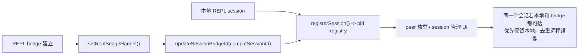

# 13 后台会话与并发托管

到第 11 章和第 12 章为止，我们已经讲清了两件事：

1. 机器怎样被注册成一个可远程调度的 environment
2. 远程 session 怎样被本地 REPL 接管和显示

但 Claude Code 之所以像一个“系统”，还因为它不只会处理前台这一个终端窗口。

它还支持另一类能力：

- 后台会话持续运行
- `claude ps` / `attach` / `kill` 这类管理命令
- 多个本地 session 并存时的并发可见性
- 远程 bridge session 与本地 session 的去重识别

从产品角度看，这回答的是：

**为什么 Claude Code 不只是“一次打开、一次结束”的命令行，而是一个可被托管、可被观察、可再次接入的会话运行时。**

从源码角度看，这一章聚焦的问题是：

**Claude Code 如何用一套本地 session 注册表，把 interactive / bg / daemon / bridge 这些运行形态统一纳入“可观测、可管理、可恢复”的并发模型？**

## 1. 本章要解决什么问题

很多人看到 `claude ps`、`claude attach`、`claude --bg` 时，会把它们理解成：

> “无非是多加了几个命令，把 tmux 和 pid 包一层。”

这还是低估了它。

结合 `entrypoints/cli.tsx`、`main.tsx`、`utils/concurrentSessions.ts`、`screens/REPL.tsx`、`commands/exit/exit.tsx`、`query.ts` 一起看，后台会话与并发托管至少有六个核心问题要解决：

1. **哪些进程算一个可管理 session。**
   - 不是所有子进程都应暴露给用户，尤其不能把 subagent 噪声都算进去。
2. **会话元数据存放在哪里。**
   - 需要一个稳定的、本地可枚举的注册表。
3. **会话当前在忙什么，如何持续刷新。**
   - 仅靠 pid 存活与否，不足以支撑 `claude ps` 的产品体验。
4. **后台会话退出时是 detach 还是 kill。**
   - 背景 session 的“退出”语义和前台 REPL 不一样。
5. **本地 session 与 bridge session 如何避免重复显示。**
   - 同一个会话可能同时有本地通道和远程通道。
6. **多会话并存时，系统怎样知道自己正处于并发使用场景。**
   - 这会影响统计、提示、乃至后续调度策略。

所以这一章的核心认知是：

**后台会话系统的关键不是“把进程放后台”，而是“给会话建立一层长期存在的托管与观测面”。**

## 2. 先看业务流程图

先看后台会话的总体托管链路：

```mermaid
flowchart TB
  A["CLI fast path\nentrypoints/cli.tsx"] --> B{"daemon / ps / attach / kill / --bg ?"}
  B -->|是| C["进入专门会话管理路径"]
  B -->|否| D["普通 REPL 启动"]

  D --> E["main.tsx -> registerSession()"]
  E --> F["~/.claude/sessions/<pid>.json"]
  F --> G["记录 pid / sessionId / cwd / kind / entrypoint / name"]

  G --> H["countConcurrentSessions()"]
  H --> I["并发 telemetry / 多开可见性"]

  D --> J["REPL.tsx 计算 sessionStatus"]
  J --> K["updateSessionActivity(status, waitingFor)"]
  K --> F

  D --> L["query.ts 周期生成 task summary"]
  L --> M["session transcript 追加 task-summary"]
  M --> N["`claude ps` 读取更像业务状态的摘要"]

  D --> O["commands/exit/exit.tsx"]
  O --> P{"bg session ?"}
  P -->|是| Q["tmux detach-client"]
  P -->|否| R["gracefulShutdown()"]
```

这张图想表达的是：

> **Claude Code 用“pid 文件 + transcript 摘要”两层信息，组合出会话托管能力。**

再看“本地 session 与远程 bridge 如何去重”的补充图：



这说明后台托管系统并不只服务本地进程列表，它还承担了**跨接入通道的身份对齐**。

## 3. 源码入口

这一章建议先抓这些文件：

- `restored-src/src/entrypoints/cli.tsx`
  - 后台会话相关 fast path 的总入口。
- `restored-src/src/main.tsx`
  - 普通 REPL 启动后何时注册 session、何时统计并发。
- `restored-src/src/utils/concurrentSessions.ts`
  - 本地 session 注册表核心实现。
- `restored-src/src/screens/REPL.tsx`
  - REPL 运行期如何把 busy / idle / waiting 状态持续写回。
- `restored-src/src/commands/exit/exit.tsx`
  - 背景 session 的退出语义。
- `restored-src/src/bridge/replBridgeHandle.ts`
  - 本地 session 如何补记自己的 bridge session ID。
- `restored-src/src/query.ts`
  - 长回合执行中如何周期性生成 task summary。
- `restored-src/src/utils/sessionStorage.ts`
  - `task-summary` 如何写进 transcript。
- `restored-src/src/types/logs.ts`
  - `task-summary`、worktree state 等运行时日志类型定义。

有一个边界要先说明：

这份还原源码里，`entrypoints/cli.tsx` 明确会动态导入后台管理模块，但对应的 `bg` 实现文件没有完整落在当前还原包中。所以本章会围绕**已经可验证的入口、注册表、状态写回和退出语义**来分析，而不会臆造不存在的 handler 细节。

## 4. 主调用链拆解

### 4.1 `cli.tsx` 明确把后台会话管理做成 fast path

`restored-src/src/entrypoints/cli.tsx` 里除了 Bridge fast path 外，还有两条和本章直接相关的分流：

1. `claude daemon [subcommand]`
2. `claude ps|logs|attach|kill` 以及 `--bg` / `--background`

这段代码说明一个非常重要的产品定位：

**后台会话管理不是 REPL 内部的一个附属命令，而是 CLI 顶层运行模式的一部分。**

这意味着：

- 会话管理命令可以在不启动完整 REPL 的情况下工作
- 会话 registry 是 CLI 级能力，不依赖某个 React 组件是否挂载
- daemon / bg / foreground session 从一开始就被当成同一套“进程治理模型”看待

### 4.2 `main.tsx` 在 REPL 真正启动后，第一时间登记 session

`restored-src/src/main.tsx` 在初始化流程里有一段非常关键的代码：

```ts
void registerSession().then(registered => {
  ...
  void countConcurrentSessions().then(count => {
    if (count >= 2) {
      logEvent('tengu_concurrent_sessions', ...)
    }
  })
})
```

这里至少表达了三层意思：

1. **只有真正进入 REPL 路径的 session 才登记**
   - 注释明确写了，不是所有子命令都注册。
2. **登记和并发统计是两步**
   - 先写自己的 pid 文件，再统计总数，避免把自己漏掉。
3. **并发不是“顺手看看”，而是产品显式关心的运行信号**
   - `count >= 2` 会触发 telemetry。

这说明 Claude Code 不是把多开当成异常边角，而是把它当成一类被认真建模的使用场景。

### 4.3 `concurrentSessions.ts` 才是后台托管系统的核心底座

`restored-src/src/utils/concurrentSessions.ts` 基本定义了整套本地托管模型。

先看它的关键类型：

- `SessionKind = 'interactive' | 'bg' | 'daemon' | 'daemon-worker'`
- `SessionStatus = 'busy' | 'idle' | 'waiting'`

这个枚举非常重要，因为它说明 Claude Code 不是只追踪“有没有这个进程”，而是同时追踪：

1. 这是什么类型的会话
2. 它当前处于什么工作状态

而 `registerSession()` 会把这些信息写进：

```text
~/.claude/sessions/<pid>.json
```

文件内容里至少会包含：

- `pid`
- `sessionId`
- `cwd`
- `startedAt`
- `kind`
- `entrypoint`
- 可选的 `name`
- 可选的 `logPath`
- 可选的 `agent`

这其实就是一个**本地 session 注册表**。

### 4.4 为什么要用 pid 文件，而不是内存单例

这里的答案很直接，但值得你提炼：

1. CLI 进程可能很多个
2. 它们彼此不共享内存
3. `ps` / `attach` / `kill` 这种管理命令需要脱离原始进程独立运行

所以会话状态必须落到一个：

- 可枚举
- 可跨进程读取
- 进程退出后可清理

的地方。

`concurrentSessions.ts` 还做了两件很稳的事情：

1. 启动时注册 cleanup，进程退出自动删 pid 文件
2. 枚举时清扫 stale pid 文件

也就是说，这套 registry 不是“只写不管”，而是带生命周期清理的。

### 4.5 不是所有进程都注册，subagent 被刻意排除了

`registerSession()` 一开始就做了：

```ts
if (getAgentId() != null) return false
```

这行非常关键。

它明确避免把 teammate / subagent 这类派生执行体都混进 session 注册表里。

原因也很合理：

- 用户真正关心的是“自己开了几个 Claude 会话”
- 而不是某一轮 swarm 临时派生了多少个内部 worker

这是一条很值得学习的建模边界：

> **并发治理系统应该暴露“用户级会话”，而不是“所有技术上存在的执行单元”。**

### 4.6 `envSessionKind()` 让 spawn 出来的子会话能自报身份

`concurrentSessions.ts` 里 `envSessionKind()` 会读取：

```ts
process.env.CLAUDE_CODE_SESSION_KIND
```

并映射成：

- `bg`
- `daemon`
- `daemon-worker`

这个设计的好处在于：

**父进程不需要替子进程代写注册表，子进程自己就能以正确 kind 完成登记。**

这样 cleanup 也能自然绑定在子进程自身生命周期上。

这类设计比“父进程集中管理所有子进程元数据”更稳，因为：

- 谁活着，谁负责续写状态
- 谁退出，谁负责清理自己的注册记录

### 4.7 `REPL.tsx` 持续把 live 状态推回 registry，而不是只在启动时登记一次

如果只有 `registerSession()`，系统最多知道：

- 这个 session 存在
- 它属于哪一类

但用户还需要知道它现在是不是正在忙。

`restored-src/src/screens/REPL.tsx` 会计算：

- `busy`
- `idle`
- `waiting`

并把 `waitingFor` 一起写回：

```ts
void updateSessionActivity({ status: sessionStatus, waitingFor })
```

这里 `waitingFor` 可能是：

- approve 某个 tool
- worker request
- sandbox request
- dialog open
- input needed

这就把纯技术状态提升成了**用户能理解的会话状态**。

所以 `claude ps` 这类视图不是只能显示“PID 12345 活着”，而是能更接近地回答：

> 这个 Claude 现在在忙，还是在等你批准，还是已经空闲。

### 4.8 `query.ts` 和 transcript 进一步补足“它到底在忙什么”

仅有 `busy / idle / waiting` 还不够。

一个长回合 agent 可能连续跑很多步，如果只显示最后一条用户输入，信息量很低。

所以 `restored-src/src/query.ts` 会在回合推进过程中周期性生成 task summary，而
`restored-src/src/utils/sessionStorage.ts` 会把它以：

```ts
type: 'task-summary'
```

写进 transcript。

`restored-src/src/types/logs.ts` 对它的定义也写得很清楚：

> 为了让 `claude ps` 展示比最后一句用户 prompt 更有意义的当前工作摘要。

这个设计很值得你反复体会，因为它不是“日志顺手多打一条”，而是明确为了**管理面可读性**服务。

也就是说，Claude Code 的 transcript 不只是历史回放文件，它还是后台会话观测面的数据源之一。

### 4.9 背景 session 的退出语义是 detach，不是 shutdown

`restored-src/src/commands/exit/exit.tsx` 和 `REPL.tsx` 的 `handleExit()` 都明确处理了 bg session：

- 如果是 `claude --bg` 启动的 tmux session
- `/exit`、`/quit`、`ctrl+c`、`ctrl+d`
- 都优先 `tmux detach-client`

而不是直接 `gracefulShutdown()`

这代表后台会话的设计目标根本不是“隐藏运行中的前台 REPL”，而是：

> **把会话和当前 attached client 解耦。**

只要这个语义一成立，后面很多功能就顺理成章：

- `attach`
- 后台持续执行
- 多终端重新接入

### 4.10 `bridgeSessionId` 的写回，说明 session registry 还承担身份去重职责

`restored-src/src/bridge/replBridgeHandle.ts` 在 `setReplBridgeHandle()` 里会调用：

```ts
updateSessionBridgeId(getSelfBridgeCompatId() ?? null)
```

它的注释写得很明确：

- 如果一个 session 同时可以通过本地 UDS 和 bridge 访问
- peer 枚举时应该优先保留本地
- 远程镜像需要被 dedup 掉

这说明 `~/.claude/sessions/*.json` 并不只是本地 pid 清单，它还承担了**本地身份与远程身份的对齐索引**。

这是一种很高级的设计信号：

**会话注册表不仅描述“我是谁”，还描述“我在别的通道里对应谁”。**

### 4.11 `countConcurrentSessions()` 的实现非常保守，重点是“不误删、不误算”

这个函数的细节也很值得看。

它做了两件非常克制的事情：

1. 只认严格的 `<pid>.json` 文件名
   - 防止误删用户自己的其他文件
2. 在 WSL 下不主动清理无法探测的 Windows pid 文件
   - 宁可少算，也不冒删活跃 session 的风险

这体现了后台托管代码的一条重要原则：

> **管理面代码一旦误判，破坏性通常比主流程 bug 更大。**

所以它宁可保守，也不做激进清扫。

## 5. 关键设计意图

把本章源码串起来后，我觉得最值得提炼的设计意图有五条。

### 5.1 用本地注册表统一不同运行形态

不管是：

- interactive
- bg
- daemon
- daemon-worker

都尽量投影到同一份 session registry 里。

这样 CLI 才能用统一方式做：

- 枚举
- attach
- kill
- 并发检测

### 5.2 只暴露“用户级会话”，不暴露所有内部执行体

subagent 被排除在 `registerSession()` 之外，就是很明确的信号。

用户需要的是管理会话，不是调试运行时实现细节。

### 5.3 用“状态快照 + transcript 摘要”组合观测面

pid 文件解决：

- 这个 session 是否存在
- 当前是 busy / idle / waiting

transcript 里的 task summary 解决：

- 它到底在忙什么

这比把所有信息都塞进一个 registry 文件更清晰，也更符合各自的职责边界。

### 5.4 后台模式的核心是 detachable，而不是 hidden

bg session 真正重要的不是“在后台跑”，而是：

- 当前客户端可以离开
- 会话还能继续
- 以后还能 attach 回来

这是会话化系统和普通一次性 CLI 的根本差异。

### 5.5 注册表还要承担跨通道 identity mapping

`bridgeSessionId` 这个字段说明，后台托管系统和远程协同系统不是两张皮。

它们在会话身份层是打通的。

## 6. 从复刻视角看

如果你自己要做一套“本地 agent 会话托管系统”，本章最值得复刻的是下面这套最小抽象。

### 6.1 至少要有一份跨进程可枚举的 session registry

每个 session 至少记录：

- pid
- logical session id
- cwd / project
- kind
- startedAt
- name
- 可选的 remote identity

### 6.2 live 状态不要只靠进程是否存活

最少再补一层：

- busy / idle / waiting
- waitingFor

否则管理面几乎没有可读性。

### 6.3 长任务要补“当前工作摘要”

不然用户看到的永远是：

- 最后一条 prompt
- 或一个模糊的 busy

这对 agent 产品来说远远不够。

### 6.4 detach 语义要从一开始就设计清楚

如果后台会话仍然沿用前台“退出即销毁”的语义，后面的 attach / kill / ps 都会变得很别扭。

### 6.5 源码追踪提示

这一章推荐按“注册表 -> 状态写回 -> 管理命令入口”来追：

1. 先读 `restored-src/src/utils/concurrentSessions.ts`，把 session registry、session kind、session status 的骨架弄清楚。
2. 再看 `restored-src/src/main.tsx`、`restored-src/src/screens/REPL.tsx`、`restored-src/src/query.ts`，确认 session 是怎样被注册、怎样持续写回 busy/idle/task summary 的。
3. 最后回到 `restored-src/src/entrypoints/cli.tsx` 和 `restored-src/src/commands/exit/exit.tsx`，看后台管理入口与 detach 语义如何接到 CLI 上。

## 7. 本章小练习

1. 顺着 `cli.tsx -> main.tsx -> concurrentSessions.ts` 画一张后台会话注册图。
   - 至少标出 `~/.claude/sessions/<pid>.json` 这一层。
2. 顺着 `REPL.tsx -> updateSessionActivity -> sessionStorage.saveTaskSummary` 画一张“管理面状态来源图”。
   - 区分“即时状态”和“任务摘要”。
3. 对照 `exit.tsx`，想一想为什么 bg session 要 detach 而不是 shutdown。
   - 如果这里直接 kill，会破坏哪些产品能力？
4. 想想你自己的 agent 系统是否也需要 `bridgeSessionId` 这类跨通道 identity mapping。

## 8. 本章小结

这一章你应该建立三个稳定认知：

1. **后台会话系统的核心是本地 session registry，而不是某个具体命令。**
2. **Claude Code 用 pid 文件、live 状态和 transcript 摘要组合出可管理的会话托管面。**
3. **本地后台托管和远程协同并不是分裂的两套系统，它们在会话身份层是打通的。**

到这里，Part 3 已经讲清三块基础：

- 第 11 章：环境如何被远程调度
- 第 12 章：远程 session 如何被本地 REPL 接管
- 第 13 章：后台会话如何被本地系统托管、观察和重新接入

接下来继续往下读，就该进入这套系统最像“多代理平台”的部分了：

- 多 agent / teammate / task 如何协同
- 后台任务与前台 REPL 怎样共享状态
- 为什么 Claude Code 的 agent 能既像工具调用，又像长期运行的执行体
