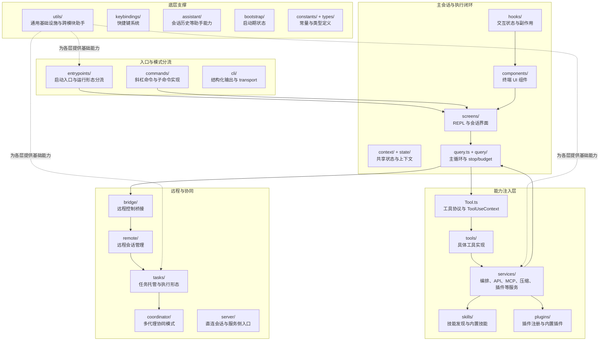
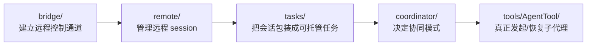

# 90 源码地图：按目录反查系统能力

这篇附录不按“章节主线”讲，而是按“目录 -> 能力 -> 追踪入口”的方式组织，适合你在两种场景下使用：

- 顺读完 Part 1/2/3 后，想把脑中的业务流重新映射回源码目录。
- 在 `restored-src/src` 里看到一个目录名，但暂时不知道它在整个系统里扮演什么角色。

可以把它理解成“目录级地图”，而 [91 核心文件索引](./91-核心文件索引.md) 是“关键锚点文件地图”。两篇配合起来，基本就能完成从目录到文件、再从文件回到业务流的双向定位。

## 1. 这份目录地图怎么用

推荐按下面这个顺序反查：

1. 先判断问题属于哪一层：入口、主循环、工具、扩展、远程协同，还是 UI/状态支撑层。
2. 再定位对应目录：例如入口看 `entrypoints/`，工具执行看 `services/tools/`，远程控制看 `bridge/`。
3. 最后从该目录里的代表文件切进去，再用 `rg` 追引用链。

如果你还不知道问题属于哪一层，可以先看下一节的总图。

## 2. 先看总图：目录如何拼成一个系统



这张图只回答一件事：`restored-src/src` 不是“很多孤立目录的堆叠”，而是围绕“入口分流 -> 会话主循环 -> 工具/服务注入 -> 远程协同扩展”逐层展开的。

## 3. 目录反查总表

| 目录 | 先回答什么问题 | 优先看哪些文件 | 对应书中主线 |
| --- | --- | --- | --- |
| `entrypoints/` | 系统是以什么模式启动的 | `cli.tsx`、`init.ts`、`mcp.ts` | Part 1 / 01、02 |
| `commands/` | 用户输入的命令最终落到哪里 | `init.ts`、`plan/plan.tsx`、`tasks/tasks.tsx`、`plugin/plugin.tsx` | Part 1 / 01，Part 2、3 的交互入口 |
| `screens/` | 主 REPL 与恢复页面如何组织 | `REPL.tsx`、`ResumeConversation.tsx` | Part 1 / 03-06 |
| `components/` | 终端 UI 如何渲染消息、输入、状态 | `App.tsx`、`Messages.tsx`、`PromptInput/PromptInput.tsx` | Part 1 / 03、06 |
| `hooks/` | 复杂交互状态如何被拆开管理 | `usePromptSuggestion.ts`、`useRemoteSession.ts`、`useTasksV2.ts` | Part 1、2、3 的 UI 连接层 |
| `context/` / `state/` | 全局上下文与状态从哪里共享 | 结合具体文件名反查 | Part 1 / 03 |
| `query.ts` + `query/` | 一次请求怎样循环推进直到结束 | `query.ts`、`stopHooks.ts`、`tokenBudget.ts` | Part 1 / 04、06 |
| `tools/` | assistant 发出的 `tool_use` 如何真正执行 | `BashTool/*`、`FileEditTool/*`、`AgentTool/*`、`SkillTool/*` | Part 1 / 05，Part 3 / 14 |
| `services/tools/` | 工具编排、执行、流式结果回填如何落地 | `toolOrchestration.ts`、`toolExecution.ts`、`StreamingToolExecutor.ts` | Part 1 / 05 |
| `services/mcp/` | MCP 服务如何连接、鉴权与管理 | `MCPConnectionManager.tsx`、`client.ts`、`useManageMCPConnections.ts` | Part 2 / 07 |
| `skills/` | Skills 如何被发现并注入 | `bundledSkills.ts`、`loadSkillsDir.ts` | Part 2 / 08 |
| `plugins/` + `services/plugins/` | 插件如何注册、安装、操作 | `builtinPlugins.ts`、`pluginOperations.ts`、`PluginInstallationManager.ts` | Part 2 / 09 |
| `bridge/` | 本机如何被包装成远程可调度环境 | `bridgeMain.ts`、`remoteBridgeCore.ts`、`initReplBridge.ts` | Part 3 / 11 |
| `remote/` | 远程 session 如何接管、同步、恢复 | `RemoteSessionManager.ts`、`SessionsWebSocket.ts` | Part 3 / 12 |
| `tasks/` | 会话/代理/后台任务如何托管 | `LocalMainSessionTask.ts`、`LocalAgentTask.tsx`、`RemoteAgentTask.tsx` | Part 3 / 13、14 |
| `coordinator/` | 多代理协同模式从哪里切入 | `coordinatorMode.ts` | Part 3 / 14 |
| `cli/` | 非 UI 形态下的结构化输出与 transport 在哪 | `structuredIO.ts`、`remoteIO.ts`、`transports/*` | Part 3 / 11、12 |
| `utils/` | 各层共用的基础设施藏在哪里 | `messages.ts`、`hooks/*`、`mcp*`、`task*`、`sandbox*` | 全书横向支撑层 |

## 4. 按业务问题去找目录

### 4.1 我想看“Claude Code 是怎么启动的”

先看：

- `restored-src/src/entrypoints/cli.tsx`
- `restored-src/src/entrypoints/init.ts`
- `restored-src/src/commands/init.ts`

应该带着的问题：

- 哪些路径走 fast-path，哪些路径会进入完整 REPL。
- 哪些初始化是按需加载，哪些是所有模式共用。
- 命令注册和入口模式分流的边界在哪里。

如果你读到 `commands/` 目录，不要把它理解成“和主链路无关的杂项命令”。它本质上是入口层的一部分，只是把不同命令语义拆成多个模块。

### 4.2 我想看“用户一句话之后，系统如何推进”

先看：

- `restored-src/src/query.ts`
- `restored-src/src/query/stopHooks.ts`
- `restored-src/src/query/tokenBudget.ts`
- `restored-src/src/utils/messages.ts`

这是整套系统最重要的“执行引擎层”。只要你在源码里看到 stop、continue、compact、budget、tool result 这些关键词，基本都能回到这里汇总理解。

### 4.3 我想看“工具系统到底是怎么运作的”

先看：

- `restored-src/src/Tool.ts`
- `restored-src/src/services/tools/toolOrchestration.ts`
- `restored-src/src/services/tools/toolExecution.ts`
- `restored-src/src/tools/BashTool/BashTool.tsx`
- `restored-src/src/tools/FileEditTool/FileEditTool.ts`
- `restored-src/src/tools/AgentTool/AgentTool.tsx`

这里建议按“两层”理解：

- `tools/`：每个工具自己的输入、权限、执行逻辑和结果 UI。
- `services/tools/`：跨工具共享的编排策略、执行包装、流式调度。

也就是说，`tools/` 解决“某个工具怎么做”，`services/tools/` 解决“很多工具如何一起被主循环安全调度”。

### 4.4 我想看“扩展能力为什么能插进主链路”

先看：

- `restored-src/src/services/mcp/*`
- `restored-src/src/skills/*`
- `restored-src/src/plugins/*`
- `restored-src/src/services/plugins/*`

这部分最容易读散。正确读法不是逐文件遍历，而是先按扩展类型分三条线：

1. MCP：外部服务如何被连接、鉴权、同步到工具体系。
2. Skills：方法论和固定流程如何被发现、加载、注入上下文。
3. Plugins：第三方扩展如何被安装、启停、纳入生命周期。

### 4.5 我想看“远程控制、后台托管、多代理协同”

先看：

- `restored-src/src/bridge/*`
- `restored-src/src/remote/*`
- `restored-src/src/tasks/*`
- `restored-src/src/coordinator/coordinatorMode.ts`
- `restored-src/src/tools/AgentTool/*`

这部分可用一张图快速记住职责分工：



一个很实用的经验是：

- 想看“连接怎么建立”，优先读 `bridge/`。
- 想看“会话怎么存活与恢复”，优先读 `remote/`。
- 想看“为什么一个执行单元能被后台管理”，优先读 `tasks/`。
- 想看“多个 agent 怎么组织”，优先读 `coordinator/` 和 `tools/AgentTool/`。

## 5. 几个容易被忽略、但经常需要反查的目录

### 5.1 `components/` 不是纯展示层

从文件数量就能看出，`components/` 并不只是“把文本打印到终端”的简单视图层，它还承担了很多交互式状态承载：

- `PromptInput/`：输入框、模式提示、建议、暂存与排队命令。
- `messages/` 相关组件：消息流渲染、结构化 diff、工具状态展示。
- `agents/`、`tasks/`、`teams/`：把协同系统暴露为可操作 UI。

所以当你追一个功能时，如果逻辑似乎“断”在 hook 上，通常下一跳就在 `components/`。

### 5.2 `hooks/` 是“业务胶水层”

`hooks/` 最适合回答的问题不是“有哪些 hook”，而是“某个交互能力是如何被拼进 REPL 的”。例如：

- `useRemoteSession.ts`：把远程会话能力挂进交互层。
- `useTasksV2.ts`：把任务管理能力接到界面。
- `useMergedTools.ts`、`useMergedCommands.ts`：把多来源能力合并成统一可用集合。
- `useSwarmInitialization.ts`：把协同能力接入启动过程。

你可以把 `hooks/` 看成 UI 层和服务层之间的接线板。

### 5.3 `utils/` 是横向基础设施库

这个目录很大，第一次看很容易迷路。最稳妥的分法是按主题看子目录和命名前缀：

- `utils/messages*`：消息结构与映射。
- `utils/hooks/*`：hook 执行与 hook 配置基础设施。
- `utils/mcp*`：MCP 指令、校验、输出存储等横切逻辑。
- `utils/task*`、`utils/swarm*`：任务与协同相关辅助。
- `utils/sandbox*`、`utils/permissions*`：执行边界与权限治理。
- `utils/model/*`：模型配置、别名与能力判断。

一句话记忆：`utils/` 不是一个业务子系统，而是“所有业务子系统都会反复借用的通用工具箱”。

### 5.4 `cli/` 与 `screens/` 的边界

这两个目录容易混：

- `screens/` 更偏“完整交互页面/会话界面”，例如 `REPL.tsx`。
- `cli/` 更偏“结构化输入输出、transport、非传统界面的传输层”，例如 `structuredIO.ts`、`remoteIO.ts`、`transports/WebSocketTransport.ts`。

如果你在看远程接入、SDK/桥接输出或者非标准终端交互，通常要优先查 `cli/`。

## 6. 建议的反查路线

如果你准备系统学习，可以用下面这三条反查路线：

### 路线 A：按主业务流追

`entrypoints/` -> `commands/` -> `screens/REPL.tsx` -> `query.ts` -> `services/tools/` -> `tools/`

适合目标：

- 理解“一次用户请求为什么能闭环完成”。
- 复刻一个最小可用的 agent CLI。

### 路线 B：按扩展系统追

`services/mcp/` -> `skills/` -> `plugins/` + `services/plugins/`

适合目标：

- 理解为什么 Claude Code 能持续接入新能力。
- 设计自己的外部能力扩展接口。

### 路线 C：按远程协同追

`bridge/` -> `remote/` -> `tasks/` -> `coordinator/` -> `tools/AgentTool/`

适合目标：

- 理解 Claude Code 为什么不是单机单会话 REPL。
- 复刻远程接管、后台托管或多代理调度系统。

## 7. 配合 `rg` 的最小检索策略

读这份地图时，推荐直接在仓库里做几类检索：

```bash
rg -n "ToolUseContext|tool_result|tool_use" restored-src/src
rg -n "RemoteSessionManager|SessionsWebSocket|remote" restored-src/src
rg -n "forkSubagent|runAgent|resumeAgent" restored-src/src/tools/AgentTool restored-src/src/tasks restored-src/src/coordinator
rg -n "MCPConnectionManager|useManageMCPConnections|client" restored-src/src/services/mcp
```

这类检索的作用不是“一次找到答案”，而是把目录地图迅速压缩成几条可读调用链。

## 8. 本章小练习

1. 不看正文，只看 `restored-src/src` 目录树，试着把 `entrypoints/`、`query/`、`services/tools/`、`bridge/`、`tasks/` 各自的职责各用一句话说出来。
2. 从 `tools/AgentTool/forkSubagent.ts` 出发，用 `rg` 反查它如何与 `tasks/`、`coordinator/` 关联。
3. 从 `commands/plugin/plugin.tsx` 出发，反查它如何最终落到 `services/plugins/`。

## 9. 本章小结

这篇附录的核心价值，是把 `restored-src/src` 从“目录列表”翻译成“能力地图”：

- `entrypoints/`、`commands/`、`screens/` 决定系统如何进入工作状态。
- `query.ts`、`tools/`、`services/tools/` 决定系统如何推进一次请求。
- `services/mcp/`、`skills/`、`plugins/` 决定系统如何扩展能力。
- `bridge/`、`remote/`、`tasks/`、`coordinator/` 决定系统如何跨进程、跨终端、跨代理协同。
- `components/`、`hooks/`、`utils/` 则把这些能力稳定地接到交互层与基础设施层。

下一篇 [91 核心文件索引](./91-核心文件索引.md) 会进一步把这张“目录级地图”压缩成“关键文件锚点”，适合你在定位到目录之后继续往文件级深挖。
