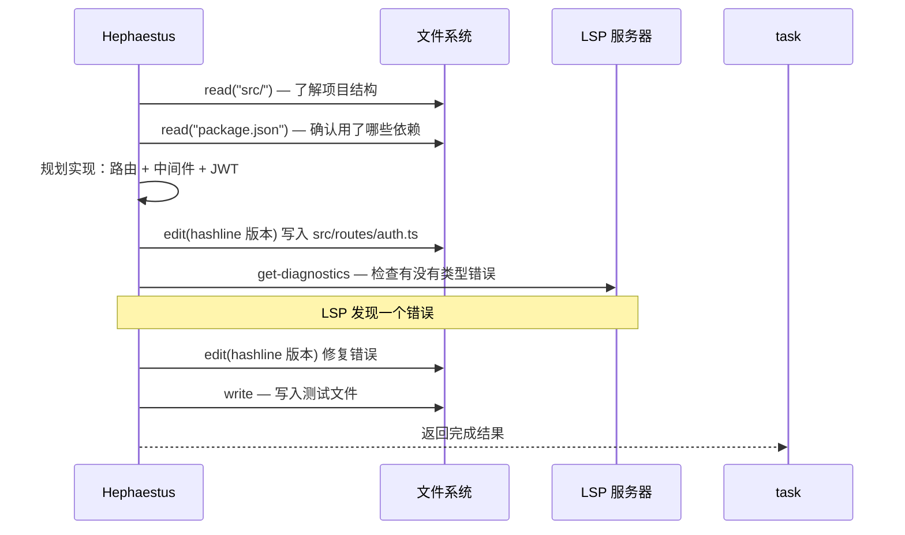
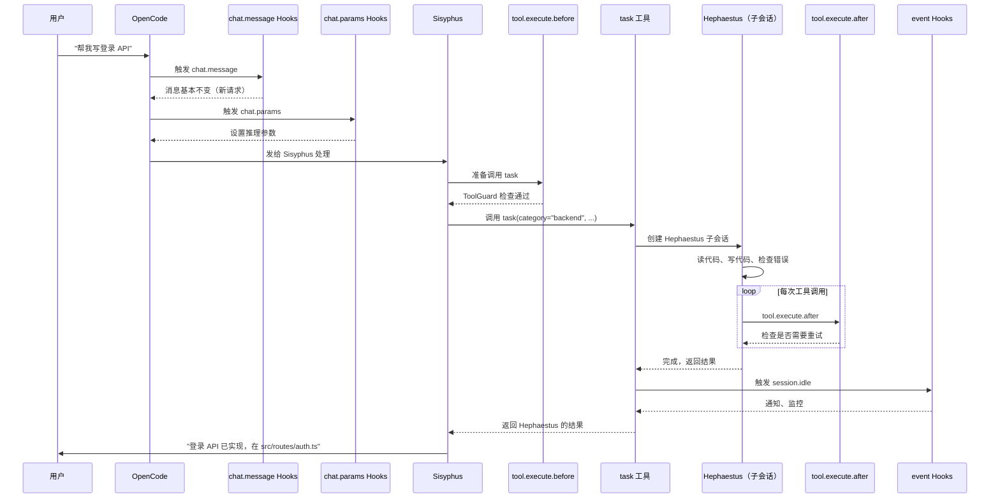

<ChapterLearningGuide />

<script setup>
import SourceSnapshotCard from '../../.vitepress/theme/components/SourceSnapshotCard.vue'
</script>

## 用一个具体请求来贯穿全文

用户输入：

> 帮我写一个 Express.js 的登录 API，接收 email 和 password，验证后返回 JWT token。

我们就跟着这条消息，从头走到尾。

---

## 第一站：chat.message Hook

用户按下回车，OpenCode 收到消息后，**第一个调用的**是插件的 `chat.message` 方法。

对应代码：`src/plugin/chat-message.ts` 的 `createChatMessageHandler`。

这里会依次触发若干个 Hook，每个 Hook 都有机会修改这条消息或注入额外内容：

```
用户消息进来
  │
  ├── [Hook] nonInteractiveEnv
  │     → 如果是 `run` 命令（非交互式），调整行为
  │     → 普通对话：跳过
  │
  ├── [Hook] sisyphusJuniorNotepad
  │     → 如果当前 Agent 是 Sisyphus-Junior，注入记事本上下文
  │     → 普通对话：跳过
  │
  ├── [Hook] agentUsageReminder
  │     → 检查是否该提醒用户"你可以用 /delegate 等命令"
  │     → 一般每隔几次对话才触发一次
  │
  ├── [Hook] taskResumeInfo
  │     → 如果这是一个"恢复中的任务"，注入任务上下文
  │     → 新会话：跳过
  │
  └── [Hook] startWork
        → 检查消息是否是 `/start-work` 命令
        → 普通消息：跳过
```

**这条请求经过 chat.message 后，基本没有变化。**（因为这是一条普通的新请求）

---

## 第二站：chat.params Hook

在消息发给 LLM 之前，OpenCode 调用 `chat.params` 来确认模型参数。

```
确认参数阶段
  │
  ├── [Hook] anthropicEffort
  │     → 检查配置中的 reasoningEffort 设置
  │     → 根据模型类型调整 thinking budget
  │
  └── [Hook] thinkMode（如果开启了扩展思考）
        → 调整 thinking 参数
```

**假设当前用的是 Sisyphus（Claude Opus 4.6）**，这里会设置好推理参数，然后把消息发给 LLM。

---

## 第三站：Sisyphus 收到消息，决定怎么处理

Sisyphus 是主编排器。它收到消息后，根据提示词里的委托表做判断：

> "这是一个编码任务。根据委托表：复杂编码任务 → Hephaestus。"

Sisyphus 决定调用任务委托工具，把这个任务交给更适合的执行者。

```
Sisyphus 思考过程（简化）：
  1. 分析请求：写 Express.js 登录 API
  2. 判断类型：编码任务，需要深度工作
  3. 查委托表：这是编码任务，适合走 task(category=...) 这条委托链
  4. 需要专门编码能力时，再由下游执行器接管
```

---

## 第四站：tool.execute.before Hook

Sisyphus 决定调用 `task` 工具，但在真正执行之前，`tool.execute.before` 会先运行：

```
tool.execute.before 阶段
  │
  ├── [Hook] ToolGuard
  │     → 检查当前 Agent（Sisyphus）是否有权限调用 task
  │     → Sisyphus 没有命中工具限制，通过
  │
  └── [Hook] prometheusMdOnly（如果当前是 Prometheus）
        → 限制 Prometheus 只能写 .md 文件
        → 当前是 Sisyphus：跳过
```

检查通过，`task` 工具正式执行。

---

## 第五站：task 工具执行

`task` 工具收到的参数更接近下面这种形式：

```json
{
  "category": "backend",
  "description": "实现登录 API",
  "prompt": "Implement an Express login API. Accept email and password, validate the user, and return a JWT token.",
  "load_skills": [],
  "run_in_background": false
}
```

工具做了什么：

```
task 执行过程：
  1. 读取 category 或 subagent_type，决定走哪条委托路径
  2. 如果是 category，通常会交给 Sisyphus-Junior / 下游执行链继续分派
  3. 解析模型：gpt-5.3-codex medium（或配置覆盖）
  4. 通过 OpenCode HTTP API 创建子会话
  5. 子会话启动后，Hephaestus 收到任务描述开始工作
  6. run_in_background=false：等待子会话完成
```

---

## 第六站：Hephaestus 开始工作

Hephaestus 在独立的子会话里收到了任务。它的工作流程：



**注意 hashline-edit 的使用**：这里说的“hashline-edit”指的是源码实现思路。真正运行时，Hephaestus 看到的常常还是 `edit`，只是这个 `edit` 在开启 `hashline_edit` 后会使用更稳的哈希锚点方式。

---

## 第七站：tool.execute.after Hook

每次 Hephaestus 调用一个工具之后，`tool.execute.after` 都会运行：

```
tool.execute.after（每次工具调用后）
  │
  ├── [Hook] editErrorRecovery
  │     → 检查工具调用是否是文件编辑，且是否失败
  │     → 如果 hashline-edit 失败：重新读文件，触发重试
  │     → 成功：跳过
  │
  └── [Hook] delegateTaskRetry
        → 检查工具调用是否是 task，且是否失败
        → 如果委托失败（子会话崩溃）：重试一次
        → 成功：跳过
```

---

## 第八站：子会话结束，event Hook 触发

Hephaestus 的子会话完成工作后，OpenCode 触发 `session.idle` 事件：

```
event 阶段（session.idle）
  │
  ├── [Hook] contextWindowMonitor
  │     → 记录本次会话的上下文使用量
  │
  ├── [Hook] sessionNotification
  │     → 如果启用了通知，发送桌面通知："Hephaestus 完成了任务"
  │
  └── [Hook] preemptiveCompaction
        → 检查上下文使用率，如果超过阈值，触发压缩
```

---

## 第九站：Sisyphus 收到结果，继续

`task`（`run_in_background=false`）返回了 Hephaestus 的结果。Sisyphus 看到代码已经写好了。

它可能还会做：

```
Sisyphus 后续处理：
  1. 读取 Hephaestus 写的代码确认没问题
  2. （可选）委托 Momus 做 Code Review
  3. 给用户总结："登录 API 已实现，文件在 src/routes/auth.ts"
```

---

## 第十站：消息返回给用户

最终用户看到 Sisyphus 的总结回复。整个流程结束。

---

## 把链路画成一张图



---

## 哪里出问题，去哪里找

学完这条链路，调试就有了方向：

| 现象 | 最可能的位置 |
|------|------------|
| 消息发出去，什么反应都没有 | `src/plugin/chat-message.ts`，某个 Hook 提前 return 了 |
| Sisyphus 没有委托任务，自己硬做 | `src/agents/sisyphus/` 的指令，委托条件没触发 |
| 工具调用报权限错误 | `src/plugin/hooks/create-tool-guard-hooks.ts`，ToolGuard 配置 |
| 文件编辑总是失败 | `src/hooks/edit-error-recovery/`，重试逻辑；或者开启 `hashline_edit: true` |
| 子 Agent 完成后没有通知 | 检查 `disabled_hooks` 是否禁掉了 `session-notification` |
| API 报错后任务中断 | 开启 `runtime_fallback: true` |

---

---

**上一章** ← [第22章：工具扩展系统](/19-tool-extension/)

**下一章** → [第24章：实战案例与最佳实践](/20-best-practices/)

链路看懂了，下一章动手——四个完整案例：添加新 Agent、新工具、新 Hook、写测试。

---

<SourceSnapshotCard
  title="端到端链路核心源码"
  description="一条消息的完整路径：chat.message 入口 → ToolGuard 权限 → task 委托 → editErrorRecovery 重试 → event 事件处理。"
  repo="code-yeongyu/oh-my-openagent"
  repo-url="https://github.com/code-yeongyu/oh-my-openagent/tree/d80833896cc61fcb59f8955ddc3533982a6bb830"
  branch="dev"
  commit="d80833896cc61fcb59f8955ddc3533982a6bb830"
  verified-at="2026-03-17"
  :entries="[
    { label: 'chat.message 处理入口', path: 'src/plugin/chat-message.ts', href: 'https://github.com/code-yeongyu/oh-my-openagent/blob/d80833896cc61fcb59f8955ddc3533982a6bb830/src/plugin/chat-message.ts' },
    { label: '事件处理入口', path: 'src/plugin/event.ts', href: 'https://github.com/code-yeongyu/oh-my-openagent/blob/d80833896cc61fcb59f8955ddc3533982a6bb830/src/plugin/event.ts' },
    { label: 'ToolGuard 工具守卫', path: 'src/plugin/hooks/create-tool-guard-hooks.ts', href: 'https://github.com/code-yeongyu/oh-my-openagent/blob/d80833896cc61fcb59f8955ddc3533982a6bb830/src/plugin/hooks/create-tool-guard-hooks.ts' },
    { label: 'task 工具源码目录', path: 'src/tools/delegate-task/', href: 'https://github.com/code-yeongyu/oh-my-openagent/tree/d80833896cc61fcb59f8955ddc3533982a6bb830/src/tools/delegate-task' },
    { label: 'editErrorRecovery Hook', path: 'src/hooks/edit-error-recovery/', href: 'https://github.com/code-yeongyu/oh-my-openagent/tree/d80833896cc61fcb59f8955ddc3533982a6bb830/src/hooks/edit-error-recovery' },
    { label: '会话事件 Hook', path: 'src/plugin/hooks/create-session-hooks.ts', href: 'https://github.com/code-yeongyu/oh-my-openagent/blob/d80833896cc61fcb59f8955ddc3533982a6bb830/src/plugin/hooks/create-session-hooks.ts' },
  ]"
/>
