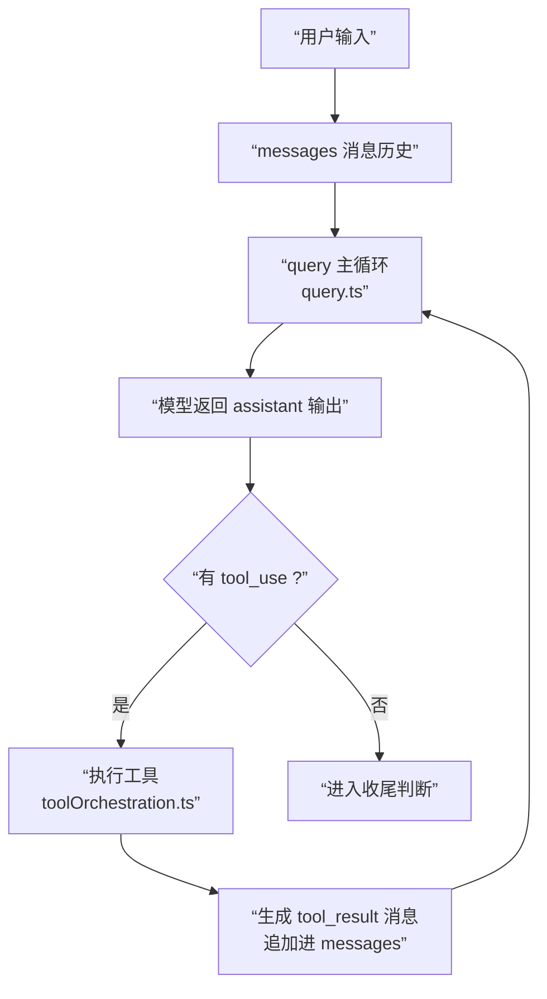

# 03 会话上下文与消息模型

上一章我们把 `init.ts` 视为”昂贵初始化边界”：它把网络、环境变量、遥测、清理器等基础设施准备好，确保系统能安全地进入主会话。

这一章回答 Part 1 的下一个关键问题：**当主会话真的开始跑起来时，Claude Code 用什么”上下文容器”把能力与状态装进主循环？又用什么”消息模型”把多轮对话与工具回填稳定地串成闭环？**

## 概念前置（Agent 入门看这里）

想象你和 AI 聊了 10 句话，AI 要回复第 11 句——它需要”记得”前 10 句说了什么。这就是**消息历史**（`messages`）的作用：把所有对话按顺序存下来，每次调用模型时把整段历史都发过去。

但 Agent 里多了一个环节：**工具调用结果也必须写进消息历史**。

为什么？因为模型不记得”上一轮调了什么工具”——它只认识”消息”。工具执行完之后，结果必须以一条 `tool_result` 消息追加进历史，模型下一轮才能”看见”它。

除了消息历史，还有一个东西要了解：**`ToolUseContext`**，可以把它理解成 Agent 的”背包”——装着工具列表、权限状态、取消信号等运行时需要的一切。消息历史决定”模型知道什么”，`ToolUseContext` 决定”系统能做什么”，两者一起才是每一轮推进的完整工作台。

> **源码对应**：`restored-src/src/Tool.ts` 定义了 `ToolUseContext`；`restored-src/src/utils/messages.ts` 定义了消息类型和消息工厂函数。

## 1. 本章要解决什么问题

如果你把 Claude Code 想象成“把用户输入丢给模型，模型回一段文本”，你会马上遇到两类现实困难：

1. **工具调用不是旁路，而是主链路的一部分。** assistant 不是“顺便”调用工具，而是把 `tool_use` 作为输出的一部分交付给客户端；客户端必须把执行结果以 `tool_result` 的形式回填到同一条会话历史里。
2. **一次用户输入可能触发多轮迭代。** 在 `query.ts` 里，`messages` 会在循环中不断增长：assistant 消息、工具结果、附件消息（例如 file edits、queued commands）都可能被追加，形成下一轮的上下文。

因此本章聚焦两项核心抽象：

- `ToolUseContext`：主循环的“会话上下文容器”，承载工具、权限、状态读写、取消信号、以及会话级能力（MCP、UI、通知等）。
- `Message` / `UserMessage` / `AssistantMessage`：主循环的“消息模型”，不仅要能表达对话文本，还要能表达 `tool_use` / `tool_result` 以及多种“只在本地生效”的辅助信息，并在发送到 API 前经过规范化（例如合并连续 user 消息、剔除 UI-only 消息）。

## 2. 先看上下文流转图

这张图只画最核心的闭环：用户消息进入 → 调用模型 → 有工具就执行并回填 → 没工具就收尾。



读图要点：

- **`tool_use` 是 assistant 输出的一部分**，消息模型必须能表达它。
- **`tool_result` 是 user 侧的一条消息**（带 `tool_use_id`），必须追加进历史，模型下一轮才能”看到”结果。
- **`ToolUseContext` 贯穿整个循环**，每轮都会把当前消息窗口同步进去，确保工具、权限、hook 看到的是同一份上下文。

## 3. 源码入口

本章主要锚定下列入口（按“闭环形成”所需的最小集合）：

- `restored-src/src/query.ts`：`query()` / `queryLoop()` 的多轮推进，如何累积 `Message[]`、识别 `tool_use`、执行工具并在下一轮回填 `tool_result`。
- `restored-src/src/Tool.ts`：`ToolUseContext` 与 `ToolResult` 的定义，说明“上下文容器”如何把工具编排所需的依赖与状态统一起来。
- `restored-src/src/services/tools/toolOrchestration.ts`：`runTools()` 如何按并发安全性分批执行工具，并在执行过程中逐步产出消息更新。
- `restored-src/src/services/tools/toolExecution.ts`：单个工具调用如何被包装成 `tool_result` 形式的 `UserMessage`，以及错误/取消等路径如何仍然生成可回填的结果消息。
- `restored-src/src/utils/messages.ts`：`createUserMessage()` / `createAssistantMessage()` / `normalizeMessagesForAPI()`，展示消息模型如何兼容“本地 UI 消息”和“发往 API 的标准消息”之间的边界。

## 4. 主调用链拆解

这一节按 `query.ts` 的业务推进顺序拆解，重点解释：**为什么 `ToolUseContext` 不只是工具列表**，以及**为什么消息模型必须服务于多轮循环和工具回填**。

### 4.1 `query()` 的输入：把“对话历史 + 上下文容器”一并交给主循环

`query()` 的参数里最关键的几项是：

- `messages: Message[]`：会话历史（不只 user/assistant，还包含 progress/system/attachment 等本地形态）。
- `systemPrompt / userContext / systemContext`：系统提示与补充上下文（它们会参与“拼装发往 API 的请求”）。
- `toolUseContext: ToolUseContext`：工具执行与会话能力所需的上下文容器。

在 `queryLoop()` 内部，会把这些不可变参数装进一个可变的 loop state（`State`），每轮都可能把新消息追加进 `messages`，并带着增长后的历史进入下一轮。

这里先建立一个更收敛的判断标准：**对“会话历史型信息”来说，如果它需要被模型在下一轮感知（例如上一轮 assistant 的输出、工具执行结果、需要延续的约束），就必须以 `messages` 或 system/user/systemContext 的形式进入下一轮。**但也要注意：影响下一轮行为的不只有历史内容本身，工具集合、请求侧配置/元数据等同样会改变下一次调用，却不必然以消息形态落在 `messages/context` 里。

### 4.2 `ToolUseContext`：不是“工具列表”，而是“主循环的会话级运行时”

从 `restored-src/src/Tool.ts` 可以直接看到，`ToolUseContext` 远不止 `options.tools`：

1. **它携带“可变状态与读写入口”。**
   - `getAppState()/setAppState()`：工具执行过程中可能需要读写全局/会话状态（权限模式、MCP 动态连接状态、UI 状态等）。
   - `setInProgressToolUseIDs(...)`：UI 与调度需要知道哪些工具还在跑。
2. **它携带“取消与资源边界”。**
   - `abortController`：贯穿 query 与 tool 执行的取消信号；一旦用户中断或系统决定停止，工具必须能被统一终止，并生成对应的 `tool_result`（通常是 `is_error: true` 的取消结果）回填。
   - `readFileState`：文件读取状态缓存，用于附件/记忆注入等机制的去重与边界控制。
3. **它携带“本轮消息视图”。**
   - `messages: Message[]`：`query.ts` 在每轮开始会写回 `toolUseContext.messages = messagesForQuery`，目的是让工具权限判断、hook、以及“工具 schema 是否已发送”等逻辑能基于同一份历史做决策（见 `toolExecution.ts` 的 `buildSchemaNotSentHint(...)` 会读取 `toolUseContext.messages`）。
4. **它携带“会话能力的动态性”。**
   - 例如 `refreshTools?: () => Tools`：当 MCP server 在会话中途连接成功，下一轮 `query` 可以刷新 `options.tools`，让模型在后续轮次看到新工具。

把这些放在一个上下文对象里，而不是散落在全局单例或函数参数里，带来两个直接收益：

- **工具执行可以被当作主循环中的“子阶段”**：它拿到同一份 `ToolUseContext`，就自然拥有权限、状态、取消、以及“本轮消息视图”。
- **多轮循环可以安全地携带状态前进**：每一轮都能用“增长后的 messages + 更新后的 context”进入下一轮，而不需要在全局到处同步。

### 4.3 `Message`：一个“对话历史”里为什么要混合多种本地消息形态

在 Claude Code 里，`Message` 并不等价于“发给模型的消息”。它更像一个**会话内的事件流**：既要服务 UI/日志/回放，也要服务 API 调用。

从 `utils/messages.ts` 的 `normalizeMessagesForAPI(messages, tools)` 可以看到一个明确边界：

- **发往 API 的只会是 `(UserMessage | AssistantMessage)[]`**。
- `progress`、多数 `system`、以及部分“合成的 API error 消息”等，会在规范化过程中被过滤掉。
- 附件消息会被重排，以保证它们不会破坏 tool_result 相关的边界（源码里有“先 reorder attachments，再过滤 virtual messages”的步骤）。
- 连续的 user 消息会被合并（注释指出 Bedrock 不支持连续 user message；即便 1P API 支持，客户端也倾向于在边界处合并）。

换句话说：**消息模型必须同时满足两种消费者：本地（UI/回放/调度）与远端（API）。** 这也是为什么你会看到 `isVirtual`、`isMeta`、`origin`、`mcpMeta` 之类字段存在，但它们并不一定会进入模型上下文。

### 4.4 `UserMessage` 与 `AssistantMessage`：围绕 tool loop 的两种关键载体

本章只抓和工具回环强相关的要点：

1. `AssistantMessage` 是 assistant 侧输出的载体。
   - 它的 `message.content` 是一组内容块（blocks）。
   - 其中 **`type: 'tool_use'` 的 block**（带 `id/name/input`）是“客户端必须执行工具”的结构化指令。
2. `UserMessage` 是 user 侧输入的载体，但它也承载 tool result 回填。
   - 工具执行结束后，客户端会构造一个 `UserMessage`，其内容块包含 **`type: 'tool_result'`**，并用 `tool_use_id` 指向对应的 `tool_use`。
   - `createUserMessage(...)` 还允许携带 `toolUseResult`（本地类型的结果快照）与 `sourceToolAssistantUUID`（指向产生该 tool_use 的 assistant 消息），这些字段更偏“本地可观测/可追溯”，并不等同于发给模型的文本。

一个很关键的工程约束也在 `query.ts` 明确写出：

> API 会在某些情况下报错：如果我们把 `tool_result` 消息和普通 user 消息交错（interleave），模型侧会认为 tool trajectory 被破坏。

因此 `query.ts` 里会刻意把“工具执行阶段”产出的 `tool_result` 收拢成 `toolResults`，并在进入下一轮前统一追加到 `messages` 末尾。

### 4.5 `ToolResult<T>`：工具执行不是“返回值”，而是“消息生产器 + 上下文修饰器”

在 `restored-src/src/Tool.ts` 里，工具的 `call(...)` 返回 `Promise<ToolResult<Output>>`，其中几个字段决定了“工具如何影响主循环”：

- `data: T`：工具的结构化输出（本地消费）。
- `newMessages?: ...[]`：工具可以额外产出消息（例如附件、系统提示、额外的 user 侧内容），让这些信息进入会话历史并参与后续轮次。
- `contextModifier?: (context: ToolUseContext) => ToolUseContext`：工具可以修改上下文（但注释强调：只对 **非并发安全** 的工具才会生效），这对应 `toolOrchestration.ts` 的分批策略：并发安全的工具可以同时跑，但上下文变更需要被有序应用。
- `mcpMeta?: ...`：MCP 工具的协议元数据可透传给 SDK 消费者（同样强调“不要发给模型”）。

这背后的设计意图是：**工具执行的“副作用”必须以主循环可理解的方式显式表达出来。** 不是靠工具自己去改全局变量，而是通过：

1. 产出 `tool_result`（让模型知道结果）
2. 产出 `newMessages`（让会话历史承载额外上下文）
3. 产出 `contextModifier`（让上下文变更按规则落地）

### 4.6 `query` loop 如何把 tool use 变成回环：识别、执行、回填、再请求

把 `restored-src/src/query.ts` 的关键片段串起来，你能看到一个非常稳定的循环结构：

1. **每轮开始先对齐上下文视图。**
   - `toolUseContext = { ...toolUseContext, messages: messagesForQuery }`
2. **请求模型并流式接收 assistant 输出。**
   - 每收到一个 `AssistantMessage`，就从 `message.content` 中提取 `tool_use` blocks。
   - 只要出现 `tool_use`，就把 `needsFollowUp` 置为 `true`。
3. **如果出现 tool_use，就进入工具执行阶段。**
   - 调用 `runTools(toolUseBlocks, assistantMessages, canUseTool, toolUseContext)`（或 streaming executor 路径）。
   - `toolExecution.ts` 会把每个工具的结果包装成 `createUserMessage({ content: [{ type: 'tool_result', ... }] })`。
4. **把工具结果与附件统一追加到 messages，进入下一轮 `query`。**
   - `next.messages = [...messagesForQuery, ...assistantMessages, ...toolResults]`
   - 下一轮继续，直到本轮不再需要 follow-up。

这就是为什么本章一直强调“消息模型要服务于回环”：**`tool_result` 不是日志，不是 UI 提示，它是下一轮 `query` 的输入之一。**

## 5. 关键设计意图

把本章抽象成可复用的工程意图，可以归纳为三点：

1. **上下文容器化：让工具编排成为主循环的子阶段。**
   - `ToolUseContext` 把“工具、权限、状态、取消、会话能力”统一成一个对象，使得 `runTools(...)` 不需要到处摸全局单例，也不需要把十几个参数层层下传。
2. **消息事件流化：本地形态与 API 形态分层。**
   - `Message` 允许存在 progress/system/attachment 等本地事件，但通过 `normalizeMessagesForAPI()` 在边界处收敛为 `(UserMessage | AssistantMessage)[]`，既满足 UI/回放，也满足模型 API 的严格约束。
3. **回环显式化：tool_result 作为“下一轮输入”的一等公民。**
   - tool 执行结果以 `tool_result` block 回填到 `UserMessage`，并被追加到历史 `messages`；这保证了模型能在下一轮基于结果继续推理，而不是让客户端“私下记住”结果却不告知模型。

## 6. 从复刻视角看

如果你要复刻一个最小可用的 tool-augmented `query` loop，本章给出的最小抽象可以压缩成两块：

1. `ToolUseContext`（最小版）：
   - `tools`（可查找、可调用）
   - `abortController`（统一取消）
   - `messages`（本轮视图，用于权限/提示/去重等策略）
2. `Message` 模型（最小版）：
   - `UserMessage`：既能承载用户文本，也能承载 `tool_result(tool_use_id, content, is_error)`
   - `AssistantMessage`：能承载 `tool_use(id,name,input)` 与普通文本

一个最小闭环伪代码（只保留关键语义）：

```text
messages = [UserMessage(text)]
loop:
  assistant = callModel(normalize(messages), tools)
  messages += [assistant]
  toolUses = extractToolUses(assistant)
  if toolUses empty: break
  for each toolUse:
    result = callTool(toolUse, context)
    messages += [UserMessage(tool_result(tool_use_id=toolUse.id, content=result))]
```

当你把这个闭环跑通，再逐步加上 Claude Code 的工程化能力（并发、安全权限、附件注入、compact、stop hooks），系统才会“像一个能长期跑的产品”，而不是“能演示的 demo”。

### 6.1 源码追踪提示

这一章最适合用“先抽象、再回文件”的方式读：

1. 先看 `restored-src/src/Tool.ts`，只盯 `ToolUseContext`、`ToolResult`、消息相关类型引用。
2. 再看 `restored-src/src/utils/messages.ts`，重点找 `tool_use`、`tool_result`、`normalize`、`createUserMessage` 这些关键词。
3. 最后回到 `restored-src/src/query.ts`，确认消息模型和上下文模型是怎样在 query loop 里被真正消费的。

## 7. 本章小练习

做一个“可跑的最小回环”练习，目标是验证你是否真的理解了本章的抽象：

1. 设计一个最小 `Message` union：只包含 `UserMessage` 与 `AssistantMessage`，并支持 `tool_use` / `tool_result` 两种块。
2. 写一个 `query` loop：assistant 只要返回 `tool_use` 就执行工具，并把结果回填为 `tool_result` 的 `UserMessage`，直到 assistant 不再请求工具。
3. 画出你自己的上下文流转图（要求与本章图一致：用户消息进入、上下文拼装、assistant 返回、tool 回环）。

## 8. 本章小结

`ToolUseContext` 与消息模型在 Claude Code 里不是“为了类型好看”而存在，而是为了支撑一个现实的主链路：**多轮 `query` 推进 + 工具执行 + `tool_result` 回填**。

理解这一点后，你就能自然地把上一章的初始化边界接到下一章的主循环：初始化准备的是“能跑的运行时”，而本章定义的是“运行时如何携带上下文与消息，稳定地把一次用户输入推进到可收尾的终点”。
