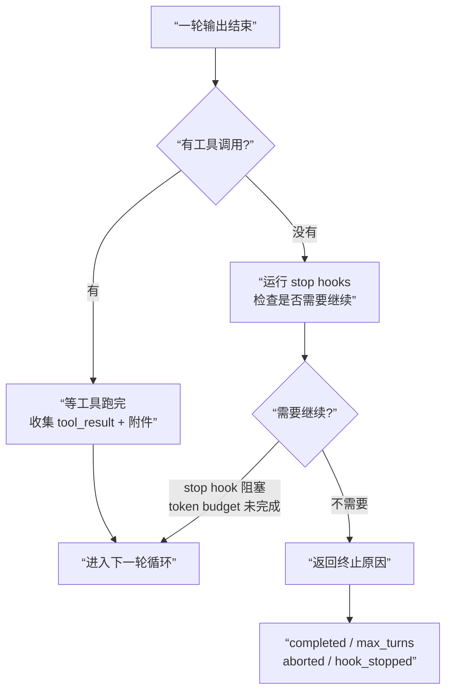

# 06 输出渲染、Stop Hooks、任务摘要、请求收尾

写到这里，Part 1 其实已经完成了主链路里最硬核的两段：

- 第 4 章解释了 `query.ts` 如何把一次用户回合推进成可递归的 query loop；
- 第 5 章解释了 assistant 发出 `tool_use` 之后，工具如何被编排、执行、授权、回填。

但真实系统还差最后一块：

**一次请求什么时候才算真的”结束”？**

## 概念前置（Agent 入门看这里）

直觉上：模型把字说完了，或者工具都跑完了，这一轮就结束了。

**实际上不是。** 在 Claude Code 里，主循环不会”自然结束”——它必须经过一系列判断，才会返回一个明确的”结束原因”。

想象你是这个循环的”裁判”，你要回答这些问题：

- 模型输出被截断了（token 超限）？→ 要不要帮它接着说一轮
- stop hook 说”这个回答不符合规范”？→ 要不要强制再给模型一次修正机会
- token budget 说”你还没真正完成”？→ 要不要继续推一轮
- 工具跑完了，还有没有”附件消息”要补进来？→ 收集完了再说结束

只有这些都判断完，循环才会返回一个明确的结束原因：`completed`、`max_turns`、`aborted`……

**核心认知：Claude Code 的”结束”是判定出来的，不是自然发生的。**

> **源码对应**：主要在 `restored-src/src/query.ts` 的收尾段落，以及 `restored-src/src/query/stopHooks.ts`。

## 1. 本章要解决什么问题

如果你把 Claude Code 想成一个“模型 + 工具”的系统，会天然以为：

> assistant 回复结束了，或者工具跑完了，这轮就收工。

但 `restored-src/src/query.ts` 告诉我们，真实情况要复杂得多。因为主循环最后还要同时处理五类问题：

1. **这轮 assistant 输出是否可直接接受？**
   - prompt too long、media error、max output tokens 都可能触发恢复分支，而不是直接结束。
2. **这轮 assistant 输出是否允许继续？**
   - Stop hooks、TaskCompleted hooks、TeammateIdle hooks 都可能阻止继续。
3. **这轮工具结果是否还要补附件消息？**
   - queued commands、memory prefetch、skill discovery、文件变化等 attachment 都可能继续进入消息流。
4. **这轮是否要主动再开一轮？**
   - token budget continuation、stop hook blocking、tool follow-up 都会造成递归重入。
5. **这一轮最终要返回哪种 terminal reason？**
   - `completed`、`max_turns`、`aborted_tools`、`hook_stopped`、`prompt_too_long` 等结论都不同。

所以这一章的核心认知是：

**Claude Code 的“请求收尾”不是一个 finally 块，而是一段真实的业务状态机。**

## 2. 先看业务流程图

先看无工具和有工具两条收尾路径是怎样在 `query.ts` 里汇合的：



这张图最重要的不是分支数量，而是一个统一事实：

> **Claude Code 的”结束”是被判定出来的，而不是自然发生的。**

## 3. 源码入口

这一章重点读下面几个文件：

- `restored-src/src/query.ts`
  - 真正的收尾总调度：恢复、stop hooks、tool summary、attachment、max turns、下一轮递归。
- `restored-src/src/query/stopHooks.ts`
  - Stop hook、TaskCompleted、TeammateIdle 三类收尾 hook 的统一执行器。
- `restored-src/src/utils/attachments.ts`
  - `getAttachmentMessages(...)` 如何把 queued commands、memory、文件、skill discovery 等补成 attachment。
- `restored-src/src/utils/messages.ts`
  - `createStopHookSummaryMessage(...)`、`createToolUseSummaryMessage(...)`、`createUserInterruptionMessage(...)` 等消息工厂。
- `restored-src/src/services/toolUseSummary/toolUseSummaryGenerator.ts`
  - 工具批次结束后如何异步生成短摘要。
- `restored-src/src/utils/hooks/postSamplingHooks.ts`
  - 模型采样结束后的内部 hook 注册与执行入口。

如果你只想抓主线，我建议按这个顺序：

1. 先看 `query.ts` 中 `if (!needsFollowUp)` 这一大段无工具收尾逻辑。
2. 再看 `query/stopHooks.ts`，理解为什么 stop hooks 不是一个简单回调。
3. 再回到 `query.ts` 的工具后半段，看 `getAttachmentMessages(...)`、`pendingToolUseSummary`、`next_turn`。
4. 最后看 `messages.ts` 和 `toolUseSummaryGenerator.ts`，理解“这些收尾消息到底长什么样”。

## 4. 主调用链拆解

### 4.1 无工具时，`query.ts` 会先问“这次 assistant 输出能不能成立”

当 `needsFollowUp === false` 时，主循环并不会立刻 `return completed`。它先取：

- `lastMessage = assistantMessages.at(-1)`

然后进入一连串恢复判断：

- prompt too long
- media size error
- max output tokens
- API error

这段逻辑特别值得注意，因为 Claude Code 对“失败”的态度不是统一直接报错，而是分级处理：

1. **上下文太长 / 媒体过大**
   - 先尝试 collapse drain 或 reactive compact
   - 只有恢复失败，才 surface error 并返回
2. **输出被 max output tokens 截断**
   - 先尝试把同一请求升级到更大的 token cap
   - 再不行就注入一个 meta recovery message，继续下一轮
3. **最后一条本身是 API error**
   - 跳过 stop hooks，直接返回

这说明 Claude Code 的收尾原则是：

**能恢复的失败，不算最终失败；只有恢复路径走尽了，才进入 terminal。**

### 4.2 `executePostSamplingHooks()` 发生在 stop hooks 之前，而且是“只记账、不阻断”

在 assistant 采样结束后，`query.ts` 会先 fire-and-forget：

```ts
void executePostSamplingHooks(...)
```

`restored-src/src/utils/hooks/postSamplingHooks.ts` 很短，但它的职责很清楚：

- 维护一个内部注册表 `postSamplingHooks[]`
- 在模型采样结束后，构造 `REPLHookContext`
- 依次执行这些 hook
- 出错只记录日志，不阻断主流程

这类 hook 的定位不是“阻止回答继续”，而更像是：

**在一次 assistant 输出刚刚完成时，顺手触发额外后台逻辑。**

所以你可以把收尾阶段的 hook 分成两类：

1. **post-sampling hooks**
   - 观察型、后台型、失败不阻断
2. **stop hooks**
   - 治理型、决策型、可以真正阻塞或中断继续

这两个阶段别混淆，否则会误解收尾链路里的治理边界。

### 4.3 `handleStopHooks()` 不是一个 hook，而是整个“停机检查层”

`restored-src/src/query/stopHooks.ts` 的函数名叫 `handleStopHooks(...)`，但它实际干的事情比“跑 stop hook”大得多。

它至少做了四件事：

1. 组装 `REPLHookContext`
   - 包含 `messages`、`systemPrompt`、`userContext`、`systemContext`、`toolUseContext`、`querySource`
2. 触发一些主线程级后台逻辑
   - 例如保存 cache-safe params、auto-dream、extract memories、prompt suggestion
3. 执行真正的 Stop hooks
   - 收集 progress、blockingError、preventContinuation、hook output
4. 在特定场景下继续执行
   - `TaskCompleted` hooks
   - `TeammateIdle` hooks

所以更准确的说法是：

**`handleStopHooks()` 是 query 收尾阶段的治理汇流排。**

它既承接了 hook 协议，也顺手处理了一些“回合结束时才适合做”的后台任务。

### 4.4 stop hook 的三个结果要分开理解：summary、blocking、preventContinuation

读 `stopHooks.ts` 时，最容易把不同结果混成一种“hook 拒绝”。其实源码分得很细：

1. **summary**
   - 只要运行过 hooks，就会 `yield createStopHookSummaryMessage(...)`
   - 这是系统消息，记录 hook 数量、命令、错误、是否阻止继续、总耗时
2. **blockingErrors**
   - 会被包装成 `createUserMessage({ isMeta: true, ... })`
   - 然后由 `query.ts` 注入到下一轮 `messages`
3. **preventContinuation**
   - 会额外生成 `hook_stopped_continuation` attachment
   - 然后直接返回 `preventContinuation: true`

这三者代表三种完全不同的业务语义：

- summary：发生了什么
- blocking：这轮不能直接结束，要补一轮处理错误
- preventContinuation：这轮到此为止，不准再继续递归

这也是为什么在 `query.ts` 里：

- `blockingErrors.length > 0` 会构造新 `State` 然后 `continue`
- `preventContinuation` 会直接 `return { reason: 'stop_hook_prevented' }`

### 4.5 阻塞错误不是 terminal，而是“强制补一轮”

这点很容易写错，但从 `query.ts` 看得很清楚：

如果 stop hook 产出了 `blockingErrors`，系统不会立刻退出，而是做：

```ts
messages: [
  ...messagesForQuery,
  ...assistantMessages,
  ...stopHookResult.blockingErrors,
]
transition: { reason: 'stop_hook_blocking' }
continue
```

也就是说，blocking error 的语义不是：

> 本轮失败，退出。

而是：

> 本轮 assistant 输出还不算合法，把 hook 反馈加进上下文，再给模型一轮修正机会。

这非常像工具失败后回填 `tool_result` 的思路：

**Claude Code 尽量把“错误”翻译成下一轮模型可理解、可修正的消息，而不是立即打断整个对话。**

### 4.6 工具批次结束后，summary 不会立刻显示，而是挂到“下一轮开头”

第 5 章已经讲过工具阶段结束后会生成 `nextPendingToolUseSummary`，但第 6 章要把它补完整：

`query.ts` 里会在工具批次结束后调用：

```ts
generateToolUseSummary(...)
  .then(summary => createToolUseSummaryMessage(summary, toolUseIds))
```

而这个 Promise 不会阻塞当前回合继续推进。真正显示 summary 的地方，是下一次进入主循环早期时：

```ts
if (pendingToolUseSummary) {
  const summary = await pendingToolUseSummary
  if (summary) yield summary
}
```

这说明 tool use summary 不是“本轮工具 UI 的即时组成部分”，而是：

**跨轮异步补回来的一个轻量摘要事件。**

`restored-src/src/services/toolUseSummary/toolUseSummaryGenerator.ts` 也印证了这一点：

- 它用 Haiku 生成一句非常短的 label
- 目标是移动端单行显示
- 失败不会影响主流程，只是返回 `null`

这背后的设计很务实：

> 摘要有价值，但不值得为了它阻塞主循环。

### 4.7 `getAttachmentMessages()` 说明工具结果之后，系统还会继续“长出消息”

工具阶段完成后，`query.ts` 不会马上进入下一轮，而是还会调用：

```ts
for await (const attachment of getAttachmentMessages(...)) {
  yield attachment
  toolResults.push(attachment)
}
```

`restored-src/src/utils/attachments.ts` 里的 `getAttachmentMessages(...)` 本身很薄，但它背后代表一个重要事实：

**在 Claude Code 里，一轮收尾阶段仍然可能继续生成 attachment message。**

从 `query.ts` 的周边逻辑看，这些 attachment 主要来自：

- queued commands snapshot
- 文件/编辑变更附带消息
- memory prefetch consume
- skill discovery prefetch

这里很重要的一句源码注释是：

> 不要把 `tool_result` 和普通 user message 交错插入，否则 API 会报错。

因此整个顺序被设计成：

1. 先跑完工具
2. 再补 attachment
3. 再统一拼成下一轮 `messages`

这说明收尾阶段不仅在做“判定”，也在做**消息拓扑整理**。

### 4.8 工具后收尾里还有一条隐藏主线：队列命令与后台任务快照

`query.ts` 在 attachment 阶段有一段很像“内部基础设施”的逻辑：

- 先根据 `sleepRan` 和当前线程身份，取 `queuedCommandsSnapshot`
- 再过滤 slash commands 和不同 agent 的命令
- 转成 attachment
- 最后把真正消费掉的命令从队列里移除，并通知 lifecycle

这段逻辑的业务意义是：

**Claude Code 不只是把模型和工具串起来，它还把进程内的异步事件流折叠回了当前回合。**

你可以把它看成一种轻量事件总线：

- 某些后台任务、通知、prompt
- 在恰当时机被消费为 attachment
- 然后作为当前轮上下文的一部分再交还给模型

这也是为什么本章标题里要写“任务摘要”和“请求收尾”，而不只是“stop hooks”。

### 4.9 `maxTurns`、中断、hook stopped 这些都不是异常，而是明确业务终点

收尾阶段还会统一处理一些看起来像“异常”，但其实是明确业务终点的情况：

1. **用户中断**
   - 可能返回 `aborted_streaming` 或 `aborted_tools`
   - 同时可能补 `createUserInterruptionMessage(...)`
2. **hook 明确阻止继续**
   - `hook_stopped` 或 `stop_hook_prevented`
3. **达到最大 turn 限制**
   - `yield max_turns_reached` attachment
   - 返回 `{ reason: 'max_turns' }`
4. **普通自然完成**
   - 返回 `{ reason: 'completed' }`

这很值得借鉴，因为它说明：

**真正成熟的 agent 主循环不会把所有结束都视为“异常退出”，而是会为不同终点定义清晰的 terminal reason。**

### 4.10 最后一轮递归前，`query.ts` 会把“下一轮该看到的一切”一次性封包

如果本轮不是 terminal，`query.ts` 最后会构造新的 `State`：

```ts
const next: State = {
  messages: [...messagesForQuery, ...assistantMessages, ...toolResults],
  toolUseContext: toolUseContextWithQueryTracking,
  autoCompactTracking: tracking,
  turnCount: nextTurnCount,
  pendingToolUseSummary: nextPendingToolUseSummary,
  transition: { reason: 'next_turn' },
}
```

这段代码非常像一个“回合提交”动作。

注意这里被打包进去的东西：

- 本轮真实消息窗口 `messagesForQuery`
- assistant 输出
- 工具结果和各种 attachment
- 更新后的上下文
- 下一轮要补发的 tool summary Promise
- 当前 turnCount 与 tracking

所以可以把它理解成：

**Claude Code 不是在“递归调用 query”，而是在“提交当前回合，再打开下一回合”。**

## 5. 关键设计意图

这一章可以压缩成六条设计意图：

1. **恢复优先于报错。**
   - prompt too long、media、max output tokens 都先走恢复路径。
2. **后台 hook 与治理 hook 分层。**
   - post-sampling 观察，stop hooks 决策。
3. **错误尽量转成可继续推进的消息。**
   - stop hook blocking 会进入下一轮，而不是立刻崩掉。
4. **摘要与附件都是消息流的一部分。**
   - 它们不是 UI 边栏，而是会真实进入主循环上下文。
5. **终点必须显式建模。**
   - `completed`、`max_turns`、`aborted_tools`、`hook_stopped` 语义不同。
6. **下一轮看到的上下文要一次性封包。**
   - 否则递归推进会逐轮失真。

## 6. 从复刻视角看

如果你想自己做一个 Claude Code 风格的 agent 系统，这一章的复刻建议比前两章还重要，因为大多数人都死在“收尾做浅了”。

### 6.1 先把 terminal reason 设计出来

不要只写一个布尔值：

- `done = true`

至少要有一组明确终点：

- completed
- aborted
- max_turns
- blocked_by_hook
- recoverable_retry
- fatal_model_error

这样你的上层 UI、SDK、日志、重试器才有稳定语义。

### 6.2 把“错误反馈”设计成消息，而不是异常

Claude Code 最值得借鉴的一点是：

- 工具失败 -> `tool_result`
- stop hook blocking -> meta user message
- token budget continuation -> meta nudge message

也就是说，很多本可 throw 的情况，它都优先翻译成“模型下一轮能读懂的消息”。

这会让系统更像一个可纠错代理，而不是一个只能成功/失败二选一的脚本。

### 6.3 把附件流作为正式输入源

如果你的系统也有：

- 后台通知
- 文件改动
- 任务状态变化
- 插件产生的额外上下文

不要把它们都做成 UI-only side channel。更稳妥的方式是像 Claude Code 一样：

- 在收尾阶段统一收集
- 转成 attachment message
- 再决定哪些要送进下一轮上下文

### 6.4 摘要要异步化，不能阻塞主回路

tool summary、task summary、away summary 这类信息很有用，但不要让它们堵住 query 主路径。

Claude Code 的做法很值得抄：

- 当前轮只发起 Promise
- 下一轮早期再消费结果
- 失败直接吞掉，不影响主线

这能兼顾体验和吞吐量。

### 6.5 源码追踪提示

这一章建议不要只盯 UI 文件，而要顺着“收尾事件”往回追：

1. 先看 `restored-src/src/query.ts` 里一次回合结束前后的 stop、summary、attachment 处理。
2. 再看 `restored-src/src/query/stopHooks.ts` 与 `restored-src/src/utils/messages.ts`，确认系统是如何把错误、阻断、任务摘要重新翻译成消息的。
3. 最后再去 `restored-src/src/components/` 与 `restored-src/src/screens/REPL.tsx` 看这些收尾信号在交互层如何被渲染出来。

## 7. 本章小练习

建议你做三个源码练习：

1. 顺着 `if (!needsFollowUp)` 手画一张“无工具收尾状态图”。
   - 尤其标出 `prompt too long`、`max output tokens`、`stop_hook_blocking`、`token_budget_continuation` 四条路径。
2. 顺着工具后半段手画一张“tool result 之后还会长出什么消息”的清单。
   - 至少列出 `attachment`、`memory`、`skill discovery`、`tool use summary`。
3. 自己回答一个架构题：
   - 如果你的 agent 也要支持后台任务通知，你会把这些通知放在 UI 层消费，还是转成 query 可见消息？为什么？

## 8. 本章小结

这一章最重要的三句结论是：

1. **Claude Code 的一次请求，不是“assistant 说完”为止，而是“收尾状态机判定完成”为止。**
2. **收尾阶段既负责治理，也负责补消息，还负责决定是否继续下一轮。**
3. **真正稳定的 agent，不只要会启动和执行，更要会把一轮体面地收住。**

到这里，Part 1 的主业务流终于闭环了：

- CLI 启动
- 初始化
- 会话上下文
- query 主循环
- tool 编排执行
- 输出收尾与终止

后面再进入 Part 3 或附录时，你就不再是在看“零散源码文件”，而是在带着一条完整业务主线回头复查每个模块。
