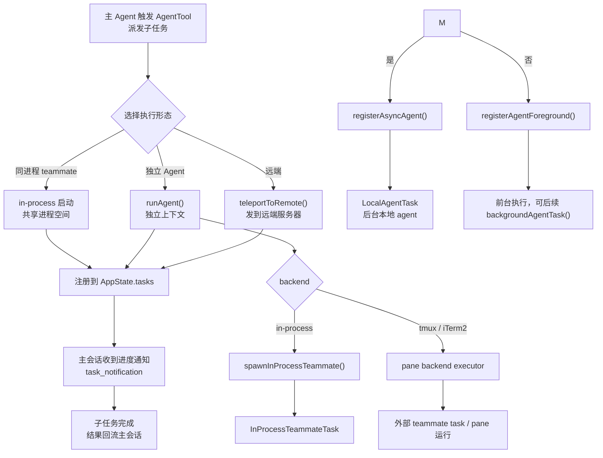
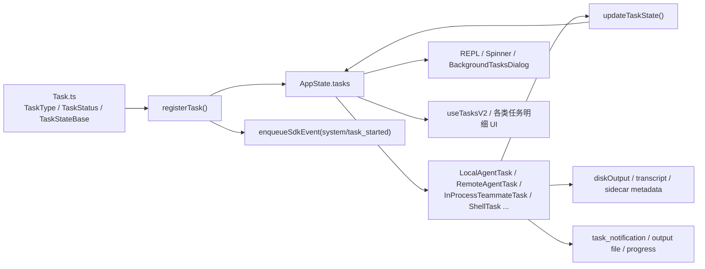

# 14 多代理、子任务与协同机制

到这里，Part 3 前三章已经把”远程”和”后台”讲清楚了：

- 第 11 章：机器如何被远程调度
- 第 12 章：远程 session 如何被本地接管
- 第 13 章：后台 session 如何被托管与观察

但 Claude Code 真正和普通 CLI 拉开差距的地方，还在另一条线上：

**它不只是一个会调用工具的单线程代理，而是能把任务拆给别的 agent 并行执行，再把结果汇总回主会话。**

## 概念前置（Agent 入门看这里）

假设任务是”分析整个代码库的安全漏洞”——单个 Agent 从头到尾串行做要几个小时。

更好的方式：主 Agent 不自己做，而是**把代码库分成几块，各派一个子 Agent 并行分析，最后汇总结果**。

这就是多代理协同：**主 Agent 是”编排者”，子 Agent 是”执行者”**。

Claude Code 里子 Agent 有几种运行形态：

| 形态 | 特点 |
|---|---|
| 同进程内（in-process） | 最轻量，共享进程，适合简单子任务 |
| 独立进程 / tmux 窗口 | 隔离上下文，任务结束后不影响主会话 |
| 远端服务器（remote） | 分布式执行，适合长时任务或特殊环境 |

无论哪种形态，子 Agent 的进度都会注册到 `AppState.tasks`，主会话可以看到进度、收到通知、在完成时拿到结果。

> **源码对应**：`restored-src/src/tools/AgentTool/`（派发入口）、`restored-src/src/tasks/`（任务状态管理）。

## 1. 本章要解决什么问题

很多人第一次看到 `AgentTool.tsx`，会把它理解成：

> “就是又包了一层 `query()`，让 Claude 再开一个子会话。”

这只对了一半。

结合 `AgentTool.tsx`、`runAgent.ts`、`Task.ts`、`tasks/*`、`spawnMultiAgent.ts`、`spawnInProcess.ts` 一起看，Claude Code 的多代理协同至少解决了六个问题：

1. **把“代理执行”统一抽象成 task。**
   - 不是只有 shell 才是 task，agent / remote agent / in-process teammate 也都是 task。
2. **决定这次派发要走哪种执行形态。**
   - 同步子代理、后台本地 agent、远端 CCR agent、同进程 teammate、tmux/iTerm2 teammate。
3. **让不同执行形态都能挂到统一状态树。**
   - 统一进入 `AppState.tasks`，统一展示、通知、终止。
4. **把多代理结果折回主会话。**
   - 包括 `task_started`、`task_notification`、输出文件、messages、状态摘要。
5. **在 coordinator 模式下改变默认协作语义。**
   - 不是让主 agent 亲自做全部工作，而是让它更多充当编排器。
6. **隔离不同 worker 的上下文与工作空间。**
   - 包括 fork child、worktree、remote、AsyncLocalStorage teammate 等。

所以这一章最关键的认知是：

**多代理协同不是“再跑一个 query”，而是“把代理执行提升成统一任务模型，再让不同运行形态共享这层模型”。**

## 2. 先看业务流程图

先看 `AgentTool` 主分流图：



这张图有两个重点：

1. **`AgentTool` 不是单一路径，它本质上是一个执行形态分发器。**
2. **无论最后跑在哪，都会尽量汇入统一 task 语义。**

再看统一 task 侧的状态回流图：



这张图表达的核心是：

> **多代理协同的真正底座不是某个 agent prompt，而是统一的 task 注册与状态框架。**

## 3. 源码入口

这一章建议先抓这些文件：

- `restored-src/src/tools/AgentTool/AgentTool.tsx`
  - 多代理分发总入口，决定走 teammate、remote、async、foreground 哪条路。
- `restored-src/src/tools/AgentTool/runAgent.ts`
  - 真正执行本地 agent query loop 的主引擎。
- `restored-src/src/tools/AgentTool/forkSubagent.ts`
  - fork child 的上下文继承策略。
- `restored-src/src/Task.ts`
  - `TaskType / TaskStatus / generateTaskId / TaskStateBase` 统一抽象。
- `restored-src/src/utils/task/framework.ts`
  - `registerTask / updateTaskState / pollTasks / evictTerminalTask`。
- `restored-src/src/tasks/LocalAgentTask/LocalAgentTask.tsx`
  - 本地 agent 的 foreground/background 生命周期。
- `restored-src/src/tasks/RemoteAgentTask/RemoteAgentTask.tsx`
  - 远端 agent task 的注册、轮询、恢复。
- `restored-src/src/utils/swarm/spawnInProcess.ts`
  - 同进程 teammate 的创建与任务注册。
- `restored-src/src/tools/shared/spawnMultiAgent.ts`
  - teammate 统一 spawn 入口。
- `restored-src/src/utils/swarm/backends/registry.ts`
  - tmux / iTerm2 / in-process backend 选择策略。
- `restored-src/src/tasks/types.ts`
  - 各类 task state union 与 background task 判定。
- `restored-src/src/coordinator/coordinatorMode.ts`
  - coordinator 模式下的协同语义与 worker system prompt。

如果你只想抓主线，推荐顺序是：

1. 先看 `AgentTool.tsx` 的分流逻辑。
2. 再看 `Task.ts + framework.ts` 的统一任务模型。
3. 然后看 `LocalAgentTask.tsx` 和 `RemoteAgentTask.tsx`。
4. 最后补 `spawnInProcess.ts`、`spawnMultiAgent.ts`、`coordinatorMode.ts`。

## 4. 主调用链拆解

### 4.1 `AgentTool` 的第一职责，不是执行，而是“判路由”

`restored-src/src/tools/AgentTool/AgentTool.tsx` 的 `call(...)` 一开头就做了很多分流判断：

- `team_name`
- `name`
- `run_in_background`
- `subagent_type`
- `isolation`
- 当前是否 `coordinator mode`
- 当前是否处于 fork experiment

这意味着 `AgentTool` 的本质不是“某一种 agent 的 runner”，而更像：

> **多代理执行形态的路由器。**

它至少要先回答三个问题：

1. 这是 teammate spawn，还是普通 subagent？
2. 这是本地执行，还是 remote 隔离执行？
3. 这是同步前台执行，还是异步后台 task？

### 4.2 `team_name + name` 触发的是 teammate，而不是普通 subagent

在 `AgentTool.tsx` 里，这条规则很明确：

- 有 `team_name`
- 也有 `name`

就进入：

```ts
spawnTeammate(...)
```

这和普通 subagent 最大的不同在于：

- teammate 是团队成员视角
- 有稳定名字和身份
- 可以被继续发消息
- 可以进入不同 backend

这里还做了两个很关键的边界限制：

1. teammate 不能再嵌套 spawn teammate
   - 团队 roster 设计成扁平结构
2. in-process teammate 不能再起 background agent
   - 生命周期绑在 leader 进程上，不适合无限外扩

这反映出团队作者并没有把多代理自由度无限放开，而是明确限制了协同拓扑。

### 4.3 remote isolation 说明 agent 不一定跑在本机

如果 `effectiveIsolation === 'remote'`，`AgentTool.tsx` 会走：

1. `checkRemoteAgentEligibility()`
2. `teleportToRemote(...)`
3. `registerRemoteAgentTask(...)`

这里非常重要的一点是：

**remote agent 并不是“本地 agent 换个输出通道”，而是直接变成另一类 task：`remote_agent`。**

也就是说，系统没有强行把远端执行伪装成本地子进程，而是老老实实建了一类独立任务。

这让后面的轮询、恢复、归档、详情视图都更自然。

### 4.4 fork path 的目标是继承上下文，而不是换一种 agent 类型

`restored-src/src/tools/AgentTool/forkSubagent.ts` 这套设计很有代表性。

当 fork 实验打开时，如果用户没有显式指定 `subagent_type`，系统会进入 fork path：

- `buildForkedMessages(...)`
- 保留父 assistant message 的完整内容
- 为所有 `tool_use` 生成统一 placeholder `tool_result`
- 最后只追加本次 worker 的 directive

这样做最重要的价值不是“写法优雅”，而是：

**尽可能保证 fork child 的请求前缀字节一致，提升 prompt cache 命中。**

这说明 Claude Code 的多代理协同不是纯产品层概念，它已经深入到：

- cache 策略
- 上下文继承粒度
- 递归 fork 防护

### 4.5 `runAgent.ts` 才是真正执行本地 agent 的引擎

不管是 fork path 还是普通 agent path，只要还是本地执行，最后都会组出：

```ts
runAgent({...})
```

`runAgent.ts` 干的事情并不轻：

- 初始化 agent-specific MCP servers
- 解析 worker 工具池
- 创建 subagent context
- 进入 `query()` 主循环
- 记录 transcript / metadata / sidechain
- 处理 shell task 清理、perfetto tracing、hooks

这说明“多代理”并不是另起一套简化版 runner，而是：

> **把主会话那套 query 基础设施复用到子代理执行。**

只不过围绕 agent 形态多加了：

- agent prompt
- agent metadata
- worker tools
- isolated cwd / worktree
- transcript 子目录

### 4.6 `shouldRunAsync` 把多种“异步化理由”合并成一个统一判断

`AgentTool.tsx` 里有个非常关键的汇总判断：

- 显式 `run_in_background`
- agent 定义本身 `background === true`
- `coordinator mode`
- fork experiment 强制 async
- assistant / kairos 模式强制 async
- proactive 激活

最终统一折成：

```ts
const shouldRunAsync = ...
```

这说明团队并不想让“为什么异步”散落在每条分支里，而是统一成一个任务决策点。

这是很值得复刻的做法，因为多代理系统一旦复杂起来，异步化触发条件会越来越多。

### 4.7 `Task.ts` 是多代理协同真正的类型底座

`restored-src/src/Task.ts` 先定义了统一任务模型：

- `TaskType`
  - `local_bash`
  - `local_agent`
  - `remote_agent`
  - `in_process_teammate`
  - `local_workflow`
  - `monitor_mcp`
  - `dream`
- `TaskStatus`
  - `pending`
  - `running`
  - `completed`
  - `failed`
  - `killed`

再配上 `TaskStateBase`：

- `id`
- `type`
- `status`
- `description`
- `toolUseId`
- `startTime / endTime`
- `outputFile / outputOffset`
- `notified`

这层抽象的意义非常大：

**它把“agent 协同”从某个工具内部的私有状态，提升成全系统共享的运行时对象。**

### 4.8 `framework.ts` 负责把 task 写进统一状态树，并发出统一事件

`restored-src/src/utils/task/framework.ts` 里的几个函数几乎就是多任务系统的骨架：

- `registerTask(task, setAppState)`
- `updateTaskState(taskId, setAppState, updater)`
- `evictTerminalTask(...)`
- `pollTasks(...)`

其中最关键的是 `registerTask(...)`：

1. 把 task 放进 `AppState.tasks`
2. 发出 `enqueueSdkEvent({ type: 'system', subtype: 'task_started', ... })`

这意味着任务的诞生不是 UI 私事，而是系统级事件。

这也是为什么前一章里远程 session 能通过 `task_started` / `task_notification` 更新 `remoteBackgroundTaskCount`。

### 4.9 `LocalAgentTask` 把“前台 agent”和“后台 agent”统一到同一类任务上

`restored-src/src/tasks/LocalAgentTask/LocalAgentTask.tsx` 里有两条非常关键的注册路径：

1. `registerAsyncAgent(...)`
   - 一开始就直接是后台 task
2. `registerAgentForeground(...)`
   - 先前台运行，后续可以 `backgroundAgentTask(...)`

这说明本地 agent 并不是“同步”和“异步”两套完全不同实现，而是同一类 task 的两种生命周期起点。

它还额外维护了很多和真实产品体验直接相关的字段：

- `progress`
- `lastReportedToolCount`
- `lastReportedTokenCount`
- `pendingMessages`
- `messages`
- `retain`
- `diskLoaded`
- `isBackgrounded`

这些字段的存在说明：

**后台 agent 不只是“跑完给你一个结果”，而是一个可继续观察、可继续发消息、可继续展示 transcript 的长期对象。**

### 4.10 `task_notification` 是多代理结果折回主会话的关键桥梁

`LocalAgentTask.tsx` 和 `RemoteAgentTask.tsx` 都会在完成时构造：

```xml
<task-notification>
  ...
</task-notification>
```

这类消息再通过 `enqueuePendingNotification(...)` 回流到主会话。

这套设计很关键，因为它让主会话看到的不是某个内部 promise resolved，而是：

- 一个结构化的完成事件
- 带 task id
- 带状态
- 可选带 result / usage / output file

这也是 coordinator 模式能自然消费 worker 结果的基础。

### 4.11 `RemoteAgentTask` 证明“远端 agent”也被纳入同一任务框架

`restored-src/src/tasks/RemoteAgentTask/RemoteAgentTask.tsx` 的 `registerRemoteAgentTask(...)` 做了三件事：

1. `createTaskStateBase(..., 'remote_agent', ...)`
2. `registerTask(...)`
3. 持久化 remote metadata，随后启动 polling

它不仅支持运行期轮询，还支持：

- `restoreRemoteAgentTasks(...)`
- 通过 sidecar 恢复仍在运行的远端任务

这说明远程 worker 并不是“脱离任务系统的特殊 case”，而是被完整纳入 task 框架，只是执行器不同。

### 4.12 in-process teammate 不是简化版 async agent，而是另一种隔离模型

`restored-src/src/utils/swarm/spawnInProcess.ts` 的注释写得很清楚：

- 同进程执行
- 用 `AsyncLocalStorage` 隔离上下文
- 有 team-aware identity
- 也注册进 `AppState.tasks`

它生成的是：

- `agentId = name@team`
- `taskId = generateTaskId('in_process_teammate')`
- `TeammateContext`
- 独立 `AbortController`

这类 teammate 的关键不在于“更轻量”，而在于：

**它让多 worker 协同不必一定扩展成多个 OS 进程，也能在同一个 Node.js 进程内形成逻辑隔离。**

### 4.13 pane teammate 说明“多代理协同”也可以是一种终端布局能力

`restored-src/src/tools/shared/spawnMultiAgent.ts` 和 `utils/swarm/backends/registry.ts` 一起说明了一点：

teammate 不一定是纯后台对象，它也可以是：

- tmux pane
- iTerm2 原生 pane
- 外部 tmux session

backend registry 的选择优先级大致是：

1. 如果当前就在 tmux 里，优先 tmux
2. 如果在 iTerm2 且 it2 CLI 可用，优先 iTerm2
3. 不行就 fallback 到 tmux
4. 再不行才考虑 in-process fallback

这意味着 Claude Code 的多代理协同并不只是一套“后台调度系统”，它同时也是一套**终端多工协作界面模型**。

### 4.14 `tasks/types.ts` 说明 UI 消费的是统一 task union，而不是每种任务各写一套视图协议

`restored-src/src/tasks/types.ts` 把不同任务汇总成：

```ts
type TaskState =
  | LocalShellTaskState
  | LocalAgentTaskState
  | RemoteAgentTaskState
  | InProcessTeammateTaskState
  | ...
```

并且提供：

```ts
isBackgroundTask(task)
```

这让 UI 层能统一回答一个问题：

> 这个东西该不该出现在 background tasks indicator 里？

而不需要把“是不是 agent”“是不是 remote”“是不是 teammate”拆成很多平行判断。

### 4.15 coordinator 模式改变的不是工具实现，而是“主 agent 的工作方式”

`restored-src/src/coordinator/coordinatorMode.ts` 最值得注意的地方，不是某个 if，而是它给 coordinator 写了一整段系统提示：

- 主协调者负责分解任务
- worker 负责 research / implementation / verification
- worker 完成后通过 `<task-notification>` 回来
- 主协调者继续综合和下发

同时在 `AgentTool.tsx` 里，coordinator 模式也会影响：

- `model` 处理
- `shouldRunAsync`
- worker 的默认语义

这说明 coordinator mode 的本质不是“多开一个工具”，而是：

**把主线程从“亲自做事的 agent”切换成“以 task 为中心的编排者”。**

## 5. 关键设计意图

把这一章的源码串起来后，我觉得最值得提炼的设计意图有六条。

### 5.1 先统一成 task，再谈多种执行形态

本地 agent、远端 agent、同进程 teammate、pane teammate，都先变成 task。

这样状态、通知、UI、停止逻辑才能复用。

### 5.2 `AgentTool` 负责分发，不负责承载所有运行期细节

`AgentTool.tsx` 做路由与参数决策；
真正的生命周期分别下沉到：

- `runAgent.ts`
- `LocalAgentTask.tsx`
- `RemoteAgentTask.tsx`
- `spawnInProcess.ts`

这个边界让复杂度没有全堆在一个文件里。

### 5.3 fork path 优化的是上下文继承与 cache，而不只是“复制历史消息”

这一点很容易被忽视。

Claude Code 在 fork child 上的设计，明显已经在为：

- prompt cache
- 字节级稳定前缀
- 递归 fork 安全

做工程优化。

### 5.4 同进程 teammate 和 pane teammate 是两种不同的协同哲学

- in-process：共享进程，依赖上下文隔离
- pane backend：共享团队语义，但运行在外部进程/终端布局里

这不是单纯的性能权衡，而是交互模型和隔离模型的差异。

### 5.5 任务通知是主线程重新获得控制权的关键协议

没有 `<task-notification>`，主会话就只能轮询 promise 或共享内存状态。

有了它，主线程就能把 worker 完成视作一类标准输入事件重新处理。

### 5.6 coordinator 模式把多代理协同“产品化”了

它不再只是底层能力，而是明确告诉主 agent：

- 什么时候该派 worker
- 怎么读 worker 结果
- 怎么做 synthesis
- 怎么避免伪造结果

## 6. 从复刻视角看

如果你自己要做一个多代理 coding system，这一章最值得复刻的不是完整功能，而是下面这套最小抽象。

### 6.1 把所有 worker 都先投影为统一 TaskState

至少要有：

- type
- status
- description
- output
- started / ended
- notified

### 6.2 把“执行形态选择”集中到一个调度入口

不要让每个 agent 调用点都自己判断：

- 本地 / 远端
- 前台 / 后台
- pane / in-process

集中在 `AgentTool` 这一层会清楚很多。

### 6.3 结果回流不要只靠内存回调，最好有结构化通知协议

像 `<task-notification>` 这种协议虽然看起来朴素，但非常实用：

- 能跨进程
- 能跨远端
- 能被主会话统一消费

### 6.4 若要支持多种 worker backend，必须先承认它们不是同一种隔离模型

不要试图拿一个抽象把：

- 进程级 worker
- 同进程 ALS worker
- 远端 CCR worker

全都抹平成一样的内部实现。

真正该统一的是任务语义，不是执行器细节。

### 6.5 源码追踪提示

这章最容易读散，建议严格按“分发入口 -> 任务模型 -> worker backend”三层来追：

1. 先看 `restored-src/src/tools/AgentTool/AgentTool.tsx`，只抓它怎样判断 teammate、remote、foreground、background 这些执行形态。
2. 再看 `restored-src/src/Task.ts`、`restored-src/src/tasks/types.ts`、`restored-src/src/tasks/LocalAgentTask/LocalAgentTask.tsx`、`restored-src/src/tasks/RemoteAgentTask/RemoteAgentTask.tsx`，理解统一 task 语义是怎样落地的。
3. 最后补 `restored-src/src/tools/shared/spawnMultiAgent.ts`、`restored-src/src/utils/swarm/*`、`restored-src/src/coordinator/coordinatorMode.ts`，看不同 worker backend 和 coordinator 语义如何接进同一体系。

## 7. 本章小练习

1. 顺着 `AgentTool.tsx` 画一张执行形态分流图。
   - 至少区分 teammate、remote、async local、foreground local。
2. 顺着 `Task.ts -> framework.ts -> LocalAgentTask/RemoteAgentTask` 画一张统一任务流转图。
   - 至少标出 `registerTask`、`updateTaskState`、`task_notification`。
3. 对照 `spawnInProcess.ts` 和 `swarm/backends/registry.ts`，列一张 teammate backend 对比表。
   - 同进程、tmux、iTerm2 各自的隔离方式是什么？
4. 如果你自己做 coordinator 模式，你会不会也把 worker 结果设计成结构化通知，而不是共享内存回调？

## 8. 本章小结

这一章你应该建立三个稳定认知：

1. **Claude Code 的多代理协同不是“多个 query 并发”，而是“统一 task 模型 + 多执行后端”。**
2. **`AgentTool` 的核心职责是路由，真正的生命周期由 task 系统和各类 runner 承担。**
3. **coordinator 模式把多代理能力从底层基础设施提升成了明确的产品交互模型。**

到这里，Part 3 就形成了完整闭环：

- 第 11 章：环境如何被远程调度
- 第 12 章：远程 session 如何被接管
- 第 13 章：后台会话如何被托管
- 第 14 章：多代理任务如何被拆分、执行、观察与回流

这也意味着整套电子书第一轮主干已经成型。再往后补附录时，你就可以把这四章当成理解 Claude Code “为什么是一个平台，而不只是一个 CLI”的核心骨架。
