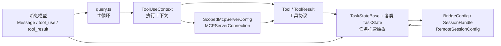

# 92 关键类型与核心抽象

这一篇附录不追某一条业务流，而是回答一个更底层的问题：

**Claude Code 这套系统，到底靠哪些“核心抽象”把入口、主循环、工具、扩展、远程协同这些层串起来？**

如果你前面读 Part 1/2/3 时，反复见到 `ToolUseContext`、`tool_use/tool_result`、`TaskStateBase`、`MCPServerConnection`、`BridgeConfig` 这些名字，但还没真正把它们连成一张图，这一篇就是用来收口的。

> 说明：当前还原包里，多处模块会引用 `src/types/message.js`，但该源文件本体没有完整落在当前 `restored-src/src/types/` 目录快照中。因此本章关于“消息模型”的部分，主要基于 [Tool.ts](../../restored-src/src/Tool.ts) 与 [utils/messages.ts](../../restored-src/src/utils/messages.ts) 的消费侧反向归纳，不虚构缺失定义。

## 1. 本章要解决什么问题

读源码时，很多人会卡在一个误区里：

- 只追函数调用，不追“这个函数操作的对象模型是什么”。
- 只看目录，不看“跨目录共享的抽象容器是什么”。

Claude Code 恰恰是一个**抽象先行**的系统。很多复杂能力之所以能共存，不是因为代码文件多，而是因为它先定义了几类可以跨层流动的对象：

- 消息：把用户、assistant、工具、系统事件放进同一条轨迹。
- 上下文：把权限、工具池、MCP、状态读写、UI 回调收进同一个执行容器。
- 工具协议：把“模型意图”翻译成“可被执行、可被回填、可被治理”的操作。
- 任务状态：把本地会话、远程代理、后台托管、多代理协同都统一成可管理对象。
- 远程与扩展配置：把 MCP、Bridge、Remote 这类可插拔或跨进程能力纳入稳定接口。

## 2. 先看抽象关系图

这张图的重点不是“谁 import 谁”，而是“系统推进时，哪些抽象会在多个层之间反复被消费”。

## 3. 抽象总表：先记住这 6 组

| 抽象 | 主要源码入口 | 它解决什么问题 | 为什么重要 |
| --- | --- | --- | --- |
| 消息模型 | [utils/messages.ts](../../restored-src/src/utils/messages.ts)、[Tool.ts](../../restored-src/src/Tool.ts) | 把用户消息、assistant 响应、工具结果、系统事件放入统一轨迹 | 没有统一消息模型，就不会有可继续推进的 query loop |
| `ToolUseContext` | [Tool.ts](../../restored-src/src/Tool.ts) | 为工具执行提供完整上下文容器 | 它是主循环、工具、技能、MCP、任务系统的公共地基 |
| `Tool` / `ToolResult` | [Tool.ts](../../restored-src/src/Tool.ts) | 定义工具输入、执行、结果回填、UI 渲染与错误路径 | 它把“模型决定做事”变成“系统真正执行” |
| `TaskStateBase` + 各类任务状态 | [Task.ts](../../restored-src/src/Task.ts)、[tasks/types.ts](../../restored-src/src/tasks/types.ts) | 把本地/远程/协同执行单元统一成可托管对象 | 它让后台任务、多代理、远程执行能被同一套 UI 和状态系统观察 |
| MCP 连接抽象 | [services/mcp/types.ts](../../restored-src/src/services/mcp/types.ts) | 统一外部 MCP 服务的配置、连接态和序列化表示 | 它让外部能力不是“外挂”，而是系统内的正规公民 |
| Bridge / Remote 会话抽象 | [bridge/types.ts](../../restored-src/src/bridge/types.ts)、[remote/RemoteSessionManager.ts](../../restored-src/src/remote/RemoteSessionManager.ts) | 统一远程环境、会话句柄、权限响应和连接配置 | 它让本地 CLI 能演化成可远程调度的平台 |

## 4. 第一组：消息模型是主循环真正操作的对象

### 4.1 为什么消息模型比“字符串输入输出”更重要

在普通 CLI 聊天工具里，“消息”往往只是几段文本。但在 Claude Code 里，消息承担了更重的责任：

- 承载用户请求。
- 承载 assistant 的文本与 `tool_use` 块。
- 承载用户侧的 `tool_result` 回填。
- 承载 stop hook、权限拒绝、中断、任务通知等系统级事件。

从 [utils/messages.ts](../../restored-src/src/utils/messages.ts) 可以看出，系统对消息的工作重点不只是“生成文本”，而是：

- 规范化消息形态。
- 维持 `tool_use` / `tool_result` 的配对关系。
- 在 UI 展示形态与 API 发送形态之间做边界转换。
- 为工具、远程 session、任务通知等特殊消息提供兼容层。

### 4.2 这组抽象的设计意图

你可以把消息模型理解成一条“可继续追加的时间线”。这个时间线的关键不是连续文本，而是**可被 query loop 识别的结构化块**：

- assistant 发出 `tool_use`
- 系统执行工具
- 系统将 `tool_result` 回填为用户侧消息
- 主循环继续推进

这意味着 Claude Code 的主循环实际上不是在消费“自然语言段落”，而是在消费“结构化事件流”。

### 4.3 从复刻视角看

如果你想复刻一个最小版系统，最该保留的不是复杂 UI，而是：

1. `user / assistant / system` 三类消息角色。
2. `tool_use / tool_result` 配对机制。
3. UI 展示消息与 API 提交消息之间的归一化边界。

## 5. 第二组：`ToolUseContext` 是最厚、也最关键的上下文容器

### 5.1 先抓核心结论

在 [Tool.ts](../../restored-src/src/Tool.ts) 里，`ToolUseContext` 不是一个轻量参数对象，而是一个“运行时执行容器”。

从字段可以看出，它至少包含了几类能力：

- 执行选项：`commands`、`tools`、`mainLoopModel`、`thinkingConfig`、`mcpClients`
- 状态管理：`getAppState()`、`setAppState()`、`setAppStateForTasks()`
- UI/交互：`setToolJSX`、`appendSystemMessage`、`sendOSNotification`
- 生命周期与中断：`abortController`、`setHasInterruptibleToolInProgress`
- 会话数据：`messages`、文件读取限制、glob 限制、skill/memory 触发集合

### 5.2 为什么这里必须“很厚”

这是很多读者第一次看 `ToolUseContext` 时最容易误判的地方。它之所以厚，不是因为设计失控，而是因为工具执行发生在系统中心：

- 工具需要知道当前权限模式。
- 工具可能要读写 AppState。
- 工具可能依赖 MCP 客户端。
- 工具可能要在 REPL 中展示进度 UI。
- 工具可能要影响任务系统、技能系统、通知系统。

如果这些能力分散在多个互不兼容的上下文对象里，那么：

- Bash 工具、Agent 工具、MCP 工具之间很难复用编排逻辑。
- 主线程和子代理线程之间也很难共享同一套执行协议。

所以 `ToolUseContext` 的本质是：**把“能执行工具所需的一切跨层依赖”统一打包进一个公共上下文。**

### 5.3 从复刻视角看

最小版不需要保留所有字段，但建议保留四类：

- 工具池与模型配置
- 权限/策略
- 状态读写入口
- 中断与进度回调

只要这四类在，你的工具系统就具备“可治理、可扩展、可复用”的基本骨架。

## 6. 第三组：`Tool` / `ToolResult` 把模型意图翻译成系统行为

### 6.1 `Tool` 协议回答的问题

`Tool` 这组抽象本质上回答四个问题：

1. 这个工具叫什么，输入 schema 是什么。
2. 什么时候能调用，是否需要权限。
3. 执行后回什么结构化结果。
4. UI 层该如何展示 tool use、progress、tool result、error。

从 [Tool.ts](../../restored-src/src/Tool.ts) 可见，工具协议不只定义 `call()`，还定义了：

- 输入/输出 schema
- progress 事件
- `renderToolUseMessage`
- `renderToolResultMessage`
- `renderToolUseErrorMessage`

也就是说，Claude Code 的工具不是“纯函数”，而是“带有执行协议与展示协议的能力单元”。

### 6.2 `ToolResult` 的关键意义

`ToolResult` 不是简单返回值，它至少有三类能力：

- `output`：本次工具调用的直接结果。
- `newMessages`：向消息轨迹追加结构化消息。
- `contextModifier`：对 `ToolUseContext` 做后续修改。

这很关键，因为工具执行并不只是“回一个字符串”，而经常会：

- 改变上下文状态
- 追加新消息
- 为下一轮 query loop 改写环境

这也是为什么主循环能持续推进，而不是“调用工具一次就结束”。

### 6.3 从复刻视角看

如果你只复刻一个 `call(input) -> string`，你会很快遇到瓶颈。更稳妥的最小抽象是：

- `output`
- `events/progress`
- `messages delta`
- `context delta`

这样你的系统才能逐步长成 Claude Code 这种多阶段执行引擎。

## 7. 第四组：任务状态抽象让“执行单元”可以被统一托管

### 7.1 基座：`TaskStateBase`

[Task.ts](../../restored-src/src/Task.ts) 里的 `TaskStateBase` 很朴素，但非常关键。它统一了所有任务的共性字段：

- `id`
- `type`
- `status`
- `description`
- `toolUseId`
- `startTime/endTime`
- `outputFile/outputOffset`
- `notified`

这意味着，无论一个执行单元是：

- 本地 bash
- 本地 agent
- 远程 agent
- in-process teammate
- background main session

它首先都被视作一个“可跟踪、可终止、可通知、可持久化输出”的任务。

### 7.2 派生状态为什么分这么多种

结合 [tasks/types.ts](../../restored-src/src/tasks/types.ts)、[tasks/LocalMainSessionTask.ts](../../restored-src/src/tasks/LocalMainSessionTask.ts)、[tasks/RemoteAgentTask/RemoteAgentTask.tsx](../../restored-src/src/tasks/RemoteAgentTask/RemoteAgentTask.tsx)、[tasks/InProcessTeammateTask/types.ts](../../restored-src/src/tasks/InProcessTeammateTask/types.ts) 可以看出，派生状态的差异主要来自执行环境不同：

- `LocalMainSessionTaskState`：把当前主会话转成后台任务继续跑。
- `RemoteAgentTaskState`：额外维护 `sessionId`、`remoteTaskType`、远端日志、review 进度等远程字段。
- `InProcessTeammateTaskState`：额外维护 teammate 身份、审批状态、独立权限模式、pending user messages。

所以任务系统的设计并不是“每种任务完全独立”，而是：

- 先抽公共托管骨架
- 再按执行语境增量扩展字段

### 7.3 这组抽象的真正价值

它最大的价值不是类型好看，而是让 UI 和系统治理层都能统一工作：

- 统一显示运行中/已完成/失败/被停止状态
- 统一输出文件与通知机制
- 统一恢复、前台/后台切换与 kill 逻辑

换句话说，**任务抽象让“执行”从一次性调用变成了可管理资源。**

## 8. 第五组：MCP 抽象把外部能力纳入系统内部秩序

### 8.1 配置抽象

[services/mcp/types.ts](../../restored-src/src/services/mcp/types.ts) 先定义了两层配置：

- `McpServerConfig`：单个服务的 transport 与配置形态
- `ScopedMcpServerConfig`：在此基础上补上 `scope` 与 `pluginSource`

这说明 Claude Code 不把 MCP 仅仅当作“地址 + 命令”，而是把它当作一个有来源边界的配置对象：

- 本地还是项目级
- 用户级还是企业级
- 是否来自插件

### 8.2 连接态抽象

同一文件里还定义了：

- `ConnectedMCPServer`
- `FailedMCPServer`
- `NeedsAuthMCPServer`
- `PendingMCPServer`
- `DisabledMCPServer`

最后统一成 `MCPServerConnection` 联合类型。

这背后的设计意图很明确：**MCP 连接不是二元开关，而是有完整生命周期状态机的资源。**

### 8.3 从复刻视角看

如果你后续想做自己的扩展系统，最值得学的不是 transport 细节，而是这两层分离：

- 配置层：描述“我想接什么”
- 连接层：描述“它现在处于什么状态”

这样 UI、工具编排和错误恢复都会清晰很多。

## 9. 第六组：Bridge / Remote 抽象把“本地 CLI”升级成“远程可调度环境”

### 9.1 `BridgeConfig` 描述的是“环境”，不是会话

从 [bridge/types.ts](../../restored-src/src/bridge/types.ts) 可以看到，`BridgeConfig` 关注的是：

- 工作目录、仓库信息、machineName
- `spawnMode`
- `environmentId` / `reuseEnvironmentId`
- API base URL、session ingress URL
- `workerType`

这些字段描述的不是某一次对话，而是“一个可被远程调度的运行环境”。

### 9.2 `SessionHandle` 描述的是“正在跑的执行实体”

同文件中的 `SessionHandle` 更接近运行态句柄，它关心的是：

- `sessionId`
- `done`
- `kill()` / `forceKill()`
- `activities`
- `writeStdin()`
- `updateAccessToken()`

也就是说，Bridge 层把“环境”与“会话执行实体”明确拆开了。

### 9.3 `RemoteSessionManager` 描述的是“本地接管远程会话”的客户端抽象

在 [remote/RemoteSessionManager.ts](../../restored-src/src/remote/RemoteSessionManager.ts) 里，又进一步抽出：

- `RemoteSessionConfig`
- `RemoteSessionCallbacks`
- `RemotePermissionResponse`

这表明 Remote 层解决的问题不是“如何启动远端环境”，而是：

- 如何连接既有 session
- 如何收消息
- 如何处理控制请求与权限响应
- 如何把远端执行重新接回本地 REPL

### 9.4 从复刻视角看

想做最小远程版时，建议至少区分三层：

1. 环境配置对象
2. 运行中会话句柄
3. 本地接管客户端

这比“一个 RemoteSession 大对象包打天下”更容易维护。

## 10. 再看 Agent / Coordinator：协同模式其实也是抽象驱动

### 10.1 `AgentTool` 不是“另一个工具”，而是“任务生成器”

从 [tools/AgentTool/AgentTool.tsx](../../restored-src/src/tools/AgentTool/AgentTool.tsx) 可以看出，AgentTool 不是简单执行一步动作，而是在做这些事：

- 根据 schema 接受 `description`、`prompt`、`subagent_type`、`isolation` 等参数
- 组装工具池与 system prompt
- 决定是同步、异步、远程、worktree 还是 teammate 形态
- 产出 `async_launched` 等状态结果

所以它更像“任务生成器”或“执行形态分发器”。

### 10.2 `forkSubagent` 暴露了一个很重要的抽象思想

在 [tools/AgentTool/forkSubagent.ts](../../restored-src/src/tools/AgentTool/forkSubagent.ts) 里，最值得学习的不是实验开关，而是这个思想：

- 子代理不是凭空开始
- 它需要继承父对话的上下文前缀
- 同时又要注入专门的 worker 规则与限制

这其实是在做“**上下文继承 + 行为约束**”的双层抽象。

### 10.3 `coordinatorMode` 暴露的是“角色系统提示词”

[coordinator/coordinatorMode.ts](../../restored-src/src/coordinator/coordinatorMode.ts) 进一步说明，多代理协同并不只靠任务状态，还靠：

- coordinator 专用系统提示词
- worker 工具池限制
- task-notification 这类结构化通信契约

所以多代理协同的关键抽象不只是“多开几个 agent”，而是：

- 角色
- 通信格式
- 权限与工具边界
- 任务结果回传协议

## 11. 从复刻视角看：最小应该保留哪些抽象

如果你的目标不是还原全部 Claude Code，而是学到它的骨架，建议按下面优先级保留：

### 第一优先级

- 消息模型
- `ToolUseContext`
- `Tool` / `ToolResult`

这是最小 query loop 的地基。

### 第二优先级

- `TaskStateBase`
- 任务状态联合类型
- 输出文件/通知机制

这是把单次执行变成可管理系统的关键。

### 第三优先级

- MCP 配置态 / 连接态分离
- 远程环境 / 会话 / 客户端三层分离

这是把系统做成“可扩展、可远程”的关键。

## 12. 本章小练习

1. 打开 [Tool.ts](../../restored-src/src/Tool.ts)，试着只看类型定义，不看实现，回答：为什么 `ToolUseContext` 不能只是“工具数组 + 配置”？
2. 对照 [Task.ts](../../restored-src/src/Task.ts) 与 [tasks/RemoteAgentTask/RemoteAgentTask.tsx](../../restored-src/src/tasks/RemoteAgentTask/RemoteAgentTask.tsx)，写出“公共任务骨架”和“远程任务增量字段”的差异。
3. 对照 [bridge/types.ts](../../restored-src/src/bridge/types.ts) 与 [remote/RemoteSessionManager.ts](../../restored-src/src/remote/RemoteSessionManager.ts)，解释 `BridgeConfig`、`SessionHandle`、`RemoteSessionConfig` 分别描述的对象是什么。

## 13. 本章小结

这一章最值得记住的，不是某个类型名本身，而是它们背后的抽象分工：

- 消息模型负责把整套系统组织成一条可追加、可回填、可恢复的轨迹。
- `ToolUseContext` 负责把跨层依赖收口成统一执行容器。
- `Tool` / `ToolResult` 负责把模型的结构化意图翻译成真正可执行的系统行为。
- `TaskStateBase` 与任务联合类型负责把执行单元统一成可托管资源。
- MCP 与 Bridge / Remote 抽象负责把“外部能力”和“远程能力”纳入统一秩序。

理解这些抽象之后，你再回看前面的章节，会更容易看出 Claude Code 的真正核心不是“命令多、目录多、功能多”，而是它先把这些能力压进了一组稳定的对象模型里。
