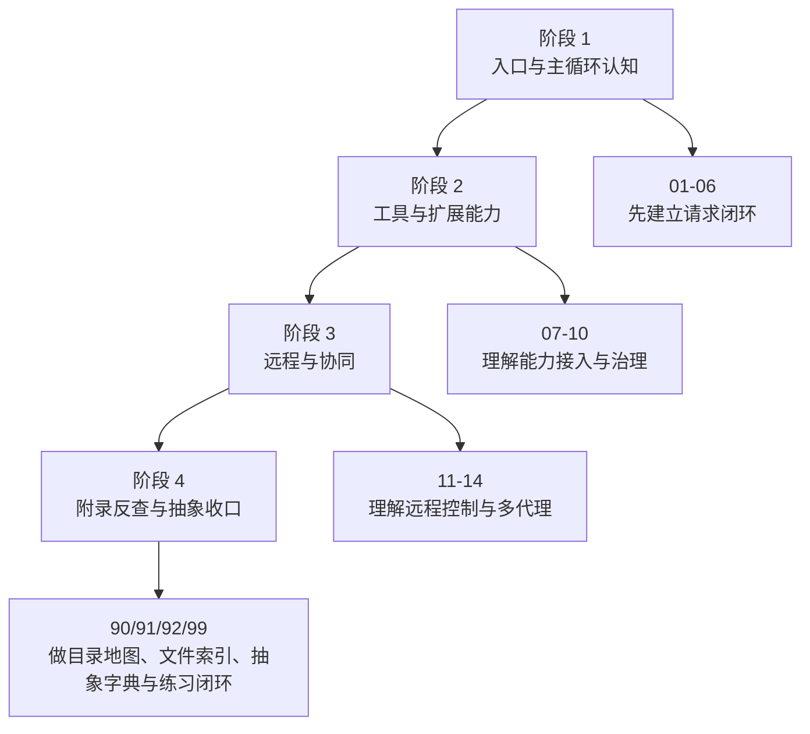

# 99 每章练习题与复刻建议

这篇附录的目标不是再讲一遍源码，而是把前面整套书变成一份**可执行的学习计划**。

如果说前面的章节解决的是“看懂”，那么这一篇解决的是：

- 我应该怎么练，才不会只停留在“看过”。
- 我应该先复刻哪一层，才不会一上来就被 Claude Code 的复杂度压垮。
- 每读完一章，怎样产出真正能迁移到自己项目里的抽象。

## 1. 这篇附录怎么用

推荐把练习分成四层，不要一开始就挑战完整复刻：

0. **理解层（Level 0，新手从这里开始）**：只需要能用自己的话把这章讲的事情说清楚，不需要写代码。
1. **复述层**：能把业务步骤、模块边界、关键文件说清楚。
2. **画图层**：能把章节主链路重新画出来，补上分支与边界条件。
3. **复刻层**：只保留”最小闭环需要的抽象”，做一个小型可运行系统。

一个很实用的原则是：

- 每章先做 Level 0 理解题（能说清楚再往下）
- 再做 1 个复述题
- 再做 1 个画图题
- 最后只挑少数章节做复刻题

因为 Claude Code 这种系统，不是每章都值得你立刻落代码，但几乎每章都值得你训练抽象能力。

## 2. 先看整套练习路线图



这张图的意思很简单：

- 不要跳过 Part 1 就直接做多代理。
- 不要没理解任务模型就直接做远程后台。
- 不要没建立目录地图就盲目在 `restored-src/src` 里乱翻。

## 3. 按章练习索引

| 章节 | 练习目标 | 最小练习 | 进阶复刻建议 |
| --- | --- | --- | --- |
| `00-阅读指南` | 建立学习节奏 | 写出自己的阅读顺序与目标 | 建一份个人源码笔记索引 |
| `01-系统全景与学习路线` | 建立全局心智图 | 重画系统分层图 | 画出自己的 agent 系统分层图 |
| `01-CLI-启动与入口分流` | 理解入口调度器 | 手写一个带 fast-path 的 bootstrap | 复刻多入口 CLI 骨架 |
| `02-初始化-配置-环境-遥测` | 理解昂贵初始化边界 | 列出初始化顺序与原因 | 复刻延迟初始化框架 |
| `03-会话上下文与消息模型` | 理解 `ToolUseContext` 和消息回环 | 设计最小消息模型 | 复刻 `tool_use/tool_result` 回环 |
| `04-query-主循环如何驱动整个系统` | 理解 query loop | 写出一轮 query 的状态迁移 | 复刻最小 AsyncGenerator 主循环 |
| `05-tool-编排-执行-权限-结果回填` | 理解工具协议与调度 | 设计一个工具接口 | 复刻 tool orchestration 最小版 |
| `06-输出渲染-stop-hooks-任务摘要-请求收尾` | 理解收尾与 stop hooks | 总结 stop/continue 条件 | 复刻一套请求收尾钩子 |
| `07-MCP-如何把外部能力接进来` | 理解外部能力接入 | 画 MCP 配置态/连接态图 | 复刻插件式外部工具注册层 |
| `08-Skills-如何把方法论接进主流程` | 理解技能注入 | 设计 skill 元数据格式 | 复刻 Markdown skill loader |
| `09-Plugins-Hooks-如何做能力扩展` | 理解插件生命周期 | 写插件接入清单 | 复刻插件注册与启停机制 |
| `10-权限-策略-安全边界` | 理解治理边界 | 列出系统主要裁决点 | 复刻权限模式与审批点 |
| `11-Bridge-远程控制主链路` | 理解本机如何变远程环境 | 画 bridge 环境模型 | 复刻远程 worker 注册骨架 |
| `12-Remote-Session-与连接管理` | 理解远程接管 | 画本地接管远程 session 时序图 | 复刻 session client + reconnect |
| `13-后台会话与并发托管` | 理解后台任务托管 | 写 task 状态机 | 复刻后台任务 registry |
| `14-多代理-子任务-协同机制` | 理解 agent/task/coordinator 闭环 | 画多代理任务回流图 | 复刻最小 coordinator + worker 模型 |
| `90-源码地图-按目录反查系统能力` | 学会按目录定位能力 | 看到目录名就说出职责 | 建自己的目录地图文档 |
| `91-核心文件索引` | 学会按文件找锚点 | 给 10 个关键词匹配文件入口 | 建自己的核心文件清单 |
| `92-关键类型与核心抽象` | 学会按抽象看系统 | 总结 6 组核心抽象 | 设计自己的对象模型 |

## 4. 三条推荐实践路线

### 4.1 路线 A：最小 agent CLI 复刻

适合你如果：

- 主要目标是自己做一个本地 coding agent
- 不急着做远程、多代理、云端调度

建议顺序：

1. 读 `01`、`02`、`03`
2. 读 `04`、`05`、`06`
3. 补 `90`、`91`、`92`

建议产物：

- 一个带 fast-path 的 CLI 入口
- 一个最小 query loop
- 一套 `tool_use/tool_result` 消息协议
- 一个 3 到 5 个工具的工具系统

### 4.2 路线 B：扩展型 agent 平台复刻

适合你如果：

- 你关心能力注入
- 想设计 Skills / Plugins / 外部工具接入层

建议顺序：

1. 先完成路线 A
2. 再读 `07`、`08`、`09`、`10`
3. 最后配合 `92` 回看配置态、连接态、权限态抽象

建议产物：

- 一套外部能力注册协议
- 一套插件/skill 元数据格式
- 一套权限模式与审批策略

### 4.3 路线 C：远程协同与多代理复刻

适合你如果：

- 你想做后台任务、远程接管、多代理协同
- 你已经能做单代理本地闭环

建议顺序：

1. 先完成路线 A
2. 再读 `11`、`12`、`13`、`14`
3. 配合 `90` 和 `92` 理解任务模型、远程模型、agent 模型

建议产物：

- 一个任务状态机
- 一个远程 session client
- 一个 coordinator + worker 的最小协同框架

## 5. 按章节给出具体练习

### 5.1 Part 1：主业务流

#### 前置知识章练习

- **Level 0**：不看章节，用 3 句话解释”为什么 Agent 需要 while 循环，而不是单次 API 调用”。
- 复述题：说清楚 tool_calls 和 tool role 消息分别是谁生成的，谁负责执行工具。
- 画图题：画出一次完整工具往返的消息序列（user → assistant with tool_calls → tool result → assistant final）。

#### 第 01 章练习

- **Level 0**：用一句话说清楚 `cli.tsx` 里”fast-path”的意思是什么，为什么需要它。
- 复述题：不用看正文，用 5 句话解释为什么 `cli.tsx` 不能等价于 `main.tsx`。
- 画图题：重画”fast-path / 特殊子命令 / 常规交互路径”三段式流程图。
- 复刻题：写一个最小 `bootstrap.ts`，至少支持 `--version`、`daemon`、默认交互三条路径。

#### 第 02 章练习

- **Level 0**：举一个你自己项目里”必须最早初始化”的东西，说明为什么不能延迟。
- 复述题：列出你认为必须在”进入完整命令执行前”完成的 5 类初始化。
- 画图题：画出”延迟初始化”和”必须早生效初始化”的边界图。
- 复刻题：把你自己的项目拆成 `early bootstrap` 和 `lazy init` 两层。

#### 第 03 章练习

- **Level 0**：用自己的话说清楚”为什么工具执行结果必须写进消息历史，而不是存在本地变量里”。
- 复述题：解释 `ToolUseContext` 为什么不是一个”工具数组”。
- 画图题：画出 `user → assistant(tool_use) → tool_result → assistant` 的回环。
- 复刻题：设计一套自己的 `Message` 联合类型与 `ExecutionContext`。

#### 第 04 章练习

- **Level 0**：用一句话说清楚”为什么主循环不是一次 API 调用，而是一个 while 循环”。
- 复述题：说明为什么 `query()` 更像”执行循环”，而不是”调用一次模型 API”。
- 画图题：画出 query loop 的继续/停止/工具回环分支。
- 复刻题：用伪代码写一个支持多轮工具回环的最小主循环。

#### 第 05 章练习

- **Level 0**：举例说明哪种工具适合并发执行，哪种必须串行，为什么。
- 复述题：用自己的话解释 `tools/` 和 `services/tools/` 的边界。
- 画图题：画出工具从被 assistant 触发到结果回填主循环的路径。
- 复刻题：实现一个统一 `Tool` 接口，至少支持 `read`、`bash`、`write` 中的两种。

#### 第 06 章练习

- **Level 0**：说出至少 3 个”模型说完了但这一轮还不能结束”的情况。
- 复述题：总结一次请求为什么不会在”工具执行完”立刻结束。
- 画图题：画出 stop hooks、summary、收尾通知的触发点。
- 复刻题：为自己的 agent 系统设计一个请求收尾阶段。

### 5.2 Part 2：扩展能力流

#### 第 07 章练习

- **Level 0**：用一句话解释”为什么 Agent 不能直接依赖远端 MCP 连接对象，而要依赖本地能力镜像”。
- 复述题：解释配置态和连接态为什么要分离。
- 画图题：画一张 MCP 服务从配置到连接到工具暴露的关系图。
- 复刻题：写一个最小外部工具注册器，先不做真实网络连接。

#### 第 08 章练习

- **Level 0**：Skill 和”把 prompt 复制粘贴进对话”的区别是什么？说出至少两点。
- 复述题：解释 Skill 为什么是”方法论资产”，不是普通 prompt 文本。
- 画图题：画 Skill 从发现、加载到注入上下文的流程。
- 复刻题：定义一个 Markdown frontmatter 协议，让你的系统能加载 skill。

#### 第 09 章练习

- **Level 0**：Plugin 和 Skill 的核心区别是什么？（提示：从”单点扩展”vs”能力包”角度想）
- 复述题：说明插件和 Skill 的职责差异。
- 画图题：画出插件安装、启用、调用、卸载四阶段生命周期。
- 复刻题：做一个最小插件注册表和启停机制。

#### 第 10 章练习

- **Level 0**：说出 allow / deny / ask 三种权限判定各自对应的实际场景（各举一个例子）。
- 复述题：列出 Claude Code 至少 4 个权限/策略裁决点。
- 画图题：画出”工具申请 -> 自动判定/人工审批 -> 放行/拒绝”的流程。
- 复刻题：给你的工具系统加一个 `allow / ask / deny` 三态权限模式。

### 5.3 Part 3：远程协同流

#### 第 11 章练习

- **Level 0**：用”外卖骑手接单”类比，解释 environment、work item、session 三个概念各自对应什么。
- 复述题：解释 `BridgeConfig` 为什么描述的是环境，不是会话。
- 画图题：画出本机注册为远程可调度环境的主流程。
- 复刻题：设计一个 `BridgeConfig` 数据结构与环境注册接口。

#### 第 12 章练习

- **Level 0**：说出”远程 session 接管”里最难的三个工程问题（消息格式、权限位置、断线处理），各用一句话解释。
- 复述题：说明 `RemoteSessionManager`、`SessionHandle`、`RemoteSessionConfig` 的对象差异。
- 画图题：画出本地 REPL 接管远程 session 的消息流。
- 复刻题：实现一个最小远程 session client，先只支持 connect / reconnect / receive。

#### 第 13 章练习

- **Level 0**：`claude ps` 显示的信息从哪里来？系统如何知道一个会话”正在等用户输入”？
- 复述题：说明为什么”后台运行中的会话”必须变成 task，而不是只留一个进程引用。
- 画图题：画出后台任务的注册、状态更新、通知回流路径。
- 复刻题：实现一个 `TaskStateBase` 和后台任务列表。

#### 第 14 章练习

- **Level 0**：举一个”需要多代理协同”的真实场景，说明为什么单个 Agent 串行做不够好。
- 复述题：解释为什么 `AgentTool` 更像”执行形态分发器”。
- 画图题：画出 `AgentTool -> Task -> Notification -> 主会话` 的闭环。
- 复刻题：实现一个最小 coordinator，支持把两个子任务并发派发并汇总结果。

### 5.4 Part 4：附录练习

#### 第 90 章练习

- 不看正文，直接看 `restored-src/src` 目录树，给 10 个目录写一句职责说明。
- 随机抽一个目录，例如 `bridge/` 或 `services/tools/`，说出你会先打开哪个文件。

#### 第 91 章练习

- 给自己出 10 个问题，例如“远程接管入口在哪”“工具编排入口在哪”，要求每题用一个文件锚点回答。
- 给每个锚点文件补一行“为什么先看它”。

#### 第 92 章练习

- 只看类型，不看实现，重新写一版你自己的核心对象模型。
- 解释消息模型、上下文模型、工具模型、任务模型之间的关系。

## 6. 配合源码的检索清单

下面这组命令不是为了“一次搜到答案”，而是为了把你从章节理解快速拉回真实源码：

### 6.1 主业务流检索

```bash
rg -n "entrypoints/cli|startCapturingEarlyInput|init\\(" restored-src/src
rg -n "ToolUseContext|tool_use|tool_result" restored-src/src
rg -n "needsFollowUp|toolResults|updatedToolUseContext" restored-src/src/query*
rg -n "runTools|partitionToolCalls|runToolUse" restored-src/src/services/tools restored-src/src/query.ts
```

### 6.2 扩展能力检索

```bash
rg -n "MCPConnectionManager|useManageMCPConnections|list_changed" restored-src/src/services/mcp
rg -n "loadSkillsDir|bundledSkills|getAllCommands" restored-src/src/skills restored-src/src/tools/SkillTool
rg -n "pluginOperations|PluginInstallationManager|builtinPlugins" restored-src/src/services/plugins restored-src/src/plugins
rg -n "permissionSetup|pathValidation|useCanUseTool|interactiveHandler" restored-src/src
```

### 6.3 远程协同检索

```bash
rg -n "bridgeMain|runBridgeLoop|registerBridgeEnvironment|pollForWork" restored-src/src/bridge
rg -n "RemoteSessionManager|SessionsWebSocket|sendEventToRemoteSession" restored-src/src/remote restored-src/src/utils/teleport
rg -n "concurrentSessions|registerSession|updateSessionActivity|task-summary" restored-src/src
rg -n "AgentTool|forkSubagent|spawnTeammate|coordinatorMode" restored-src/src/tools restored-src/src/tasks restored-src/src/coordinator
```

### 6.4 附录反查检索

```bash
rg -n "ToolUseContext|TaskStateBase|MCPServerConnection|BridgeConfig" restored-src/src
rg -n "loadSkillsDir|pluginOperations|RemoteSessionManager|concurrentSessions" restored-src/src
rg -n "tool_result|task-notification|task-summary|tool_use" restored-src/src
```

## 7. 推荐的复刻顺序

如果你准备真的动手写一个简化版 Claude Code，推荐严格按下面顺序来：

1. 入口分流
2. 初始化边界
3. 消息模型
4. query loop
5. 工具协议与工具编排
6. stop hooks / 收尾
7. 权限与治理
8. Skills / Plugins / MCP
9. 任务模型
10. 远程 session
11. 多代理协同

这个顺序的意义在于：

- 前 6 步决定你有没有“单代理闭环”
- 7 到 8 步决定你有没有“可治理、可扩展”
- 9 到 11 步才是“平台化与协同化”

不要倒过来做。没有稳定的单代理主循环，远程和多代理只会把复杂度放大。

## 8. 一套可落地的阶段性产物清单

### 阶段一产物

- Mermaid 系统分层图 1 张
- CLI 入口分流图 1 张
- query loop 图 1 张
- 自己的消息模型草图 1 份

### 阶段二产物

- 最小工具接口定义 1 份
- 最小 `ToolUseContext` 草图 1 份
- 至少 3 个工具的实现
- 权限裁决流程图 1 张

### 阶段三产物

- `TaskStateBase` 与任务状态机 1 份
- 远程 session 时序图 1 张
- coordinator + worker 协同图 1 张

### 阶段四产物

- 你的系统源码地图 1 份
- 核心文件索引 1 份
- 核心抽象字典 1 份

## 9. 常见错误练法

下面这些方式看起来很努力，但学习效率很低：

- 从 `restored-src/src` 顶层一路按文件顺序硬读。
- 一上来就做完整复刻，试图同时实现 CLI、query、MCP、remote、coordinator。
- 只抄代码，不写自己的流程图和抽象表。
- 只做功能，不总结为什么原系统要这么分层。

更好的做法是：

- 永远先画图，再写复述，再做最小复刻。
- 永远先做主业务流，再做扩展能力，再做远程协同。
- 每完成一个阶段，就把自己的系统和 Claude Code 做一次对照。

## 10. 本章小结

这篇附录真正想帮你建立的是“练习顺序感”：

- 先把 Part 1 练到能复刻单代理闭环。
- 再把 Part 2 练到能设计扩展与治理边界。
- 最后把 Part 3 练到能理解任务托管、远程会话与多代理协同。
- 用 Part 4 的附录把目录、文件、抽象和练习沉淀成长期笔记。

当你能把这套书里的章节，转成自己的图、表、抽象和最小实现时，你才算真正把 Claude Code 的源码理解迁移到了自己的工程能力里。
